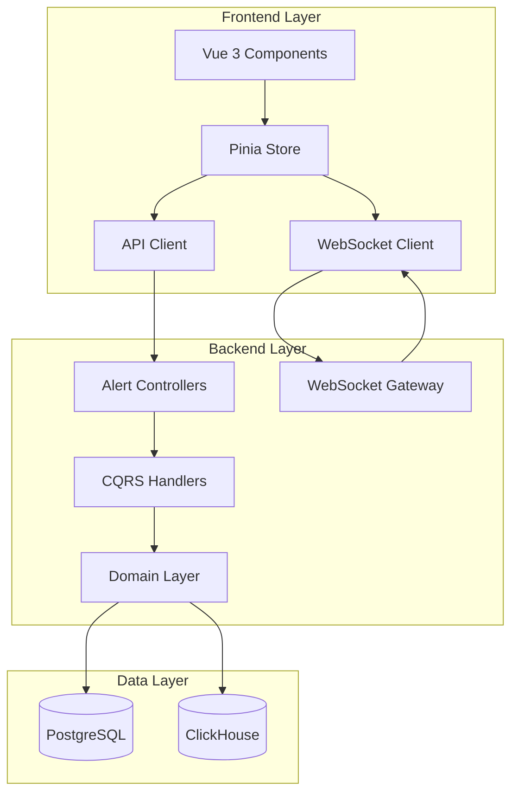
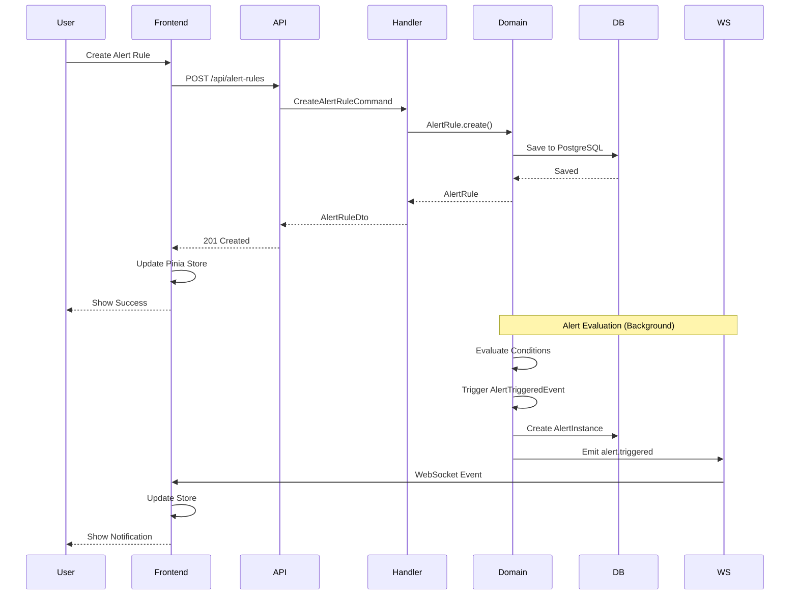

# Design Document: Frontend-Backend Alerting Integration

## Overview

This design document specifies the technical implementation for integrating the Vue 3 frontend with the NestJS backend alerting module. The integration provides a complete alerting workflow with real-time updates, comprehensive CRUD operations, and seamless user experience.

The system leverages:

- **Backend**: NestJS with DDD/CQRS architecture, TypeORM for PostgreSQL, ClickHouse for analytics
- **Frontend**: Vue 3 Composition API, Pinia for state management, Naive UI components, ECharts for visualization
- **Real-time**: WebSocket (Socket.IO) for bidirectional communication
- **API**: RESTful HTTP endpoints with OpenAPI documentation

### Architecture Diagram



## Architecture

### Backend Architecture (DDD/CQRS)

The backend follows Domain-Driven Design with CQRS pattern:

**Domain Layer:**

- `AlertRule` aggregate: Manages alert rule lifecycle and validation
- `AlertInstance` aggregate: Manages alert instance state transitions
- `AlertCondition` value object: Encapsulates TFQL query and thresholds
- `QueryDefinition` value object: Represents telemetry query configuration
- Domain events: `AlertTriggered`, `AlertAcknowledged`, `AlertResolved`

**Application Layer:**

- Commands: `CreateAlertRule`, `UpdateAlertRule`, `DeleteAlertRule`, `AcknowledgeAlert`, `ResolveAlert`, `SilenceAlert`, `ToggleAlertRule`
- Queries: `GetAlertRule`, `ListAlertRules`, `GetAlertInstance`, `ListAlertInstances`, `GetAlertStats`
- Handlers: Command and query handlers implementing business logic

**Infrastructure Layer:**

- TypeORM entities for PostgreSQL persistence
- Repository implementations
- Notification sender service
- TFQL validation service

**Presentation Layer:**

- REST controllers with Swagger documentation
- Request/Response DTOs with validation
- Permission guards

### Frontend Architecture (Vue 3 + Pinia)

The frontend follows Vue 3 Composition API patterns:

**Store Layer (Pinia):**

- `useAlertsStore`: Manages alert rules and instances state
- Actions: CRUD operations, WebSocket event handlers
- Getters: Computed properties for filtered/grouped alerts

**API Layer:**

- `alertsApi`: HTTP client for alert rule endpoints
- `alertInstancesApi`: HTTP client for alert instance endpoints
- `notificationChannelsApi`: HTTP client for channel configuration

**Component Layer:**

- Alert rule list and detail views
- Alert instance monitoring dashboard
- Alert rule form with TFQL editor
- Notification channel configuration
- Real-time alert notifications

**WebSocket Layer:**

- Connection management with reconnection logic
- Event handlers for alert updates
- Room-based subscriptions for tenant isolation

### Data Flow Diagram



## Components and Interfaces

### Backend Components

#### 1. Alert Rule Controller

```typescript
@Controller('alert-rules')
@ApiTags('Alert Rules')
export class AlertRulesController {
  @Post()
  @RequirePermissions('alerts:create')
  async createAlertRule(@Body() dto: CreateAlertRuleRequest): Promise<AlertRuleDto>

  @Get()
  @RequirePermissions('alerts:read')
  async listAlertRules(@Query() query: ListAlertRulesQuery): Promise<PaginatedResponse<AlertRuleDto>>

  @Get(':id')
  @RequirePermissions('alerts:read')
  async getAlertRule(@Param('id') id: string): Promise<AlertRuleDto>

  @Put(':id')
  @RequirePermissions('alerts:update')
  async updateAlertRule(@Param('id') id: string, @Body() dto: UpdateAlertRuleRequest): Promise<AlertRuleDto>

  @Delete(':id')
  @RequirePermissions('alerts:delete')
  async deleteAlertRule(@Param('id') id: string): Promise<void>

  @Post(':id/toggle')
  @RequirePermissions('alerts:update')
  async toggleAlertRule(@Param('id') id: string): Promise<AlertRuleDto>
}
```

#### 2. Alert Instance Controller

```typescript
@Controller('alert-instances')
@ApiTags('Alert Instances')
export class AlertInstancesController {
  @Get()
  @RequirePermissions('alerts:read')
  async listAlertInstances(@Query() query: ListAlertInstancesQuery): Promise<PaginatedResponse<AlertInstanceDto>>

  @Get(':id')
  @RequirePermissions('alerts:read')
  async getAlertInstance(@Param('id') id: string): Promise<AlertInstanceDto>

  @Post(':id/acknowledge')
  @RequirePermissions('alerts:update')
  async acknowledgeAlert(@Param('id') id: string, @Body() dto: AcknowledgeAlertRequest): Promise<AlertInstanceDto>

  @Post(':id/resolve')
  @RequirePermissions('alerts:update')
  async resolveAlert(@Param('id') id: string, @Body() dto: ResolveAlertRequest): Promise<AlertInstanceDto>

  @Post(':id/silence')
  @RequirePermissions('alerts:update')
  async silenceAlert(@Param('id') id: string, @Body() dto: SilenceAlertRequest): Promise<AlertInstanceDto>

  @Get('stats')
  @RequirePermissions('alerts:read')
  async getAlertStats(): Promise<AlertStatsDto>
}
```

#### 3. WebSocket Gateway

```typescript
@WebSocketGateway({ namespace: '/alerts' })
export class AlertsGateway {
  @SubscribeMessage('subscribe')
  handleSubscribe(client: Socket, tenantId: string): void

  @SubscribeMessage('unsubscribe')
  handleUnsubscribe(client: Socket, tenantId: string): void

  // Emit events to clients
  emitAlertTriggered(tenantId: string, alert: AlertInstanceDto): void
  emitAlertAcknowledged(tenantId: string, alert: AlertInstanceDto): void
  emitAlertResolved(tenantId: string, alert: AlertInstanceDto): void
  emitAlertRuleUpdated(tenantId: string, rule: AlertRuleDto): void
}
```

#### 4. Domain Aggregates

```typescript
// AlertRule Aggregate
class AlertRule extends AggregateRoot {
  private id: AlertRuleId;
  private name: string;
  private description: string;
  private condition: AlertCondition;
  private severity: AlertSeverity;
  private enabled: boolean;
  private notificationChannels: string[];
  private schedule?: Schedule;

  static create(props: CreateAlertRuleProps): AlertRule;
  update(props: UpdateAlertRuleProps): void;
  toggle(): void;
  evaluate(queryResult: QueryResult): boolean;
}

// AlertInstance Aggregate
class AlertInstance extends AggregateRoot {
  private id: string;
  private ruleId: AlertRuleId;
  private status: AlertStatus;
  private severity: AlertSeverity;
  private triggeredAt: Date;
  private acknowledgedAt?: Date;
  private resolvedAt?: Date;
  private silencedUntil?: Date;

  acknowledge(userId: string, note?: string): void;
  resolve(userId: string, note?: string): void;
  silence(duration: number, userId: string): void;
}
```

### Frontend Components

#### 1. Pinia Store

```typescript
export const useAlertsStore = defineStore("alerts", () => {
  // State
  const alertRules = ref<AlertRule[]>([]);
  const alertInstances = ref<AlertInstance[]>([]);
  const loading = ref(false);
  const error = ref<string | null>(null);
  const stats = ref<AlertStats | null>(null);

  // Getters
  const activeAlerts = computed(() =>
    alertInstances.value.filter((a) => a.status === "firing"),
  );

  const alertsByRule = computed(() => groupBy(alertInstances.value, "ruleId"));

  const criticalAlerts = computed(() =>
    alertInstances.value.filter((a) => a.severity === "critical"),
  );

  // Actions
  async function fetchAlertRules(query?: ListAlertRulesQuery): Promise<void>;
  async function fetchAlertInstances(
    query?: ListAlertInstancesQuery,
  ): Promise<void>;
  async function createAlertRule(
    data: CreateAlertRuleRequest,
  ): Promise<AlertRule>;
  async function updateAlertRule(
    id: string,
    data: UpdateAlertRuleRequest,
  ): Promise<AlertRule>;
  async function deleteAlertRule(id: string): Promise<void>;
  async function toggleAlertRule(id: string): Promise<AlertRule>;
  async function acknowledgeAlert(
    id: string,
    note?: string,
  ): Promise<AlertInstance>;
  async function resolveAlert(
    id: string,
    note?: string,
  ): Promise<AlertInstance>;
  async function silenceAlert(
    id: string,
    duration: number,
  ): Promise<AlertInstance>;
  async function fetchAlertStats(): Promise<AlertStats>;

  // WebSocket handlers
  function handleAlertTriggered(alert: AlertInstance): void;
  function handleAlertAcknowledged(alert: AlertInstance): void;
  function handleAlertResolved(alert: AlertInstance): void;
  function handleAlertRuleUpdated(rule: AlertRule): void;

  return {
    alertRules,
    alertInstances,
    loading,
    error,
    stats,
    activeAlerts,
    alertsByRule,
    criticalAlerts,
    fetchAlertRules,
    fetchAlertInstances,
    createAlertRule,
    updateAlertRule,
    deleteAlertRule,
    toggleAlertRule,
    acknowledgeAlert,
    resolveAlert,
    silenceAlert,
    fetchAlertStats,
    handleAlertTriggered,
    handleAlertAcknowledged,
    handleAlertResolved,
    handleAlertRuleUpdated,
  };
});
```

#### 2. API Client

```typescript
// Alert Rules API
export const alertRulesApi = {
  async list(query?: ListAlertRulesQuery): Promise<PaginatedResponse<AlertRule>>
  async get(id: string): Promise<AlertRule>
  async create(data: CreateAlertRuleRequest): Promise<AlertRule>
  async update(id: string, data: UpdateAlertRuleRequest): Promise<AlertRule>
  async delete(id: string): Promise<void>
  async toggle(id: string): Promise<AlertRule>
  async validateTfql(query: string): Promise<ValidationResult>
}

// Alert Instances API
export const alertInstancesApi = {
  async list(query?: ListAlertInstancesQuery): Promise<PaginatedResponse<AlertInstance>>
  async get(id: string): Promise<AlertInstance>
  async acknowledge(id: string, note?: string): Promise<AlertInstance>
  async resolve(id: string, note?: string): Promise<AlertInstance>
  async silence(id: string, duration: number): Promise<AlertInstance>
  async getStats(): Promise<AlertStats>
}
```

#### 3. WebSocket Client

```typescript
export class AlertsWebSocketClient {
  private socket: Socket | null = null;
  private reconnectAttempts = 0;
  private maxReconnectAttempts = 5;

  connect(tenantId: string): void;
  disconnect(): void;
  subscribe(tenantId: string): void;
  unsubscribe(tenantId: string): void;

  // Event listeners
  onAlertTriggered(callback: (alert: AlertInstance) => void): void;
  onAlertAcknowledged(callback: (alert: AlertInstance) => void): void;
  onAlertResolved(callback: (alert: AlertInstance) => void): void;
  onAlertRuleUpdated(callback: (rule: AlertRule) => void): void;

  private handleReconnect(): void;
  private handleDisconnect(): void;
}
```

#### 4. Vue Components

**AlertRulesList.vue**

- Displays paginated list of alert rules
- Supports filtering by name, severity, status
- Provides quick actions (toggle, edit, delete)
- Shows rule statistics (firing count, last triggered)

**AlertRuleForm.vue**

- Form for creating/editing alert rules
- TFQL editor with syntax highlighting and validation
- Threshold configuration
- Notification channel selection
- Schedule configuration

**AlertInstancesList.vue**

- Displays active and historical alert instances
- Real-time updates via WebSocket
- Grouping by rule, severity, or service
- Quick actions (acknowledge, resolve, silence)
- Filtering and search

**AlertInstanceDetail.vue**

- Detailed view of a single alert instance
- Timeline of status transitions
- Related telemetry data (metrics, logs, traces)
- Action buttons with confirmation dialogs

**AlertNotification.vue**

- Toast notification for new alerts
- Displays severity, rule name, and summary
- Click to navigate to alert detail
- Auto-dismiss or manual close

## Data Models

### Backend Data Models

#### PostgreSQL Schema

```sql
-- Alert Rules Table
CREATE TABLE alert_rules (
  id UUID PRIMARY KEY DEFAULT gen_random_uuid(),
  tenant_id UUID NOT NULL REFERENCES tenants(id),
  name VARCHAR(255) NOT NULL,
  description TEXT,
  condition JSONB NOT NULL,
  severity VARCHAR(20) NOT NULL CHECK (severity IN ('critical', 'warning', 'info')),
  enabled BOOLEAN DEFAULT true,
  notification_channels JSONB DEFAULT '[]',
  schedule JSONB,
  labels JSONB DEFAULT '{}',
  created_at TIMESTAMP DEFAULT NOW(),
  updated_at TIMESTAMP DEFAULT NOW(),
  created_by UUID REFERENCES users(id),
  updated_by UUID REFERENCES users(id),
  deleted_at TIMESTAMP,

  CONSTRAINT alert_rules_tenant_name_unique UNIQUE (tenant_id, name, deleted_at)
);

CREATE INDEX idx_alert_rules_tenant ON alert_rules(tenant_id) WHERE deleted_at IS NULL;
CREATE INDEX idx_alert_rules_enabled ON alert_rules(enabled) WHERE deleted_at IS NULL;

-- Alert Instances Table
CREATE TABLE alert_instances (
  id UUID PRIMARY KEY DEFAULT gen_random_uuid(),
  tenant_id UUID NOT NULL REFERENCES tenants(id),
  rule_id UUID NOT NULL REFERENCES alert_rules(id),
  status VARCHAR(20) NOT NULL CHECK (status IN ('firing', 'acknowledged', 'resolved', 'silenced')),
  severity VARCHAR(20) NOT NULL,
  triggered_at TIMESTAMP NOT NULL DEFAULT NOW(),
  acknowledged_at TIMESTAMP,
  acknowledged_by UUID REFERENCES users(id),
  acknowledged_note TEXT,
  resolved_at TIMESTAMP,
  resolved_by UUID REFERENCES users(id),
  resolved_note TEXT,
  silenced_until TIMESTAMP,
  silenced_by UUID REFERENCES users(id),
  labels JSONB DEFAULT '{}',
  context JSONB DEFAULT '{}',

  CONSTRAINT alert_instances_status_check CHECK (
    (status = 'acknowledged' AND acknowledged_at IS NOT NULL) OR
    (status = 'resolved' AND resolved_at IS NOT NULL) OR
    (status = 'silenced' AND silenced_until IS NOT NULL) OR
    (status = 'firing')
  )
);

CREATE INDEX idx_alert_instances_tenant ON alert_instances(tenant_id);
CREATE INDEX idx_alert_instances_rule ON alert_instances(rule_id);
CREATE INDEX idx_alert_instances_status ON alert_instances(status);
CREATE INDEX idx_alert_instances_triggered ON alert_instances(triggered_at DESC);

-- Notification Channels Table
CREATE TABLE notification_channels (
  id UUID PRIMARY KEY DEFAULT gen_random_uuid(),
  tenant_id UUID NOT NULL REFERENCES tenants(id),
  name VARCHAR(255) NOT NULL,
  type VARCHAR(50) NOT NULL CHECK (type IN ('email', 'slack', 'webhook', 'pagerduty', 'teams')),
  config JSONB NOT NULL,
  enabled BOOLEAN DEFAULT true,
  created_at TIMESTAMP DEFAULT NOW(),
  updated_at TIMESTAMP DEFAULT NOW(),

  CONSTRAINT notification_channels_tenant_name_unique UNIQUE (tenant_id, name)
);

CREATE INDEX idx_notification_channels_tenant ON notification_channels(tenant_id);
```

#### ClickHouse Schema

```sql
-- Alert History Table (for analytics and audit)
CREATE TABLE alert_history (
  id UUID,
  tenant_id UUID,
  alert_instance_id UUID,
  rule_id UUID,
  event_type LowCardinality(String),
  status LowCardinality(String),
  severity LowCardinality(String),
  user_id Nullable(UUID),
  note Nullable(String),
  timestamp DateTime64(3),
  labels Map(String, String),
  context String
) ENGINE = MergeTree()
PARTITION BY toYYYYMM(timestamp)
ORDER BY (tenant_id, timestamp, alert_instance_id)
TTL timestamp + INTERVAL 90 DAY;

-- Alert Metrics Table (for analytics)
CREATE TABLE alert_metrics (
  tenant_id UUID,
  rule_id UUID,
  rule_name String,
  evaluation_count UInt64,
  firing_count UInt64,
  false_positive_count UInt64,
  mtta_seconds Float64,
  mttr_seconds Float64,
  date Date,
  hour UInt8
) ENGINE = SummingMergeTree()
PARTITION BY toYYYYMM(date)
ORDER BY (tenant_id, rule_id, date, hour);
```

### Frontend Data Models

```typescript
// Alert Rule
interface AlertRule {
  id: string;
  tenantId: string;
  name: string;
  description?: string;
  condition: AlertCondition;
  severity: "critical" | "warning" | "info";
  enabled: boolean;
  notificationChannels: string[];
  schedule?: Schedule;
  labels: Record<string, string>;
  createdAt: string;
  updatedAt: string;
  createdBy?: string;
  updatedBy?: string;

  // Computed fields from backend
  firingCount?: number;
  lastTriggered?: string;
}

// Alert Condition
interface AlertCondition {
  query: string; // TFQL query
  operator: "gt" | "gte" | "lt" | "lte" | "eq" | "neq";
  threshold: number;
  duration: number; // seconds
  aggregation?: "avg" | "sum" | "min" | "max" | "count";
}

// Alert Instance
interface AlertInstance {
  id: string;
  tenantId: string;
  ruleId: string;
  ruleName: string;
  status: "firing" | "acknowledged" | "resolved" | "silenced";
  severity: "critical" | "warning" | "info";
  triggeredAt: string;
  acknowledgedAt?: string;
  acknowledgedBy?: string;
  acknowledgedNote?: string;
  resolvedAt?: string;
  resolvedBy?: string;
  resolvedNote?: string;
  silencedUntil?: string;
  silencedBy?: string;
  labels: Record<string, string>;
  context: {
    currentValue: number;
    threshold: number;
    query: string;
    affectedResources?: string[];
  };
}

// Alert Stats
interface AlertStats {
  total: number;
  firing: number;
  acknowledged: number;
  resolved: number;
  silenced: number;
  bySeverity: {
    critical: number;
    warning: number;
    info: number;
  };
  trend: {
    timestamp: string;
    count: number;
  }[];
  topRules: {
    ruleId: string;
    ruleName: string;
    firingCount: number;
  }[];
}

// Notification Channel
interface NotificationChannel {
  id: string;
  tenantId: string;
  name: string;
  type: "email" | "slack" | "webhook" | "pagerduty" | "teams";
  config: Record<string, any>;
  enabled: boolean;
  createdAt: string;
  updatedAt: string;
}

// Schedule
interface Schedule {
  timezone: string;
  timeRanges: {
    dayOfWeek: number[]; // 0-6 (Sunday-Saturday)
    startTime: string; // HH:mm
    endTime: string; // HH:mm
  }[];
}
```

## Correctness Properties

_A property is a characteristic or behavior that should hold true across all valid executions of a system—essentially, a formal statement about what the system should do. Properties serve as the bridge between human-readable specifications and machine-verifiable correctness guarantees._

### Property Reflection

After analyzing all acceptance criteria, several properties can be consolidated to avoid redundancy:

- Properties for CRUD operations (create, read, update, delete) on alert rules and notification channels follow similar patterns and can be grouped
- Permission checking properties (13.1-13.4) all verify permission enforcement and can be combined into a single comprehensive property
- WebSocket broadcast properties (3.3, 4.2, 5.5) all verify event emission and can be consolidated
- History recording properties (7.1, 7.2, 12.7) all verify audit trail creation and can be combined
- Query execution properties (9.2, 9.3, 9.4) all verify TFQL execution against different data sources and can be unified

### Core Properties

#### Property 1: Alert Rule CRUD Operations

_For any_ valid alert rule data, creating the rule via the API should persist it to PostgreSQL, return the created rule with an ID, and make it available for subsequent read operations. Updating should preserve history, deleting should soft-delete and cascade to instances, and toggling should change enabled status without deletion.

**Validates: Requirements 1.1, 1.2, 1.3, 1.4, 1.5**

#### Property 2: Frontend Store Synchronization

_For any_ alert rule or instance operation (create, update, delete, status change), when the backend API returns successfully, the Pinia store should update immediately and the UI should reflect the changes without requiring a manual refresh.

**Validates: Requirements 1.6, 3.4**

#### Property 3: TFQL Validation

_For any_ TFQL query, the validation service should verify syntax before rule creation and return descriptive error messages with position information when validation fails. The frontend should validate in real-time with debouncing and highlight errors with line and column information.

**Validates: Requirements 1.7, 11.1, 11.2, 11.5, 11.6, 11.7**

#### Property 4: Alert Template Population

_For any_ alert template selected by a user, the frontend should populate the alert rule form with all template values, allow modification of all parameters, and validate required parameters.

**Validates: Requirements 2.2, 2.3, 2.5**

#### Property 5: Alert Instance Creation and Notification

_For any_ alert rule with conditions that are met, the evaluation service should create an alert instance, trigger notifications to all configured channels, and broadcast the event via WebSocket to all connected clients in the tenant's room.

**Validates: Requirements 3.1, 3.3, 12.1**

#### Property 6: Alert Instance Filtering and Pagination

_For any_ combination of filters (severity, status, time range, rule name) and pagination parameters, the alert instance API should return only instances matching the filters, properly paginated, with correct total counts.

**Validates: Requirements 3.2, 8.1**

#### Property 7: Real-Time WebSocket Updates

_For any_ alert state change (triggered, acknowledged, resolved, silenced), the backend should emit a domain event through the WebSocket gateway, and all connected clients in the same tenant room should receive the update and reactively update their Pinia store.

**Validates: Requirements 4.2, 4.3, 4.7**

#### Property 8: WebSocket Reconnection

_For any_ WebSocket connection drop, the client should attempt reconnection with exponential backoff up to the maximum attempts, and upon successful reconnection, should sync alert state with the backend.

**Validates: Requirements 4.4, 4.5**

#### Property 9: Tenant Isolation in WebSocket

_For any_ alert event emitted for a specific tenant, only clients subscribed to that tenant's room should receive the event, ensuring complete tenant isolation.

**Validates: Requirements 4.6**

#### Property 10: Alert Status Transitions

_For any_ alert instance, acknowledging should transition to acknowledged status with timestamp and user ID, resolving should transition to resolved status and stop firing, and silencing should suppress notifications for the specified duration. Each transition should create an audit log entry and broadcast via WebSocket.

**Validates: Requirements 5.1, 5.2, 5.3, 5.4, 5.5**

#### Property 11: Status-Based UI Elements

_For any_ alert instance in a given status, the frontend should display only the valid status transition buttons for that state (e.g., firing alerts show acknowledge/resolve/silence, acknowledged alerts show resolve/silence).

**Validates: Requirements 5.6**

#### Property 12: Notification Channel CRUD

_For any_ valid notification channel configuration, creating should validate and persist to PostgreSQL, updating should validate changes, deleting should remove associations from alert rules, and testing should send a test notification and report results.

**Validates: Requirements 6.1, 6.3, 6.4, 6.5**

#### Property 13: Channel-Specific Configuration

_For any_ notification channel type (email, Slack, webhook, PagerDuty, Teams), the frontend should provide a channel-specific configuration form with appropriate validation for that channel's required fields.

**Validates: Requirements 6.6**

#### Property 14: Alert History Recording

_For any_ alert instance lifecycle event (creation, status change, notification delivery), the system should record the event in alert history with timestamp, user ID (if applicable), and details of what changed.

**Validates: Requirements 7.1, 7.2, 7.4, 12.7**

#### Property 15: Alert History Filtering and Export

_For any_ combination of history filters (date range, severity, status, rule), the system should return matching history entries, and exporting should generate complete data in CSV or JSON format with all fields.

**Validates: Requirements 7.5, 7.7**

#### Property 16: Alert Grouping

_For any_ grouping criteria (service, severity, custom labels), the frontend should organize alerts into groups, display aggregate counts for each group, and make groups expandable to show individual alerts.

**Validates: Requirements 8.2, 8.3**

#### Property 17: Filter Persistence

_For any_ filter or grouping preferences set by a user, the frontend should persist them to local storage and restore them when the user returns to the alerts page.

**Validates: Requirements 8.4**

#### Property 18: Alert Search

_For any_ search query, the system should perform full-text search across rule names, descriptions, and labels, returning all matching alerts.

**Validates: Requirements 8.5**

#### Property 19: Filtered WebSocket Updates

_For any_ active filters on the alerts page, incoming WebSocket updates should respect those filters, only displaying alerts that match the current filter criteria.

**Validates: Requirements 8.6**

#### Property 20: TFQL Multi-Signal Support

_For any_ TFQL query referencing metrics, logs, or traces, the query service should execute against the appropriate ClickHouse tables (metrics, logs, or traces) and return results in a consistent format.

**Validates: Requirements 9.1, 9.2, 9.3, 9.4**

#### Property 21: Query Builder Autocomplete

_For any_ partial input in the TFQL query builder, the frontend should provide autocomplete suggestions for metric names, log fields, and trace attributes based on available telemetry data.

**Validates: Requirements 9.6**

#### Property 22: Query Execution Error Handling

_For any_ TFQL query execution failure, the system should log the error with details, mark the alert rule as degraded, and not create false alert instances.

**Validates: Requirements 9.7**

#### Property 23: Dashboard Alert Statistics

_For any_ time range selected on the dashboard, the system should display alert statistics (total, firing, acknowledged, resolved) with counts by severity, trend data, and top firing rules. Clicking a statistic should navigate to the alerts page with appropriate filters.

**Validates: Requirements 10.1, 10.2, 10.3, 10.4, 10.5, 10.6**

#### Property 24: Form Validation

_For any_ alert rule form with validation errors (invalid TFQL, invalid thresholds, inactive channels), the frontend should prevent form submission and display clear error messages.

**Validates: Requirements 11.3, 11.4, 11.5**

#### Property 25: Notification Retry Logic

_For any_ notification delivery failure, the system should retry with exponential backoff up to 3 attempts, and if all attempts fail, should log the failure and mark the notification as failed in the alert history.

**Validates: Requirements 12.2, 12.3**

#### Property 26: Notification Rate Limiting

_For any_ notification channel type, the notification service should respect the channel's rate limits, queuing or delaying notifications as necessary to avoid exceeding limits.

**Validates: Requirements 12.4**

#### Property 27: Notification Batching

_For any_ set of alerts firing simultaneously, the system should batch notifications where supported by the channel type (e.g., Slack, email) to reduce notification volume.

**Validates: Requirements 12.5**

#### Property 28: Notification Content

_For any_ alert notification sent, it should include alert severity, rule name, condition, current value, and a link to the platform alert detail page.

**Validates: Requirements 12.6**

#### Property 29: Permission Enforcement

_For any_ alert operation (create, read, update, delete), the system should verify the user has the required permission (`alerts:create`, `alerts:read`, `alerts:update`, `alerts:delete`), return 403 Forbidden with a descriptive message if permission is denied, and audit all permission-protected operations.

**Validates: Requirements 13.1, 13.2, 13.3, 13.4, 13.6, 13.7**

#### Property 30: Permission-Based UI

_For any_ user viewing the alerts interface, the frontend should hide or disable UI elements (buttons, forms, menu items) based on the user's permissions.

**Validates: Requirements 13.5**

#### Property 31: Alert Rule Scheduling

_For any_ alert rule with a configured schedule, the system should only evaluate the rule during active time windows, skip evaluation outside the schedule with logging, and respect the configured timezone.

**Validates: Requirements 14.1, 14.4, 14.7**

#### Property 32: Schedule Type Support

_For any_ schedule type (daily, weekly, custom time ranges), the system should correctly interpret the schedule and evaluate rules only during specified times.

**Validates: Requirements 14.3**

#### Property 33: Alert Metrics Tracking

_For any_ alert rule, the system should track evaluation count, firing count, false positive rate, notification delivery success rate, MTTA, and MTTR, making these metrics available for analytics.

**Validates: Requirements 15.1, 15.2, 15.3**

#### Property 34: Noisy Rule Identification

_For any_ alert rule with high firing frequency and low acknowledgment rate, the system should identify it as a noisy rule and surface it in analytics.

**Validates: Requirements 15.6**

#### Property 35: Analytics Filtering and Export

_For any_ analytics view with filters (time range, severity, rule), the system should display filtered metrics in charts, and exporting should generate reports in CSV or JSON format.

**Validates: Requirements 15.4, 15.5, 15.7**

## Error Handling

### Backend Error Handling

**Validation Errors:**

- TFQL syntax errors: Return 400 Bad Request with error position and description
- Invalid threshold values: Return 400 Bad Request with field-specific errors
- Missing required fields: Return 400 Bad Request with list of missing fields

**Permission Errors:**

- Insufficient permissions: Return 403 Forbidden with required permission
- Invalid authentication: Return 401 Unauthorized

**Not Found Errors:**

- Alert rule not found: Return 404 Not Found
- Alert instance not found: Return 404 Not Found
- Notification channel not found: Return 404 Not Found

**Conflict Errors:**

- Duplicate alert rule name: Return 409 Conflict
- Alert instance already acknowledged: Return 409 Conflict

**Database Errors:**

- Connection failures: Retry with exponential backoff, return 503 Service Unavailable if retries exhausted
- Query timeouts: Return 504 Gateway Timeout
- Constraint violations: Return 400 Bad Request with constraint details

**External Service Errors:**

- Notification delivery failures: Retry with exponential backoff, log failure, mark as failed
- ClickHouse query failures: Log error, mark alert rule as degraded, return 500 Internal Server Error

### Frontend Error Handling

**API Errors:**

- Network errors: Display toast notification, retry with exponential backoff
- 400 Bad Request: Display validation errors inline in forms
- 401 Unauthorized: Redirect to login page
- 403 Forbidden: Display permission denied message
- 404 Not Found: Display "not found" message, offer navigation to list view
- 500 Internal Server Error: Display generic error message, log to console

**WebSocket Errors:**

- Connection failures: Attempt reconnection with exponential backoff
- Message parsing errors: Log error, ignore malformed message
- Authentication errors: Reconnect with fresh token

**Form Validation Errors:**

- Display errors inline next to fields
- Prevent form submission until errors are resolved
- Highlight invalid fields with red border

**State Management Errors:**

- Store action failures: Display toast notification, revert optimistic updates
- State corruption: Reset store to initial state, refetch data

## Testing Strategy

### Dual Testing Approach

The testing strategy employs both unit tests and property-based tests to ensure comprehensive coverage:

**Unit Tests:**

- Specific examples demonstrating correct behavior
- Edge cases (empty lists, null values, boundary conditions)
- Error conditions (invalid input, permission denied, not found)
- Integration points between components

**Property-Based Tests:**

- Universal properties across all inputs
- Comprehensive input coverage through randomization
- Minimum 100 iterations per property test
- Each test tagged with feature name and property number

### Backend Testing

**Unit Tests:**

- Domain aggregate methods (AlertRule.create, AlertInstance.acknowledge)
- Value object validation (AlertCondition, QueryDefinition)
- Command/Query handlers with mocked repositories
- Repository implementations with in-memory database
- Controller endpoints with mocked handlers

**Property-Based Tests:**

- Property 1: Alert Rule CRUD operations with random valid data
- Property 5: Alert evaluation with random conditions and data
- Property 10: Status transitions with random alert instances
- Property 14: History recording for random lifecycle events
- Property 20: TFQL execution against random queries
- Property 25: Notification retry with random failure scenarios
- Property 29: Permission enforcement with random user permissions

**Integration Tests:**

- End-to-end API tests with real database
- WebSocket gateway with real Socket.IO connections
- Notification service with mock external services
- TFQL validation service with real query parser

**BDD Tests (Postman/Newman):**

- Complete alert lifecycle scenarios
- Multi-user collaboration scenarios
- Permission-based access scenarios
- Real-time update scenarios

### Frontend Testing

**Unit Tests:**

- Pinia store actions and getters
- API client methods with mocked axios
- Composables with mocked dependencies
- Utility functions (formatters, validators)

**Property-Based Tests:**

- Property 2: Store synchronization with random operations
- Property 3: TFQL validation with random queries
- Property 8: WebSocket reconnection with random disconnects
- Property 16: Alert grouping with random grouping criteria
- Property 19: Filtered updates with random filter combinations
- Property 24: Form validation with random invalid inputs

**Component Tests:**

- Alert rule form with various input combinations
- Alert instance list with filtering and pagination
- Alert detail view with status transitions
- Notification channel configuration forms

**E2E Tests (Cypress/Playwright):**

- Complete user workflows (create rule → alert fires → acknowledge → resolve)
- Real-time updates across multiple browser tabs
- Permission-based UI element visibility
- Form validation and error handling

### Property Test Configuration

All property-based tests should:

- Run minimum 100 iterations
- Use appropriate generators for domain types
- Include shrinking for minimal failing examples
- Tag with format: `Feature: frontend-backend-alerting-integration, Property N: [property description]`

Example property test structure:

```typescript
describe("Property 1: Alert Rule CRUD Operations", () => {
  it("should persist, retrieve, update, and delete alert rules", async () => {
    await fc.assert(
      fc.asyncProperty(alertRuleGenerator(), async (alertRule) => {
        // Create
        const created = await alertRulesApi.create(alertRule);
        expect(created.id).toBeDefined();

        // Read
        const retrieved = await alertRulesApi.get(created.id);
        expect(retrieved).toMatchObject(alertRule);

        // Update
        const updates = { name: "Updated Name" };
        const updated = await alertRulesApi.update(created.id, updates);
        expect(updated.name).toBe("Updated Name");

        // Delete (soft delete)
        await alertRulesApi.delete(created.id);
        await expect(alertRulesApi.get(created.id)).rejects.toThrow();
      }),
      { numRuns: 100 },
    );
  });
});
```

### Test Coverage Requirements

- Overall: ≥90%
- Domain layer: ≥95%
- Application layer: ≥90%
- Infrastructure layer: ≥85%
- Presentation layer: ≥85%
- Frontend stores: ≥90%
- Frontend components: ≥85%

### Continuous Integration

- All tests run on every pull request
- Property tests run with increased iterations (500) on main branch
- E2E tests run on staging environment before production deployment
- Coverage reports generated and tracked over time
- Failing tests block merges to main branch
