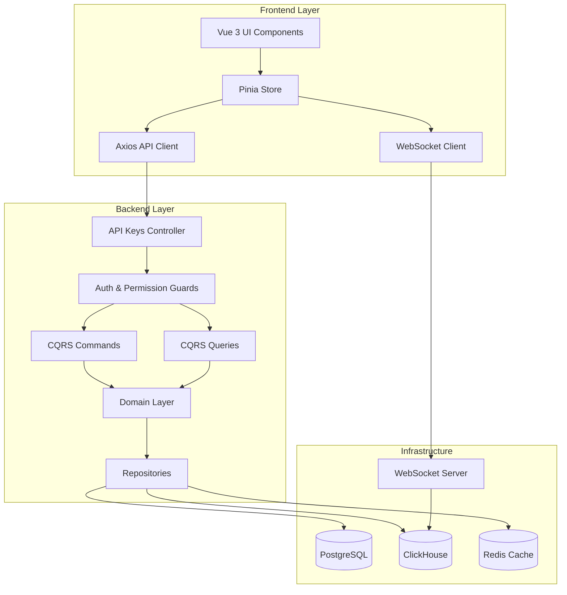
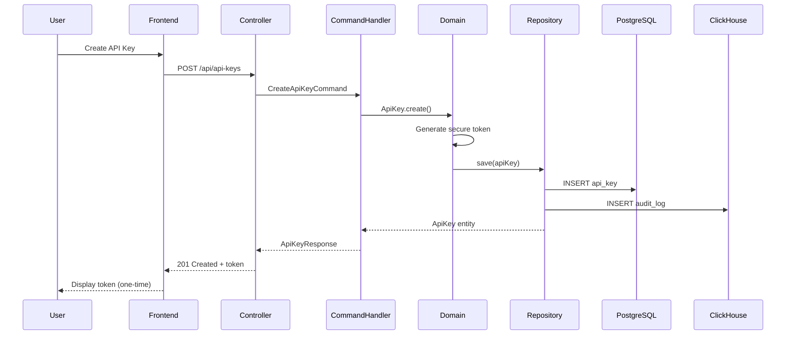
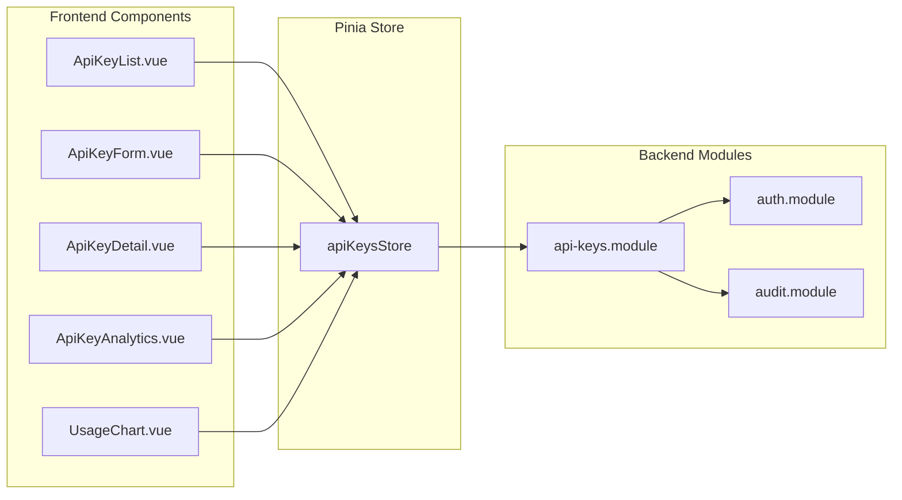
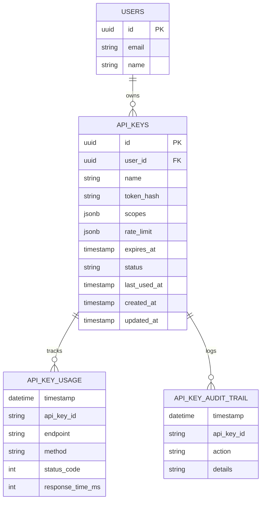

# Design Document: Frontend-Backend API Keys Integration

## Overview

This design document outlines the integration architecture for the API Keys management module between the Vue 3 frontend and NestJS backend in the TelemetryFlow Platform. The system enables secure programmatic access through cryptographically generated tokens with fine-grained permission control, rate limiting, expiration policies, and comprehensive audit trails.

The design follows Domain-Driven Design (DDD) principles with CQRS pattern on the backend, and Vue 3 Composition API with Pinia state management on the frontend. All communication occurs through RESTful APIs with real-time updates via WebSocket for usage monitoring.

### Key Design Goals

1. **Security First**: Cryptographically secure token generation, one-time display, hashed storage
2. **Scalability**: Efficient rate limiting, usage tracking in ClickHouse, optimized queries
3. **User Experience**: Intuitive UI, real-time updates, comprehensive analytics visualization
4. **Maintainability**: Clean architecture, separation of concerns, comprehensive testing
5. **Compliance**: Complete audit trail, immutable logging, security best practices

## Architecture

### System Architecture Diagram



### Data Flow Diagram



### Component Interaction Diagram



## Components and Interfaces

### Backend Components

#### Domain Layer

**ApiKey Aggregate Root**

```typescript
class ApiKey extends AggregateRoot {
  private id: ApiKeyId;
  private userId: UserId;
  private name: string;
  private tokenHash: string;
  private scopes: Scope[];
  private rateLimit: RateLimit;
  private expiresAt: Date | null;
  private status: ApiKeyStatus;
  private lastUsedAt: Date | null;
  private createdAt: Date;
  private updatedAt: Date;

  static create(props: CreateApiKeyProps): ApiKey;
  updateScopes(scopes: Scope[]): void;
  updateRateLimit(rateLimit: RateLimit): void;
  suspend(reason: string): void;
  reactivate(): void;
  revoke(reason: string): void;
  rotate(): ApiKey;
  isExpired(): boolean;
  canAuthenticate(): boolean;
}
```

**Value Objects**

```typescript
class ApiKeyId extends ValueObject<string> {}
class Scope extends ValueObject<{ resource: string; actions: string[] }> {}
class RateLimit extends ValueObject<{
  requestsPerMinute: number;
  requestsPerHour: number;
  requestsPerDay: number;
}> {}
enum ApiKeyStatus {
  ACTIVE,
  SUSPENDED,
  REVOKED,
}
```

**Repository Interface**

```typescript
interface IApiKeyRepository {
  save(apiKey: ApiKey): Promise<void>;
  findById(id: ApiKeyId): Promise<ApiKey | null>;
  findByUserId(userId: UserId): Promise<ApiKey[]>;
  findByTokenHash(tokenHash: string): Promise<ApiKey | null>;
  update(apiKey: ApiKey): Promise<void>;
  delete(id: ApiKeyId): Promise<void>;
}
```

#### Application Layer (CQRS)

**Commands**

```typescript
class CreateApiKeyCommand {
  constructor(
    public readonly userId: string,
    public readonly name: string,
    public readonly scopes: string[],
    public readonly rateLimit: RateLimitDto,
    public readonly expiresAt?: Date,
  ) {}
}

class UpdateApiKeyCommand {
  constructor(
    public readonly id: string,
    public readonly name?: string,
    public readonly scopes?: string[],
    public readonly rateLimit?: RateLimitDto,
    public readonly expiresAt?: Date,
  ) {}
}

class RevokeApiKeyCommand {
  constructor(
    public readonly id: string,
    public readonly reason?: string,
  ) {}
}

class SuspendApiKeyCommand {
  constructor(
    public readonly id: string,
    public readonly reason: string,
  ) {}
}

class RotateApiKeyCommand {
  constructor(
    public readonly id: string,
    public readonly gracePeriodHours?: number,
  ) {}
}
```

**Queries**

```typescript
class GetApiKeyQuery {
  constructor(public readonly id: string) {}
}

class GetUserApiKeysQuery {
  constructor(
    public readonly userId: string,
    public readonly filters?: ApiKeyFilters,
  ) {}
}

class GetApiKeyUsageQuery {
  constructor(
    public readonly id: string,
    public readonly startDate: Date,
    public readonly endDate: Date,
  ) {}
}

class GetApiKeyAuditTrailQuery {
  constructor(
    public readonly id: string,
    public readonly limit?: number,
  ) {}
}
```

#### Presentation Layer

**REST API Endpoints**

```typescript
@Controller('api-keys')
@ApiTags('API Keys')
@UseGuards(JwtAuthGuard, PermissionsGuard)
export class ApiKeysController {
  @Post()
  @RequirePermissions('api-keys:create')
  @ApiOperation({ summary: 'Create a new API key' })
  @ApiResponse({ status: 201, type: ApiKeyResponse })
  async create(@Body() dto: CreateApiKeyDto): Promise<ApiKeyResponse>;

  @Get()
  @RequirePermissions('api-keys:read')
  @ApiOperation({ summary: 'List all API keys for current user' })
  @ApiResponse({ status: 200, type: [ApiKeyListItemResponse] })
  async list(@Query() filters: ApiKeyFiltersDto): Promise<ApiKeyListItemResponse[]>;

  @Get(':id')
  @RequirePermissions('api-keys:read')
  @ApiOperation({ summary: 'Get API key details' })
  @ApiResponse({ status: 200, type: ApiKeyDetailResponse })
  async getById(@Param('id') id: string): Promise<ApiKeyDetailResponse>;

  @Patch(':id')
  @RequirePermissions('api-keys:update')
  @ApiOperation({ summary: 'Update API key configuration' })
  @ApiResponse({ status: 200, type: ApiKeyResponse })
  async update(@Param('id') id: string, @Body() dto: UpdateApiKeyDto): Promise<ApiKeyResponse>;

  @Delete(':id')
  @RequirePermissions('api-keys:delete')
  @ApiOperation({ summary: 'Revoke API key' })
  @ApiResponse({ status: 204 })
  async revoke(@Param('id') id: string, @Body() dto: RevokeApiKeyDto): Promise<void>;

  @Post(':id/suspend')
  @RequirePermissions('api-keys:update')
  @ApiOperation({ summary: 'Suspend API key' })
  @ApiResponse({ status: 200, type: ApiKeyResponse })
  async suspend(@Param('id') id: string, @Body() dto: SuspendApiKeyDto): Promise<ApiKeyResponse>;

  @Post(':id/reactivate')
  @RequirePermissions('api-keys:update')
  @ApiOperation({ summary: 'Reactivate suspended API key' })
  @ApiResponse({ status: 200, type: ApiKeyResponse })
  async reactivate(@Param('id') id: string): Promise<ApiKeyResponse>;

  @Post(':id/rotate')
  @RequirePermissions('api-keys:update')
  @ApiOperation({ summary: 'Rotate API key token' })
  @ApiResponse({ status: 201, type: ApiKeyResponse })
  async rotate(@Param('id') id: string, @Body() dto: RotateApiKeyDto): Promise<ApiKeyResponse>;

  @Get(':id/usage')
  @RequirePermissions('api-keys:read')
  @ApiOperation({ summary: 'Get API key usage analytics' })
  @ApiResponse({ status: 200, type: ApiKeyUsageResponse })
  async getUsage(@Param('id') id: string, @Query() query: UsageQueryDto): Promise<ApiKeyUsageResponse>;

  @Get(':id/audit-trail')
  @RequirePermissions('api-keys:read')
  @ApiOperation({ summary: 'Get API key audit trail' })
  @ApiResponse({ status: 200, type: [AuditLogResponse] })
  async getAuditTrail(@Param('id') id: string, @Query() query: AuditTrailQueryDto): Promise<AuditLogResponse[]>;
}
```

### Frontend Components

#### Pinia Store

```typescript
// store/apiKeys.ts
export const useApiKeysStore = defineStore("apiKeys", () => {
  // State
  const apiKeys = ref<ApiKey[]>([]);
  const selectedKey = ref<ApiKey | null>(null);
  const loading = ref(false);
  const error = ref<string | null>(null);
  const filters = ref<ApiKeyFilters>({});
  const usageData = ref<UsageData | null>(null);
  const auditTrail = ref<AuditLog[]>([]);

  // Getters
  const activeKeys = computed(() =>
    apiKeys.value.filter((k) => k.status === "ACTIVE"),
  );
  const expiredKeys = computed(() =>
    apiKeys.value.filter(
      (k) => k.expiresAt && new Date(k.expiresAt) < new Date(),
    ),
  );
  const keyCount = computed(() => apiKeys.value.length);

  // Actions
  const fetchApiKeys = async (filters?: ApiKeyFilters) => {
    loading.value = true;
    error.value = null;
    try {
      const response = await apiKeysApi.list(filters);
      apiKeys.value = response.data;
    } catch (e) {
      error.value = e instanceof Error ? e.message : "Failed to fetch API keys";
      throw e;
    } finally {
      loading.value = false;
    }
  };

  const createApiKey = async (data: CreateApiKeyRequest) => {
    loading.value = true;
    error.value = null;
    try {
      const response = await apiKeysApi.create(data);
      apiKeys.value.push(response.data);
      return response.data;
    } catch (e) {
      error.value = e instanceof Error ? e.message : "Failed to create API key";
      throw e;
    } finally {
      loading.value = false;
    }
  };

  const updateApiKey = async (id: string, data: UpdateApiKeyRequest) => {
    loading.value = true;
    error.value = null;
    try {
      const response = await apiKeysApi.update(id, data);
      const index = apiKeys.value.findIndex((k) => k.id === id);
      if (index !== -1) {
        apiKeys.value[index] = response.data;
      }
      return response.data;
    } catch (e) {
      error.value = e instanceof Error ? e.message : "Failed to update API key";
      throw e;
    } finally {
      loading.value = false;
    }
  };

  const revokeApiKey = async (id: string, reason?: string) => {
    loading.value = true;
    error.value = null;
    try {
      await apiKeysApi.revoke(id, reason);
      const index = apiKeys.value.findIndex((k) => k.id === id);
      if (index !== -1) {
        apiKeys.value[index].status = "REVOKED";
      }
    } catch (e) {
      error.value = e instanceof Error ? e.message : "Failed to revoke API key";
      throw e;
    } finally {
      loading.value = false;
    }
  };

  const fetchUsageData = async (id: string, startDate: Date, endDate: Date) => {
    loading.value = true;
    error.value = null;
    try {
      const response = await apiKeysApi.getUsage(id, startDate, endDate);
      usageData.value = response.data;
    } catch (e) {
      error.value =
        e instanceof Error ? e.message : "Failed to fetch usage data";
      throw e;
    } finally {
      loading.value = false;
    }
  };

  return {
    apiKeys,
    selectedKey,
    loading,
    error,
    filters,
    usageData,
    auditTrail,
    activeKeys,
    expiredKeys,
    keyCount,
    fetchApiKeys,
    createApiKey,
    updateApiKey,
    revokeApiKey,
    fetchUsageData,
  };
});
```

#### Vue Components

**ApiKeyList.vue**

```vue
<script setup lang="ts">
import { ref, computed, onMounted } from "vue";
import { useApiKeysStore } from "@/store/apiKeys";
import { storeToRefs } from "pinia";
import type { DataTableColumns } from "naive-ui";

const apiKeysStore = useApiKeysStore();
const { apiKeys, loading } = storeToRefs(apiKeysStore);

const columns: DataTableColumns = [
  { title: "Name", key: "name" },
  { title: "Status", key: "status" },
  { title: "Created", key: "createdAt" },
  { title: "Expires", key: "expiresAt" },
  { title: "Last Used", key: "lastUsedAt" },
  { title: "Actions", key: "actions" },
];

onMounted(() => {
  apiKeysStore.fetchApiKeys();
});
</script>

<template>
  <div class="api-keys-list">
    <n-data-table :columns="columns" :data="apiKeys" :loading="loading" />
  </div>
</template>
```

**ApiKeyForm.vue**

```vue
<script setup lang="ts">
import { ref } from "vue";
import { useApiKeysStore } from "@/store/apiKeys";
import type { CreateApiKeyRequest } from "@/types/apiKey";

const apiKeysStore = useApiKeysStore();
const formData = ref<CreateApiKeyRequest>({
  name: "",
  scopes: [],
  rateLimit: {
    requestsPerMinute: 60,
    requestsPerHour: 1000,
    requestsPerDay: 10000,
  },
});

const handleSubmit = async () => {
  const result = await apiKeysStore.createApiKey(formData.value);
  // Display token one-time
};
</script>
```

**ApiKeyAnalytics.vue**

```vue
<script setup lang="ts">
import { ref, computed, watch } from "vue";
import { use } from "echarts/core";
import { LineChart } from "echarts/charts";
import { GridComponent, TooltipComponent } from "echarts/components";
import { CanvasRenderer } from "echarts/renderers";
import VChart from "vue-echarts";
import type { EChartsOption } from "echarts";

use([LineChart, GridComponent, TooltipComponent, CanvasRenderer]);

interface Props {
  apiKeyId: string;
}

const props = defineProps<Props>();
const usageData = ref<any[]>([]);

const chartOptions = computed<EChartsOption>(() => ({
  title: { text: "API Key Usage" },
  tooltip: { trigger: "axis" },
  xAxis: { type: "time" },
  yAxis: { type: "value" },
  series: [
    {
      type: "line",
      data: usageData.value,
      smooth: true,
    },
  ],
}));
</script>

<template>
  <VChart :option="chartOptions" style="height: 400px" autoresize />
</template>
```

#### API Client

```typescript
// api/apiKeys.ts
import axios from "axios";
import type {
  ApiKey,
  CreateApiKeyRequest,
  UpdateApiKeyRequest,
  ApiKeyFilters,
  UsageData,
  AuditLog,
} from "@/types/apiKey";

const api = axios.create({
  baseURL: import.meta.env.TELEMETRYFLOW_API_URL,
  timeout: 30000,
});

export const apiKeysApi = {
  async list(filters?: ApiKeyFilters): Promise<{ data: ApiKey[] }> {
    const response = await api.get("/api-keys", { params: filters });
    return response.data;
  },

  async getById(id: string): Promise<{ data: ApiKey }> {
    const response = await api.get(`/api-keys/${id}`);
    return response.data;
  },

  async create(data: CreateApiKeyRequest): Promise<{ data: ApiKey }> {
    const response = await api.post("/api-keys", data);
    return response.data;
  },

  async update(
    id: string,
    data: UpdateApiKeyRequest,
  ): Promise<{ data: ApiKey }> {
    const response = await api.patch(`/api-keys/${id}`, data);
    return response.data;
  },

  async revoke(id: string, reason?: string): Promise<void> {
    await api.delete(`/api-keys/${id}`, { data: { reason } });
  },

  async suspend(id: string, reason: string): Promise<{ data: ApiKey }> {
    const response = await api.post(`/api-keys/${id}/suspend`, { reason });
    return response.data;
  },

  async reactivate(id: string): Promise<{ data: ApiKey }> {
    const response = await api.post(`/api-keys/${id}/reactivate`);
    return response.data;
  },

  async rotate(
    id: string,
    gracePeriodHours?: number,
  ): Promise<{ data: ApiKey }> {
    const response = await api.post(`/api-keys/${id}/rotate`, {
      gracePeriodHours,
    });
    return response.data;
  },

  async getUsage(
    id: string,
    startDate: Date,
    endDate: Date,
  ): Promise<{ data: UsageData }> {
    const response = await api.get(`/api-keys/${id}/usage`, {
      params: {
        startDate: startDate.toISOString(),
        endDate: endDate.toISOString(),
      },
    });
    return response.data;
  },

  async getAuditTrail(
    id: string,
    limit?: number,
  ): Promise<{ data: AuditLog[] }> {
    const response = await api.get(`/api-keys/${id}/audit-trail`, {
      params: { limit },
    });
    return response.data;
  },
};
```

## Data Models

### Database Schema

#### PostgreSQL Tables

```sql
-- API Keys table
CREATE TABLE api_keys (
  id UUID PRIMARY KEY DEFAULT gen_random_uuid(),
  user_id UUID NOT NULL REFERENCES users(id) ON DELETE CASCADE,
  name VARCHAR(255) NOT NULL,
  token_hash VARCHAR(512) NOT NULL UNIQUE,
  scopes JSONB NOT NULL DEFAULT '[]',
  rate_limit JSONB NOT NULL,
  expires_at TIMESTAMP WITH TIME ZONE,
  status VARCHAR(20) NOT NULL DEFAULT 'ACTIVE',
  last_used_at TIMESTAMP WITH TIME ZONE,
  created_at TIMESTAMP WITH TIME ZONE NOT NULL DEFAULT NOW(),
  updated_at TIMESTAMP WITH TIME ZONE NOT NULL DEFAULT NOW(),
  deleted_at TIMESTAMP WITH TIME ZONE,

  CONSTRAINT api_keys_status_check CHECK (status IN ('ACTIVE', 'SUSPENDED', 'REVOKED'))
);

CREATE INDEX idx_api_keys_user_id ON api_keys(user_id);
CREATE INDEX idx_api_keys_token_hash ON api_keys(token_hash);
CREATE INDEX idx_api_keys_status ON api_keys(status);
CREATE INDEX idx_api_keys_expires_at ON api_keys(expires_at);
```

#### ClickHouse Tables

```sql
-- API Key Usage table
CREATE TABLE api_key_usage (
  timestamp DateTime64(3),
  api_key_id String,
  user_id String,
  endpoint String,
  method String,
  status_code UInt16,
  response_time_ms UInt32,
  ip_address String,
  user_agent String,
  request_id String
) ENGINE = MergeTree()
PARTITION BY toYYYYMM(timestamp)
ORDER BY (api_key_id, timestamp);

-- API Key Audit Trail table
CREATE TABLE api_key_audit_trail (
  timestamp DateTime64(3),
  api_key_id String,
  user_id String,
  action String,
  details String,
  ip_address String,
  user_agent String
) ENGINE = MergeTree()
PARTITION BY toYYYYMM(timestamp)
ORDER BY (api_key_id, timestamp);
```

### TypeScript Types

```typescript
// types/apiKey.ts
export interface ApiKey {
  id: string;
  userId: string;
  name: string;
  tokenMasked: string;
  scopes: Scope[];
  rateLimit: RateLimit;
  expiresAt: Date | null;
  status: ApiKeyStatus;
  lastUsedAt: Date | null;
  createdAt: Date;
  updatedAt: Date;
}

export interface Scope {
  resource: string;
  actions: string[];
}

export interface RateLimit {
  requestsPerMinute: number;
  requestsPerHour: number;
  requestsPerDay: number;
}

export enum ApiKeyStatus {
  ACTIVE = "ACTIVE",
  SUSPENDED = "SUSPENDED",
  REVOKED = "REVOKED",
}

export interface CreateApiKeyRequest {
  name: string;
  scopes: string[];
  rateLimit: RateLimit;
  expiresAt?: Date;
}

export interface UpdateApiKeyRequest {
  name?: string;
  scopes?: string[];
  rateLimit?: RateLimit;
  expiresAt?: Date;
}

export interface UsageData {
  totalRequests: number;
  successRate: number;
  errorRate: number;
  avgResponseTime: number;
  timeSeries: Array<{ timestamp: number; requests: number }>;
  endpointBreakdown: Array<{ endpoint: string; count: number }>;
  statusCodeBreakdown: Array<{ statusCode: number; count: number }>;
}

export interface AuditLog {
  timestamp: Date;
  action: string;
  details: string;
  ipAddress: string;
  userAgent: string;
}
```

### Entity Relationship Diagram



## Correctness Properties

A property is a characteristic or behavior that should hold true across all valid executions of a system—essentially, a formal statement about what the system should do. Properties serve as the bridge between human-readable specifications and machine-verifiable correctness guarantees.

### Property Reflection

After analyzing all acceptance criteria, the following redundancies were identified and consolidated:

- **Redundancy 1**: Requirements 1.2 and 15.1 both specify cryptographically secure token generation with 256 bits of entropy. These are combined into Property 1.
- **Redundancy 2**: Requirements 1.4 and 15.3 both specify one-time token display. These are combined into Property 2.
- **Redundancy 3**: Multiple requirements (3.5, 4.2, 5.3, 6.4, 11.1) specify audit logging for various operations. These are combined into Property 15 for comprehensive audit logging.
- **Redundancy 4**: Requirements 2.2, 2.3, 7.3, 8.4 all relate to UI display of API key information. These are combined into Property 8 for comprehensive UI display.
- **Redundancy 5**: Requirements 13.1, 13.2, 13.3 all relate to analytics visualization. These are combined into Property 18 for comprehensive analytics display.

### Core Properties

**Property 1: Cryptographically Secure Token Generation**

_For any_ API key creation request, the generated token SHALL have at least 256 bits of entropy from a cryptographically secure random generator, and the token SHALL be unique across all existing API keys.

**Validates: Requirements 1.1, 1.2, 15.1**

**Property 2: One-Time Token Display**

_For any_ newly created or rotated API key, the plaintext token SHALL be returned exactly once in the creation/rotation response, and subsequent retrieval requests SHALL never return the plaintext token.

**Validates: Requirements 1.4, 6.3, 15.3**

**Property 3: Token Hashing Before Storage**

_For any_ API key, the token SHALL be hashed using a secure one-way hash function (e.g., SHA-256) before storage in PostgreSQL, and the plaintext token SHALL never be stored.

**Validates: Requirements 15.2**

**Property 4: API Key Creation Persistence**

_For any_ valid API key creation request, the system SHALL create both a PostgreSQL record with hashed token and metadata, and a ClickHouse audit log entry, and both SHALL be retrievable after creation.

**Validates: Requirements 1.3**

**Property 5: Future Expiration Date Validation**

_For any_ API key creation or update request that includes an expiration date, the system SHALL reject dates that are not in the future relative to the current timestamp.

**Validates: Requirements 1.5, 3.4**

**Property 6: Scope Existence Validation**

_For any_ API key creation or update request that includes scopes, the system SHALL validate that all requested scopes exist in the system and the user has permission to grant them, rejecting requests with invalid or unauthorized scopes.

**Validates: Requirements 1.6, 3.2, 7.1**

**Property 7: Rate Limit Range Validation**

_For any_ API key creation or update request that includes rate limits, the system SHALL validate that requestsPerMinute, requestsPerHour, and requestsPerDay are within system-defined maximum values, rejecting requests with out-of-range limits.

**Validates: Requirements 1.7, 3.3, 8.1**

**Property 8: Complete API Key List Retrieval**

_For any_ user with API keys, requesting the list SHALL return all API keys owned by that user with complete metadata (name, status, dates, masked token) but SHALL NOT include the plaintext token.

**Validates: Requirements 2.1, 2.2, 2.3**

**Property 9: API Key Filtering and Sorting**

_For any_ API key list with applied filters (status, expiration date, creation date) and sort criteria (name, creation date, last used date, expiration date), the returned list SHALL contain only keys matching the filters and SHALL be ordered according to the sort criteria.

**Validates: Requirements 2.4, 2.5**

**Property 10: API Key Update Validation and Persistence**

_For any_ valid API key update request, the system SHALL validate all changed fields (name, scopes, rate limits, expiration date), apply the updates to the API key, and persist the changes to PostgreSQL.

**Validates: Requirements 3.1, 3.2, 3.3, 3.4**

**Property 11: Revoked Key Immutability**

_For any_ API key in REVOKED status, update requests SHALL be rejected, and authentication attempts SHALL be immediately denied without processing.

**Validates: Requirements 3.6, 4.1, 4.3**

**Property 12: Suspension Round-Trip**

_For any_ active API key, suspending then reactivating the key SHALL restore it to ACTIVE status with all original metadata preserved, and authentication SHALL be allowed after reactivation.

**Validates: Requirements 5.1, 5.2**

**Property 13: Invalid State Transition Rejection**

_For any_ API key in REVOKED status, attempts to suspend or reactivate SHALL be rejected with an appropriate error message indicating the invalid state transition.

**Validates: Requirements 5.5**

**Property 14: API Key Rotation Metadata Preservation**

_For any_ API key rotation, the new key SHALL preserve all metadata (name, scopes, rate limits, expiration date) from the original key except for the token and creation timestamp, and the old key SHALL be marked as REVOKED.

**Validates: Requirements 6.1, 6.2**

**Property 15: Comprehensive Audit Logging**

_For any_ API key operation (create, update, revoke, suspend, reactivate, rotate, authenticate), the system SHALL create an immutable audit log entry in ClickHouse containing timestamp, user ID, API key ID, action type, and relevant context (IP address, user agent, changed fields).

**Validates: Requirements 3.5, 4.2, 5.3, 6.4, 11.1, 11.2, 11.4, 11.5**

**Property 16: Scope-Based Authorization**

_For any_ authenticated request using an API key, the system SHALL verify that the requested operation is within the key's scopes, rejecting requests for operations outside the scopes and logging the unauthorized attempt.

**Validates: Requirements 7.2, 7.5**

**Property 17: Rate Limit Enforcement**

_For any_ API key with configured rate limits, when the number of requests in a time window (minute, hour, or day) exceeds the corresponding limit, subsequent requests SHALL be rejected with a rate limit error including retry-after information, and the violation SHALL be logged.

**Validates: Requirements 8.2, 8.3, 8.5**

**Property 18: Expiration Enforcement**

_For any_ API key with an expiration date, authentication requests made after the expiration timestamp SHALL be rejected with an expiration error, and the attempt SHALL be logged in the audit trail.

**Validates: Requirements 9.1, 9.2, 9.5**

**Property 19: Usage Tracking Completeness**

_For any_ authenticated request using an API key, the system SHALL record a usage entry in ClickHouse containing timestamp, API key ID, endpoint, HTTP method, status code, response time, IP address, and user agent.

**Validates: Requirements 10.1**

**Property 20: Usage Analytics Aggregation**

_For any_ API key with usage data, querying analytics SHALL return aggregated metrics (total requests, success rate, error rate, average response time) calculated from the ClickHouse usage entries, with support for filtering by date range and aggregation by hour, day, or month.

**Validates: Requirements 10.2, 10.5**

**Property 21: Pinia Store State Synchronization**

_For any_ API key operation (fetch, create, update, delete), the Pinia store SHALL update its local state to reflect the operation result, and all subscribed Vue components SHALL reactively update their displays.

**Validates: Requirements 12.1, 12.2, 12.3**

**Property 22: Error State Management**

_For any_ failed API key operation, the system SHALL return a structured error response with error code, message, and suggested actions, and the frontend SHALL store the error state and display user-friendly messages with actionable guidance.

**Validates: Requirements 14.1, 14.2, 14.4**

**Property 23: Validation Feedback**

_For any_ form submission with validation errors, the frontend SHALL highlight the specific invalid fields and display inline validation messages without submitting the request to the backend.

**Validates: Requirements 14.3**

**Property 24: User-API Key Association**

_For any_ API key creation, the key SHALL be associated with the authenticated user's account, and the key SHALL inherit the user's base permissions combined with its scope restrictions.

**Validates: Requirements 16.1, 16.5**

**Property 25: Permission Propagation**

_For any_ user with API keys, when the user's permissions change or the account is disabled, all associated API keys SHALL have their effective permissions updated or be suspended accordingly.

**Validates: Requirements 16.3, 16.4**

**Property 26: Bulk Operation Atomicity**

_For any_ bulk operation (revoke, suspend, delete) on multiple API keys, each key SHALL be processed individually, and the response SHALL include detailed results showing which operations succeeded and which failed.

**Validates: Requirements 17.3, 17.4, 17.5**

**Property 27: Template Independence**

_For any_ API key template, creating keys from the template SHALL copy the template configuration, and subsequent updates to the template SHALL NOT affect previously created keys.

**Validates: Requirements 18.2, 18.4**

**Property 28: Export Security**

_For any_ API key data export, the exported file SHALL contain metadata (name, status, dates, scopes, rate limits) but SHALL NOT include plaintext tokens or token hashes.

**Validates: Requirements 19.1, 19.4**

**Property 29: Real-Time Usage Updates**

_For any_ API key being viewed in the frontend, when the key is used for authentication, the backend SHALL emit a WebSocket event, and the frontend SHALL update the displayed usage metrics without requiring a page refresh.

**Validates: Requirements 20.1, 20.2, 20.3, 20.4**

**Property 30: WebSocket Resilience**

_For any_ WebSocket connection failure, the frontend SHALL fall back to HTTP polling for updates and SHALL attempt to re-establish the WebSocket connection, restoring real-time updates when successful.

**Validates: Requirements 20.5**

## Error Handling

### Backend Error Handling

**Error Response Structure**

```typescript
interface ErrorResponse {
  statusCode: number;
  errorCode: string;
  message: string;
  details?: any;
  suggestedAction?: string;
  timestamp: string;
  path: string;
}
```

**Error Categories**

1. **Validation Errors (400)**
   - Invalid input format
   - Missing required fields
   - Out-of-range values
   - Invalid date formats

2. **Authentication Errors (401)**
   - Missing API key
   - Invalid API key
   - Expired API key
   - Revoked API key

3. **Authorization Errors (403)**
   - Insufficient permissions
   - Scope violations
   - Invalid state transitions

4. **Not Found Errors (404)**
   - API key not found
   - User not found
   - Scope not found

5. **Rate Limit Errors (429)**
   - Rate limit exceeded
   - Includes retry-after header

6. **Server Errors (500)**
   - Database connection failures
   - Internal processing errors
   - External service failures

### Frontend Error Handling

**Error Display Strategy**

1. **Toast Notifications**: For transient errors and success messages
2. **Inline Validation**: For form field errors
3. **Error Boundaries**: For component-level errors
4. **Retry Mechanisms**: For network failures

**Error Recovery Patterns**

```typescript
// Retry with exponential backoff
async function retryOperation<T>(
  operation: () => Promise<T>,
  maxRetries: number = 3,
  baseDelay: number = 1000,
): Promise<T> {
  for (let attempt = 0; attempt < maxRetries; attempt++) {
    try {
      return await operation();
    } catch (error) {
      if (attempt === maxRetries - 1) throw error;
      await new Promise((resolve) =>
        setTimeout(resolve, baseDelay * Math.pow(2, attempt)),
      );
    }
  }
  throw new Error("Max retries exceeded");
}

// Optimistic update with rollback
async function optimisticUpdate<T>(
  optimisticFn: () => void,
  serverFn: () => Promise<T>,
  rollbackFn: () => void,
): Promise<T> {
  optimisticFn();
  try {
    return await serverFn();
  } catch (error) {
    rollbackFn();
    throw error;
  }
}
```

## Testing Strategy

### Dual Testing Approach

The testing strategy employs both unit tests and property-based tests as complementary approaches:

- **Unit Tests**: Validate specific examples, edge cases, and error conditions
- **Property Tests**: Verify universal properties across all inputs through randomization

Together, these approaches provide comprehensive coverage where unit tests catch concrete bugs and property tests verify general correctness.

### Property-Based Testing Configuration

**Library Selection**:

- Backend: `fast-check` (TypeScript property-based testing library)
- Frontend: `fast-check` with Vue Test Utils

**Test Configuration**:

- Minimum 100 iterations per property test
- Each test tagged with feature name and property number
- Tag format: `Feature: frontend-backend-api-keys-integration, Property {N}: {property_text}`

**Example Property Test**:

```typescript
import fc from "fast-check";

describe("Feature: frontend-backend-api-keys-integration, Property 1: Cryptographically Secure Token Generation", () => {
  it("should generate tokens with at least 256 bits of entropy", async () => {
    await fc.assert(
      fc.asyncProperty(
        fc.record({
          name: fc.string({ minLength: 1, maxLength: 255 }),
          scopes: fc.array(fc.string()),
          rateLimit: fc.record({
            requestsPerMinute: fc.integer({ min: 1, max: 1000 }),
            requestsPerHour: fc.integer({ min: 1, max: 10000 }),
            requestsPerDay: fc.integer({ min: 1, max: 100000 }),
          }),
        }),
        async (createRequest) => {
          const apiKey = await apiKeyService.create(createRequest);

          // Verify token has at least 256 bits (32 bytes)
          expect(apiKey.token.length).toBeGreaterThanOrEqual(32);

          // Verify token is unique
          const duplicate = await apiKeyRepository.findByTokenHash(
            hashToken(apiKey.token),
          );
          expect(duplicate).toBeNull();
        },
      ),
      { numRuns: 100 },
    );
  });
});
```

### Unit Testing Strategy

**Backend Unit Tests**:

- Domain layer: Test aggregates, value objects, domain services (≥95% coverage)
- Application layer: Test command/query handlers (≥90% coverage)
- Infrastructure layer: Test repositories with test database (≥85% coverage)
- Presentation layer: Test controllers with mocked services (≥85% coverage)

**Frontend Unit Tests**:

- Pinia stores: Test actions, getters, state mutations
- Vue components: Test rendering, user interactions, event emissions
- API clients: Test request formatting and response handling
- Composables: Test reusable composition functions

**Example Unit Test**:

```typescript
describe("ApiKeysController", () => {
  it("should reject creation with expired expiration date", async () => {
    const pastDate = new Date(Date.now() - 86400000); // Yesterday
    const dto = {
      name: "Test Key",
      scopes: ["read:metrics"],
      rateLimit: {
        requestsPerMinute: 60,
        requestsPerHour: 1000,
        requestsPerDay: 10000,
      },
      expiresAt: pastDate,
    };

    await expect(controller.create(dto)).rejects.toThrow(
      "Expiration date must be in the future",
    );
  });
});
```

### Integration Testing

**Backend Integration Tests**:

- Test complete request flows from controller to database
- Use test database with migrations and cleanup
- Test WebSocket event emission and subscription
- Test rate limiting with Redis

**Frontend Integration Tests**:

- Test component interactions with Pinia store
- Test API client integration with mock server
- Test WebSocket connection and event handling
- Test chart rendering with mock data

### End-to-End Testing

**E2E Test Scenarios**:

1. Complete API key lifecycle (create → use → update → revoke)
2. Rate limiting enforcement across multiple requests
3. Real-time usage updates via WebSocket
4. Bulk operations on multiple keys
5. Template-based key creation
6. Export and reporting workflows

**Tools**:

- Backend: Newman (Postman CLI) for BDD scenarios
- Frontend: Playwright or Cypress for browser automation

### Test Data Generators

```typescript
// Test data generators for property tests
export const apiKeyGenerators = {
  createRequest: fc.record({
    name: fc.string({ minLength: 1, maxLength: 255 }),
    scopes: fc.array(
      fc.constantFrom(
        "read:metrics",
        "write:metrics",
        "read:logs",
        "write:logs",
      ),
    ),
    rateLimit: fc.record({
      requestsPerMinute: fc.integer({ min: 1, max: 1000 }),
      requestsPerHour: fc.integer({ min: 1, max: 10000 }),
      requestsPerDay: fc.integer({ min: 1, max: 100000 }),
    }),
    expiresAt: fc.option(
      fc.date({ min: new Date(), max: new Date(Date.now() + 31536000000) }),
    ),
  }),

  updateRequest: fc.record({
    name: fc.option(fc.string({ minLength: 1, maxLength: 255 })),
    scopes: fc.option(
      fc.array(
        fc.constantFrom(
          "read:metrics",
          "write:metrics",
          "read:logs",
          "write:logs",
        ),
      ),
    ),
    rateLimit: fc.option(
      fc.record({
        requestsPerMinute: fc.integer({ min: 1, max: 1000 }),
        requestsPerHour: fc.integer({ min: 1, max: 10000 }),
        requestsPerDay: fc.integer({ min: 1, max: 100000 }),
      }),
    ),
    expiresAt: fc.option(
      fc.date({ min: new Date(), max: new Date(Date.now() + 31536000000) }),
    ),
  }),
};
```

### Coverage Requirements

- Overall module coverage: ≥90%
- Domain layer: ≥95%
- Application layer: ≥90%
- Infrastructure layer: ≥85%
- Presentation layer: ≥85%
- Frontend components: ≥85%
- Frontend stores: ≥90%

### Continuous Testing

- Pre-commit hooks run unit tests
- CI pipeline runs all tests on pull requests
- Property tests run with 100 iterations in CI
- Coverage reports generated and enforced
- E2E tests run on staging deployments
