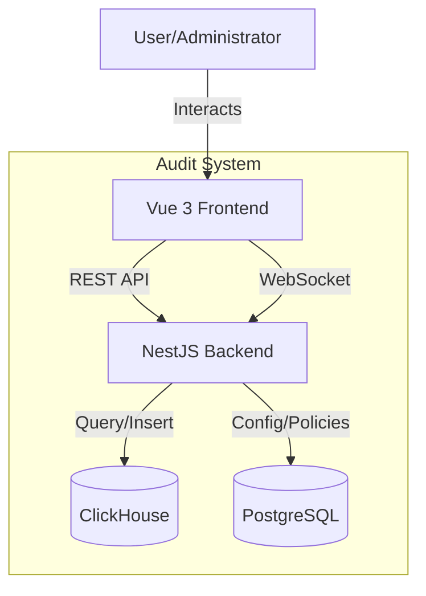
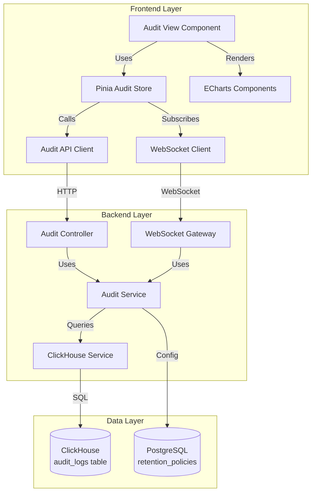
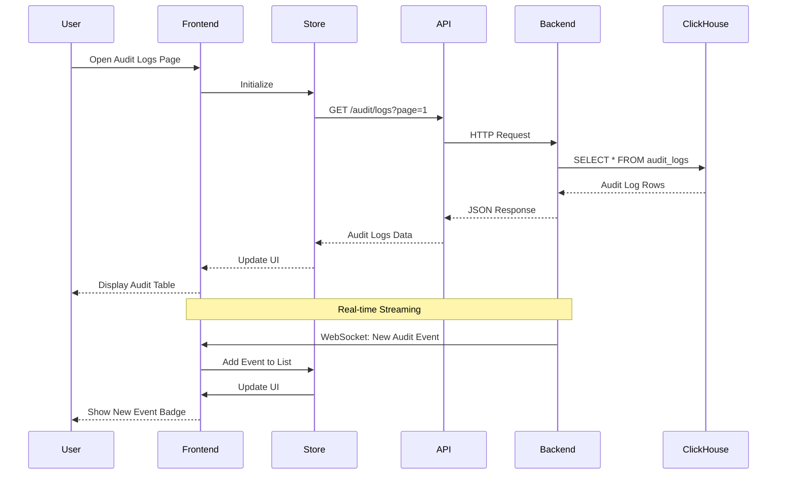

# Design Document: Frontend-Backend Audit Integration

## Overview

This design document specifies the integration between the Vue 3 frontend and NestJS backend for the audit module. The audit system provides comprehensive tracking, visualization, and management of user activities, system events, and compliance reporting across the TelemetryFlow platform.

The integration leverages existing backend infrastructure (ClickHouse for storage, TypeORM for queries) and implements a modern frontend using Vue 3 Composition API, Pinia stores, Naive UI components, and ECharts for analytics visualization. Real-time audit event streaming is provided via WebSocket connections, while REST APIs handle queries, filtering, and export operations.

### Key Design Goals

1. **Real-time Monitoring**: WebSocket-based streaming for immediate visibility into audit events
2. **Efficient Querying**: Optimized ClickHouse queries with cursor-based pagination for large datasets
3. **Rich Filtering**: Multi-dimensional filtering by time, actor, action, resource, and status
4. **Compliance Ready**: Export capabilities and retention policies for regulatory requirements
5. **Type Safety**: End-to-end TypeScript with shared interfaces between frontend and backend
6. **Performance**: Virtual scrolling, query caching, and optimized data structures for responsive UI

## Architecture

### System Context



### Component Architecture



### Data Flow



## Components and Interfaces

### Frontend Components

#### 1. Audit View Component (`views/audit/index.vue`)

Main page component for audit log viewing and management.

**Responsibilities:**

- Render audit log table with pagination
- Provide filter controls (time range, actor, action, resource, status)
- Display search input with debouncing
- Show export button with format selection
- Render analytics charts
- Handle WebSocket connection status

**Key Methods:**

```typescript
interface AuditViewComponent {
  // Lifecycle
  onMounted(): void;
  onUnmounted(): void;

  // Data fetching
  fetchAuditLogs(page: number): Promise<void>;
  refreshData(): Promise<void>;

  // Filtering
  applyFilters(filters: AuditFilters): void;
  clearFilters(): void;

  // Search
  handleSearch(query: string): void;

  // Export
  exportLogs(format: ExportFormat): Promise<void>;

  // Real-time
  connectWebSocket(): void;
  disconnectWebSocket(): void;
  handleNewEvent(event: AuditLog): void;
}
```

#### 2. Audit Store (`store/audit.ts`)

Pinia store for audit state management.

**State:**

```typescript
interface AuditState {
  logs: AuditLog[];
  loading: boolean;
  error: string | null;
  pagination: {
    page: number;
    pageSize: number;
    total: number;
    totalPages: number;
  };
  filters: AuditFilters;
  searchQuery: string;
  statistics: AuditStatistics | null;
  wsConnected: boolean;
  newEventCount: number;
}
```

**Actions:**

```typescript
interface AuditStoreActions {
  fetchLogs(page?: number): Promise<void>;
  fetchStatistics(): Promise<void>;
  applyFilters(filters: Partial<AuditFilters>): Promise<void>;
  search(query: string): Promise<void>;
  exportLogs(format: ExportFormat): Promise<Blob>;
  connectWebSocket(): void;
  disconnectWebSocket(): void;
  addNewEvent(event: AuditLog): void;
  clearNewEventCount(): void;
}
```

#### 3. Audit API Client (`api/audit.ts`)

HTTP client for audit API endpoints.

```typescript
interface AuditAPIClient {
  // Query logs
  listLogs(params: ListAuditLogsParams): Promise<PaginatedResponse<AuditLog>>;
  getLogById(id: string): Promise<AuditLog>;

  // Statistics
  getStatistics(): Promise<AuditStatistics>;
  getCount(filters?: AuditFilters): Promise<{ count: number }>;

  // Export
  exportLogs(params: ExportParams): Promise<Blob>;

  // Retention policies
  getRetentionPolicies(): Promise<RetentionPolicy[]>;
  updateRetentionPolicy(
    id: string,
    policy: Partial<RetentionPolicy>,
  ): Promise<RetentionPolicy>;
}
```

#### 4. WebSocket Client (`streaming/audit-websocket.ts`)

WebSocket client for real-time audit event streaming.

```typescript
interface AuditWebSocketClient {
  connect(token: string): void;
  disconnect(): void;
  subscribe(callback: (event: AuditLog) => void): void;
  unsubscribe(callback: (event: AuditLog) => void): void;
  isConnected(): boolean;
  reconnect(): void;
}
```

#### 5. Audit Chart Components

**TimeSeriesChart** (`components/audit/AuditTimeSeriesChart.vue`):

- Displays audit event volume over time
- Supports zoom and pan interactions
- Shows breakdown by event type or result

**EventDistributionChart** (`components/audit/EventDistributionChart.vue`):

- Pie or bar chart showing event type distribution
- Interactive legend for filtering

**TopUsersChart** (`components/audit/TopUsersChart.vue`):

- Bar chart showing most active users
- Click to filter by user

### Backend Components

#### 1. Audit Controller (`presentation/controllers/Audit.controller.ts`)

REST API controller for audit operations (already exists, needs enhancement).

**Endpoints:**

```typescript
@Controller('audit')
class AuditController {
  // Query logs
  @Get('logs')
  listLogs(@Query() query: ListAuditLogsQueryDto): Promise<PaginatedResponse<AuditLog>>;

  @Get('logs/:id')
  getById(@Param('id') id: string): Promise<AuditLog>;

  // Statistics
  @Get('statistics')
  getStatistics(@Query() query?: AuditFilters): Promise<AuditStatistics>;

  @Get('count')
  getCount(@Query() query?: AuditFilters): Promise<{ count: number }>;

  // Export
  @Post('export')
  exportLogs(@Body() params: ExportParams, @Res() res: Response): Promise<void>;

  // Retention policies
  @Get('retention-policies')
  getRetentionPolicies(): Promise<RetentionPolicy[]>;

  @Put('retention-policies/:id')
  updateRetentionPolicy(@Param('id') id: string, @Body() policy: UpdateRetentionPolicyDto): Promise<RetentionPolicy>;
}
```

#### 2. Audit Service (`audit.service.ts`)

Core service for audit operations (already exists, needs enhancement).

**Methods:**

```typescript
class AuditService {
  // Logging (existing)
  log(options: CreateAuditLogOptions): Promise<void>;
  logAuth(
    action: string,
    result: AuditEventResult,
    options?: Partial<CreateAuditLogOptions>,
  ): Promise<void>;
  logAuthz(
    action: string,
    result: AuditEventResult,
    options?: Partial<CreateAuditLogOptions>,
  ): Promise<void>;
  logData(
    action: string,
    result: AuditEventResult,
    options?: Partial<CreateAuditLogOptions>,
  ): Promise<void>;
  logSystem(
    action: string,
    result: AuditEventResult,
    options?: Partial<CreateAuditLogOptions>,
  ): Promise<void>;

  // Querying (existing, needs enhancement)
  query(options: QueryOptions): Promise<AuditLog[]>;
  getById(id: string): Promise<AuditLog | null>;
  count(filters?: AuditFilters): Promise<{ count: number }>;
  getStatistics(filters?: AuditFilters): Promise<AuditStatistics>;

  // Export (needs implementation)
  export(format: ExportFormat, filters?: AuditFilters): Promise<Buffer>;

  // Search (needs implementation)
  search(query: string, filters?: AuditFilters): Promise<AuditLog[]>;

  // Retention (needs implementation)
  getRetentionPolicies(): Promise<RetentionPolicy[]>;
  updateRetentionPolicy(
    id: string,
    policy: Partial<RetentionPolicy>,
  ): Promise<RetentionPolicy>;
  executeRetentionPolicy(
    policyId: string,
  ): Promise<{ archived: number; deleted: number }>;
}
```

#### 3. WebSocket Gateway (`presentation/gateways/audit.gateway.ts`)

WebSocket gateway for real-time audit event streaming (needs implementation).

```typescript
@WebSocketGateway({ namespace: '/audit' })
class AuditGateway {
  @WebSocketServer()
  server: Server;

  handleConnection(client: Socket): void;
  handleDisconnect(client: Socket): void;

  broadcastAuditEvent(event: AuditLog): void;

  @SubscribeMessage('subscribe')
  handleSubscribe(client: Socket, filters?: AuditFilters): void;

  @SubscribeMessage('unsubscribe')
  handleUnsubscribe(client: Socket): void;
}
```

#### 4. ClickHouse Service (shared)

Service for ClickHouse database operations (already exists in `shared/clickhouse`).

**Methods:**

```typescript
class ClickHouseService {
  getClient(): ClickHouseClient;
  query<T>(sql: string, params?: any): Promise<T[]>;
  insert(table: string, values: any[]): Promise<void>;
  execute(sql: string): Promise<void>;
}
```

## Data Models

### Frontend Types

```typescript
// types/audit.ts

export interface AuditLog {
  id: string;
  timestamp: string;
  userId: string;
  userEmail: string;
  userFirstName: string;
  userLastName: string;
  eventType: AuditEventType;
  action: string;
  resource: string;
  result: AuditEventResult;
  ipAddress: string;
  userAgent: string;
  metadata: Record<string, any>;
  errorMessage: string;
  tenantId: string;
  workspaceId: string;
  organizationId: string;
  sessionId: string;
  durationMs: number;
}

export enum AuditEventType {
  AUTH = "AUTH",
  AUTHZ = "AUTHZ",
  DATA = "DATA",
  SYSTEM = "SYSTEM",
}

export enum AuditEventResult {
  SUCCESS = "SUCCESS",
  FAILURE = "FAILURE",
  DENIED = "DENIED",
}

export interface AuditFilters {
  startDate?: string;
  endDate?: string;
  userId?: string;
  eventType?: AuditEventType;
  action?: string;
  resource?: string;
  result?: AuditEventResult;
}

export interface ListAuditLogsParams extends AuditFilters {
  page: number;
  pageSize: number;
  search?: string;
}

export interface PaginatedResponse<T> {
  data: T[];
  total: number;
  page: number;
  pageSize: number;
  totalPages: number;
  hasNext: boolean;
  hasPrevious: boolean;
}

export interface AuditStatistics {
  total: number;
  timestamp: string;
  byEventType: Record<AuditEventType, number>;
  byResult: Record<AuditEventResult, number>;
}

export interface RetentionPolicy {
  id: string;
  name: string;
  retentionDays: number;
  archiveEnabled: boolean;
  deleteAfterArchive: boolean;
  enabled: boolean;
  createdAt: string;
  updatedAt: string;
}

export type ExportFormat = "json" | "csv" | "pdf";

export interface ExportParams extends AuditFilters {
  format: ExportFormat;
}
```

### Backend DTOs

```typescript
// presentation/dto/ListAuditLogs.query.ts (already exists, needs enhancement)

export class ListAuditLogsQueryDto {
  @IsOptional()
  @Type(() => Number)
  @IsInt()
  @Min(1)
  page?: number = 1;

  @IsOptional()
  @Type(() => Number)
  @IsInt()
  @Min(1)
  @Max(100)
  pageSize?: number = 20;

  @IsOptional()
  @IsString()
  userId?: string;

  @IsOptional()
  @IsEnum(AuditEventType)
  eventType?: AuditEventType;

  @IsOptional()
  @IsEnum(AuditEventResult)
  result?: AuditEventResult;

  @IsOptional()
  @IsString()
  action?: string;

  @IsOptional()
  @IsString()
  resource?: string;

  @IsOptional()
  @IsString()
  startDate?: string;

  @IsOptional()
  @IsString()
  endDate?: string;

  @IsOptional()
  @IsString()
  search?: string;
}

// presentation/dto/ExportAuditLogs.dto.ts (needs creation)

export class ExportAuditLogsDto extends ListAuditLogsQueryDto {
  @IsEnum(["json", "csv", "pdf"])
  format: "json" | "csv" | "pdf";
}

// presentation/dto/UpdateRetentionPolicy.dto.ts (needs creation)

export class UpdateRetentionPolicyDto {
  @IsOptional()
  @IsString()
  name?: string;

  @IsOptional()
  @IsInt()
  @Min(1)
  retentionDays?: number;

  @IsOptional()
  @IsBoolean()
  archiveEnabled?: boolean;

  @IsOptional()
  @IsBoolean()
  deleteAfterArchive?: boolean;

  @IsOptional()
  @IsBoolean()
  enabled?: boolean;
}
```

### Database Schema

#### ClickHouse: audit_logs Table

```sql
CREATE TABLE IF NOT EXISTS audit_logs (
    id UUID DEFAULT generateUUIDv4(),
    timestamp DateTime64(6) DEFAULT now64(6),
    user_id String,
    user_email String,
    user_first_name String,
    user_last_name String,
    event_type Enum8('AUTH' = 1, 'AUTHZ' = 2, 'DATA' = 3, 'SYSTEM' = 4),
    action String,
    resource String,
    result Enum8('SUCCESS' = 1, 'FAILURE' = 2, 'DENIED' = 3),
    ip_address String,
    user_agent String,
    metadata String,
    error_message String,
    tenant_id String,
    workspace_id String,
    organization_id String,
    session_id String,
    duration_ms UInt32
) ENGINE = MergeTree()
PARTITION BY toYYYYMM(timestamp)
ORDER BY (timestamp, user_id, event_type)
TTL timestamp + INTERVAL 90 DAY;
```

#### PostgreSQL: retention_policies Table

```sql
CREATE TABLE retention_policies (
    id UUID PRIMARY KEY DEFAULT gen_random_uuid(),
    name VARCHAR(255) NOT NULL,
    retention_days INTEGER NOT NULL CHECK (retention_days > 0),
    archive_enabled BOOLEAN DEFAULT false,
    delete_after_archive BOOLEAN DEFAULT false,
    enabled BOOLEAN DEFAULT true,
    created_at TIMESTAMP DEFAULT CURRENT_TIMESTAMP,
    updated_at TIMESTAMP DEFAULT CURRENT_TIMESTAMP
);
```

## Correctness Properties

_A property is a characteristic or behavior that should hold true across all valid executions of a system—essentially, a formal statement about what the system should do. Properties serve as the bridge between human-readable specifications and machine-verifiable correctness guarantees._

### Property Reflection

After analyzing all acceptance criteria, I identified several areas where properties could be combined:

1. **Filter properties (2.2-2.5)** combined into a single comprehensive filter property
2. **Export format properties (4.4-4.6)** combined into a single export formatting property
3. **Event field properties (8.2-8.4)** combined into event-specific field capture
4. **Chart rendering properties (10.1-10.5)** combined into analytics visualization
5. **Schema validation properties (11.3-11.4)** combined into schema conformance
6. **Authorization properties (13.1-13.3)** combined into permission verification

### Properties

#### Property 1: Audit Log Fetching on Page Load

_For any_ audit logs page load, the Frontend should fetch audit logs from the Backend and display them in the UI.
**Validates: Requirements 1.1**

#### Property 2: Required Fields Display

_For any_ audit log displayed in the table, the rendered output should contain timestamp, actor, action, resource, status, and IP address fields.
**Validates: Requirements 1.2**

#### Property 3: Infinite Scroll Pagination

_For any_ scroll event that reaches the bottom of the audit log table, the Frontend should trigger a request for the next page of audit logs.
**Validates: Requirements 1.3**

#### Property 4: Detail View on Row Click

_For any_ audit log row click event, the Frontend should display detailed information in a modal or side panel.
**Validates: Requirements 1.4**

#### Property 5: Timestamp Descending Order

_For any_ audit log query response, the results should be ordered by timestamp in descending order (newest first).
**Validates: Requirements 1.5**

#### Property 6: Complete Response Fields

_For any_ audit log in the Backend response, the object should include actor details, resource metadata, and request context fields.
**Validates: Requirements 1.6**

#### Property 7: Time Range Filter Updates Query

_For any_ time range filter selection, the Frontend should update the audit log query with the corresponding start and end timestamp parameters.
**Validates: Requirements 2.1**

#### Property 8: Filter Combination with AND Logic

_For any_ combination of filters (actor, action, resource, status, time range), the Backend should return only audit logs that match ALL applied filters.
**Validates: Requirements 2.2, 2.3, 2.4, 2.5, 2.6**

#### Property 9: Invalid Filter Validation

_For any_ invalid filter parameter, the Backend should return a validation error response with details about the invalid field.
**Validates: Requirements 2.7**

#### Property 10: Search Query Debouncing

_For any_ sequence of rapid search input changes, the Frontend should send only one API request after the debounce period has elapsed.
**Validates: Requirements 3.1**

#### Property 11: Multi-Field Search

_For any_ search term that appears in actor name, action description, resource identifier, or metadata fields, the corresponding audit log should be included in search results.
**Validates: Requirements 3.2**

#### Property 12: Search Term Highlighting

_For any_ search result, matching terms should be highlighted in the displayed audit log fields.
**Validates: Requirements 3.3**

#### Property 13: Case-Insensitive Search

_For any_ search query, results should be identical regardless of the case of the search term.
**Validates: Requirements 3.5**

#### Property 14: Export File Generation

_For any_ export format (JSON, CSV, PDF) and filter combination, the Backend should generate an export file containing audit logs that match the filters.
**Validates: Requirements 4.2**

#### Property 15: Export Download Trigger

_For any_ completed export operation, the Frontend should trigger a file download with a filename containing the format and timestamp.
**Validates: Requirements 4.3**

#### Property 16: Export Format Compliance

_For any_ export format, the generated file should conform to the format specification: CSV with headers and escaped special characters, PDF with formatted tables and headers/footers, JSON with complete objects.
**Validates: Requirements 4.4, 4.5, 4.6**

#### Property 17: WebSocket Connection Establishment

_For any_ active audit logs page, the Frontend should establish and maintain a WebSocket connection to the Backend.
**Validates: Requirements 5.1**

#### Property 18: Event Broadcasting

_For any_ new audit event, the Backend should broadcast the event to all connected WebSocket clients.
**Validates: Requirements 5.2**

#### Property 19: Real-Time Event Prepending

_For any_ audit event received via WebSocket, the Frontend should prepend it to the top of the audit log table.
**Validates: Requirements 5.3**

#### Property 20: New Event Notification Badge

_For any_ new audit event received when the user has scrolled away from the top, the Frontend should display a notification badge indicating the count of new events.
**Validates: Requirements 5.4**

#### Property 21: WebSocket Reconnection with Exponential Backoff

_For any_ WebSocket connection loss, the Frontend should attempt to reconnect with exponentially increasing delays between attempts.
**Validates: Requirements 5.5**

#### Property 22: WebSocket Authorization Filtering

_For any_ WebSocket client, the Backend should only send audit events that the authenticated user has permission to view.
**Validates: Requirements 5.6**

#### Property 23: Retention Policy Persistence

_For any_ retention policy configuration, the Backend should store the policy in PostgreSQL and make it retrievable via query.
**Validates: Requirements 6.1**

#### Property 24: Retention Policy Execution

_For any_ retention policy execution, audit logs older than the retention period should be archived or deleted according to the policy settings.
**Validates: Requirements 6.2**

#### Property 25: Archived Log Queryability

_For any_ archived audit log, it should remain queryable through the standard audit log API.
**Validates: Requirements 6.3**

#### Property 26: Deleted Log Removal

_For any_ deleted audit log, it should not be returned by any audit log query.
**Validates: Requirements 6.4**

#### Property 27: Retention Execution Auditing

_For any_ retention policy execution, an audit log entry should be created documenting the operation and its results.
**Validates: Requirements 6.5**

#### Property 28: Compliance Report Query Matching

_For any_ compliance report generation, the Backend should query and include only audit logs that match the specified compliance criteria.
**Validates: Requirements 7.2**

#### Property 29: Compliance Report Formatting

_For any_ compliance standard (SOC 2, HIPAA, GDPR, ISO 27001), the generated report should follow the formatting requirements of that standard.
**Validates: Requirements 7.3**

#### Property 30: Compliance Report Completeness

_For any_ generated compliance report, it should include summary statistics, violation highlights, and detailed event listings.
**Validates: Requirements 7.6**

#### Property 31: Audit Log Creation for User Actions

_For any_ user action, the Backend should create an audit log entry containing actor, action, resource, and timestamp fields.
**Validates: Requirements 8.1**

#### Property 32: Event-Specific Field Capture

_For any_ audit event, the Backend should capture event-specific fields: IP address/user agent/auth method for login events, resource identifier/access type for data access events, previous/new states for permission changes.
**Validates: Requirements 8.2, 8.3, 8.4**

#### Property 33: Request Context Capture

_For any_ audit log entry, the Backend should capture request context including session ID, correlation ID, and trace ID.
**Validates: Requirements 8.5**

#### Property 34: Graceful Audit Logging Failure

_For any_ audit logging failure, the primary operation should complete successfully without being blocked by the audit logging error.
**Validates: Requirements 8.6**

#### Property 35: System Event Logging

_For any_ system event (configuration change, lifecycle event, integration event, error), the Backend should create an audit log entry with event type, severity, and details.
**Validates: Requirements 9.1, 9.2, 9.4**

#### Property 36: Error Detail Capture

_For any_ failure event, the audit log should include stack traces and error details.
**Validates: Requirements 9.5**

#### Property 37: System Event Tagging

_For any_ system event, it should be tagged differently from user events to enable filtering by event source.
**Validates: Requirements 9.6**

#### Property 38: Analytics Data Visualization

_For any_ analytics data (event volume, event distribution, user activity, resource access, failure rates), the Frontend should render an appropriate ECharts visualization with interactive tooltips and zoom.
**Validates: Requirements 10.1, 10.2, 10.3, 10.4, 10.5**

#### Property 39: Aggregated Analytics Data

_For any_ analytics query, the Backend should return aggregated data optimized for visualization rather than raw audit logs.
**Validates: Requirements 10.6**

#### Property 40: Schema Conformance

_For any_ audit log data exchanged between Frontend and Backend, the data should conform to the defined TypeScript interfaces.
**Validates: Requirements 11.3, 11.4**

#### Property 41: Request Validation

_For any_ incoming request with invalid parameters, the Backend should return validation errors detailing each invalid field.
**Validates: Requirements 11.5**

#### Property 42: Response Validation and Error Handling

_For any_ response that doesn't match the expected schema, the Frontend should handle the mismatch gracefully without crashing.
**Validates: Requirements 11.6**

#### Property 43: HTTP Status Code Correctness

_For any_ error condition, the Backend should return the appropriate HTTP status code (400 for validation errors, 401 for authentication failures, 403 for authorization failures, 404 for not found, 500 for server errors).
**Validates: Requirements 12.8**

#### Property 44: Permission-Based Authorization

_For any_ audit operation (read, export, admin), the Backend should verify the user has the required permission and return 403 Forbidden if they lack it.
**Validates: Requirements 13.1, 13.2, 13.3, 13.4**

#### Property 45: Permission-Based Data Filtering

_For any_ user, the Backend should return only audit logs that the user has permission to view based on their role and permissions.
**Validates: Requirements 13.5**

#### Property 46: Permission-Based UI Rendering

_For any_ user, the Frontend should hide UI elements for actions the user does not have permission to perform.
**Validates: Requirements 13.6**

#### Property 47: Query Performance

_For any_ audit log query on datasets up to 1 million records, the Backend should return results within 2 seconds.
**Validates: Requirements 14.1**

#### Property 48: WebSocket Connection Limits

_For any_ user, the Backend should limit the number of concurrent WebSocket connections and reject connection attempts beyond the limit.
**Validates: Requirements 14.4**

#### Property 49: Structured Error Responses

_For any_ error condition, the Backend should return a structured error response containing an error code and descriptive message.
**Validates: Requirements 15.1**

#### Property 50: User-Friendly Error Display

_For any_ error response received from the Backend, the Frontend should display a user-friendly error message to the user.
**Validates: Requirements 15.2**

#### Property 51: Connection Failure Handling

_For any_ WebSocket connection failure, the Frontend should display a connection status indicator and automatically attempt to reconnect.
**Validates: Requirements 15.3**

#### Property 52: Export Failure Messaging

_For any_ export operation failure, the Frontend should display the failure reason and suggest corrective actions.
**Validates: Requirements 15.4**

#### Property 53: Detailed Validation Errors

_For any_ validation failure, the Backend should return detailed validation errors for each invalid field.
**Validates: Requirements 15.5**

#### Property 54: Error Logging

_For any_ error encountered by the Frontend, it should be logged to the browser console for debugging while showing a simplified message to the user.
**Validates: Requirements 15.6**

## Error Handling

### Frontend Error Handling

#### API Errors

- **Network Errors**: Display "Unable to connect to server" message with retry button
- **Timeout Errors**: Display "Request timed out" message with retry button
- **4xx Errors**: Display specific error message from Backend response
- **5xx Errors**: Display "Server error occurred" message with support contact
- **Validation Errors**: Display field-specific error messages inline

#### WebSocket Errors

- **Connection Failed**: Display connection status indicator, attempt reconnection
- **Authentication Failed**: Redirect to login page
- **Message Parse Errors**: Log to console, continue operation

#### State Errors

- **Invalid State Transitions**: Reset to known good state, log error
- **Data Inconsistencies**: Refetch data from Backend, log error

### Backend Error Handling

#### Request Validation Errors

```typescript
{
  statusCode: 400,
  message: "Validation failed",
  errors: [
    { field: "startDate", message: "Invalid date format" },
    { field: "pageSize", message: "Must be between 1 and 100" }
  ]
}
```

#### Authentication Errors

```typescript
{
  statusCode: 401,
  message: "Authentication required",
  error: "Unauthorized"
}
```

#### Authorization Errors

```typescript
{
  statusCode: 403,
  message: "Insufficient permissions",
  required: "audit:read",
  error: "Forbidden"
}
```

#### Not Found Errors

```typescript
{
  statusCode: 404,
  message: "Audit log not found",
  id: "uuid-here",
  error: "Not Found"
}
```

#### Server Errors

```typescript
{
  statusCode: 500,
  message: "Internal server error",
  error: "Internal Server Error",
  timestamp: "2024-01-15T10:30:00Z"
}
```

### Error Recovery Strategies

#### Retry Logic

- **Exponential Backoff**: For WebSocket reconnection (1s, 2s, 4s, 8s, 16s, max 30s)
- **Linear Retry**: For failed API requests (3 attempts with 1s delay)
- **No Retry**: For validation errors and 4xx errors (except 429 rate limit)

#### Fallback Behavior

- **Cached Data**: Display cached audit logs if API fails
- **Degraded Mode**: Disable real-time streaming if WebSocket fails, use polling
- **Offline Mode**: Display "Offline" banner, queue actions for retry

#### User Notification

- **Toast Messages**: For transient errors (network issues, timeouts)
- **Modal Dialogs**: For critical errors requiring user action
- **Inline Messages**: For validation errors and field-specific issues
- **Status Indicators**: For connection status and background operations

## Testing Strategy

### Dual Testing Approach

The audit integration requires both unit tests and property-based tests to ensure comprehensive coverage:

- **Unit Tests**: Verify specific examples, edge cases, and error conditions
- **Property Tests**: Verify universal properties across all inputs

Together, these approaches provide comprehensive coverage where unit tests catch concrete bugs and property tests verify general correctness.

### Frontend Testing

#### Unit Tests (Vitest + Vue Test Utils)

**Component Tests:**

- Audit view component rendering
- Filter control interactions
- Search input debouncing
- Export button click handling
- Chart component rendering
- Modal/detail view display

**Store Tests:**

- State initialization
- Action execution
- Getter computations
- Error state handling

**API Client Tests:**

- Request formatting
- Response parsing
- Error handling
- Authentication header inclusion

**WebSocket Client Tests:**

- Connection establishment
- Message handling
- Reconnection logic
- Subscription management

#### Property-Based Tests (fast-check)

**Configuration:**

- Minimum 100 iterations per property test
- Each test tagged with: **Feature: frontend-backend-audit-integration, Property {number}: {property_text}**

**Property Tests:**

- Property 1: Audit log fetching on page load
- Property 2: Required fields display
- Property 3: Infinite scroll pagination
- Property 7: Time range filter updates query
- Property 10: Search query debouncing
- Property 12: Search term highlighting
- Property 15: Export download trigger
- Property 17: WebSocket connection establishment
- Property 19: Real-time event prepending
- Property 20: New event notification badge
- Property 21: WebSocket reconnection with exponential backoff
- Property 38: Analytics data visualization
- Property 42: Response validation and error handling
- Property 46: Permission-based UI rendering
- Property 50: User-friendly error display
- Property 51: Connection failure handling
- Property 52: Export failure messaging
- Property 54: Error logging

### Backend Testing

#### Unit Tests (Jest)

**Service Tests:**

- Audit log creation
- Query building
- Filter application
- Export generation
- Retention policy execution

**Controller Tests:**

- Endpoint routing
- Request validation
- Response formatting
- Error handling
- Permission checking

**Gateway Tests:**

- WebSocket connection handling
- Event broadcasting
- Client subscription management
- Authentication verification

#### Property-Based Tests (fast-check)

**Configuration:**

- Minimum 100 iterations per property test
- Each test tagged with: **Feature: frontend-backend-audit-integration, Property {number}: {property_text}**

**Property Tests:**

- Property 5: Timestamp descending order
- Property 6: Complete response fields
- Property 8: Filter combination with AND logic
- Property 9: Invalid filter validation
- Property 11: Multi-field search
- Property 13: Case-insensitive search
- Property 14: Export file generation
- Property 16: Export format compliance
- Property 18: Event broadcasting
- Property 22: WebSocket authorization filtering
- Property 23: Retention policy persistence
- Property 24: Retention policy execution
- Property 25: Archived log queryability
- Property 26: Deleted log removal
- Property 27: Retention execution auditing
- Property 28: Compliance report query matching
- Property 29: Compliance report formatting
- Property 30: Compliance report completeness
- Property 31: Audit log creation for user actions
- Property 32: Event-specific field capture
- Property 33: Request context capture
- Property 34: Graceful audit logging failure
- Property 35: System event logging
- Property 36: Error detail capture
- Property 37: System event tagging
- Property 39: Aggregated analytics data
- Property 40: Schema conformance
- Property 41: Request validation
- Property 43: HTTP status code correctness
- Property 44: Permission-based authorization
- Property 45: Permission-based data filtering
- Property 47: Query performance
- Property 48: WebSocket connection limits
- Property 49: Structured error responses
- Property 53: Detailed validation errors

#### Integration Tests

**Database Integration:**

- ClickHouse query execution
- PostgreSQL policy storage
- Data consistency across databases

**WebSocket Integration:**

- End-to-end event streaming
- Multiple client handling
- Connection lifecycle

**API Integration:**

- Full request/response cycle
- Authentication flow
- Authorization enforcement

#### E2E Tests (Postman/Newman)

**BDD Scenarios:**

- User views audit logs
- User filters audit logs by multiple criteria
- User searches audit logs
- User exports audit logs in different formats
- Administrator configures retention policies
- User receives real-time audit events
- User generates compliance reports

### Test Data Generation

**Mock Audit Logs:**

```typescript
// Generate random audit logs for testing
function generateAuditLog(): AuditLog {
  return {
    id: faker.string.uuid(),
    timestamp: faker.date.recent().toISOString(),
    userId: faker.string.uuid(),
    userEmail: faker.internet.email(),
    userFirstName: faker.person.firstName(),
    userLastName: faker.person.lastName(),
    eventType: faker.helpers.arrayElement(Object.values(AuditEventType)),
    action: faker.helpers.arrayElement([
      "login",
      "logout",
      "create_user",
      "delete_user",
    ]),
    resource: faker.helpers.arrayElement(["users", "roles", "permissions"]),
    result: faker.helpers.arrayElement(Object.values(AuditEventResult)),
    ipAddress: faker.internet.ip(),
    userAgent: faker.internet.userAgent(),
    metadata: {},
    errorMessage: "",
    tenantId: faker.string.uuid(),
    workspaceId: faker.string.uuid(),
    organizationId: faker.string.uuid(),
    sessionId: faker.string.uuid(),
    durationMs: faker.number.int({ min: 10, max: 5000 }),
  };
}
```

### Coverage Requirements

- **Frontend**: ≥85% coverage for all layers
- **Backend**: ≥90% coverage for all layers
- **Integration**: All critical paths covered
- **E2E**: All user workflows covered

### Testing Tools

**Frontend:**

- Vitest (unit test runner)
- Vue Test Utils (component testing)
- fast-check (property-based testing)
- @faker-js/faker (test data generation)

**Backend:**

- Jest (unit test runner)
- fast-check (property-based testing)
- @faker-js/faker (test data generation)
- Newman (BDD/E2E testing)

### Continuous Integration

- Run all tests on every commit
- Enforce coverage thresholds
- Block merge if tests fail
- Generate coverage reports
- Track test execution time
