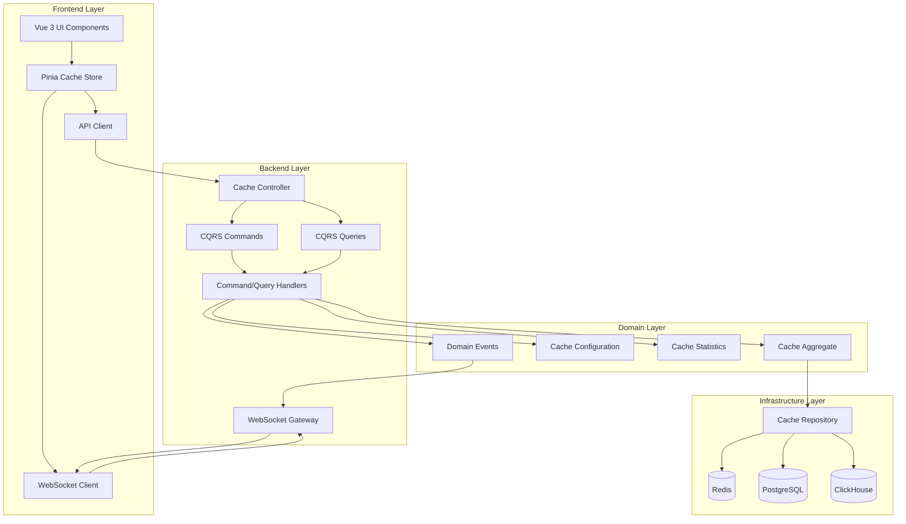
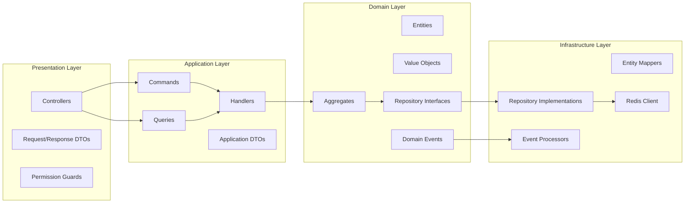

# Design Document: Frontend-Backend Cache Integration

## Overview

The cache integration feature provides a comprehensive management interface for Redis-based caching in the TelemetryFlow platform. The design follows the established DDD/CQRS architecture on the backend and Vue 3 Composition API patterns on the frontend, ensuring consistency with existing modules like alerting and API keys.

The system enables administrators to monitor cache performance, manage cache keys, configure cache behavior, and optimize cache usage through real-time metrics, analytics, and automated recommendations. The integration leverages Redis for caching, PostgreSQL for configuration storage, ClickHouse for analytics, and WebSocket for real-time updates.

### Key Design Goals

1. **Performance Monitoring**: Real-time visibility into cache hit rates, memory usage, and operation throughput
2. **Key Management**: Intuitive interface for viewing, searching, and managing cache keys
3. **Configuration Control**: Flexible configuration of TTL, eviction policies, and warming strategies
4. **Analytics and Insights**: Historical analysis and automated recommendations for optimization
5. **Audit and Compliance**: Complete audit trail of all cache operations
6. **Real-time Updates**: WebSocket-based live metrics without polling

## Architecture

### System Architecture



### DDD Layer Structure



## Components and Interfaces

### Frontend Components

#### 1. Cache Dashboard Component

**Purpose**: Main dashboard displaying cache statistics and health

**Props**:

- None (fetches data from store)

**State**:

```typescript
interface CacheDashboardState {
  statistics: CacheStatistics;
  health: CacheHealth;
  loading: boolean;
  error: string | null;
  refreshInterval: number;
}
```

**Key Methods**:

- `fetchStatistics()`: Load cache statistics
- `fetchHealth()`: Check cache health
- `startAutoRefresh()`: Begin periodic updates
- `stopAutoRefresh()`: Stop periodic updates

#### 2. Cache Keys List Component

**Purpose**: Display and manage cache keys with search and filtering

**Props**:

```typescript
interface CacheKeysListProps {
  namespace?: string;
  initialFilters?: CacheKeyFilters;
}
```

**State**:

```typescript
interface CacheKeysListState {
  keys: CacheKey[];
  selectedKeys: string[];
  filters: CacheKeyFilters;
  pagination: PaginationState;
  loading: boolean;
  sortBy: "name" | "size" | "ttl" | "lastAccessed";
  sortOrder: "asc" | "desc";
}
```

**Key Methods**:

- `fetchKeys()`: Load cache keys
- `searchKeys(pattern: string)`: Search by pattern
- `applyFilters(filters: CacheKeyFilters)`: Apply filters
- `selectKey(key: string)`: Select key for bulk operations
- `deleteKeys(keys: string[])`: Delete selected keys
- `invalidateKeys(keys: string[])`: Invalidate selected keys

#### 3. Cache Key Detail Component

**Purpose**: Display detailed information about a single cache key

**Props**:

```typescript
interface CacheKeyDetailProps {
  keyName: string;
}
```

**State**:

```typescript
interface CacheKeyDetailState {
  entry: CacheEntry | null;
  loading: boolean;
  error: string | null;
  showRawValue: boolean;
}
```

**Key Methods**:

- `fetchKeyDetail()`: Load key details
- `updateTTL(ttl: number)`: Update key TTL
- `deleteKey()`: Delete the key
- `copyValue()`: Copy value to clipboard
- `refreshKey()`: Reload key data

#### 4. Cache Analytics Component

**Purpose**: Display cache performance analytics and charts

**Props**:

```typescript
interface CacheAnalyticsProps {
  timeRange: TimeRange;
}
```

**State**:

```typescript
interface CacheAnalyticsState {
  hitRateData: TimeSeriesData;
  memoryUsageData: TimeSeriesData;
  topKeys: TopAccessedKey[];
  namespaceStats: NamespaceStatistics[];
  loading: boolean;
}
```

**Key Methods**:

- `fetchAnalytics()`: Load analytics data
- `updateTimeRange(range: TimeRange)`: Change time range
- `exportData(format: 'csv' | 'json')`: Export analytics

#### 5. Cache Configuration Component

**Purpose**: Manage cache configuration settings

**Props**:

- None (fetches data from store)

**State**:

```typescript
interface CacheConfigurationState {
  config: CacheConfiguration;
  originalConfig: CacheConfiguration;
  isDirty: boolean;
  saving: boolean;
  validationErrors: Record<string, string>;
}
```

**Key Methods**:

- `fetchConfiguration()`: Load current config
- `updateConfiguration(config: Partial<CacheConfiguration>)`: Update config
- `saveConfiguration()`: Persist changes
- `resetConfiguration()`: Revert to original
- `validateConfiguration()`: Validate settings

### Backend Components

#### Domain Layer

##### Cache Aggregate

```typescript
class Cache extends AggregateRoot {
  private readonly key: CacheKey;
  private value: any;
  private ttl: number | null;
  private metadata: CacheMetadata;

  constructor(key: CacheKey, value: any, ttl?: number) {
    super();
    this.key = key;
    this.value = value;
    this.ttl = ttl ?? null;
    this.metadata = new CacheMetadata();
  }

  get()
```
