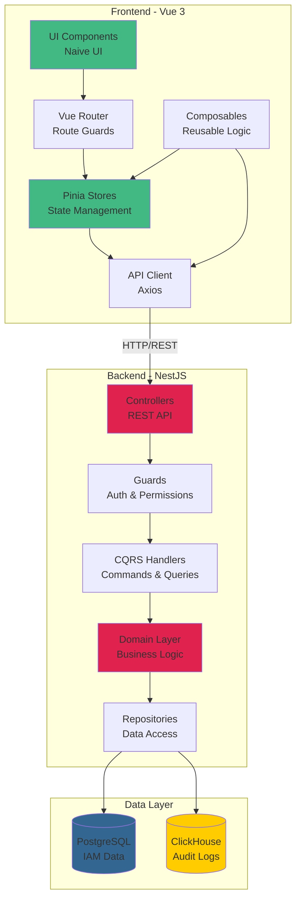
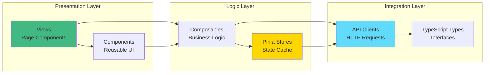
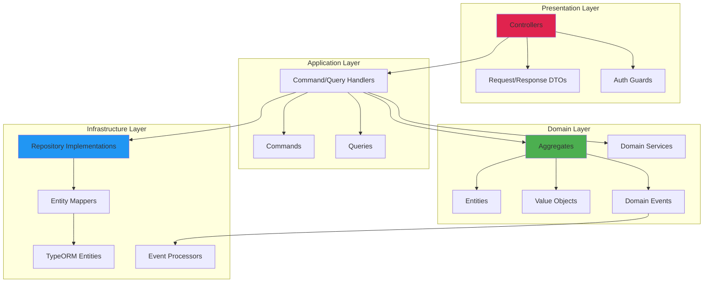
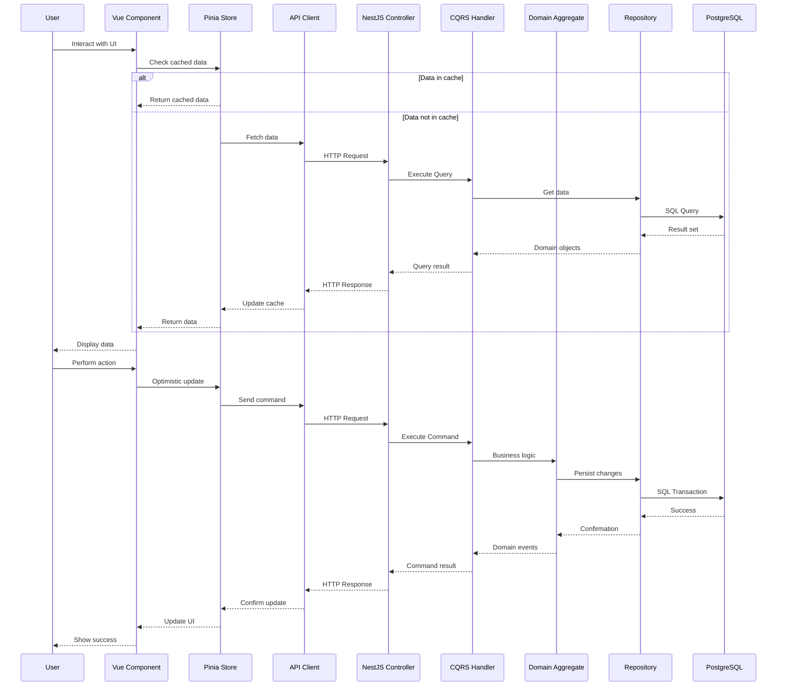
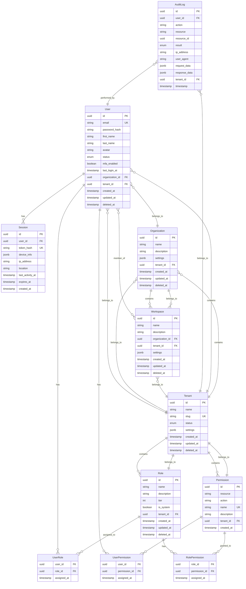

# Design Document: Frontend-Backend IAM Integration

## Overview

This design document specifies the integration architecture between the Vue 3 frontend and NestJS backend for the Identity and Access Management (IAM) module. The integration follows modern web application patterns with a clear separation between presentation, state management, API communication, and backend business logic.

### Key Design Principles

1. **Separation of Concerns**: Frontend handles presentation and user interaction; Backend handles business logic and data persistence
2. **Type Safety**: TypeScript throughout the stack with shared type definitions
3. **State Management**: Centralized Pinia stores for caching and reactive updates
4. **API-First**: RESTful API design with comprehensive OpenAPI documentation
5. **Performance**: Optimistic updates, caching, pagination, and lazy loading
6. **Security**: JWT authentication, permission-based access control, secure token storage
7. **Testability**: Comprehensive unit, integration, and e2e tests
8. **Maintainability**: Clear code organization following established patterns

### Technology Stack Summary

**Frontend:**

- Vue 3.5+ with Composition API and `<script setup>`
- TypeScript 5.7 with strict mode
- Pinia 3.0+ for state management
- Naive UI 2.43+ for components
- Axios 1.13+ for HTTP requests
- ECharts 5.6+ for data visualization
- Vue Router 4.6+ for routing

**Backend:**

- NestJS 11.x with DDD/CQRS architecture
- TypeScript 5.9 with strict mode
- TypeORM 0.3 with PostgreSQL 16
- JWT with Passport.js for authentication
- Argon2 for password hashing
- Winston for logging
- OpenTelemetry for observability

## Architecture

### High-Level Architecture



### Frontend Architecture



### Backend Architecture (DDD/CQRS)



### Data Flow Diagram



## Components and Interfaces

### Frontend Components

#### 1. API Client Layer

**Location:** `frontend/src/api/`

**Purpose:** Centralized HTTP communication with backend endpoints

**Key Files:**

- `iam.ts` - General IAM operations
- `users.ts` - User management endpoints
- `roles.ts` - Role management endpoints
- `permissions.ts` - Permission management endpoints
- `organizations.ts` - Organization endpoints
- `workspaces.ts` - Workspace endpoints
- `tenants.ts` - Tenant endpoints
- `sessions.ts` - Session management endpoints
- `profile.ts` - User profile endpoints
- `audit.ts` - Audit log endpoints

**API Client Structure:**

```typescript
// frontend/src/api/users.ts
import axios from "axios";
import type {
  User,
  CreateUserRequest,
  UpdateUserRequest,
  PaginatedResponse,
} from "@/types/iam";

const BASE_URL = import.meta.env.TELEMETRYFLOW_API_URL;

export const usersApi = {
  /**
   * Fetch all users with pagination
   */
  async getAll(
    page: number = 1,
    limit: number = 20,
  ): Promise<PaginatedResponse<User>> {
    const response = await axios.get(`${BASE_URL}/api/iam/users`, {
      params: { page, limit },
    });
    return response.data;
  },

  /**
   * Fetch a single user by ID
   */
  async getById(id: string): Promise<User> {
    const response = await axios.get(`${BASE_URL}/api/iam/users/${id}`);
    return response.data;
  },

  /**
   * Create a new user
   */
  async create(data: CreateUserRequest): Promise<User> {
    const response = await axios.post(`${BASE_URL}/api/iam/users`, data);
    return response.data;
  },

  /**
   * Update an existing user
   */
  async update(id: string, data: UpdateUserRequest): Promise<User> {
    const response = await axios.patch(`${BASE_URL}/api/iam/users/${id}`, data);
    return response.data;
  },

  /**
   * Delete a user (soft delete)
   */
  async delete(id: string): Promise<void> {
    await axios.delete(`${BASE_URL}/api/iam/users/${id}`);
  },

  /**
   * Search users by query
   */
  async search(
    query: string,
    page: number = 1,
    limit: number = 20,
  ): Promise<PaginatedResponse<User>> {
    const response = await axios.get(`${BASE_URL}/api/iam/users/search`, {
      params: { q: query, page, limit },
    });
    return response.data;
  },
};
```

#### 2. Pinia Store Layer

**Location:** `frontend/src/store/`

**Purpose:** Centralized state management with caching and reactive updates

**Store Structure:**

```typescript
// frontend/src/store/users.ts
import { defineStore } from "pinia";
import { ref, computed } from "vue";
import type { User, CreateUserRequest, UpdateUserRequest } from "@/types/iam";
import { usersApi } from "@/api/users";

export const useUsersStore = defineStore("users", () => {
  // State
  const users = ref<User[]>([]);
  const currentUser = ref<User | null>(null);
  const loading = ref(false);
  const error = ref<string | null>(null);
  const totalCount = ref(0);
  const currentPage = ref(1);
  const pageSize = ref(20);

  // Getters
  const activeUsers = computed(() =>
    users.value.filter((u) => u.status === "active"),
  );
  const userCount = computed(() => users.value.length);
  const hasUsers = computed(() => users.value.length > 0);
  const totalPages = computed(() =>
    Math.ceil(totalCount.value / pageSize.value),
  );

  // Actions
  const fetchUsers = async (page: number = 1, limit: number = 20) => {
    loading.value = true;
    error.value = null;
    try {
      const response = await usersApi.getAll(page, limit);
      users.value = response.data;
      totalCount.value = response.total;
      currentPage.value = page;
      pageSize.value = limit;
    } catch (e) {
      error.value = e instanceof Error ? e.message : "Failed to fetch users";
      throw e;
    } finally {
      loading.value = false;
    }
  };

  const fetchUserById = async (id: string) => {
    loading.value = true;
    error.value = null;
    try {
      const user = await usersApi.getById(id);
      currentUser.value = user;

      // Update cache if user exists
      const index = users.value.findIndex((u) => u.id === id);
      if (index !== -1) {
        users.value[index] = user;
      }

      return user;
    } catch (e) {
      error.value = e instanceof Error ? e.message : "Failed to fetch user";
      throw e;
    } finally {
      loading.value = false;
    }
  };

  const createUser = async (data: CreateUserRequest) => {
    loading.value = true;
    error.value = null;
    try {
      const newUser = await usersApi.create(data);
      users.value.unshift(newUser);
      totalCount.value++;
      return newUser;
    } catch (e) {
      error.value = e instanceof Error ? e.message : "Failed to create user";
      throw e;
    } finally {
      loading.value = false;
    }
  };

  const updateUser = async (id: string, data: UpdateUserRequest) => {
    loading.value = true;
    error.value = null;

    // Optimistic update
    const index = users.value.findIndex((u) => u.id === id);
    const originalUser = index !== -1 ? { ...users.value[index] } : null;

    if (index !== -1) {
      users.value[index] = { ...users.value[index], ...data };
    }

    try {
      const updatedUser = await usersApi.update(id, data);
      if (index !== -1) {
        users.value[index] = updatedUser;
      }
      if (currentUser.value?.id === id) {
        currentUser.value = updatedUser;
      }
      return updatedUser;
    } catch (e) {
      // Revert optimistic update
      if (index !== -1 && originalUser) {
        users.value[index] = originalUser;
      }
      error.value = e instanceof Error ? e.message : "Failed to update user";
      throw e;
    } finally {
      loading.value = false;
    }
  };

  const deleteUser = async (id: string) => {
    loading.value = true;
    error.value = null;

    // Optimistic delete
    const index = users.value.findIndex((u) => u.id === id);
    const deletedUser = index !== -1 ? users.value[index] : null;

    if (index !== -1) {
      users.value.splice(index, 1);
      totalCount.value--;
    }

    try {
      await usersApi.delete(id);
    } catch (e) {
      // Revert optimistic delete
      if (deletedUser) {
        users.value.splice(index, 0, deletedUser);
        totalCount.value++;
      }
      error.value = e instanceof Error ? e.message : "Failed to delete user";
      throw e;
    } finally {
      loading.value = false;
    }
  };

  const searchUsers = async (
    query: string,
    page: number = 1,
    limit: number = 20,
  ) => {
    loading.value = true;
    error.value = null;
    try {
      const response = await usersApi.search(query, page, limit);
      users.value = response.data;
      totalCount.value = response.total;
      currentPage.value = page;
    } catch (e) {
      error.value = e instanceof Error ? e.message : "Failed to search users";
      throw e;
    } finally {
      loading.value = false;
    }
  };

  const clearUsers = () => {
    users.value = [];
    currentUser.value = null;
    error.value = null;
    totalCount.value = 0;
  };

  return {
    // State
    users,
    currentUser,
    loading,
    error,
    totalCount,
    currentPage,
    pageSize,
    // Getters
    activeUsers,
    userCount,
    hasUsers,
    totalPages,
    // Actions
    fetchUsers,
    fetchUserById,
    createUser,
    updateUser,
    deleteUser,
    searchUsers,
    clearUsers,
  };
});
```

#### 3. Vue Components

**Location:** `frontend/src/views/iam/`

**Component Structure:**

```
views/iam/
├── users/
│   ├── index.vue              # User list page
│   ├── detail.vue             # User detail page
│   └── components/
│       ├── UserForm.vue       # Create/Edit user form
│       ├── UserTable.vue      # User data table
│       └── UserFilters.vue    # Search and filter controls
├── roles/
│   ├── index.vue              # Role list page
│   └── components/
│       ├── RoleForm.vue
│       ├── RoleTable.vue
│       └── PermissionsModal.vue
├── permissions/
│   ├── index.vue              # Permission list page
│   └── components/
│       ├── PermissionMatrix.vue
│       └── PermissionForm.vue
├── organizations/
│   ├── index.vue
│   └── components/
│       ├── OrgTree.vue
│       └── OrgForm.vue
├── workspaces/
│   ├── index.vue
│   └── components/
│       ├── WorkspaceCard.vue
│       └── WorkspaceForm.vue
├── tenants/
│   ├── index.vue
│   └── components/
│       ├── TenantCard.vue
│       ├── TenantForm.vue
│       └── ResourceUsageChart.vue
├── sessions/
│   ├── index.vue
│   └── components/
│       ├── SessionTable.vue
│       └── SessionCard.vue
└── overview/
    └── index.vue              # IAM dashboard
```

**Example Component:**

```vue
<!-- frontend/src/views/iam/users/index.vue -->
<script setup lang="ts">
import { ref, onMounted, computed } from "vue";
import { useUsersStore } from "@/store/users";
import { useMessage } from "naive-ui";
import { storeToRefs } from "pinia";
import UserTable from "./components/UserTable.vue";
import UserForm from "./components/UserForm.vue";
import UserFilters from "./components/UserFilters.vue";

const usersStore = useUsersStore();
const message = useMessage();

const { users, loading, totalCount, currentPage, pageSize } =
  storeToRefs(usersStore);

const showCreateModal = ref(false);
const searchQuery = ref("");

const loadUsers = async (page: number = 1) => {
  try {
    if (searchQuery.value) {
      await usersStore.searchUsers(searchQuery.value, page, pageSize.value);
    } else {
      await usersStore.fetchUsers(page, pageSize.value);
    }
  } catch (error) {
    message.error("Failed to load users");
  }
};

const handleSearch = async (query: string) => {
  searchQuery.value = query;
  await loadUsers(1);
};

const handlePageChange = async (page: number) => {
  await loadUsers(page);
};

const handleCreateUser = async (userData: any) => {
  try {
    await usersStore.createUser(userData);
    message.success("User created successfully");
    showCreateModal.value = false;
  } catch (error) {
    message.error("Failed to create user");
  }
};

const handleDeleteUser = async (userId: string) => {
  try {
    await usersStore.deleteUser(userId);
    message.success("User deleted successfully");
  } catch (error) {
    message.error("Failed to delete user");
  }
};

onMounted(() => {
  loadUsers();
});
</script>

<template>
  <div class="users-page">
    <n-space vertical :size="16">
      <n-card title="User Management">
        <template #header-extra>
          <n-button type="primary" @click="showCreateModal = true">
            <template #icon>
              <n-icon><i-carbon-add /></n-icon>
            </template>
            Create User
          </n-button>
        </template>

        <UserFilters @search="handleSearch" />

        <UserTable
          :users="users"
          :loading="loading"
          :total="totalCount"
          :page="currentPage"
          :page-size="pageSize"
          @page-change="handlePageChange"
          @delete="handleDeleteUser"
        />
      </n-card>
    </n-space>

    <n-modal
      v-model:show="showCreateModal"
      preset="card"
      title="Create User"
      style="width: 600px"
    >
      <UserForm @submit="handleCreateUser" @cancel="showCreateModal = false" />
    </n-modal>
  </div>
</template>

<style scoped lang="scss">
.users-page {
  padding: 24px;
}
</style>
```

#### 4. Composables

**Location:** `frontend/src/composables/`

**Purpose:** Reusable composition functions for common IAM operations

```typescript
// frontend/src/composables/useIAMPermissions.ts
import { computed } from "vue";
import { useAuthStore } from "@/store/auth";

export function useIAMPermissions() {
  const authStore = useAuthStore();

  const hasPermission = (permission: string): boolean => {
    return authStore.permissions.includes(permission);
  };

  const hasAnyPermission = (permissions: string[]): boolean => {
    return permissions.some((p) => hasPermission(p));
  };

  const hasAllPermissions = (permissions: string[]): boolean => {
    return permissions.every((p) => hasPermission(p));
  };

  const canManageUsers = computed(() => hasPermission("users:manage"));
  const canManageRoles = computed(() => hasPermission("roles:manage"));
  const canManagePermissions = computed(() =>
    hasPermission("permissions:manage"),
  );
  const canViewAuditLogs = computed(() => hasPermission("audit:view"));

  return {
    hasPermission,
    hasAnyPermission,
    hasAllPermissions,
    canManageUsers,
    canManageRoles,
    canManagePermissions,
    canViewAuditLogs,
  };
}
```

```typescript
// frontend/src/composables/useIAMTable.ts
import { ref, computed } from "vue";
import type { DataTableColumns } from "naive-ui";

export function useIAMTable<T>(
  fetchFn: (page: number, limit: number) => Promise<void>,
  initialPageSize: number = 20,
) {
  const loading = ref(false);
  const currentPage = ref(1);
  const pageSize = ref(initialPageSize);
  const searchQuery = ref("");

  const loadData = async (page: number = currentPage.value) => {
    loading.value = true;
    try {
      await fetchFn(page, pageSize.value);
      currentPage.value = page;
    } finally {
      loading.value = false;
    }
  };

  const handlePageChange = (page: number) => {
    loadData(page);
  };

  const handlePageSizeChange = (size: number) => {
    pageSize.value = size;
    loadData(1);
  };

  const handleSearch = (query: string) => {
    searchQuery.value = query;
    loadData(1);
  };

  const refresh = () => {
    loadData(currentPage.value);
  };

  return {
    loading,
    currentPage,
    pageSize,
    searchQuery,
    loadData,
    handlePageChange,
    handlePageSizeChange,
    handleSearch,
    refresh,
  };
}
```

### Backend Components

#### 1. Controllers

**Location:** `backend/src/modules/iam/presentation/controllers/`

**Purpose:** REST API endpoints with Swagger documentation

**Controller Structure:**

```typescript
// backend/src/modules/iam/presentation/controllers/User.controller.ts
import {
  Controller,
  Get,
  Post,
  Patch,
  Delete,
  Body,
  Param,
  Query,
  UseGuards,
  HttpCode,
  HttpStatus,
} from "@nestjs/common";
import { CommandBus, QueryBus } from "@nestjs/cqrs";
import {
  ApiTags,
  ApiOperation,
  ApiResponse,
  ApiBearerAuth,
} from "@nestjs/swagger";
import { JwtAuthGuard } from "@/modules/auth/guards/jwt-auth.guard";
import { RequirePermissions } from "@/modules/auth/decorators/permissions.decorator";
import { CreateUserCommand } from "../../application/commands/CreateUser.command";
import { UpdateUserCommand } from "../../application/commands/UpdateUser.command";
import { DeleteUserCommand } from "../../application/commands/DeleteUser.command";
import { GetUserQuery } from "../../application/queries/GetUser.query";
import { GetAllUsersQuery } from "../../application/queries/GetAllUsers.query";
import { SearchUsersQuery } from "../../application/queries/SearchUsers.query";
import { CreateUserRequestDto } from "../dto/CreateUserRequest.dto";
import { UpdateUserRequestDto } from "../dto/UpdateUserRequest.dto";
import { UserResponseDto } from "../dto/UserResponse.dto";
import { PaginatedResponseDto } from "../dto/PaginatedResponse.dto";

@ApiTags("IAM - Users")
@ApiBearerAuth()
@Controller("api/iam/users")
@UseGuards(JwtAuthGuard)
export class UserController {
  constructor(
    private readonly commandBus: CommandBus,
    private readonly queryBus: QueryBus,
  ) {}

  @Get()
  @RequirePermissions("users:read")
  @ApiOperation({ summary: "Get all users with pagination" })
  @ApiResponse({
    status: 200,
    description: "Users retrieved successfully",
    type: PaginatedResponseDto,
  })
  async getAllUsers(
    @Query("page") page: number = 1,
    @Query("limit") limit: number = 20,
  ): Promise<PaginatedResponseDto<UserResponseDto>> {
    const query = new GetAllUsersQuery(page, limit);
    return this.queryBus.execute(query);
  }

  @Get("search")
  @RequirePermissions("users:read")
  @ApiOperation({ summary: "Search users by query" })
  @ApiResponse({
    status: 200,
    description: "Search results",
    type: PaginatedResponseDto,
  })
  async searchUsers(
    @Query("q") query: string,
    @Query("page") page: number = 1,
    @Query("limit") limit: number = 20,
  ): Promise<PaginatedResponseDto<UserResponseDto>> {
    const searchQuery = new SearchUsersQuery(query, page, limit);
    return this.queryBus.execute(searchQuery);
  }

  @Get(":id")
  @RequirePermissions("users:read")
  @ApiOperation({ summary: "Get user by ID" })
  @ApiResponse({
    status: 200,
    description: "User retrieved successfully",
    type: UserResponseDto,
  })
  @ApiResponse({ status: 404, description: "User not found" })
  async getUserById(@Param("id") id: string): Promise<UserResponseDto> {
    const query = new GetUserQuery(id);
    return this.queryBus.execute(query);
  }

  @Post()
  @RequirePermissions("users:create")
  @ApiOperation({ summary: "Create a new user" })
  @ApiResponse({
    status: 201,
    description: "User created successfully",
    type: UserResponseDto,
  })
  @ApiResponse({ status: 400, description: "Invalid input data" })
  @HttpCode(HttpStatus.CREATED)
  async createUser(
    @Body() dto: CreateUserRequestDto,
  ): Promise<UserResponseDto> {
    const command = new CreateUserCommand(
      dto.email,
      dto.password,
      dto.firstName,
      dto.lastName,
      dto.roleIds,
    );
    return this.commandBus.execute(command);
  }

  @Patch(":id")
  @RequirePermissions("users:update")
  @ApiOperation({ summary: "Update user information" })
  @ApiResponse({
    status: 200,
    description: "User updated successfully",
    type: UserResponseDto,
  })
  @ApiResponse({ status: 404, description: "User not found" })
  async updateUser(
    @Param("id") id: string,
    @Body() dto: UpdateUserRequestDto,
  ): Promise<UserResponseDto> {
    const command = new UpdateUserCommand(id, dto);
    return this.commandBus.execute(command);
  }

  @Delete(":id")
  @RequirePermissions("users:delete")
  @ApiOperation({ summary: "Delete user (soft delete)" })
  @ApiResponse({ status: 204, description: "User deleted successfully" })
  @ApiResponse({ status: 404, description: "User not found" })
  @HttpCode(HttpStatus.NO_CONTENT)
  async deleteUser(@Param("id") id: string): Promise<void> {
    const command = new DeleteUserCommand(id);
    await this.commandBus.execute(command);
  }
}
```

#### 2. CQRS Handlers

**Location:** `backend/src/modules/iam/application/handlers/`

**Purpose:** Execute commands and queries with business logic

```typescript
// backend/src/modules/iam/application/handlers/CreateUser.handler.ts
import { CommandHandler, ICommandHandler, EventBus } from "@nestjs/cqrs";
import { Inject } from "@nestjs/common";
import { CreateUserCommand } from "../commands/CreateUser.command";
import { IUserRepository } from "../../domain/repositories/IUserRepository";
import { User } from "../../domain/aggregates/User";
import { Email } from "../../domain/value-objects/Email";
import { Password } from "../../domain/value-objects/Password";
import { UserCreatedEvent } from "../../domain/events/UserCreated.event";
import { UserResponseDto } from "../../presentation/dto/UserResponse.dto";
import * as argon2 from "argon2";

@CommandHandler(CreateUserCommand)
export class CreateUserHandler implements ICommandHandler<CreateUserCommand> {
  constructor(
    @Inject("IUserRepository")
    private readonly userRepository: IUserRepository,
    private readonly eventBus: EventBus,
  ) {}

  async execute(command: CreateUserCommand): Promise<UserResponseDto> {
    // Validate email uniqueness
    const existingUser = await this.userRepository.findByEmail(command.email);
    if (existingUser) {
      throw new Error("User with this email already exists");
    }

    // Hash password
    const hashedPassword = await argon2.hash(command.password);

    // Create domain aggregate
    const user = User.create({
      email: Email.create(command.email),
      password: Password.create(hashedPassword),
      firstName: command.firstName,
      lastName: command.lastName,
      roleIds: command.roleIds,
    });

    // Persist user
    const savedUser = await this.userRepository.save(user);

    // Publish domain event
    const event = new UserCreatedEvent(
      savedUser.id.value,
      savedUser.email.value,
      savedUser.firstName,
      savedUser.lastName,
    );
    this.eventBus.publish(event);

    // Return DTO
    return UserResponseDto.fromDomain(savedUser);
  }
}
```

```typescript
// backend/src/modules/iam/application/handlers/GetAllUsers.handler.ts
import { QueryHandler, IQueryHandler } from "@nestjs/cqrs";
import { Inject } from "@nestjs/common";
import { GetAllUsersQuery } from "../queries/GetAllUsers.query";
import { IUserRepository } from "../../domain/repositories/IUserRepository";
import { UserResponseDto } from "../../presentation/dto/UserResponse.dto";
import { PaginatedResponseDto } from "../../presentation/dto/PaginatedResponse.dto";

@QueryHandler(GetAllUsersQuery)
export class GetAllUsersHandler implements IQueryHandler<GetAllUsersQuery> {
  constructor(
    @Inject("IUserRepository")
    private readonly userRepository: IUserRepository,
  ) {}

  async execute(
    query: GetAllUsersQuery,
  ): Promise<PaginatedResponseDto<UserResponseDto>> {
    const { page, limit } = query;
    const skip = (page - 1) * limit;

    const [users, total] = await this.userRepository.findAllPaginated(
      skip,
      limit,
    );

    return {
      data: users.map((user) => UserResponseDto.fromDomain(user)),
      total,
      page,
      limit,
      totalPages: Math.ceil(total / limit),
    };
  }
}
```

## Data Models

### Frontend TypeScript Interfaces

**Location:** `frontend/src/types/iam.ts`

```typescript
// User types
export interface User {
  id: string;
  email: string;
  firstName: string;
  lastName: string;
  fullName: string;
  avatar?: string;
  status: UserStatus;
  roles: Role[];
  permissions: string[];
  organizationId?: string;
  workspaceIds: string[];
  tenantId: string;
  mfaEnabled: boolean;
  lastLoginAt?: Date;
  createdAt: Date;
  updatedAt: Date;
}

export enum UserStatus {
  ACTIVE = "active",
  INACTIVE = "inactive",
  SUSPENDED = "suspended",
  PENDING = "pending",
}

export interface CreateUserRequest {
  email: string;
  password: string;
  firstName: string;
  lastName: string;
  roleIds: string[];
  organizationId?: string;
  workspaceIds?: string[];
}

export interface UpdateUserRequest {
  firstName?: string;
  lastName?: string;
  avatar?: string;
  status?: UserStatus;
  roleIds?: string[];
  workspaceIds?: string[];
}

// Role types
export interface Role {
  id: string;
  name: string;
  description: string;
  tier: RoleTier;
  permissions: Permission[];
  userCount: number;
  isSystem: boolean;
  createdAt: Date;
  updatedAt: Date;
}

export enum RoleTier {
  SUPER_ADMIN = 1,
  ADMIN = 2,
  MANAGER = 3,
  USER = 4,
  GUEST = 5,
}

export interface CreateRoleRequest {
  name: string;
  description: string;
  tier: RoleTier;
  permissionIds: string[];
}

export interface UpdateRoleRequest {
  name?: string;
  description?: string;
  permissionIds?: string[];
}

// Permission types
export interface Permission {
  id: string;
  resource: string;
  action: string;
  name: string;
  description: string;
  roleCount: number;
  createdAt: Date;
}

export interface CreatePermissionRequest {
  resource: string;
  action: string;
  description: string;
}

// Organization types
export interface Organization {
  id: string;
  name: string;
  description: string;
  settings: OrganizationSettings;
  workspaceCount: number;
  userCount: number;
  tenantId: string;
  createdAt: Date;
  updatedAt: Date;
}

export interface OrganizationSettings {
  allowUserRegistration: boolean;
  requireEmailVerification: boolean;
  sessionTimeout: number;
  mfaRequired: boolean;
}

// Workspace types
export interface Workspace {
  id: string;
  name: string;
  description: string;
  organizationId: string;
  memberCount: number;
  settings: WorkspaceSettings;
  createdAt: Date;
  updatedAt: Date;
}

export interface WorkspaceSettings {
  isPublic: boolean;
  allowInvites: boolean;
}

// Tenant types
export interface Tenant {
  id: string;
  name: string;
  slug: string;
  status: TenantStatus;
  settings: TenantSettings;
  resourceUsage: ResourceUsage;
  organizationCount: number;
  userCount: number;
  createdAt: Date;
  updatedAt: Date;
}

export enum TenantStatus {
  ACTIVE = "active",
  SUSPENDED = "suspended",
  TRIAL = "trial",
  EXPIRED = "expired",
}

export interface TenantSettings {
  maxUsers: number;
  maxOrganizations: number;
  maxWorkspaces: number;
  features: string[];
}

export interface ResourceUsage {
  userCount: number;
  organizationCount: number;
  workspaceCount: number;
  storageUsed: number;
  apiCallsThisMonth: number;
}

// Session types
export interface Session {
  id: string;
  userId: string;
  deviceInfo: DeviceInfo;
  ipAddress: string;
  location?: string;
  lastActivityAt: Date;
  expiresAt: Date;
  isCurrent: boolean;
  createdAt: Date;
}

export interface DeviceInfo {
  browser: string;
  os: string;
  device: string;
  userAgent: string;
}

// Audit log types
export interface AuditLog {
  id: string;
  userId: string;
  userName: string;
  action: string;
  resource: string;
  resourceId?: string;
  result: AuditResult;
  ipAddress: string;
  userAgent: string;
  requestData?: any;
  responseData?: any;
  timestamp: Date;
}

export enum AuditResult {
  SUCCESS = "success",
  FAILURE = "failure",
  ERROR = "error",
}

// Pagination types
export interface PaginatedResponse<T> {
  data: T[];
  total: number;
  page: number;
  limit: number;
  totalPages: number;
}

// MFA types
export interface MFASettings {
  enabled: boolean;
  method: MFAMethod;
  backupCodesRemaining: number;
}

export enum MFAMethod {
  TOTP = "totp",
  SMS = "sms",
  EMAIL = "email",
}

export interface MFASetupResponse {
  qrCode: string;
  secret: string;
  backupCodes: string[];
}
```

### Backend Domain Models

**Location:** `backend/src/modules/iam/domain/`

#### Entity Relationship Diagram



## Correctness Properties

A property is a characteristic or behavior that should hold true across all valid executions of a system—essentially, a formal statement about what the system should do. Properties serve as the bridge between human-readable specifications and machine-verifiable correctness guarantees.

### Property Reflection

After analyzing all acceptance criteria, I identified the following redundancies:

- Properties 10.2 and 17.2 both test authentication token inclusion (consolidated into Property 1)
- Properties 11.2 and 16.4 both test caching behavior (consolidated into Property 2)
- Properties 10.7 and 16.7 both test request cancellation (consolidated into Property 3)
- Properties 11.8 and 17.8 both test logout cleanup (consolidated into Property 4)
- Multiple properties test round-trip operations (users, roles, permissions, etc.) - these follow the same pattern

### Core Integration Properties

**Property 1: Authentication Token Inclusion**
_For any_ API request to a protected endpoint, the request headers SHALL include a valid authentication token.
**Validates: Requirements 10.2, 17.2**

**Property 2: Data Caching Consistency**
_For any_ data fetched from the Backend, subsequent requests for the same data within the cache validity period SHALL return cached data without making additional API calls.
**Validates: Requirements 1.5, 11.2, 16.4**

**Property 3: Request Cancellation**
_For any_ long-running API request, if the user navigates away or cancels the operation, the request SHALL be cancelled and not complete.
**Validates: Requirements 10.7, 16.7**

**Property 4: Logout Cleanup**
_For any_ authenticated user, when they log out, all Pinia stores SHALL be cleared and all authentication data SHALL be removed from storage.
**Validates: Requirements 11.8, 17.8**

### User Management Properties

**Property 5: User CRUD Round Trip**
_For any_ valid user data, creating a user through the Frontend SHALL result in the user being persisted in the Backend and retrievable with the same data.
**Validates: Requirements 1.2**

**Property 6: User Update Synchronization**
_For any_ existing user, updating user information through the Frontend SHALL result in the Backend returning the updated data when the user is subsequently fetched.
**Validates: Requirements 1.3**

**Property 7: User Soft Delete**
_For any_ existing user, deleting the user through the Frontend SHALL result in the user being marked as deleted in the Backend but still existing in the database with a deleted_at timestamp.
**Validates: Requirements 1.4**

**Property 8: User Input Validation**
_For any_ user creation or update request with invalid email format, weak password, or missing required fields, the Frontend SHALL reject the request before making an API call.
**Validates: Requirements 1.6**

**Property 9: User Error Handling**
_For any_ user operation that fails on the Backend, the Frontend SHALL display an error message derived from the Backend response.
**Validates: Requirements 1.8**

### Role Management Properties

**Property 10: Role CRUD Round Trip**
_For any_ valid role data including name, description, and tier, creating a role through the Frontend SHALL result in the role being persisted and retrievable with the same data.
**Validates: Requirements 2.2**

**Property 11: Role Permission Assignment**
_For any_ role and set of permissions, assigning permissions to the role through the Frontend SHALL result in the Backend storing the associations and returning them when the role is fetched.
**Validates: Requirements 2.3**

**Property 12: Role Tier Ordering**
_For any_ set of roles, when displayed in the Frontend, they SHALL be organized in ascending order by tier (Super Admin=1, Admin=2, Manager=3, User=4, Guest=5).
**Validates: Requirements 2.4**

**Property 13: Role Tier Hierarchy Validation**
_For any_ role update that attempts to change the tier to an invalid value or violate hierarchy constraints, the Backend SHALL reject the update and the Frontend SHALL display the validation error.
**Validates: Requirements 2.5**

**Property 14: Role Deletion Constraint**
_For any_ role that has users assigned, attempting to delete the role SHALL be rejected by the Backend with an error indicating the constraint violation.
**Validates: Requirements 2.6**

**Property 15: Role Permission Cache Update**
_For any_ role, when its permissions are modified, the Pinia_Store SHALL update the cached permissions and notify all subscribed components.
**Validates: Requirements 2.8**

### Permission Management Properties

**Property 16: Permission Grouping**
_For any_ set of permissions, when fetched and displayed, they SHALL be grouped by resource type with all permissions for the same resource appearing together.
**Validates: Requirements 3.1**

**Property 17: Permission CRUD Round Trip**
_For any_ valid permission data (resource, action, description), creating a permission through the Frontend SHALL result in the permission being persisted and retrievable.
**Validates: Requirements 3.2**

**Property 18: Permission Role Display**
_For any_ permission, when displayed in the Frontend, it SHALL show all roles that have been granted that permission.
**Validates: Requirements 3.3**

**Property 19: Permission Search Filter**
_For any_ search query on permissions, the Frontend SHALL filter permissions where either the resource or action contains the search term (case-insensitive).
**Validates: Requirements 3.4**

**Property 20: Permission Domain Event Propagation**
_For any_ permission assignment change, the Backend SHALL emit a domain event and the Frontend SHALL receive and process the event to update the UI.
**Validates: Requirements 3.6**

**Property 21: Permission Name Format Validation**
_For any_ permission name, the Frontend SHALL validate that it follows the format "resource:action" before allowing submission.
**Validates: Requirements 3.7**

**Property 22: Permission Cascade Deletion**
_For any_ permission, when deleted, the Backend SHALL remove all role-permission and user-permission associations.
**Validates: Requirements 3.8**

### Organization and Workspace Properties

**Property 23: Organization Fetch with Counts**
_For any_ organization, when fetched by the Frontend, it SHALL include an accurate count of associated workspaces.
**Validates: Requirements 4.1**

**Property 24: Organization CRUD Round Trip**
_For any_ valid organization data, creating an organization through the Frontend SHALL result in the organization being persisted and retrievable.
**Validates: Requirements 4.2**

**Property 25: Workspace Organization Link**
_For any_ workspace created through the Frontend, it SHALL be correctly linked to its parent organization in the Backend.
**Validates: Requirements 4.4**

**Property 26: Workspace Member Display**
_For any_ workspace, when displayed in the Frontend, it SHALL show all members and their assigned roles within that workspace.
**Validates: Requirements 4.5**

**Property 27: Organization Cascade Deletion**
_For any_ organization, when deleted, the Backend SHALL cascade delete all associated workspaces.
**Validates: Requirements 4.7**

**Property 28: Workspace Membership Cache Update**
_For any_ workspace, when membership changes, the Pinia_Store SHALL update the cached workspace data.
**Validates: Requirements 4.8**

### Tenant Management Properties

**Property 29: Tenant Resource Usage Display**
_For any_ tenant, when fetched by the Frontend, it SHALL include current resource usage statistics (user count, organization count, storage used, API calls).
**Validates: Requirements 5.1**

**Property 30: Tenant CRUD Round Trip**
_For any_ valid tenant configuration, creating a tenant through the Frontend SHALL result in the tenant being persisted with isolation settings.
**Validates: Requirements 5.2**

**Property 31: Tenant Relationship Display**
_For any_ tenant, when displayed in detail view, it SHALL show all associated organizations, users, and resource quotas.
**Validates: Requirements 5.3**

**Property 32: Tenant Suspension Cascade**
_For any_ tenant, when suspended, the Backend SHALL invalidate all active sessions for users belonging to that tenant.
**Validates: Requirements 5.5**

**Property 33: Tenant Settings Update**
_For any_ tenant settings update, the Frontend SHALL send the changes to the Backend and the Backend SHALL validate them before persisting.
**Validates: Requirements 5.6**

**Property 34: Tenant Data Archival**
_For any_ tenant, when deleted, the Backend SHALL archive all tenant data rather than permanently deleting it.
**Validates: Requirements 5.8**

### User Profile Properties

**Property 35: Profile Data Fetch**
_For any_ authenticated user, fetching their profile SHALL return complete user information including name, email, avatar, and preferences.
**Validates: Requirements 6.1**

**Property 36: Profile Update Round Trip**
_For any_ profile update, the changes SHALL be persisted in the Backend and reflected when the profile is subsequently fetched.
**Validates: Requirements 6.2**

**Property 37: Avatar Upload Storage**
_For any_ avatar image uploaded by a user, the image SHALL be stored in the Backend and the user's avatar URL SHALL be updated to reference the stored image.
**Validates: Requirements 6.3**

**Property 38: User Activity History Display**
_For any_ user, their activity history SHALL be fetchable from the Backend and displayable in the Frontend.
**Validates: Requirements 6.5**

**Property 39: Profile Optimistic Update**
_For any_ profile preference update, the Frontend SHALL immediately update the UI before receiving Backend confirmation.
**Validates: Requirements 6.6**

**Property 40: Profile Validation**
_For any_ profile update with invalid email format or phone number format, the Frontend SHALL reject the update before submission.
**Validates: Requirements 6.7**

**Property 41: Profile Error Display**
_For any_ profile update that fails Backend validation, the Frontend SHALL display field-specific error messages.
**Validates: Requirements 6.8**

### MFA Properties

**Property 42: MFA QR Code Generation**
_For any_ user enabling TOTP MFA, the Backend SHALL generate a QR code and secret, and the Frontend SHALL display them.
**Validates: Requirements 7.2**

**Property 43: MFA Verification**
_For any_ MFA setup, the user SHALL provide a valid verification code that the Backend validates before enabling MFA.
**Validates: Requirements 7.3**

**Property 44: MFA Backup Code Generation**
_For any_ user enabling MFA, the Backend SHALL generate backup codes and the Frontend SHALL display them exactly once.
**Validates: Requirements 7.4**

**Property 45: MFA Disable Security**
_For any_ user disabling MFA, the Frontend SHALL require current password confirmation before sending the disable request to the Backend.
**Validates: Requirements 7.5**

**Property 46: MFA Failed Attempt Tracking**
_For any_ failed MFA verification during login, the Backend SHALL increment the failed attempt counter and the Frontend SHALL display remaining attempts.
**Validates: Requirements 7.7**

**Property 47: MFA Backup Code Consumption**
_For any_ backup code used for authentication, the Backend SHALL mark it as consumed and prevent its reuse.
**Validates: Requirements 7.8**

### Session Management Properties

**Property 48: Session Data Fetch**
_For any_ authenticated user, fetching their sessions SHALL return all active sessions with device info, location, and last activity.
**Validates: Requirements 8.1**

**Property 49: Session Revocation**
_For any_ session, when revoked by the user, the Backend SHALL invalidate the session token and the session SHALL no longer be usable for authentication.
**Validates: Requirements 8.2**

**Property 50: Session Duration Display**
_For any_ session displayed in the Frontend, it SHALL show the session duration calculated from creation time to current time.
**Validates: Requirements 8.4**

**Property 51: Session Expiration Cleanup**
_For any_ session that has expired, the Backend SHALL remove it from active sessions and it SHALL not appear in the user's session list.
**Validates: Requirements 8.5**

**Property 52: Bulk Session Revocation**
_For any_ user, revoking all other sessions SHALL invalidate all sessions except the current one.
**Validates: Requirements 8.6**

**Property 53: Session Device Info Display**
_For any_ session, the Frontend SHALL parse and display device information including browser, OS, and IP address.
**Validates: Requirements 8.7**

**Property 54: Session Timeout Enforcement**
_For any_ session that exceeds the timeout period, the Backend SHALL invalidate it and the Frontend SHALL redirect to login.
**Validates: Requirements 8.8**

### Audit Log Properties

**Property 55: Audit Log Fetch with Filters**
_For any_ audit log query with filters (user, action, resource, date range), the Backend SHALL return only logs matching all specified filters.
**Validates: Requirements 9.1**

**Property 56: Audit Log Filter Application**
_For any_ filter criteria applied in the Frontend, the Frontend SHALL send the criteria to the Backend and display only the filtered results.
**Validates: Requirements 9.3**

**Property 57: Audit Log JSON Formatting**
_For any_ audit log entry with request or response data, the Frontend SHALL display the data as formatted JSON.
**Validates: Requirements 9.5**

**Property 58: IAM Operation Audit Logging**
_For any_ IAM operation (create, update, delete on users, roles, permissions, etc.), the Backend SHALL create an audit log entry in ClickHouse.
**Validates: Requirements 9.6**

**Property 59: Audit Log Export**
_For any_ set of audit logs, the Frontend SHALL support exporting them in both CSV and JSON formats.
**Validates: Requirements 9.7**

### API Integration Properties

**Property 60: API Retry Logic**
_For any_ failed API request (network error, 5xx status), the API_Client SHALL retry the request with exponential backoff up to a maximum number of attempts.
**Validates: Requirements 10.3**

**Property 61: API Error Mapping**
_For any_ HTTP error response from the Backend, the API_Client SHALL map it to a user-friendly error message.
**Validates: Requirements 10.4**

**Property 62: Validation Error Display**
_For any_ Backend validation error response, the Frontend SHALL display field-specific error messages for each invalid field.
**Validates: Requirements 10.6**

### State Management Properties

**Property 63: Store Computed Properties**
_For any_ Pinia store, computed properties (getters) SHALL always return up-to-date values based on the current state.
**Validates: Requirements 11.3**

**Property 64: Store Reactive Updates**
_For any_ data update in a Pinia store, all components subscribed to that data SHALL receive updates and re-render.
**Validates: Requirements 11.4**

**Property 65: Optimistic Update Implementation**
_For any_ user action that modifies data, the Frontend SHALL immediately update the UI before receiving Backend confirmation.
**Validates: Requirements 11.5**

**Property 66: Optimistic Update Rollback**
_For any_ optimistic update where the Backend request fails, the Pinia_Store SHALL revert the optimistic change and display an error.
**Validates: Requirements 11.6**

**Property 67: Authentication State Persistence**
_For any_ authenticated user, the authentication state SHALL be persisted to localStorage and restored on page reload.
**Validates: Requirements 11.7**

### Routing Properties

**Property 68: Protected Route Authentication**
_For any_ protected route, if the user is not authenticated, the Frontend SHALL redirect to the login page.
**Validates: Requirements 14.3**

**Property 69: Permission-Based Route Access**
_For any_ route requiring specific permissions, if the user lacks those permissions, the Frontend SHALL deny access and redirect to an unauthorized page.
**Validates: Requirements 14.4**

**Property 70: 404 Error Handling**
_For any_ invalid route path, the Frontend SHALL display a 404 error page.
**Validates: Requirements 14.8**

### Error Handling Properties

**Property 71: Backend Error Display**
_For any_ API call that fails with a Backend error, the Frontend SHALL display an error message containing details from the Backend response.
**Validates: Requirements 15.2**

**Property 72: Global Exception Handling**
_For any_ uncaught exception in the Frontend, the global error handler SHALL catch it, log it, and display a generic error message.
**Validates: Requirements 15.3**

**Property 73: Error Boundary Isolation**
_For any_ component error, the error boundary SHALL prevent the error from crashing the entire application.
**Validates: Requirements 15.8**

### Performance Properties

**Property 74: API Pagination**
_For any_ large dataset request, the Frontend SHALL use pagination with a configurable page size to limit data transfer.
**Validates: Requirements 16.2**

**Property 75: Search Debouncing**
_For any_ search input, the Frontend SHALL debounce the input and only trigger API calls after the user stops typing for a specified delay.
**Validates: Requirements 16.3**

### Security Properties

**Property 76: Token Refresh**
_For any_ expired authentication token, the Frontend SHALL attempt to refresh it automatically before making API requests.
**Validates: Requirements 17.3**

**Property 77: Token Refresh Failure Redirect**
_For any_ token refresh attempt that fails, the Frontend SHALL redirect the user to the login page.
**Validates: Requirements 17.4**

**Property 78: Permission-Based UI Rendering**
_For any_ UI element requiring specific permissions, if the user lacks those permissions, the element SHALL be hidden or disabled.
**Validates: Requirements 17.5**

**Property 79: Action Permission Validation**
_For any_ user action requiring specific permissions, the Frontend SHALL validate permissions before allowing the action.
**Validates: Requirements 17.6**

**Property 80: Backend Authorization Enforcement**
_For any_ API request, the Backend SHALL validate the user's permissions and reject unauthorized requests with a 403 status.
**Validates: Requirements 17.7**

### Deployment Properties

**Property 81: Health Check Endpoint**
_For any_ health check request to the Backend, it SHALL return the current health status including database connectivity.
**Validates: Requirements 20.5**

**Property 82: Environment Variable Error Handling**
_For any_ missing required environment variable, the Frontend SHALL display a clear error message indicating which variable is missing.
**Validates: Requirements 20.6**

## Error Handling

### Frontend Error Handling Strategy

#### 1. API Error Handling

```typescript
// frontend/src/api/interceptors.ts
import axios, { AxiosError } from "axios";
import { useMessage } from "naive-ui";
import { useAuthStore } from "@/store/auth";

// Response interceptor for error handling
axios.interceptors.response.use(
  (response) => response,
  async (error: AxiosError) => {
    const message = useMessage();
    const authStore = useAuthStore();

    if (error.response) {
      // Server responded with error status
      switch (error.response.status) {
        case 400:
          // Validation errors
          return Promise.reject({
            type: "validation",
            errors: error.response.data.errors || [],
          });

        case 401:
          // Unauthorized - try token refresh
          try {
            await authStore.refreshToken();
            return axios.request(error.config);
          } catch {
            authStore.logout();
            window.location.href = "/login";
          }
          break;

        case 403:
          // Forbidden
          message.error("You do not have permission to perform this action");
          break;

        case 404:
          // Not found
          message.error("Resource not found");
          break;

        case 409:
          // Conflict
          message.error(error.response.data.message || "Conflict occurred");
          break;

        case 422:
          // Unprocessable entity
          return Promise.reject({
            type: "validation",
            errors: error.response.data.errors || [],
          });

        case 429:
          // Rate limit
          message.error("Too many requests. Please try again later");
          break;

        case 500:
        case 502:
        case 503:
        case 504:
          // Server errors - retry with backoff
          return retryWithBackoff(error.config);

        default:
          message.error("An unexpected error occurred");
      }
    } else if (error.request) {
      // Request made but no response
      message.error("Network error. Please check your connection");
    } else {
      // Error in request setup
      message.error("Request failed. Please try again");
    }

    return Promise.reject(error);
  },
);

// Retry logic with exponential backoff
async function retryWithBackoff(
  config: any,
  retries: number = 3,
): Promise<any> {
  for (let i = 0; i < retries; i++) {
    try {
      await new Promise((resolve) =>
        setTimeout(resolve, Math.pow(2, i) * 1000),
      );
      return await axios.request(config);
    } catch (error) {
      if (i === retries - 1) throw error;
    }
  }
}
```

#### 2. Component Error Boundaries

```vue
<!-- frontend/src/components/common/ErrorBoundary.vue -->
<script setup lang="ts">
import { ref, onErrorCaptured } from "vue";
import { useMessage } from "naive-ui";

const error = ref<Error | null>(null);
const message = useMessage();

onErrorCaptured((err, instance, info) => {
  error.value = err;
  console.error("Component error:", err, info);
  message.error("An error occurred in this component");

  // Prevent error propagation
  return false;
});

const retry = () => {
  error.value = null;
};
</script>

<template>
  <div v-if="error" class="error-boundary">
    <n-result
      status="error"
      title="Something went wrong"
      :description="error.message"
    >
      <template #footer>
        <n-button @click="retry">Try Again</n-button>
      </template>
    </n-result>
  </div>
  <slot v-else />
</template>
```

#### 3. Global Error Handler

```typescript
// frontend/src/main.ts
import { createApp } from "vue";
import App from "./App.vue";

const app = createApp(App);

app.config.errorHandler = (err, instance, info) => {
  console.error("Global error:", err);
  console.error("Component:", instance);
  console.error("Error info:", info);

  // Send to error tracking service (e.g., Sentry)
  // trackError(err, { component: instance, info });
};

app.mount("#app");
```

### Backend Error Handling Strategy

#### 1. Custom Exception Filters

```typescript
// backend/src/common/filters/http-exception.filter.ts
import {
  ExceptionFilter,
  Catch,
  ArgumentsHost,
  HttpException,
  HttpStatus,
} from "@nestjs/common";
import { Response } from "express";

@Catch()
export class HttpExceptionFilter implements ExceptionFilter {
  catch(exception: unknown, host: ArgumentsHost) {
    const ctx = host.switchToHttp();
    const response = ctx.getResponse<Response>();
    const request = ctx.getRequest();

    let status = HttpStatus.INTERNAL_SERVER_ERROR;
    let message = "Internal server error";
    let errors: any[] = [];

    if (exception instanceof HttpException) {
      status = exception.getStatus();
      const exceptionResponse = exception.getResponse();

      if (typeof exceptionResponse === "object") {
        message = (exceptionResponse as any).message || message;
        errors = (exceptionResponse as any).errors || [];
      } else {
        message = exceptionResponse;
      }
    } else if (exception instanceof Error) {
      message = exception.message;
    }

    // Log error
    console.error("Exception caught:", {
      status,
      message,
      path: request.url,
      method: request.method,
      timestamp: new Date().toISOString(),
    });

    response.status(status).json({
      statusCode: status,
      message,
      errors,
      timestamp: new Date().toISOString(),
      path: request.url,
    });
  }
}
```

#### 2. Domain Exception Handling

```typescript
// backend/src/modules/iam/domain/exceptions/UserNotFoundException.ts
export class UserNotFoundException extends Error {
  constructor(userId: string) {
    super(`User with ID ${userId} not found`);
    this.name = "UserNotFoundException";
  }
}

// backend/src/modules/iam/domain/exceptions/DuplicateEmailException.ts
export class DuplicateEmailException extends Error {
  constructor(email: string) {
    super(`User with email ${email} already exists`);
    this.name = "DuplicateEmailException";
  }
}

// backend/src/modules/iam/domain/exceptions/InsufficientPermissionsException.ts
export class InsufficientPermissionsException extends Error {
  constructor(requiredPermission: string) {
    super(`Insufficient permissions. Required: ${requiredPermission}`);
    this.name = "InsufficientPermissionsException";
  }
}
```

#### 3. Validation Pipe

```typescript
// backend/src/common/pipes/validation.pipe.ts
import {
  PipeTransform,
  Injectable,
  ArgumentMetadata,
  BadRequestException,
} from "@nestjs/common";
import { validate } from "class-validator";
import { plainToClass } from "class-transformer";

@Injectable()
export class ValidationPipe implements PipeTransform<any> {
  async transform(value: any, { metatype }: ArgumentMetadata) {
    if (!metatype || !this.toValidate(metatype)) {
      return value;
    }

    const object = plainToClass(metatype, value);
    const errors = await validate(object);

    if (errors.length > 0) {
      const formattedErrors = errors.map((error) => ({
        field: error.property,
        constraints: error.constraints,
      }));

      throw new BadRequestException({
        message: "Validation failed",
        errors: formattedErrors,
      });
    }

    return value;
  }

  private toValidate(metatype: Function): boolean {
    const types: Function[] = [String, Boolean, Number, Array, Object];
    return !types.includes(metatype);
  }
}
```

## Testing Strategy

### Dual Testing Approach

The integration requires both unit tests and property-based tests for comprehensive coverage:

- **Unit tests**: Verify specific examples, edge cases, and error conditions
- **Property tests**: Verify universal properties across all inputs
- Both are complementary and necessary for comprehensive coverage

### Frontend Testing

#### 1. Pinia Store Tests (Unit Tests)

**Location:** `frontend/src/store/__tests__/`

**Coverage Target:** ≥90%

```typescript
// frontend/src/store/__tests__/users.spec.ts
import { describe, it, expect, beforeEach, vi } from "vitest";
import { setActivePinia, createPinia } from "pinia";
import { useUsersStore } from "../users";
import { usersApi } from "@/api/users";

vi.mock("@/api/users");

describe("Users Store", () => {
  beforeEach(() => {
    setActivePinia(createPinia());
    vi.clearAllMocks();
  });

  describe("fetchUsers", () => {
    it("should fetch users and update state", async () => {
      const mockUsers = [
        {
          id: "1",
          email: "user1@telemetryflow.id",
          firstName: "John",
          lastName: "Doe",
        },
        {
          id: "2",
          email: "user2@telemetryflow.id",
          firstName: "Jane",
          lastName: "Smith",
        },
      ];

      vi.mocked(usersApi.getAll).mockResolvedValue({
        data: mockUsers,
        total: 2,
        page: 1,
        limit: 20,
        totalPages: 1,
      });

      const store = useUsersStore();
      await store.fetchUsers();

      expect(store.users).toEqual(mockUsers);
      expect(store.totalCount).toBe(2);
      expect(store.loading).toBe(false);
    });

    it("should handle fetch errors", async () => {
      vi.mocked(usersApi.getAll).mockRejectedValue(new Error("Network error"));

      const store = useUsersStore();
      await expect(store.fetchUsers()).rejects.toThrow("Network error");
      expect(store.error).toBe("Network error");
      expect(store.loading).toBe(false);
    });
  });

  describe("createUser", () => {
    it("should create user and add to store", async () => {
      const newUser = {
        id: "3",
        email: "new@telemetryflow.id",
        firstName: "New",
        lastName: "User",
      };

      vi.mocked(usersApi.create).mockResolvedValue(newUser);

      const store = useUsersStore();
      const result = await store.createUser({
        email: "new@telemetryflow.id",
        password: "password123",
        firstName: "New",
        lastName: "User",
        roleIds: [],
      });

      expect(result).toEqual(newUser);
      expect(store.users[0]).toEqual(newUser);
      expect(store.totalCount).toBe(1);
    });
  });

  describe("updateUser", () => {
    it("should optimistically update user", async () => {
      const store = useUsersStore();
      store.users = [
        {
          id: "1",
          email: "user@telemetryflow.id",
          firstName: "John",
          lastName: "Doe",
        },
      ];

      const updatedUser = {
        id: "1",
        email: "user@telemetryflow.id",
        firstName: "John",
        lastName: "Updated",
      };

      vi.mocked(usersApi.update).mockResolvedValue(updatedUser);

      await store.updateUser("1", { lastName: "Updated" });

      expect(store.users[0].lastName).toBe("Updated");
    });

    it("should revert optimistic update on error", async () => {
      const store = useUsersStore();
      const originalUser = {
        id: "1",
        email: "user@telemetryflow.id",
        firstName: "John",
        lastName: "Doe",
      };
      store.users = [originalUser];

      vi.mocked(usersApi.update).mockRejectedValue(new Error("Update failed"));

      await expect(
        store.updateUser("1", { lastName: "Updated" }),
      ).rejects.toThrow();
      expect(store.users[0].lastName).toBe("Doe");
    });
  });
});
```

#### 2. Component Tests (Unit Tests)

**Location:** `frontend/src/views/iam/**/__tests__/`

```typescript
// frontend/src/views/iam/users/__tests__/index.spec.ts
import { describe, it, expect, beforeEach, vi } from "vitest";
import { mount } from "@vue/test-utils";
import { createPinia, setActivePinia } from "pinia";
import UsersPage from "../index.vue";
import { useUsersStore } from "@/store/users";

describe("Users Page", () => {
  beforeEach(() => {
    setActivePinia(createPinia());
  });

  it("should load users on mount", async () => {
    const store = useUsersStore();
    const fetchUsersSpy = vi.spyOn(store, "fetchUsers");

    mount(UsersPage);

    expect(fetchUsersSpy).toHaveBeenCalled();
  });

  it("should display users in table", async () => {
    const store = useUsersStore();
    store.users = [
      {
        id: "1",
        email: "user1@telemetryflow.id",
        firstName: "John",
        lastName: "Doe",
      },
      {
        id: "2",
        email: "user2@telemetryflow.id",
        firstName: "Jane",
        lastName: "Smith",
      },
    ];

    const wrapper = mount(UsersPage);

    expect(wrapper.text()).toContain("user1@telemetryflow.id");
    expect(wrapper.text()).toContain("user2@telemetryflow.id");
  });

  it("should open create modal when button clicked", async () => {
    const wrapper = mount(UsersPage);

    await wrapper.find('[data-test="create-user-btn"]').trigger("click");

    expect(wrapper.vm.showCreateModal).toBe(true);
  });
});
```

#### 3. Property-Based Tests

**Location:** `frontend/src/__tests__/properties/`

**Library:** fast-check (JavaScript property-based testing library)

**Configuration:** Minimum 100 iterations per property test

```typescript
// frontend/src/__tests__/properties/user-crud.spec.ts
import { describe, it, expect, beforeEach } from "vitest";
import fc from "fast-check";
import { setActivePinia, createPinia } from "pinia";
import { useUsersStore } from "@/store/users";
import { usersApi } from "@/api/users";

describe("Property Tests: User CRUD", () => {
  beforeEach(() => {
    setActivePinia(createPinia());
  });

  it("Property 5: User CRUD Round Trip", async () => {
    // Feature: frontend-backend-iam-integration, Property 5: For any valid user data, creating a user through the Frontend SHALL result in the user being persisted in the Backend and retrievable with the same data.

    await fc.assert(
      fc.asyncProperty(
        fc.record({
          email: fc.emailAddress(),
          password: fc.string({ minLength: 8 }),
          firstName: fc.string({ minLength: 1, maxLength: 50 }),
          lastName: fc.string({ minLength: 1, maxLength: 50 }),
          roleIds: fc.array(fc.uuid()),
        }),
        async (userData) => {
          const store = useUsersStore();

          // Create user
          const createdUser = await store.createUser(userData);

          // Fetch user
          const fetchedUser = await store.fetchUserById(createdUser.id);

          // Verify data matches
          expect(fetchedUser.email).toBe(userData.email);
          expect(fetchedUser.firstName).toBe(userData.firstName);
          expect(fetchedUser.lastName).toBe(userData.lastName);
        },
      ),
      { numRuns: 100 },
    );
  });

  it("Property 8: User Input Validation", async () => {
    // Feature: frontend-backend-iam-integration, Property 8: For any user creation or update request with invalid email format, weak password, or missing required fields, the Frontend SHALL reject the request before making an API call.

    await fc.assert(
      fc.asyncProperty(
        fc.oneof(
          // Invalid email
          fc.record({
            email: fc.string().filter((s) => !s.includes("@")),
            password: fc.string({ minLength: 8 }),
            firstName: fc.string({ minLength: 1 }),
            lastName: fc.string({ minLength: 1 }),
            roleIds: fc.array(fc.uuid()),
          }),
          // Weak password
          fc.record({
            email: fc.emailAddress(),
            password: fc.string({ maxLength: 7 }),
            firstName: fc.string({ minLength: 1 }),
            lastName: fc.string({ minLength: 1 }),
            roleIds: fc.array(fc.uuid()),
          }),
          // Missing required field
          fc.record({
            email: fc.emailAddress(),
            password: fc.string({ minLength: 8 }),
            firstName: fc.constant(""),
            lastName: fc.string({ minLength: 1 }),
            roleIds: fc.array(fc.uuid()),
          }),
        ),
        async (invalidUserData) => {
          const store = useUsersStore();

          // Attempt to create user with invalid data
          await expect(store.createUser(invalidUserData)).rejects.toThrow();

          // Verify no API call was made
          expect(usersApi.create).not.toHaveBeenCalled();
        },
      ),
      { numRuns: 100 },
    );
  });

  it("Property 2: Data Caching Consistency", async () => {
    // Feature: frontend-backend-iam-integration, Property 2: For any data fetched from the Backend, subsequent requests for the same data within the cache validity period SHALL return cached data without making additional API calls.

    await fc.assert(
      fc.asyncProperty(fc.uuid(), async (userId) => {
        const store = useUsersStore();

        // First fetch
        await store.fetchUserById(userId);
        const firstCallCount = usersApi.getById.mock.calls.length;

        // Second fetch (should use cache)
        await store.fetchUserById(userId);
        const secondCallCount = usersApi.getById.mock.calls.length;

        // Verify no additional API call
        expect(secondCallCount).toBe(firstCallCount);
      }),
      { numRuns: 100 },
    );
  });
});
```

### Backend Testing

#### 1. Unit Tests for CQRS Handlers

**Location:** `backend/src/modules/iam/__tests__/`

**Coverage Target:** ≥90%

```typescript
// backend/src/modules/iam/__tests__/CreateUser.handler.spec.ts
import { Test, TestingModule } from "@nestjs/testing";
import { EventBus } from "@nestjs/cqrs";
import { CreateUserHandler } from "../application/handlers/CreateUser.handler";
import { CreateUserCommand } from "../application/commands/CreateUser.command";
import { IUserRepository } from "../domain/repositories/IUserRepository";
import { DuplicateEmailException } from "../domain/exceptions/DuplicateEmailException";

describe("CreateUserHandler", () => {
  let handler: CreateUserHandler;
  let userRepository: jest.Mocked<IUserRepository>;
  let eventBus: jest.Mocked<EventBus>;

  beforeEach(async () => {
    const module: TestingModule = await Test.createTestingModule({
      providers: [
        CreateUserHandler,
        {
          provide: "IUserRepository",
          useValue: {
            findByEmail: jest.fn(),
            save: jest.fn(),
          },
        },
        {
          provide: EventBus,
          useValue: {
            publish: jest.fn(),
          },
        },
      ],
    }).compile();

    handler = module.get<CreateUserHandler>(CreateUserHandler);
    userRepository = module.get("IUserRepository");
    eventBus = module.get(EventBus);
  });

  it("should create a new user", async () => {
    const command = new CreateUserCommand(
      "test@telemetryflow.id",
      "password123",
      "John",
      "Doe",
      [],
    );

    userRepository.findByEmail.mockResolvedValue(null);
    userRepository.save.mockResolvedValue({
      id: { value: "123" },
      email: { value: "test@telemetryflow.id" },
      firstName: "John",
      lastName: "Doe",
    } as any);

    const result = await handler.execute(command);

    expect(result.email).toBe("test@telemetryflow.id");
    expect(result.firstName).toBe("John");
    expect(eventBus.publish).toHaveBeenCalled();
  });

  it("should throw error if email already exists", async () => {
    const command = new CreateUserCommand(
      "existing@telemetryflow.id",
      "password123",
      "John",
      "Doe",
      [],
    );

    userRepository.findByEmail.mockResolvedValue({} as any);

    await expect(handler.execute(command)).rejects.toThrow(
      DuplicateEmailException,
    );
  });
});
```

#### 2. Integration Tests for Controllers

**Location:** `backend/src/modules/iam/__tests__/`

```typescript
// backend/src/modules/iam/__tests__/User.controller.e2e.spec.ts
import { Test, TestingModule } from "@nestjs/testing";
import { INestApplication } from "@nestjs/common";
import * as request from "supertest";
import { AppModule } from "../../../app.module";

describe("UserController (e2e)", () => {
  let app: INestApplication;
  let authToken: string;

  beforeAll(async () => {
    const moduleFixture: TestingModule = await Test.createTestingModule({
      imports: [AppModule],
    }).compile();

    app = moduleFixture.createNestApplication();
    await app.init();

    // Login to get auth token
    const loginResponse = await request(app.getHttpServer())
      .post("/api/auth/login")
      .send({ email: "admin@telemetryflow.id", password: "admin123" });

    authToken = loginResponse.body.accessToken;
  });

  afterAll(async () => {
    await app.close();
  });

  describe("POST /api/iam/users", () => {
    it("should create a new user", async () => {
      const response = await request(app.getHttpServer())
        .post("/api/iam/users")
        .set("Authorization", `Bearer ${authToken}`)
        .send({
          email: "newuser@telemetryflow.id",
          password: "password123",
          firstName: "New",
          lastName: "User",
          roleIds: [],
        })
        .expect(201);

      expect(response.body.email).toBe("newuser@telemetryflow.id");
      expect(response.body.firstName).toBe("New");
    });

    it("should return 400 for invalid email", async () => {
      await request(app.getHttpServer())
        .post("/api/iam/users")
        .set("Authorization", `Bearer ${authToken}`)
        .send({
          email: "invalid-email",
          password: "password123",
          firstName: "New",
          lastName: "User",
          roleIds: [],
        })
        .expect(400);
    });

    it("should return 401 without auth token", async () => {
      await request(app.getHttpServer())
        .post("/api/iam/users")
        .send({
          email: "newuser@telemetryflow.id",
          password: "password123",
          firstName: "New",
          lastName: "User",
          roleIds: [],
        })
        .expect(401);
    });
  });

  describe("GET /api/iam/users", () => {
    it("should return paginated users", async () => {
      const response = await request(app.getHttpServer())
        .get("/api/iam/users")
        .set("Authorization", `Bearer ${authToken}`)
        .query({ page: 1, limit: 20 })
        .expect(200);

      expect(response.body).toHaveProperty("data");
      expect(response.body).toHaveProperty("total");
      expect(response.body).toHaveProperty("page");
      expect(Array.isArray(response.body.data)).toBe(true);
    });
  });
});
```

#### 3. Property-Based Tests for Backend

**Location:** `backend/src/modules/iam/__tests__/properties/`

**Library:** fast-check

```typescript
// backend/src/modules/iam/__tests__/properties/user-aggregate.spec.ts
import * as fc from "fast-check";
import { User } from "../../domain/aggregates/User";
import { Email } from "../../domain/value-objects/Email";
import { Password } from "../../domain/value-objects/Password";

describe("Property Tests: User Aggregate", () => {
  it("Property 5: User CRUD Round Trip", () => {
    // Feature: frontend-backend-iam-integration, Property 5: For any valid user data, creating a user through the Frontend SHALL result in the user being persisted in the Backend and retrievable with the same data.

    fc.assert(
      fc.property(
        fc.record({
          email: fc.emailAddress(),
          password: fc.string({ minLength: 8 }),
          firstName: fc.string({ minLength: 1, maxLength: 50 }),
          lastName: fc.string({ minLength: 1, maxLength: 50 }),
        }),
        (userData) => {
          // Create user aggregate
          const user = User.create({
            email: Email.create(userData.email),
            password: Password.create(userData.password),
            firstName: userData.firstName,
            lastName: userData.lastName,
            roleIds: [],
          });

          // Verify properties
          expect(user.email.value).toBe(userData.email);
          expect(user.firstName).toBe(userData.firstName);
          expect(user.lastName).toBe(userData.lastName);
        },
      ),
      { numRuns: 100 },
    );
  });

  it("Property 7: User Soft Delete", () => {
    // Feature: frontend-backend-iam-integration, Property 7: For any existing user, deleting the user through the Frontend SHALL result in the user being marked as deleted in the Backend but still existing in the database with a deleted_at timestamp.

    fc.assert(
      fc.property(
        fc.record({
          email: fc.emailAddress(),
          password: fc.string({ minLength: 8 }),
          firstName: fc.string({ minLength: 1 }),
          lastName: fc.string({ minLength: 1 }),
        }),
        (userData) => {
          // Create user
          const user = User.create({
            email: Email.create(userData.email),
            password: Password.create(userData.password),
            firstName: userData.firstName,
            lastName: userData.lastName,
            roleIds: [],
          });

          // Soft delete
          user.delete();

          // Verify soft delete
          expect(user.isDeleted).toBe(true);
          expect(user.deletedAt).toBeInstanceOf(Date);
          expect(user.id).toBeDefined(); // User still exists
        },
      ),
      { numRuns: 100 },
    );
  });
});
```

### Test Coverage Requirements

- **Frontend Overall:** ≥90%
- **Backend Overall:** ≥90%
- **Backend Domain Layer:** ≥95%
- **Backend Application Layer:** ≥90%
- **Backend Infrastructure Layer:** ≥85%
- **Backend Presentation Layer:** ≥85%

### Testing Tools

**Frontend:**

- Vitest (test runner)
- @vue/test-utils (component testing)
- fast-check (property-based testing)
- @testing-library/vue (user-centric testing)

**Backend:**

- Jest (test runner)
- @nestjs/testing (NestJS testing utilities)
- supertest (HTTP testing)
- fast-check (property-based testing)

### Continuous Integration

All tests must pass before merging:

- Unit tests run on every commit
- Integration tests run on pull requests
- Property-based tests run nightly
- E2E tests run before deployment
