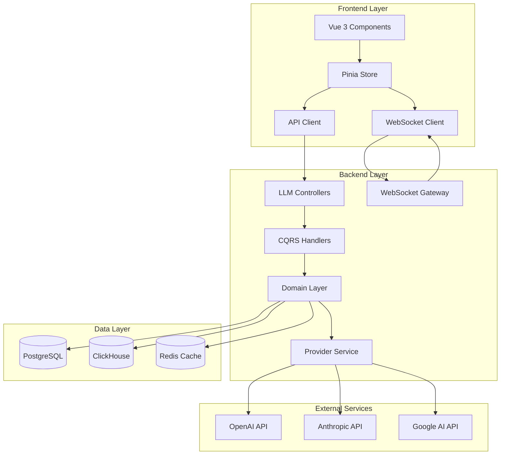
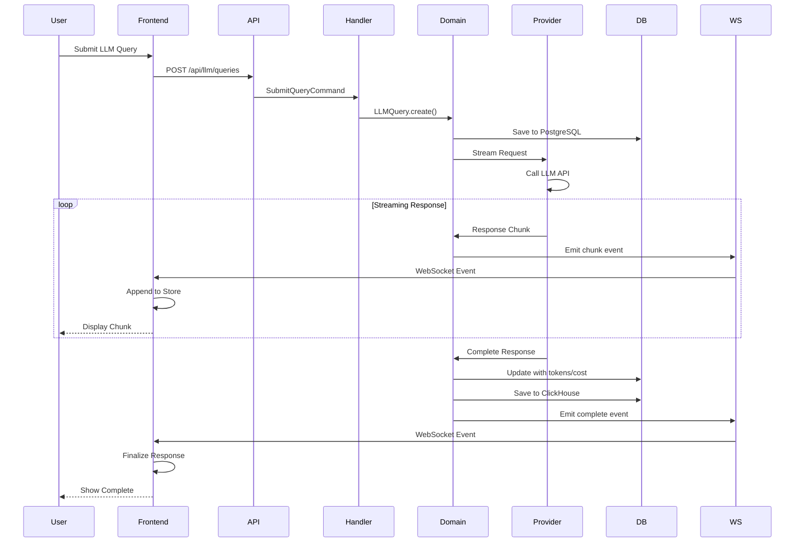

# Design Document: Frontend-Backend LLM Integration

## Overview

This design document specifies the technical implementation for integrating the Vue 3 frontend with the NestJS backend LLM module. The integration provides a complete LLM workflow with real-time streaming, conversation management, comprehensive analytics, and seamless user experience.

The system leverages:

- **Backend**: NestJS with DDD/CQRS architecture, TypeORM for PostgreSQL, ClickHouse for analytics
- **Frontend**: Vue 3 Composition API, Pinia for state management, Naive UI components, ECharts for visualization
- **Real-time**: WebSocket (Socket.IO) for bidirectional streaming communication
- **API**: RESTful HTTP endpoints with OpenAPI documentation
- **LLM Providers**: OpenAI, Anthropic, Google AI, Azure OpenAI, and custom providers

### Architecture Diagram



## Architecture

### Backend Architecture (DDD/CQRS)

The backend follows Domain-Driven Design with CQRS pattern:

**Domain Layer:**

- `LLMQuery` aggregate: Manages query lifecycle, validation, and execution
- `Conversation` aggregate: Manages conversation context and message history
- `PromptTemplate` aggregate: Manages template lifecycle and variable substitution
- `LLMProvider` aggregate: Manages provider configuration and health status
- `TokenUsage` value object: Encapsulates token counting and cost calculation
- `ModelConfiguration` value object: Represents model parameters and capabilities
- Domain events: `QuerySubmitted`, `ResponseReceived`, `ConversationCreated`, `TokenLimitExceeded`

**Application Layer:**

- Commands: `SubmitQuery`, `CreatePromptTemplate`, `UpdatePromptTemplate`, `DeletePromptTemplate`, `ConfigureProvider`, `CreateConversation`, `ShareConversation`
- Queries: `GetQueryHistory`, `ListPromptTemplates`, `GetConversation`, `GetTokenUsage`, `GetCostAnalytics`, `ListProviders`
- Handlers: Command and query handlers implementing business logic
- Services: `StreamingService`, `CacheService`, `RateLimitService`

**Infrastructure Layer:**

- TypeORM entities for PostgreSQL persistence
- Repository implementations
- Provider adapters (OpenAI, Anthropic, Google AI, Azure OpenAI)
- WebSocket gateway for streaming
- ClickHouse repository for analytics

**Presentation Layer:**

- REST controllers with Swagger documentation
- Request/Response DTOs with validation
- Permission guards
- Rate limiting middleware

### Frontend Architecture (Vue 3 + Pinia)

The frontend follows Vue 3 Composition API patterns:

**Store Layer (Pinia):**

- `useLLMStore`: Manages queries, responses, and streaming state
- `useConversationsStore`: Manages conversation history and context
- `usePromptTemplatesStore`: Manages prompt templates
- `useProvidersStore`: Manages provider configurations
- Actions: CRUD operations, WebSocket event handlers, streaming handlers
- Getters: Computed properties for filtered data, statistics

**API Layer:**

- `llmApi`: HTTP client for query endpoints
- `conversationsApi`: HTTP client for conversation management
- `promptTemplatesApi`: HTTP client for template management
- `providersApi`: HTTP client for provider configuration
- `analyticsApi`: HTTP client for usage and cost analytics

**Component Layer:**

- Query interface with chat-style UI
- Conversation list and detail views
- Prompt template editor and library
- Provider configuration dashboard
- Token usage and cost analytics dashboards
- Real-time streaming response display

**WebSocket Layer:**

- Connection management with reconnection logic
- Streaming event handlers for response chunks
- Room-based subscriptions for user isolation
- Cancellation support for streaming requests

### Data Flow Diagram



## Components and Interfaces

### Backend Components

#### 1. LLM Query Controller

```typescript
@Controller('llm/queries')
@ApiTags('LLM Queries')
export class LLMQueriesController {
  @Post()
  @RequirePermissions('llm:query')
  async submitQuery(@Body() dto: SubmitQueryRequest): Promise<LLMQueryDto>

  @Get('history')
  @RequirePermissions('llm:query')
  async getQueryHistory(@Query() query: QueryHistoryQuery): Promise<PaginatedResponse<LLMQueryDto>>

  @Get(':id')
  @RequirePermissions('llm:query')
  async getQuery(@Param('id') id: string): Promise<LLMQueryDto>

  @Post(':id/cancel')
  @RequirePermissions('llm:query')
  async cancelQuery(@Param('id') id: string): Promise<void>
}
```

#### 2. Prompt Template Controller

```typescript
@Controller('llm/templates')
@ApiTags('Prompt Templates')
export class PromptTemplatesController {
  @Post()
  @RequirePermissions('llm:templates:create')
  async createTemplate(@Body() dto: CreatePromptTemplateRequest): Promise<PromptTemplateDto>

  @Get()
  @RequirePermissions('llm:templates:read')
  async listTemplates(@Query() query: ListTemplatesQuery): Promise<PaginatedResponse<PromptTemplateDto>>

  @Get(':id')
  @RequirePermissions('llm:templates:read')
  async getTemplate(@Param('id') id: string): Promise<PromptTemplateDto>

  @Put(':id')
  @RequirePermissions('llm:templates:update')
  async updateTemplate(@Param('id') id: string, @Body() dto: UpdatePromptTemplateRequest): Promise<PromptTemplateDto>

  @Delete(':id')
  @RequirePermissions('llm:templates:delete')
  async deleteTemplate(@Param('id') id: string): Promise<void>
}
```

#### 3. Conversation Controller

```typescript
@Controller('llm/conversations')
@ApiTags('LLM Conversations')
export class ConversationsController {
  @Post()
  @RequirePermissions('llm:query')
  async createConversation(@Body() dto: CreateConversationRequest): Promise<ConversationDto>

  @Get()
  @RequirePermissions('llm:query')
  async listConversations(@Query() query: ListConversationsQuery): Promise<PaginatedResponse<ConversationDto>>

  @Get(':id')
  @RequirePermissions('llm:query')
  async getConversation(@Param('id') id: string): Promise<ConversationDto>

  @Delete(':id')
  @RequirePermissions('llm:query')
  async deleteConversation(@Param('id') id: string): Promise<void>

  @Post(':id/share')
  @RequirePermissions('llm:query')
  async shareConversation(@Param('id') id: string, @Body() dto: ShareConversationRequest): Promise<ShareLinkDto>

  @Post(':id/export')
  @RequirePermissions('llm:query')
  async exportConversation(@Param('id') id: string, @Query('format') format: 'json' | 'markdown'): Promise<string>
}
```

#### 4. Provider Controller

```typescript
@Controller('llm/providers')
@ApiTags('LLM Providers')
export class ProvidersController {
  @Post()
  @RequirePermissions('llm:providers:manage')
  async addProvider(@Body() dto: AddProviderRequest): Promise<ProviderDto>

  @Get()
  @RequirePermissions('llm:providers:read')
  async listProviders(): Promise<ProviderDto[]>

  @Get(':id')
  @RequirePermissions('llm:providers:read')
  async getProvider(@Param('id') id: string): Promise<ProviderDto>

  @Put(':id')
  @RequirePermissions('llm:providers:manage')
  async updateProvider(@Param('id') id: string, @Body() dto: UpdateProviderRequest): Promise<ProviderDto>

  @Delete(':id')
  @RequirePermissions('llm:providers:manage')
  async deleteProvider(@Param('id') id: string): Promise<void>

  @Post(':id/test')
  @RequirePermissions('llm:providers:manage')
  async testProvider(@Param('id') id: string): Promise<TestResultDto>

  @Get(':id/models')
  @RequirePermissions('llm:providers:read')
  async getProviderModels(@Param('id') id: string): Promise<ModelDto[]>
}
```

#### 5. Analytics Controller

```typescript
@Controller('llm/analytics')
@ApiTags('LLM Analytics')
export class AnalyticsController {
  @Get('token-usage')
  @RequirePermissions('llm:costs:read')
  async getTokenUsage(@Query() query: TokenUsageQuery): Promise<TokenUsageDto>

  @Get('costs')
  @RequirePermissions('llm:costs:read')
  async getCosts(@Query() query: CostQuery): Promise<CostAnalyticsDto>

  @Get('dashboard')
  @RequirePermissions('llm:costs:read')
  async getDashboard(@Query() query: DashboardQuery): Promise<DashboardDto>
}
```

#### 6. WebSocket Gateway

```typescript
@WebSocketGateway({ namespace: '/llm' })
export class LLMGateway {
  @SubscribeMessage('subscribe')
  handleSubscribe(client: Socket, userId: string): void

  @SubscribeMessage('unsubscribe')
  handleUnsubscribe(client: Socket, userId: string): void

  @SubscribeMessage('cancel')
  handleCancel(client: Socket, queryId: string): void

  // Emit events to clients
  emitResponseChunk(userId: string, queryId: string, chunk: string): void
  emitResponseComplete(userId: string, queryId: string, response: LLMQueryDto): void
  emitResponseError(userId: string, queryId: string, error: string): void
  emitTokenWarning(userId: string, usage: TokenUsageDto): void
}
```

#### 7. Domain Aggregates

```typescript
// LLMQuery Aggregate
class LLMQuery extends AggregateRoot {
  private id: string;
  private userId: string;
  private conversationId?: string;
  private providerId: string;
  private modelId: string;
  private prompt: string;
  private response?: string;
  private status:
    | "pending"
    | "streaming"
    | "completed"
    | "failed"
    | "cancelled";
  private tokenUsage?: TokenUsage;
  private cost?: number;
  private createdAt: Date;
  private completedAt?: Date;

  static create(props: CreateLLMQueryProps): LLMQuery;
  updateResponse(chunk: string): void;
  complete(response: string, tokenUsage: TokenUsage): void;
  fail(error: string): void;
  cancel(): void;
}

// Conversation Aggregate
class Conversation extends AggregateRoot {
  private id: string;
  private userId: string;
  private title: string;
  private messages: Message[];
  private contextWindow: number;
  private createdAt: Date;
  private updatedAt: Date;

  static create(props: CreateConversationProps): Conversation;
  addMessage(message: Message): void;
  truncateContext(maxTokens: number): void;
  branch(fromMessageId: string): Conversation;
  share(permissions: SharePermissions): ShareLink;
  export(format: "json" | "markdown"): string;
}

// PromptTemplate Aggregate
class PromptTemplate extends AggregateRoot {
  private id: string;
  private userId: string;
  private name: string;
  private description: string;
  private content: string;
  private variables: TemplateVariable[];
  private category: string;
  private version: number;
  private createdAt: Date;
  private updatedAt: Date;

  static create(props: CreatePromptTemplateProps): PromptTemplate;
  update(props: UpdatePromptTemplateProps): void;
  substitute(values: Record<string, any>): string;
  validateVariables(values: Record<string, any>): ValidationResult;
}

// LLMProvider Aggregate
class LLMProvider extends AggregateRoot {
  private id: string;
  private name: string;
  private type: "openai" | "anthropic" | "google" | "azure" | "custom";
  private config: ProviderConfig;
  private enabled: boolean;
  private healthStatus: "healthy" | "degraded" | "unhealthy";
  private models: Model[];

  static create(props: CreateProviderProps): LLMProvider;
  update(props: UpdateProviderProps): void;
  test(): Promise<TestResult>;
  disable(): void;
  enable(): void;
  updateHealth(status: "healthy" | "degraded" | "unhealthy"): void;
}
```

### Frontend Components

#### 1. Pinia Stores

```typescript
// LLM Store
export const useLLMStore = defineStore("llm", () => {
  // State
  const queries = ref<LLMQuery[]>([]);
  const currentQuery = ref<LLMQuery | null>(null);
  const streamingResponse = ref<string>("");
  const loading = ref(false);
  const error = ref<string | null>(null);

  // Getters
  const queryHistory = computed(() => queries.value.slice().reverse());
  const isStreaming = computed(
    () => currentQuery.value?.status === "streaming",
  );

  // Actions
  async function submitQuery(data: SubmitQueryRequest): Promise<LLMQuery>;
  async function fetchQueryHistory(query?: QueryHistoryQuery): Promise<void>;
  async function cancelQuery(id: string): Promise<void>;
  function handleResponseChunk(queryId: string, chunk: string): void;
  function handleResponseComplete(queryId: string, response: LLMQuery): void;
  function handleResponseError(queryId: string, error: string): void;

  return {
    queries,
    currentQuery,
    streamingResponse,
    loading,
    error,
    queryHistory,
    isStreaming,
    submitQuery,
    fetchQueryHistory,
    cancelQuery,
    handleResponseChunk,
    handleResponseComplete,
    handleResponseError,
  };
});

// Conversations Store
export const useConversationsStore = defineStore("conversations", () => {
  // State
  const conversations = ref<Conversation[]>([]);
  const currentConversation = ref<Conversation | null>(null);
  const loading = ref(false);
  const error = ref<string | null>(null);

  // Getters
  const sortedConversations = computed(() =>
    conversations.value
      .slice()
      .sort(
        (a, b) =>
          new Date(b.updatedAt).getTime() - new Date(a.updatedAt).getTime(),
      ),
  );

  // Actions
  async function createConversation(
    data: CreateConversationRequest,
  ): Promise<Conversation>;
  async function fetchConversations(
    query?: ListConversationsQuery,
  ): Promise<void>;
  async function getConversation(id: string): Promise<Conversation>;
  async function deleteConversation(id: string): Promise<void>;
  async function shareConversation(
    id: string,
    permissions: SharePermissions,
  ): Promise<ShareLink>;
  async function exportConversation(
    id: string,
    format: "json" | "markdown",
  ): Promise<string>;

  return {
    conversations,
    currentConversation,
    loading,
    error,
    sortedConversations,
    createConversation,
    fetchConversations,
    getConversation,
    deleteConversation,
    shareConversation,
    exportConversation,
  };
});

// Prompt Templates Store
export const usePromptTemplatesStore = defineStore("promptTemplates", () => {
  // State
  const templates = ref<PromptTemplate[]>([]);
  const loading = ref(false);
  const error = ref<string | null>(null);

  // Getters
  const templatesByCategory = computed(() =>
    groupBy(templates.value, "category"),
  );

  // Actions
  async function createTemplate(
    data: CreatePromptTemplateRequest,
  ): Promise<PromptTemplate>;
  async function fetchTemplates(query?: ListTemplatesQuery): Promise<void>;
  async function getTemplate(id: string): Promise<PromptTemplate>;
  async function updateTemplate(
    id: string,
    data: UpdatePromptTemplateRequest,
  ): Promise<PromptTemplate>;
  async function deleteTemplate(id: string): Promise<void>;

  return {
    templates,
    loading,
    error,
    templatesByCategory,
    createTemplate,
    fetchTemplates,
    getTemplate,
    updateTemplate,
    deleteTemplate,
  };
});

// Providers Store
export const useProvidersStore = defineStore("providers", () => {
  // State
  const providers = ref<Provider[]>([]);
  const models = ref<Model[]>([]);
  const loading = ref(false);
  const error = ref<string | null>(null);

  // Getters
  const activeProviders = computed(() =>
    providers.value.filter((p) => p.enabled),
  );
  const availableModels = computed(() =>
    models.value.filter((m) =>
      activeProviders.value.some((p) => p.id === m.providerId),
    ),
  );

  // Actions
  async function addProvider(data: AddProviderRequest): Promise<Provider>;
  async function fetchProviders(): Promise<void>;
  async function getProvider(id: string): Promise<Provider>;
  async function updateProvider(
    id: string,
    data: UpdateProviderRequest,
  ): Promise<Provider>;
  async function deleteProvider(id: string): Promise<void>;
  async function testProvider(id: string): Promise<TestResult>;
  async function fetchProviderModels(id: string): Promise<Model[]>;

  return {
    providers,
    models,
    loading,
    error,
    activeProviders,
    availableModels,
    addProvider,
    fetchProviders,
    getProvider,
    updateProvider,
    deleteProvider,
    testProvider,
    fetchProviderModels,
  };
});
```

#### 2. API Clients

```typescript
// LLM API
export const llmApi = {
  async submitQuery(data: SubmitQueryRequest): Promise<LLMQuery>
  async getQueryHistory(query?: QueryHistoryQuery): Promise<PaginatedResponse<LLMQuery>>
  async getQuery(id: string): Promise<LLMQuery>
  async cancelQuery(id: string): Promise<void>
}

// Conversations API
export const conversationsApi = {
  async create(data: CreateConversationRequest): Promise<Conversation>
  async list(query?: ListConversationsQuery): Promise<PaginatedResponse<Conversation>>
  async get(id: string): Promise<Conversation>
  async delete(id: string): Promise<void>
  async share(id: string, permissions: SharePermissions): Promise<ShareLink>
  async export(id: string, format: 'json' | 'markdown'): Promise<string>
}

// Prompt Templates API
export const promptTemplatesApi = {
  async create(data: CreatePromptTemplateRequest): Promise<PromptTemplate>
  async list(query?: ListTemplatesQuery): Promise<PaginatedResponse<PromptTemplate>>
  async get(id: string): Promise<PromptTemplate>
  async update(id: string, data: UpdatePromptTemplateRequest): Promise<PromptTemplate>
  async delete(id: string): Promise<void>
}

// Providers API
export const providersApi = {
  async add(data: AddProviderRequest): Promise<Provider>
  async list(): Promise<Provider[]>
  async get(id: string): Promise<Provider>
  async update(id: string, data: UpdateProviderRequest): Promise<Provider>
  async delete(id: string): Promise<void>
  async test(id: string): Promise<TestResult>
  async getModels(id: string): Promise<Model[]>
}

// Analytics API
export const analyticsApi = {
  async getTokenUsage(query: TokenUsageQuery): Promise<TokenUsageDto>
  async getCosts(query: CostQuery): Promise<CostAnalyticsDto>
  async getDashboard(query: DashboardQuery): Promise<DashboardDto>
}
```

#### 3. WebSocket Client

```typescript
export class LLMWebSocketClient {
  private socket: Socket | null = null;
  private reconnectAttempts = 0;
  private maxReconnectAttempts = 5;

  connect(userId: string): void;
  disconnect(): void;
  subscribe(userId: string): void;
  unsubscribe(userId: string): void;
  cancelQuery(queryId: string): void;

  // Event listeners
  onResponseChunk(callback: (queryId: string, chunk: string) => void): void;
  onResponseComplete(
    callback: (queryId: string, response: LLMQuery) => void,
  ): void;
  onResponseError(callback: (queryId: string, error: string) => void): void;
  onTokenWarning(callback: (usage: TokenUsageDto) => void): void;

  private handleReconnect(): void;
  private handleDisconnect(): void;
}
```

#### 4. Vue Components

**LLMQueryInterface.vue**

- Chat-style interface for query submission
- Model selection dropdown with capabilities display
- Parameter configuration (temperature, max tokens, etc.)
- Real-time streaming response display
- Markdown rendering with syntax highlighting
- Copy and export functionality

**ConversationsList.vue**

- List of user conversations with search and filtering
- Conversation preview with last message
- Quick actions (delete, share, export)
- Create new conversation button

**ConversationDetail.vue**

- Full conversation view with message history
- Message branching support
- Context window indicator
- Export and share options

**PromptTemplateLibrary.vue**

- Categorized template list
- Template preview and selection
- Create/edit template dialog
- Variable placeholder editor

**PromptTemplateEditor.vue**

- Rich text editor with syntax highlighting
- Variable insertion and validation
- Template testing with sample values
- Version history display

**ProviderConfiguration.vue**

- Provider list with health status indicators
- Add/edit provider forms
- Test connection functionality
- Model list for each provider

**TokenUsageDashboard.vue**

- Token usage charts (daily, weekly, monthly)
- Usage breakdown by user, model, provider
- Quota display and warnings
- Export usage reports

**CostAnalyticsDashboard.vue**

- Cost charts and trends
- Spending breakdown by dimensions
- Cost alerts configuration
- Budget tracking and projections

## Data Models

### Backend Data Models

#### PostgreSQL Schema

```sql
-- LLM Providers Table
CREATE TABLE llm_providers (
  id UUID PRIMARY KEY DEFAULT gen_random_uuid(),
  tenant_id UUID NOT NULL REFERENCES tenants(id),
  name VARCHAR(255) NOT NULL,
  type VARCHAR(50) NOT NULL CHECK (type IN ('openai', 'anthropic', 'google', 'azure', 'custom')),
  config JSONB NOT NULL,
  enabled BOOLEAN DEFAULT true,
  health_status VARCHAR(20) DEFAULT 'healthy' CHECK (health_status IN ('healthy', 'degraded', 'unhealthy')),
  created_at TIMESTAMP DEFAULT NOW(),
  updated_at TIMESTAMP DEFAULT NOW(),

  CONSTRAINT llm_providers_tenant_name_unique UNIQUE (tenant_id, name)
);

CREATE INDEX idx_llm_providers_tenant ON llm_providers(tenant_id);
CREATE INDEX idx_llm_providers_enabled ON llm_providers(enabled);

-- LLM Models Table
CREATE TABLE llm_models (
  id UUID PRIMARY KEY DEFAULT gen_random_uuid(),
  provider_id UUID NOT NULL REFERENCES llm_providers(id) ON DELETE CASCADE,
  name VARCHAR(255) NOT NULL,
  display_name VARCHAR(255) NOT NULL,
  capabilities JSONB DEFAULT '{}',
  context_window INTEGER NOT NULL,
  input_cost_per_1k DECIMAL(10, 6) NOT NULL,
  output_cost_per_1k DECIMAL(10, 6) NOT NULL,
  enabled BOOLEAN DEFAULT true,
  created_at TIMESTAMP DEFAULT NOW(),
  updated_at TIMESTAMP DEFAULT NOW(),

  CONSTRAINT llm_models_provider_name_unique UNIQUE (provider_id, name)
);

CREATE INDEX idx_llm_models_provider ON llm_models(provider_id);
CREATE INDEX idx_llm_models_enabled ON llm_models(enabled);

-- Conversations Table
CREATE TABLE llm_conversations (
  id UUID PRIMARY KEY DEFAULT gen_random_uuid(),
  tenant_id UUID NOT NULL REFERENCES tenants(id),
  user_id UUID NOT NULL REFERENCES users(id),
  title VARCHAR(255) NOT NULL,
  context_window INTEGER DEFAULT 4096,
  created_at TIMESTAMP DEFAULT NOW(),
  updated_at TIMESTAMP DEFAULT NOW(),
  deleted_at TIMESTAMP,

  CONSTRAINT llm_conversations_check_deleted CHECK (deleted_at IS NULL OR deleted_at >= created_at)
);

CREATE INDEX idx_llm_conversations_tenant ON llm_conversations(tenant_id) WHERE deleted_at IS NULL;
CREATE INDEX idx_llm_conversations_user ON llm_conversations(user_id) WHERE deleted_at IS NULL;
CREATE INDEX idx_llm_conversations_updated ON llm_conversations(updated_at DESC) WHERE deleted_at IS NULL;

-- Conversation Messages Table
CREATE TABLE llm_conversation_messages (
  id UUID PRIMARY KEY DEFAULT gen_random_uuid(),
  conversation_id UUID NOT NULL REFERENCES llm_conversations(id) ON DELETE CASCADE,
  parent_message_id UUID REFERENCES llm_conversation_messages(id),
  role VARCHAR(20) NOT NULL CHECK (role IN ('system', 'user', 'assistant', 'function')),
  content TEXT NOT NULL,
  token_count INTEGER,
  created_at TIMESTAMP DEFAULT NOW()
);

CREATE INDEX idx_llm_messages_conversation ON llm_conversation_messages(conversation_id, created_at);
CREATE INDEX idx_llm_messages_parent ON llm_conversation_messages(parent_message_id);

-- Prompt Templates Table
CREATE TABLE llm_prompt_templates (
  id UUID PRIMARY KEY DEFAULT gen_random_uuid(),
  tenant_id UUID NOT NULL REFERENCES tenants(id),
  user_id UUID NOT NULL REFERENCES users(id),
  name VARCHAR(255) NOT NULL,
  description TEXT,
  content TEXT NOT NULL,
  variables JSONB DEFAULT '[]',
  category VARCHAR(100),
  version INTEGER DEFAULT 1,
  created_at TIMESTAMP DEFAULT NOW(),
  updated_at TIMESTAMP DEFAULT NOW(),
  deleted_at TIMESTAMP,

  CONSTRAINT llm_templates_tenant_name_unique UNIQUE (tenant_id, name, deleted_at)
);

CREATE INDEX idx_llm_templates_tenant ON llm_prompt_templates(tenant_id) WHERE deleted_at IS NULL;
CREATE INDEX idx_llm_templates_user ON llm_prompt_templates(user_id) WHERE deleted_at IS NULL;
CREATE INDEX idx_llm_templates_category ON llm_prompt_templates(category) WHERE deleted_at IS NULL;

-- Shared Conversations Table
CREATE TABLE llm_shared_conversations (
  id UUID PRIMARY KEY DEFAULT gen_random_uuid(),
  conversation_id UUID NOT NULL REFERENCES llm_conversations(id) ON DELETE CASCADE,
  share_token VARCHAR(255) NOT NULL UNIQUE,
  permissions JSONB DEFAULT '{"read": true, "write": false}',
  expires_at TIMESTAMP,
  created_at TIMESTAMP DEFAULT NOW(),
  revoked_at TIMESTAMP,

  CONSTRAINT llm_shared_check_revoked CHECK (revoked_at IS NULL OR revoked_at >= created_at)
);

CREATE INDEX idx_llm_shared_conversation ON llm_shared_conversations(conversation_id);
CREATE INDEX idx_llm_shared_token ON llm_shared_conversations(share_token) WHERE revoked_at IS NULL;

-- Function Registry Table
CREATE TABLE llm_function_registry (
  id UUID PRIMARY KEY DEFAULT gen_random_uuid(),
  tenant_id UUID NOT NULL REFERENCES tenants(id),
  name VARCHAR(255) NOT NULL,
  description TEXT,
  schema JSONB NOT NULL,
  permissions JSONB DEFAULT '[]',
  enabled BOOLEAN DEFAULT true,
  created_at TIMESTAMP DEFAULT NOW(),
  updated_at TIMESTAMP DEFAULT NOW(),

  CONSTRAINT llm_functions_tenant_name_unique UNIQUE (tenant_id, name)
);

CREATE INDEX idx_llm_functions_tenant ON llm_function_registry(tenant_id);
CREATE INDEX idx_llm_functions_enabled ON llm_function_registry(enabled);
```

#### ClickHouse Schema

```sql
-- LLM Query History Table
CREATE TABLE llm_query_history (
  id UUID,
  tenant_id UUID,
  user_id UUID,
  conversation_id Nullable(UUID),
  provider_id UUID,
  model_id UUID,
  model_name LowCardinality(String),
  prompt String,
  response String,
  status LowCardinality(String),
  input_tokens UInt32,
  output_tokens UInt32,
  total_tokens UInt32,
  cost Float64,
  duration_ms UInt32,
  created_at DateTime64(3),
  completed_at Nullable(DateTime64(3)),
  error Nullable(String)
) ENGINE = MergeTree()
PARTITION BY toYYYYMM(created_at)
ORDER BY (tenant_id, user_id, created_at)
TTL created_at + INTERVAL 90 DAY;

-- Token Usage Aggregates Table
CREATE TABLE llm_token_usage (
  tenant_id UUID,
  user_id UUID,
  provider_id UUID,
  model_id UUID,
  model_name LowCardinality(String),
  date Date,
  hour UInt8,
  query_count UInt64,
  input_tokens UInt64,
  output_tokens UInt64,
  total_tokens UInt64,
  total_cost Float64
) ENGINE = SummingMergeTree()
PARTITION BY toYYYYMM(date)
ORDER BY (tenant_id, user_id, provider_id, model_id, date, hour);

-- Cost Analytics Table
CREATE TABLE llm_cost_analytics (
  tenant_id UUID,
  user_id UUID,
  provider_id UUID,
  model_id UUID,
  date Date,
  total_cost Float64,
  query_count UInt64,
  avg_cost_per_query Float64
) ENGINE = SummingMergeTree()
PARTITION BY toYYYYMM(date)
ORDER BY (tenant_id, date, user_id, provider_id, model_id);

-- Function Execution History Table
CREATE TABLE llm_function_executions (
  id UUID,
  tenant_id UUID,
  user_id UUID,
  query_id UUID,
  function_name LowCardinality(String),
  input String,
  output String,
  status LowCardinality(String),
  duration_ms UInt32,
  executed_at DateTime64(3),
  error Nullable(String)
) ENGINE = MergeTree()
PARTITION BY toYYYYMM(executed_at)
ORDER BY (tenant_id, executed_at, function_name)
TTL executed_at + INTERVAL 30 DAY;

-- Cache Table (for response caching)
CREATE TABLE llm_response_cache (
  query_hash String,
  tenant_id UUID,
  model_id UUID,
  response String,
  token_usage String,
  cached_at DateTime64(3),
  expires_at DateTime64(3)
) ENGINE = MergeTree()
ORDER BY (query_hash, tenant_id, model_id)
TTL expires_at;
```

### Frontend Data Models

```typescript
// LLM Query
interface LLMQuery {
  id: string;
  userId: string;
  conversationId?: string;
  providerId: string;
  modelId: string;
  modelName: string;
  prompt: string;
  response?: string;
  status: "pending" | "streaming" | "completed" | "failed" | "cancelled";
  tokenUsage?: {
    inputTokens: number;
    outputTokens: number;
    totalTokens: number;
  };
  cost?: number;
  duration?: number;
  createdAt: string;
  completedAt?: string;
  error?: string;
}

// Conversation
interface Conversation {
  id: string;
  tenantId: string;
  userId: string;
  title: string;
  contextWindow: number;
  messages: Message[];
  createdAt: string;
  updatedAt: string;
}

// Message
interface Message {
  id: string;
  conversationId: string;
  parentMessageId?: string;
  role: "system" | "user" | "assistant" | "function";
  content: string;
  tokenCount?: number;
  createdAt: string;
}

// Prompt Template
interface PromptTemplate {
  id: string;
  tenantId: string;
  userId: string;
  name: string;
  description?: string;
  content: string;
  variables: TemplateVariable[];
  category?: string;
  version: number;
  createdAt: string;
  updatedAt: string;
}

// Template Variable
interface TemplateVariable {
  name: string;
  type: "string" | "number" | "date" | "boolean";
  description?: string;
  defaultValue?: any;
  required: boolean;
  validation?: {
    min?: number;
    max?: number;
    pattern?: string;
    options?: string[];
  };
}

// Provider
interface Provider {
  id: string;
  tenantId: string;
  name: string;
  type: "openai" | "anthropic" | "google" | "azure" | "custom";
  config: ProviderConfig;
  enabled: boolean;
  healthStatus: "healthy" | "degraded" | "unhealthy";
  models: Model[];
  createdAt: string;
  updatedAt: string;
}

// Provider Config
interface ProviderConfig {
  apiKey?: string;
  endpoint?: string;
  organization?: string;
  region?: string;
  [key: string]: any;
}

// Model
interface Model {
  id: string;
  providerId: string;
  name: string;
  displayName: string;
  capabilities: {
    streaming: boolean;
    functionCalling: boolean;
    vision: boolean;
    [key: string]: boolean;
  };
  contextWindow: number;
  inputCostPer1k: number;
  outputCostPer1k: number;
  enabled: boolean;
  parameters: ModelParameter[];
}

// Model Parameter
interface ModelParameter {
  name: string;
  type: "number" | "string" | "boolean";
  defaultValue: any;
  min?: number;
  max?: number;
  step?: number;
  options?: string[];
}

// Token Usage
interface TokenUsageDto {
  period: {
    start: string;
    end: string;
  };
  total: {
    queries: number;
    inputTokens: number;
    outputTokens: number;
    totalTokens: number;
    cost: number;
  };
  byUser: Array<{
    userId: string;
    userName: string;
    queries: number;
    tokens: number;
    cost: number;
  }>;
  byModel: Array<{
    modelId: string;
    modelName: string;
    queries: number;
    tokens: number;
    cost: number;
  }>;
  byProvider: Array<{
    providerId: string;
    providerName: string;
    queries: number;
    tokens: number;
    cost: number;
  }>;
  trend: Array<{
    timestamp: string;
    tokens: number;
    cost: number;
  }>;
}

// Cost Analytics
interface CostAnalyticsDto {
  period: {
    start: string;
    end: string;
  };
  totalCost: number;
  dailyCosts: Array<{
    date: string;
    cost: number;
  }>;
  costByDimension: {
    byUser: Array<{ userId: string; userName: string; cost: number }>;
    byModel: Array<{ modelId: string; modelName: string; cost: number }>;
    byProvider: Array<{
      providerId: string;
      providerName: string;
      cost: number;
    }>;
  };
  projections: {
    daily: number;
    weekly: number;
    monthly: number;
  };
  alerts: Array<{
    threshold: number;
    current: number;
    exceeded: boolean;
  }>;
}

// Dashboard
interface DashboardDto {
  queryVolume: {
    total: number;
    today: number;
    trend: Array<{ timestamp: string; count: number }>;
  };
  tokenUsage: {
    total: number;
    today: number;
    trend: Array<{ timestamp: string; tokens: number }>;
  };
  costs: {
    total: number;
    today: number;
    trend: Array<{ timestamp: string; cost: number }>;
  };
  performance: {
    avgResponseTime: number;
    p50: number;
    p95: number;
    p99: number;
  };
  errors: {
    rate: number;
    reasons: Array<{ reason: string; count: number }>;
  };
  topTemplates: Array<{
    templateId: string;
    templateName: string;
    usageCount: number;
  }>;
  cacheMetrics: {
    hitRate: number;
    totalHits: number;
    totalMisses: number;
  };
}

// Share Link
interface ShareLink {
  id: string;
  conversationId: string;
  token: string;
  url: string;
  permissions: {
    read: boolean;
    write: boolean;
  };
  expiresAt?: string;
  createdAt: string;
}

// Test Result
interface TestResult {
  success: boolean;
  message: string;
  latency?: number;
  error?: string;
}
```

## Correctness Properties

_A property is a characteristic or behavior that should hold true across all valid executions of a system—essentially, a formal statement about what the system should do. Properties serve as the bridge between human-readable specifications and machine-verifiable correctness guarantees._

### Property Reflection

After analyzing all acceptance criteria, several properties can be consolidated to avoid redundancy:

- CRUD operations for prompt templates (3.1-3.4) and providers (9.1, 9.4) follow similar patterns and can be grouped
- Permission checking properties (13.1-13.4, 13.6, 13.7) all verify permission enforcement and can be combined
- WebSocket streaming properties (4.2, 4.3, 10.2, 10.3) all verify real-time updates and can be consolidated
- Token and cost tracking properties (7.1, 8.1) both track resource usage and can be unified
- History and analytics properties (6.1-6.4, 19.1-19.5) all verify data aggregation and can be combined
- Template variable properties (11.1, 11.3, 11.4, 11.5) all relate to variable handling and can be consolidated
- Response formatting properties (12.1-12.3, 12.6) all verify rendering and can be combined

### Core Properties

#### Property 1: LLM Query Submission and Persistence

_For any_ valid LLM query with model selection and prompt, submitting the query should validate the request, forward it to the selected provider, create a query history entry with timestamp and user ID, and persist the response with token usage and cost data when received.

**Validates: Requirements 1.1, 1.2, 1.3, 1.4**

#### Property 2: Query Error Handling

_For any_ query that fails (validation error, provider error, timeout), the system should return descriptive error messages with retry options and not create incomplete query history entries.

**Validates: Requirements 1.6**

#### Property 3: Interaction Type Support

_For any_ query type (completion or chat-based), the LLM Query API should support the interaction and correctly format the request for the provider.

**Validates: Requirements 1.7**

#### Property 4: Model Configuration and Display

_For any_ request for available models, the system should return all configured models with capabilities, pricing, and default parameter values. When a user selects a model, the frontend should update the store and display model-specific parameters.

**Validates: Requirements 2.1, 2.2, 2.3, 2.5, 2.7**

#### Property 5: Model Preferences Persistence

_For any_ model configuration (temperature, max tokens, top-p, frequency penalty), saving preferences should persist them to the user profile and restore them on subsequent sessions.

**Validates: Requirements 2.4**

#### Property 6: Model Availability Handling

_For any_ unavailable model, the system should indicate the status and suggest alternative models from the same provider or other providers.

**Validates: Requirements 2.6**

#### Property 7: Prompt Template CRUD Operations

_For any_ valid prompt template data, creating should validate and persist to PostgreSQL, reading should return templates with pagination, updating should preserve version history, and deleting should soft-delete the template.

**Validates: Requirements 3.1, 3.2, 3.3, 3.4**

#### Property 8: Template Variable Handling

_For any_ prompt template containing variable placeholders in the format `{{variable_name}}`, the system should identify all variables, validate their types and values, support default values, substitute placeholders before sending to the LLM, and display validation errors with correction hints when validation fails.

**Validates: Requirements 3.5, 11.1, 11.2, 11.3, 11.4, 11.5, 11.6**

#### Property 9: Template Selection and Population

_For any_ prompt template selected by a user, the frontend should populate the query interface with the template content and prompt for any required variable values.

**Validates: Requirements 3.6**

#### Property 10: Response Streaming

_For any_ streaming query, the backend should establish a streaming connection to the provider, broadcast response chunks via WebSocket as they arrive, and the frontend should append chunks to the current response reactively. When streaming completes, the system should finalize the response with total token usage.

**Validates: Requirements 4.1, 4.2, 4.3, 4.4, 10.2, 10.3**

#### Property 11: Streaming Error Handling

_For any_ streaming request that fails mid-response, the system should mark the response as incomplete, log the error with details, and notify the user.

**Validates: Requirements 4.5**

#### Property 12: Streaming Cancellation

_For any_ streaming request, when a user cancels it, the system should abort the LLM request, close the stream, and mark the query as cancelled.

**Validates: Requirements 4.7**

#### Property 13: Conversation Context Management

_For any_ conversation, creating should generate a unique ID, submitting queries should include previous messages in the LLM request, and when the conversation exceeds token limits, the system should truncate older messages while preserving recent context and system messages.

**Validates: Requirements 5.1, 5.2, 5.3, 20.1, 20.2**

#### Property 14: Conversation Operations

_For any_ conversation, viewing should display all messages in chronological order, deleting should soft-delete the conversation and all associated messages, branching should create a new conversation from any message, and exporting should generate a formatted transcript.

**Validates: Requirements 5.4, 5.5, 5.6, 5.7**

#### Property 15: Query History Management

_For any_ query history request, the system should return queries with pagination and filtering support (by date range, model, provider), include all query details (text, response, model, token usage, cost, timestamp), support full-text search across queries and responses, and allow exporting in CSV or JSON format.

**Validates: Requirements 6.1, 6.2, 6.3, 6.4, 6.6, 6.7**

#### Property 16: Token Usage Tracking and Display

_For any_ LLM request that completes, the system should record input tokens, output tokens, and total tokens. The frontend should display usage statistics by time period (daily, weekly, monthly) with breakdowns by user, model, and provider, and emit warning events when usage exceeds thresholds.

**Validates: Requirements 7.1, 7.2, 7.3, 7.4, 7.5, 7.7**

#### Property 17: Cost Calculation and Monitoring

_For any_ LLM request that completes, the system should calculate cost based on token usage and model pricing. The frontend should display costs by time period, user, model, and provider, show spending trends and projections, and trigger configurable alerts when spending exceeds thresholds with notifications to administrators.

**Validates: Requirements 8.1, 8.2, 8.3, 8.4, 8.5, 8.6, 8.7**

#### Property 18: Provider Management

_For any_ provider configuration, adding should validate credentials and persist securely, testing should send a test request and report results, updating should validate changes, disabling should prevent new queries, and the frontend should display provider status with health indicators.

**Validates: Requirements 9.1, 9.2, 9.3, 9.4, 9.5, 9.6**

#### Property 19: WebSocket Connection Management

_For any_ frontend initialization, the WebSocket client should establish a connection to the gateway with room-based subscriptions for user isolation. When a connection drops, the client should attempt reconnection with exponential backoff, and upon successful reconnection, should sync state with the backend.

**Validates: Requirements 10.1, 10.4, 10.5, 10.6**

#### Property 20: Multi-Client Synchronization

_For any_ user with multiple tabs or clients open, all connected clients should receive synchronized updates for queries, responses, and streaming events.

**Validates: Requirements 10.7**

#### Property 21: Template Variable Autocomplete

_For any_ partial variable name input in the template editor, the frontend should provide autocomplete suggestions based on the template context and previously defined variables.

**Validates: Requirements 11.7**

#### Property 22: Response Formatting and Rendering

_For any_ LLM response containing markdown, code blocks, tables, or links, the frontend should render them with proper formatting, apply syntax highlighting to code blocks, render tables as HTML, make links clickable, support copying code blocks with a single click, and preserve formatting during streaming.

**Validates: Requirements 12.1, 12.2, 12.3, 12.4, 12.6, 12.7**

#### Property 23: Response Export

_For any_ LLM response, the frontend should support exporting it as markdown, HTML, or plain text format with all formatting preserved.

**Validates: Requirements 12.5**

#### Property 24: Permission Enforcement

_For any_ LLM operation (query submission, template creation, provider configuration, cost viewing), the system should verify the user has the required permission (`llm:query`, `llm:templates:create`, `llm:providers:manage`, `llm:costs:read`), return 403 Forbidden with a descriptive message if permission is denied, and audit all permission-protected operations.

**Validates: Requirements 13.1, 13.2, 13.3, 13.4, 13.6, 13.7**

#### Property 25: Permission-Based UI

_For any_ user viewing the LLM interface, the frontend should hide or disable UI elements (buttons, forms, menu items) based on the user's permissions.

**Validates: Requirements 13.5**

#### Property 26: Rate Limiting Enforcement

_For any_ user submitting queries, the system should enforce configurable rate limits per user and per tenant (e.g., 10 queries/minute for standard users, 100 for admins), return 429 Too Many Requests with retry-after header when exceeded, track violations for audit, and display remaining quota and reset time in the frontend with warnings when approaching limits.

**Validates: Requirements 14.1, 14.2, 14.3, 14.4, 14.5, 14.6, 14.7**

#### Property 27: Response Caching

_For any_ query submitted, the system should check if an identical query exists in the cache (by query hash), return the cached response immediately without calling the provider if found, store query hash, response, model, and timestamp in the cache, expire entries after configurable TTL (default 24 hours), support cache bypass when user opts out, track cache hit rate, and evict oldest entries using LRU policy when storage exceeds limits.

**Validates: Requirements 15.1, 15.2, 15.3, 15.4, 15.5, 15.6, 15.7**

#### Property 28: Conversation Sharing

_For any_ conversation, sharing should generate a unique shareable link with configurable permissions (read-only or edit), accessing a shared conversation should verify permissions and display it, recipients should have read-only access unless explicitly granted edit access, revoking should invalidate the link, and the system should track who accessed shared conversations and when.

**Validates: Requirements 16.1, 16.2, 16.3, 16.4, 16.5, 16.6, 16.7**

#### Property 29: Function Calling Support

_For any_ LLM model that supports function calling, the system should allow function definitions in queries, execute requested functions and return results to the LLM, validate function parameters before execution, return errors to the LLM with retry options when execution fails, display function calls and results in the conversation view, and audit all function executions with input, output, and user context.

**Validates: Requirements 17.1, 17.2, 17.3, 17.4, 17.5, 17.6, 17.7**

#### Property 30: Multi-Modal Image Support

_For any_ LLM model that supports vision, the frontend should allow image uploads, validate format (JPEG, PNG, WebP) and size limits, encode and send images to the provider, display image thumbnails in the conversation view, track token usage including image tokens, and store image references in query history without duplicating image data.

**Validates: Requirements 18.1, 18.2, 18.3, 18.4, 18.5, 18.6, 18.7**

#### Property 31: Analytics Dashboard

_For any_ analytics dashboard view, the system should display query volume, token usage, costs, response time metrics (p50, p95, p99), error rates and failure reasons, most used prompt templates, and cache metrics with interactive filtering and support for exporting reports in CSV or JSON format.

**Validates: Requirements 19.1, 19.2, 19.3, 19.4, 19.5, 19.7**

#### Property 32: Context Window Management

_For any_ conversation approaching the model's context window limit, the system should calculate token counts before sending requests, truncate older messages while preserving system messages and recent user messages, display a notification when truncation occurs, show current token usage and remaining capacity, return an error with guidance when a single message exceeds the context window, and support configurable truncation strategies.

**Validates: Requirements 20.1, 20.2, 20.3, 20.4, 20.5, 20.6, 20.7**

## Error Handling

### Backend Error Handling

**Validation Errors:**

- Invalid query input: Return 400 Bad Request with field-specific errors
- Invalid template variables: Return 400 Bad Request with variable validation errors
- Invalid model parameters: Return 400 Bad Request with parameter constraints
- Missing required fields: Return 400 Bad Request with list of missing fields

**Permission Errors:**

- Insufficient permissions: Return 403 Forbidden with required permission
- Invalid authentication: Return 401 Unauthorized

**Not Found Errors:**

- Query not found: Return 404 Not Found
- Conversation not found: Return 404 Not Found
- Template not found: Return 404 Not Found
- Provider not found: Return 404 Not Found
- Model not found: Return 404 Not Found

**Rate Limiting Errors:**

- Rate limit exceeded: Return 429 Too Many Requests with retry-after header
- Include remaining quota and reset time in response headers

**Provider Errors:**

- Provider unavailable: Return 503 Service Unavailable with suggested alternatives
- Provider authentication failure: Return 502 Bad Gateway with provider error details
- Provider timeout: Return 504 Gateway Timeout
- Provider rate limit: Return 429 Too Many Requests with provider-specific retry information

**Streaming Errors:**

- Stream interrupted: Mark query as incomplete, log error, notify client via WebSocket
- Stream timeout: Cancel stream, mark query as failed, return timeout error
- Client disconnection: Abort provider request, clean up resources

**Database Errors:**

- Connection failures: Retry with exponential backoff, return 503 Service Unavailable if retries exhausted
- Query timeouts: Return 504 Gateway Timeout
- Constraint violations: Return 400 Bad Request with constraint details

**Cache Errors:**

- Cache miss: Fall through to provider request
- Cache corruption: Log error, invalidate entry, fall through to provider request
- Cache storage full: Evict oldest entries using LRU policy

### Frontend Error Handling

**API Errors:**

- Network errors: Display toast notification, retry with exponential backoff
- 400 Bad Request: Display validation errors inline in forms
- 401 Unauthorized: Redirect to login page
- 403 Forbidden: Display permission denied message with required permission
- 404 Not Found: Display "not found" message, offer navigation to list view
- 429 Too Many Requests: Display rate limit message with retry time
- 500 Internal Server Error: Display generic error message, log to console
- 502 Bad Gateway: Display provider error message with retry option
- 503 Service Unavailable: Display service unavailable message with retry option
- 504 Gateway Timeout: Display timeout message with retry option

**WebSocket Errors:**

- Connection failures: Attempt reconnection with exponential backoff (max 5 attempts)
- Message parsing errors: Log error, ignore malformed message
- Authentication errors: Reconnect with fresh token
- Stream interruption: Display error notification, mark response as incomplete

**Form Validation Errors:**

- Display errors inline next to fields
- Prevent form submission until errors are resolved
- Highlight invalid fields with red border
- Provide correction hints for common errors

**State Management Errors:**

- Store action failures: Display toast notification, revert optimistic updates
- State corruption: Reset store to initial state, refetch data
- Concurrent modification: Detect conflicts, prompt user to refresh

**Streaming Errors:**

- Chunk parsing errors: Log error, continue streaming
- Incomplete response: Display warning, allow retry
- Cancellation: Clean up state, display cancellation confirmation

## Testing Strategy

### Dual Testing Approach

The testing strategy employs both unit tests and property-based tests to ensure comprehensive coverage:

**Unit Tests:**

- Specific examples demonstrating correct behavior
- Edge cases (empty prompts, null values, boundary conditions)
- Error conditions (invalid input, permission denied, provider failures)
- Integration points between components

**Property-Based Tests:**

- Universal properties across all inputs
- Comprehensive input coverage through randomization
- Minimum 100 iterations per property test
- Each test tagged with feature name and property number

### Backend Testing

**Unit Tests:**

- Domain aggregate methods (LLMQuery.create, Conversation.addMessage, PromptTemplate.substitute)
- Value object validation (TokenUsage, ModelConfiguration)
- Command/Query handlers with mocked repositories
- Repository implementations with in-memory database
- Controller endpoints with mocked handlers
- Provider adapters with mocked external APIs

**Property-Based Tests:**

- Property 1: Query submission with random valid queries and models
- Property 7: Template CRUD operations with random template data
- Property 8: Variable substitution with random variables and values
- Property 10: Response streaming with random chunk sizes and timing
- Property 13: Context truncation with random conversation lengths
- Property 16: Token tracking with random token counts
- Property 17: Cost calculation with random pricing and usage
- Property 24: Permission enforcement with random user permissions
- Property 26: Rate limiting with random query patterns
- Property 27: Cache behavior with random query patterns

**Integration Tests:**

- End-to-end API tests with real database
- WebSocket gateway with real Socket.IO connections
- Provider adapters with mock LLM APIs
- Streaming with simulated provider responses
- Cache integration with Redis

**BDD Tests (Postman/Newman):**

- Complete query lifecycle scenarios
- Conversation management scenarios
- Template usage scenarios
- Multi-user collaboration scenarios
- Permission-based access scenarios
- Real-time streaming scenarios

### Frontend Testing

**Unit Tests:**

- Pinia store actions and getters
- API client methods with mocked axios
- Composables with mocked dependencies
- Utility functions (formatters, validators, token counters)

**Property-Based Tests:**

- Property 4: Model selection with random models
- Property 9: Template population with random templates
- Property 12: Streaming cancellation with random timing
- Property 15: History filtering with random filter combinations
- Property 19: WebSocket reconnection with random disconnects
- Property 22: Response rendering with random markdown content
- Property 25: Permission-based UI with random user permissions

**Component Tests:**

- Query interface with various input combinations
- Conversation list with filtering and pagination
- Template editor with variable insertion
- Provider configuration forms
- Analytics dashboards with various data ranges

**E2E Tests (Cypress/Playwright):**

- Complete user workflows (submit query → stream response → view history)
- Conversation creation and management
- Template creation and usage
- Provider configuration and testing
- Real-time updates across multiple browser tabs
- Permission-based UI element visibility
- Form validation and error handling

### Property Test Configuration

All property-based tests should:

- Run minimum 100 iterations
- Use appropriate generators for domain types (queries, templates, conversations, models)
- Include shrinking for minimal failing examples
- Tag with format: `Feature: frontend-backend-llm-integration, Property N: [property description]`

Example property test structure:

```typescript
describe("Property 1: LLM Query Submission and Persistence", () => {
  it("should validate, submit, and persist queries with token usage", async () => {
    await fc.assert(
      fc.asyncProperty(llmQueryGenerator(), async (query) => {
        // Submit query
        const submitted = await llmApi.submitQuery(query);
        expect(submitted.id).toBeDefined();
        expect(submitted.status).toBe("pending");

        // Simulate provider response
        const response = await simulateProviderResponse(submitted.id);

        // Verify persistence
        const retrieved = await llmApi.getQuery(submitted.id);
        expect(retrieved.response).toBeDefined();
        expect(retrieved.tokenUsage).toBeDefined();
        expect(retrieved.cost).toBeGreaterThan(0);
        expect(retrieved.status).toBe("completed");

        // Verify history entry
        const history = await llmApi.getQueryHistory({ userId: query.userId });
        expect(history.data.some((h) => h.id === submitted.id)).toBe(true);
      }),
      { numRuns: 100 },
    );
  });
});
```

### Test Coverage Requirements

- Overall: ≥90%
- Domain layer: ≥95%
- Application layer: ≥90%
- Infrastructure layer: ≥85%
- Presentation layer: ≥85%
- Frontend stores: ≥90%
- Frontend components: ≥85%

### Continuous Integration

- All tests run on every pull request
- Property tests run with increased iterations (500) on main branch
- E2E tests run on staging environment before production deployment
- Coverage reports generated and tracked over time
- Failing tests block merges to main branch
- Performance benchmarks for streaming and caching

### Test Data Generators

```typescript
// Query Generator
function llmQueryGenerator(): fc.Arbitrary<SubmitQueryRequest> {
  return fc.record({
    prompt: fc.string({ minLength: 10, maxLength: 1000 }),
    modelId: fc.uuid(),
    providerId: fc.uuid(),
    conversationId: fc.option(fc.uuid()),
    parameters: fc.record({
      temperature: fc.double({ min: 0, max: 2 }),
      maxTokens: fc.integer({ min: 100, max: 4000 }),
      topP: fc.double({ min: 0, max: 1 }),
      frequencyPenalty: fc.double({ min: 0, max: 2 }),
    }),
  });
}

// Template Generator
function promptTemplateGenerator(): fc.Arbitrary<CreatePromptTemplateRequest> {
  return fc.record({
    name: fc.string({ minLength: 3, maxLength: 100 }),
    description: fc.option(fc.string({ maxLength: 500 })),
    content: fc.string({ minLength: 10, maxLength: 2000 }),
    variables: fc.array(templateVariableGenerator(), { maxLength: 10 }),
    category: fc.constantFrom("general", "analysis", "coding", "writing"),
  });
}

// Template Variable Generator
function templateVariableGenerator(): fc.Arbitrary<TemplateVariable> {
  return fc.record({
    name: fc
      .string({ minLength: 1, maxLength: 50 })
      .map((s) => s.replace(/[^a-zA-Z0-9_]/g, "")),
    type: fc.constantFrom("string", "number", "date", "boolean"),
    required: fc.boolean(),
    defaultValue: fc.anything(),
  });
}

// Conversation Generator
function conversationGenerator(): fc.Arbitrary<CreateConversationRequest> {
  return fc.record({
    title: fc.string({ minLength: 3, maxLength: 200 }),
    contextWindow: fc.integer({ min: 1024, max: 128000 }),
  });
}

// Provider Generator
function providerGenerator(): fc.Arbitrary<AddProviderRequest> {
  return fc.record({
    name: fc.string({ minLength: 3, maxLength: 100 }),
    type: fc.constantFrom("openai", "anthropic", "google", "azure", "custom"),
    config: fc.record({
      apiKey: fc.string({ minLength: 20, maxLength: 100 }),
      endpoint: fc.option(fc.webUrl()),
    }),
  });
}
```
