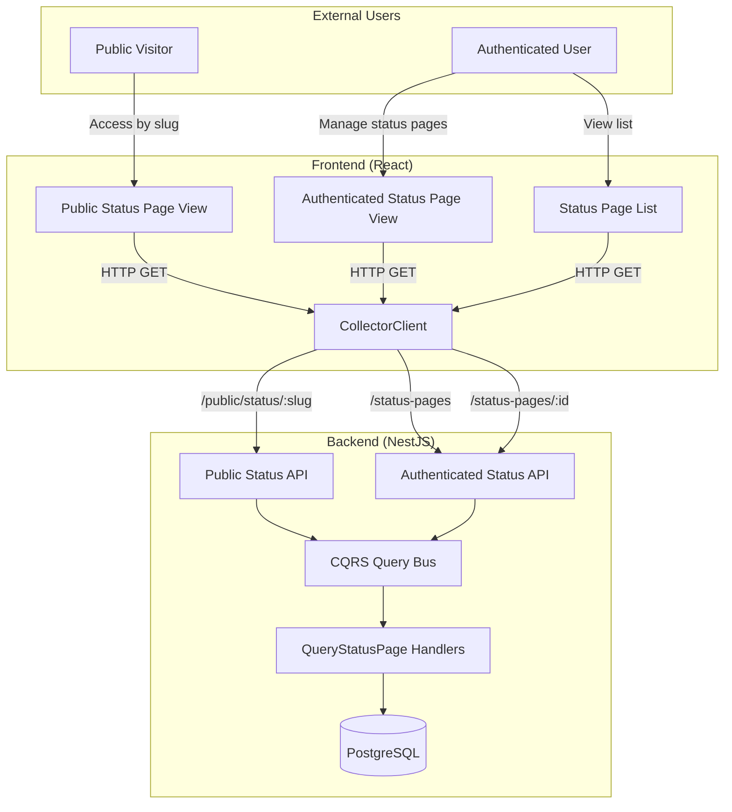
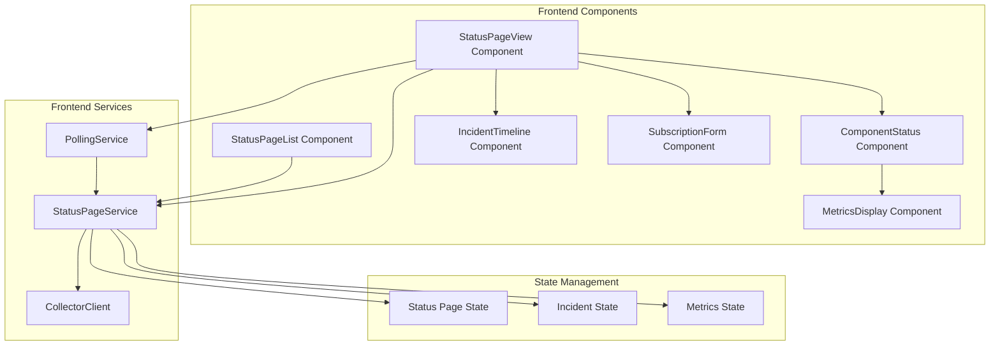
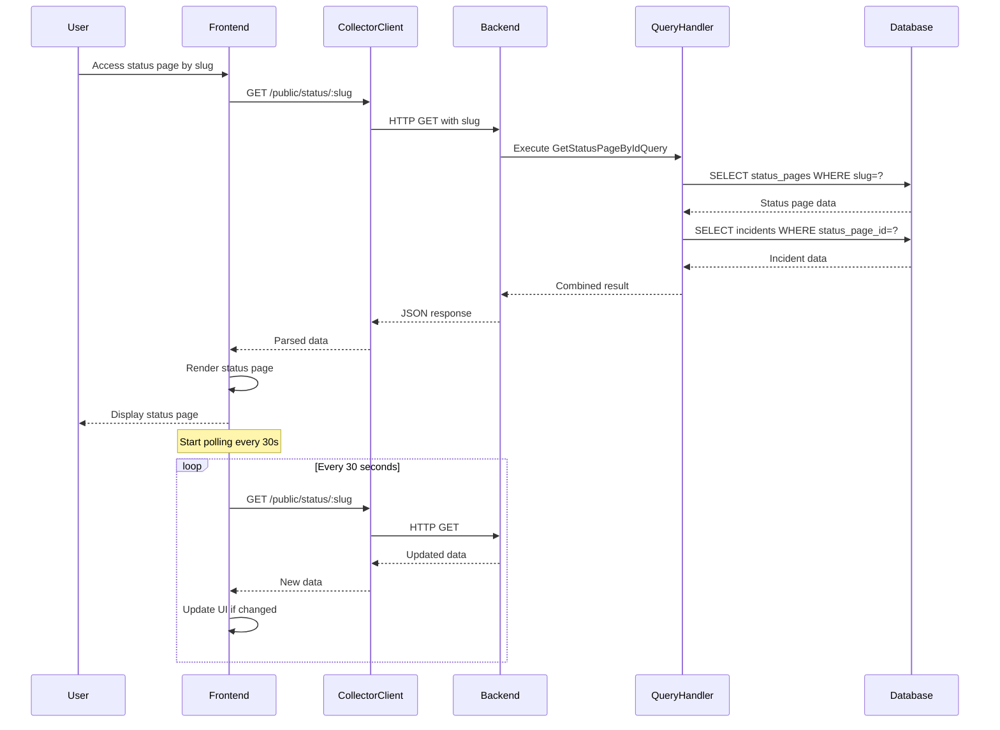

# Design Document: Status Page Monitoring Integration

## Overview

This design specifies the frontend-backend integration for the Status Page Monitoring feature in the TelemetryFlow platform. The system enables organizations to display public-facing status pages showing real-time system health, component metrics, incident timelines, and maintenance schedules.

The backend already provides CQRS query handlers (`QueryStatusPagesHandler`, `GetStatusPageByIdHandler`, `QueryIncidentsHandler`) that retrieve status page data from the database. This design focuses on:

1. Frontend components for displaying status pages (public and authenticated views)
2. API client integration using the existing CollectorClient pattern
3. Real-time polling for status updates
4. Data transformation and state management
5. Responsive UI with custom branding support

The integration follows the established patterns in the TelemetryFlow monolith:

- Backend: NestJS with CQRS (Command Query Responsibility Segregation)
- Frontend: React with TypeScript
- API Communication: REST with CollectorClient wrapper
- Multi-tenancy: Organization and workspace context

## Architecture

### System Context



### Component Architecture



### Data Flow



## Components and Interfaces

### Frontend Components

#### StatusPageService

The service layer handles all API communication for status pages.

```typescript
interface StatusPageService {
  /**
   * Fetch list of status pages (authenticated)
   * @param filter - Optional filter criteria
   * @param pagination - Page number and limit
   * @returns Paginated list of status pages
   */
  listStatusPages(
    filter?: StatusPageFilter,
    pagination?: PaginationOptions,
  ): Promise<PaginatedResponse<StatusPageSummary>>;

  /**
   * Fetch status page by ID (authenticated)
   * @param id - Status page ID
   * @returns Full status page details
   */
  getStatusPageById(id: string): Promise<StatusPageDetails>;

  /**
   * Fetch public status page by slug (no auth)
   * @param slug - Status page slug
   * @returns Public status page with incidents
   */
  getPublicStatusPage(slug: string): Promise<PublicStatusPage>;

  /**
   * Fetch incidents for a status page
   * @param statusPageId - Status page ID
   * @param filter - Optional status/impact filter
   * @returns List of incidents
   */
  getIncidents(
    statusPageId: string,
    filter?: IncidentFilter,
  ): Promise<Incident[]>;

  /**
   * Subscribe to status page updates
   * @param slug - Status page slug
   * @param email - Subscriber email
   * @param options - Notification preferences
   * @returns Subscription confirmation message
   */
  subscribe(
    slug: string,
    email: string,
    options?: SubscriptionOptions,
  ): Promise<{ message: string }>;
}
```

#### PollingService

Manages periodic polling for real-time updates.

```typescript
interface PollingService {
  /**
   * Start polling for status page updates
   * @param slug - Status page slug
   * @param interval - Polling interval in milliseconds (default 30000)
   * @param onUpdate - Callback when new data is received
   * @returns Cleanup function to stop polling
   */
  startPolling(
    slug: string,
    interval: number,
    onUpdate: (data: PublicStatusPage) => void,
  ): () => void;

  /**
   * Stop all active polling
   */
  stopAll(): void;
}
```

#### React Components

**StatusPageList Component**

- Displays paginated list of status pages
- Shows title, slug, overall status, active incident count
- Supports filtering by title/slug
- Handles loading and error states

```typescript
interface StatusPageListProps {
  organizationId: string;
  workspaceId?: string;
}

interface StatusPageListState {
  statusPages: StatusPageSummary[];
  loading: boolean;
  error: string | null;
  page: number;
  total: number;
  filter: StatusPageFilter;
}
```

**StatusPageView Component**

- Main component for displaying a status page
- Supports both public and authenticated modes
- Manages polling for real-time updates
- Renders child components (components, incidents, subscription)

```typescript
interface StatusPageViewProps {
  slug: string;
  isPublic: boolean;
}

interface StatusPageViewState {
  statusPage: PublicStatusPage | null;
  loading: boolean;
  error: string | null;
  lastUpdated: Date | null;
  connectionStatus: "connected" | "disconnected" | "reconnecting";
}
```

**ComponentStatus Component**

- Displays individual component with status and metrics
- Shows uptime percentages for configured ranges
- Shows latency percentiles (P50, P75, P90, P95, P99)
- Color-coded status indicators

```typescript
interface ComponentStatusProps {
  component: StatusPageComponent;
  showUptime: boolean;
  showResponseTime: boolean;
  uptimeRanges: string[];
}
```

**MetricsDisplay Component**

- Renders uptime and latency metrics
- Formats percentiles with appropriate units
- Handles missing data gracefully

```typescript
interface MetricsDisplayProps {
  metrics: ComponentMetrics;
  showUptime: boolean;
  showResponseTime: boolean;
  uptimeRanges: string[];
}

interface ComponentMetrics {
  uptime?: {
    "24h"?: number;
    "7d"?: number;
    "30d"?: number;
    "90d"?: number;
  };
  latency?: {
    p50Latency: number;
    p75Latency: number;
    p90Latency: number;
    p95Latency: number;
    p99Latency: number;
  };
}
```

**IncidentTimeline Component**

- Displays incidents in reverse chronological order
- Shows incident details, updates, and resolution
- Distinguishes scheduled maintenance visually
- Limits display to configured history days

```typescript
interface IncidentTimelineProps {
  incidents: Incident[];
  historyDays: number;
  showMaintenanceSchedule: boolean;
}
```

**SubscriptionForm Component**

- Email input with validation
- Subscription submission
- Success/error message display

```typescript
interface SubscriptionFormProps {
  slug: string;
  onSubscribe: (email: string) => Promise<void>;
}
```

### Backend API Endpoints

The backend already provides these endpoints (no changes needed):

**Authenticated Endpoints** (require JWT token)

- `GET /status-pages` - List status pages with pagination
- `GET /status-pages/:id` - Get status page by ID
- `GET /status-pages/:id/incidents` - List incidents for status page

**Public Endpoints** (no authentication)

- `GET /public/status/:slug` - Get public status page by slug
- `POST /public/status/:slug/subscribe` - Subscribe to updates

### API Response Formats

**Status Page Summary** (from list endpoint)

```typescript
interface StatusPageSummary {
  id: string;
  title: string;
  slug: string;
  description?: string;
  is_public: boolean;
  overall_status: OverallStatus;
  active_incidents: number;
  organization_id: string;
  workspace_id?: string;
  created_at: string;
  updated_at: string;
}

type OverallStatus =
  | "operational"
  | "degraded_performance"
  | "partial_outage"
  | "major_outage";
```

**Public Status Page** (from public endpoint)

```typescript
interface PublicStatusPage {
  id: string;
  title: string;
  slug: string;
  description?: string;
  overall_status: OverallStatus;

  // Branding
  logo_url?: string;
  favicon_url?: string;
  brand_color?: string;
  custom_css?: string;
  header_text?: string;
  footer_text?: string;
  support_url?: string;

  // Display settings
  show_uptime_percentage: boolean;
  show_response_time: boolean;
  show_incident_history: boolean;
  show_maintenance_schedule: boolean;
  allow_subscriptions: boolean;
  show_legend: boolean;
  uptime_ranges: string[];
  history_days: number;

  // Components (monitors)
  monitors: StatusPageComponent[];

  // Incidents
  incidents: Incident[];

  active_incidents: number;
  created_at: string;
  updated_at: string;
}
```

**Status Page Component** (monitor on status page)

```typescript
interface StatusPageComponent {
  monitor_id: string;
  display_name: string;
  description?: string;
  status: ComponentStatus;
  display_order: number;
  group_name?: string;
  is_visible: boolean;

  // Metrics
  uptime?: {
    "24h"?: number;
    "7d"?: number;
    "30d"?: number;
    "90d"?: number;
  };
  latency?: {
    p50Latency: number; // milliseconds
    p75Latency: number; // milliseconds
    p90Latency: number; // milliseconds
    p95Latency: number; // milliseconds
    p99Latency: number; // milliseconds
  };
}

type ComponentStatus =
  | "operational"
  | "degraded_performance"
  | "partial_outage"
  | "major_outage"
  | "under_maintenance";
```

**Incident**

```typescript
interface Incident {
  id: string;
  status_page_id: string;
  title: string;
  impact: IncidentImpact;
  status: IncidentStatus;
  message?: string;
  affected_monitor_ids: string[];
  updates: IncidentUpdate[];
  is_scheduled_maintenance: boolean;
  scheduled_start_at?: string;
  scheduled_end_at?: string;
  started_at: string;
  resolved_at?: string;
  created_at: string;
  updated_at: string;
}

type IncidentImpact = "none" | "minor" | "major" | "critical";

type IncidentStatus =
  | "investigating"
  | "identified"
  | "monitoring"
  | "resolved"
  | "scheduled"
  | "in_progress"
  | "completed";

interface IncidentUpdate {
  id: string;
  status: IncidentStatus;
  message: string;
  created_by: string;
  created_at: string;
}
```

## Data Models

### Frontend State Models

The frontend maintains state for status pages, incidents, and metrics using React state or a state management library (e.g., Zustand, Redux).

**StatusPageState**

```typescript
interface StatusPageState {
  // Current status page being viewed
  currentStatusPage: PublicStatusPage | null;

  // List view state
  statusPageList: StatusPageSummary[];
  listPagination: {
    page: number;
    limit: number;
    total: number;
    totalPages: number;
  };

  // Loading states
  loading: {
    list: boolean;
    detail: boolean;
    incidents: boolean;
  };

  // Error states
  errors: {
    list: string | null;
    detail: string | null;
    incidents: string | null;
  };

  // Polling state
  polling: {
    active: boolean;
    interval: number;
    lastUpdate: Date | null;
    connectionStatus: "connected" | "disconnected" | "reconnecting";
  };

  // Filter state
  filter: StatusPageFilter;
}

interface StatusPageFilter {
  title?: string;
  slug?: string;
  isPublic?: boolean;
  overallStatus?: OverallStatus;
}
```

**IncidentState**

```typescript
interface IncidentState {
  // Incidents by status page ID
  incidentsByStatusPage: Record<string, Incident[]>;

  // Loading and error states
  loading: boolean;
  error: string | null;
}
```

### Data Transformation

The frontend receives snake_case data from the backend API and may transform it to camelCase for internal use, or use it as-is to match the backend convention.

**Transformation Strategy:**

- Keep snake_case throughout to match backend (recommended for consistency)
- Use TypeScript interfaces to enforce type safety
- Transform display values (e.g., format dates, percentages, latencies)

**Example Transformations:**

```typescript
// Format uptime percentage
function formatUptime(uptime: number): string {
  return `${(uptime * 100).toFixed(2)}%`;
}

// Format latency in milliseconds
function formatLatency(latencyMs: number): string {
  return `${latencyMs.toFixed(0)}ms`;
}

// Format incident timestamp
function formatIncidentTime(timestamp: string): string {
  return new Date(timestamp).toLocaleString();
}

// Calculate time ago
function timeAgo(timestamp: string): string {
  const now = new Date();
  const then = new Date(timestamp);
  const diffMs = now.getTime() - then.getTime();
  const diffMins = Math.floor(diffMs / 60000);

  if (diffMins < 60) return `${diffMins}m ago`;
  const diffHours = Math.floor(diffMins / 60);
  if (diffHours < 24) return `${diffHours}h ago`;
  const diffDays = Math.floor(diffHours / 24);
  return `${diffDays}d ago`;
}
```

### Status Color Mapping

```typescript
const STATUS_COLORS = {
  operational: "#10B981", // green
  degraded_performance: "#F59E0B", // yellow
  partial_outage: "#F97316", // orange
  major_outage: "#EF4444", // red
  under_maintenance: "#6B7280", // gray
} as const;

const IMPACT_COLORS = {
  none: "#10B981", // green
  minor: "#F59E0B", // yellow
  major: "#F97316", // orange
  critical: "#EF4444", // red
} as const;
```

## Implementation Details

### CollectorClient Integration

The frontend uses the existing `CollectorClient` pattern for API communication. The client wraps HTTP requests and handles authentication, error handling, and response unwrapping.

```typescript
class StatusPageClient {
  constructor(private collectorClient: CollectorClient) {}

  async listStatusPages(
    filter?: StatusPageFilter,
    pagination?: PaginationOptions,
  ): Promise<PaginatedResponse<StatusPageSummary>> {
    const params = new URLSearchParams();
    if (filter?.title) params.append("title", filter.title);
    if (filter?.slug) params.append("slug", filter.slug);
    if (filter?.isPublic !== undefined)
      params.append("isPublic", String(filter.isPublic));
    if (filter?.overallStatus)
      params.append("overallStatus", filter.overallStatus);
    if (pagination?.page) params.append("page", String(pagination.page));
    if (pagination?.limit) params.append("limit", String(pagination.limit));

    const response = await this.collectorClient.get<{
      items: StatusPageSummary[];
      total: number;
      page: number;
      limit: number;
    }>(`/status-pages?${params.toString()}`);

    return {
      data: response.items,
      total: response.total,
      page: response.page,
      limit: response.limit,
      totalPages: Math.ceil(response.total / response.limit),
      hasNext: response.page < Math.ceil(response.total / response.limit),
      hasPrev: response.page > 1,
    };
  }

  async getPublicStatusPage(slug: string): Promise<PublicStatusPage> {
    return this.collectorClient.get<PublicStatusPage>(`/public/status/${slug}`);
  }

  async getIncidents(
    statusPageId: string,
    filter?: IncidentFilter,
  ): Promise<Incident[]> {
    const params = new URLSearchParams();
    if (filter?.status) params.append("status", filter.status);
    if (filter?.impact) params.append("impact", filter.impact);

    return this.collectorClient.get<Incident[]>(
      `/status-pages/${statusPageId}/incidents?${params.toString()}`,
    );
  }

  async subscribe(
    slug: string,
    email: string,
    options?: SubscriptionOptions,
  ): Promise<{ message: string }> {
    return this.collectorClient.post(`/public/status/${slug}/subscribe`, {
      email,
      notificationType: options?.notificationType || "all",
      monitorIds: options?.monitorIds,
    });
  }
}
```

### Polling Implementation

The polling service manages periodic updates with exponential backoff on failures.

```typescript
class PollingServiceImpl implements PollingService {
  private intervals: Map<string, NodeJS.Timeout> = new Map();
  private retryCount: Map<string, number> = new Map();

  startPolling(
    slug: string,
    interval: number,
    onUpdate: (data: PublicStatusPage) => void,
  ): () => void {
    // Stop existing polling for this slug
    this.stopPolling(slug);

    const poll = async () => {
      try {
        const data = await statusPageClient.getPublicStatusPage(slug);
        onUpdate(data);
        this.retryCount.set(slug, 0); // Reset retry count on success
      } catch (error) {
        const retries = this.retryCount.get(slug) || 0;
        this.retryCount.set(slug, retries + 1);

        // Exponential backoff: 30s, 60s, 120s, max 300s
        const backoffInterval = Math.min(
          interval * Math.pow(2, retries),
          300000,
        );

        // Reschedule with backoff
        this.stopPolling(slug);
        const timeoutId = setTimeout(() => {
          this.startPolling(slug, interval, onUpdate);
        }, backoffInterval);
        this.intervals.set(slug, timeoutId);
      }
    };

    // Initial poll
    poll();

    // Schedule recurring polls
    const timeoutId = setInterval(poll, interval);
    this.intervals.set(slug, timeoutId);

    // Return cleanup function
    return () => this.stopPolling(slug);
  }

  private stopPolling(slug: string): void {
    const timeoutId = this.intervals.get(slug);
    if (timeoutId) {
      clearInterval(timeoutId);
      this.intervals.delete(slug);
    }
  }

  stopAll(): void {
    this.intervals.forEach((timeoutId) => clearInterval(timeoutId));
    this.intervals.clear();
    this.retryCount.clear();
  }
}
```

### React Component Implementation Patterns

**StatusPageView with Polling**

```typescript
function StatusPageView({ slug, isPublic }: StatusPageViewProps) {
  const [statusPage, setStatusPage] = useState<PublicStatusPage | null>(null);
  const [loading, setLoading] = useState(true);
  const [error, setError] = useState<string | null>(null);
  const [connectionStatus, setConnectionStatus] = useState<'connected' | 'disconnected' | 'reconnecting'>('connected');

  useEffect(() => {
    let cleanup: (() => void) | null = null;

    const loadStatusPage = async () => {
      try {
        setLoading(true);
        const data = await statusPageClient.getPublicStatusPage(slug);
        setStatusPage(data);
        setError(null);
        setConnectionStatus('connected');
      } catch (err) {
        setError(err.message);
        setConnectionStatus('disconnected');
      } finally {
        setLoading(false);
      }
    };

    loadStatusPage();

    // Start polling after initial load
    if (!loading && !error) {
      cleanup = pollingService.startPolling(slug, 30000, (data) => {
        setStatusPage(data);
        setConnectionStatus('connected');
      });
    }

    return () => {
      if (cleanup) cleanup();
    };
  }, [slug]);

  if (loading) return <LoadingSpinner />;
  if (error) return <ErrorMessage error={error} onRetry={() => window.location.reload()} />;
  if (!statusPage) return <NotFound />;

  return (
    <div className="status-page">
      <StatusPageHeader statusPage={statusPage} />
      <OverallStatus status={statusPage.overall_status} />
      <ComponentList
        components={statusPage.monitors}
        showUptime={statusPage.show_uptime_percentage}
        showResponseTime={statusPage.show_response_time}
        uptimeRanges={statusPage.uptime_ranges}
      />
      {statusPage.show_incident_history && (
        <IncidentTimeline
          incidents={statusPage.incidents}
          historyDays={statusPage.history_days}
          showMaintenanceSchedule={statusPage.show_maintenance_schedule}
        />
      )}
      {statusPage.allow_subscriptions && (
        <SubscriptionForm slug={slug} />
      )}
      <ConnectionIndicator status={connectionStatus} />
    </div>
  );
}
```

### Branding and Custom CSS

Custom branding is applied dynamically based on status page configuration.

```typescript
function applyBranding(statusPage: PublicStatusPage): void {
  // Apply brand color
  if (statusPage.brand_color) {
    document.documentElement.style.setProperty(
      "--brand-color",
      statusPage.brand_color,
    );
  }

  // Apply favicon
  if (statusPage.favicon_url) {
    const link = document.querySelector("link[rel*='icon']") as HTMLLinkElement;
    if (link) {
      link.href = statusPage.favicon_url;
    }
  }

  // Apply custom CSS (sanitized)
  if (statusPage.custom_css) {
    const sanitizedCSS = sanitizeCSS(statusPage.custom_css);
    const styleElement = document.createElement("style");
    styleElement.textContent = sanitizedCSS;
    styleElement.id = "status-page-custom-css";
    document.head.appendChild(styleElement);
  }
}

function sanitizeCSS(css: string): string {
  // Remove potentially dangerous CSS
  // - No @import (prevents loading external resources)
  // - No javascript: URLs
  // - No expression() (IE-specific)
  let sanitized = css.replace(/@import/gi, "");
  sanitized = sanitized.replace(/javascript:/gi, "");
  sanitized = sanitized.replace(/expression\s*\(/gi, "");
  return sanitized;
}
```

### Responsive Design

The status page uses responsive breakpoints:

```css
/* Mobile: < 640px */
@media (max-width: 639px) {
  .component-metrics {
    flex-direction: column;
  }
  .incident-timeline {
    padding: 1rem;
  }
}

/* Tablet: 640px - 1024px */
@media (min-width: 640px) and (max-width: 1023px) {
  .component-grid {
    grid-template-columns: repeat(2, 1fr);
  }
}

/* Desktop: >= 1024px */
@media (min-width: 1024px) {
  .component-grid {
    grid-template-columns: repeat(3, 1fr);
  }
  .status-page-container {
    max-width: 1200px;
    margin: 0 auto;
  }
}
```

### Error Handling Strategy

```typescript
function handleAPIError(error: any): string {
  if (error.response) {
    switch (error.response.status) {
      case 404:
        return "Status page not found";
      case 403:
        return "Access denied";
      case 500:
        return "Server error, please try again later";
      default:
        return error.response.data?.message || "An error occurred";
    }
  } else if (error.request) {
    return "Network error, please check your connection";
  } else {
    return error.message || "An unexpected error occurred";
  }
}
```

## Correctness Properties

A property is a characteristic or behavior that should hold true across all valid executions of a system—essentially, a formal statement about what the system should do. Properties serve as the bridge between human-readable specifications and machine-verifiable correctness guarantees.

### Property Reflection

After analyzing all acceptance criteria, several properties can be consolidated:

- Properties 1.2, 2.2, 3.1 all test that rendered output contains required fields - these can be combined into comprehensive rendering properties
- Properties 2.4 and 3.2 both test uptime display - consolidated into one property
- Properties 2.5 and 3.3 both test latency display - consolidated into one property
- Properties 4.3, 4.4, 4.5 all test incident rendering - consolidated into comprehensive incident property
- Properties 7.2, 7.3, 7.4 all test authenticated view rendering - consolidated into one property
- Properties 10.1-10.6 all test branding application - consolidated into comprehensive branding property

### Rendering Properties

Property 1: Status page list rendering completeness
_For any_ list of status pages, when rendered by the Frontend, each status page in the output SHALL include title, slug, overall_status, and active_incidents fields
**Validates: Requirements 1.2**

Property 2: Status page detail rendering completeness
_For any_ status page data retrieved from the Backend, when rendered by the Frontend, the output SHALL include title, description, overall_status, and all branding elements (logo_url, brand_color, header_text, footer_text, support_url)
**Validates: Requirements 2.2**

Property 3: Component rendering completeness
_For any_ component in a status page, when rendered by the Frontend, the output SHALL include display_name, description, and status
**Validates: Requirements 3.1**

Property 4: Visible components filter
_For any_ status page with monitors, when rendered by the Frontend, only monitors where is_visible=true SHALL appear in the rendered output
**Validates: Requirements 2.3**

Property 5: Uptime metrics rendering
_For any_ component with uptime data, when show_uptime_percentage is true, the rendered output SHALL include uptime percentages for all configured time ranges in uptime_ranges
**Validates: Requirements 2.4, 3.2**

Property 6: Latency metrics rendering
_For any_ component with latency data, when show_response_time is true, the rendered output SHALL include all five percentiles (p50Latency, p75Latency, p90Latency, p95Latency, p99Latency) formatted in milliseconds
**Validates: Requirements 2.5, 3.3**

Property 7: Status color mapping
_For any_ component status value, the rendered output SHALL apply the correct color code (operational: green, degraded_performance: yellow, partial_outage: orange, major_outage: red, under_maintenance: gray)
**Validates: Requirements 3.4**

Property 8: Component grouping
_For any_ set of components with group_name values, when rendered by the Frontend, components SHALL be organized by group_name with all components in the same group appearing together
**Validates: Requirements 3.5**

Property 9: Missing data fallback
_For any_ component without uptime or latency data, when rendered by the Frontend, the output SHALL display "No data available" instead of metrics
**Validates: Requirements 3.6**

### Incident Properties

Property 10: Incident chronological ordering
_For any_ list of incidents, when rendered by the Frontend, incidents SHALL be sorted in reverse chronological order by created_at (newest first)
**Validates: Requirements 2.6, 4.2**

Property 11: Incident rendering completeness
_For any_ incident, when rendered by the Frontend, the output SHALL include title, impact, status, affected_monitor_ids, and started_at
**Validates: Requirements 2.6, 4.3**

Property 12: Incident updates rendering
_For any_ incident with updates, when rendered by the Frontend, all updates SHALL be displayed in chronological order (oldest first) with status, message, and created_at for each update
**Validates: Requirements 4.4**

Property 13: Resolved incident display
_For any_ incident where resolved_at is not null, when rendered by the Frontend, the output SHALL include the resolved_at timestamp
**Validates: Requirements 4.5**

Property 14: Scheduled maintenance indicator
_For any_ incident where is_scheduled_maintenance is true, when rendered by the Frontend, the output SHALL include a distinct visual indicator and display scheduled_start_at and scheduled_end_at
**Validates: Requirements 2.7, 4.6**

Property 15: Incident history time filtering
_For any_ status page with history_days configured, when incidents are rendered by the Frontend, only incidents where created_at is within history_days from the current date SHALL be displayed
**Validates: Requirements 4.7**

### Pagination and Filtering Properties

Property 16: Pagination parameter transmission
_For any_ page number and limit value, when the Frontend requests a status page list, the API request SHALL include page and limit query parameters with those values
**Validates: Requirements 1.4**

Property 17: Filter parameter transmission
_For any_ filter criteria (title, slug, isPublic, overallStatus), when the Frontend requests a status page list, the API request SHALL include those filter values as query parameters
**Validates: Requirements 1.5**

### Subscription Properties

Property 18: Subscription form visibility
_For any_ status page where allow_subscriptions is true, when rendered by the Frontend, the output SHALL include a subscription form with email input
**Validates: Requirements 6.1**

Property 19: Email validation
_For any_ string submitted to the subscription form, the Frontend SHALL validate it matches email format (contains @ and domain) before making the API request
**Validates: Requirements 6.5**

Property 20: Subscription API call
_For any_ valid email address submitted to the subscription form, the Frontend SHALL make a POST request to /public/status/:slug/subscribe with the email in the request body
**Validates: Requirements 6.2**

### Polling Properties

Property 21: Exponential backoff calculation
_For any_ polling failure with retry count N, the next retry interval SHALL be min(baseInterval \* 2^N, 300000) milliseconds
**Validates: Requirements 5.4**

### Authenticated View Properties

Property 22: Authenticated view completeness
_For any_ status page retrieved via authenticated endpoint, when rendered by the Frontend, the output SHALL include all public fields plus subscriber_count, subscription_settings, and custom_domain configuration
**Validates: Requirements 7.2, 7.3, 7.4**

### Accessibility Properties

Property 23: Semantic HTML usage
_For any_ rendered status page component, the HTML output SHALL use semantic elements (header, main, section, article, nav, footer) rather than generic div elements for structural components
**Validates: Requirements 9.2**

Property 24: ARIA label presence
_For any_ status indicator or interactive element (buttons, links, form inputs), the rendered output SHALL include appropriate ARIA labels (aria-label, aria-labelledby, or aria-describedby)
**Validates: Requirements 9.3**

Property 25: Color contrast compliance
_For any_ status color applied to text, the color contrast ratio between text and background SHALL be at least 4.5:1 for normal text and 3:1 for large text (WCAG AA)
**Validates: Requirements 9.4**

### Branding Properties

Property 26: Logo display
_For any_ status page with logo_url set, when rendered by the Frontend, the header SHALL include an img element with src attribute equal to logo_url
**Validates: Requirements 10.1**

Property 27: Brand color application
_For any_ status page with brand_color set, when rendered by the Frontend, the CSS custom property --brand-color SHALL be set to that value
**Validates: Requirements 10.2**

Property 28: Custom CSS sanitization
_For any_ status page with custom_css, when applied by the Frontend, the CSS SHALL have @import, javascript:, and expression() removed before injection
**Validates: Requirements 10.3**

Property 29: Header text display
_For any_ status page with header_text set, when rendered by the Frontend, the header SHALL include the header_text content
**Validates: Requirements 10.4**

Property 30: Footer text display
_For any_ status page with footer_text set, when rendered by the Frontend, the footer SHALL include the footer_text content and support_url link if provided
**Validates: Requirements 10.5**

Property 31: Favicon application
_For any_ status page with favicon_url set, when rendered by the Frontend, the document head SHALL include a link element with rel="icon" and href equal to favicon_url
**Validates: Requirements 10.6**

### Severity Indicator Property

Property 32: Active incident highlighting
_For any_ status page in a list where active_incidents > 0, when rendered by the Frontend, the status page SHALL include a visual severity indicator based on overall_status
**Validates: Requirements 1.3**

## Error Handling

### Error Categories

The frontend handles four categories of errors:

1. **Network Errors**: Connection failures, timeouts, DNS resolution failures
2. **HTTP Errors**: 4xx and 5xx status codes from the backend
3. **Validation Errors**: Client-side validation failures before API calls
4. **Parsing Errors**: Invalid JSON or unexpected response format

### Error Handling Strategy

```typescript
interface ErrorState {
  type: "network" | "http" | "validation" | "parsing";
  message: string;
  statusCode?: number;
  retryable: boolean;
  details?: any;
}

function handleError(error: any): ErrorState {
  // Network errors (no response received)
  if (!error.response) {
    return {
      type: "network",
      message: "Network error, please check your connection",
      retryable: true,
    };
  }

  // HTTP errors (response received with error status)
  const status = error.response.status;
  const errorMessages: Record<number, string> = {
    404: "Status page not found",
    403: "Access denied",
    401: "Authentication required",
    500: "Server error, please try again later",
    502: "Bad gateway, please try again later",
    503: "Service unavailable, please try again later",
  };

  return {
    type: "http",
    message: errorMessages[status] || "An error occurred",
    statusCode: status,
    retryable: status >= 500, // Retry server errors, not client errors
    details: error.response.data,
  };
}
```

### Retry Logic

```typescript
interface RetryConfig {
  maxRetries: number;
  baseDelay: number;
  maxDelay: number;
}

async function retryWithBackoff<T>(
  fn: () => Promise<T>,
  config: RetryConfig = { maxRetries: 3, baseDelay: 1000, maxDelay: 10000 },
): Promise<T> {
  let lastError: any;

  for (let attempt = 0; attempt <= config.maxRetries; attempt++) {
    try {
      return await fn();
    } catch (error) {
      lastError = error;
      const errorState = handleError(error);

      // Don't retry non-retryable errors
      if (!errorState.retryable || attempt === config.maxRetries) {
        throw error;
      }

      // Calculate exponential backoff delay
      const delay = Math.min(
        config.baseDelay * Math.pow(2, attempt),
        config.maxDelay,
      );

      await new Promise((resolve) => setTimeout(resolve, delay));
    }
  }

  throw lastError;
}
```

### Error Display Components

```typescript
interface ErrorMessageProps {
  error: ErrorState;
  onRetry?: () => void;
  onDismiss?: () => void;
}

function ErrorMessage({ error, onRetry, onDismiss }: ErrorMessageProps) {
  return (
    <div className={`error-message error-${error.type}`} role="alert">
      <div className="error-icon">⚠️</div>
      <div className="error-content">
        <p className="error-title">{error.message}</p>
        {error.details && (
          <p className="error-details">{JSON.stringify(error.details)}</p>
        )}
      </div>
      <div className="error-actions">
        {error.retryable && onRetry && (
          <button onClick={onRetry} className="retry-button">
            Retry
          </button>
        )}
        {onDismiss && (
          <button onClick={onDismiss} className="dismiss-button">
            Dismiss
          </button>
        )}
      </div>
    </div>
  );
}
```

### Loading States

```typescript
interface LoadingState {
  isLoading: boolean;
  loadingMessage?: string;
  progress?: number;
}

function LoadingSpinner({ message, progress }: { message?: string; progress?: number }) {
  return (
    <div className="loading-container" role="status" aria-live="polite">
      <div className="spinner" aria-hidden="true"></div>
      {message && <p className="loading-message">{message}</p>}
      {progress !== undefined && (
        <div className="progress-bar">
          <div className="progress-fill" style={{ width: `${progress}%` }}></div>
        </div>
      )}
      <span className="sr-only">Loading...</span>
    </div>
  );
}
```

### Connection Status Indicator

```typescript
type ConnectionStatus = 'connected' | 'disconnected' | 'reconnecting';

function ConnectionIndicator({ status }: { status: ConnectionStatus }) {
  const statusConfig = {
    connected: { icon: '✓', color: 'green', message: 'Connected' },
    disconnected: { icon: '✗', color: 'red', message: 'Disconnected' },
    reconnecting: { icon: '↻', color: 'yellow', message: 'Reconnecting...' },
  };

  const config = statusConfig[status];

  return (
    <div
      className={`connection-indicator connection-${status}`}
      role="status"
      aria-live="polite"
    >
      <span className="connection-icon" style={{ color: config.color }}>
        {config.icon}
      </span>
      <span className="connection-message">{config.message}</span>
    </div>
  );
}
```

## Testing Strategy

### Dual Testing Approach

This feature requires both unit tests and property-based tests to ensure comprehensive coverage:

- **Unit tests**: Verify specific examples, edge cases, error conditions, and integration points
- **Property-based tests**: Verify universal properties across all inputs through randomization

Together, these approaches provide comprehensive coverage where unit tests catch concrete bugs and property-based tests verify general correctness.

### Property-Based Testing

We will use **fast-check** (for TypeScript/JavaScript) as the property-based testing library. Each property test will:

- Run a minimum of 100 iterations with randomized inputs
- Reference the design document property it validates
- Use the tag format: `Feature: frontend-backend-status-page-integration, Property N: [property text]`

#### Example Property Test Structure

```typescript
import fc from "fast-check";

describe("Status Page Rendering Properties", () => {
  // Feature: frontend-backend-status-page-integration, Property 1: Status page list rendering completeness
  it("should render all required fields for any status page list", () => {
    fc.assert(
      fc.property(fc.array(statusPageSummaryArbitrary()), (statusPages) => {
        const rendered = renderStatusPageList(statusPages);

        statusPages.forEach((page) => {
          expect(rendered).toContain(page.title);
          expect(rendered).toContain(page.slug);
          expect(rendered).toContain(page.overall_status);
          expect(rendered).toContain(String(page.active_incidents));
        });
      }),
      { numRuns: 100 },
    );
  });

  // Feature: frontend-backend-status-page-integration, Property 5: Uptime metrics rendering
  it("should render uptime for all configured ranges when enabled", () => {
    fc.assert(
      fc.property(
        componentWithUptimeArbitrary(),
        fc.array(fc.constantFrom("24h", "7d", "30d", "90d"), { minLength: 1 }),
        (component, uptimeRanges) => {
          const rendered = renderComponent(component, {
            showUptime: true,
            uptimeRanges,
          });

          uptimeRanges.forEach((range) => {
            if (component.uptime?.[range] !== undefined) {
              expect(rendered).toContain(formatUptime(component.uptime[range]));
            }
          });
        },
      ),
      { numRuns: 100 },
    );
  });
});
```

#### Arbitrary Generators

Property-based tests require generators (arbitraries) for creating random test data:

```typescript
// Generate random status page summaries
function statusPageSummaryArbitrary(): fc.Arbitrary<StatusPageSummary> {
  return fc.record({
    id: fc.uuid(),
    title: fc.string({ minLength: 1, maxLength: 100 }),
    slug: fc
      .string({ minLength: 1, maxLength: 50 })
      .map((s) => s.toLowerCase()),
    description: fc.option(fc.string({ maxLength: 500 })),
    is_public: fc.boolean(),
    overall_status: fc.constantFrom(
      "operational",
      "degraded_performance",
      "partial_outage",
      "major_outage",
    ),
    active_incidents: fc.nat({ max: 20 }),
    organization_id: fc.uuid(),
    workspace_id: fc.option(fc.uuid()),
    created_at: fc.date().map((d) => d.toISOString()),
    updated_at: fc.date().map((d) => d.toISOString()),
  });
}

// Generate random components with uptime data
function componentWithUptimeArbitrary(): fc.Arbitrary<StatusPageComponent> {
  return fc.record({
    monitor_id: fc.uuid(),
    display_name: fc.string({ minLength: 1, maxLength: 100 }),
    description: fc.option(fc.string({ maxLength: 500 })),
    status: fc.constantFrom(
      "operational",
      "degraded_performance",
      "partial_outage",
      "major_outage",
      "under_maintenance",
    ),
    display_order: fc.nat({ max: 100 }),
    group_name: fc.option(fc.string({ maxLength: 50 })),
    is_visible: fc.boolean(),
    uptime: fc.record({
      "24h": fc.option(fc.double({ min: 0, max: 1 })),
      "7d": fc.option(fc.double({ min: 0, max: 1 })),
      "30d": fc.option(fc.double({ min: 0, max: 1 })),
      "90d": fc.option(fc.double({ min: 0, max: 1 })),
    }),
    latency: fc.option(
      fc.record({
        p50Latency: fc.nat({ max: 5000 }),
        p75Latency: fc.nat({ max: 5000 }),
        p90Latency: fc.nat({ max: 5000 }),
        p95Latency: fc.nat({ max: 5000 }),
        p99Latency: fc.nat({ max: 5000 }),
      }),
    ),
  });
}

// Generate random incidents
function incidentArbitrary(): fc.Arbitrary<Incident> {
  return fc.record({
    id: fc.uuid(),
    status_page_id: fc.uuid(),
    title: fc.string({ minLength: 1, maxLength: 200 }),
    impact: fc.constantFrom("none", "minor", "major", "critical"),
    status: fc.constantFrom(
      "investigating",
      "identified",
      "monitoring",
      "resolved",
      "scheduled",
      "in_progress",
      "completed",
    ),
    message: fc.option(fc.string({ maxLength: 1000 })),
    affected_monitor_ids: fc.array(fc.uuid(), { maxLength: 10 }),
    updates: fc.array(incidentUpdateArbitrary(), { maxLength: 20 }),
    is_scheduled_maintenance: fc.boolean(),
    scheduled_start_at: fc.option(fc.date().map((d) => d.toISOString())),
    scheduled_end_at: fc.option(fc.date().map((d) => d.toISOString())),
    started_at: fc.date().map((d) => d.toISOString()),
    resolved_at: fc.option(fc.date().map((d) => d.toISOString())),
    created_at: fc.date().map((d) => d.toISOString()),
    updated_at: fc.date().map((d) => d.toISOString()),
  });
}
```

### Unit Testing

Unit tests focus on specific examples, edge cases, and integration points:

#### Component Rendering Tests

```typescript
describe('StatusPageView Component', () => {
  it('should display loading spinner while fetching data', () => {
    const { getByRole } = render(<StatusPageView slug="test" isPublic={true} />);
    expect(getByRole('status')).toBeInTheDocument();
  });

  it('should display error message when status page not found', async () => {
    mockAPI.getPublicStatusPage.mockRejectedValue({ response: { status: 404 } });
    const { findByText } = render(<StatusPageView slug="nonexistent" isPublic={true} />);
    expect(await findByText('Status page not found')).toBeInTheDocument();
  });

  it('should display status page with all sections when data loads', async () => {
    const mockData = createMockStatusPage();
    mockAPI.getPublicStatusPage.mockResolvedValue(mockData);

    const { findByText, getByRole } = render(<StatusPageView slug="test" isPublic={true} />);

    expect(await findByText(mockData.title)).toBeInTheDocument();
    expect(getByRole('main')).toBeInTheDocument();
  });
});
```

#### API Client Tests

```typescript
describe("StatusPageClient", () => {
  it("should include filter parameters in list request", async () => {
    const client = new StatusPageClient(mockCollectorClient);
    await client.listStatusPages(
      { title: "test", isPublic: true },
      { page: 2, limit: 10 },
    );

    expect(mockCollectorClient.get).toHaveBeenCalledWith(
      expect.stringContaining("title=test"),
    );
    expect(mockCollectorClient.get).toHaveBeenCalledWith(
      expect.stringContaining("isPublic=true"),
    );
    expect(mockCollectorClient.get).toHaveBeenCalledWith(
      expect.stringContaining("page=2"),
    );
  });

  it("should call public endpoint for public status pages", async () => {
    const client = new StatusPageClient(mockCollectorClient);
    await client.getPublicStatusPage("my-status");

    expect(mockCollectorClient.get).toHaveBeenCalledWith(
      "/public/status/my-status",
    );
  });
});
```

#### Polling Service Tests

```typescript
describe("PollingService", () => {
  beforeEach(() => {
    jest.useFakeTimers();
  });

  afterEach(() => {
    jest.useRealTimers();
  });

  it("should poll at specified interval", async () => {
    const onUpdate = jest.fn();
    const service = new PollingServiceImpl();

    service.startPolling("test-slug", 30000, onUpdate);

    jest.advanceTimersByTime(30000);
    expect(onUpdate).toHaveBeenCalledTimes(1);

    jest.advanceTimersByTime(30000);
    expect(onUpdate).toHaveBeenCalledTimes(2);
  });

  it("should stop polling when cleanup function is called", () => {
    const onUpdate = jest.fn();
    const service = new PollingServiceImpl();

    const cleanup = service.startPolling("test-slug", 30000, onUpdate);
    cleanup();

    jest.advanceTimersByTime(60000);
    expect(onUpdate).not.toHaveBeenCalled();
  });
});
```

#### Error Handling Tests

```typescript
describe("Error Handling", () => {
  it("should return correct error state for 404", () => {
    const error = { response: { status: 404, data: {} } };
    const errorState = handleError(error);

    expect(errorState.type).toBe("http");
    expect(errorState.message).toBe("Status page not found");
    expect(errorState.statusCode).toBe(404);
    expect(errorState.retryable).toBe(false);
  });

  it("should return correct error state for network error", () => {
    const error = { request: {}, message: "Network Error" };
    const errorState = handleError(error);

    expect(errorState.type).toBe("network");
    expect(errorState.retryable).toBe(true);
  });

  it("should mark 5xx errors as retryable", () => {
    const error = { response: { status: 500, data: {} } };
    const errorState = handleError(error);

    expect(errorState.retryable).toBe(true);
  });
});
```

### Test Coverage Goals

- **Unit Test Coverage**: Minimum 80% code coverage for all service and component files
- **Property Test Coverage**: All 32 correctness properties must have corresponding property-based tests
- **Integration Test Coverage**: Key user flows (view public status page, list status pages, subscribe)
- **Accessibility Test Coverage**: ARIA labels, semantic HTML, color contrast

### Testing Tools

- **Unit Testing**: Jest + React Testing Library
- **Property-Based Testing**: fast-check
- **Accessibility Testing**: jest-axe
- **API Mocking**: MSW (Mock Service Worker)
- **Component Testing**: React Testing Library with user-event
