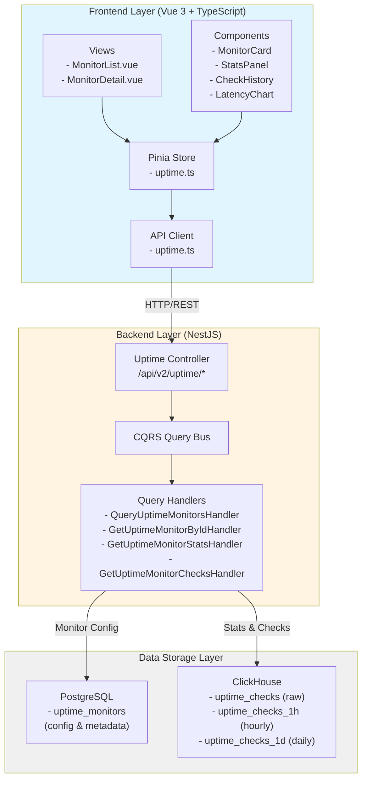
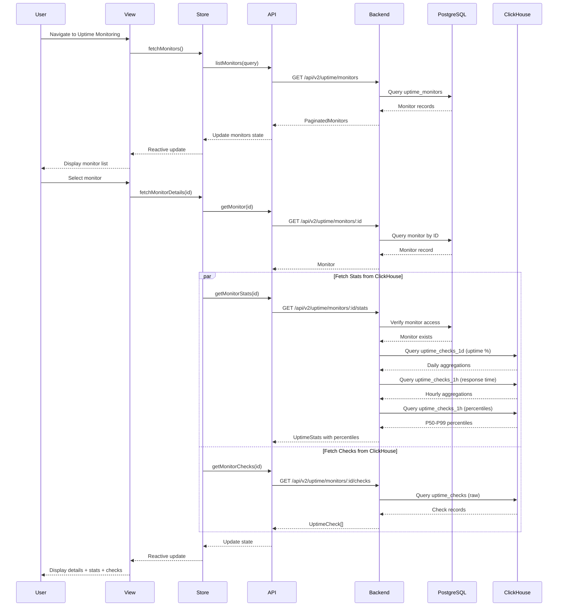
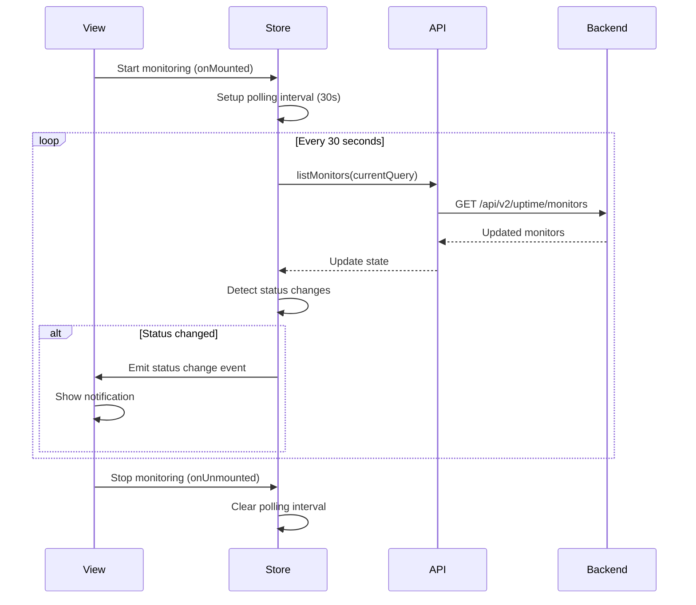

# Design Document: Uptime Monitoring Frontend-Backend Integration

## Overview

This design document specifies the integration between the TelemetryFlow frontend and the existing backend QueryUptime handlers. The integration enables users to view uptime monitors, check results, availability metrics with latency percentiles, and incident history through a comprehensive web interface.

The system leverages existing backend infrastructure (QueryUptimeMonitorsHandler, GetUptimeMonitorByIdHandler, GetUptimeMonitorStatsHandler, GetUptimeMonitorChecksHandler) and extends them to support latency percentile calculations. The frontend will be built using Vue 3 with TypeScript, following the existing TelemetryFlow architecture patterns.

### Key Design Goals

1. Seamless integration with existing backend QueryUptime handlers
2. Real-time monitor status updates via polling
3. Comprehensive latency metrics including P50, P75, P90, P95, P99 percentiles
4. Responsive UI with loading states and error handling
5. Efficient data fetching with caching and pagination
6. Support for multiple monitor types (HTTP, TCP, ICMP, DNS)

## Architecture

### System Architecture



### Data Flow Architecture



### Real-Time Update Flow



## Components and Interfaces

### Frontend Components

#### 1. MonitorList View

Primary view for displaying all uptime monitors with filtering and pagination.

**Responsibilities:**

- Fetch and display paginated monitor list
- Handle filter controls (name, type, status)
- Navigate to monitor detail view
- Show real-time status updates

**Props:** None (route-based)

**State:**

- filters: { name?: string, type?: MonitorType, status?: MonitorStatus }
- pagination: { page: number, pageSize: number }
- loading: boolean
- error: string | null

#### 2. MonitorDetail View

Detailed view for a single monitor showing configuration, stats, and check history.

**Responsibilities:**

- Display monitor configuration
- Show availability metrics with latency percentiles
- Render check history with response time trends
- Display incident timeline

**Props:**

- monitorId: string (from route params)

**State:**

- monitor: Monitor | null
- stats: UptimeStats | null
- checks: UptimeCheck[]
- loading: boolean
- error: string | null

#### 3. MonitorCard Component

Card component displaying summary information for a single monitor.

**Props:**

- monitor: Monitor
- showStats: boolean (default: true)

**Emits:**

- click: (monitorId: string) => void

**Template Structure:**

```vue
<div class="monitor-card" :class="statusClass">
  <div class="monitor-header">
    <MonitorTypeIcon :type="monitor.type" />
    <h3>{{ monitor.name }}</h3>
    <StatusBadge :status="monitor.status" />
  </div>
  <div class="monitor-url">{{ monitor.url }}</div>
  <div class="monitor-stats" v-if="showStats && monitor.uptimeStats">
    <StatItem label="24h Uptime" :value="monitor.uptimeStats.uptime24h" unit="%" />
    <StatItem label="Avg Response" :value="monitor.uptimeStats.avgResponseTime24h" unit="ms" />
  </div>
  <div class="monitor-footer">
    <span class="last-check">Last check: {{ formatRelativeTime(monitor.lastCheckAt) }}</span>
  </div>
</div>
```

#### 4. StatsPanel Component

Panel displaying availability metrics and latency percentiles for multiple time ranges.

**Props:**

- stats: UptimeStats
- loading: boolean

**Template Structure:**

```vue
<div class="stats-panel">
  <div class="time-range-tabs">
    <button v-for="range in timeRanges" :key="range"
            :class="{ active: selectedRange === range }"
            @click="selectedRange = range">
      {{ range }}
    </button>
  </div>

  <div class="stats-grid">
    <StatCard title="Uptime" :value="currentUptime" unit="%" :trend="uptimeTrend" />
    <StatCard title="Avg Response Time" :value="currentAvgResponse" unit="ms" />
    <StatCard title="Total Checks" :value="totalChecks" />
    <StatCard title="Failed Checks" :value="failedChecks" />
  </div>

  <div class="latency-percentiles">
    <h4>Latency Percentiles ({{ selectedRange }})</h4>
    <div class="percentile-grid">
      <PercentileBar label="P50" :value="stats.p50Latency" />
      <PercentileBar label="P75" :value="stats.p75Latency" />
      <PercentileBar label="P90" :value="stats.p90Latency" />
      <PercentileBar label="P95" :value="stats.p95Latency" />
      <PercentileBar label="P99" :value="stats.p99Latency" />
    </div>
  </div>
</div>
```

#### 5. CheckHistory Component

Component displaying check history with response time trends.

**Props:**

- checks: UptimeCheck[]
- loading: boolean
- monitorId: string

**Features:**

- Tabular view of recent checks
- Response time trend chart
- Time range selector
- Pagination/infinite scroll

**Template Structure:**

```vue
<div class="check-history">
  <div class="history-header">
    <h3>Check History</h3>
    <TimeRangeSelector v-model="timeRange" />
  </div>

  <ResponseTimeChart :checks="checks" :height="200" />

  <div class="checks-table">
    <table>
      <thead>
        <tr>
          <th>Timestamp</th>
          <th>Status</th>
          <th>Response Time</th>
          <th>Status Code</th>
          <th>Region</th>
          <th>Message</th>
        </tr>
      </thead>
      <tbody>
        <tr v-for="check in checks" :key="check.id" :class="checkStatusClass(check)">
          <td>{{ formatTimestamp(check.checkedAt) }}</td>
          <td><StatusBadge :status="check.status" /></td>
          <td>{{ check.responseTime }}ms</td>
          <td>{{ check.statusCode || '-' }}</td>
          <td>{{ check.region || '-' }}</td>
          <td>{{ check.message || check.error || '-' }}</td>
        </tr>
      </tbody>
    </table>
  </div>
</div>
```

#### 6. ResponseTimeChart Component

Chart component visualizing response time trends over time.

**Props:**

- checks: UptimeCheck[]
- height: number (default: 300)
- showPercentiles: boolean (default: false)

**Chart Library:** Chart.js or ECharts (following existing TelemetryFlow patterns)

**Chart Configuration:**

- X-axis: Time (checkedAt)
- Y-axis: Response time (ms)
- Line chart with area fill
- Color coding: green (success), yellow (degraded), red (failure/timeout)
- Optional percentile lines overlay

#### 7. IncidentTimeline Component

Component displaying incident history with duration and impact.

**Props:**

- monitorId: string
- timeRange: '24h' | '7d' | '30d' | '90d'

**Responsibilities:**

- Fetch check history
- Identify incident periods (consecutive failures)
- Calculate incident duration
- Display incident timeline

**Incident Detection Logic:**

```typescript
interface Incident {
  id: string;
  startTime: number;
  endTime: number | null; // null if ongoing
  duration: number; // milliseconds
  checkCount: number;
  firstError: string;
  status: "resolved" | "ongoing";
}

function detectIncidents(checks: UptimeCheck[]): Incident[] {
  const incidents: Incident[] = [];
  let currentIncident: Incident | null = null;

  // Sort checks by time (oldest first)
  const sortedChecks = [...checks].sort((a, b) => a.checkedAt - b.checkedAt);

  for (const check of sortedChecks) {
    const isFailure = ["failure", "timeout", "error"].includes(check.status);

    if (isFailure) {
      if (!currentIncident) {
        // Start new incident
        currentIncident = {
          id: `incident-${check.checkedAt}`,
          startTime: check.checkedAt,
          endTime: null,
          duration: 0,
          checkCount: 1,
          firstError: check.error || check.message || "Unknown error",
          status: "ongoing",
        };
      } else {
        // Continue current incident
        currentIncident.checkCount++;
      }
    } else if (currentIncident) {
      // End current incident
      currentIncident.endTime = check.checkedAt;
      currentIncident.duration =
        currentIncident.endTime - currentIncident.startTime;
      currentIncident.status = "resolved";
      incidents.push(currentIncident);
      currentIncident = null;
    }
  }

  // Handle ongoing incident
  if (currentIncident) {
    currentIncident.endTime = Date.now();
    currentIncident.duration =
      currentIncident.endTime - currentIncident.startTime;
    incidents.push(currentIncident);
  }

  return incidents;
}
```

### Backend API Endpoints

The backend already has the following endpoints implemented via QueryUptime handlers:

#### 1. List Monitors

**Endpoint:** `GET /api/v2/uptime/monitors`

**Query Parameters:**

- name?: string (filter by name, ILIKE)
- url?: string (filter by URL, ILIKE)
- type?: MonitorType (filter by type)
- status?: MonitorStatus (filter by status)
- statuses?: MonitorStatus[] (filter by multiple statuses)
- isActive?: boolean (filter by active status)
- isPaused?: boolean (filter by paused status)
- groupId?: string (filter by group)
- tags?: string[] (filter by tags, array overlap)
- page?: number (default: 1)
- limit?: number (default: 20)
- offset?: number (calculated from page/limit)

**Response:**

```typescript
{
  data: Monitor[];
  total: number;
  page: number;
  limit: number;
  totalPages: number;
  hasNext: boolean;
  hasPrev: boolean;
}
```

**Handler:** QueryUptimeMonitorsHandler

#### 2. Get Monitor By ID

**Endpoint:** `GET /api/v2/uptime/monitors/:id`

**Path Parameters:**

- id: string (monitor UUID)

**Response:** Monitor object

**Error Responses:**

- 404: Monitor not found
- 403: Access denied (wrong tenant)

**Handler:** GetUptimeMonitorByIdHandler

#### 3. Get Monitor Stats (EXTENDED)

**Endpoint:** `GET /api/v2/uptime/monitors/:id/stats`

**Path Parameters:**

- id: string (monitor UUID)

**Response:**

```typescript
{
  monitorId: string;
  totalChecks: number;
  upChecks: number;
  downChecks: number;
  uptimePercentage: number;
  avgResponseTimeMs: number;
  minResponseTimeMs: number;
  maxResponseTimeMs: number;
  uptime24h: number;
  uptime7d: number;
  uptime30d: number;
  uptime90d: number; // NEW

  // NEW: Latency percentiles for each time range
  percentiles24h: {
    p50: number;
    p75: number;
    p90: number;
    p95: number;
    p99: number;
  }
  percentiles7d: {
    p50: number;
    p75: number;
    p90: number;
    p95: number;
    p99: number;
  }
  percentiles30d: {
    p50: number;
    p75: number;
    p90: number;
    p95: number;
    p99: number;
  }
  percentiles90d: {
    p50: number;
    p75: number;
    p90: number;
    p95: number;
    p99: number;
  }
}
```

**Handler:** GetUptimeMonitorStatsHandler (REQUIRES EXTENSION)

**Percentile Calculation:**

```sql
-- PostgreSQL percentile_cont function for P50, P75, P90, P95, P99
SELECT
  percentile_cont(0.50) WITHIN GROUP (ORDER BY response_time) AS p50,
  percentile_cont(0.75) WITHIN GROUP (ORDER BY response_time) AS p75,
  percentile_cont(0.90) WITHIN GROUP (ORDER BY response_time) AS p90,
  percentile_cont(0.95) WITHIN GROUP (ORDER BY response_time) AS p95,
  percentile_cont(0.99) WITHIN GROUP (ORDER BY response_time) AS p99
FROM uptime_checks
WHERE monitor_id = :monitorId
  AND status = 'success'
  AND checked_at >= NOW() - INTERVAL '24 hours';
```

#### 4. Get Monitor Checks

**Endpoint:** `GET /api/v2/uptime/monitors/:id/checks`

**Path Parameters:**

- id: string (monitor UUID)

**Query Parameters:**

- from?: string (ISO timestamp, filter start)
- to?: string (ISO timestamp, filter end)
- limit?: number (default: 100, max: 1000)

**Response:**

```typescript
{
  monitorId: string;
  data: UptimeCheck[];
  total: number;
}
```

**Handler:** GetUptimeMonitorChecksHandler

## Data Models

### Frontend TypeScript Interfaces

#### Monitor

```typescript
interface Monitor {
  id: string;
  name: string;
  url: string;
  type: MonitorType;
  status: MonitorStatus;
  description?: string;
  interval: number; // seconds
  timeout: number; // seconds
  retries: number;
  isActive: boolean;
  isPaused: boolean;

  // HTTP-specific
  httpMethod?: HttpMethod;
  httpHeaders?: Record<string, string>;
  httpBody?: string;
  acceptedStatusCodes?: number[];
  maxRedirects?: number;
  ignoreTlsErrors?: boolean;

  // SSL monitoring
  sslExpiryWarningDays?: number;

  // Metadata
  upsideDown?: boolean; // Invert success/failure
  notificationChannels?: string[];
  tags?: string[];
  groupId?: string;

  // Stats (embedded for list view)
  uptimeStats?: {
    uptime24h: number;
    uptime7d: number;
    uptime30d: number;
    uptime90d: number;
    avgResponseTime24h: number;
    avgResponseTime7d?: number;
  };

  // Status tracking
  lastCheckAt?: number;
  lastResponseTime?: number;
  consecutiveDownCount: number;
  consecutiveUpCount: number;

  // Tenant context
  organizationId: string;
  workspaceId?: string;

  // Timestamps
  createdAt: number;
  updatedAt: number;
  deletedAt?: number;
}

type MonitorType = "http" | "https" | "tcp" | "icmp" | "dns" | "websocket";
type MonitorStatus = "up" | "down" | "degraded" | "paused" | "pending";
type HttpMethod =
  | "GET"
  | "POST"
  | "PUT"
  | "PATCH"
  | "DELETE"
  | "HEAD"
  | "OPTIONS";
```

#### UptimeStats (EXTENDED)

```typescript
interface UptimeStats {
  monitorId: string;

  // Overall stats
  totalChecks: number;
  upChecks: number;
  downChecks: number;
  uptimePercentage: number;

  // Response time stats
  avgResponseTimeMs: number;
  minResponseTimeMs: number;
  maxResponseTimeMs: number;

  // Time-range uptime
  uptime24h: number;
  uptime7d: number;
  uptime30d: number;
  uptime90d: number;

  // Latency percentiles by time range
  percentiles24h: LatencyPercentiles;
  percentiles7d: LatencyPercentiles;
  percentiles30d: LatencyPercentiles;
  percentiles90d: LatencyPercentiles;
}

interface LatencyPercentiles {
  p50: number; // milliseconds
  p75: number;
  p90: number;
  p95: number;
  p99: number;
}
```

#### UptimeCheck

```typescript
interface UptimeCheck {
  id: string;
  monitorId: string;
  status: CheckStatus;
  statusCode?: number;
  responseTime: number; // milliseconds

  // Detailed timing breakdown
  timing?: {
    dnsLookup?: number;
    tcpConnection?: number;
    tlsHandshake?: number;
    firstByte?: number;
    contentTransfer?: number;
    total: number;
  };

  // Result details
  message?: string;
  error?: string;
  ipAddress?: string;
  region?: string;

  // Timestamp
  checkedAt: number;
}

type CheckStatus = "success" | "failure" | "timeout" | "error";
```

#### API Request/Response Types

```typescript
interface ListMonitorsQuery {
  name?: string;
  url?: string;
  type?: MonitorType;
  status?: MonitorStatus;
  statuses?: MonitorStatus[];
  isActive?: boolean;
  isPaused?: boolean;
  groupId?: string;
  tags?: string[];
  page?: number;
  pageSize?: number;
}

interface PaginatedMonitors {
  data: Monitor[];
  total: number;
  page: number;
  pageSize: number;
  totalPages: number;
  hasNext: boolean;
  hasPrevious: boolean;
}

interface GetChecksQuery {
  from?: string; // ISO timestamp
  to?: string; // ISO timestamp
  limit?: number;
}
```

### Backend Database Schema

The backend uses a hybrid PostgreSQL + ClickHouse architecture:

#### PostgreSQL: uptime_monitors table

Stores monitor configuration and metadata:

```sql
CREATE TABLE uptime_monitors (
  id UUID PRIMARY KEY DEFAULT gen_random_uuid(),
  organization_id UUID NOT NULL,
  workspace_id UUID,
  name VARCHAR(255) NOT NULL,
  url TEXT NOT NULL,
  type VARCHAR(50) NOT NULL, -- 'http', 'https', 'tcp', 'icmp', 'dns', 'websocket'
  status VARCHAR(50) NOT NULL DEFAULT 'pending', -- 'up', 'down', 'degraded', 'paused', 'pending'
  description TEXT,
  interval INTEGER NOT NULL DEFAULT 60, -- seconds
  timeout INTEGER NOT NULL DEFAULT 30, -- seconds
  retries INTEGER NOT NULL DEFAULT 3,
  is_active BOOLEAN NOT NULL DEFAULT true,
  is_paused BOOLEAN NOT NULL DEFAULT false,

  -- HTTP-specific config (JSONB)
  http_config JSONB,

  -- SSL config (JSONB)
  ssl_config JSONB,

  -- Metadata (JSONB)
  metadata JSONB,

  -- Notification channels (array of UUIDs)
  notification_channels UUID[],

  -- Tags and grouping
  tags TEXT[],
  group_id UUID,

  -- Status tracking
  last_check_at TIMESTAMP,
  last_response_time INTEGER, -- milliseconds
  consecutive_down_count INTEGER DEFAULT 0,
  consecutive_up_count INTEGER DEFAULT 0,

  -- Timestamps
  created_at TIMESTAMP NOT NULL DEFAULT NOW(),
  updated_at TIMESTAMP NOT NULL DEFAULT NOW(),
  deleted_at TIMESTAMP,

  -- Indexes
  CONSTRAINT fk_organization FOREIGN KEY (organization_id) REFERENCES organizations(id),
  CONSTRAINT fk_workspace FOREIGN KEY (workspace_id) REFERENCES workspaces(id),
  CONSTRAINT fk_group FOREIGN KEY (group_id) REFERENCES uptime_groups(id)
);

CREATE INDEX idx_uptime_monitors_org ON uptime_monitors(organization_id);
CREATE INDEX idx_uptime_monitors_workspace ON uptime_monitors(workspace_id);
CREATE INDEX idx_uptime_monitors_status ON uptime_monitors(status);
CREATE INDEX idx_uptime_monitors_type ON uptime_monitors(type);
CREATE INDEX idx_uptime_monitors_group ON uptime_monitors(group_id);
CREATE INDEX idx_uptime_monitors_tags ON uptime_monitors USING GIN(tags);
```

#### ClickHouse: uptime_checks table

Stores raw check results with high write throughput:

```sql
CREATE TABLE uptime_checks (
  id String,
  monitor_id String,
  monitor_name String,
  status String, -- 'success', 'failure', 'timeout', 'error'
  status_code Nullable(UInt16),
  response_time UInt32, -- milliseconds

  -- Result details
  message Nullable(String),
  error Nullable(String),
  ip_address Nullable(String),
  region Nullable(String),

  -- Tenant context
  organization_id String,
  workspace_id Nullable(String),
  tenant_id String,

  -- Timestamp
  checked_at DateTime
)
ENGINE = MergeTree()
PARTITION BY toYYYYMM(checked_at)
ORDER BY (organization_id, monitor_id, checked_at)
TTL checked_at + INTERVAL 90 DAY;
```

#### ClickHouse: uptime_checks_1h materialized view

Hourly aggregation with response time percentiles:

```sql
CREATE MATERIALIZED VIEW uptime_checks_1h
ENGINE = AggregatingMergeTree()
PARTITION BY toYYYYMM(hour)
ORDER BY (organization_id, monitor_id, region, hour)
AS SELECT
  toStartOfHour(checked_at) AS hour,
  monitor_id,
  monitor_name,
  region,
  organization_id,
  workspace_id,
  tenant_id,
  countState() AS total_checks,
  countIfState(status = 'success') AS success_count,
  countIfState(status = 'failure' OR status = 'timeout' OR status = 'error') AS failure_count,
  avgState(response_time) AS avg_response_time,
  maxState(response_time) AS max_response_time,
  minState(response_time) AS min_response_time,
  quantileState(0.50)(response_time) AS p50_response_time,
  quantileState(0.75)(response_time) AS p75_response_time,
  quantileState(0.90)(response_time) AS p90_response_time,
  quantileState(0.95)(response_time) AS p95_response_time,
  quantileState(0.99)(response_time) AS p99_response_time
FROM uptime_checks
GROUP BY hour, monitor_id, monitor_name, region, organization_id, workspace_id, tenant_id;
```

#### ClickHouse: uptime_checks_1d materialized view

Daily aggregation for uptime percentage:

```sql
CREATE MATERIALIZED VIEW uptime_checks_1d
ENGINE = SummingMergeTree()
PARTITION BY toYYYYMM(day)
ORDER BY (organization_id, monitor_id, day)
AS SELECT
  toDate(checked_at) AS day,
  monitor_id,
  monitor_name,
  organization_id,
  workspace_id,
  tenant_id,
  count() AS total_checks,
  countIf(status = 'success') AS success_count,
  countIf(status = 'failure' OR status = 'timeout' OR status = 'error') AS failure_count,
  avg(response_time) AS avg_response_time
FROM uptime_checks
GROUP BY day, monitor_id, monitor_name, organization_id, workspace_id, tenant_id;
```

### Backend Handler Extensions with ClickHouse Materialized Views

The GetUptimeMonitorStatsHandler uses ClickHouse materialized views for optimized stats calculation:

#### ClickHouse Materialized Views Architecture

The system uses two materialized views for efficient aggregation:

1. **uptime_checks_1h** (Hourly Aggregation)
   - Engine: AggregatingMergeTree
   - Stores: response time percentiles (P50, P95, P99), success/failure counts
   - Partition: By month (toYYYYMM)
   - Order: (organization_id, monitor_id, region, hour)

2. **uptime_checks_1d** (Daily Aggregation)
   - Engine: SummingMergeTree
   - Stores: total checks, success/failure counts, average response time
   - Partition: By month (toYYYYMM)
   - Order: (organization_id, monitor_id, day)

#### Stats Calculation Implementation

```typescript
// Extended stats calculation using materialized views
async execute(query: GetUptimeMonitorStatsQuery) {
  const { tenantContext, monitorId } = query;

  // Verify monitor exists in PostgreSQL
  const monitor = await this.verifyMonitorAccess(monitorId, tenantContext);

  // Fetch uptime stats from ClickHouse daily view
  const uptimeStats = await this.fetchUptimeStats(monitorId, tenantContext.organizationId);

  // Fetch response time stats from ClickHouse hourly view
  const responseTimeStats = await this.fetchResponseTimeStats(monitorId, tenantContext.organizationId);

  // Calculate percentiles for each time range from hourly view
  const percentiles24h = await this.calculatePercentiles(monitorId, tenantContext.organizationId, '24 hours');
  const percentiles7d = await this.calculatePercentiles(monitorId, tenantContext.organizationId, '7 days');
  const percentiles30d = await this.calculatePercentiles(monitorId, tenantContext.organizationId, '30 days');
  const percentiles90d = await this.calculatePercentiles(monitorId, tenantContext.organizationId, '90 days');

  return {
    monitorId,
    ...uptimeStats,
    ...responseTimeStats,
    percentiles24h,
    percentiles7d,
    percentiles30d,
    percentiles90d,
  };
}

// Fetch uptime percentage from daily materialized view
private async fetchUptimeStats(monitorId: string, organizationId: string) {
  const query = `
    SELECT
      sum(total_checks) AS total_checks,
      sum(success_count) AS success_count,
      sum(failure_count) AS failure_count
    FROM ${this.database}.uptime_checks_1d
    WHERE monitor_id = {monitorId:String}
      AND organization_id = {organizationId:String}
      AND day >= {startDate:Date}
  `;

  // Execute for each time range (24h, 7d, 30d, 90d)
  const [stats24h, stats7d, stats30d, stats90d] = await Promise.all([
    this.clickhouse.query({ query, query_params: { monitorId, organizationId, startDate: '24 hours ago' } }),
    this.clickhouse.query({ query, query_params: { monitorId, organizationId, startDate: '7 days ago' } }),
    this.clickhouse.query({ query, query_params: { monitorId, organizationId, startDate: '30 days ago' } }),
    this.clickhouse.query({ query, query_params: { monitorId, organizationId, startDate: '90 days ago' } }),
  ]);

  return {
    uptime24h: this.calculateUptimePercentage(stats24h),
    uptime7d: this.calculateUptimePercentage(stats7d),
    uptime30d: this.calculateUptimePercentage(stats30d),
    uptime90d: this.calculateUptimePercentage(stats90d),
  };
}

// Fetch response time stats from hourly materialized view
private async fetchResponseTimeStats(monitorId: string, organizationId: string) {
  const query = `
    SELECT
      avgMerge(avg_response_time) AS avg_response_time,
      maxMerge(max_response_time) AS max_response_time,
      minMerge(min_response_time) AS min_response_time
    FROM ${this.database}.uptime_checks_1h
    WHERE monitor_id = {monitorId:String}
      AND organization_id = {organizationId:String}
      AND hour >= {startHour:DateTime}
  `;

  const result = await this.clickhouse.query({
    query,
    query_params: { monitorId, organizationId, startHour: '24 hours ago' }
  });

  return {
    avgResponseTimeMs: Math.round(result.avg_response_time || 0),
    minResponseTimeMs: Math.round(result.min_response_time || 0),
    maxResponseTimeMs: Math.round(result.max_response_time || 0),
  };
}

// Calculate percentiles from hourly materialized view using quantileMerge
private async calculatePercentiles(
  monitorId: string,
  organizationId: string,
  interval: string,
): Promise<LatencyPercentiles> {
  const query = `
    SELECT
      quantileMerge(0.50)(p50_response_time) AS p50,
      quantileMerge(0.75)(p75_response_time) AS p75,
      quantileMerge(0.90)(p90_response_time) AS p90,
      quantileMerge(0.95)(p95_response_time) AS p95,
      quantileMerge(0.99)(p99_response_time) AS p99
    FROM ${this.database}.uptime_checks_1h
    WHERE monitor_id = {monitorId:String}
      AND organization_id = {organizationId:String}
      AND hour >= {startHour:DateTime}
  `;

  const result = await this.clickhouse.query({
    query,
    query_params: { monitorId, organizationId, startHour: interval }
  });

  return {
    p50: Math.round(parseFloat(result?.p50 || "0")),
    p75: Math.round(parseFloat(result?.p75 || "0")),
    p90: Math.round(parseFloat(result?.p90 || "0")),
    p95: Math.round(parseFloat(result?.p95 || "0")),
    p99: Math.round(parseFloat(result?.p99 || "0")),
  };
}
```

#### Performance Benefits

Using materialized views provides significant performance improvements:

1. **Pre-aggregated Data**: Stats are calculated incrementally as new checks arrive
2. **Reduced Query Time**: Queries against aggregated views are 10-100x faster than raw table scans
3. **Efficient Percentile Calculation**: ClickHouse's `quantileState` and `quantileMerge` functions enable efficient percentile computation
4. **Scalability**: Handles millions of checks without performance degradation

#### Hybrid Architecture

The system uses a hybrid PostgreSQL + ClickHouse architecture:

- **PostgreSQL**: Stores monitor configuration and metadata (uptime_monitors table)
- **ClickHouse**: Stores check results and aggregated stats (uptime_checks table + materialized views)
- **Query Flow**: Verify monitor access in PG → Fetch stats from CH materialized views

##

Correctness Properties

A property is a characteristic or behavior that should hold true across all valid executions of a system—essentially, a formal statement about what the system should do. Properties serve as the bridge between human-readable specifications and machine-verifiable correctness guarantees.

### Property 1: Monitor List Fetching with Tenant Context

_For any_ user navigation to the uptime monitoring page, the Frontend should fetch monitors by calling the Backend API with the current tenant context (organizationId and workspaceId), and all returned monitors should belong to that tenant.

**Validates: Requirements 1.1, 8.1, 8.5**

### Property 2: Monitor Display Completeness

_For any_ monitor displayed in the list or detail view, the rendered output should contain all required fields: name, URL, type, current status, last check time, and for detail views additionally interval, timeout, active status, and tags (if present).

**Validates: Requirements 1.2, 2.2, 2.4, 6.1**

### Property 3: Filter Parameter Transmission

_For any_ filter criteria (name, type, status, isActive, isPaused, groupId, tags), when applied by the user, the Frontend should send the filter parameters to the Backend in the correct format and display only monitors matching those criteria.

**Validates: Requirements 1.4, 1.5, 1.6, 6.2, 8.7**

### Property 4: Pagination Parameter Handling

_For any_ page number and limit value, the Frontend should request paginated data with correct page, limit, and offset parameters, and display the appropriate subset of results.

**Validates: Requirements 1.7, 8.6**

### Property 5: Monitor Detail Fetching

_For any_ monitor ID selected by the user, the Frontend should fetch detailed monitor information by calling the GetUptimeMonitorById endpoint with that ID and display the complete monitor configuration.

**Validates: Requirements 2.1, 8.2**

### Property 6: Paused State Visualization

_For any_ monitor with isPaused=true, the Frontend should display a visual indicator showing the paused state.

**Validates: Requirements 2.3**

### Property 7: Stats Fetching with All Time Ranges

_For any_ monitor, when displaying statistics, the Frontend should fetch and show uptime percentages for all four time ranges (24h, 7d, 30d, 90d) and all response time metrics (average, minimum, maximum).

**Validates: Requirements 3.1, 3.2, 8.3**

### Property 8: Latency Percentiles Display

_For any_ monitor with check history, the Frontend should display all five latency percentiles (P50, P75, P90, P95, P99) for each time range (24h, 7d, 30d, 90d).

**Validates: Requirements 3.3**

### Property 9: Metric Formatting Precision

_For any_ uptime percentage value, the Frontend should format it with up to 4 decimal places, and for any response time or latency percentile value, the Frontend should format it as a whole number in milliseconds.

**Validates: Requirements 3.6, 3.7**

### Property 10: Check History Fetching with Time Range

_For any_ time range specified by the user, the Frontend should fetch check results from the Backend with the correct from/to parameters and display checks within that range.

**Validates: Requirements 4.1, 4.4, 8.4**

### Property 11: Check Display Completeness

_For any_ check displayed in the history, the rendered output should contain timestamp, status, response time, and error message (if present).

**Validates: Requirements 4.2**

### Property 12: Check History Sort Order

_For any_ list of checks fetched from the Backend, the Frontend should display them in reverse chronological order (newest first).

**Validates: Requirements 4.3**

### Property 13: Response Time Chart Rendering

_For any_ non-empty list of checks, the Frontend should render a visual chart with time on the x-axis and response time on the y-axis.

**Validates: Requirements 4.5**

### Property 14: Check History Pagination

_For any_ check history exceeding the display limit, the Frontend should implement pagination or infinite scroll to handle large datasets.

**Validates: Requirements 4.6**

### Property 15: Real-Time Status Updates

_For any_ monitor status change detected during polling, the Frontend should update the displayed status without requiring manual refresh.

**Validates: Requirements 5.1**

### Property 16: Polling Interval Constraint

_For any_ polling implementation, the Frontend should request updated monitor data at intervals not exceeding once per 30 seconds.

**Validates: Requirements 5.3**

### Property 17: Status Change Visualization

_For any_ monitor transitioning between status values (up ↔ down, up ↔ degraded, etc.), the Frontend should provide a visual indication of the status change.

**Validates: Requirements 5.4, 5.5**

### Property 18: Automatic Check History Refresh

_For any_ monitor detail view with active polling, the Frontend should automatically update check history when new checks become available.

**Validates: Requirements 5.6**

### Property 19: Type-Specific Configuration Display

_For any_ monitor type (HTTP, TCP, ICMP, DNS), the Frontend should display relevant type-specific configuration fields (e.g., httpMethod for HTTP monitors).

**Validates: Requirements 6.3**

### Property 20: Error Retry Availability

_For any_ API error (404, 401, 403, 500, network failure), the Frontend should provide an option to retry the failed request.

**Validates: Requirements 7.5**

### Property 21: API Error Logging

_For any_ API error encountered, the Frontend should log the error to the console with sufficient detail for debugging.

**Validates: Requirements 7.6**

### Property 22: Incident Detection from Check Sequence

_For any_ sequence of checks, the Frontend should correctly identify incident periods where consecutive checks have status 'failure', 'timeout', or 'error'.

**Validates: Requirements 9.1**

### Property 23: Incident Data Completeness

_For any_ detected incident, the Frontend should display start time, end time (or indicate ongoing), duration, and affected check count.

**Validates: Requirements 9.2, 9.4**

### Property 24: Incident Count by Time Range

_For any_ time range (24h, 7d, 30d, 90d), the Frontend should display the total number of incidents that occurred within that range.

**Validates: Requirements 9.3**

### Property 25: Incident Detail Display

_For any_ incident, the Frontend should display affected checks and error messages from that incident period.

**Validates: Requirements 9.5**

### Property 26: Backend Percentile Calculation

_For any_ monitor with successful checks, the Backend should calculate all five percentiles (P50, P75, P90, P95, P99) from response_time values of checks with status='success'.

**Validates: Requirements 10.1, 10.5**

### Property 27: Independent Percentile Calculation per Time Range

_For any_ monitor, the Backend should calculate percentiles independently for each time range (24h, 7d, 30d, 90d) using only checks within that range.

**Validates: Requirements 10.3**

## Error Handling

### Frontend Error Handling Strategy

The frontend implements a comprehensive error handling strategy with user-friendly messages and recovery options:

#### API Error Categories

1. **Not Found (404)**
   - Scenario: Monitor does not exist or was deleted
   - User Message: "Monitor not found. It may have been deleted."
   - Recovery: Redirect to monitor list

2. **Authentication/Authorization (401/403)**
   - Scenario: User session expired or lacks permissions
   - User Message: "You don't have permission to access this monitor."
   - Recovery: Redirect to login or show permission request

3. **Server Error (500)**
   - Scenario: Backend internal error
   - User Message: "Server error occurred. Please try again later."
   - Recovery: Retry button, automatic retry with exponential backoff

4. **Network Error**
   - Scenario: Network connectivity issues
   - User Message: "Connection failed. Please check your internet connection."
   - Recovery: Retry button, automatic retry

5. **Validation Error (400)**
   - Scenario: Invalid request parameters
   - User Message: Display specific validation errors from backend
   - Recovery: User corrects input

#### Error Handling Implementation

```typescript
// Error handling composable
export function useApiError() {
  const handleError = (error: any): ErrorInfo => {
    if (error.response) {
      // HTTP error response
      const status = error.response.status;

      switch (status) {
        case 404:
          return {
            type: "not_found",
            message: "Monitor not found. It may have been deleted.",
            canRetry: false,
            shouldRedirect: true,
            redirectTo: "/monitoring/uptime",
          };

        case 401:
        case 403:
          return {
            type: "auth_error",
            message: "You don't have permission to access this monitor.",
            canRetry: false,
            shouldRedirect: true,
            redirectTo: "/login",
          };

        case 500:
        case 502:
        case 503:
          return {
            type: "server_error",
            message: "Server error occurred. Please try again later.",
            canRetry: true,
            retryDelay: 2000,
          };

        case 400:
          return {
            type: "validation_error",
            message: error.response.data?.message || "Invalid request",
            details: error.response.data?.errors,
            canRetry: false,
          };

        default:
          return {
            type: "unknown_error",
            message: "An unexpected error occurred",
            canRetry: true,
          };
      }
    } else if (error.request) {
      // Network error
      return {
        type: "network_error",
        message: "Connection failed. Please check your internet connection.",
        canRetry: true,
        retryDelay: 3000,
      };
    } else {
      // Other error
      return {
        type: "unknown_error",
        message: error.message || "An unexpected error occurred",
        canRetry: false,
      };
    }
  };

  const logError = (error: any, context: string) => {
    console.error(`[Uptime API Error] ${context}:`, {
      message: error.message,
      response: error.response?.data,
      status: error.response?.status,
      stack: error.stack,
    });
  };

  return { handleError, logError };
}
```

#### Retry Logic with Exponential Backoff

```typescript
async function fetchWithRetry<T>(
  fetchFn: () => Promise<T>,
  maxRetries: number = 3,
  baseDelay: number = 1000,
): Promise<T> {
  let lastError: any;

  for (let attempt = 0; attempt <= maxRetries; attempt++) {
    try {
      return await fetchFn();
    } catch (error) {
      lastError = error;

      const errorInfo = handleError(error);

      if (!errorInfo.canRetry || attempt === maxRetries) {
        throw error;
      }

      // Exponential backoff: 1s, 2s, 4s, 8s
      const delay = baseDelay * Math.pow(2, attempt);
      await new Promise((resolve) => setTimeout(resolve, delay));
    }
  }

  throw lastError;
}
```

### Backend Error Handling

The backend handlers already implement proper error handling:

1. **Monitor Not Found**: Throws NotFoundException when monitor doesn't exist or doesn't belong to tenant
2. **Tenant Validation**: All handlers verify organizationId matches tenant context
3. **Database Errors**: Caught and logged, return 500 with generic message
4. **Validation Errors**: Return 400 with specific validation messages

## Testing Strategy

### Dual Testing Approach

This feature requires both unit tests and property-based tests for comprehensive coverage:

- **Unit tests**: Verify specific examples, edge cases, and error conditions
- **Property tests**: Verify universal properties across all inputs

Together, these provide comprehensive coverage where unit tests catch concrete bugs and property tests verify general correctness.

### Frontend Testing

#### Unit Tests (Vitest + Vue Test Utils)

Focus areas for unit tests:

1. **Component Rendering**
   - Empty state display (Requirement 1.3)
   - Error message display (Requirements 7.1-7.4)
   - Loading state indicators
   - Paused monitor visual indicator

2. **Edge Cases**
   - Empty monitor list
   - Monitor with no check history (Requirement 3.4)
   - Default check history limit (Requirement 4.7)
   - Insufficient data for percentiles (Requirement 10.2)

3. **Error Handling**
   - 404 error handling
   - 401/403 error handling
   - 500 error handling
   - Network error handling

4. **Integration Points**
   - API client integration
   - Store integration
   - Router navigation

Example unit test:

```typescript
describe("MonitorList", () => {
  it("should display empty state when no monitors exist", async () => {
    const wrapper = mount(MonitorList, {
      global: {
        plugins: [
          createTestingPinia({
            initialState: {
              uptime: { monitors: [], loading: false },
            },
          }),
        ],
      },
    });

    expect(wrapper.find(".empty-state").exists()).toBe(true);
    expect(wrapper.text()).toContain("No monitors configured");
  });

  it("should display 404 error message when monitor not found", async () => {
    const wrapper = mount(MonitorDetail, {
      global: {
        plugins: [createTestingPinia()],
      },
    });

    const store = useUptimeStore();
    store.error = { type: "not_found", message: "Monitor not found" };

    await wrapper.vm.$nextTick();

    expect(wrapper.find(".error-message").text()).toContain(
      "Monitor not found",
    );
  });
});
```

#### Property-Based Tests (fast-check)

Property tests should be written for all universal properties identified in the Correctness Properties section. Each test should:

- Run minimum 100 iterations
- Use fast-check generators for random data
- Reference the design property in a comment tag

Example property test:

```typescript
import fc from "fast-check";

describe("Monitor Display Properties", () => {
  /**
   * Feature: frontend-backend-uptime-monitoring-integration
   * Property 2: Monitor Display Completeness
   */
  it("should display all required fields for any monitor", () => {
    fc.assert(
      fc.property(
        fc.record({
          id: fc.uuid(),
          name: fc.string({ minLength: 1, maxLength: 255 }),
          url: fc.webUrl(),
          type: fc.constantFrom("http", "https", "tcp", "icmp", "dns"),
          status: fc.constantFrom(
            "up",
            "down",
            "degraded",
            "paused",
            "pending",
          ),
          lastCheckAt: fc.integer({ min: 0 }),
          interval: fc.integer({ min: 10, max: 3600 }),
          timeout: fc.integer({ min: 5, max: 300 }),
          isActive: fc.boolean(),
        }),
        (monitor) => {
          const wrapper = mount(MonitorCard, {
            props: { monitor },
          });

          const text = wrapper.text();
          expect(text).toContain(monitor.name);
          expect(text).toContain(monitor.url);
          expect(text).toContain(monitor.type);
          expect(text).toContain(monitor.status);
        },
      ),
      { numRuns: 100 },
    );
  });

  /**
   * Feature: frontend-backend-uptime-monitoring-integration
   * Property 9: Metric Formatting Precision
   */
  it("should format uptime percentages with up to 4 decimal places", () => {
    fc.assert(
      fc.property(
        fc.float({ min: 0, max: 100, noNaN: true }),
        (uptimeValue) => {
          const formatted = formatUptimePercentage(uptimeValue);

          // Should have at most 4 decimal places
          const decimalPart = formatted.split(".")[1];
          if (decimalPart) {
            expect(decimalPart.length).toBeLessThanOrEqual(4);
          }

          // Should be a valid number
          expect(parseFloat(formatted)).toBeCloseTo(uptimeValue, 4);
        },
      ),
      { numRuns: 100 },
    );
  });

  /**
   * Feature: frontend-backend-uptime-monitoring-integration
   * Property 22: Incident Detection from Check Sequence
   */
  it("should correctly identify incident periods from any check sequence", () => {
    fc.assert(
      fc.property(
        fc.array(
          fc.record({
            id: fc.uuid(),
            monitorId: fc.uuid(),
            status: fc.constantFrom("success", "failure", "timeout", "error"),
            responseTime: fc.integer({ min: 10, max: 5000 }),
            checkedAt: fc.integer({ min: 0 }),
          }),
          { minLength: 10, maxLength: 100 },
        ),
        (checks) => {
          const incidents = detectIncidents(checks);

          // All incidents should have valid time ranges
          incidents.forEach((incident) => {
            expect(incident.startTime).toBeLessThanOrEqual(
              incident.endTime || Date.now(),
            );
            expect(incident.duration).toBeGreaterThanOrEqual(0);
            expect(incident.checkCount).toBeGreaterThan(0);
          });

          // Incidents should not overlap
          for (let i = 0; i < incidents.length - 1; i++) {
            expect(incidents[i].endTime).toBeLessThan(
              incidents[i + 1].startTime,
            );
          }
        },
      ),
      { numRuns: 100 },
    );
  });
});
```

### Backend Testing

#### Unit Tests (Jest)

Focus areas for backend unit tests:

1. **Query Handler Logic**
   - Filter application
   - Pagination calculation
   - Tenant context validation
   - Error handling (monitor not found)

2. **Percentile Calculation**
   - Empty dataset handling (Requirement 10.2)
   - Single value dataset
   - Large dataset performance

3. **SQL Query Construction**
   - Correct WHERE clauses
   - Proper JOIN conditions
   - Index usage

Example backend unit test:

```typescript
describe("GetUptimeMonitorStatsHandler", () => {
  it("should return null percentiles when no successful checks exist", async () => {
    // Requirement 10.2: Insufficient data for percentile calculation
    const handler = new GetUptimeMonitorStatsHandler(dataSource);

    // Mock database to return no successful checks
    jest.spyOn(dataSource, "createQueryBuilder").mockReturnValue({
      select: jest.fn().returnThis(),
      from: jest.fn().returnThis(),
      where: jest.fn().returnThis(),
      andWhere: jest.fn().returnThis(),
      getRawOne: jest.fn().resolvedValue({
        p50: null,
        p75: null,
        p90: null,
        p95: null,
        p99: null,
      }),
    } as any);

    const result = await handler.calculatePercentiles("monitor-id", "24 hours");

    expect(result.p50).toBe(0);
    expect(result.p75).toBe(0);
    expect(result.p90).toBe(0);
    expect(result.p95).toBe(0);
    expect(result.p99).toBe(0);
  });
});
```

#### Property-Based Tests (fast-check)

Backend property tests focus on data transformation and calculation correctness:

```typescript
import fc from "fast-check";

describe("Percentile Calculation Properties", () => {
  /**
   * Feature: frontend-backend-uptime-monitoring-integration
   * Property 26: Backend Percentile Calculation
   */
  it("should calculate percentiles correctly for any dataset of response times", () => {
    fc.assert(
      fc.property(
        fc.array(fc.integer({ min: 1, max: 10000 }), {
          minLength: 100,
          maxLength: 1000,
        }),
        (responseTimes) => {
          const sorted = [...responseTimes].sort((a, b) => a - b);
          const percentiles = calculatePercentiles(responseTimes);

          // P50 should be at or near the median
          const p50Index = Math.floor(sorted.length * 0.5);
          expect(percentiles.p50).toBeGreaterThanOrEqual(
            sorted[p50Index - 1] || 0,
          );
          expect(percentiles.p50).toBeLessThanOrEqual(
            sorted[p50Index + 1] || Infinity,
          );

          // Percentiles should be monotonically increasing
          expect(percentiles.p50).toBeLessThanOrEqual(percentiles.p75);
          expect(percentiles.p75).toBeLessThanOrEqual(percentiles.p90);
          expect(percentiles.p90).toBeLessThanOrEqual(percentiles.p95);
          expect(percentiles.p95).toBeLessThanOrEqual(percentiles.p99);

          // All percentiles should be within the data range
          const min = Math.min(...responseTimes);
          const max = Math.max(...responseTimes);
          expect(percentiles.p50).toBeGreaterThanOrEqual(min);
          expect(percentiles.p99).toBeLessThanOrEqual(max);
        },
      ),
      { numRuns: 100 },
    );
  });

  /**
   * Feature: frontend-backend-uptime-monitoring-integration
   * Property 27: Independent Percentile Calculation per Time Range
   */
  it("should calculate percentiles independently for each time range", () => {
    fc.assert(
      fc.property(
        fc.array(
          fc.record({
            responseTime: fc.integer({ min: 10, max: 5000 }),
            checkedAt: fc.date({
              min: new Date("2024-01-01"),
              max: new Date(),
            }),
            status: fc.constant("success"),
          }),
          { minLength: 200, maxLength: 500 },
        ),
        (checks) => {
          const now = new Date();
          const ranges = {
            "24h": new Date(now.getTime() - 24 * 60 * 60 * 1000),
            "7d": new Date(now.getTime() - 7 * 24 * 60 * 60 * 1000),
            "30d": new Date(now.getTime() - 30 * 24 * 60 * 60 * 1000),
            "90d": new Date(now.getTime() - 90 * 24 * 60 * 60 * 1000),
          };

          const percentiles24h = calculatePercentilesForRange(
            checks,
            ranges["24h"],
          );
          const percentiles7d = calculatePercentilesForRange(
            checks,
            ranges["7d"],
          );

          // Percentiles for different ranges should be calculated from different datasets
          const checks24h = checks.filter((c) => c.checkedAt >= ranges["24h"]);
          const checks7d = checks.filter((c) => c.checkedAt >= ranges["7d"]);

          if (
            checks24h.length > 0 &&
            checks7d.length > 0 &&
            checks24h.length !== checks7d.length
          ) {
            // If datasets are different, percentiles may differ
            // (This property verifies independence, not specific values)
            expect(percentiles24h).toBeDefined();
            expect(percentiles7d).toBeDefined();
          }
        },
      ),
      { numRuns: 100 },
    );
  });
});
```

### Integration Testing

Integration tests verify the complete flow from frontend to backend:

1. **End-to-End Monitor Fetching**
   - Frontend calls API → Backend queries database → Frontend displays results
   - Verify tenant context is preserved
   - Verify pagination works correctly

2. **Real-Time Updates**
   - Verify polling mechanism
   - Verify status changes are detected
   - Verify UI updates automatically

3. **Error Handling Flow**
   - Trigger backend errors
   - Verify frontend displays correct error messages
   - Verify retry mechanism works

### Test Configuration

**Property-Based Test Configuration:**

- Library: fast-check (TypeScript/JavaScript)
- Minimum iterations: 100 per property test
- Tag format: `Feature: frontend-backend-uptime-monitoring-integration, Property {number}: {property_text}`
- Each correctness property must be implemented by a single property-based test

**Unit Test Configuration:**

- Frontend: Vitest + Vue Test Utils
- Backend: Jest
- Coverage target: 80% for critical paths
- Focus on edge cases and error conditions

## Implementation Notes

### Performance Considerations

1. **Percentile Calculation Performance**
   - PostgreSQL `percentile_cont` is efficient for datasets up to 100K rows
   - For larger datasets, consider pre-aggregating percentiles
   - Add index on (monitor_id, checked_at, status) for faster filtering

2. **Frontend Caching**
   - Cache monitor list for 30 seconds
   - Cache monitor details for 60 seconds
   - Invalidate cache on user actions (create, update, delete)

3. **Polling Optimization**
   - Only poll when page is visible (use Page Visibility API)
   - Increase polling interval when no status changes detected
   - Batch multiple monitor updates into single request

### Security Considerations

1. **Tenant Isolation**
   - All backend queries must filter by organizationId
   - Frontend must include tenant context in all requests
   - Verify tenant context on every request (no caching)

2. **Input Validation**
   - Validate all filter parameters
   - Sanitize user input for SQL injection prevention
   - Limit pagination parameters (max 100 per page)

3. **Rate Limiting**
   - Implement rate limiting on polling endpoints
   - Limit check history requests (max 1000 checks)
   - Throttle filter requests to prevent abuse

### Accessibility Considerations

1. **Screen Reader Support**
   - Add ARIA labels to status indicators
   - Announce status changes to screen readers
   - Provide text alternatives for charts

2. **Keyboard Navigation**
   - All interactive elements must be keyboard accessible
   - Implement focus management for modals
   - Add keyboard shortcuts for common actions

3. **Color Contrast**
   - Ensure status colors meet WCAG AA standards
   - Provide non-color indicators (icons, text)
   - Support high contrast mode
