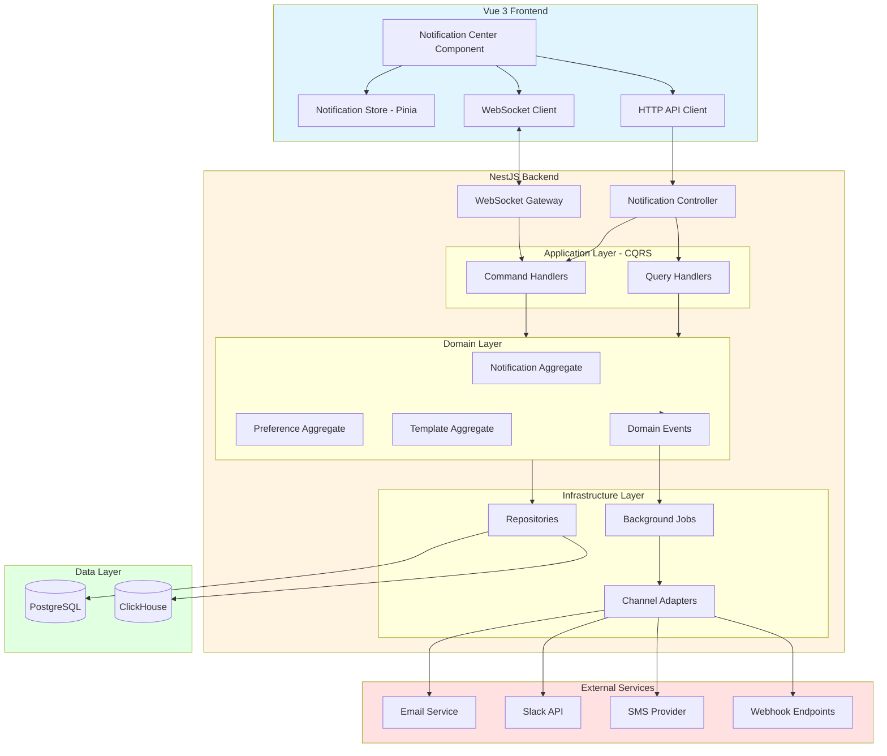
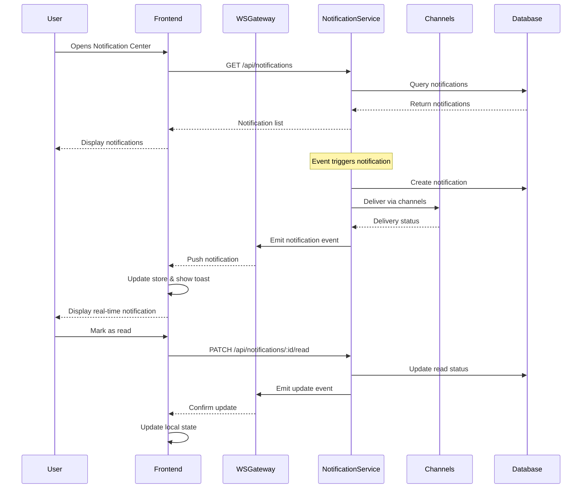
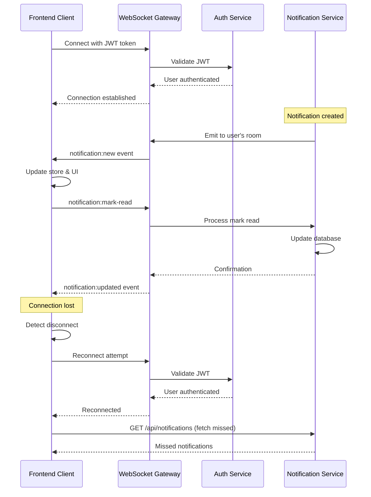
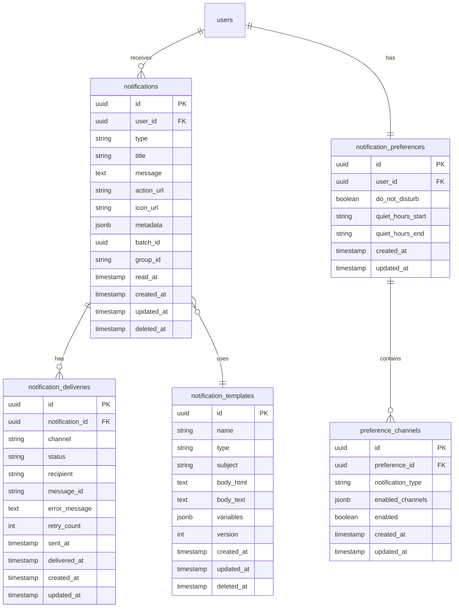

# Design Document: Frontend-Backend Notification Integration

## Overview

This design document specifies the technical implementation for integrating the notification module between the Vue 3 frontend and NestJS backend in the TelemetryFlow Platform. The system provides real-time, multi-channel notification delivery with comprehensive management capabilities.

### Key Features

- In-app notification center with real-time updates
- WebSocket-based real-time notification delivery
- Multi-channel support (in-app, email, Slack, webhook, SMS)
- User-configurable notification preferences
- Notification templates with variable substitution
- Notification history with read/unread tracking
- Notification grouping and batching
- Comprehensive delivery tracking and monitoring
- DDD/CQRS architecture on backend
- Vue 3 Composition API with Pinia on frontend

### Technology Stack

**Frontend:**

- Vue 3.5+ with Composition API and `<script setup>`
- TypeScript 5.7 with strict configuration
- Pinia 3.0+ for state management
- Naive UI 2.43+ for UI components
- Socket.IO Client 4.8+ for WebSocket communication
- Axios 1.13+ for HTTP requests
- VueUse 12.8+ for composition utilities

**Backend:**

- NestJS 11.x with TypeScript 5.9
- TypeORM 0.3 with PostgreSQL 16
- Socket.IO for WebSocket gateway
- @nestjs/cqrs for CQRS implementation
- Winston for logging
- OpenTelemetry for tracing
- Prometheus for metrics

## Architecture

### High-Level Architecture



### Data Flow Diagram



### WebSocket Communication Flow



## Components and Interfaces

### Backend Module Structure

Following DDD/CQRS architecture as per module standardization guide:

```
src/modules/notification/
├── domain/
│   ├── aggregates/
│   │   ├── Notification.ts
│   │   ├── NotificationPreference.ts
│   │   └── NotificationTemplate.ts
│   ├── entities/
│   │   ├── NotificationDelivery.ts
│   │   └── NotificationBatch.ts
│   ├── value-objects/
│   │   ├── NotificationId.ts
│   │   ├── NotificationChannel.ts
│   │   ├── NotificationType.ts
│   │   ├── DeliveryStatus.ts
│   │   └── NotificationContent.ts
│   ├── events/
│   │   ├── NotificationCreated.event.ts
│   │   ├── NotificationSent.event.ts
│   │   ├── NotificationRead.event.ts
│   │   ├── NotificationFailed.event.ts
│   │   └── NotificationDeleted.event.ts
│   ├── repositories/
│   │   ├── INotificationRepository.ts
│   │   ├── INotificationPreferenceRepository.ts
│   │   └── INotificationTemplateRepository.ts
│   └── services/
│       ├── NotificationBatchingService.ts
│       └── NotificationGroupingService.ts
├── application/
│   ├── commands/
│   │   ├── CreateNotification.command.ts
│   │   ├── MarkNotificationRead.command.ts
│   │   ├── MarkAllNotificationsRead.command.ts
│   │   ├── DeleteNotification.command.ts
│   │   ├── UpdateNotificationPreferences.command.ts
│   │   ├── CreateNotificationTemplate.command.ts
│   │   └── SendNotificationBatch.command.ts
│   ├── queries/
│   │   ├── GetNotifications.query.ts
│   │   ├── GetNotificationById.query.ts
│   │   ├── GetUnreadCount.query.ts
│   │   ├── GetNotificationPreferences.query.ts
│   │   ├── GetNotificationTemplates.query.ts
│   │   └── GetDeliveryStatus.query.ts
│   ├── handlers/
│   │   ├── CreateNotification.handler.ts
│   │   ├── MarkNotificationRead.handler.ts
│   │   ├── GetNotifications.handler.ts
│   │   └── [other handlers...]
│   └── dto/
│       ├── NotificationResponse.dto.ts
│       ├── NotificationPreferenceResponse.dto.ts
│       └── DeliveryStatusResponse.dto.ts
├── infrastructure/
│   ├── persistence/
│   │   ├── entities/
│   │   │   ├── Notification.entity.ts
│   │   │   ├── NotificationPreference.entity.ts
│   │   │   ├── NotificationTemplate.entity.ts
│   │   │   └── NotificationDelivery.entity.ts
│   │   ├── repositories/
│   │   │   ├── NotificationRepository.ts
│   │   │   ├── NotificationPreferenceRepository.ts
│   │   │   └── NotificationTemplateRepository.ts
│   │   ├── mappers/
│   │   │   ├── NotificationMapper.ts
│   │   │   └── NotificationPreferenceMapper.ts
│   │   ├── migrations/
│   │   │   └── [timestamp]-create-notification-tables.ts
│   │   └── seeds/
│   │       └── [timestamp]-seed-notification-templates.ts
│   ├── channels/
│   │   ├── IChannelAdapter.ts
│   │   ├── EmailChannelAdapter.ts
│   │   ├── SlackChannelAdapter.ts
│   │   ├── WebhookChannelAdapter.ts
│   │   └── SmsChannelAdapter.ts
│   ├── messaging/
│   │   └── NotificationEventProcessor.ts
│   └── jobs/
│       ├── NotificationDeliveryJob.ts
│       └── NotificationBatchJob.ts
├── presentation/
│   ├── controllers/
│   │   ├── Notification.controller.ts
│   │   ├── NotificationPreference.controller.ts
│   │   └── NotificationTemplate.controller.ts
│   ├── gateways/
│   │   └── Notification.gateway.ts
│   ├── dto/
│   │   ├── CreateNotificationRequest.dto.ts
│   │   ├── UpdatePreferencesRequest.dto.ts
│   │   └── MarkReadRequest.dto.ts
│   └── guards/
│       └── NotificationOwnership.guard.ts
└── notification.module.ts
```

### Frontend Component Structure

Following Vue 3 patterns and project structure:

```
frontend/src/
├── components/
│   └── notifications/
│       ├── NotificationCenter.vue
│       ├── NotificationItem.vue
│       ├── NotificationBadge.vue
│       ├── NotificationToast.vue
│       ├── NotificationList.vue
│       └── index.ts
├── views/
│   └── notifications/
│       ├── index.vue (History page)
│       ├── preferences.vue
│       └── features/
│           ├── NotificationFilters.vue
│           ├── NotificationGroupItem.vue
│           └── index.ts
├── store/
│   └── notifications.ts (Pinia store)
├── composables/
│   ├── useNotifications.ts
│   ├── useNotificationWebSocket.ts
│   └── useNotificationPreferences.ts
├── api/
│   └── notifications.ts
├── types/
│   └── notification.ts
└── streaming/
    └── notification-socket.ts
```

### Domain Aggregates

#### Notification Aggregate

```typescript
// domain/aggregates/Notification.ts
class Notification extends AggregateRoot {
  private id: NotificationId;
  private userId: string;
  private type: NotificationType;
  private content: NotificationContent;
  private channels: NotificationChannel[];
  private deliveries: NotificationDelivery[];
  private readAt: Date | null;
  private createdAt: Date;
  private metadata: Record<string, any>;
  private batchId: string | null;
  private groupId: string | null;

  create(data: CreateNotificationData): void {
    // Validation logic
    this.apply(new NotificationCreatedEvent(this.id, data));
  }

  markAsRead(): void {
    if (this.readAt) return;
    this.readAt = new Date();
    this.apply(new NotificationReadEvent(this.id, this.userId));
  }

  addDelivery(channel: NotificationChannel, status: DeliveryStatus): void {
    const delivery = new NotificationDelivery(channel, status);
    this.deliveries.push(delivery);
    this.apply(new NotificationSentEvent(this.id, channel, status));
  }

  markDeliveryFailed(channel: NotificationChannel, error: string): void {
    const delivery = this.deliveries.find((d) => d.channel === channel);
    if (delivery) {
      delivery.markFailed(error);
      this.apply(new NotificationFailedEvent(this.id, channel, error));
    }
  }

  delete(): void {
    this.apply(new NotificationDeletedEvent(this.id, this.userId));
  }
}
```

#### NotificationPreference Aggregate

```typescript
// domain/aggregates/NotificationPreference.ts
class NotificationPreference extends AggregateRoot {
  private userId: string;
  private preferences: Map<NotificationType, ChannelPreference>;
  private doNotDisturb: boolean;
  private quietHours: QuietHoursConfig | null;

  updatePreference(
    type: NotificationType,
    channels: NotificationChannel[],
    enabled: boolean,
  ): void {
    const preference = new ChannelPreference(channels, enabled);
    this.preferences.set(type, preference);
  }

  enableDoNotDisturb(): void {
    this.doNotDisturb = true;
  }

  disableDoNotDisturb(): void {
    this.doNotDisturb = false;
  }

  setQuietHours(start: string, end: string): void {
    this.quietHours = new QuietHoursConfig(start, end);
  }

  shouldSendNotification(
    type: NotificationType,
    channel: NotificationChannel,
  ): boolean {
    if (this.doNotDisturb && !type.isCritical()) return false;
    if (this.isInQuietHours() && !type.isUrgent()) return false;

    const preference = this.preferences.get(type);
    return preference?.isEnabled() && preference.hasChannel(channel);
  }

  private isInQuietHours(): boolean {
    if (!this.quietHours) return false;
    const now = new Date();
    return this.quietHours.isWithinRange(now);
  }
}
```

#### NotificationTemplate Aggregate

```typescript
// domain/aggregates/NotificationTemplate.ts
class NotificationTemplate extends AggregateRoot {
  private id: string;
  private name: string;
  private type: NotificationType;
  private subject: string;
  private bodyHtml: string;
  private bodyText: string;
  private variables: string[];
  private version: number;

  render(variables: Record<string, any>, format: "html" | "text"): string {
    const template = format === "html" ? this.bodyHtml : this.bodyText;
    return this.substituteVariables(template, variables);
  }

  private substituteVariables(
    template: string,
    variables: Record<string, any>,
  ): string {
    return template.replace(/\{\{(\w+)\}\}/g, (match, key) => {
      return variables[key] ?? "";
    });
  }

  validate(): boolean {
    // Validate template syntax
    const variablePattern = /\{\{(\w+)\}\}/g;
    const matches = [...this.bodyHtml.matchAll(variablePattern)];
    return matches.every((match) => this.variables.includes(match[1]));
  }

  incrementVersion(): void {
    this.version++;
  }
}
```

### Value Objects

```typescript
// domain/value-objects/NotificationChannel.ts
class NotificationChannel extends ValueObject {
  static readonly IN_APP = new NotificationChannel("in-app");
  static readonly EMAIL = new NotificationChannel("email");
  static readonly SLACK = new NotificationChannel("slack");
  static readonly WEBHOOK = new NotificationChannel("webhook");
  static readonly SMS = new NotificationChannel("sms");

  private constructor(private readonly value: string) {
    super();
  }

  getValue(): string {
    return this.value;
  }

  equals(other: NotificationChannel): boolean {
    return this.value === other.value;
  }
}

// domain/value-objects/NotificationType.ts
class NotificationType extends ValueObject {
  constructor(
    private readonly value: string,
    private readonly priority: "low" | "normal" | "high" | "critical",
  ) {
    super();
  }

  isCritical(): boolean {
    return this.priority === "critical";
  }

  isUrgent(): boolean {
    return this.priority === "high" || this.priority === "critical";
  }

  getValue(): string {
    return this.value;
  }
}

// domain/value-objects/DeliveryStatus.ts
enum DeliveryStatus {
  PENDING = "pending",
  SENT = "sent",
  DELIVERED = "delivered",
  FAILED = "failed",
  RETRYING = "retrying",
}

// domain/value-objects/NotificationContent.ts
class NotificationContent extends ValueObject {
  constructor(
    private readonly title: string,
    private readonly message: string,
    private readonly actionUrl?: string,
    private readonly iconUrl?: string,
  ) {
    super();
    this.validate();
  }

  private validate(): void {
    if (!this.title || this.title.length === 0) {
      throw new Error("Notification title cannot be empty");
    }
    if (!this.message || this.message.length === 0) {
      throw new Error("Notification message cannot be empty");
    }
  }

  getTitle(): string {
    return this.title;
  }

  getMessage(): string {
    return this.message;
  }

  getActionUrl(): string | undefined {
    return this.actionUrl;
  }

  getIconUrl(): string | undefined {
    return this.iconUrl;
  }
}
```

### Repository Interfaces

```typescript
// domain/repositories/INotificationRepository.ts
interface INotificationRepository {
  save(notification: Notification): Promise<void>;
  findById(id: NotificationId): Promise<Notification | null>;
  findByUserId(
    userId: string,
    options: PaginationOptions,
  ): Promise<Notification[]>;
  findUnreadByUserId(userId: string): Promise<Notification[]>;
  countUnreadByUserId(userId: string): Promise<number>;
  markAsRead(id: NotificationId): Promise<void>;
  markAllAsRead(userId: string): Promise<void>;
  delete(id: NotificationId): Promise<void>;
  findByBatchId(batchId: string): Promise<Notification[]>;
  findByGroupId(groupId: string): Promise<Notification[]>;
}

// domain/repositories/INotificationPreferenceRepository.ts
interface INotificationPreferenceRepository {
  save(preference: NotificationPreference): Promise<void>;
  findByUserId(userId: string): Promise<NotificationPreference | null>;
  createDefault(userId: string): Promise<NotificationPreference>;
}

// domain/repositories/INotificationTemplateRepository.ts
interface INotificationTemplateRepository {
  save(template: NotificationTemplate): Promise<void>;
  findById(id: string): Promise<NotificationTemplate | null>;
  findByType(type: NotificationType): Promise<NotificationTemplate[]>;
  findAll(): Promise<NotificationTemplate[]>;
  delete(id: string): Promise<void>;
}
```

### Channel Adapters

```typescript
// infrastructure/channels/IChannelAdapter.ts
interface IChannelAdapter {
  send(notification: Notification, recipient: string): Promise<DeliveryResult>;
  getChannelType(): NotificationChannel;
  isHealthy(): Promise<boolean>;
}

interface DeliveryResult {
  success: boolean;
  messageId?: string;
  error?: string;
  timestamp: Date;
}

// infrastructure/channels/EmailChannelAdapter.ts
class EmailChannelAdapter implements IChannelAdapter {
  constructor(
    private readonly emailService: EmailService,
    private readonly templateEngine: TemplateEngine,
  ) {}

  async send(
    notification: Notification,
    recipient: string,
  ): Promise<DeliveryResult> {
    try {
      const content = notification.getContent();
      const html = await this.templateEngine.render("email", content);

      const result = await this.emailService.send({
        to: recipient,
        subject: content.getTitle(),
        html: html,
      });

      return {
        success: true,
        messageId: result.messageId,
        timestamp: new Date(),
      };
    } catch (error) {
      return {
        success: false,
        error: error.message,
        timestamp: new Date(),
      };
    }
  }

  getChannelType(): NotificationChannel {
    return NotificationChannel.EMAIL;
  }

  async isHealthy(): Promise<boolean> {
    return this.emailService.checkConnection();
  }
}

// infrastructure/channels/SlackChannelAdapter.ts
class SlackChannelAdapter implements IChannelAdapter {
  constructor(private readonly slackClient: SlackClient) {}

  async send(
    notification: Notification,
    recipient: string,
  ): Promise<DeliveryResult> {
    try {
      const content = notification.getContent();

      const result = await this.slackClient.chat.postMessage({
        channel: recipient,
        text: content.getMessage(),
        blocks: this.formatSlackBlocks(content),
      });

      return {
        success: true,
        messageId: result.ts,
        timestamp: new Date(),
      };
    } catch (error) {
      return {
        success: false,
        error: error.message,
        timestamp: new Date(),
      };
    }
  }

  private formatSlackBlocks(content: NotificationContent): any[] {
    return [
      {
        type: "header",
        text: {
          type: "plain_text",
          text: content.getTitle(),
        },
      },
      {
        type: "section",
        text: {
          type: "mrkdwn",
          text: content.getMessage(),
        },
      },
    ];
  }

  getChannelType(): NotificationChannel {
    return NotificationChannel.SLACK;
  }

  async isHealthy(): Promise<boolean> {
    try {
      await this.slackClient.auth.test();
      return true;
    } catch {
      return false;
    }
  }
}
```

### WebSocket Gateway

```typescript
// presentation/gateways/Notification.gateway.ts
@WebSocketGateway({
  namespace: "/notifications",
  cors: {
    origin: process.env.FRONTEND_URL,
    credentials: true,
  },
})
export class NotificationGateway
  implements OnGatewayConnection, OnGatewayDisconnect
{
  @WebSocketServer()
  server: Server;

  private userSockets: Map<string, Set<string>> = new Map();

  constructor(
    private readonly authService: AuthService,
    private readonly commandBus: CommandBus,
  ) {}

  async handleConnection(client: Socket) {
    try {
      const token = client.handshake.auth.token;
      const user = await this.authService.validateToken(token);

      if (!user) {
        client.disconnect();
        return;
      }

      // Join user-specific room
      client.join(`user:${user.id}`);

      // Track connection
      if (!this.userSockets.has(user.id)) {
        this.userSockets.set(user.id, new Set());
      }
      this.userSockets.get(user.id).add(client.id);

      client.data.userId = user.id;

      this.logger.log(`Client ${client.id} connected for user ${user.id}`);
    } catch (error) {
      this.logger.error("Connection error:", error);
      client.disconnect();
    }
  }

  handleDisconnect(client: Socket) {
    const userId = client.data.userId;
    if (userId) {
      const sockets = this.userSockets.get(userId);
      if (sockets) {
        sockets.delete(client.id);
        if (sockets.size === 0) {
          this.userSockets.delete(userId);
        }
      }
      this.logger.log(`Client ${client.id} disconnected for user ${userId}`);
    }
  }

  @SubscribeMessage("notification:mark-read")
  async handleMarkRead(
    @ConnectedSocket() client: Socket,
    @MessageBody() data: { notificationId: string },
  ) {
    try {
      const userId = client.data.userId;
      await this.commandBus.execute(
        new MarkNotificationReadCommand(data.notificationId, userId),
      );

      // Broadcast update to all user's connections
      this.server.to(`user:${userId}`).emit("notification:updated", {
        notificationId: data.notificationId,
        readAt: new Date(),
      });
    } catch (error) {
      client.emit("notification:error", { message: error.message });
    }
  }

  // Called by event handlers to push notifications
  emitNotificationToUser(userId: string, event: string, data: any) {
    this.server.to(`user:${userId}`).emit(event, data);
  }

  isUserConnected(userId: string): boolean {
    return (
      this.userSockets.has(userId) && this.userSockets.get(userId).size > 0
    );
  }
}
```

### REST API Controllers

```typescript
// presentation/controllers/Notification.controller.ts
@Controller("api/notifications")
@ApiTags("Notifications")
@UseGuards(JwtAuthGuard)
export class NotificationController {
  constructor(
    private readonly commandBus: CommandBus,
    private readonly queryBus: QueryBus,
  ) {}

  @Get()
  @ApiOperation({ summary: "Get paginated notifications" })
  @ApiResponse({ status: 200, type: [NotificationResponse] })
  async getNotifications(
    @CurrentUser() user: User,
    @Query() query: GetNotificationsDto,
  ): Promise<PaginatedResponse<NotificationResponse>> {
    return this.queryBus.execute(new GetNotificationsQuery(user.id, query));
  }

  @Get("unread-count")
  @ApiOperation({ summary: "Get unread notification count" })
  @ApiResponse({ status: 200, type: Number })
  async getUnreadCount(@CurrentUser() user: User): Promise<number> {
    return this.queryBus.execute(new GetUnreadCountQuery(user.id));
  }

  @Get(":id")
  @ApiOperation({ summary: "Get notification by ID" })
  @ApiResponse({ status: 200, type: NotificationResponse })
  @UseGuards(NotificationOwnershipGuard)
  async getNotificationById(
    @Param("id") id: string,
  ): Promise<NotificationResponse> {
    return this.queryBus.execute(new GetNotificationByIdQuery(id));
  }

  @Patch(":id/read")
  @ApiOperation({ summary: "Mark notification as read" })
  @ApiResponse({ status: 200 })
  @UseGuards(NotificationOwnershipGuard)
  async markAsRead(
    @Param("id") id: string,
    @CurrentUser() user: User,
  ): Promise<void> {
    await this.commandBus.execute(new MarkNotificationReadCommand(id, user.id));
  }

  @Patch("mark-all-read")
  @ApiOperation({ summary: "Mark all notifications as read" })
  @ApiResponse({ status: 200 })
  async markAllAsRead(@CurrentUser() user: User): Promise<void> {
    await this.commandBus.execute(new MarkAllNotificationsReadCommand(user.id));
  }

  @Delete(":id")
  @ApiOperation({ summary: "Delete notification" })
  @ApiResponse({ status: 204 })
  @UseGuards(NotificationOwnershipGuard)
  async deleteNotification(@Param("id") id: string): Promise<void> {
    await this.commandBus.execute(new DeleteNotificationCommand(id));
  }

  @Get(":id/delivery-status")
  @ApiOperation({ summary: "Get delivery status for notification" })
  @ApiResponse({ status: 200, type: DeliveryStatusResponse })
  @UseGuards(NotificationOwnershipGuard)
  async getDeliveryStatus(
    @Param("id") id: string,
  ): Promise<DeliveryStatusResponse> {
    return this.queryBus.execute(new GetDeliveryStatusQuery(id));
  }
}

// presentation/controllers/NotificationPreference.controller.ts
@Controller("api/notifications/preferences")
@ApiTags("Notification Preferences")
@UseGuards(JwtAuthGuard)
export class NotificationPreferenceController {
  constructor(
    private readonly commandBus: CommandBus,
    private readonly queryBus: QueryBus,
  ) {}

  @Get()
  @ApiOperation({ summary: "Get user notification preferences" })
  @ApiResponse({ status: 200, type: NotificationPreferenceResponse })
  async getPreferences(
    @CurrentUser() user: User,
  ): Promise<NotificationPreferenceResponse> {
    return this.queryBus.execute(new GetNotificationPreferencesQuery(user.id));
  }

  @Put()
  @ApiOperation({ summary: "Update notification preferences" })
  @ApiResponse({ status: 200 })
  async updatePreferences(
    @CurrentUser() user: User,
    @Body() dto: UpdatePreferencesDto,
  ): Promise<void> {
    await this.commandBus.execute(
      new UpdateNotificationPreferencesCommand(user.id, dto),
    );
  }
}
```

### Frontend Pinia Store

```typescript
// store/notifications.ts
import { defineStore } from "pinia";
import type {
  Notification,
  NotificationPreference,
} from "@/types/notification";
import { notificationsApi } from "@/api/notifications";
import { useNotificationWebSocket } from "@/composables/useNotificationWebSocket";

export const useNotificationsStore = defineStore("notifications", () => {
  // State
  const notifications = ref<Notification[]>([]);
  const unreadCount = ref(0);
  const loading = ref(false);
  const error = ref<string | null>(null);
  const preferences = ref<NotificationPreference | null>(null);
  const wsConnected = ref(false);

  // WebSocket composable
  const { connect, disconnect, isConnected } = useNotificationWebSocket({
    onNotification: handleNewNotification,
    onUpdate: handleNotificationUpdate,
    onDelete: handleNotificationDelete,
    onConnectionChange: (connected) => {
      wsConnected.value = connected;
    },
  });

  // Getters
  const unreadNotifications = computed(() =>
    notifications.value.filter((n) => !n.readAt),
  );

  const readNotifications = computed(() =>
    notifications.value.filter((n) => n.readAt),
  );

  const notificationsByType = computed(() => {
    return notifications.value.reduce(
      (acc, notification) => {
        const type = notification.type;
        if (!acc[type]) acc[type] = [];
        acc[type].push(notification);
        return acc;
      },
      {} as Record<string, Notification[]>,
    );
  });

  const groupedNotifications = computed(() => {
    const groups = new Map<string, Notification[]>();
    notifications.value.forEach((notification) => {
      if (notification.groupId) {
        if (!groups.has(notification.groupId)) {
          groups.set(notification.groupId, []);
        }
        groups.get(notification.groupId)!.push(notification);
      }
    });
    return groups;
  });

  // Actions
  async function fetchNotifications(options?: PaginationOptions) {
    loading.value = true;
    error.value = null;

    try {
      const response = await notificationsApi.getNotifications(options);
      notifications.value = response.data;
    } catch (e) {
      error.value =
        e instanceof Error ? e.message : "Failed to fetch notifications";
      throw e;
    } finally {
      loading.value = false;
    }
  }

  async function fetchUnreadCount() {
    try {
      const count = await notificationsApi.getUnreadCount();
      unreadCount.value = count;
    } catch (e) {
      console.error("Failed to fetch unread count:", e);
    }
  }

  async function markAsRead(notificationId: string) {
    try {
      await notificationsApi.markAsRead(notificationId);

      const notification = notifications.value.find(
        (n) => n.id === notificationId,
      );
      if (notification && !notification.readAt) {
        notification.readAt = new Date();
        unreadCount.value = Math.max(0, unreadCount.value - 1);
      }
    } catch (e) {
      error.value = e instanceof Error ? e.message : "Failed to mark as read";
      throw e;
    }
  }

  async function markAllAsRead() {
    try {
      await notificationsApi.markAllAsRead();

      notifications.value.forEach((n) => {
        if (!n.readAt) {
          n.readAt = new Date();
        }
      });
      unreadCount.value = 0;
    } catch (e) {
      error.value =
        e instanceof Error ? e.message : "Failed to mark all as read";
      throw e;
    }
  }

  async function deleteNotification(notificationId: string) {
    try {
      await notificationsApi.deleteNotification(notificationId);

      const index = notifications.value.findIndex(
        (n) => n.id === notificationId,
      );
      if (index !== -1) {
        const notification = notifications.value[index];
        if (!notification.readAt) {
          unreadCount.value = Math.max(0, unreadCount.value - 1);
        }
        notifications.value.splice(index, 1);
      }
    } catch (e) {
      error.value =
        e instanceof Error ? e.message : "Failed to delete notification";
      throw e;
    }
  }

  async function fetchPreferences() {
    try {
      preferences.value = await notificationsApi.getPreferences();
    } catch (e) {
      error.value =
        e instanceof Error ? e.message : "Failed to fetch preferences";
      throw e;
    }
  }

  async function updatePreferences(newPreferences: NotificationPreference) {
    try {
      await notificationsApi.updatePreferences(newPreferences);
      preferences.value = newPreferences;
    } catch (e) {
      error.value =
        e instanceof Error ? e.message : "Failed to update preferences";
      throw e;
    }
  }

  function connectWebSocket() {
    connect();
  }

  function disconnectWebSocket() {
    disconnect();
  }

  // WebSocket event handlers
  function handleNewNotification(notification: Notification) {
    notifications.value.unshift(notification);
    if (!notification.readAt) {
      unreadCount.value++;
    }
  }

  function handleNotificationUpdate(data: {
    notificationId: string;
    readAt: Date;
  }) {
    const notification = notifications.value.find(
      (n) => n.id === data.notificationId,
    );
    if (notification && !notification.readAt) {
      notification.readAt = data.readAt;
      unreadCount.value = Math.max(0, unreadCount.value - 1);
    }
  }

  function handleNotificationDelete(notificationId: string) {
    const index = notifications.value.findIndex((n) => n.id === notificationId);
    if (index !== -1) {
      const notification = notifications.value[index];
      if (!notification.readAt) {
        unreadCount.value = Math.max(0, unreadCount.value - 1);
      }
      notifications.value.splice(index, 1);
    }
  }

  return {
    // State
    notifications,
    unreadCount,
    loading,
    error,
    preferences,
    wsConnected,
    // Getters
    unreadNotifications,
    readNotifications,
    notificationsByType,
    groupedNotifications,
    // Actions
    fetchNotifications,
    fetchUnreadCount,
    markAsRead,
    markAllAsRead,
    deleteNotification,
    fetchPreferences,
    updatePreferences,
    connectWebSocket,
    disconnectWebSocket,
  };
});
```

### Frontend WebSocket Composable

```typescript
// composables/useNotificationWebSocket.ts
import { ref, onMounted, onUnmounted } from "vue";
import { io, Socket } from "socket.io-client";
import type { Notification } from "@/types/notification";

interface WebSocketOptions {
  onNotification: (notification: Notification) => void;
  onUpdate: (data: { notificationId: string; readAt: Date }) => void;
  onDelete: (notificationId: string) => void;
  onConnectionChange: (connected: boolean) => void;
}

export function useNotificationWebSocket(options: WebSocketOptions) {
  const socket = ref<Socket | null>(null);
  const isConnected = ref(false);
  const reconnectAttempts = ref(0);
  const maxReconnectAttempts = 5;

  function connect() {
    if (socket.value?.connected) return;

    const token = localStorage.getItem("auth_token");
    if (!token) {
      console.error("No auth token found");
      return;
    }

    socket.value = io(
      `${import.meta.env.TELEMETRYFLOW_API_URL}/notifications`,
      {
        auth: { token },
        transports: ["websocket"],
        reconnection: true,
        reconnectionDelay: 1000,
        reconnectionDelayMax: 5000,
        reconnectionAttempts: maxReconnectAttempts,
      },
    );

    socket.value.on("connect", handleConnect);
    socket.value.on("disconnect", handleDisconnect);
    socket.value.on("notification:new", handleNewNotification);
    socket.value.on("notification:updated", handleNotificationUpdate);
    socket.value.on("notification:deleted", handleNotificationDelete);
    socket.value.on("notification:error", handleError);
    socket.value.on("connect_error", handleConnectError);
  }

  function disconnect() {
    if (socket.value) {
      socket.value.disconnect();
      socket.value = null;
    }
  }

  function handleConnect() {
    console.log("WebSocket connected");
    isConnected.value = true;
    reconnectAttempts.value = 0;
    options.onConnectionChange(true);
  }

  function handleDisconnect() {
    console.log("WebSocket disconnected");
    isConnected.value = false;
    options.onConnectionChange(false);
  }

  function handleNewNotification(notification: Notification) {
    options.onNotification(notification);

    // Show toast notification
    window.$message?.info({
      content: notification.content.title,
      duration: 3000,
    });
  }

  function handleNotificationUpdate(data: {
    notificationId: string;
    readAt: Date;
  }) {
    options.onUpdate(data);
  }

  function handleNotificationDelete(notificationId: string) {
    options.onDelete(notificationId);
  }

  function handleError(error: { message: string }) {
    console.error("WebSocket error:", error);
    window.$message?.error(error.message);
  }

  function handleConnectError(error: Error) {
    console.error("WebSocket connection error:", error);
    reconnectAttempts.value++;

    if (reconnectAttempts.value >= maxReconnectAttempts) {
      window.$message?.error("Failed to connect to notification service");
    }
  }

  function markAsRead(notificationId: string) {
    if (socket.value?.connected) {
      socket.value.emit("notification:mark-read", { notificationId });
    }
  }

  onMounted(() => {
    connect();
  });

  onUnmounted(() => {
    disconnect();
  });

  return {
    socket,
    isConnected,
    connect,
    disconnect,
    markAsRead,
  };
}
```

### Frontend Vue Components

```vue
<!-- components/notifications/NotificationCenter.vue -->
<script setup lang="ts">
import { ref, computed } from "vue";
import { useNotificationsStore } from "@/store/notifications";
import { storeToRefs } from "pinia";
import NotificationItem from "./NotificationItem.vue";

const notificationsStore = useNotificationsStore();
const { notifications, unreadCount, loading } = storeToRefs(notificationsStore);

const showDropdown = ref(false);
const recentNotifications = computed(() => notifications.value.slice(0, 10));

const handleMarkAllRead = async () => {
  await notificationsStore.markAllAsRead();
};

const handleViewAll = () => {
  showDropdown.value = false;
  router.push("/notifications");
};
</script>

<template>
  <n-dropdown
    v-model:show="showDropdown"
    trigger="click"
    placement="bottom-end"
    :options="[]"
  >
    <template #default>
      <n-badge :value="unreadCount" :max="99" :show="unreadCount > 0">
        <n-button circle quaternary>
          <template #icon>
            <n-icon size="20">
              <NotificationIcon />
            </n-icon>
          </template>
        </n-button>
      </n-badge>
    </template>

    <template #dropdown>
      <div class="notification-dropdown">
        <div class="notification-header">
          <h3>Notifications</h3>
          <n-button text size="small" @click="handleMarkAllRead">
            Mark all as read
          </n-button>
        </div>

        <div v-if="loading" class="notification-loading">
          <n-spin size="small" />
        </div>

        <div
          v-else-if="recentNotifications.length === 0"
          class="notification-empty"
        >
          <n-empty description="No notifications" />
        </div>

        <div v-else class="notification-list">
          <NotificationItem
            v-for="notification in recentNotifications"
            :key="notification.id"
            :notification="notification"
          />
        </div>

        <div class="notification-footer">
          <n-button text block @click="handleViewAll">
            View all notifications
          </n-button>
        </div>
      </div>
    </template>
  </n-dropdown>
</template>

<style scoped lang="scss">
.notification-dropdown {
  width: 400px;
  max-height: 600px;
  display: flex;
  flex-direction: column;
}

.notification-header {
  display: flex;
  justify-content: space-between;
  align-items: center;
  padding: 16px;
  border-bottom: 1px solid var(--border-color);

  h3 {
    margin: 0;
    font-size: 16px;
    font-weight: 600;
  }
}

.notification-list {
  flex: 1;
  overflow-y: auto;
}

.notification-loading,
.notification-empty {
  padding: 32px;
  display: flex;
  justify-content: center;
  align-items: center;
}

.notification-footer {
  padding: 8px;
  border-top: 1px solid var(--border-color);
}
</style>
```

```vue
<!-- components/notifications/NotificationItem.vue -->
<script setup lang="ts">
import { computed } from "vue";
import { useRouter } from "vue-router";
import { useNotificationsStore } from "@/store/notifications";
import type { Notification } from "@/types/notification";
import { formatDistanceToNow } from "date-fns";

interface Props {
  notification: Notification;
}

const props = defineProps<Props>();
const router = useRouter();
const notificationsStore = useNotificationsStore();

const isUnread = computed(() => !props.notification.readAt);
const timeAgo = computed(() =>
  formatDistanceToNow(new Date(props.notification.createdAt), {
    addSuffix: true,
  }),
);

const handleClick = async () => {
  if (isUnread.value) {
    await notificationsStore.markAsRead(props.notification.id);
  }

  if (props.notification.content.actionUrl) {
    router.push(props.notification.content.actionUrl);
  }
};
</script>

<template>
  <div
    class="notification-item"
    :class="{ 'notification-item--unread': isUnread }"
    @click="handleClick"
  >
    <div class="notification-icon">
      <n-avatar
        :src="notification.content.iconUrl"
        :fallback-src="'/default-notification-icon.svg'"
        size="small"
      />
    </div>

    <div class="notification-content">
      <div class="notification-title">
        {{ notification.content.title }}
      </div>
      <div class="notification-message">
        {{ notification.content.message }}
      </div>
      <div class="notification-time">
        {{ timeAgo }}
      </div>
    </div>

    <div v-if="isUnread" class="notification-badge">
      <div class="unread-dot" />
    </div>
  </div>
</template>

<style scoped lang="scss">
.notification-item {
  display: flex;
  gap: 12px;
  padding: 12px 16px;
  cursor: pointer;
  transition: background-color 0.2s;

  &:hover {
    background-color: var(--hover-color);
  }

  &--unread {
    background-color: var(--unread-bg-color);
  }
}

.notification-icon {
  flex-shrink: 0;
}

.notification-content {
  flex: 1;
  min-width: 0;
}

.notification-title {
  font-weight: 600;
  font-size: 14px;
  margin-bottom: 4px;
}

.notification-message {
  font-size: 13px;
  color: var(--text-color-secondary);
  margin-bottom: 4px;
  overflow: hidden;
  text-overflow: ellipsis;
  display: -webkit-box;
  -webkit-line-clamp: 2;
  -webkit-box-orient: vertical;
}

.notification-time {
  font-size: 12px;
  color: var(--text-color-tertiary);
}

.notification-badge {
  flex-shrink: 0;
  display: flex;
  align-items: center;
}

.unread-dot {
  width: 8px;
  height: 8px;
  border-radius: 50%;
  background-color: var(--primary-color);
}
</style>
```

## Data Models

### Database Schema (PostgreSQL)



### TypeORM Entities

```typescript
// infrastructure/persistence/entities/Notification.entity.ts
@Entity("notifications")
export class NotificationEntity {
  @PrimaryGeneratedColumn("uuid")
  id: string;

  @Column("uuid")
  @Index()
  userId: string;

  @Column("varchar")
  @Index()
  type: string;

  @Column("varchar")
  title: string;

  @Column("text")
  message: string;

  @Column("varchar", { nullable: true })
  actionUrl: string | null;

  @Column("varchar", { nullable: true })
  iconUrl: string | null;

  @Column("jsonb", { default: {} })
  metadata: Record<string, any>;

  @Column("uuid", { nullable: true })
  @Index()
  batchId: string | null;

  @Column("varchar", { nullable: true })
  @Index()
  groupId: string | null;

  @Column("timestamp", { nullable: true })
  readAt: Date | null;

  @CreateDateColumn()
  createdAt: Date;

  @UpdateDateColumn()
  updatedAt: Date;

  @DeleteDateColumn()
  deletedAt: Date | null;

  @OneToMany(
    () => NotificationDeliveryEntity,
    (delivery) => delivery.notification,
  )
  deliveries: NotificationDeliveryEntity[];

  @ManyToOne(() => NotificationTemplateEntity, { nullable: true })
  @JoinColumn({ name: "template_id" })
  template: NotificationTemplateEntity | null;
}

// infrastructure/persistence/entities/NotificationDelivery.entity.ts
@Entity("notification_deliveries")
export class NotificationDeliveryEntity {
  @PrimaryGeneratedColumn("uuid")
  id: string;

  @Column("uuid")
  @Index()
  notificationId: string;

  @Column("varchar")
  channel: string;

  @Column("varchar")
  @Index()
  status: string;

  @Column("varchar")
  recipient: string;

  @Column("varchar", { nullable: true })
  messageId: string | null;

  @Column("text", { nullable: true })
  errorMessage: string | null;

  @Column("int", { default: 0 })
  retryCount: number;

  @Column("timestamp", { nullable: true })
  sentAt: Date | null;

  @Column("timestamp", { nullable: true })
  deliveredAt: Date | null;

  @CreateDateColumn()
  createdAt: Date;

  @UpdateDateColumn()
  updatedAt: Date;

  @ManyToOne(
    () => NotificationEntity,
    (notification) => notification.deliveries,
  )
  @JoinColumn({ name: "notification_id" })
  notification: NotificationEntity;
}

// infrastructure/persistence/entities/NotificationPreference.entity.ts
@Entity("notification_preferences")
export class NotificationPreferenceEntity {
  @PrimaryGeneratedColumn("uuid")
  id: string;

  @Column("uuid", { unique: true })
  @Index()
  userId: string;

  @Column("boolean", { default: false })
  doNotDisturb: boolean;

  @Column("varchar", { nullable: true })
  quietHoursStart: string | null;

  @Column("varchar", { nullable: true })
  quietHoursEnd: string | null;

  @CreateDateColumn()
  createdAt: Date;

  @UpdateDateColumn()
  updatedAt: Date;

  @OneToMany(() => PreferenceChannelEntity, (channel) => channel.preference)
  channels: PreferenceChannelEntity[];
}

// infrastructure/persistence/entities/PreferenceChannel.entity.ts
@Entity("preference_channels")
export class PreferenceChannelEntity {
  @PrimaryGeneratedColumn("uuid")
  id: string;

  @Column("uuid")
  @Index()
  preferenceId: string;

  @Column("varchar")
  notificationType: string;

  @Column("jsonb")
  enabledChannels: string[];

  @Column("boolean", { default: true })
  enabled: boolean;

  @CreateDateColumn()
  createdAt: Date;

  @UpdateDateColumn()
  updatedAt: Date;

  @ManyToOne(
    () => NotificationPreferenceEntity,
    (preference) => preference.channels,
  )
  @JoinColumn({ name: "preference_id" })
  preference: NotificationPreferenceEntity;
}

// infrastructure/persistence/entities/NotificationTemplate.entity.ts
@Entity("notification_templates")
export class NotificationTemplateEntity {
  @PrimaryGeneratedColumn("uuid")
  id: string;

  @Column("varchar", { unique: true })
  name: string;

  @Column("varchar")
  @Index()
  type: string;

  @Column("varchar")
  subject: string;

  @Column("text")
  bodyHtml: string;

  @Column("text")
  bodyText: string;

  @Column("jsonb")
  variables: string[];

  @Column("int", { default: 1 })
  version: number;

  @CreateDateColumn()
  createdAt: Date;

  @UpdateDateColumn()
  updatedAt: Date;

  @DeleteDateColumn()
  deletedAt: Date | null;
}
```

### Frontend TypeScript Types

```typescript
// types/notification.ts
export interface Notification {
  id: string;
  userId: string;
  type: string;
  content: NotificationContent;
  channels: string[];
  readAt: Date | null;
  createdAt: Date;
  updatedAt: Date;
  metadata: Record<string, any>;
  batchId: string | null;
  groupId: string | null;
  deliveries?: NotificationDelivery[];
}

export interface NotificationContent {
  title: string;
  message: string;
  actionUrl?: string;
  iconUrl?: string;
}

export interface NotificationDelivery {
  id: string;
  channel: string;
  status: DeliveryStatus;
  recipient: string;
  messageId?: string;
  errorMessage?: string;
  retryCount: number;
  sentAt: Date | null;
  deliveredAt: Date | null;
}

export enum DeliveryStatus {
  PENDING = "pending",
  SENT = "sent",
  DELIVERED = "delivered",
  FAILED = "failed",
  RETRYING = "retrying",
}

export interface NotificationPreference {
  userId: string;
  doNotDisturb: boolean;
  quietHours: QuietHours | null;
  preferences: Record<string, ChannelPreference>;
}

export interface QuietHours {
  start: string; // HH:mm format
  end: string; // HH:mm format
}

export interface ChannelPreference {
  enabled: boolean;
  channels: string[];
}

export interface NotificationTemplate {
  id: string;
  name: string;
  type: string;
  subject: string;
  bodyHtml: string;
  bodyText: string;
  variables: string[];
  version: number;
}

export interface PaginationOptions {
  page?: number;
  limit?: number;
  sortBy?: string;
  sortOrder?: "asc" | "desc";
  filters?: NotificationFilters;
}

export interface NotificationFilters {
  type?: string;
  channel?: string;
  readStatus?: "read" | "unread" | "all";
  dateFrom?: Date;
  dateTo?: Date;
  search?: string;
}

export interface PaginatedResponse<T> {
  data: T[];
  total: number;
  page: number;
  limit: number;
  totalPages: number;
}
```

## Correctness Properties

_A property is a characteristic or behavior that should hold true across all valid executions of a system—essentially, a formal statement about what the system should do. Properties serve as the bridge between human-readable specifications and machine-verifiable correctness guarantees._

### Property Reflection

After analyzing all acceptance criteria, I identified several areas where properties can be consolidated:

- Properties 2.2 and 2.3 both test WebSocket notification delivery and store updates - these can be combined into a single comprehensive property
- Properties 3.4 and 3.5 both test preference checking - 3.5 is a specific case of 3.4
- Properties 4.1 through 4.5 test individual channel delivery - these can be consolidated into a single property about multi-channel delivery with channel-specific adapters
- Properties 6.3 and 6.4 test read status updates - these are inverse operations that can be combined
- Properties 8.1, 8.2, 8.3, 8.4 test delivery status transitions - these can be combined into a single state machine property
- Properties 9.2, 9.3, 9.4 test store state updates - these can be consolidated into a single property about store synchronization
- Properties 12.3, 12.4, 12.5 test WebSocket event emission - these can be combined into a single property about event emission for lifecycle changes
- Properties 14.1, 14.2, 14.3 test retry logic - these can be consolidated into a single property about exponential backoff retry
- Properties 16.2 and 16.3 test authorization - 16.3 is a specific case of 16.2

### Core Notification Properties

**Property 1: Notification Center Display Completeness**
_For any_ notification displayed in the notification center, the rendered output SHALL contain the notification title, message, timestamp, read status indicator, and type icon.
**Validates: Requirements 1.3**

**Property 2: Mark All As Read Completeness**
_For any_ set of unread notifications, when "mark all as read" is executed, all notifications SHALL have their read status updated and readAt timestamp set.
**Validates: Requirements 1.5**

**Property 3: Unread Count Accuracy**
_For any_ notification list state, the displayed unread count SHALL equal the number of notifications where readAt is null.
**Validates: Requirements 1.7**

### Real-Time Delivery Properties

**Property 4: WebSocket Notification Delivery and Store Synchronization**
_For any_ notification created for a connected user, the notification SHALL be emitted through WebSocket, added to the frontend store's notification list, the unread count SHALL be incremented, and a toast notification SHALL be displayed.
**Validates: Requirements 2.2, 2.3, 2.4**

**Property 5: WebSocket Reconnection and Sync**
_For any_ WebSocket disconnection, the frontend SHALL attempt reconnection with exponential backoff, and upon successful reconnection SHALL fetch all notifications created during the disconnection period.
**Validates: Requirements 2.5, 2.6**

**Property 6: WebSocket Authentication**
_For any_ WebSocket connection attempt, the connection SHALL only be established if a valid JWT token is provided, and the connection SHALL be associated with the authenticated user.
**Validates: Requirements 2.7**

**Property 7: Multi-Device Support**
_For any_ user, the system SHALL support multiple concurrent WebSocket connections, and notifications SHALL be delivered to all active connections for that user.
**Validates: Requirements 2.8**

### Preference Management Properties

**Property 8: Preference-Based Notification Filtering**
_For any_ notification trigger, if the user has disabled that notification type OR has Do Not Disturb enabled for non-critical notifications OR is in quiet hours for non-urgent notifications, THEN the notification SHALL NOT be sent.
**Validates: Requirements 3.4, 3.5, 3.6, 3.7**

**Property 9: Preference Persistence**
_For any_ preference update (type toggle, channel selection, DND mode, quiet hours), the changes SHALL be persisted to the database and reflected in subsequent notification filtering decisions.
**Validates: Requirements 3.2, 3.3**

**Property 10: Default Preferences for New Users**
_For any_ newly created user, a default NotificationPreference SHALL be created with all notification types enabled for in-app channel.
**Validates: Requirements 3.8**

### Multi-Channel Delivery Properties

**Property 11: Multi-Channel Delivery Completeness**
_For any_ notification with multiple enabled channels, the system SHALL attempt delivery through all specified channels using the appropriate channel adapter (email, Slack, webhook, SMS), and SHALL track delivery status independently for each channel.
**Validates: Requirements 4.1, 4.2, 4.3, 4.4, 4.5, 4.7**

**Property 12: Channel Delivery Retry**
_For any_ failed channel delivery, the system SHALL log the failure, retry according to the configured retry policy with exponential backoff, and update the delivery status after each attempt.
**Validates: Requirements 4.6**

**Property 13: Overall Delivery Status**
_For any_ notification with multiple channel deliveries, when all channel deliveries reach a terminal state (delivered or failed), the overall notification delivery status SHALL be updated to reflect the aggregate result.
**Validates: Requirements 4.8**

### Template Properties

**Property 14: Template Variable Substitution**
_For any_ notification created from a template with variables, all variable placeholders SHALL be replaced with their corresponding values, and missing variables SHALL be replaced with empty strings.
**Validates: Requirements 5.2, 5.5**

**Property 15: Template Format Support**
_For any_ template rendered for a specific channel, the system SHALL use the HTML format for email channels and plain text format for SMS channels.
**Validates: Requirements 5.3**

**Property 16: Template Syntax Validation**
_For any_ template being saved, the system SHALL validate that all variable placeholders in the template body match the declared variables list, and SHALL reject templates with invalid syntax.
**Validates: Requirements 5.4**

**Property 17: Template Versioning**
_For any_ template update, the version number SHALL be incremented, and all new notifications SHALL use the latest version of the template.
**Validates: Requirements 5.6, 5.7**

### History and Read Status Properties

**Property 18: Read Status Toggle**
_For any_ notification, marking it as read SHALL set the readAt timestamp to the current time and decrement the unread count, while marking it as unread SHALL clear the readAt timestamp and increment the unread count.
**Validates: Requirements 6.3, 6.4**

**Property 19: Soft Delete**
_For any_ notification deletion, the notification SHALL be soft-deleted (deletedAt timestamp set) rather than permanently removed from the database.
**Validates: Requirements 6.5**

**Property 20: Notification Filtering**
_For any_ notification query with filters (type, channel, date range, read status), only notifications matching ALL specified filter criteria SHALL be returned.
**Validates: Requirements 6.6**

**Property 21: Notification Search**
_For any_ search query, the system SHALL return notifications where the search term appears in the title, message, or metadata fields (case-insensitive).
**Validates: Requirements 6.7**

### Batching and Grouping Properties

**Property 22: Notification Batching**
_For any_ sequence of notifications of the same type created within the configured time window, the system SHALL group them into a single batch with a shared batchId, and SHALL delay delivery until the batch window closes (unless the notification is critical).
**Validates: Requirements 7.1, 7.4, 7.6**

**Property 23: Batch Display**
_For any_ batched notifications, the frontend SHALL display a summary showing the count of grouped items, and when expanded SHALL display all individual notifications in the batch.
**Validates: Requirements 7.2, 7.3**

**Property 24: Batch Mark As Read**
_For any_ batch marked as read, all notifications in that batch SHALL have their readAt timestamp set to the current time.
**Validates: Requirements 7.8**

### Delivery Tracking Properties

**Property 25: Delivery Status State Machine**
_For any_ notification delivery, the status SHALL transition through valid states: pending → sent → delivered (success path) OR pending → sent → failed (failure path) OR pending → sent → retrying → sent/failed (retry path), and each transition SHALL be recorded with a timestamp.
**Validates: Requirements 8.1, 8.2, 8.3, 8.4**

**Property 26: Delivery Retry with Exponential Backoff**
_For any_ failed delivery, the system SHALL retry up to the configured maximum attempts with exponentially increasing delays between attempts, and SHALL mark the delivery as permanently failed when all attempts are exhausted.
**Validates: Requirements 8.5, 14.4**

**Property 27: Delivery Tracking Data**
_For any_ notification delivery, the system SHALL record all delivery attempts with timestamps, error messages, and status changes for each channel.
**Validates: Requirements 8.6**

### Frontend Store Properties

**Property 28: Store State Synchronization**
_For any_ notification operation (fetch, WebSocket receive, mark read, delete), the Notification_Store SHALL update its local state (notifications list, unread count) AND make the corresponding API call to the backend to ensure synchronization.
**Validates: Requirements 9.2, 9.3, 9.4**

**Property 29: Store Computed Properties**
_For any_ store state, the computed properties for filtered notifications (by type, read status) and grouped notifications (by groupId) SHALL accurately reflect the current notifications list.
**Validates: Requirements 9.5**

**Property 30: WebSocket Lifecycle Management**
_For any_ store instance, the WebSocket connection SHALL be established on initialization, maintained during the component lifecycle, and properly disconnected on cleanup.
**Validates: Requirements 9.6**

### Domain Events Properties

**Property 31: Domain Event Emission**
_For any_ notification lifecycle change (created, sent, read, failed, deleted), the system SHALL emit the corresponding domain event that can be consumed by event processors and monitoring systems.
**Validates: Requirements 10.5, 17.7**

### API Validation Properties

**Property 32: Request DTO Validation**
_For any_ API request with invalid data (missing required fields, invalid formats, out-of-range values), the system SHALL reject the request with a 400 Bad Request response and detailed validation errors.
**Validates: Requirements 11.10**

### WebSocket Protocol Properties

**Property 33: WebSocket Event Emission for Lifecycle Changes**
_For any_ notification lifecycle change (new notification, status update, deletion), the WebSocket gateway SHALL emit the corresponding event (notification:new, notification:updated, notification:deleted) to all connected clients for the affected user.
**Validates: Requirements 12.3, 12.4, 12.5**

**Property 34: WebSocket Event Handling**
_For any_ WebSocket event received by the frontend (notification:new, notification:updated, notification:deleted), the Notification_Store SHALL update its state accordingly.
**Validates: Requirements 12.6**

**Property 35: WebSocket Error Handling**
_For any_ WebSocket connection error or message processing error, the gateway SHALL emit an appropriate error event to the client with a descriptive error message.
**Validates: Requirements 12.8**

### Error Handling and Resilience Properties

**Property 36: API Retry with Exponential Backoff**
_For any_ failed API request, the frontend SHALL retry the request with exponentially increasing delays between attempts, up to a maximum number of attempts, and SHALL display an error message if all attempts fail.
**Validates: Requirements 14.1, 14.7**

**Property 37: Circuit Breaker Behavior**
_For any_ external channel integration (email, Slack, SMS), when the failure rate exceeds the threshold, the circuit breaker SHALL open, queue subsequent notifications for later delivery, and periodically attempt to close by testing the integration health.
**Validates: Requirements 14.5, 14.6**

**Property 38: Channel Health Checks**
_For any_ notification channel, the system SHALL provide a health check method that returns the current operational status of the channel.
**Validates: Requirements 14.8**

### Performance Properties

**Property 39: Pagination Support**
_For any_ list endpoint (notifications, templates), the system SHALL support pagination with configurable page size, and SHALL return results with total count, current page, and total pages metadata.
**Validates: Requirements 15.6**

**Property 40: Background Job Processing**
_For any_ batch processing or channel delivery operation, the system SHALL queue the operation as a background job to avoid blocking the API request, and SHALL process jobs asynchronously.
**Validates: Requirements 15.8**

### Security Properties

**Property 41: Authentication Enforcement**
_For any_ API request or WebSocket connection, the system SHALL require a valid JWT token, and SHALL reject unauthenticated requests with a 401 Unauthorized response.
**Validates: Requirements 16.1, 16.4**

**Property 42: Authorization Enforcement**
_For any_ notification access attempt, the system SHALL verify that the authenticated user is the owner of the notification, and SHALL reject unauthorized access with a 403 Forbidden response.
**Validates: Requirements 16.2, 16.3**

**Property 43: Content Sanitization**
_For any_ notification content (title, message), the system SHALL sanitize the content to remove or escape potentially malicious scripts (XSS prevention) before storing or displaying.
**Validates: Requirements 16.5**

**Property 44: Rate Limiting**
_For any_ user making notification creation requests, the system SHALL enforce a rate limit (e.g., max 100 notifications per minute), and SHALL reject requests exceeding the limit with a 429 Too Many Requests response.
**Validates: Requirements 16.6**

**Property 45: Audit Logging**
_For any_ notification operation (create, read, update, delete, preference change), the system SHALL create an audit log entry with user ID, operation type, timestamp, and relevant details.
**Validates: Requirements 16.8**

### Observability Properties

**Property 46: OpenTelemetry Tracing**
_For any_ notification operation (create, deliver, mark read), the system SHALL emit an OpenTelemetry trace with relevant spans and attributes for distributed tracing.
**Validates: Requirements 17.1**

**Property 47: Prometheus Metrics**
_For any_ notification operation, the system SHALL update relevant Prometheus metrics (notification count, delivery rate, latency, failure rate) that can be scraped by monitoring systems.
**Validates: Requirements 17.2, 17.8**

**Property 48: Structured Logging**
_For any_ notification event (created, sent, failed, read), the system SHALL log the event to Winston with structured JSON format including timestamp, user ID, notification ID, and event-specific details.
**Validates: Requirements 17.3**

**Property 49: Analytics Logging**
_For any_ notification delivery attempt, the system SHALL log the attempt details (notification ID, channel, status, timestamp, error) to ClickHouse for analytics and reporting.
**Validates: Requirements 17.4**

## Error Handling

### Backend Error Handling

#### Domain Layer Errors

```typescript
// domain/errors/NotificationErrors.ts
export class NotificationError extends Error {
  constructor(message: string) {
    super(message);
    this.name = "NotificationError";
  }
}

export class InvalidNotificationContentError extends NotificationError {
  constructor(message: string) {
    super(`Invalid notification content: ${message}`);
    this.name = "InvalidNotificationContentError";
  }
}

export class NotificationNotFoundError extends NotificationError {
  constructor(notificationId: string) {
    super(`Notification not found: ${notificationId}`);
    this.name = "NotificationNotFoundError";
  }
}

export class UnauthorizedNotificationAccessError extends NotificationError {
  constructor(userId: string, notificationId: string) {
    super(
      `User ${userId} is not authorized to access notification ${notificationId}`,
    );
    this.name = "UnauthorizedNotificationAccessError";
  }
}

export class TemplateRenderError extends NotificationError {
  constructor(templateId: string, error: string) {
    super(`Failed to render template ${templateId}: ${error}`);
    this.name = "TemplateRenderError";
  }
}

export class ChannelDeliveryError extends NotificationError {
  constructor(channel: string, error: string) {
    super(`Failed to deliver via ${channel}: ${error}`);
    this.name = "ChannelDeliveryError";
  }
}
```

#### Application Layer Error Handling

```typescript
// application/handlers/CreateNotification.handler.ts
@CommandHandler(CreateNotificationCommand)
export class CreateNotificationHandler implements ICommandHandler<CreateNotificationCommand> {
  constructor(
    private readonly notificationRepository: INotificationRepository,
    private readonly preferenceRepository: INotificationPreferenceRepository,
    private readonly logger: LoggerService,
  ) {}

  async execute(command: CreateNotificationCommand): Promise<void> {
    try {
      // Check user preferences
      const preferences = await this.preferenceRepository.findByUserId(
        command.userId,
      );
      if (
        !preferences.shouldSendNotification(command.type, command.channels[0])
      ) {
        this.logger.log(
          `Notification suppressed by user preferences: ${command.userId}`,
        );
        return;
      }

      // Create notification
      const notification = Notification.create(command);
      await this.notificationRepository.save(notification);

      this.logger.log(`Notification created: ${notification.getId()}`);
    } catch (error) {
      this.logger.error(
        `Failed to create notification: ${error.message}`,
        error.stack,
      );
      throw error;
    }
  }
}
```

#### Presentation Layer Error Handling

```typescript
// presentation/filters/http-exception.filter.ts
@Catch()
export class AllExceptionsFilter implements ExceptionFilter {
  constructor(private readonly logger: LoggerService) {}

  catch(exception: unknown, host: ArgumentsHost) {
    const ctx = host.switchToHttp();
    const response = ctx.getResponse<Response>();
    const request = ctx.getRequest<Request>();

    let status = HttpStatus.INTERNAL_SERVER_ERROR;
    let message = "Internal server error";

    if (exception instanceof HttpException) {
      status = exception.getStatus();
      message = exception.message;
    } else if (exception instanceof NotificationNotFoundError) {
      status = HttpStatus.NOT_FOUND;
      message = exception.message;
    } else if (exception instanceof UnauthorizedNotificationAccessError) {
      status = HttpStatus.FORBIDDEN;
      message = exception.message;
    } else if (exception instanceof InvalidNotificationContentError) {
      status = HttpStatus.BAD_REQUEST;
      message = exception.message;
    }

    this.logger.error(
      `HTTP ${status} Error: ${message}`,
      exception instanceof Error ? exception.stack : undefined,
    );

    response.status(status).json({
      statusCode: status,
      message: message,
      timestamp: new Date().toISOString(),
      path: request.url,
    });
  }
}
```

### Frontend Error Handling

#### API Error Handling

```typescript
// api/notifications.ts
import axios, { AxiosError } from "axios";

const api = axios.create({
  baseURL: import.meta.env.TELEMETRYFLOW_API_URL,
  timeout: 30000,
});

// Request interceptor for auth token
api.interceptors.request.use(
  (config) => {
    const token = localStorage.getItem("auth_token");
    if (token) {
      config.headers.Authorization = `Bearer ${token}`;
    }
    return config;
  },
  (error) => Promise.reject(error),
);

// Response interceptor for error handling
api.interceptors.response.use(
  (response) => response,
  (error: AxiosError) => {
    if (error.response) {
      // Server responded with error status
      const status = error.response.status;
      const message = error.response.data?.message || error.message;

      switch (status) {
        case 401:
          window.$message?.error("Authentication required. Please log in.");
          // Redirect to login
          break;
        case 403:
          window.$message?.error(
            "You do not have permission to perform this action.",
          );
          break;
        case 404:
          window.$message?.error("Resource not found.");
          break;
        case 429:
          window.$message?.error("Too many requests. Please try again later.");
          break;
        case 500:
          window.$message?.error("Server error. Please try again later.");
          break;
        default:
          window.$message?.error(message);
      }
    } else if (error.request) {
      // Request made but no response received
      window.$message?.error("Network error. Please check your connection.");
    } else {
      // Error in request setup
      window.$message?.error("An unexpected error occurred.");
    }

    return Promise.reject(error);
  },
);

export const notificationsApi = {
  async getNotifications(
    options?: PaginationOptions,
  ): Promise<PaginatedResponse<Notification>> {
    const response = await api.get("/api/notifications", { params: options });
    return response.data;
  },

  async getUnreadCount(): Promise<number> {
    const response = await api.get("/api/notifications/unread-count");
    return response.data;
  },

  async markAsRead(notificationId: string): Promise<void> {
    await api.patch(`/api/notifications/${notificationId}/read`);
  },

  async markAllAsRead(): Promise<void> {
    await api.patch("/api/notifications/mark-all-read");
  },

  async deleteNotification(notificationId: string): Promise<void> {
    await api.delete(`/api/notifications/${notificationId}`);
  },

  async getPreferences(): Promise<NotificationPreference> {
    const response = await api.get("/api/notifications/preferences");
    return response.data;
  },

  async updatePreferences(preferences: NotificationPreference): Promise<void> {
    await api.put("/api/notifications/preferences", preferences);
  },

  async getDeliveryStatus(
    notificationId: string,
  ): Promise<DeliveryStatusResponse> {
    const response = await api.get(
      `/api/notifications/${notificationId}/delivery-status`,
    );
    return response.data;
  },
};
```

#### Component Error Boundaries

```vue
<!-- components/notifications/NotificationCenter.vue -->
<script setup lang="ts">
import { ref, computed, onErrorCaptured } from "vue";
import { useNotificationsStore } from "@/store/notifications";

const error = ref<Error | null>(null);

onErrorCaptured((err) => {
  error.value = err;
  console.error("NotificationCenter error:", err);
  window.$message?.error("Failed to load notifications");
  return false; // Prevent propagation
});

// Component logic...
</script>

<template>
  <div v-if="error" class="error-state">
    <n-result status="error" title="Failed to load notifications">
      <template #footer>
        <n-button
          @click="
            error = null;
            notificationsStore.fetchNotifications();
          "
        >
          Retry
        </n-button>
      </template>
    </n-result>
  </div>
  <div v-else>
    <!-- Normal content -->
  </div>
</template>
```

### Channel Delivery Error Handling

#### Circuit Breaker Implementation

```typescript
// infrastructure/channels/CircuitBreaker.ts
export class CircuitBreaker {
  private state: "CLOSED" | "OPEN" | "HALF_OPEN" = "CLOSED";
  private failureCount = 0;
  private successCount = 0;
  private lastFailureTime: Date | null = null;

  constructor(
    private readonly threshold: number = 5,
    private readonly timeout: number = 60000, // 1 minute
    private readonly halfOpenSuccessThreshold: number = 2,
  ) {}

  async execute<T>(fn: () => Promise<T>): Promise<T> {
    if (this.state === "OPEN") {
      if (this.shouldAttemptReset()) {
        this.state = "HALF_OPEN";
      } else {
        throw new Error("Circuit breaker is OPEN");
      }
    }

    try {
      const result = await fn();
      this.onSuccess();
      return result;
    } catch (error) {
      this.onFailure();
      throw error;
    }
  }

  private onSuccess(): void {
    this.failureCount = 0;

    if (this.state === "HALF_OPEN") {
      this.successCount++;
      if (this.successCount >= this.halfOpenSuccessThreshold) {
        this.state = "CLOSED";
        this.successCount = 0;
      }
    }
  }

  private onFailure(): void {
    this.failureCount++;
    this.lastFailureTime = new Date();
    this.successCount = 0;

    if (this.failureCount >= this.threshold) {
      this.state = "OPEN";
    }
  }

  private shouldAttemptReset(): boolean {
    if (!this.lastFailureTime) return false;
    const timeSinceLastFailure = Date.now() - this.lastFailureTime.getTime();
    return timeSinceLastFailure >= this.timeout;
  }

  getState(): string {
    return this.state;
  }
}
```

#### Retry Logic with Exponential Backoff

```typescript
// infrastructure/channels/RetryPolicy.ts
export class RetryPolicy {
  constructor(
    private readonly maxAttempts: number = 3,
    private readonly initialDelay: number = 1000,
    private readonly maxDelay: number = 30000,
    private readonly multiplier: number = 2,
  ) {}

  async execute<T>(fn: () => Promise<T>): Promise<T> {
    let lastError: Error;

    for (let attempt = 0; attempt < this.maxAttempts; attempt++) {
      try {
        return await fn();
      } catch (error) {
        lastError = error;

        if (attempt < this.maxAttempts - 1) {
          const delay = this.calculateDelay(attempt);
          await this.sleep(delay);
        }
      }
    }

    throw lastError!;
  }

  private calculateDelay(attempt: number): number {
    const delay = this.initialDelay * Math.pow(this.multiplier, attempt);
    return Math.min(delay, this.maxDelay);
  }

  private sleep(ms: number): Promise<void> {
    return new Promise((resolve) => setTimeout(resolve, ms));
  }
}
```

## Testing Strategy

### Dual Testing Approach

The notification system requires both unit tests and property-based tests for comprehensive coverage:

- **Unit tests**: Verify specific examples, edge cases, and error conditions
- **Property tests**: Verify universal properties across all inputs through randomization
- Both approaches are complementary and necessary for ensuring system correctness

### Backend Testing

#### Unit Tests (Jest)

**Domain Layer Tests (≥95% coverage)**

```typescript
// domain/aggregates/__tests__/Notification.spec.ts
describe("Notification Aggregate", () => {
  describe("create", () => {
    it("should create a notification with valid data", () => {
      const data = {
        userId: "user-123",
        type: new NotificationType("alert", "high"),
        content: new NotificationContent("Test", "Test message"),
        channels: [NotificationChannel.IN_APP],
      };

      const notification = Notification.create(data);

      expect(notification.getUserId()).toBe("user-123");
      expect(notification.getType().getValue()).toBe("alert");
      expect(notification.getReadAt()).toBeNull();
    });

    it("should throw error for empty title", () => {
      const data = {
        userId: "user-123",
        type: new NotificationType("alert", "high"),
        content: new NotificationContent("", "Test message"),
        channels: [NotificationChannel.IN_APP],
      };

      expect(() => Notification.create(data)).toThrow(
        InvalidNotificationContentError,
      );
    });

    it("should emit NotificationCreatedEvent", () => {
      const data = {
        userId: "user-123",
        type: new NotificationType("alert", "high"),
        content: new NotificationContent("Test", "Test message"),
        channels: [NotificationChannel.IN_APP],
      };

      const notification = Notification.create(data);
      const events = notification.getUncommittedEvents();

      expect(events).toHaveLength(1);
      expect(events[0]).toBeInstanceOf(NotificationCreatedEvent);
    });
  });

  describe("markAsRead", () => {
    it("should set readAt timestamp", () => {
      const notification = createTestNotification();

      notification.markAsRead();

      expect(notification.getReadAt()).not.toBeNull();
      expect(notification.getReadAt()).toBeInstanceOf(Date);
    });

    it("should not update readAt if already read", () => {
      const notification = createTestNotification();
      notification.markAsRead();
      const firstReadAt = notification.getReadAt();

      notification.markAsRead();

      expect(notification.getReadAt()).toEqual(firstReadAt);
    });

    it("should emit NotificationReadEvent", () => {
      const notification = createTestNotification();

      notification.markAsRead();
      const events = notification.getUncommittedEvents();

      expect(events.some((e) => e instanceof NotificationReadEvent)).toBe(true);
    });
  });
});
```

**Application Layer Tests (≥90% coverage)**

```typescript
// application/handlers/__tests__/CreateNotification.handler.spec.ts
describe("CreateNotificationHandler", () => {
  let handler: CreateNotificationHandler;
  let mockRepository: jest.Mocked<INotificationRepository>;
  let mockPreferenceRepository: jest.Mocked<INotificationPreferenceRepository>;
  let mockEventBus: jest.Mocked<EventBus>;

  beforeEach(() => {
    mockRepository = createMockRepository();
    mockPreferenceRepository = createMockPreferenceRepository();
    mockEventBus = createMockEventBus();

    handler = new CreateNotificationHandler(
      mockRepository,
      mockPreferenceRepository,
      mockEventBus,
    );
  });

  it("should create notification when preferences allow", async () => {
    const command = new CreateNotificationCommand({
      userId: "user-123",
      type: "alert",
      content: { title: "Test", message: "Test message" },
      channels: ["in-app"],
    });

    const mockPreference = createMockPreference({ allowsType: true });
    mockPreferenceRepository.findByUserId.mockResolvedValue(mockPreference);

    await handler.execute(command);

    expect(mockRepository.save).toHaveBeenCalledTimes(1);
    expect(mockEventBus.publish).toHaveBeenCalled();
  });

  it("should not create notification when user has disabled type", async () => {
    const command = new CreateNotificationCommand({
      userId: "user-123",
      type: "alert",
      content: { title: "Test", message: "Test message" },
      channels: ["in-app"],
    });

    const mockPreference = createMockPreference({ allowsType: false });
    mockPreferenceRepository.findByUserId.mockResolvedValue(mockPreference);

    await handler.execute(command);

    expect(mockRepository.save).not.toHaveBeenCalled();
  });

  it("should handle repository errors", async () => {
    const command = new CreateNotificationCommand({
      userId: "user-123",
      type: "alert",
      content: { title: "Test", message: "Test message" },
      channels: ["in-app"],
    });

    mockRepository.save.mockRejectedValue(new Error("Database error"));

    await expect(handler.execute(command)).rejects.toThrow("Database error");
  });
});
```

**Infrastructure Layer Tests (≥85% coverage)**

```typescript
// infrastructure/channels/__tests__/EmailChannelAdapter.spec.ts
describe("EmailChannelAdapter", () => {
  let adapter: EmailChannelAdapter;
  let mockEmailService: jest.Mocked<EmailService>;

  beforeEach(() => {
    mockEmailService = createMockEmailService();
    adapter = new EmailChannelAdapter(mockEmailService);
  });

  it("should send email successfully", async () => {
    const notification = createTestNotification();
    mockEmailService.send.mockResolvedValue({ messageId: "msg-123" });

    const result = await adapter.send(notification, "user@example.com");

    expect(result.success).toBe(true);
    expect(result.messageId).toBe("msg-123");
    expect(mockEmailService.send).toHaveBeenCalledWith(
      expect.objectContaining({
        to: "user@example.com",
        subject: notification.getContent().getTitle(),
      }),
    );
  });

  it("should handle email service errors", async () => {
    const notification = createTestNotification();
    mockEmailService.send.mockRejectedValue(new Error("SMTP error"));

    const result = await adapter.send(notification, "user@example.com");

    expect(result.success).toBe(false);
    expect(result.error).toBe("SMTP error");
  });

  it("should report healthy when email service is available", async () => {
    mockEmailService.checkConnection.mockResolvedValue(true);

    const isHealthy = await adapter.isHealthy();

    expect(isHealthy).toBe(true);
  });
});
```

#### Property-Based Tests (fast-check)

**Configuration**: Minimum 100 iterations per property test

```typescript
// domain/aggregates/__tests__/Notification.property.spec.ts
import * as fc from "fast-check";

describe("Notification Property Tests", () => {
  /**
   * Feature: frontend-backend-notification-integration
   * Property 18: Read Status Toggle
   *
   * For any notification, marking it as read SHALL set the readAt timestamp
   * to the current time, while marking it as unread SHALL clear the readAt
   * timestamp (round-trip property).
   */
  it("Property 18: marking as read then unread should restore unread state", () => {
    fc.assert(
      fc.property(
        fc.record({
          userId: fc.uuid(),
          type: fc.constantFrom("alert", "info", "warning", "success"),
          title: fc.string({ minLength: 1, maxLength: 100 }),
          message: fc.string({ minLength: 1, maxLength: 500 }),
        }),
        (data) => {
          const notification = createNotificationFromData(data);

          // Initially unread
          expect(notification.getReadAt()).toBeNull();

          // Mark as read
          notification.markAsRead();
          expect(notification.getReadAt()).not.toBeNull();

          // Mark as unread
          notification.markAsUnread();
          expect(notification.getReadAt()).toBeNull();
        },
      ),
      { numRuns: 100 },
    );
  });

  /**
   * Feature: frontend-backend-notification-integration
   * Property 1: Notification Center Display Completeness
   *
   * For any notification displayed in the notification center, the rendered
   * output SHALL contain the notification title, message, timestamp, read
   * status indicator, and type icon.
   */
  it("Property 1: rendered notification contains all required fields", () => {
    fc.assert(
      fc.property(
        fc.record({
          userId: fc.uuid(),
          type: fc.constantFrom("alert", "info", "warning", "success"),
          title: fc.string({ minLength: 1, maxLength: 100 }),
          message: fc.string({ minLength: 1, maxLength: 500 }),
          readAt: fc.option(fc.date(), { nil: null }),
        }),
        (data) => {
          const notification = createNotificationFromData(data);
          const rendered = renderNotification(notification);

          expect(rendered).toContain(data.title);
          expect(rendered).toContain(data.message);
          expect(rendered).toMatch(/\d{4}-\d{2}-\d{2}/); // timestamp
          expect(rendered).toContain(data.readAt ? "read" : "unread");
          expect(rendered).toContain(`icon-${data.type}`);
        },
      ),
      { numRuns: 100 },
    );
  });

  /**
   * Feature: frontend-backend-notification-integration
   * Property 14: Template Variable Substitution
   *
   * For any notification created from a template with variables, all variable
   * placeholders SHALL be replaced with their corresponding values (round-trip).
   */
  it("Property 14: template variable substitution is correct", () => {
    fc.assert(
      fc.property(
        fc.record({
          template: fc.string({ minLength: 10, maxLength: 100 }),
          variables: fc.dictionary(
            fc.string({ minLength: 1, maxLength: 20 }),
            fc.string({ minLength: 1, maxLength: 50 }),
          ),
        }),
        (data) => {
          // Create template with placeholders
          let template = data.template;
          Object.keys(data.variables).forEach((key) => {
            template += ` {{${key}}}`;
          });

          const notificationTemplate = new NotificationTemplate({
            name: "test",
            type: "alert",
            bodyText: template,
            variables: Object.keys(data.variables),
          });

          const rendered = notificationTemplate.render(data.variables, "text");

          // All variables should be substituted
          Object.entries(data.variables).forEach(([key, value]) => {
            expect(rendered).toContain(value);
            expect(rendered).not.toContain(`{{${key}}}`);
          });
        },
      ),
      { numRuns: 100 },
    );
  });

  /**
   * Feature: frontend-backend-notification-integration
   * Property 8: Preference-Based Notification Filtering
   *
   * For any notification trigger, if the user has disabled that notification
   * type, THEN the notification SHALL NOT be sent.
   */
  it("Property 8: disabled notification types are not sent", () => {
    fc.assert(
      fc.property(
        fc.record({
          userId: fc.uuid(),
          notificationType: fc.constantFrom(
            "alert",
            "info",
            "warning",
            "success",
          ),
          disabledTypes: fc.array(
            fc.constantFrom("alert", "info", "warning", "success"),
          ),
        }),
        (data) => {
          const preference = new NotificationPreference({
            userId: data.userId,
            preferences: new Map(
              data.disabledTypes.map((type) => [
                type,
                { enabled: false, channels: [] },
              ]),
            ),
          });

          const shouldSend = preference.shouldSendNotification(
            new NotificationType(data.notificationType, "normal"),
            NotificationChannel.IN_APP,
          );

          if (data.disabledTypes.includes(data.notificationType)) {
            expect(shouldSend).toBe(false);
          }
        },
      ),
      { numRuns: 100 },
    );
  });

  /**
   * Feature: frontend-backend-notification-integration
   * Property 22: Notification Batching
   *
   * For any sequence of notifications of the same type created within the
   * configured time window, the system SHALL group them into a single batch.
   */
  it("Property 22: notifications of same type within window are batched", () => {
    fc.assert(
      fc.property(
        fc.record({
          notificationType: fc.constantFrom("alert", "info", "warning"),
          count: fc.integer({ min: 2, max: 10 }),
          timeWindow: fc.integer({ min: 1000, max: 60000 }),
        }),
        (data) => {
          const batchingService = new NotificationBatchingService({
            windowMs: data.timeWindow,
          });

          const notifications = Array.from({ length: data.count }, (_, i) =>
            createNotification({
              type: data.notificationType,
              createdAt: new Date(Date.now() + i * 100), // Within window
            }),
          );

          const batches = batchingService.groupNotifications(notifications);

          // All notifications should be in one batch
          expect(batches.length).toBe(1);
          expect(batches[0].notifications.length).toBe(data.count);
        },
      ),
      { numRuns: 100 },
    );
  });
});
```

### Frontend Testing

#### Unit Tests (Vitest)

**Store Tests**

```typescript
// store/__tests__/notifications.spec.ts
import { setActivePinia, createPinia } from "pinia";
import { useNotificationsStore } from "../notifications";
import { notificationsApi } from "@/api/notifications";

vi.mock("@/api/notifications");

describe("Notifications Store", () => {
  beforeEach(() => {
    setActivePinia(createPinia());
  });

  it("should fetch notifications and update state", async () => {
    const mockNotifications = [
      createMockNotification({ id: "1", readAt: null }),
      createMockNotification({ id: "2", readAt: new Date() }),
    ];

    vi.mocked(notificationsApi.getNotifications).mockResolvedValue({
      data: mockNotifications,
      total: 2,
      page: 1,
      limit: 20,
      totalPages: 1,
    });

    const store = useNotificationsStore();
    await store.fetchNotifications();

    expect(store.notifications).toEqual(mockNotifications);
    expect(store.loading).toBe(false);
  });

  it("should update unread count when marking as read", async () => {
    const store = useNotificationsStore();
    store.notifications = [
      createMockNotification({ id: "1", readAt: null }),
      createMockNotification({ id: "2", readAt: null }),
    ];
    store.unreadCount = 2;

    vi.mocked(notificationsApi.markAsRead).mockResolvedValue();

    await store.markAsRead("1");

    expect(store.unreadCount).toBe(1);
    expect(store.notifications[0].readAt).not.toBeNull();
  });

  it("should handle API errors", async () => {
    vi.mocked(notificationsApi.getNotifications).mockRejectedValue(
      new Error("Network error"),
    );

    const store = useNotificationsStore();

    await expect(store.fetchNotifications()).rejects.toThrow("Network error");
    expect(store.error).toBe("Network error");
    expect(store.loading).toBe(false);
  });
});
```

**Component Tests**

```typescript
// components/notifications/__tests__/NotificationItem.spec.ts
import { mount } from "@vue/test-utils";
import { describe, it, expect, vi } from "vitest";
import NotificationItem from "../NotificationItem.vue";
import { createMockNotification } from "@/test/fixtures";

describe("NotificationItem", () => {
  it("should render notification content", () => {
    const notification = createMockNotification({
      content: {
        title: "Test Notification",
        message: "Test message",
      },
    });

    const wrapper = mount(NotificationItem, {
      props: { notification },
    });

    expect(wrapper.text()).toContain("Test Notification");
    expect(wrapper.text()).toContain("Test message");
  });

  it("should show unread indicator for unread notifications", () => {
    const notification = createMockNotification({ readAt: null });

    const wrapper = mount(NotificationItem, {
      props: { notification },
    });

    expect(wrapper.find(".unread-dot").exists()).toBe(true);
    expect(wrapper.classes()).toContain("notification-item--unread");
  });

  it("should call markAsRead when clicked", async () => {
    const notification = createMockNotification({ readAt: null });
    const mockStore = {
      markAsRead: vi.fn(),
    };

    const wrapper = mount(NotificationItem, {
      props: { notification },
      global: {
        mocks: {
          notificationsStore: mockStore,
        },
      },
    });

    await wrapper.trigger("click");

    expect(mockStore.markAsRead).toHaveBeenCalledWith(notification.id);
  });
});
```

### Integration Tests

**API Integration Tests (Postman/Newman)**

```json
{
  "info": {
    "name": "Notification API Tests",
    "schema": "https://schema.getpostman.com/json/collection/v2.1.0/collection.json"
  },
  "item": [
    {
      "name": "Create Notification",
      "event": [
        {
          "listen": "test",
          "script": {
            "exec": [
              "pm.test('Status code is 201', function () {",
              "    pm.response.to.have.status(201);",
              "});",
              "",
              "pm.test('Response has notification ID', function () {",
              "    const jsonData = pm.response.json();",
              "    pm.expect(jsonData).to.have.property('id');",
              "    pm.environment.set('notificationId', jsonData.id);",
              "});"
            ]
          }
        }
      ],
      "request": {
        "method": "POST",
        "header": [
          {
            "key": "Authorization",
            "value": "Bearer {{authToken}}"
          }
        ],
        "body": {
          "mode": "raw",
          "raw": "{\n  \"type\": \"alert\",\n  \"content\": {\n    \"title\": \"Test Notification\",\n    \"message\": \"This is a test\"\n  },\n  \"channels\": [\"in-app\"]\n}",
          "options": {
            "raw": {
              "language": "json"
            }
          }
        },
        "url": {
          "raw": "{{baseUrl}}/api/notifications",
          "host": ["{{baseUrl}}"],
          "path": ["api", "notifications"]
        }
      }
    },
    {
      "name": "Get Notifications",
      "event": [
        {
          "listen": "test",
          "script": {
            "exec": [
              "pm.test('Status code is 200', function () {",
              "    pm.response.to.have.status(200);",
              "});",
              "",
              "pm.test('Response has pagination', function () {",
              "    const jsonData = pm.response.json();",
              "    pm.expect(jsonData).to.have.property('data');",
              "    pm.expect(jsonData).to.have.property('total');",
              "    pm.expect(jsonData).to.have.property('page');",
              "});"
            ]
          }
        }
      ],
      "request": {
        "method": "GET",
        "header": [
          {
            "key": "Authorization",
            "value": "Bearer {{authToken}}"
          }
        ],
        "url": {
          "raw": "{{baseUrl}}/api/notifications?page=1&limit=20",
          "host": ["{{baseUrl}}"],
          "path": ["api", "notifications"],
          "query": [
            { "key": "page", "value": "1" },
            { "key": "limit", "value": "20" }
          ]
        }
      }
    },
    {
      "name": "Mark Notification as Read",
      "event": [
        {
          "listen": "test",
          "script": {
            "exec": [
              "pm.test('Status code is 200', function () {",
              "    pm.response.to.have.status(200);",
              "});"
            ]
          }
        }
      ],
      "request": {
        "method": "PATCH",
        "header": [
          {
            "key": "Authorization",
            "value": "Bearer {{authToken}}"
          }
        ],
        "url": {
          "raw": "{{baseUrl}}/api/notifications/{{notificationId}}/read",
          "host": ["{{baseUrl}}"],
          "path": ["api", "notifications", "{{notificationId}}", "read"]
        }
      }
    }
  ]
}
```

### Test Coverage Requirements

- **Overall module**: ≥90% coverage
- **Domain layer**: ≥95% coverage (business logic is critical)
- **Application layer**: ≥90% coverage (use cases and handlers)
- **Infrastructure layer**: ≥85% coverage (database and external integrations)
- **Presentation layer**: ≥85% coverage (controllers and DTOs)
- **Frontend store**: ≥90% coverage
- **Frontend components**: ≥80% coverage

### Property-Based Test Configuration

All property-based tests must:

- Run minimum 100 iterations per property
- Reference the design document property number
- Include the property statement in comments
- Use the tag format: `Feature: frontend-backend-notification-integration, Property {number}: {property_text}`
