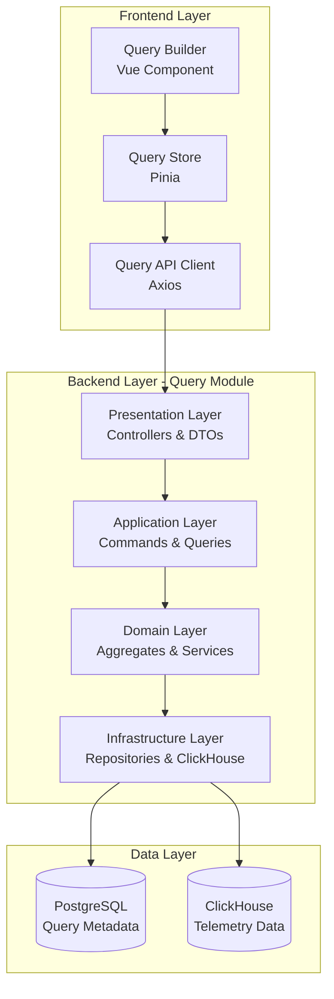
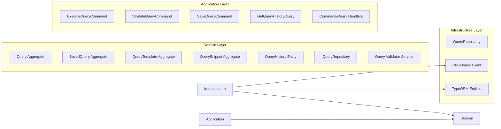
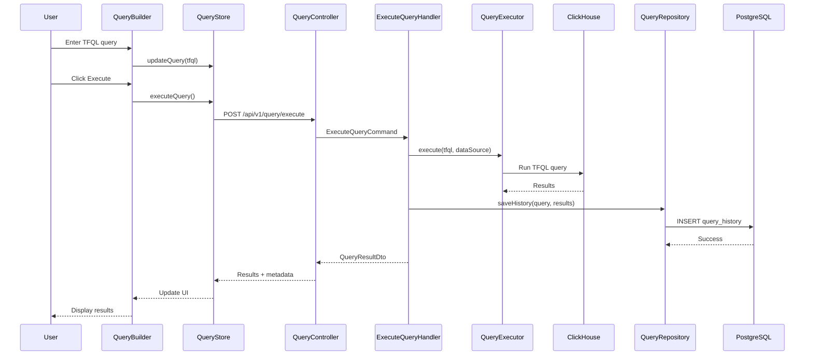
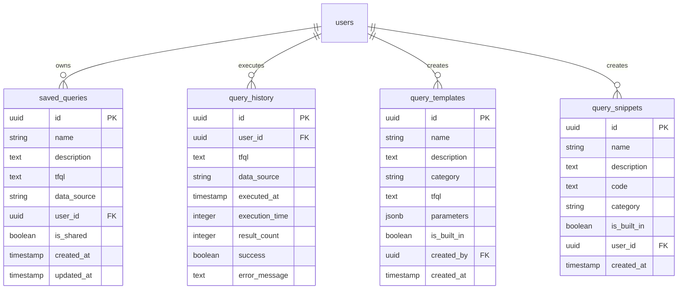

# Design Document: Frontend-Backend Query Integration

## Overview

This design document specifies the technical implementation for integrating the Vue 3 frontend with the NestJS backend for the query module in TelemetryFlow Platform. The system enables users to build, execute, and manage TFQL (TelemetryFlow Query Language) queries against telemetry data stored in ClickHouse.

### Key Features

- Visual TFQL query builder with syntax highlighting and autocomplete
- Real-time query validation and error reporting
- Query execution against metrics, logs, and traces
- Query history and saved queries management
- Query templates and reusable snippets
- Result visualization with charts and tables
- Query sharing and collaboration
- Query parameterization and scheduling

### Technology Stack

**Frontend:**

- Vue 3.5+ with Composition API and TypeScript
- Pinia 3.0+ for state management
- Monaco Editor for code editing
- ECharts 5.6+ for data visualization
- Naive UI 2.43+ for UI components
- Axios 1.13+ for HTTP requests

**Backend:**

- NestJS 11.x with TypeScript
- DDD/CQRS architecture with @nestjs/cqrs
- TypeORM 0.3 for PostgreSQL
- ClickHouse client for query execution
- JWT authentication with Passport.js
- Winston for logging

## Architecture

### High-Level Architecture



### DDD Layer Architecture



### Request Flow



## Components and Interfaces

### Frontend Components

#### 1. Query Builder Component

**Location:** `frontend/src/components/query/QueryBuilder.vue`

**Responsibilities:**

- Render Monaco Editor with TFQL syntax highlighting
- Provide toolbar with common TFQL operations
- Handle user input and keyboard shortcuts
- Integrate with Query Store for state management

**Props:**

```typescript
interface QueryBuilderProps {
  initialQuery?: string;
  dataSource: "metrics" | "logs" | "traces";
  readonly?: boolean;
  height?: string;
}
```

**Emits:**

```typescript
interface QueryBuilderEmits {
  "query-execute": [query: string];
  "query-change": [query: string];
  "query-validate": [query: string];
}
```

**Key Methods:**

- `insertSnippet(snippet: string): void` - Insert code snippet at cursor
- `formatQuery(): void` - Format TFQL query
- `focusEditor(): void` - Focus the editor

#### 2. Syntax Highlighter

**Location:** `frontend/src/components/query/SyntaxHighlighter.ts`

**Responsibilities:**

- Define TFQL language grammar for Monaco Editor
- Provide syntax highlighting rules
- Configure autocomplete providers

**Implementation:**

```typescript
export const tfqlLanguageDefinition = {
  keywords: [
    "SELECT",
    "FROM",
    "WHERE",
    "GROUP BY",
    "ORDER BY",
    "LIMIT",
    "AND",
    "OR",
    "NOT",
    "IN",
    "BETWEEN",
    "LIKE",
    "IS NULL",
  ],
  functions: [
    "COUNT",
    "SUM",
    "AVG",
    "MAX",
    "MIN",
    "PERCENTILE",
    "RATE",
    "INCREASE",
    "HISTOGRAM",
    "TOPK",
  ],
  operators: ["=", "!=", ">", "<", ">=", "<=", "+", "-", "*", "/"],
  tokenizer: {
    // Monaco tokenizer rules
  },
};
```

#### 3. Query Store (Pinia)

**Location:** `frontend/src/store/query.ts`

**State:**

```typescript
interface QueryState {
  currentQuery: string;
  queryResults: QueryResult | null;
  loading: boolean;
  error: string | null;
  queryHistory: QueryHistoryItem[];
  savedQueries: SavedQuery[];
  templates: QueryTemplate[];
  snippets: QuerySnippet[];
  validationErrors: ValidationError[];
  executionMetadata: ExecutionMetadata | null;
}
```

**Getters:**

```typescript
const recentQueries = computed(() => queryHistory.value.slice(0, 10));

const queriesByDataSource = computed(() =>
  savedQueries.value.reduce(
    (acc, q) => {
      acc[q.dataSource] = acc[q.dataSource] || [];
      acc[q.dataSource].push(q);
      return acc;
    },
    {} as Record<string, SavedQuery[]>,
  ),
);

const hasValidationErrors = computed(() => validationErrors.value.length > 0);
```

**Actions:**

```typescript
const executeQuery = async (query: string, dataSource: DataSource) => {
  loading.value = true;
  error.value = null;

  try {
    const response = await queryApi.execute({ query, dataSource });
    queryResults.value = response.data;
    executionMetadata.value = response.metadata;
    await fetchHistory(); // Refresh history
  } catch (e) {
    error.value = e.message;
    throw e;
  } finally {
    loading.value = false;
  }
};

const validateQuery = async (query: string, dataSource: DataSource) => {
  const response = await queryApi.validate({ query, dataSource });
  validationErrors.value = response.errors || [];
  return response.valid;
};

const saveQuery = async (query: SaveQueryRequest) => {
  const response = await queryApi.save(query);
  savedQueries.value.push(response.data);
  return response.data;
};
```

#### 4. Visualization Engine Component

**Location:** `frontend/src/components/query/QueryResultsVisualization.vue`

**Responsibilities:**

- Render query results as tables or charts
- Support multiple visualization types
- Handle large result sets with virtual scrolling
- Provide export functionality

**Props:**

```typescript
interface VisualizationProps {
  results: QueryResult;
  visualizationType: "table" | "line" | "bar" | "area" | "pie";
  metadata: ExecutionMetadata;
}
```

**Key Features:**

- Automatic chart type detection based on data shape
- Virtual scrolling for tables with 10,000+ rows
- Export to CSV/JSON
- Copy to clipboard

#### 5. Query API Client

**Location:** `frontend/src/api/query.ts`

**Implementation:**

```typescript
export const queryApi = {
  async execute(request: ExecuteQueryRequest): Promise<QueryResultResponse> {
    const response = await axios.post("/api/v1/query/execute", request);
    return response.data;
  },

  async validate(request: ValidateQueryRequest): Promise<ValidationResponse> {
    const response = await axios.post("/api/v1/query/validate", request);
    return response.data;
  },

  async getHistory(params: HistoryParams): Promise<QueryHistoryResponse> {
    const response = await axios.get("/api/v1/query/history", { params });
    return response.data;
  },

  async save(request: SaveQueryRequest): Promise<SavedQueryResponse> {
    const response = await axios.post("/api/v1/query/saved", request);
    return response.data;
  },

  async getTemplates(): Promise<QueryTemplatesResponse> {
    const response = await axios.get("/api/v1/query/templates");
    return response.data;
  },

  async getSnippets(): Promise<QuerySnippetsResponse> {
    const response = await axios.get("/api/v1/query/snippets");
    return response.data;
  },
};
```

### Backend Components

#### 1. Query Module Structure

**Location:** `backend/src/modules/query/`

```
query/
├── domain/
│   ├── aggregates/
│   │   ├── Query.ts
│   │   ├── SavedQuery.ts
│   │   ├── QueryTemplate.ts
│   │   └── QuerySnippet.ts
│   ├── entities/
│   │   ├── QueryHistory.ts
│   │   └── QueryParameter.ts
│   ├── value-objects/
│   │   ├── QueryId.ts
│   │   ├── TFQL.ts
│   │   └── DataSource.ts
│   ├── events/
│   │   ├── QueryExecuted.event.ts
│   │   ├── QuerySaved.event.ts
│   │   └── QueryShared.event.ts
│   ├── repositories/
│   │   ├── IQueryRepository.ts
│   │   └── IQueryHistoryRepository.ts
│   └── services/
│       ├── QueryValidator.service.ts
│       └── QueryExecutor.service.ts
├── application/
│   ├── commands/
│   │   ├── ExecuteQuery.command.ts
│   │   ├── SaveQuery.command.ts
│   │   ├── ShareQuery.command.ts
│   │   └── ScheduleQuery.command.ts
│   ├── queries/
│   │   ├── GetQueryHistory.query.ts
│   │   ├── GetSavedQueries.query.ts
│   │   └── GetQueryTemplates.query.ts
│   └── handlers/
│       ├── ExecuteQuery.handler.ts
│       ├── SaveQuery.handler.ts
│       └── GetQueryHistory.handler.ts
├── infrastructure/
│   ├── persistence/
│   │   ├── entities/
│   │   │   ├── SavedQuery.entity.ts
│   │   │   ├── QueryHistory.entity.ts
│   │   │   ├── QueryTemplate.entity.ts
│   │   │   └── QuerySnippet.entity.ts
│   │   ├── repositories/
│   │   │   ├── QueryRepository.ts
│   │   │   └── QueryHistoryRepository.ts
│   │   └── mappers/
│   │       ├── QueryMapper.ts
│   │       └── QueryHistoryMapper.ts
│   └── clickhouse/
│       └── ClickHouseQueryExecutor.ts
└── presentation/
    ├── controllers/
    │   └── Query.controller.ts
    └── dto/
        ├── ExecuteQueryRequest.dto.ts
        ├── QueryResultResponse.dto.ts
        ├── SaveQueryRequest.dto.ts
        └── ValidationResponse.dto.ts
```

#### 2. Domain Layer Components

**Query Aggregate:**

```typescript
// domain/aggregates/Query.ts
export class Query extends AggregateRoot {
  private constructor(
    private readonly id: QueryId,
    private tfql: TFQL,
    private dataSource: DataSource,
    private userId: UserId,
    private executedAt: Date,
    private executionTime: number,
    private resultCount: number,
  ) {
    super();
  }

  static create(tfql: TFQL, dataSource: DataSource, userId: UserId): Query {
    const query = new Query(
      QueryId.generate(),
      tfql,
      dataSource,
      userId,
      new Date(),
      0,
      0,
    );

    query.addDomainEvent(new QueryCreatedEvent(query.id, userId));
    return query;
  }

  execute(executor: IQueryExecutor): Promise<QueryResult> {
    const startTime = Date.now();
    const result = await executor.execute(this.tfql, this.dataSource);

    this.executionTime = Date.now() - startTime;
    this.resultCount = result.rowCount;
    this.executedAt = new Date();

    this.addDomainEvent(
      new QueryExecutedEvent(
        this.id,
        this.userId,
        this.executionTime,
        this.resultCount,
      ),
    );

    return result;
  }

  getTFQL(): string {
    return this.tfql.value;
  }

  getDataSource(): DataSource {
    return this.dataSource;
  }
}
```

**SavedQuery Aggregate:**

```typescript
// domain/aggregates/SavedQuery.ts
export class SavedQuery extends AggregateRoot {
  private constructor(
    private readonly id: QueryId,
    private name: string,
    private description: string,
    private tfql: TFQL,
    private dataSource: DataSource,
    private userId: UserId,
    private isShared: boolean,
    private createdAt: Date,
    private updatedAt: Date,
  ) {
    super();
  }

  static create(
    name: string,
    description: string,
    tfql: TFQL,
    dataSource: DataSource,
    userId: UserId,
  ): SavedQuery {
    const query = new SavedQuery(
      QueryId.generate(),
      name,
      description,
      tfql,
      dataSource,
      userId,
      false,
      new Date(),
      new Date(),
    );

    query.addDomainEvent(new QuerySavedEvent(query.id, userId));
    return query;
  }

  update(name: string, description: string, tfql: TFQL): void {
    this.name = name;
    this.description = description;
    this.tfql = tfql;
    this.updatedAt = new Date();

    this.addDomainEvent(new QueryUpdatedEvent(this.id, this.userId));
  }

  share(): void {
    if (this.isShared) {
      throw new Error("Query is already shared");
    }

    this.isShared = true;
    this.addDomainEvent(new QuerySharedEvent(this.id, this.userId));
  }

  unshare(): void {
    this.isShared = false;
  }
}
```

**Query Validator Service:**

```typescript
// domain/services/QueryValidator.service.ts
export class QueryValidatorService {
  validate(tfql: TFQL, dataSource: DataSource): ValidationResult {
    const errors: ValidationError[] = [];

    // Syntax validation
    const syntaxErrors = this.validateSyntax(tfql.value);
    errors.push(...syntaxErrors);

    // Semantic validation
    const semanticErrors = this.validateSemantics(tfql.value, dataSource);
    errors.push(...semanticErrors);

    return {
      valid: errors.length === 0,
      errors,
    };
  }

  private validateSyntax(query: string): ValidationError[] {
    // Parse TFQL and check for syntax errors
    // Return errors with line and column information
  }

  private validateSemantics(
    query: string,
    dataSource: DataSource,
  ): ValidationError[] {
    // Check field names against schema
    // Validate function usage
    // Check data type compatibility
  }
}
```

**Query Executor Service:**

```typescript
// domain/services/QueryExecutor.service.ts
export interface IQueryExecutor {
  execute(tfql: TFQL, dataSource: DataSource): Promise<QueryResult>;
}

export class QueryResult {
  constructor(
    public readonly rows: any[],
    public readonly columns: ColumnMetadata[],
    public readonly rowCount: number,
    public readonly executionTime: number,
    public readonly dataSource: DataSource,
  ) {}
}

export interface ColumnMetadata {
  name: string;
  type: string;
  nullable: boolean;
}
```

#### 3. Application Layer Components

**Execute Query Command Handler:**

```typescript
// application/handlers/ExecuteQuery.handler.ts
@CommandHandler(ExecuteQueryCommand)
export class ExecuteQueryHandler implements ICommandHandler<ExecuteQueryCommand> {
  constructor(
    private readonly queryExecutor: IQueryExecutor,
    private readonly queryValidator: QueryValidatorService,
    private readonly queryHistoryRepo: IQueryHistoryRepository,
    private readonly eventBus: EventBus,
  ) {}

  async execute(command: ExecuteQueryCommand): Promise<QueryResultDto> {
    const { tfql, dataSource, userId } = command;

    // Validate query
    const validation = this.queryValidator.validate(new TFQL(tfql), dataSource);

    if (!validation.valid) {
      throw new ValidationException(validation.errors);
    }

    // Create query aggregate
    const query = Query.create(new TFQL(tfql), dataSource, new UserId(userId));

    // Execute query
    const result = await query.execute(this.queryExecutor);

    // Save to history
    const history = QueryHistory.create(query, result);
    await this.queryHistoryRepo.save(history);

    // Publish domain events
    query.getDomainEvents().forEach((event) => {
      this.eventBus.publish(event);
    });

    return QueryResultDto.fromDomain(result);
  }
}
```

**Save Query Command Handler:**

```typescript
// application/handlers/SaveQuery.handler.ts
@CommandHandler(SaveQueryCommand)
export class SaveQueryHandler implements ICommandHandler<SaveQueryCommand> {
  constructor(
    private readonly queryRepo: IQueryRepository,
    private readonly eventBus: EventBus,
  ) {}

  async execute(command: SaveQueryCommand): Promise<SavedQueryDto> {
    const { name, description, tfql, dataSource, userId } = command;

    // Check for duplicate name
    const existing = await this.queryRepo.findByNameAndUser(name, userId);
    if (existing) {
      throw new DuplicateQueryNameException(name);
    }

    // Create saved query
    const savedQuery = SavedQuery.create(
      name,
      description,
      new TFQL(tfql),
      dataSource,
      new UserId(userId),
    );

    // Save to repository
    await this.queryRepo.save(savedQuery);

    // Publish domain events
    savedQuery.getDomainEvents().forEach((event) => {
      this.eventBus.publish(event);
    });

    return SavedQueryDto.fromDomain(savedQuery);
  }
}
```

**Get Query History Query Handler:**

```typescript
// application/handlers/GetQueryHistory.handler.ts
@QueryHandler(GetQueryHistoryQuery)
export class GetQueryHistoryHandler implements IQueryHandler<GetQueryHistoryQuery> {
  constructor(private readonly queryHistoryRepo: IQueryHistoryRepository) {}

  async execute(query: GetQueryHistoryQuery): Promise<QueryHistoryDto[]> {
    const { userId, limit, offset, startDate, endDate } = query;

    const history = await this.queryHistoryRepo.findByUser(new UserId(userId), {
      limit,
      offset,
      startDate,
      endDate,
    });

    return history.map((h) => QueryHistoryDto.fromDomain(h));
  }
}
```

#### 4. Infrastructure Layer Components

**ClickHouse Query Executor:**

```typescript
// infrastructure/clickhouse/ClickHouseQueryExecutor.ts
@Injectable()
export class ClickHouseQueryExecutor implements IQueryExecutor {
  constructor(
    private readonly clickhouseClient: ClickHouseClient,
    private readonly logger: LoggerService,
  ) {}

  async execute(tfql: TFQL, dataSource: DataSource): Promise<QueryResult> {
    const startTime = Date.now();

    try {
      // Convert TFQL to ClickHouse SQL
      const sql = this.convertTFQLToSQL(tfql.value, dataSource);

      // Apply default time range if not specified
      const sqlWithDefaults = this.applyDefaults(sql);

      // Execute with timeout
      const result = await Promise.race([
        this.clickhouseClient.query(sqlWithDefaults),
        this.timeout(30000),
      ]);

      const executionTime = Date.now() - startTime;

      this.logger.log("Query executed", {
        dataSource,
        executionTime,
        rowCount: result.rows.length,
      });

      return new QueryResult(
        result.rows,
        result.columns,
        result.rows.length,
        executionTime,
        dataSource,
      );
    } catch (error) {
      this.logger.error("Query execution failed", {
        error: error.message,
        tfql: tfql.value,
        dataSource,
      });
      throw new QueryExecutionException(error.message);
    }
  }

  private convertTFQLToSQL(tfql: string, dataSource: DataSource): string {
    // Parse TFQL and convert to ClickHouse SQL
    // Handle data source specific table names
    const tableName = this.getTableName(dataSource);
    // Transform TFQL syntax to SQL
    return transformedSQL;
  }

  private applyDefaults(sql: string): string {
    // Apply default time range if not specified
    // Apply result limit if not specified
    return sql;
  }

  private getTableName(dataSource: DataSource): string {
    switch (dataSource) {
      case DataSource.METRICS:
        return "metrics";
      case DataSource.LOGS:
        return "logs";
      case DataSource.TRACES:
        return "traces";
      default:
        throw new Error(`Unknown data source: ${dataSource}`);
    }
  }

  private timeout(ms: number): Promise<never> {
    return new Promise((_, reject) => {
      setTimeout(() => reject(new Error("Query timeout")), ms);
    });
  }
}
```

**Query Repository:**

```typescript
// infrastructure/persistence/repositories/QueryRepository.ts
@Injectable()
export class QueryRepository implements IQueryRepository {
  constructor(
    @InjectRepository(SavedQueryEntity)
    private readonly savedQueryRepo: Repository<SavedQueryEntity>,
    private readonly mapper: QueryMapper,
  ) {}

  async save(query: SavedQuery): Promise<void> {
    const entity = this.mapper.toEntity(query);
    await this.savedQueryRepo.save(entity);
  }

  async findById(id: QueryId): Promise<SavedQuery | null> {
    const entity = await this.savedQueryRepo.findOne({
      where: { id: id.value },
    });

    return entity ? this.mapper.toDomain(entity) : null;
  }

  async findByUser(userId: UserId): Promise<SavedQuery[]> {
    const entities = await this.savedQueryRepo.find({
      where: { userId: userId.value },
      order: { updatedAt: "DESC" },
    });

    return entities.map((e) => this.mapper.toDomain(e));
  }

  async findByNameAndUser(
    name: string,
    userId: UserId,
  ): Promise<SavedQuery | null> {
    const entity = await this.savedQueryRepo.findOne({
      where: { name, userId: userId.value },
    });

    return entity ? this.mapper.toDomain(entity) : null;
  }

  async findShared(): Promise<SavedQuery[]> {
    const entities = await this.savedQueryRepo.find({
      where: { isShared: true },
      order: { updatedAt: "DESC" },
    });

    return entities.map((e) => this.mapper.toDomain(e));
  }

  async delete(id: QueryId): Promise<void> {
    await this.savedQueryRepo.delete({ id: id.value });
  }
}
```

#### 5. Presentation Layer Components

**Query Controller:**

```typescript
// presentation/controllers/Query.controller.ts
@Controller("api/v1/query")
@ApiTags("Query")
@UseGuards(JwtAuthGuard)
export class QueryController {
  constructor(
    private readonly commandBus: CommandBus,
    private readonly queryBus: QueryBus,
  ) {}

  @Post("execute")
  @ApiOperation({ summary: "Execute a TFQL query" })
  @ApiResponse({ status: 200, type: QueryResultResponse })
  @ApiResponse({ status: 400, description: "Invalid query" })
  @ApiResponse({ status: 408, description: "Query timeout" })
  async executeQuery(
    @Body() dto: ExecuteQueryRequestDto,
    @CurrentUser() user: User,
  ): Promise<QueryResultResponse> {
    const command = new ExecuteQueryCommand(dto.query, dto.dataSource, user.id);

    const result = await this.commandBus.execute(command);
    return result;
  }

  @Post("validate")
  @ApiOperation({ summary: "Validate a TFQL query" })
  @ApiResponse({ status: 200, type: ValidationResponse })
  async validateQuery(
    @Body() dto: ValidateQueryRequestDto,
  ): Promise<ValidationResponse> {
    const command = new ValidateQueryCommand(dto.query, dto.dataSource);

    const result = await this.commandBus.execute(command);
    return result;
  }

  @Get("history")
  @ApiOperation({ summary: "Get query history" })
  @ApiResponse({ status: 200, type: [QueryHistoryDto] })
  async getHistory(
    @Query() params: QueryHistoryParamsDto,
    @CurrentUser() user: User,
  ): Promise<QueryHistoryDto[]> {
    const query = new GetQueryHistoryQuery(
      user.id,
      params.limit || 100,
      params.offset || 0,
      params.startDate,
      params.endDate,
    );

    const result = await this.queryBus.execute(query);
    return result;
  }

  @Post("saved")
  @ApiOperation({ summary: "Save a query" })
  @ApiResponse({ status: 201, type: SavedQueryDto })
  @ApiResponse({ status: 409, description: "Query name already exists" })
  async saveQuery(
    @Body() dto: SaveQueryRequestDto,
    @CurrentUser() user: User,
  ): Promise<SavedQueryDto> {
    const command = new SaveQueryCommand(
      dto.name,
      dto.description,
      dto.query,
      dto.dataSource,
      user.id,
    );

    const result = await this.commandBus.execute(command);
    return result;
  }

  @Get("saved")
  @ApiOperation({ summary: "Get saved queries" })
  @ApiResponse({ status: 200, type: [SavedQueryDto] })
  async getSavedQueries(@CurrentUser() user: User): Promise<SavedQueryDto[]> {
    const query = new GetSavedQueriesQuery(user.id);
    const result = await this.queryBus.execute(query);
    return result;
  }

  @Get("templates")
  @ApiOperation({ summary: "Get query templates" })
  @ApiResponse({ status: 200, type: [QueryTemplateDto] })
  async getTemplates(): Promise<QueryTemplateDto[]> {
    const query = new GetQueryTemplatesQuery();
    const result = await this.queryBus.execute(query);
    return result;
  }

  @Get("snippets")
  @ApiOperation({ summary: "Get query snippets" })
  @ApiResponse({ status: 200, type: [QuerySnippetDto] })
  async getSnippets(@CurrentUser() user: User): Promise<QuerySnippetDto[]> {
    const query = new GetQuerySnippetsQuery(user.id);
    const result = await this.queryBus.execute(query);
    return result;
  }

  @Post("share/:id")
  @ApiOperation({ summary: "Share a saved query" })
  @ApiResponse({ status: 200, type: ShareQueryResponse })
  async shareQuery(
    @Param("id") id: string,
    @CurrentUser() user: User,
  ): Promise<ShareQueryResponse> {
    const command = new ShareQueryCommand(id, user.id);
    const result = await this.commandBus.execute(command);
    return result;
  }
}
```

## Data Models

### Domain Models

#### Query Aggregate

```typescript
class Query {
  id: QueryId; // UUID
  tfql: TFQL; // Value object containing query text
  dataSource: DataSource; // METRICS | LOGS | TRACES
  userId: UserId; // User who created the query
  executedAt: Date; // Execution timestamp
  executionTime: number; // Execution time in milliseconds
  resultCount: number; // Number of rows returned
}
```

#### SavedQuery Aggregate

```typescript
class SavedQuery {
  id: QueryId; // UUID
  name: string; // Unique per user
  description: string; // Optional description
  tfql: TFQL; // Query text
  dataSource: DataSource; // METRICS | LOGS | TRACES
  userId: UserId; // Owner
  isShared: boolean; // Shared with organization
  createdAt: Date;
  updatedAt: Date;
}
```

#### QueryTemplate Aggregate

```typescript
class QueryTemplate {
  id: string; // UUID
  name: string; // Template name
  description: string; // Template description
  category: string; // metrics | logs | traces
  tfql: string; // Template with placeholders
  parameters: Parameter[]; // Parameter definitions
  isBuiltIn: boolean; // System vs user template
  createdBy: UserId; // Creator (null for built-in)
}

interface Parameter {
  name: string; // Parameter name (e.g., "service_name")
  type: string; // string | number | date
  required: boolean;
  defaultValue?: any;
  description: string;
}
```

#### QuerySnippet Aggregate

```typescript
class QuerySnippet {
  id: string; // UUID
  name: string; // Snippet name
  description: string; // Snippet description
  code: string; // TFQL code fragment
  category: string; // filters | aggregations | time-ranges
  isBuiltIn: boolean; // System vs user snippet
  userId: UserId; // Owner (null for built-in)
}
```

#### QueryHistory Entity

```typescript
class QueryHistory {
  id: string; // UUID
  queryId: QueryId; // Reference to query
  userId: UserId; // User who executed
  tfql: string; // Query text
  dataSource: DataSource; // METRICS | LOGS | TRACES
  executedAt: Date; // Execution timestamp
  executionTime: number; // Execution time in ms
  resultCount: number; // Number of rows
  success: boolean; // Execution success
  errorMessage?: string; // Error if failed
}
```

### Database Schema

#### PostgreSQL Tables

**saved_queries table:**

```sql
CREATE TABLE saved_queries (
  id UUID PRIMARY KEY DEFAULT gen_random_uuid(),
  name VARCHAR(255) NOT NULL,
  description TEXT,
  tfql TEXT NOT NULL,
  data_source VARCHAR(50) NOT NULL,
  user_id UUID NOT NULL REFERENCES users(id),
  is_shared BOOLEAN DEFAULT FALSE,
  created_at TIMESTAMP DEFAULT NOW(),
  updated_at TIMESTAMP DEFAULT NOW(),
  UNIQUE(name, user_id)
);

CREATE INDEX idx_saved_queries_user_id ON saved_queries(user_id);
CREATE INDEX idx_saved_queries_shared ON saved_queries(is_shared) WHERE is_shared = TRUE;
```

**query_history table:**

```sql
CREATE TABLE query_history (
  id UUID PRIMARY KEY DEFAULT gen_random_uuid(),
  user_id UUID NOT NULL REFERENCES users(id),
  tfql TEXT NOT NULL,
  data_source VARCHAR(50) NOT NULL,
  executed_at TIMESTAMP DEFAULT NOW(),
  execution_time INTEGER NOT NULL,
  result_count INTEGER NOT NULL,
  success BOOLEAN DEFAULT TRUE,
  error_message TEXT,
  created_at TIMESTAMP DEFAULT NOW()
);

CREATE INDEX idx_query_history_user_id ON query_history(user_id);
CREATE INDEX idx_query_history_executed_at ON query_history(executed_at DESC);
```

**query_templates table:**

```sql
CREATE TABLE query_templates (
  id UUID PRIMARY KEY DEFAULT gen_random_uuid(),
  name VARCHAR(255) NOT NULL UNIQUE,
  description TEXT,
  category VARCHAR(50) NOT NULL,
  tfql TEXT NOT NULL,
  parameters JSONB,
  is_built_in BOOLEAN DEFAULT FALSE,
  created_by UUID REFERENCES users(id),
  created_at TIMESTAMP DEFAULT NOW(),
  updated_at TIMESTAMP DEFAULT NOW()
);

CREATE INDEX idx_query_templates_category ON query_templates(category);
```

**query_snippets table:**

```sql
CREATE TABLE query_snippets (
  id UUID PRIMARY KEY DEFAULT gen_random_uuid(),
  name VARCHAR(255) NOT NULL,
  description TEXT,
  code TEXT NOT NULL,
  category VARCHAR(50) NOT NULL,
  is_built_in BOOLEAN DEFAULT FALSE,
  user_id UUID REFERENCES users(id),
  created_at TIMESTAMP DEFAULT NOW(),
  UNIQUE(name, user_id)
);

CREATE INDEX idx_query_snippets_user_id ON query_snippets(user_id);
CREATE INDEX idx_query_snippets_category ON query_snippets(category);
```

### Entity Relationship Diagram



### Frontend Data Models

#### TypeScript Interfaces

```typescript
// types/query.ts

export interface QueryResult {
  rows: any[];
  columns: ColumnMetadata[];
  rowCount: number;
  executionTime: number;
  dataSource: DataSource;
}

export interface ColumnMetadata {
  name: string;
  type: string;
  nullable: boolean;
}

export interface ExecutionMetadata {
  executionTime: number;
  rowCount: number;
  dataSource: DataSource;
  cached: boolean;
  cacheAge?: number;
}

export interface ValidationError {
  line: number;
  column: number;
  message: string;
  severity: "error" | "warning";
}

export interface QueryHistoryItem {
  id: string;
  tfql: string;
  dataSource: DataSource;
  executedAt: Date;
  executionTime: number;
  resultCount: number;
  success: boolean;
  errorMessage?: string;
}

export interface SavedQuery {
  id: string;
  name: string;
  description: string;
  tfql: string;
  dataSource: DataSource;
  userId: string;
  isShared: boolean;
  createdAt: Date;
  updatedAt: Date;
}

export interface QueryTemplate {
  id: string;
  name: string;
  description: string;
  category: string;
  tfql: string;
  parameters: TemplateParameter[];
  isBuiltIn: boolean;
}

export interface TemplateParameter {
  name: string;
  type: "string" | "number" | "date";
  required: boolean;
  defaultValue?: any;
  description: string;
}

export interface QuerySnippet {
  id: string;
  name: string;
  description: string;
  code: string;
  category: string;
  isBuiltIn: boolean;
}

export enum DataSource {
  METRICS = "metrics",
  LOGS = "logs",
  TRACES = "traces",
}
```

## Correctness Properties

_A property is a characteristic or behavior that should hold true across all valid executions of a system—essentially, a formal statement about what the system should do. Properties serve as the bridge between human-readable specifications and machine-verifiable correctness guarantees._

### Property Reflection

After analyzing all acceptance criteria, I identified the following areas where properties can be consolidated:

1. **Query execution properties** (2.1, 2.3, 2.6) can be combined into comprehensive execution properties
2. **Validation properties** (3.2, 3.4, 3.5) cover different aspects and should remain separate
3. **History and saved query properties** (4.1, 5.1) are similar but operate on different entities, keep separate
4. **Deletion properties** (4.6, 5.6) follow the same pattern but for different entities, can be combined
5. **Metadata display properties** (8.7, 10.5, 14.1) cover different contexts, keep separate
6. **Export properties** (16.1, 16.2, 16.3) can be combined into a single export correctness property

### Core Query Execution Properties

Property 1: Query execution completeness
_For any_ valid TFQL query and data source, when executed, the Query_Executor should return results containing all required metadata fields (row count, execution time, data source, columns)
**Validates: Requirements 2.3, 2.6**

Property 2: Query execution timeout enforcement
_For any_ query execution, the execution time should not exceed 30 seconds before cancellation
**Validates: Requirements 2.1**

Property 3: Query execution independence
_For any_ set of concurrent query executions, each query's results should be independent and unaffected by other executing queries
**Validates: Requirements 2.7**

Property 4: Query state management during execution
_For any_ query execution, the loading state should be true during execution and false after completion or failure
**Validates: Requirements 2.2**

Property 5: Query error reporting
_For any_ invalid query that fails execution, the error message should contain descriptive information including line and column positions where applicable
**Validates: Requirements 2.4**

### Validation Properties

Property 6: Syntax validation correctness
_For any_ syntactically valid TFQL query, validation should return success with zero error markers
**Validates: Requirements 3.5**

Property 7: Syntax error detection
_For any_ TFQL query with syntax errors, validation should return error markers with line and column positions for each error
**Validates: Requirements 3.2**

Property 8: Semantic validation with suggestions
_For any_ query referencing invalid fields, validation should return semantic errors with suggestions for valid field names
**Validates: Requirements 3.4**

Property 9: Schema-specific validation
_For any_ query and data source combination, validation should use the schema corresponding to the selected data source
**Validates: Requirements 3.6**

Property 10: Validation error display
_For any_ validation error, the Query_Builder should display the error with line and column information and show a tooltip on hover
**Validates: Requirements 3.3, 14.1**

### Query History Properties

Property 11: History record creation
_For any_ executed query, a history record should be created containing the query text, timestamp, execution time, result count, and success status
**Validates: Requirements 4.1**

Property 12: History data isolation
_For any_ user, query history retrieval should return only queries executed by that user
**Validates: Requirements 4.7**

Property 13: History filtering by date range
_For any_ date range filter applied to query history, all returned queries should have execution timestamps within the specified range
**Validates: Requirements 4.4**

Property 14: History text search
_For any_ text search term applied to query history, all returned queries should contain the search term in their query text
**Validates: Requirements 4.5**

Property 15: History query loading
_For any_ historical query selected for loading, the Query_Builder should populate the editor with the exact query text from the history record
**Validates: Requirements 4.3**

### Saved Query Properties

Property 16: Saved query completeness
_For any_ query saved by a user, the saved record should contain name, description, TFQL text, data source, and user_id
**Validates: Requirements 5.1**

Property 17: Saved query name uniqueness
_For any_ user, attempting to save a query with a name that already exists for that user should be rejected
**Validates: Requirements 5.2**

Property 18: Saved query retrieval
_For any_ user, retrieving saved queries should return all queries owned by that user
**Validates: Requirements 5.3**

Property 19: Saved query loading
_For any_ saved query loaded into the editor, the displayed TFQL text should match the saved query text exactly
**Validates: Requirements 5.4**

Property 20: Saved query update
_For any_ saved query update operation, the record should be modified with new content and the updated_at timestamp should be set to the current time
**Validates: Requirements 5.5**

Property 21: Entity deletion
_For any_ query history or saved query deletion, the deleted entity should no longer be retrievable from the database
**Validates: Requirements 4.6, 5.6**

Property 22: Query sharing visibility
_For any_ query marked as shared, the query should be visible to all users in the same organization with author information displayed
**Validates: Requirements 5.7, 5.8**

### Template and Snippet Properties

Property 23: Template organization
_For any_ set of query templates, templates should be grouped by category (metrics, logs, traces) when displayed
**Validates: Requirements 6.2**

Property 24: Template placeholder handling
_For any_ template loaded into the editor, all placeholders should be highlighted and replaceable with user-provided values
**Validates: Requirements 6.3, 6.4**

Property 25: Template validation
_For any_ custom template created by an administrator, the template TFQL syntax should be validated before storage
**Validates: Requirements 6.6**

Property 26: Template custom support
_For any_ administrator, custom templates should be creatable and retrievable alongside built-in templates
**Validates: Requirements 6.5**

Property 27: Snippet insertion
_For any_ snippet selected for insertion, the snippet code should be inserted at the current cursor position in the editor
**Validates: Requirements 7.3**

Property 28: Snippet cursor positioning
_For any_ snippet containing placeholders, after insertion the cursor should be positioned at the first placeholder
**Validates: Requirements 7.4**

Property 29: User snippet storage
_For any_ user-created snippet, the snippet should be stored with name, description, and TFQL fragment and be retrievable by that user
**Validates: Requirements 7.5, 7.6**

### Visualization Properties

Property 30: Default table visualization
_For any_ query results returned, the Visualization_Engine should display them in a data table by default
**Validates: Requirements 8.1**

Property 31: Time-series chart options
_For any_ query results containing time-series data, the Visualization_Engine should offer line, area, and bar chart visualization options
**Validates: Requirements 8.2**

Property 32: Chart rendering
_For any_ chart type selected by the user, the Visualization_Engine should render the results using ECharts
**Validates: Requirements 8.3**

Property 33: Aggregated data chart types
_For any_ query results containing aggregated data, the Visualization_Engine should offer appropriate chart types (bar, pie, gauge)
**Validates: Requirements 8.4**

Property 34: Result metadata display
_For any_ query results displayed, the Visualization_Engine should show metadata including row count, execution time, and data source
**Validates: Requirements 8.7**

Property 35: Export format support
_For any_ query results, the Visualization_Engine should support export in both CSV and JSON formats with proper formatting
**Validates: Requirements 8.5, 16.1, 16.2**

Property 36: Clipboard copy format
_For any_ query results copied to clipboard, the data should be in tab-separated format
**Validates: Requirements 16.3**

### Performance and Optimization Properties

Property 37: Default time range application
_For any_ query lacking explicit time range filters, the Query_Executor should apply a default time range of the last 24 hours
**Validates: Requirements 9.2**

Property 38: Result limit enforcement
_For any_ query execution, the returned results should not exceed 10,000 rows
**Validates: Requirements 9.3**

Property 39: Query result caching
_For any_ frequently executed query, repeated executions within 5 minutes should return cached results with cache metadata
**Validates: Requirements 9.6, 9.7**

### Sharing and Collaboration Properties

Property 40: Shareable link uniqueness
_For any_ query shared by a user, a unique shareable link should be generated
**Validates: Requirements 10.1**

Property 41: Shared query access
_For any_ shared query link accessed, the Query_Builder should load the query in read-only mode
**Validates: Requirements 10.2**

Property 42: Shared query updates
_For any_ shared query modified by a user with edit permissions, the updates should be visible to all users with access to that query
**Validates: Requirements 10.3**

Property 43: Permission enforcement
_For any_ shared query, access should be enforced based on user roles (read-only or edit)
**Validates: Requirements 10.4**

Property 44: Shared query metadata
_For any_ shared query viewed, the display should include author name and last modified timestamp
**Validates: Requirements 10.5**

Property 45: Query collection management
_For any_ query collection created, it should be stored with name, description, and query references, and queries should be groupable into collections
**Validates: Requirements 10.6, 10.7**

### API and Integration Properties

Property 46: Domain event emission
_For any_ query execution, save, or share operation, the Query_Module should emit corresponding domain events
**Validates: Requirements 11.8**

Property 47: API endpoint functionality
_For any_ API endpoint (execute, validate, history, saved, templates, snippets), requests should be processed and return appropriate responses
**Validates: Requirements 12.3, 12.4, 12.5, 12.6, 12.7, 12.8**

Property 48: Authentication requirement
_For any_ API endpoint request without valid JWT authentication, the request should be rejected
**Validates: Requirements 12.9**

Property 49: Request validation
_For any_ API request with invalid DTO fields, the request should be rejected with validation errors
**Validates: Requirements 12.10**

### State Management Properties

Property 50: Store getter correctness
_For any_ Pinia store getter (filtered history, queries by category, result statistics), the computed value should accurately reflect the current state
**Validates: Requirements 13.3**

Property 51: Query execution state updates
_For any_ query execution, the Query_Store should update loading state at start, clear previous errors, and store results or errors upon completion
**Validates: Requirements 13.4, 13.5, 13.6**

Property 52: Query persistence
_For any_ query text entered in the editor, the text should be persisted to localStorage and restored after page refresh
**Validates: Requirements 13.7**

### Error Handling Properties

Property 53: Error notification display
_For any_ query execution error, the Query_Store should display a notification with the error message
**Validates: Requirements 14.2**

Property 54: Error logging with context
_For any_ error in the Query_Module, the error should be logged to Winston with appropriate severity level and include request context (user_id, query_id)
**Validates: Requirements 14.6, 14.7**

### Syntax Highlighting Properties

Property 55: Keyword highlighting
_For any_ TFQL query containing keywords (SELECT, FROM, WHERE, GROUP BY, ORDER BY, LIMIT), the Syntax_Highlighter should highlight them
**Validates: Requirements 15.2**

Property 56: Function highlighting
_For any_ TFQL query containing functions (COUNT, SUM, AVG, MAX, MIN, PERCENTILE), the Syntax_Highlighter should highlight them
**Validates: Requirements 15.3**

Property 57: Token type highlighting
_For any_ TFQL query, strings, numbers, and operators should be highlighted with distinct colors
**Validates: Requirements 15.4**

Property 58: Keyboard shortcut functionality
_For any_ keyboard shortcut (Ctrl+Enter for execute, Ctrl+Shift+F for format), the corresponding action should be triggered
**Validates: Requirements 15.5**

### Result Sharing Properties

Property 59: Result link generation
_For any_ query results shared via link, a shareable link should be generated containing the embedded results
**Validates: Requirements 16.4**

Property 60: Result link access
_For any_ result link accessed, the Query_Builder should display the results in read-only mode
**Validates: Requirements 16.5**

Property 61: Result link authentication
_For any_ result link containing sensitive data, authentication should be required to access the results
**Validates: Requirements 16.7**

### Parameterization Properties

Property 62: Parameter detection
_For any_ query containing parameter placeholders (e.g., {{service_name}}), the Query_Builder should detect and highlight them
**Validates: Requirements 17.1**

Property 63: Parameter prompting
_For any_ parameterized query executed, the Query_Builder should prompt for values for all parameters
**Validates: Requirements 17.2**

Property 64: Parameter substitution
_For any_ parameterized query with provided values, the Query_Executor should substitute all parameter placeholders with the provided values before execution
**Validates: Requirements 17.3**

Property 65: Parameter type validation
_For any_ parameter value provided, the Query_Module should validate that the value matches the expected type (string, number, date)
**Validates: Requirements 17.4**

Property 66: Parameter storage
_For any_ parameterized query saved, the parameter definitions should be stored with the query
**Validates: Requirements 17.5**

Property 67: Parameter input display
_For any_ parameterized query loaded, the Query_Builder should display parameter inputs with default values
**Validates: Requirements 17.6**

Property 68: Parameter sanitization
_For any_ parameter value provided, the Query_Executor should sanitize the value to prevent injection attacks
**Validates: Requirements 17.7**

### Scheduling Properties

Property 69: Schedule storage
_For any_ query scheduled by a user, the schedule should be stored with cron expression and query reference
**Validates: Requirements 18.1**

Property 70: Scheduled execution
_For any_ scheduled query, the Query_Module should execute the query according to the schedule and store results
**Validates: Requirements 18.2**

Property 71: Alert triggering
_For any_ scheduled query results meeting alert conditions, the Query_Module should trigger alert notifications
**Validates: Requirements 18.3**

Property 72: Schedule frequency support
_For any_ schedule frequency (every minute, hourly, daily, weekly, custom cron), the Query_Module should support it
**Validates: Requirements 18.4**

Property 73: Scheduled query error handling
_For any_ scheduled query that fails, the Query_Module should log the error and notify the user
**Validates: Requirements 18.5**

Property 74: Schedule metadata display
_For any_ scheduled query viewed, the Query_Store should display next execution time and last result status
**Validates: Requirements 18.6**

Property 75: Schedule limit enforcement
_For any_ user, the number of scheduled queries should not exceed 10
**Validates: Requirements 18.7**

## Error Handling

### Frontend Error Handling

#### Query Validation Errors

- Display inline error markers in the editor with line/column positions
- Show tooltips on hover with detailed error descriptions
- Clear errors when query is corrected
- Debounce validation to avoid excessive API calls (300ms)

#### Query Execution Errors

- Display toast notifications with error messages
- Distinguish between syntax errors, semantic errors, and execution errors
- Provide actionable suggestions (e.g., "Add time range filter to improve performance")
- Log errors to browser console for debugging

#### Network Errors

- Detect network failures and display user-friendly messages
- Provide retry functionality
- Show connection status indicator
- Cache queries locally to prevent data loss

#### Timeout Errors

- Display timeout message with query optimization suggestions
- Allow users to cancel long-running queries
- Show progress indicator during execution
- Suggest adding filters or limiting result size

### Backend Error Handling

#### Validation Exceptions

```typescript
export class ValidationException extends Error {
  constructor(public readonly errors: ValidationError[]) {
    super("Query validation failed");
  }
}
```

#### Execution Exceptions

```typescript
export class QueryExecutionException extends Error {
  constructor(
    message: string,
    public readonly query: string,
    public readonly dataSource: DataSource,
  ) {
    super(message);
  }
}
```

#### Duplicate Name Exception

```typescript
export class DuplicateQueryNameException extends Error {
  constructor(public readonly name: string) {
    super(`Query with name "${name}" already exists`);
  }
}
```

#### Error Response Format

```typescript
interface ErrorResponse {
  statusCode: number;
  message: string;
  error: string;
  details?: any;
  timestamp: string;
  path: string;
}
```

### Error Logging Strategy

- **Frontend**: Log errors to browser console with context
- **Backend**: Log errors to Winston with severity levels
  - ERROR: Query execution failures, database errors
  - WARN: Slow queries (>10s), validation failures
  - INFO: Successful operations, cache hits
  - DEBUG: Detailed execution traces

### Error Recovery

- **Automatic Retry**: Network errors with exponential backoff
- **Query Recovery**: Restore unsaved queries from localStorage
- **Graceful Degradation**: Show cached results if fresh data unavailable
- **User Notification**: Clear communication about errors and recovery options

## Testing Strategy

### Dual Testing Approach

This feature requires both unit tests and property-based tests for comprehensive coverage:

- **Unit tests**: Verify specific examples, edge cases, and error conditions
- **Property tests**: Verify universal properties across all inputs
- Both approaches are complementary and necessary

### Unit Testing

#### Frontend Unit Tests (Vitest + Vue Test Utils)

**Query Builder Component:**

- Test component rendering with initial props
- Test toolbar button clicks insert correct syntax
- Test keyboard shortcuts trigger correct actions
- Test editor focus and cursor positioning
- Test snippet insertion at cursor position

**Query Store:**

- Test state initialization
- Test action execution with mocked API
- Test getter computations
- Test error state management
- Test localStorage persistence

**Visualization Engine:**

- Test table rendering with sample data
- Test chart type selection
- Test export functionality (CSV, JSON)
- Test empty state display
- Test virtual scrolling activation

**Example Unit Test:**

```typescript
describe("QueryBuilder", () => {
  it("should render editor with syntax highlighting", () => {
    const wrapper = mount(QueryBuilder, {
      props: { dataSource: "metrics" },
    });

    expect(wrapper.find(".monaco-editor").exists()).toBe(true);
  });

  it("should insert snippet at cursor position", async () => {
    const wrapper = mount(QueryBuilder);
    await wrapper.vm.insertSnippet("SELECT * FROM metrics");

    expect(wrapper.vm.currentQuery).toContain("SELECT * FROM metrics");
  });
});
```

#### Backend Unit Tests (Jest)

**Domain Layer:**

- Test aggregate creation and business logic
- Test value object validation
- Test domain event emission
- Test domain service logic

**Application Layer:**

- Test command handlers with mocked dependencies
- Test query handlers with mocked repositories
- Test DTO transformations
- Test validation logic

**Infrastructure Layer:**

- Test repository implementations with test database
- Test ClickHouse query executor with mocked client
- Test mapper transformations
- Test event processors

**Example Unit Test:**

```typescript
describe("ExecuteQueryHandler", () => {
  it("should execute valid query and save to history", async () => {
    const handler = new ExecuteQueryHandler(
      mockExecutor,
      mockValidator,
      mockHistoryRepo,
      mockEventBus,
    );

    const command = new ExecuteQueryCommand(
      "SELECT * FROM metrics",
      DataSource.METRICS,
      "user-123",
    );

    const result = await handler.execute(command);

    expect(result.rowCount).toBeGreaterThan(0);
    expect(mockHistoryRepo.save).toHaveBeenCalled();
    expect(mockEventBus.publish).toHaveBeenCalled();
  });
});
```

### Property-Based Testing

Property-based tests should be implemented using:

- **Frontend**: fast-check (JavaScript/TypeScript property testing library)
- **Backend**: fast-check or similar property testing library

Each property test must:

- Run minimum 100 iterations
- Reference the design document property
- Use tag format: **Feature: frontend-backend-query-integration, Property {number}: {property_text}**

**Example Property Test:**

```typescript
import fc from "fast-check";

describe("Property Tests", () => {
  it("Property 1: Query execution completeness", () => {
    // Feature: frontend-backend-query-integration, Property 1: Query execution completeness
    fc.assert(
      fc.asyncProperty(
        fc.record({
          query: validTFQLQueryArbitrary(),
          dataSource: fc.constantFrom("metrics", "logs", "traces"),
        }),
        async ({ query, dataSource }) => {
          const result = await queryExecutor.execute(query, dataSource);

          expect(result).toHaveProperty("rowCount");
          expect(result).toHaveProperty("executionTime");
          expect(result).toHaveProperty("dataSource");
          expect(result).toHaveProperty("columns");
          expect(result.columns.length).toBeGreaterThan(0);
        },
      ),
      { numRuns: 100 },
    );
  });

  it("Property 17: Saved query name uniqueness", () => {
    // Feature: frontend-backend-query-integration, Property 17: Saved query name uniqueness
    fc.assert(
      fc.asyncProperty(
        fc.record({
          name: fc.string({ minLength: 1, maxLength: 255 }),
          userId: fc.uuid(),
        }),
        async ({ name, userId }) => {
          // Save first query
          await queryRepo.save(createSavedQuery(name, userId));

          // Attempt to save duplicate
          await expect(
            queryRepo.save(createSavedQuery(name, userId)),
          ).rejects.toThrow(DuplicateQueryNameException);
        },
      ),
      { numRuns: 100 },
    );
  });
});
```

### Integration Testing

**API Integration Tests:**

- Test complete request/response cycles
- Test authentication and authorization
- Test error responses
- Test concurrent requests

**Database Integration Tests:**

- Test migrations and schema
- Test repository operations
- Test transaction handling
- Test data integrity constraints

### End-to-End Testing

**User Workflows:**

- Build and execute a query
- Save and load a query
- Share a query with team
- Use a template to create a query
- Schedule a query
- Export query results

### Test Coverage Requirements

- **Overall**: ≥90% coverage
- **Domain Layer**: ≥95% coverage (critical business logic)
- **Application Layer**: ≥90% coverage (use cases)
- **Infrastructure Layer**: ≥85% coverage (external integrations)
- **Presentation Layer**: ≥85% coverage (controllers and DTOs)

### Testing Tools

**Frontend:**

- Vitest (test runner)
- Vue Test Utils (component testing)
- fast-check (property-based testing)
- MSW (API mocking)

**Backend:**

- Jest (test runner)
- fast-check (property-based testing)
- Supertest (API testing)
- TypeORM test utilities (database testing)

## Implementation Notes

### TFQL Language Design

TFQL should be designed as a simplified query language that:

- Uses familiar SQL-like syntax
- Supports time-series specific functions
- Provides aggregation and grouping
- Handles multiple data sources (metrics, logs, traces)
- Includes built-in time range handling

**Example TFQL Queries:**

```sql
-- Metrics query
SELECT service, AVG(response_time)
FROM metrics
WHERE timestamp > NOW() - 1h
GROUP BY service

-- Logs query
SELECT level, COUNT(*)
FROM logs
WHERE message LIKE '%error%'
  AND timestamp > NOW() - 24h
GROUP BY level

-- Traces query
SELECT service, PERCENTILE(duration, 95)
FROM traces
WHERE status = 'error'
  AND timestamp > NOW() - 1h
GROUP BY service
```

### Monaco Editor Integration

Use Monaco Editor for the query editor:

- Register custom TFQL language
- Provide syntax highlighting theme
- Implement autocomplete provider
- Add validation markers
- Support keyboard shortcuts

### ECharts Configuration

Configure ECharts for visualization:

- Use canvas renderer for performance
- Enable data zoom for time-series
- Configure tooltips with formatting
- Support theme customization
- Implement responsive sizing

### Performance Considerations

- **Query Caching**: Cache frequently executed queries for 5 minutes
- **Result Pagination**: Limit results to 10,000 rows
- **Virtual Scrolling**: Use virtual scrolling for large result sets
- **Debouncing**: Debounce validation and autocomplete (300ms)
- **Lazy Loading**: Lazy load templates and snippets
- **Connection Pooling**: Use connection pooling for ClickHouse

### Security Considerations

- **SQL Injection Prevention**: Sanitize all user inputs
- **Authentication**: Require JWT for all API endpoints
- **Authorization**: Enforce user permissions on queries
- **Rate Limiting**: Limit query execution rate per user
- **Query Timeout**: Enforce 30-second timeout
- **Result Link Expiration**: Expire shared result links after 7 days
- **Sensitive Data**: Require authentication for sensitive result links
