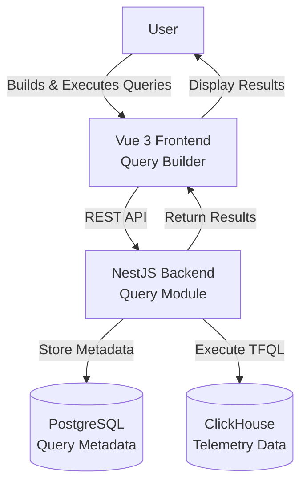
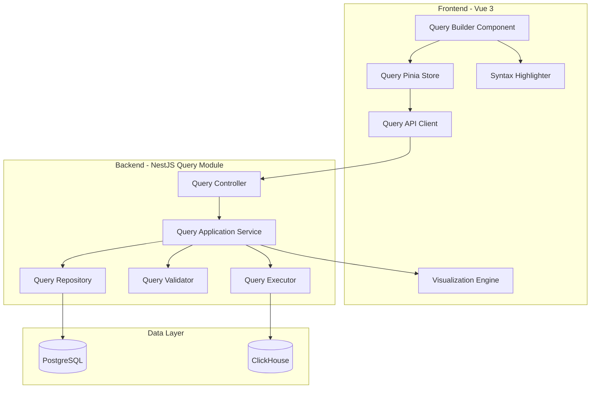
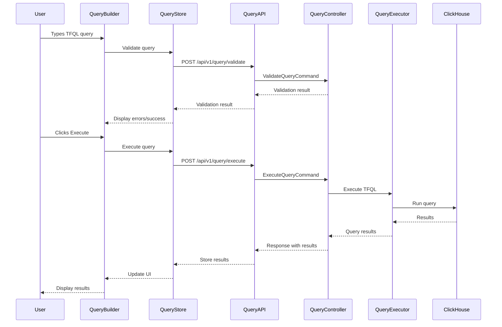

# Requirements Document: Frontend-Backend Query Integration

## Introduction

This document specifies the requirements for integrating the Vue 3 frontend with the NestJS backend for the query module in TelemetryFlow Platform. The integration enables users to build, execute, and manage TFQL (TelemetryFlow Query Language) queries against metrics, logs, and traces stored in ClickHouse, with comprehensive query management, validation, visualization, and collaboration features.

## Glossary

- **TFQL**: TelemetryFlow Query Language - a domain-specific query language for querying telemetry data
- **Query_Builder**: The frontend component that provides a visual interface for constructing TFQL queries
- **Query_Executor**: The backend service that executes TFQL queries against ClickHouse
- **Query_Store**: Pinia store managing query state in the frontend
- **Query_Module**: The NestJS backend module handling query operations
- **Query_History**: A record of previously executed queries with metadata
- **Saved_Query**: A user-saved query with name, description, and optional sharing settings
- **Query_Template**: A pre-defined query pattern with placeholders for common use cases
- **Query_Snippet**: A reusable fragment of TFQL code
- **Syntax_Highlighter**: Component providing syntax highlighting for TFQL
- **Query_Validator**: Service that validates TFQL syntax and semantics
- **Query_Result**: The data returned from executing a query
- **Visualization_Engine**: Component that renders query results as charts or tables
- **ClickHouse**: The analytics database storing metrics, logs, and traces
- **CQRS**: Command Query Responsibility Segregation pattern used in the backend
- **DDD**: Domain-Driven Design architecture pattern

## Requirements

### Requirement 1: TFQL Query Builder Interface

**User Story:** As a user, I want to build TFQL queries using a visual interface, so that I can query telemetry data without memorizing syntax.

#### Acceptance Criteria

1. WHEN a user opens the query builder, THE Query_Builder SHALL display an editor with syntax highlighting
2. WHEN a user types TFQL syntax, THE Syntax_Highlighter SHALL highlight keywords, functions, and operators in real-time
3. WHEN a user requests autocomplete, THE Query_Builder SHALL suggest valid TFQL keywords, functions, and field names
4. WHEN a user selects a data source (metrics, logs, or traces), THE Query_Builder SHALL update autocomplete suggestions to match the schema
5. THE Query_Builder SHALL provide a toolbar with common TFQL operations (SELECT, WHERE, GROUP BY, ORDER BY)
6. WHEN a user clicks a toolbar button, THE Query_Builder SHALL insert the corresponding TFQL syntax at the cursor position

### Requirement 2: Query Execution

**User Story:** As a user, I want to execute TFQL queries against telemetry data, so that I can retrieve and analyze metrics, logs, and traces.

#### Acceptance Criteria

1. WHEN a user submits a valid query, THE Query_Executor SHALL execute it against ClickHouse and return results within 30 seconds
2. WHEN a query is executing, THE Query_Store SHALL update the loading state to true
3. WHEN query execution completes, THE Query_Executor SHALL return results with metadata (row count, execution time, data source)
4. WHEN a query fails, THE Query_Executor SHALL return a descriptive error message with line and column information
5. WHEN a query exceeds 30 seconds, THE Query_Executor SHALL cancel execution and return a timeout error
6. THE Query_Executor SHALL support querying metrics, logs, and traces data sources
7. WHEN multiple queries execute concurrently, THE Query_Executor SHALL handle them independently without interference

### Requirement 3: Query Validation

**User Story:** As a user, I want real-time validation of my TFQL queries, so that I can identify and fix errors before execution.

#### Acceptance Criteria

1. WHEN a user types in the query editor, THE Query_Validator SHALL validate syntax in real-time with debouncing (300ms)
2. WHEN syntax errors exist, THE Query_Validator SHALL display error markers in the editor with line and column positions
3. WHEN a user hovers over an error marker, THE Query_Builder SHALL display a tooltip with the error description
4. WHEN a query references invalid fields, THE Query_Validator SHALL return a semantic error with suggested valid fields
5. WHEN a query is syntactically valid, THE Query_Validator SHALL return success with no error markers
6. THE Query_Validator SHALL validate against the selected data source schema (metrics, logs, or traces)

### Requirement 4: Query History Management

**User Story:** As a user, I want to view and reuse my query history, so that I can quickly access previously executed queries.

#### Acceptance Criteria

1. WHEN a user executes a query, THE Query_Module SHALL store it in query history with timestamp, execution time, and result metadata
2. WHEN a user opens query history, THE Query_Store SHALL fetch and display the most recent 100 queries
3. WHEN a user selects a historical query, THE Query_Builder SHALL load the query text into the editor
4. WHEN a user filters query history by date range, THE Query_Store SHALL display only queries within that range
5. WHEN a user searches query history by text, THE Query_Store SHALL display queries containing the search term
6. WHEN a user deletes a historical query, THE Query_Module SHALL remove it from the database
7. THE Query_Module SHALL store query history for each user separately with user_id association

### Requirement 5: Saved Queries

**User Story:** As a user, I want to save and organize my queries, so that I can reuse important queries and share them with my team.

#### Acceptance Criteria

1. WHEN a user saves a query, THE Query_Module SHALL store it with name, description, TFQL text, and user_id
2. WHEN a user provides a query name, THE Query_Module SHALL validate that the name is unique for that user
3. WHEN a user opens saved queries, THE Query_Store SHALL fetch and display all saved queries for that user
4. WHEN a user loads a saved query, THE Query_Builder SHALL populate the editor with the saved TFQL text
5. WHEN a user updates a saved query, THE Query_Module SHALL update the existing record with new content and updated_at timestamp
6. WHEN a user deletes a saved query, THE Query_Module SHALL remove it from the database
7. WHERE a user marks a query as shared, THE Query_Module SHALL make it visible to other users in the same organization
8. WHEN a user views shared queries, THE Query_Store SHALL display queries shared by other users with author information

### Requirement 6: Query Templates

**User Story:** As a user, I want to use pre-defined query templates, so that I can quickly create queries for common use cases.

#### Acceptance Criteria

1. THE Query_Module SHALL provide templates for common query patterns (top N metrics, error logs, slow traces, service health)
2. WHEN a user browses templates, THE Query_Store SHALL display templates organized by category (metrics, logs, traces)
3. WHEN a user selects a template, THE Query_Builder SHALL load the template with placeholder values highlighted
4. WHEN a user fills in template placeholders, THE Query_Builder SHALL replace placeholders with user-provided values
5. THE Query_Module SHALL support custom templates created by administrators
6. WHEN an administrator creates a template, THE Query_Module SHALL validate the template syntax and store it with metadata

### Requirement 7: Query Snippets

**User Story:** As a user, I want to use reusable query snippets, so that I can quickly insert common TFQL fragments.

#### Acceptance Criteria

1. THE Query_Builder SHALL provide built-in snippets for common TFQL patterns (time ranges, aggregations, filters)
2. WHEN a user triggers snippet insertion, THE Query_Builder SHALL display a searchable list of available snippets
3. WHEN a user selects a snippet, THE Query_Builder SHALL insert the snippet code at the cursor position
4. WHEN a snippet contains placeholders, THE Query_Builder SHALL position the cursor at the first placeholder
5. THE Query_Module SHALL support user-defined snippets stored per user
6. WHEN a user creates a snippet, THE Query_Module SHALL store it with name, description, and TFQL fragment

### Requirement 8: Query Result Visualization

**User Story:** As a user, I want to visualize query results as charts or tables, so that I can better understand the data.

#### Acceptance Criteria

1. WHEN query results are returned, THE Visualization_Engine SHALL display them in a data table by default
2. WHEN results contain time-series data, THE Visualization_Engine SHALL offer chart visualization options (line, area, bar)
3. WHEN a user selects a chart type, THE Visualization_Engine SHALL render the results using ECharts
4. WHEN results contain aggregated data, THE Visualization_Engine SHALL offer appropriate chart types (bar, pie, gauge)
5. WHEN a user exports results, THE Visualization_Engine SHALL support CSV and JSON formats
6. WHEN results exceed 10,000 rows, THE Visualization_Engine SHALL use virtual scrolling for table display
7. THE Visualization_Engine SHALL display result metadata (row count, execution time, data source) above the results

### Requirement 9: Query Performance Optimization

**User Story:** As a developer, I want queries to execute efficiently, so that users receive results quickly.

#### Acceptance Criteria

1. WHEN a query is submitted, THE Query_Executor SHALL analyze the query for optimization opportunities
2. WHEN a query lacks time range filters, THE Query_Executor SHALL apply a default time range of last 24 hours
3. WHEN a query requests excessive data, THE Query_Executor SHALL apply a result limit of 10,000 rows
4. THE Query_Executor SHALL use ClickHouse query optimization features (sampling, materialized views)
5. WHEN query execution time exceeds 10 seconds, THE Query_Module SHALL log a slow query warning with query text and execution time
6. THE Query_Executor SHALL cache frequently executed queries for 5 minutes
7. WHEN a cached query is requested, THE Query_Executor SHALL return cached results with cache metadata

### Requirement 10: Query Sharing and Collaboration

**User Story:** As a user, I want to share queries with my team, so that we can collaborate on data analysis.

#### Acceptance Criteria

1. WHEN a user shares a query, THE Query_Module SHALL generate a unique shareable link
2. WHEN a user accesses a shared query link, THE Query_Builder SHALL load the query with read-only access
3. WHEN a user with permissions modifies a shared query, THE Query_Module SHALL update the shared query for all users
4. WHERE a user sets query permissions, THE Query_Module SHALL enforce read-only or edit access based on user roles
5. WHEN a user views a shared query, THE Query_Store SHALL display the author name and last modified timestamp
6. THE Query_Module SHALL support query collections where users can group related queries
7. WHEN a user creates a collection, THE Query_Module SHALL store it with name, description, and query references

### Requirement 11: Backend Query Module Architecture

**User Story:** As a developer, I want the query module to follow DDD/CQRS patterns, so that the codebase is maintainable and scalable.

#### Acceptance Criteria

1. THE Query_Module SHALL implement DDD architecture with domain, application, infrastructure, and presentation layers
2. THE Query_Module SHALL use CQRS pattern with separate command and query handlers
3. THE Query_Module SHALL define domain aggregates for Query, SavedQuery, QueryTemplate, and QuerySnippet
4. THE Query_Module SHALL implement repository interfaces in the domain layer
5. THE Query_Module SHALL implement repository implementations using TypeORM in the infrastructure layer
6. THE Query_Module SHALL use PostgreSQL for storing saved queries, templates, snippets, and history
7. THE Query_Module SHALL use ClickHouse for executing TFQL queries against telemetry data
8. THE Query_Module SHALL emit domain events for query execution, save, and share operations

### Requirement 12: API Endpoints and Integration

**User Story:** As a frontend developer, I want well-documented REST APIs, so that I can integrate the query functionality.

#### Acceptance Criteria

1. THE Query_Module SHALL expose REST endpoints at `/api/v1/query/*`
2. THE Query_Module SHALL provide OpenAPI/Swagger documentation for all endpoints
3. WHEN a request is made to `/api/v1/query/execute`, THE Query_Module SHALL execute the query and return results
4. WHEN a request is made to `/api/v1/query/validate`, THE Query_Module SHALL validate the query and return errors or success
5. WHEN a request is made to `/api/v1/query/history`, THE Query_Module SHALL return the user's query history
6. WHEN a request is made to `/api/v1/query/saved`, THE Query_Module SHALL return the user's saved queries
7. WHEN a request is made to `/api/v1/query/templates`, THE Query_Module SHALL return available query templates
8. WHEN a request is made to `/api/v1/query/snippets`, THE Query_Module SHALL return available query snippets
9. THE Query_Module SHALL use JWT authentication for all endpoints
10. THE Query_Module SHALL validate request DTOs using class-validator decorators

### Requirement 13: Frontend Query Store

**User Story:** As a frontend developer, I want a Pinia store for query state management, so that query data is accessible across components.

#### Acceptance Criteria

1. THE Query_Store SHALL manage state for current query, query results, loading status, and errors
2. THE Query_Store SHALL provide actions for executing queries, validating queries, and fetching history
3. THE Query_Store SHALL provide getters for filtered history, saved queries by category, and result statistics
4. WHEN a query executes, THE Query_Store SHALL update loading state and clear previous errors
5. WHEN query execution completes, THE Query_Store SHALL store results and update execution metadata
6. WHEN query execution fails, THE Query_Store SHALL store the error message and clear loading state
7. THE Query_Store SHALL persist current query text to localStorage for recovery after page refresh

### Requirement 14: Error Handling and User Feedback

**User Story:** As a user, I want clear error messages and feedback, so that I can understand and resolve issues.

#### Acceptance Criteria

1. WHEN a query validation error occurs, THE Query_Builder SHALL display the error inline with line and column information
2. WHEN a query execution error occurs, THE Query_Store SHALL display a notification with the error message
3. WHEN a network error occurs, THE Query_Store SHALL display a user-friendly message and suggest retry
4. WHEN a query times out, THE Query_Store SHALL display a timeout message with suggestions to optimize the query
5. WHEN a query returns no results, THE Visualization_Engine SHALL display an empty state with helpful suggestions
6. THE Query_Module SHALL log all errors to Winston with appropriate severity levels
7. THE Query_Module SHALL include request context (user_id, query_id) in error logs

### Requirement 15: Query Syntax Highlighting and Editor Features

**User Story:** As a user, I want a rich code editor experience, so that I can write queries efficiently.

#### Acceptance Criteria

1. THE Query_Builder SHALL use Monaco Editor or CodeMirror for the query editor
2. THE Syntax_Highlighter SHALL highlight TFQL keywords (SELECT, FROM, WHERE, GROUP BY, ORDER BY, LIMIT)
3. THE Syntax_Highlighter SHALL highlight TFQL functions (COUNT, SUM, AVG, MAX, MIN, PERCENTILE)
4. THE Syntax_Highlighter SHALL highlight strings, numbers, and operators with distinct colors
5. THE Query_Builder SHALL provide keyboard shortcuts for common actions (execute: Ctrl+Enter, format: Ctrl+Shift+F)
6. THE Query_Builder SHALL support multi-cursor editing and block selection
7. THE Query_Builder SHALL provide line numbers and code folding for complex queries

### Requirement 16: Query Result Export and Sharing

**User Story:** As a user, I want to export and share query results, so that I can use them in reports and presentations.

#### Acceptance Criteria

1. WHEN a user exports results as CSV, THE Visualization_Engine SHALL generate a CSV file with proper escaping
2. WHEN a user exports results as JSON, THE Visualization_Engine SHALL generate a formatted JSON file
3. WHEN a user copies results to clipboard, THE Visualization_Engine SHALL copy in tab-separated format
4. WHEN a user shares results via link, THE Query_Module SHALL generate a shareable link with embedded results
5. WHEN a user accesses a result link, THE Query_Builder SHALL display the results in read-only mode
6. THE Query_Module SHALL expire result links after 7 days for security
7. WHEN results contain sensitive data, THE Query_Module SHALL require authentication to access shared links

### Requirement 17: Query Parameterization

**User Story:** As a user, I want to create parameterized queries, so that I can reuse queries with different values.

#### Acceptance Criteria

1. WHEN a query contains parameter placeholders (e.g., `{{service_name}}`), THE Query_Builder SHALL detect and highlight them
2. WHEN a user executes a parameterized query, THE Query_Builder SHALL prompt for parameter values
3. WHEN a user provides parameter values, THE Query_Executor SHALL substitute them before execution
4. THE Query_Module SHALL validate parameter types (string, number, date) before substitution
5. WHEN a user saves a parameterized query, THE Query_Module SHALL store parameter definitions with the query
6. WHEN a user loads a parameterized query, THE Query_Builder SHALL display parameter inputs with default values
7. THE Query_Executor SHALL sanitize parameter values to prevent injection attacks

### Requirement 18: Query Scheduling and Alerts

**User Story:** As a user, I want to schedule queries to run automatically, so that I can monitor telemetry data continuously.

#### Acceptance Criteria

1. WHEN a user schedules a query, THE Query_Module SHALL store the schedule with cron expression and query reference
2. WHEN a scheduled query executes, THE Query_Module SHALL run the query and store results
3. WHEN scheduled query results meet alert conditions, THE Query_Module SHALL trigger alert notifications
4. THE Query_Module SHALL support schedule frequencies (every minute, hourly, daily, weekly, custom cron)
5. WHEN a scheduled query fails, THE Query_Module SHALL log the error and notify the user
6. WHEN a user views scheduled queries, THE Query_Store SHALL display next execution time and last result status
7. THE Query_Module SHALL limit scheduled queries to 10 per user to prevent resource exhaustion

## Architecture Diagrams

### System Context Diagram

### Component Architecture

### Data Flow Diagram

