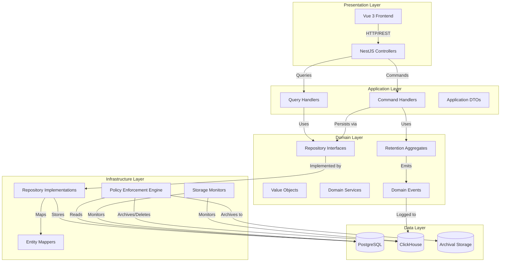
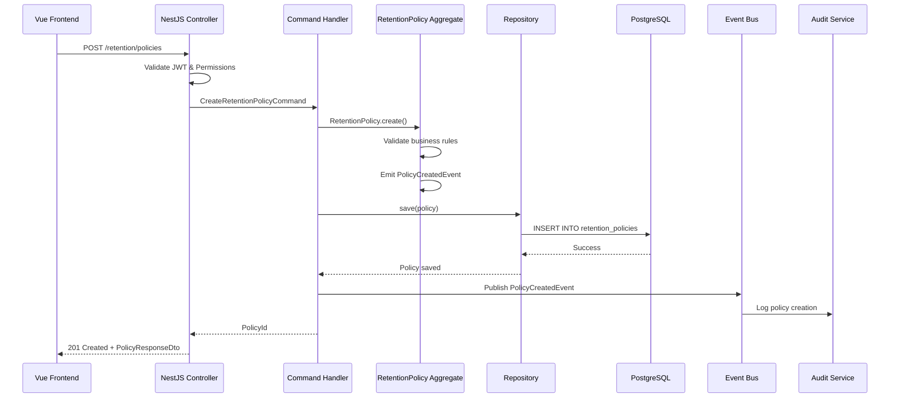
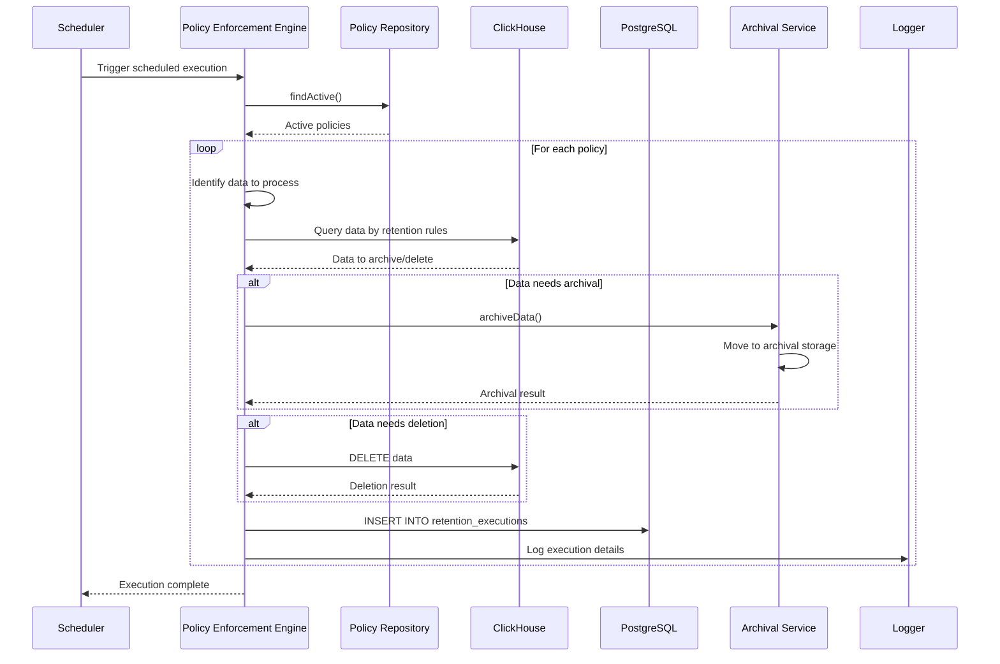
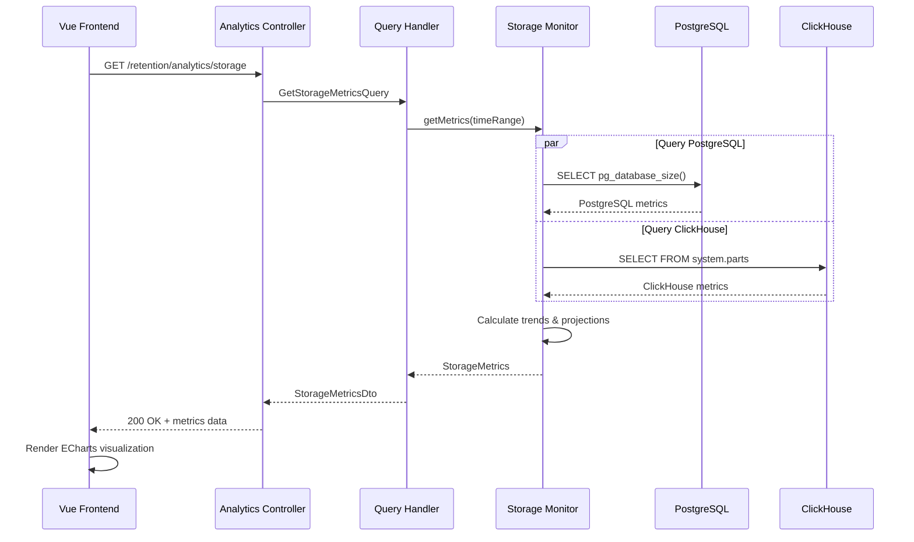

# Design Document: Frontend-Backend Retention Integration

## Overview

The retention integration feature provides comprehensive data lifecycle management for TelemetryFlow Platform's telemetry data. The system enables administrators to define, enforce, and monitor retention policies across PostgreSQL (IAM data) and ClickHouse (telemetry data) databases.

### Key Design Goals

1. **Automated Lifecycle Management**: Automatically archive and delete data based on configurable policies
2. **Compliance Tracking**: Monitor and report on retention policy adherence for regulatory compliance
3. **Performance Optimization**: Execute retention operations without impacting primary telemetry collection
4. **Storage Cost Control**: Reduce storage costs through intelligent archival and deletion
5. **Seamless Integration**: Leverage existing platform infrastructure (DDD/CQRS, IAM, logging, caching)

### Technology Stack

**Frontend:**

- Vue 3.5+ with Composition API and `<script setup>` syntax
- TypeScript 5.7 with strict configuration
- Pinia 3.0+ for state management
- Naive UI 2.43+ for component library
- ECharts 5.6+ for data visualization
- Axios 1.13+ for HTTP client

**Backend:**

- NestJS 11.x with DDD/CQRS architecture
- TypeScript 5.9 with strict configuration
- TypeORM 0.3 for PostgreSQL operations
- ClickHouse client for analytics database
- Winston for structured logging
- @nestjs/cqrs for command/query separation

**Databases:**

- PostgreSQL 16 for retention policies, rules, and execution state
- ClickHouse for retention execution logs and analytics

## Architecture

The retention module follows the platform's established DDD/CQRS architecture with four distinct layers:



### Layer Responsibilities

**Presentation Layer:**

- Vue 3 components for policy management UI
- NestJS controllers exposing REST APIs
- Request/response DTO validation
- Authentication and authorization guards

**Application Layer:**

- Command handlers for write operations (create, update, delete policies)
- Query handlers for read operations (list policies, get analytics)
- Application DTOs for data transfer
- Orchestration of domain operations

**Domain Layer:**

- RetentionPolicy aggregate (business logic for policies)
- RetentionRule entity (rule configuration)
- Value objects (PolicyId, RuleId, RetentionPeriod, etc.)
- Domain events (PolicyCreated, PolicyExecuted, DataArchived, etc.)
- Repository interfaces (no implementation details)

**Infrastructure Layer:**

- TypeORM repository implementations
- Policy enforcement engine (scheduled execution)
- Storage monitoring service
- Entity mappers (domain ↔ database)
- External storage integrations

## Components and Interfaces

### Frontend Components

#### 1. Retention Policy Management Components

**RetentionPolicyList.vue**

- Displays all retention policies in a Naive UI DataTable
- Supports sorting, filtering, and pagination
- Actions: Create, Edit, Delete, Activate/Deactivate policies
- Uses `useRetentionStore` for state management

**RetentionPolicyForm.vue**

- Form for creating/editing retention policies
- Fields: name, description, data types, retention period, archival period, status
- Validation using class-validator patterns
- Emits events for save/cancel actions

**RetentionRuleEditor.vue**

- Component for managing retention rules within a policy
- Supports adding, editing, and removing rules
- Rule configuration: data type filters, service filters, environment filters, custom labels
- Visual feedback for rule conflicts

#### 2. Retention Analytics Components

**RetentionDashboard.vue**

- Overview dashboard with key metrics
- Components: storage usage gauge, compliance status, recent executions
- Uses ECharts for visualizations

**StorageUsageChart.vue**

- Time series chart showing storage trends
- Separate series for PostgreSQL and ClickHouse
- Interactive zoom and data point selection
- Uses `vue-echarts` wrapper

**ComplianceStatusChart.vue**

- Gauge chart showing overall compliance percentage
- Color-coded status indicators (green: compliant, yellow: at-risk, red: non-compliant)
- Drill-down to policy-level compliance

**RetentionExecutionLog.vue**

- DataTable showing recent policy executions
- Columns: policy name, execution time, status, data volume, duration
- Filtering by status and date range

#### 3. Composables

**useRetentionStore.ts**

```typescript
// Pinia store for retention state management
export const useRetentionStore = defineStore("retention", () => {
  const policies = ref<RetentionPolicy[]>([]);
  const loading = ref(false);
  const error = ref<string | null>(null);

  const fetchPolicies = async () => {
    /* ... */
  };
  const createPolicy = async (policy: CreatePolicyRequest) => {
    /* ... */
  };
  const updatePolicy = async (id: string, updates: UpdatePolicyRequest) => {
    /* ... */
  };
  const deletePolicy = async (id: string) => {
    /* ... */
  };

  return {
    policies,
    loading,
    error,
    fetchPolicies,
    createPolicy,
    updatePolicy,
    deletePolicy,
  };
});
```

**useRetentionAnalytics.ts**

```typescript
// Composable for retention analytics data
export function useRetentionAnalytics() {
  const storageMetrics = ref<StorageMetrics | null>(null);
  const complianceStatus = ref<ComplianceStatus | null>(null);

  const fetchStorageMetrics = async (timeRange: TimeRange) => {
    /* ... */
  };
  const fetchComplianceStatus = async () => {
    /* ... */
  };

  return {
    storageMetrics,
    complianceStatus,
    fetchStorageMetrics,
    fetchComplianceStatus,
  };
}
```

### Backend Components

#### 1. Domain Layer

**RetentionPolicy Aggregate**

```typescript
export class RetentionPolicy extends AggregateRoot {
  private constructor(
    private readonly id: PolicyId,
    private name: string,
    private description: string,
    private rules: RetentionRule[],
    private status: PolicyStatus,
    private createdAt: Date,
    private updatedAt: Date,
  ) {
    super();
  }

  static create(props: CreatePolicyProps): RetentionPolicy {
    /* ... */
  }

  addRule(rule: RetentionRule): void {
    /* ... */
  }
  removeRule(ruleId: RuleId): void {
    /* ... */
  }
  activate(): void {
    /* ... */
  }
  deactivate(): void {
    /* ... */
  }

  // Domain events emitted
  // - PolicyCreatedEvent
  // - PolicyUpdatedEvent
  // - PolicyActivatedEvent
  // - PolicyDeactivatedEvent
}
```

**RetentionRule Entity**

```typescript
export class RetentionRule extends Entity {
  constructor(
    private readonly id: RuleId,
    private readonly dataType: DataType,
    private readonly retentionPeriod: RetentionPeriod,
    private readonly archivalPeriod: ArchivalPeriod,
    private readonly filters: RuleFilters,
  ) {
    super(id);
  }

  matches(data: TelemetryData): boolean {
    /* ... */
  }
  isValid(): boolean {
    /* ... */
  }
}
```

**Value Objects**

- `PolicyId`: Unique identifier for policies
- `RuleId`: Unique identifier for rules
- `RetentionPeriod`: Duration in days for active storage
- `ArchivalPeriod`: Duration in days for archival storage
- `PolicyStatus`: Enum (DRAFT, ACTIVE, INACTIVE)
- `DataType`: Enum (METRICS, LOGS, TRACES, AUDIT_LOGS)
- `ComplianceStatus`: Enum (COMPLIANT, AT_RISK, NON_COMPLIANT)

**Repository Interfaces**

```typescript
export interface IRetentionPolicyRepository {
  save(policy: RetentionPolicy): Promise<void>;
  findById(id: PolicyId): Promise<RetentionPolicy | null>;
  findAll(): Promise<RetentionPolicy[]>;
  findActive(): Promise<RetentionPolicy[]>;
  delete(id: PolicyId): Promise<void>;
}

export interface IRetentionExecutionRepository {
  saveExecution(execution: RetentionExecution): Promise<void>;
  findByPolicyId(policyId: PolicyId): Promise<RetentionExecution[]>;
  findRecent(limit: number): Promise<RetentionExecution[]>;
}
```

#### 2. Application Layer

**Commands**

- `CreateRetentionPolicyCommand`: Create a new retention policy
- `UpdateRetentionPolicyCommand`: Update an existing policy
- `DeleteRetentionPolicyCommand`: Soft delete a policy
- `ActivateRetentionPolicyCommand`: Activate a policy for enforcement
- `DeactivateRetentionPolicyCommand`: Deactivate a policy
- `ExecuteRetentionPolicyCommand`: Manually trigger policy execution
- `AddRetentionRuleCommand`: Add a rule to a policy
- `RemoveRetentionRuleCommand`: Remove a rule from a policy

**Queries**

- `GetRetentionPolicyQuery`: Get a single policy by ID
- `ListRetentionPoliciesQuery`: List all policies with filtering
- `GetStorageMetricsQuery`: Get storage usage metrics
- `GetComplianceStatusQuery`: Get compliance status across policies
- `GetRetentionExecutionLogsQuery`: Get execution history
- `GetRetentionAnalyticsQuery`: Get analytics data for reporting

**Command Handlers**

```typescript
@CommandHandler(CreateRetentionPolicyCommand)
export class CreateRetentionPolicyHandler implements ICommandHandler<CreateRetentionPolicyCommand> {
  constructor(
    private readonly policyRepository: IRetentionPolicyRepository,
    private readonly eventBus: EventBus,
  ) {}

  async execute(command: CreateRetentionPolicyCommand): Promise<PolicyId> {
    // 1. Create domain aggregate
    const policy = RetentionPolicy.create({
      name: command.name,
      description: command.description,
      rules: command.rules.map((r) => RetentionRule.create(r)),
      status: PolicyStatus.DRAFT,
    });

    // 2. Persist to repository
    await this.policyRepository.save(policy);

    // 3. Publish domain events
    policy
      .getUncommittedEvents()
      .forEach((event) => this.eventBus.publish(event));

    return policy.id;
  }
}
```

**Query Handlers**

```typescript
@QueryHandler(GetStorageMetricsQuery)
export class GetStorageMetricsHandler implements IQueryHandler<GetStorageMetricsQuery> {
  constructor(private readonly storageMonitor: StorageMonitorService) {}

  async execute(query: GetStorageMetricsQuery): Promise<StorageMetricsDto> {
    const metrics = await this.storageMonitor.getMetrics(query.timeRange);
    return StorageMetricsDto.fromDomain(metrics);
  }
}
```

#### 3. Infrastructure Layer

**PolicyEnforcementEngine**

```typescript
@Injectable()
export class PolicyEnforcementEngine {
  constructor(
    private readonly policyRepository: IRetentionPolicyRepository,
    private readonly clickhouseService: ClickHouseService,
    private readonly postgresService: PostgresService,
    private readonly archivalService: ArchivalService,
    private readonly logger: LoggerService,
  ) {}

  @Cron("0 2 * * *") // Run daily at 2 AM
  async executeScheduledPolicies(): Promise<void> {
    const activePolicies = await this.policyRepository.findActive();

    for (const policy of activePolicies) {
      await this.executePolicy(policy);
    }
  }

  async executePolicy(policy: RetentionPolicy): Promise<ExecutionResult> {
    // 1. Identify data to archive/delete based on rules
    // 2. Execute archival operations
    // 3. Execute deletion operations
    // 4. Log execution results
    // 5. Emit domain events
  }
}
```

**StorageMonitorService**

```typescript
@Injectable()
export class StorageMonitorService {
  constructor(
    private readonly clickhouseService: ClickHouseService,
    private readonly postgresService: PostgresService,
  ) {}

  async getMetrics(timeRange: TimeRange): Promise<StorageMetrics> {
    const pgMetrics = await this.getPostgresMetrics();
    const chMetrics = await this.getClickHouseMetrics();

    return {
      postgresql: pgMetrics,
      clickhouse: chMetrics,
      total: pgMetrics.size + chMetrics.size,
      trend: this.calculateTrend(timeRange),
    };
  }

  private async getPostgresMetrics(): Promise<DatabaseMetrics> {
    // Query pg_database_size and related system tables
  }

  private async getClickHouseMetrics(): Promise<DatabaseMetrics> {
    // Query system.parts and system.tables
  }
}
```

**ArchivalService**

```typescript
@Injectable()
export class ArchivalService {
  async archiveClickHouseData(
    tableName: string,
    filter: ArchivalFilter,
  ): Promise<ArchivalResult> {
    // 1. Create archival table if not exists
    // 2. Move data using INSERT INTO ... SELECT
    // 3. Verify data integrity
    // 4. Delete from source table
    // 5. Return archival statistics
  }

  async archivePostgresData(
    tableName: string,
    filter: ArchivalFilter,
  ): Promise<ArchivalResult> {
    // 1. Export data to archival storage (S3, file system, etc.)
    // 2. Mark records as archived
    // 3. Return archival statistics
  }
}
```

#### 4. Presentation Layer

**RetentionController**

```typescript
@Controller("retention/policies")
@ApiTags("Retention")
@UseGuards(JwtAuthGuard, PermissionsGuard)
export class RetentionPolicyController {
  constructor(
    private readonly commandBus: CommandBus,
    private readonly queryBus: QueryBus,
  ) {}

  @Post()
  @RequirePermissions("retention:manage")
  @ApiOperation({ summary: "Create a retention policy" })
  @ApiResponse({ status: 201, type: PolicyResponseDto })
  async createPolicy(
    @Body() dto: CreatePolicyRequestDto,
  ): Promise<PolicyResponseDto> {
    const command = new CreateRetentionPolicyCommand(dto);
    const policyId = await this.commandBus.execute(command);

    const query = new GetRetentionPolicyQuery(policyId);
    return await this.queryBus.execute(query);
  }

  @Get()
  @RequirePermissions("retention:view")
  @ApiOperation({ summary: "List all retention policies" })
  @ApiResponse({ status: 200, type: [PolicyResponseDto] })
  async listPolicies(
    @Query() filters: PolicyFiltersDto,
  ): Promise<PolicyResponseDto[]> {
    const query = new ListRetentionPoliciesQuery(filters);
    return await this.queryBus.execute(query);
  }

  @Patch(":id/activate")
  @RequirePermissions("retention:manage")
  @ApiOperation({ summary: "Activate a retention policy" })
  async activatePolicy(@Param("id") id: string): Promise<void> {
    const command = new ActivateRetentionPolicyCommand(id);
    await this.commandBus.execute(command);
  }

  @Post(":id/execute")
  @RequirePermissions("retention:execute")
  @ApiOperation({ summary: "Manually execute a retention policy" })
  async executePolicy(@Param("id") id: string): Promise<ExecutionResultDto> {
    const command = new ExecuteRetentionPolicyCommand(id);
    return await this.commandBus.execute(command);
  }
}

@Controller("retention/analytics")
@ApiTags("Retention")
@UseGuards(JwtAuthGuard, PermissionsGuard)
export class RetentionAnalyticsController {
  constructor(private readonly queryBus: QueryBus) {}

  @Get("storage")
  @RequirePermissions("retention:view")
  @ApiOperation({ summary: "Get storage usage metrics" })
  async getStorageMetrics(
    @Query() timeRange: TimeRangeDto,
  ): Promise<StorageMetricsDto> {
    const query = new GetStorageMetricsQuery(timeRange);
    return await this.queryBus.execute(query);
  }

  @Get("compliance")
  @RequirePermissions("retention:view")
  @ApiOperation({ summary: "Get compliance status" })
  async getComplianceStatus(): Promise<ComplianceStatusDto> {
    const query = new GetComplianceStatusQuery();
    return await this.queryBus.execute(query);
  }
}
```

### API Endpoints

| Method | Endpoint                                | Description             | Permission        |
| ------ | --------------------------------------- | ----------------------- | ----------------- |
| POST   | `/retention/policies`                   | Create retention policy | retention:manage  |
| GET    | `/retention/policies`                   | List all policies       | retention:view    |
| GET    | `/retention/policies/:id`               | Get policy by ID        | retention:view    |
| PATCH  | `/retention/policies/:id`               | Update policy           | retention:manage  |
| DELETE | `/retention/policies/:id`               | Delete policy           | retention:manage  |
| PATCH  | `/retention/policies/:id/activate`      | Activate policy         | retention:manage  |
| PATCH  | `/retention/policies/:id/deactivate`    | Deactivate policy       | retention:manage  |
| POST   | `/retention/policies/:id/execute`       | Execute policy manually | retention:execute |
| POST   | `/retention/policies/:id/rules`         | Add rule to policy      | retention:manage  |
| DELETE | `/retention/policies/:id/rules/:ruleId` | Remove rule from policy | retention:manage  |
| GET    | `/retention/analytics/storage`          | Get storage metrics     | retention:view    |
| GET    | `/retention/analytics/compliance`       | Get compliance status   | retention:view    |
| GET    | `/retention/analytics/executions`       | Get execution logs      | retention:view    |
| GET    | `/retention/analytics/reports`          | Get retention reports   | retention:view    |

## Data Models

### Domain Models

#### RetentionPolicy Aggregate

```typescript
class RetentionPolicy extends AggregateRoot {
  id: PolicyId; // Unique identifier
  name: string; // Policy name (e.g., "Metrics 90-day retention")
  description: string; // Policy description
  rules: RetentionRule[]; // Collection of retention rules
  status: PolicyStatus; // DRAFT | ACTIVE | INACTIVE
  createdAt: Date; // Creation timestamp
  updatedAt: Date; // Last update timestamp
  createdBy: UserId; // User who created the policy
  version: number; // Version for optimistic locking
}
```

#### RetentionRule Entity

```typescript
class RetentionRule extends Entity {
  id: RuleId; // Unique identifier
  dataType: DataType; // METRICS | LOGS | TRACES | AUDIT_LOGS
  retentionPeriod: RetentionPeriod; // Days to keep in active storage
  archivalPeriod: ArchivalPeriod; // Days to keep in archival storage
  filters: RuleFilters; // Filtering criteria
}

class RuleFilters {
  serviceNames?: string[]; // Filter by service names
  environments?: string[]; // Filter by environments (prod, staging, dev)
  customLabels?: Record<string, string>; // Custom label filters
}
```

#### RetentionExecution Entity

```typescript
class RetentionExecution extends Entity {
  id: ExecutionId; // Unique identifier
  policyId: PolicyId; // Associated policy
  startTime: Date; // Execution start time
  endTime: Date; // Execution end time
  status: ExecutionStatus; // RUNNING | COMPLETED | FAILED | PARTIAL
  dataProcessed: DataVolume; // Volume of data processed
  dataArchived: DataVolume; // Volume of data archived
  dataDeleted: DataVolume; // Volume of data deleted
  errors: ExecutionError[]; // Any errors encountered
}

class DataVolume {
  recordCount: number; // Number of records
  sizeBytes: number; // Size in bytes
}

class ExecutionError {
  timestamp: Date; // When error occurred
  operation: string; // Operation that failed
  message: string; // Error message
  stackTrace?: string; // Stack trace if available
}
```

### Database Schema

#### PostgreSQL Tables

**retention_policies**

```sql
CREATE TABLE retention_policies (
  id UUID PRIMARY KEY DEFAULT gen_random_uuid(),
  name VARCHAR(255) NOT NULL,
  description TEXT,
  status VARCHAR(20) NOT NULL CHECK (status IN ('DRAFT', 'ACTIVE', 'INACTIVE')),
  created_at TIMESTAMP NOT NULL DEFAULT NOW(),
  updated_at TIMESTAMP NOT NULL DEFAULT NOW(),
  created_by UUID NOT NULL REFERENCES users(id),
  deleted_at TIMESTAMP NULL,
  version INTEGER NOT NULL DEFAULT 1,
  CONSTRAINT unique_policy_name UNIQUE (name) WHERE deleted_at IS NULL
);

CREATE INDEX idx_retention_policies_status ON retention_policies(status) WHERE deleted_at IS NULL;
CREATE INDEX idx_retention_policies_created_by ON retention_policies(created_by);
```

**retention_rules**

```sql
CREATE TABLE retention_rules (
  id UUID PRIMARY KEY DEFAULT gen_random_uuid(),
  policy_id UUID NOT NULL REFERENCES retention_policies(id) ON DELETE CASCADE,
  data_type VARCHAR(50) NOT NULL CHECK (data_type IN ('METRICS', 'LOGS', 'TRACES', 'AUDIT_LOGS')),
  retention_period_days INTEGER NOT NULL CHECK (retention_period_days > 0),
  archival_period_days INTEGER NOT NULL CHECK (archival_period_days >= 0),
  filters JSONB NOT NULL DEFAULT '{}',
  created_at TIMESTAMP NOT NULL DEFAULT NOW(),
  updated_at TIMESTAMP NOT NULL DEFAULT NOW(),
  CONSTRAINT valid_archival_period CHECK (archival_period_days <= retention_period_days)
);

CREATE INDEX idx_retention_rules_policy_id ON retention_rules(policy_id);
CREATE INDEX idx_retention_rules_data_type ON retention_rules(data_type);
CREATE INDEX idx_retention_rules_filters ON retention_rules USING GIN (filters);
```

**retention_executions**

```sql
CREATE TABLE retention_executions (
  id UUID PRIMARY KEY DEFAULT gen_random_uuid(),
  policy_id UUID NOT NULL REFERENCES retention_policies(id),
  start_time TIMESTAMP NOT NULL,
  end_time TIMESTAMP NULL,
  status VARCHAR(20) NOT NULL CHECK (status IN ('RUNNING', 'COMPLETED', 'FAILED', 'PARTIAL')),
  records_processed BIGINT NOT NULL DEFAULT 0,
  records_archived BIGINT NOT NULL DEFAULT 0,
  records_deleted BIGINT NOT NULL DEFAULT 0,
  bytes_processed BIGINT NOT NULL DEFAULT 0,
  bytes_archived BIGINT NOT NULL DEFAULT 0,
  bytes_deleted BIGINT NOT NULL DEFAULT 0,
  error_count INTEGER NOT NULL DEFAULT 0,
  errors JSONB NULL,
  created_at TIMESTAMP NOT NULL DEFAULT NOW()
);

CREATE INDEX idx_retention_executions_policy_id ON retention_executions(policy_id);
CREATE INDEX idx_retention_executions_start_time ON retention_executions(start_time DESC);
CREATE INDEX idx_retention_executions_status ON retention_executions(status);
```

#### ClickHouse Tables

**retention_execution_logs**

```sql
CREATE TABLE retention_execution_logs (
  execution_id UUID,
  policy_id UUID,
  timestamp DateTime64(3),
  operation String,
  data_type String,
  table_name String,
  records_affected UInt64,
  bytes_affected UInt64,
  duration_ms UInt32,
  status String,
  error_message String,
  metadata String
) ENGINE = MergeTree()
PARTITION BY toYYYYMM(timestamp)
ORDER BY (timestamp, policy_id, execution_id)
TTL timestamp + INTERVAL 90 DAY;
```

**storage_metrics**

```sql
CREATE TABLE storage_metrics (
  timestamp DateTime64(3),
  database String,
  table_name String,
  data_type String,
  total_rows UInt64,
  total_bytes UInt64,
  compressed_bytes UInt64,
  partition_count UInt32,
  oldest_record_date Date,
  newest_record_date Date
) ENGINE = MergeTree()
PARTITION BY toYYYYMM(timestamp)
ORDER BY (timestamp, database, table_name)
TTL timestamp + INTERVAL 365 DAY;
```

### Data Flow Diagrams

#### Policy Creation Flow



#### Policy Execution Flow



#### Storage Monitoring Flow



### Frontend State Management

#### Pinia Store Structure

```typescript
// store/retention.ts
export const useRetentionStore = defineStore("retention", () => {
  // State
  const policies = ref<RetentionPolicy[]>([]);
  const selectedPolicy = ref<RetentionPolicy | null>(null);
  const loading = ref(false);
  const error = ref<string | null>(null);

  // Getters
  const activePolicies = computed(() =>
    policies.value.filter((p) => p.status === "ACTIVE"),
  );

  const policiesByDataType = computed(() =>
    policies.value.reduce(
      (acc, policy) => {
        policy.rules.forEach((rule) => {
          if (!acc[rule.dataType]) acc[rule.dataType] = [];
          acc[rule.dataType].push(policy);
        });
        return acc;
      },
      {} as Record<string, RetentionPolicy[]>,
    ),
  );

  // Actions
  const fetchPolicies = async () => {
    loading.value = true;
    error.value = null;
    try {
      const response = await retentionApi.listPolicies();
      policies.value = response.data;
    } catch (e) {
      error.value = e instanceof Error ? e.message : "Failed to fetch policies";
      throw e;
    } finally {
      loading.value = false;
    }
  };

  const createPolicy = async (dto: CreatePolicyRequest) => {
    const response = await retentionApi.createPolicy(dto);
    policies.value.push(response.data);
    return response.data;
  };

  const updatePolicy = async (id: string, dto: UpdatePolicyRequest) => {
    const response = await retentionApi.updatePolicy(id, dto);
    const index = policies.value.findIndex((p) => p.id === id);
    if (index !== -1) {
      policies.value[index] = response.data;
    }
    return response.data;
  };

  const deletePolicy = async (id: string) => {
    await retentionApi.deletePolicy(id);
    policies.value = policies.value.filter((p) => p.id !== id);
  };

  return {
    policies,
    selectedPolicy,
    loading,
    error,
    activePolicies,
    policiesByDataType,
    fetchPolicies,
    createPolicy,
    updatePolicy,
    deletePolicy,
  };
});
```

## Correctness Properties

A property is a characteristic or behavior that should hold true across all valid executions of a system—essentially, a formal statement about what the system should do. Properties serve as the bridge between human-readable specifications and machine-verifiable correctness guarantees.

### Policy Management Properties

**Property 1: Policy creation stores all required fields**
_For any_ valid retention policy configuration, when the policy is created, the stored policy should contain all required fields (name, description, data types, retention period, archival period, status) with correct values.
**Validates: Requirements 1.1, 1.2**

**Property 2: Policy updates increment version**
_For any_ existing retention policy, when the policy is updated, the version number should increment by exactly 1 and the changes should be persisted.
**Validates: Requirements 1.3**

**Property 3: Policy deletion is soft delete**
_For any_ retention policy, when the policy is deleted, it should be marked with a deleted_at timestamp but remain queryable for audit purposes.
**Validates: Requirements 1.4**

**Property 4: Policy listing returns all non-deleted policies**
_For any_ set of retention policies in the system, listing policies should return all policies where deleted_at is null, with their current status and associated data types.
**Validates: Requirements 1.5**

**Property 5: Policy activation schedules enforcement**
_For any_ retention policy in DRAFT or INACTIVE status, when the policy is activated, its status should change to ACTIVE and it should be scheduled for enforcement.
**Validates: Requirements 1.6**

**Property 6: Policy deactivation cancels enforcement**
_For any_ ACTIVE retention policy, when the policy is deactivated, its status should change to INACTIVE and scheduled enforcement tasks should be cancelled.
**Validates: Requirements 1.7**

### Rule Configuration Properties

**Property 7: Rule validation rejects invalid configurations**
_For any_ retention rule configuration, if the rule contains invalid data (negative retention period, archival period > retention period, invalid data type), the system should reject the rule with a validation error.
**Validates: Requirements 2.1, 2.4, 2.5**

**Property 8: Rules support multiple filter types**
_For any_ retention rule, the rule should support filtering by data type, service name, environment, and custom labels, and these filters should be stored correctly.
**Validates: Requirements 2.2**

**Property 9: Longest retention period wins**
_For any_ data item that matches multiple retention rules, the system should apply the rule with the longest retention period.
**Validates: Requirements 2.3**

**Property 10: Rule removal updates policy**
_For any_ retention policy with multiple rules, when a rule is removed, the policy should be updated and the removed rule should no longer be applied to data.
**Validates: Requirements 2.6**

### Archival Properties

**Property 11: Data identification for archival**
_For any_ data item, if the data's age exceeds the retention period defined by applicable rules, the system should identify and mark it for archival.
**Validates: Requirements 3.1**

**Property 12: ClickHouse archival moves data**
_For any_ data marked for archival in ClickHouse, the archival process should move the data to archival tables or external storage and remove it from active tables.
**Validates: Requirements 3.2**

**Property 13: PostgreSQL archival marks records**
_For any_ data marked for archival in PostgreSQL, the archival process should export the data and mark records with an archived flag.
**Validates: Requirements 3.3**

**Property 14: Archival logging completeness**
_For any_ archival operation, when the operation completes (success or failure), the system should log the operation with data volume, duration, and status.
**Validates: Requirements 3.4**

**Property 15: Archival retry with exponential backoff**
_For any_ archival operation that fails, the system should retry with exponential backoff, and after 3 consecutive failures, alert administrators.
**Validates: Requirements 3.5**

**Property 16: Archived data retrieval**
_For any_ archived data item, when requested by an authorized user, the system should retrieve it from archival storage.
**Validates: Requirements 3.6**

### Deletion Properties

**Property 17: Data identification for deletion**
_For any_ archived data item, if the data's age exceeds the archival period, the system should identify and mark it for permanent deletion.
**Validates: Requirements 4.1**

**Property 18: ClickHouse deletion strategy selection**
_For any_ data marked for deletion in ClickHouse, the system should use DELETE for small volumes and DROP PARTITION for large volumes.
**Validates: Requirements 4.2**

**Property 19: PostgreSQL batch deletion**
_For any_ data marked for deletion in PostgreSQL, the system should perform deletions in batches with proper transaction management.
**Validates: Requirements 4.3**

**Property 20: Deletion logging completeness**
_For any_ deletion operation, when the operation completes, the system should log the operation with data volume, duration, and status.
**Validates: Requirements 4.4**

**Property 21: Deletion retry with exponential backoff**
_For any_ deletion operation that fails, the system should retry with exponential backoff, and after 3 consecutive failures, alert administrators.
**Validates: Requirements 4.5**

**Property 22: Deletion permanence**
_For any_ data item that has been deleted, subsequent attempts to retrieve the data should fail, confirming permanent deletion.
**Validates: Requirements 4.6**

### Compliance Properties

**Property 23: Non-compliant data flagging**
_For any_ data item that exceeds its retention period without being archived, the compliance tracker should flag it as non-compliant.
**Validates: Requirements 5.2**

**Property 24: At-risk data flagging**
_For any_ data item within 7 days of its retention period, the compliance tracker should flag it as at-risk.
**Validates: Requirements 5.3**

**Property 25: Compliance report completeness**
_For any_ compliance report generated, the report should include policy name, data type, compliant volume, non-compliant volume, and at-risk volume.
**Validates: Requirements 5.4**

**Property 26: Compliance status change events**
_For any_ data item whose compliance status changes (compliant → at-risk → non-compliant), the system should emit a domain event.
**Validates: Requirements 5.5**

**Property 27: Compliance percentage calculation**
_For any_ set of active retention policies, the overall compliance percentage should equal (compliant volume / total volume) × 100.
**Validates: Requirements 5.6**

### Storage Monitoring Properties

**Property 28: Separate database storage tracking**
_For any_ storage metrics query, the system should return separate usage metrics for PostgreSQL and ClickHouse.
**Validates: Requirements 6.1**

**Property 29: Storage metrics completeness**
_For any_ storage metrics query, the response should include current usage, growth rate, and projected usage.
**Validates: Requirements 6.2**

**Property 30: Storage threshold alerting**
_For any_ database, when storage usage exceeds the defined threshold, the system should trigger an alert to administrators.
**Validates: Requirements 6.3**

**Property 31: Storage tracking by data type**
_For any_ storage metrics query, the system should return usage broken down by data type (metrics, logs, traces, audit logs).
**Validates: Requirements 6.4**

**Property 32: Storage trend historical data**
_For any_ storage trend query with a time period, the system should return historical usage data for that period.
**Validates: Requirements 6.5**

**Property 33: Storage savings calculation**
_For any_ archival or deletion operation, the system should calculate and track the storage savings (bytes freed).
**Validates: Requirements 6.6**

### Policy Enforcement Properties

**Property 34: Batch processing for policy execution**
_For any_ policy execution, the system should process data in batches of at most 10,000 records to avoid performance impact.
**Validates: Requirements 7.2, 13.1**

**Property 35: Execution start logging**
_For any_ policy execution that starts, the system should log the start time, policy ID, and estimated data volume.
**Validates: Requirements 7.3**

**Property 36: Execution completion logging**
_For any_ policy execution that completes, the system should log the completion time, processed volume, and any errors.
**Validates: Requirements 7.4**

**Property 37: Execution retry and alerting**
_For any_ policy execution that fails, the system should retry the execution, and after 3 consecutive failures, alert administrators.
**Validates: Requirements 7.5**

**Property 38: Manual policy execution**
_For any_ retention policy, an authorized user should be able to trigger manual execution, and the execution should process data according to the policy rules.
**Validates: Requirements 7.6**

**Property 39: Sequential policy execution**
_For any_ set of policies scheduled for execution, the system should execute them sequentially (one at a time) to avoid resource contention.
**Validates: Requirements 7.7**

### Analytics Properties

**Property 40: Analytics volume trends**
_For any_ analytics query, the system should return data volume trends over time, broken down by data type.
**Validates: Requirements 8.1**

**Property 41: Retention report completeness**
_For any_ retention report generated, the report should include total data volume, archived volume, deleted volume, and active volume.
**Validates: Requirements 8.2**

**Property 42: Average retention duration calculation**
_For any_ data type, the system should calculate the average retention duration as the mean age of all data items of that type.
**Validates: Requirements 8.3**

**Property 43: Policy effectiveness metrics**
_For any_ retention policy, the effectiveness metrics should include storage savings and compliance rate for that policy.
**Validates: Requirements 8.4**

**Property 44: Report export formats**
_For any_ retention report, the system should support exporting the report in both JSON and CSV formats.
**Validates: Requirements 8.5**

**Property 45: Analytics drill-down filtering**
_For any_ analytics query with drill-down filters (service, environment, time period), the system should return data filtered by those criteria.
**Validates: Requirements 8.7**

### Frontend Properties

**Property 46: Form validation error messages**
_For any_ invalid policy or rule form submission, the frontend should display clear validation error messages for each invalid field.
**Validates: Requirements 9.3**

**Property 47: Loading indicators for long operations**
_For any_ long-running operation (policy execution, data archival), the frontend should display loading indicators and progress feedback.
**Validates: Requirements 9.6**

### API Properties

**Property 48: API authentication enforcement**
_For any_ retention API endpoint, requests without valid authentication should be rejected with 401 Unauthorized.
**Validates: Requirements 10.2, 14.4**

**Property 49: API error responses**
_For any_ API operation that fails, the system should return an appropriate HTTP status code (4xx for client errors, 5xx for server errors) and a descriptive error message.
**Validates: Requirements 10.4**

**Property 50: Request DTO validation**
_For any_ API request with invalid data, the system should reject the request with 400 Bad Request and validation error details.
**Validates: Requirements 10.6**

**Property 51: Domain event emission**
_For any_ retention operation (create, update, delete, execute), the system should emit corresponding domain events for audit logging.
**Validates: Requirements 10.7**

### Error Handling Properties

**Property 52: Error logging with stack traces**
_For any_ retention operation that fails, the system should log detailed error information including the error message and stack trace.
**Validates: Requirements 12.1**

**Property 53: Database connection retry**
_For any_ database operation that fails due to connection issues, the system should retry with exponential backoff up to 3 times.
**Validates: Requirements 12.2**

**Property 54: Partial failure continuation**
_For any_ batch operation where some batches fail, the system should continue processing remaining batches and report all failures.
**Validates: Requirements 12.3**

**Property 55: Critical error alerting**
_For any_ critical error (data loss risk, compliance violation), the system should send alerts through the platform's alerting system.
**Validates: Requirements 12.5**

**Property 56: Operation state persistence**
_For any_ retention operation that fails mid-execution, the system should persist the operation state to support resuming from the failure point.
**Validates: Requirements 12.6**

### Performance Properties

**Property 57: Execution time logging**
_For any_ retention operation, the system should monitor and log the execution time.
**Validates: Requirements 13.4**

**Property 58: Performance threshold alerting**
_For any_ retention operation that exceeds performance thresholds (e.g., > 1 hour), the system should alert administrators.
**Validates: Requirements 13.5**

### Security Properties

**Property 59: Permission enforcement for management operations**
_For any_ policy management operation (create, update, delete), the system should require the "retention:manage" permission and reject requests without it.
**Validates: Requirements 14.1**

**Property 60: Permission enforcement for view operations**
_For any_ policy viewing or analytics operation, the system should require the "retention:view" permission and reject requests without it.
**Validates: Requirements 14.2**

**Property 61: Permission enforcement for execution operations**
_For any_ manual policy execution request, the system should require the "retention:execute" permission and reject requests without it.
**Validates: Requirements 14.3**

**Property 62: Audit logging for all operations**
_For any_ retention management operation, the system should log the operation to the audit log with user ID, timestamp, and operation details.
**Validates: Requirements 14.5**

**Property 63: UI permission-based action visibility**
_For any_ user viewing the retention UI, actions the user lacks permissions for should be hidden or disabled.
**Validates: Requirements 14.6**

### Integration Properties

**Property 64: Audit module event integration**
_For any_ domain event emitted by the retention system, the audit module should receive and process the event.
**Validates: Requirements 15.3**

## Error Handling

### Error Categories

The retention system handles errors across multiple categories:

1. **Validation Errors**: Invalid policy configurations, rule constraints violations
2. **Database Errors**: Connection failures, query timeouts, constraint violations
3. **Archival Errors**: Storage unavailable, insufficient space, data corruption
4. **Deletion Errors**: Foreign key constraints, transaction failures
5. **Permission Errors**: Unauthorized access, missing permissions
6. **System Errors**: Out of memory, service unavailable, network failures

### Error Handling Strategies

#### 1. Validation Errors

**Frontend Validation:**

```typescript
// Form validation using class-validator patterns
const validatePolicy = (policy: CreatePolicyRequest): ValidationResult => {
  const errors: ValidationError[] = [];

  if (!policy.name || policy.name.trim().length === 0) {
    errors.push({ field: "name", message: "Policy name is required" });
  }

  if (policy.rules.length === 0) {
    errors.push({ field: "rules", message: "At least one rule is required" });
  }

  policy.rules.forEach((rule, index) => {
    if (rule.retentionPeriodDays <= 0) {
      errors.push({
        field: `rules[${index}].retentionPeriodDays`,
        message: "Retention period must be positive",
      });
    }

    if (rule.archivalPeriodDays > rule.retentionPeriodDays) {
      errors.push({
        field: `rules[${index}].archivalPeriodDays`,
        message: "Archival period cannot exceed retention period",
      });
    }
  });

  return { valid: errors.length === 0, errors };
};
```

**Backend Validation:**

```typescript
// DTO validation using class-validator
export class CreatePolicyRequestDto {
  @IsString()
  @IsNotEmpty()
  @ApiProperty({ description: 'Policy name' })
  name: string;

  @IsString()
  @ApiProperty({ description: 'Policy description' })
  description: string;

  @IsArray()
  @ValidateNested({ each: true })
  @Type(() => RetentionRuleDto)
  @ApiProperty({ description: 'Retention rules', type: [RetentionRuleDto] })
  rules: RetentionRuleDto[];
}

export class RetentionRuleDto {
  @IsEnum(DataType)
  @ApiProperty({ enum: DataType })
  dataType: DataType;

  @IsInt()
  @Min(1)
  @ApiProperty({ description: 'Retention period in days', minimum: 1 })
  retentionPeriodDays: number;

  @IsInt()
  @Min(0)
  @ApiProperty({ description: 'Archival period in days', minimum: 0 })
  archivalPeriodDays: number;

  @Validate(ArchivalPeriodValidator)
  // Custom validator ensures archivalPeriodDays <= retentionPeriodDays
}
```

#### 2. Database Errors

**Connection Retry with Exponential Backoff:**

```typescript
async function executeWithRetry<T>(
  operation: () => Promise<T>,
  maxRetries: number = 3,
  baseDelay: number = 1000,
): Promise<T> {
  let lastError: Error;

  for (let attempt = 0; attempt < maxRetries; attempt++) {
    try {
      return await operation();
    } catch (error) {
      lastError = error;

      if (!isRetryableError(error) || attempt === maxRetries - 1) {
        throw error;
      }

      const delay = baseDelay * Math.pow(2, attempt);
      await sleep(delay);

      this.logger.warn(
        `Retry attempt ${attempt + 1}/${maxRetries} after ${delay}ms`,
        {
          error: error.message,
        },
      );
    }
  }

  throw lastError;
}

function isRetryableError(error: any): boolean {
  // Connection errors, timeouts, and temporary failures are retryable
  return (
    error.code === "ECONNREFUSED" ||
    error.code === "ETIMEDOUT" ||
    error.code === "ENOTFOUND" ||
    error.message?.includes("Connection terminated") ||
    error.message?.includes("Connection lost")
  );
}
```

**Transaction Management:**

```typescript
async archiveDataWithTransaction(
  tableName: string,
  filter: ArchivalFilter
): Promise<ArchivalResult> {
  const queryRunner = this.dataSource.createQueryRunner();
  await queryRunner.connect();
  await queryRunner.startTransaction();

  try {
    // 1. Export data to archival storage
    const data = await queryRunner.manager.find(tableName, { where: filter });
    await this.archivalStorage.store(data);

    // 2. Mark records as archived
    await queryRunner.manager.update(tableName, filter, { archived: true });

    // 3. Commit transaction
    await queryRunner.commitTransaction();

    return {
      recordsArchived: data.length,
      bytesArchived: calculateSize(data),
      status: 'SUCCESS'
    };
  } catch (error) {
    // Rollback on any error
    await queryRunner.rollbackTransaction();

    this.logger.error('Archival transaction failed', {
      tableName,
      filter,
      error: error.message,
      stack: error.stack
    });

    throw new ArchivalError('Failed to archive data', error);
  } finally {
    await queryRunner.release();
  }
}
```

#### 3. Partial Failure Handling

**Batch Processing with Error Collection:**

```typescript
async executePolicyWithPartialFailureHandling(
  policy: RetentionPolicy
): Promise<ExecutionResult> {
  const results: BatchResult[] = [];
  const errors: ExecutionError[] = [];
  let totalProcessed = 0;
  let totalArchived = 0;
  let totalDeleted = 0;

  // Process data in batches
  const batches = await this.identifyDataBatches(policy);

  for (const batch of batches) {
    try {
      const batchResult = await this.processBatch(batch);
      results.push(batchResult);
      totalProcessed += batchResult.recordsProcessed;
      totalArchived += batchResult.recordsArchived;
      totalDeleted += batchResult.recordsDeleted;
    } catch (error) {
      // Log error but continue with remaining batches
      errors.push({
        timestamp: new Date(),
        operation: `Process batch ${batch.id}`,
        message: error.message,
        stackTrace: error.stack
      });

      this.logger.error('Batch processing failed', {
        policyId: policy.id,
        batchId: batch.id,
        error: error.message
      });
    }
  }

  // Determine overall status
  const status = errors.length === 0 ? 'COMPLETED' :
                 errors.length === batches.length ? 'FAILED' : 'PARTIAL';

  // Alert if there were failures
  if (errors.length > 0) {
    await this.alertService.sendAlert({
      severity: status === 'FAILED' ? 'CRITICAL' : 'WARNING',
      title: `Retention policy execution ${status.toLowerCase()}`,
      message: `Policy ${policy.name} completed with ${errors.length} batch failures`,
      details: { policyId: policy.id, errors }
    });
  }

  return {
    policyId: policy.id,
    status,
    recordsProcessed: totalProcessed,
    recordsArchived: totalArchived,
    recordsDeleted: totalDeleted,
    errors
  };
}
```

#### 4. Circuit Breaker Pattern

**Circuit Breaker for External Storage:**

```typescript
class CircuitBreaker {
  private state: "CLOSED" | "OPEN" | "HALF_OPEN" = "CLOSED";
  private failureCount: number = 0;
  private lastFailureTime: number = 0;
  private readonly failureThreshold: number = 5;
  private readonly resetTimeout: number = 60000; // 1 minute

  async execute<T>(operation: () => Promise<T>): Promise<T> {
    if (this.state === "OPEN") {
      if (Date.now() - this.lastFailureTime > this.resetTimeout) {
        this.state = "HALF_OPEN";
      } else {
        throw new Error("Circuit breaker is OPEN");
      }
    }

    try {
      const result = await operation();
      this.onSuccess();
      return result;
    } catch (error) {
      this.onFailure();
      throw error;
    }
  }

  private onSuccess(): void {
    this.failureCount = 0;
    this.state = "CLOSED";
  }

  private onFailure(): void {
    this.failureCount++;
    this.lastFailureTime = Date.now();

    if (this.failureCount >= this.failureThreshold) {
      this.state = "OPEN";
      this.logger.error("Circuit breaker opened", {
        failureCount: this.failureCount,
        threshold: this.failureThreshold,
      });
    }
  }
}

// Usage
@Injectable()
export class ArchivalService {
  private circuitBreaker = new CircuitBreaker();

  async archiveToExternalStorage(data: any[]): Promise<void> {
    await this.circuitBreaker.execute(async () => {
      await this.externalStorage.upload(data);
    });
  }
}
```

#### 5. Error Response Format

**Standardized Error Response:**

```typescript
export class ErrorResponseDto {
  @ApiProperty({ description: "HTTP status code" })
  statusCode: number;

  @ApiProperty({ description: "Error message" })
  message: string;

  @ApiProperty({ description: "Error code for client handling" })
  errorCode: string;

  @ApiProperty({ description: "Timestamp of error" })
  timestamp: string;

  @ApiProperty({ description: "Request path" })
  path: string;

  @ApiProperty({ description: "Validation errors", required: false })
  validationErrors?: ValidationError[];
}

// Global exception filter
@Catch()
export class GlobalExceptionFilter implements ExceptionFilter {
  catch(exception: any, host: ArgumentsHost) {
    const ctx = host.switchToHttp();
    const response = ctx.getResponse();
    const request = ctx.getRequest();

    const status =
      exception instanceof HttpException
        ? exception.getStatus()
        : HttpStatus.INTERNAL_SERVER_ERROR;

    const errorResponse: ErrorResponseDto = {
      statusCode: status,
      message: exception.message || "Internal server error",
      errorCode: this.getErrorCode(exception),
      timestamp: new Date().toISOString(),
      path: request.url,
      validationErrors: this.extractValidationErrors(exception),
    };

    // Log error
    this.logger.error("Request failed", {
      ...errorResponse,
      stack: exception.stack,
    });

    response.status(status).json(errorResponse);
  }
}
```

### Alerting Strategy

**Alert Severity Levels:**

- **CRITICAL**: Data loss risk, compliance violations, system unavailable
- **WARNING**: Partial failures, performance degradation, approaching thresholds
- **INFO**: Successful operations, scheduled executions

**Alert Channels:**

- Email notifications for CRITICAL and WARNING alerts
- Slack/Teams integration for real-time notifications
- Platform alerting system integration
- Audit log for all alerts

## Testing Strategy

The retention module requires comprehensive testing across all layers using both unit tests and property-based tests. This dual approach ensures both specific behavior correctness and universal property validation.

### Testing Approach

**Unit Tests**: Verify specific examples, edge cases, and error conditions
**Property Tests**: Verify universal properties across all inputs using randomized testing

Both testing approaches are complementary and necessary for comprehensive coverage. Unit tests catch concrete bugs in specific scenarios, while property tests verify general correctness across a wide range of inputs.

### Property-Based Testing Configuration

**Testing Library**: fast-check (TypeScript property-based testing library)
**Minimum Iterations**: 100 runs per property test
**Test Organization**: Each correctness property from the design document maps to one property-based test
**Tagging Convention**: Each test includes a comment referencing the design property

Example tag format:

```typescript
// Feature: frontend-backend-retention-integration, Property 1: Policy creation stores all required fields
```

### Test Structure

```
tests/
├── unit/
│   ├── domain/
│   │   ├── aggregates/
│   │   │   ├── RetentionPolicy.spec.ts
│   │   │   └── RetentionExecution.spec.ts
│   │   ├── entities/
│   │   │   └── RetentionRule.spec.ts
│   │   ├── value-objects/
│   │   │   ├── PolicyId.spec.ts
│   │   │   ├── RetentionPeriod.spec.ts
│   │   │   └── ArchivalPeriod.spec.ts
│   │   └── services/
│   │       └── PolicyConflictResolver.spec.ts
│   ├── application/
│   │   └── handlers/
│   │       ├── CreateRetentionPolicy.handler.spec.ts
│   │       ├── ExecuteRetentionPolicy.handler.spec.ts
│   │       └── GetStorageMetrics.handler.spec.ts
│   └── infrastructure/
│       ├── repositories/
│       │   └── RetentionPolicyRepository.spec.ts
│       └── services/
│           ├── PolicyEnforcementEngine.spec.ts
│           ├── StorageMonitorService.spec.ts
│           └── ArchivalService.spec.ts
├── integration/
│   ├── repositories/
│   │   ├── RetentionPolicyRepository.integration.spec.ts
│   │   └── RetentionExecutionRepository.integration.spec.ts
│   └── services/
│       ├── PolicyEnforcementEngine.integration.spec.ts
│       └── ArchivalService.integration.spec.ts
├── e2e/
│   ├── controllers/
│   │   ├── RetentionPolicyController.e2e.spec.ts
│   │   └── RetentionAnalyticsController.e2e.spec.ts
│   └── workflows/
│       ├── policy-lifecycle.e2e.spec.ts
│       └── data-archival-deletion.e2e.spec.ts
├── property/
│   ├── policy-management.property.spec.ts
│   ├── rule-configuration.property.spec.ts
│   ├── archival-operations.property.spec.ts
│   ├── deletion-operations.property.spec.ts
│   ├── compliance-tracking.property.spec.ts
│   ├── storage-monitoring.property.spec.ts
│   ├── policy-enforcement.property.spec.ts
│   └── security-permissions.property.spec.ts
├── fixtures/
│   ├── policies.fixture.ts
│   ├── rules.fixture.ts
│   └── executions.fixture.ts
└── mocks/
    ├── repository.mock.ts
    ├── storage.mock.ts
    └── event-bus.mock.ts
```

### Property-Based Test Examples

#### Property 1: Policy Creation Stores All Required Fields

```typescript
import * as fc from "fast-check";

// Feature: frontend-backend-retention-integration, Property 1: Policy creation stores all required fields
describe("Property 1: Policy creation stores all required fields", () => {
  it("should store all required fields for any valid policy configuration", async () => {
    await fc.assert(
      fc.asyncProperty(
        fc.record({
          name: fc.string({ minLength: 1, maxLength: 255 }),
          description: fc.string({ maxLength: 1000 }),
          rules: fc.array(
            fc
              .record({
                dataType: fc.constantFrom(
                  "METRICS",
                  "LOGS",
                  "TRACES",
                  "AUDIT_LOGS",
                ),
                retentionPeriodDays: fc.integer({ min: 1, max: 3650 }),
                archivalPeriodDays: fc.integer({ min: 0, max: 3650 }),
                filters: fc.record({
                  serviceNames: fc.array(fc.string()),
                  environments: fc.array(
                    fc.constantFrom("prod", "staging", "dev"),
                  ),
                  customLabels: fc.dictionary(fc.string(), fc.string()),
                }),
              })
              .filter(
                (rule) => rule.archivalPeriodDays <= rule.retentionPeriodDays,
              ),
            { minLength: 1, maxLength: 10 },
          ),
        }),
        async (policyConfig) => {
          // Create policy
          const command = new CreateRetentionPolicyCommand(policyConfig);
          const policyId = await commandBus.execute(command);

          // Retrieve policy
          const query = new GetRetentionPolicyQuery(policyId);
          const policy = await queryBus.execute(query);

          // Verify all fields are present and correct
          expect(policy.id).toBe(policyId);
          expect(policy.name).toBe(policyConfig.name);
          expect(policy.description).toBe(policyConfig.description);
          expect(policy.rules).toHaveLength(policyConfig.rules.length);
          expect(policy.status).toBeDefined();
          expect(policy.createdAt).toBeInstanceOf(Date);
          expect(policy.updatedAt).toBeInstanceOf(Date);

          // Verify rules
          policy.rules.forEach((rule, index) => {
            expect(rule.dataType).toBe(policyConfig.rules[index].dataType);
            expect(rule.retentionPeriodDays).toBe(
              policyConfig.rules[index].retentionPeriodDays,
            );
            expect(rule.archivalPeriodDays).toBe(
              policyConfig.rules[index].archivalPeriodDays,
            );
          });
        },
      ),
      { numRuns: 100 },
    );
  });
});
```

#### Property 9: Longest Retention Period Wins

```typescript
// Feature: frontend-backend-retention-integration, Property 9: Longest retention period wins
describe("Property 9: Longest retention period wins", () => {
  it("should apply the rule with longest retention period for any overlapping rules", async () => {
    await fc.assert(
      fc.asyncProperty(
        fc.array(
          fc.record({
            dataType: fc.constantFrom("METRICS", "LOGS", "TRACES"),
            retentionPeriodDays: fc.integer({ min: 1, max: 365 }),
            filters: fc.record({
              serviceNames: fc.array(fc.string({ minLength: 1 }), {
                minLength: 1,
              }),
            }),
          }),
          { minLength: 2, maxLength: 5 },
        ),
        fc.record({
          dataType: fc.constantFrom("METRICS", "LOGS", "TRACES"),
          serviceName: fc.string({ minLength: 1 }),
          timestamp: fc.date(),
        }),
        async (rules, dataItem) => {
          // Create policy with overlapping rules
          const policy = await createPolicyWithRules(rules);

          // Find applicable rules
          const applicableRules = rules.filter(
            (rule) =>
              rule.dataType === dataItem.dataType &&
              (!rule.filters.serviceNames ||
                rule.filters.serviceNames.includes(dataItem.serviceName)),
          );

          if (applicableRules.length > 1) {
            // Determine which rule should be applied
            const expectedRetentionPeriod = Math.max(
              ...applicableRules.map((r) => r.retentionPeriodDays),
            );

            // Get actual applied retention period
            const appliedRule = await policyService.getApplicableRule(
              policy.id,
              dataItem,
            );

            expect(appliedRule.retentionPeriodDays).toBe(
              expectedRetentionPeriod,
            );
          }
        },
      ),
      { numRuns: 100 },
    );
  });
});
```

#### Property 23: Non-Compliant Data Flagging

```typescript
// Feature: frontend-backend-retention-integration, Property 23: Non-compliant data flagging
describe("Property 23: Non-compliant data flagging", () => {
  it("should flag data as non-compliant when it exceeds retention period without archival", async () => {
    await fc.assert(
      fc.asyncProperty(
        fc.integer({ min: 1, max: 365 }), // retention period
        fc.integer({ min: 0, max: 1000 }), // days since data creation
        async (retentionPeriodDays, dataAgeDays) => {
          // Create policy with retention period
          const policy = await createPolicy({
            rules: [
              {
                dataType: "METRICS",
                retentionPeriodDays,
                archivalPeriodDays: retentionPeriodDays,
              },
            ],
          });

          // Create data with specific age
          const dataTimestamp = new Date();
          dataTimestamp.setDate(dataTimestamp.getDate() - dataAgeDays);

          const data = await createTestData({
            dataType: "METRICS",
            timestamp: dataTimestamp,
            archived: false,
          });

          // Check compliance status
          const complianceStatus = await complianceTracker.checkCompliance(
            data,
            policy,
          );

          // Verify: data is non-compliant if age > retention period and not archived
          if (dataAgeDays > retentionPeriodDays) {
            expect(complianceStatus).toBe("NON_COMPLIANT");
          } else {
            expect(complianceStatus).not.toBe("NON_COMPLIANT");
          }
        },
      ),
      { numRuns: 100 },
    );
  });
});
```

#### Property 48: API Authentication Enforcement

```typescript
// Feature: frontend-backend-retention-integration, Property 48: API authentication enforcement
describe("Property 48: API authentication enforcement", () => {
  it("should reject any API request without valid authentication", async () => {
    await fc.assert(
      fc.asyncProperty(
        fc.constantFrom(
          "GET /retention/policies",
          "POST /retention/policies",
          "GET /retention/analytics/storage",
          "POST /retention/policies/:id/execute",
        ),
        fc.oneof(
          fc.constant(null), // No token
          fc.constant(""), // Empty token
          fc.string(), // Invalid token
          fc.constant("Bearer invalid-token"), // Malformed token
        ),
        async (endpoint, authHeader) => {
          const response = await request(app.getHttpServer())
            .get(endpoint)
            .set("Authorization", authHeader || "");

          expect(response.status).toBe(401);
          expect(response.body.errorCode).toBe("UNAUTHORIZED");
        },
      ),
      { numRuns: 100 },
    );
  });
});
```

### Unit Test Examples

#### Domain Layer Tests

```typescript
describe("RetentionPolicy Aggregate", () => {
  describe("create", () => {
    it("should create a policy with valid configuration", () => {
      const policy = RetentionPolicy.create({
        name: "Test Policy",
        description: "Test description",
        rules: [
          RetentionRule.create({
            dataType: DataType.METRICS,
            retentionPeriod: RetentionPeriod.fromDays(90),
            archivalPeriod: ArchivalPeriod.fromDays(90),
            filters: new RuleFilters({}),
          }),
        ],
        createdBy: new UserId("user-123"),
      });

      expect(policy.name).toBe("Test Policy");
      expect(policy.rules).toHaveLength(1);
      expect(policy.status).toBe(PolicyStatus.DRAFT);
    });

    it("should emit PolicyCreatedEvent", () => {
      const policy = RetentionPolicy.create({
        name: "Test Policy",
        description: "Test description",
        rules: [],
        createdBy: new UserId("user-123"),
      });

      const events = policy.getUncommittedEvents();
      expect(events).toHaveLength(1);
      expect(events[0]).toBeInstanceOf(PolicyCreatedEvent);
    });

    it("should reject policy with empty name", () => {
      expect(() => {
        RetentionPolicy.create({
          name: "",
          description: "Test",
          rules: [],
          createdBy: new UserId("user-123"),
        });
      }).toThrow("Policy name cannot be empty");
    });
  });

  describe("activate", () => {
    it("should change status to ACTIVE", () => {
      const policy = createTestPolicy({ status: PolicyStatus.DRAFT });

      policy.activate();

      expect(policy.status).toBe(PolicyStatus.ACTIVE);
    });

    it("should emit PolicyActivatedEvent", () => {
      const policy = createTestPolicy({ status: PolicyStatus.DRAFT });

      policy.activate();

      const events = policy.getUncommittedEvents();
      expect(events.some((e) => e instanceof PolicyActivatedEvent)).toBe(true);
    });

    it("should not activate already active policy", () => {
      const policy = createTestPolicy({ status: PolicyStatus.ACTIVE });

      expect(() => policy.activate()).toThrow("Policy is already active");
    });
  });
});
```

#### Application Layer Tests

```typescript
describe("CreateRetentionPolicyHandler", () => {
  let handler: CreateRetentionPolicyHandler;
  let mockRepository: jest.Mocked<IRetentionPolicyRepository>;
  let mockEventBus: jest.Mocked<EventBus>;

  beforeEach(() => {
    mockRepository = createMockRepository();
    mockEventBus = createMockEventBus();
    handler = new CreateRetentionPolicyHandler(mockRepository, mockEventBus);
  });

  it("should create and persist a retention policy", async () => {
    const command = new CreateRetentionPolicyCommand({
      name: "Test Policy",
      description: "Test description",
      rules: [
        {
          dataType: DataType.METRICS,
          retentionPeriodDays: 90,
          archivalPeriodDays: 90,
          filters: {},
        },
      ],
    });

    const policyId = await handler.execute(command);

    expect(policyId).toBeDefined();
    expect(mockRepository.save).toHaveBeenCalledTimes(1);
    expect(mockEventBus.publish).toHaveBeenCalled();
  });

  it("should reject command with invalid data", async () => {
    const command = new CreateRetentionPolicyCommand({
      name: "",
      description: "Test",
      rules: [],
    });

    await expect(handler.execute(command)).rejects.toThrow();
  });
});
```

#### Infrastructure Layer Tests

```typescript
describe("PolicyEnforcementEngine", () => {
  let engine: PolicyEnforcementEngine;
  let mockPolicyRepository: jest.Mocked<IRetentionPolicyRepository>;
  let mockClickHouseService: jest.Mocked<ClickHouseService>;

  beforeEach(() => {
    mockPolicyRepository = createMockRepository();
    mockClickHouseService = createMockClickHouseService();
    engine = new PolicyEnforcementEngine(
      mockPolicyRepository,
      mockClickHouseService,
      // ... other dependencies
    );
  });

  it("should execute all active policies", async () => {
    const activePolicies = [
      createTestPolicy({ status: PolicyStatus.ACTIVE }),
      createTestPolicy({ status: PolicyStatus.ACTIVE }),
    ];
    mockPolicyRepository.findActive.mockResolvedValue(activePolicies);

    await engine.executeScheduledPolicies();

    expect(mockPolicyRepository.findActive).toHaveBeenCalled();
    // Verify each policy was executed
  });

  it("should handle policy execution failures gracefully", async () => {
    const policy = createTestPolicy({ status: PolicyStatus.ACTIVE });
    mockPolicyRepository.findActive.mockResolvedValue([policy]);
    mockClickHouseService.query.mockRejectedValue(new Error("Database error"));

    const result = await engine.executePolicy(policy);

    expect(result.status).toBe("FAILED");
    expect(result.errors).toHaveLength(1);
  });
});
```

### Integration Tests

```typescript
describe("RetentionPolicyRepository Integration", () => {
  let repository: RetentionPolicyRepository;
  let dataSource: DataSource;

  beforeAll(async () => {
    dataSource = await createTestDataSource();
    repository = new RetentionPolicyRepository(dataSource);
  });

  afterAll(async () => {
    await dataSource.destroy();
  });

  beforeEach(async () => {
    await cleanDatabase(dataSource);
  });

  it("should save and retrieve a policy", async () => {
    const policy = createTestPolicy();

    await repository.save(policy);
    const retrieved = await repository.findById(policy.id);

    expect(retrieved).toBeDefined();
    expect(retrieved.id).toEqual(policy.id);
    expect(retrieved.name).toBe(policy.name);
  });

  it("should find all active policies", async () => {
    await repository.save(createTestPolicy({ status: PolicyStatus.ACTIVE }));
    await repository.save(createTestPolicy({ status: PolicyStatus.INACTIVE }));
    await repository.save(createTestPolicy({ status: PolicyStatus.ACTIVE }));

    const activePolicies = await repository.findActive();

    expect(activePolicies).toHaveLength(2);
    activePolicies.forEach((p) => expect(p.status).toBe(PolicyStatus.ACTIVE));
  });
});
```

### E2E Tests

```typescript
describe("Retention Policy Lifecycle E2E", () => {
  let app: INestApplication;
  let authToken: string;

  beforeAll(async () => {
    app = await createTestApp();
    authToken = await getAuthToken(app, "admin", "retention:manage");
  });

  afterAll(async () => {
    await app.close();
  });

  it("should complete full policy lifecycle", async () => {
    // 1. Create policy
    const createResponse = await request(app.getHttpServer())
      .post("/retention/policies")
      .set("Authorization", `Bearer ${authToken}`)
      .send({
        name: "E2E Test Policy",
        description: "Test policy for E2E",
        rules: [
          {
            dataType: "METRICS",
            retentionPeriodDays: 90,
            archivalPeriodDays: 90,
            filters: {},
          },
        ],
      });

    expect(createResponse.status).toBe(201);
    const policyId = createResponse.body.id;

    // 2. Retrieve policy
    const getResponse = await request(app.getHttpServer())
      .get(`/retention/policies/${policyId}`)
      .set("Authorization", `Bearer ${authToken}`);

    expect(getResponse.status).toBe(200);
    expect(getResponse.body.name).toBe("E2E Test Policy");

    // 3. Activate policy
    const activateResponse = await request(app.getHttpServer())
      .patch(`/retention/policies/${policyId}/activate`)
      .set("Authorization", `Bearer ${authToken}`);

    expect(activateResponse.status).toBe(200);

    // 4. Execute policy manually
    const executeResponse = await request(app.getHttpServer())
      .post(`/retention/policies/${policyId}/execute`)
      .set("Authorization", `Bearer ${authToken}`);

    expect(executeResponse.status).toBe(200);
    expect(executeResponse.body.status).toBeDefined();

    // 5. Delete policy
    const deleteResponse = await request(app.getHttpServer())
      .delete(`/retention/policies/${policyId}`)
      .set("Authorization", `Bearer ${authToken}`);

    expect(deleteResponse.status).toBe(204);
  });
});
```

### Coverage Requirements

- **Domain Layer**: ≥95% (business logic is critical)
- **Application Layer**: ≥90% (use cases and handlers)
- **Infrastructure Layer**: ≥85% (database and external integrations)
- **Presentation Layer**: ≥85% (controllers and DTOs)
- **Overall Module**: ≥90%

### Test Execution Commands

```bash
# Run all tests
pnpm test

# Run unit tests only
pnpm test:unit

# Run property tests only
pnpm test:property

# Run integration tests
pnpm test:integration

# Run E2E tests
pnpm test:e2e

# Run with coverage
pnpm test:cov

# Watch mode for development
pnpm test:watch
```
