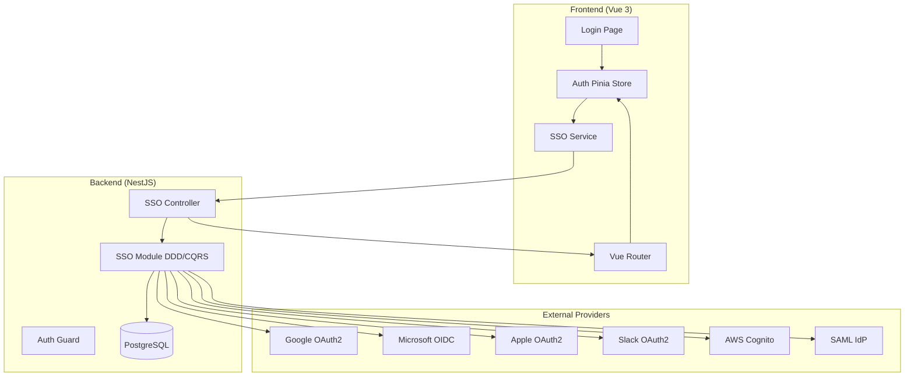
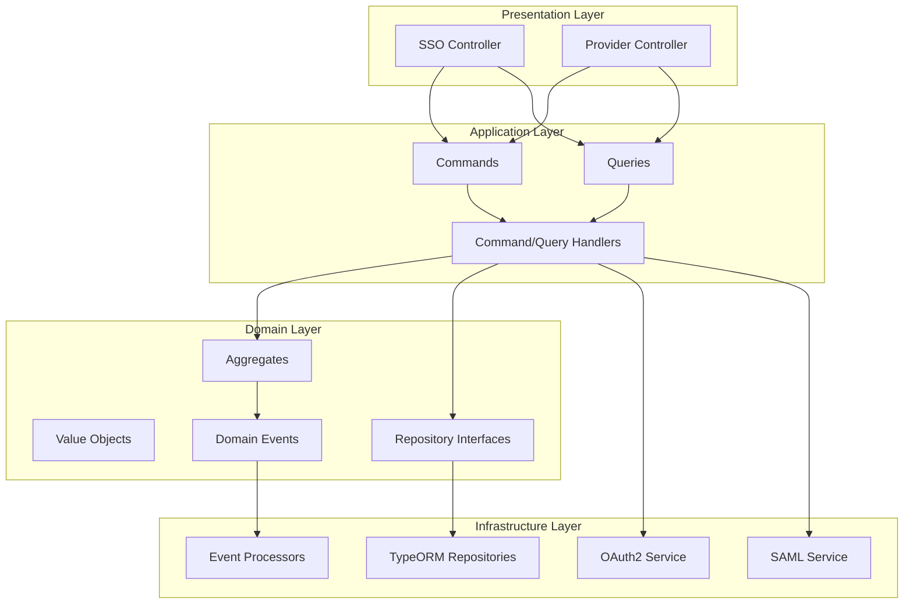
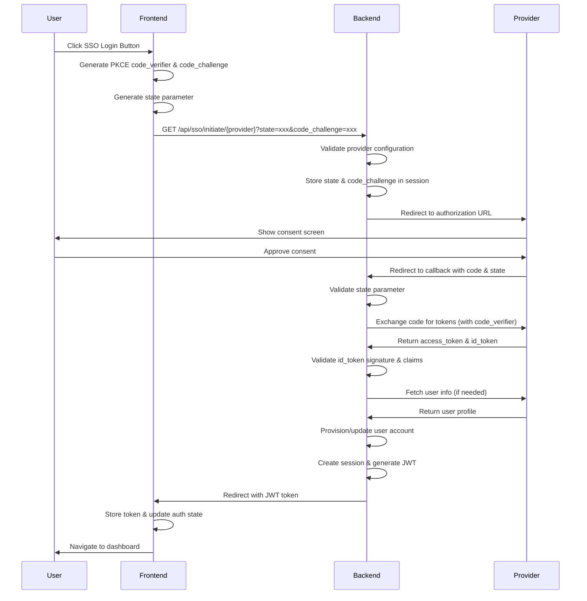
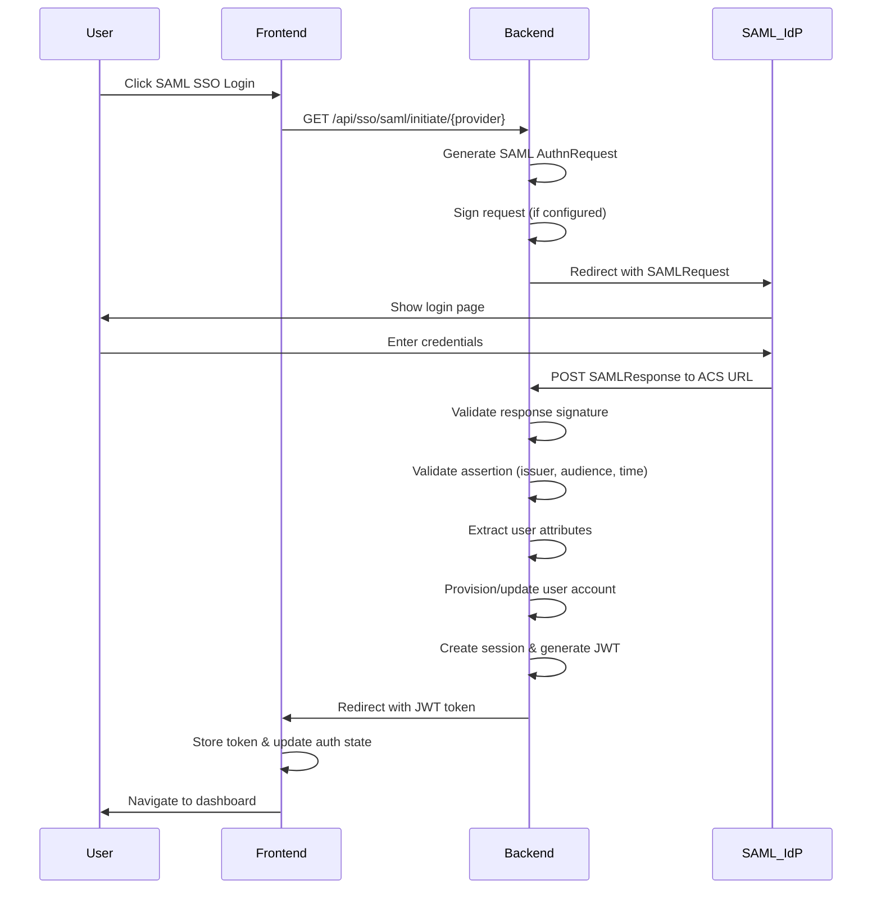
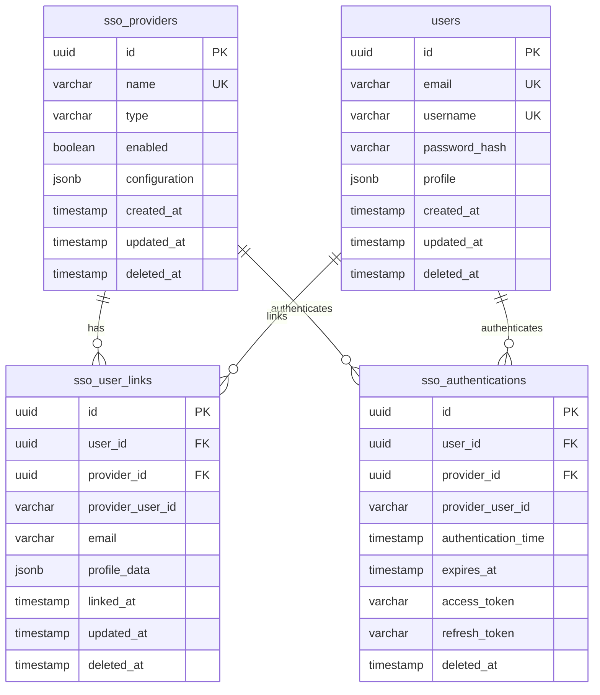

# Design Document: Frontend-Backend SSO Integration

## Overview

This design document specifies the architecture and implementation details for integrating Single Sign-On (SSO) authentication between the TelemetryFlow Vue 3 frontend and NestJS backend. The system supports multiple SSO providers (Google, Microsoft, Apple, Slack, AWS Cognito) using OAuth2/OIDC and SAML protocols.

The design follows:

- **Backend**: NestJS with DDD/CQRS architecture, TypeORM, PostgreSQL
- **Frontend**: Vue 3 Composition API, Pinia stores, Naive UI, Axios
- **Security**: PKCE for OAuth2, state validation, encrypted secrets, HTTPS
- **Observability**: OpenTelemetry tracing, Winston logging, audit logs

## Architecture

### High-Level Architecture



### DDD/CQRS Architecture (Backend)



### OAuth2/OIDC Authentication Flow



### SAML Authentication Flow



## Components and Interfaces

### Backend Components

#### Domain Layer

**Aggregates:**

1. **SSOProvider** (Aggregate Root)
   - Properties: id, name, type, enabled, configuration, createdAt, updatedAt
   - Methods: enable(), disable(), updateConfiguration(), validate()
   - Events: ProviderCreated, ProviderEnabled, ProviderDisabled, ProviderConfigurationUpdated

2. **SSOAuthentication** (Aggregate Root)
   - Properties: id, userId, providerId, providerUserId, authenticationTime, expiresAt
   - Methods: isExpired(), refresh(), invalidate()
   - Events: UserAuthenticatedViaSSO, AuthenticationExpired, AuthenticationInvalidated

3. **SSOUserLink** (Aggregate Root)
   - Properties: id, userId, providerId, providerUserId, email, profileData, linkedAt
   - Methods: updateProfile(), unlink()
   - Events: ProviderLinked, ProviderUnlinked, ProfileUpdated

**Value Objects:**

1. **ProviderId**: Unique identifier for SSO provider
2. **ProviderType**: Enum (GOOGLE, MICROSOFT, APPLE, SLACK, COGNITO, SAML)
3. **OAuth2Config**: OAuth2 configuration (clientId, clientSecret, authUrl, tokenUrl, redirectUri, scopes)
4. **SAMLConfig**: SAML configuration (entityId, ssoUrl, certificate, metadataUrl)
5. **ProviderUserId**: External user identifier from provider
6. **AuthenticationState**: State parameter for CSRF protection
7. **PKCEChallenge**: PKCE code_verifier and code_challenge

**Repository Interfaces:**

1. **ISSOProviderRepository**: CRUD operations for SSO providers
2. **ISSOAuthenticationRepository**: Manage authentication sessions
3. **ISSOUserLinkRepository**: Manage user-provider links

#### Application Layer

**Commands:**

1. **CreateSSOProviderCommand**: Create new SSO provider configuration
2. **UpdateSSOProviderCommand**: Update existing provider configuration
3. **EnableSSOProviderCommand**: Enable a provider
4. **DisableSSOProviderCommand**: Disable a provider
5. **DeleteSSOProviderCommand**: Delete a provider
6. **InitiateOAuth2FlowCommand**: Start OAuth2 authentication
7. **InitiateSAMLFlowCommand**: Start SAML authentication
8. **HandleOAuth2CallbackCommand**: Process OAuth2 callback
9. **HandleSAMLCallbackCommand**: Process SAML callback
10. **LinkSSOProviderCommand**: Link provider to existing user
11. **UnlinkSSOProviderCommand**: Unlink provider from user
12. **RefreshSSOTokenCommand**: Refresh access token

**Queries:**

1. **GetSSOProviderQuery**: Get provider by ID
2. **GetAllSSOProvidersQuery**: Get all providers
3. **GetEnabledSSOProvidersQuery**: Get enabled providers only
4. **GetUserSSOLinksQuery**: Get all SSO links for a user
5. **GetSSOAuthenticationQuery**: Get authentication session
6. **ValidateSSOTokenQuery**: Validate JWT token

**DTOs:**

1. **CreateSSOProviderDto**: Request DTO for creating provider
2. **UpdateSSOProviderDto**: Request DTO for updating provider
3. **SSOProviderResponseDto**: Response DTO for provider data
4. **InitiateSSODto**: Request DTO for initiating SSO
5. **SSOCallbackDto**: DTO for callback data
6. **SSOAuthenticationResponseDto**: Response DTO with JWT token
7. **SSOUserLinkResponseDto**: Response DTO for user links

#### Infrastructure Layer

**Services:**

1. **OAuth2Service**
   - Methods: generateAuthorizationUrl(), exchangeCodeForTokens(), validateIdToken(), refreshToken()
   - Supports: Google, Microsoft, Apple, Slack, Cognito

2. **SAMLService**
   - Methods: generateAuthRequest(), validateSAMLResponse(), extractAttributes()
   - Supports: Generic SAML 2.0 providers

3. **PKCEService**
   - Methods: generateCodeVerifier(), generateCodeChallenge(), validateChallenge()

4. **StateService**
   - Methods: generateState(), validateState(), storeState(), retrieveState()

5. **UserProvisioningService**
   - Methods: provisionUser(), updateUserProfile(), linkProvider(), unlinkProvider()

**Repositories:**

1. **SSOProviderRepository**: TypeORM implementation of ISSOProviderRepository
2. **SSOAuthenticationRepository**: TypeORM implementation of ISSOAuthenticationRepository
3. **SSOUserLinkRepository**: TypeORM implementation of ISSOUserLinkRepository

**Event Processors:**

1. **UserAuthenticatedViaSSO**: Log authentication, update last login
2. **ProviderLinked**: Send notification, update user profile
3. **ProviderConfigurationUpdated**: Invalidate cache, notify admins

#### Presentation Layer

**Controllers:**

1. **SSOController**
   - POST /api/sso/providers - Create provider (admin only)
   - PUT /api/sso/providers/:id - Update provider (admin only)
   - DELETE /api/sso/providers/:id - Delete provider (admin only)
   - GET /api/sso/providers - Get all providers (admin only)
   - GET /api/sso/providers/enabled - Get enabled providers (public)
   - GET /api/sso/initiate/:provider - Initiate OAuth2 flow
   - GET /api/sso/callback/:provider - Handle OAuth2 callback
   - GET /api/sso/saml/initiate/:provider - Initiate SAML flow
   - POST /api/sso/saml/callback/:provider - Handle SAML callback
   - POST /api/sso/link/:provider - Link provider to current user
   - DELETE /api/sso/link/:provider - Unlink provider
   - GET /api/sso/links - Get user's linked providers
   - POST /api/sso/refresh - Refresh access token

**Guards:**

1. **SSOAuthGuard**: Validate JWT token from SSO authentication
2. **AdminGuard**: Ensure user has admin permissions for provider management

### Frontend Components

#### Pinia Stores

**AuthStore** (`store/auth.ts`)

State:

```typescript
{
  user: User | null,
  token: string | null,
  isAuthenticated: boolean,
  loading: boolean,
  error: string | null,
  ssoProviders: SSOProvider[],
  linkedProviders: SSOUserLink[]
}
```

Getters:

```typescript
{
  isLoggedIn: boolean,
  currentUser: User | null,
  enabledSSOProviders: SSOProvider[],
  hasLinkedProvider: (providerId: string) => boolean
}
```

Actions:

```typescript
{
  initiateSSOLogin(provider: string): Promise<void>,
  handleSSOCallback(token: string): Promise<void>,
  fetchSSOProviders(): Promise<void>,
  fetchLinkedProviders(): Promise<void>,
  linkSSOProvider(provider: string): Promise<void>,
  unlinkSSOProvider(provider: string): Promise<void>,
  logout(): Promise<void>,
  validateToken(): Promise<boolean>
}
```

**SSOAdminStore** (`store/sso-admin.ts`)

State:

```typescript
{
  providers: SSOProvider[],
  selectedProvider: SSOProvider | null,
  loading: boolean,
  error: string | null
}
```

Actions:

```typescript
{
  fetchProviders(): Promise<void>,
  createProvider(data: CreateSSOProviderDto): Promise<void>,
  updateProvider(id: string, data: UpdateSSOProviderDto): Promise<void>,
  deleteProvider(id: string): Promise<void>,
  enableProvider(id: string): Promise<void>,
  disableProvider(id: string): Promise<void>
}
```

#### Vue Components

**LoginPage** (`views/auth/login.vue`)

- Displays username/password form
- Shows SSO provider buttons for enabled providers
- Handles SSO initiation
- Displays error messages

**SSOProviderButton** (`components/auth/SSOProviderButton.vue`)

- Props: provider (SSOProvider)
- Displays provider logo and name
- Emits click event to initiate SSO

**SSOCallbackHandler** (`views/auth/sso-callback.vue`)

- Extracts token from URL query parameters
- Calls AuthStore.handleSSOCallback()
- Redirects to intended destination or dashboard
- Displays loading state and error messages

**SSOSettingsPage** (`views/settings/sso.vue`)

- Admin page for managing SSO providers
- Lists all providers with status
- Provides create/edit/delete functionality
- Shows configuration forms

**SSOProviderForm** (`components/settings/SSOProviderForm.vue`)

- Props: provider (SSOProvider | null), mode ('create' | 'edit')
- Dynamic form based on provider type
- Validates configuration fields
- Emits save event with form data

**UserSSOLinks** (`components/settings/UserSSOLinks.vue`)

- Displays user's linked SSO providers
- Provides link/unlink functionality
- Shows last authentication time

#### Services

**SSOService** (`api/sso.ts`)

```typescript
{
  getEnabledProviders(): Promise<SSOProvider[]>,
  getAllProviders(): Promise<SSOProvider[]>,
  createProvider(data: CreateSSOProviderDto): Promise<SSOProvider>,
  updateProvider(id: string, data: UpdateSSOProviderDto): Promise<SSOProvider>,
  deleteProvider(id: string): Promise<void>,
  enableProvider(id: string): Promise<void>,
  disableProvider(id: string): Promise<void>,
  initiateSSOLogin(provider: string): void,
  getUserLinks(): Promise<SSOUserLink[]>,
  linkProvider(provider: string): Promise<void>,
  unlinkProvider(provider: string): Promise<void>,
  validateToken(token: string): Promise<boolean>
}
```

#### Router Configuration

```typescript
{
  path: '/login',
  name: 'login',
  component: () => import('@/views/auth/login.vue'),
  meta: { requiresAuth: false }
},
{
  path: '/auth/sso/callback',
  name: 'sso-callback',
  component: () => import('@/views/auth/sso-callback.vue'),
  meta: { requiresAuth: false }
},
{
  path: '/settings/sso',
  name: 'sso-settings',
  component: () => import('@/views/settings/sso.vue'),
  meta: { requiresAuth: true, requiresAdmin: true }
}
```

## Data Models

### Database Schema (PostgreSQL)



### TypeORM Entities

**SSOProviderEntity** (`infrastructure/persistence/entities/sso-provider.entity.ts`)

```typescript
@Entity("sso_providers")
export class SSOProviderEntity {
  @PrimaryGeneratedColumn("uuid")
  id: string;

  @Column({ unique: true })
  name: string;

  @Column({ type: "varchar" })
  type: ProviderType;

  @Column({ default: true })
  enabled: boolean;

  @Column({ type: "jsonb" })
  configuration: OAuth2Config | SAMLConfig;

  @CreateDateColumn()
  created_at: Date;

  @UpdateDateColumn()
  updated_at: Date;

  @DeleteDateColumn()
  deleted_at: Date;

  @OneToMany(() => SSOUserLinkEntity, (link) => link.provider)
  userLinks: SSOUserLinkEntity[];

  @OneToMany(() => SSOAuthenticationEntity, (auth) => auth.provider)
  authentications: SSOAuthenticationEntity[];
}
```

**SSOUserLinkEntity** (`infrastructure/persistence/entities/sso-user-link.entity.ts`)

```typescript
@Entity("sso_user_links")
@Index(["user_id", "provider_id"], { unique: true })
export class SSOUserLinkEntity {
  @PrimaryGeneratedColumn("uuid")
  id: string;

  @Column({ type: "uuid" })
  user_id: string;

  @Column({ type: "uuid" })
  provider_id: string;

  @Column()
  provider_user_id: string;

  @Column()
  email: string;

  @Column({ type: "jsonb", nullable: true })
  profile_data: Record<string, any>;

  @CreateDateColumn()
  linked_at: Date;

  @UpdateDateColumn()
  updated_at: Date;

  @DeleteDateColumn()
  deleted_at: Date;

  @ManyToOne(() => UserEntity, (user) => user.ssoLinks)
  @JoinColumn({ name: "user_id" })
  user: UserEntity;

  @ManyToOne(() => SSOProviderEntity, (provider) => provider.userLinks)
  @JoinColumn({ name: "provider_id" })
  provider: SSOProviderEntity;
}
```

**SSOAuthenticationEntity** (`infrastructure/persistence/entities/sso-authentication.entity.ts`)

```typescript
@Entity("sso_authentications")
@Index(["user_id", "provider_id"])
export class SSOAuthenticationEntity {
  @PrimaryGeneratedColumn("uuid")
  id: string;

  @Column({ type: "uuid" })
  user_id: string;

  @Column({ type: "uuid" })
  provider_id: string;

  @Column()
  provider_user_id: string;

  @CreateDateColumn()
  authentication_time: Date;

  @Column({ type: "timestamp" })
  expires_at: Date;

  @Column({ nullable: true })
  access_token: string;

  @Column({ nullable: true })
  refresh_token: string;

  @DeleteDateColumn()
  deleted_at: Date;

  @ManyToOne(() => UserEntity, (user) => user.ssoAuthentications)
  @JoinColumn({ name: "user_id" })
  user: UserEntity;

  @ManyToOne(() => SSOProviderEntity, (provider) => provider.authentications)
  @JoinColumn({ name: "provider_id" })
  provider: SSOProviderEntity;
}
```

### Frontend TypeScript Types

**SSOProvider** (`types/sso.ts`)

```typescript
export enum ProviderType {
  GOOGLE = "google",
  MICROSOFT = "microsoft",
  APPLE = "apple",
  SLACK = "slack",
  COGNITO = "cognito",
  SAML = "saml",
}

export interface OAuth2Config {
  clientId: string;
  clientSecret: string;
  authorizationUrl: string;
  tokenUrl: string;
  redirectUri: string;
  scopes: string[];
  userInfoUrl?: string;
}

export interface SAMLConfig {
  entityId: string;
  ssoUrl: string;
  certificate: string;
  metadataUrl?: string;
  signRequests?: boolean;
}

export interface SSOProvider {
  id: string;
  name: string;
  type: ProviderType;
  enabled: boolean;
  configuration: OAuth2Config | SAMLConfig;
  createdAt: string;
  updatedAt: string;
}

export interface SSOUserLink {
  id: string;
  userId: string;
  providerId: string;
  providerUserId: string;
  email: string;
  profileData: Record<string, any>;
  linkedAt: string;
  updatedAt: string;
}

export interface SSOAuthenticationResponse {
  token: string;
  expiresAt: string;
  user: User;
}
```

## Correctness Properties

A property is a characteristic or behavior that should hold true across all valid executions of a system—essentially, a formal statement about what the system should do. Properties serve as the bridge between human-readable specifications and machine-verifiable correctness guarantees.

### Property 1: Provider Configuration Validation

_For any_ SSO provider configuration (OAuth2 or SAML), when validating the configuration, all required fields for that provider type must be present and valid, and the configuration should be stored securely with sensitive fields encrypted.

**Validates: Requirements 1.1, 1.2, 1.3**

### Property 2: Sensitive Data Exclusion

_For any_ SSO provider configuration retrieved via API, sensitive credentials (client_secret, certificate private keys, tokens) must be excluded or masked in the response.

**Validates: Requirements 1.5**

### Property 3: Configuration Change Events

_For any_ provider configuration update, a ProviderConfigurationUpdated domain event must be emitted with the provider ID and change details.

**Validates: Requirements 1.7**

### Property 4: PKCE Generation

_For any_ OAuth2 authentication initiation, a cryptographically secure PKCE code_verifier and corresponding code_challenge must be generated and stored for later validation.

**Validates: Requirements 2.1, 9.1**

### Property 5: State Parameter Inclusion and Validation

_For any_ SSO redirect to a provider, a unique state parameter must be included, and when the provider redirects back, the state parameter must match the original value or the request must be rejected.

**Validates: Requirements 2.2, 2.3**

### Property 6: Token Exchange

_For any_ valid OAuth2 authorization code received in a callback, the system must exchange it for access and ID tokens using the stored code_verifier.

**Validates: Requirements 2.4**

### Property 7: ID Token Validation

_For any_ ID token received from an OAuth2/OIDC provider, the system must validate the signature, issuer, audience, and expiration before accepting the token.

**Validates: Requirements 2.5**

### Property 8: User Information Extraction

_For any_ successful OAuth2/OIDC authentication, user information (email, name, profile picture) must be extracted from either the ID token claims or the userinfo endpoint.

**Validates: Requirements 2.6**

### Property 9: User Provisioning

_For any_ extracted user information from SSO, the system must either create a new user account (if first-time) or update the existing account (if email matches), and link the SSO provider identity.

**Validates: Requirements 2.7, 4.1, 4.2, 4.3, 4.4**

### Property 10: Authentication Token Issuance

_For any_ completed SSO authentication (OAuth2 or SAML), the backend must issue a JWT authentication token and return it to the frontend.

**Validates: Requirements 2.8, 3.8**

### Property 11: Frontend Token Storage

_For any_ authentication token received from the backend, the frontend must store it securely (localStorage or sessionStorage) and update the authentication state in the Pinia store.

**Validates: Requirements 2.9**

### Property 12: SAML Request Generation

_For any_ SAML authentication initiation, the system must generate a valid SAML AuthnRequest with required fields (request_id, issue_instant, destination) and optionally sign it if configured.

**Validates: Requirements 3.1, 3.2, 3.3**

### Property 13: SAML Response Validation

_For any_ SAML response received from a provider, the system must validate the response signature, issuer, recipient, audience, and assertion validity period before accepting it.

**Validates: Requirements 3.4, 3.5**

### Property 14: SAML Attribute Extraction and Mapping

_For any_ valid SAML assertion, the system must extract user attributes and map them to user profile fields according to configured attribute mappings.

**Validates: Requirements 3.6, 3.7**

### Property 15: Default Role Assignment

_For any_ newly provisioned SSO user, the system must assign default roles based on the provider type and domain-based rules (e.g., company email domain).

**Validates: Requirements 4.5**

### Property 16: Provisioning Error Handling

_For any_ user provisioning failure, the system must log the error with context (provider, user data, error reason) and return a descriptive error message to the frontend.

**Validates: Requirements 4.6**

### Property 17: Provider User ID Storage

_For any_ successfully provisioned or linked SSO user, the system must store the provider's user ID for future authentication attempts.

**Validates: Requirements 4.7**

### Property 18: Session Creation with Expiration

_For any_ successful SSO authentication, the system must create a session record with user_id, provider_id, provider_user_id, authentication_time, and expiration time.

**Validates: Requirements 5.1, 5.2**

### Property 19: Session Expiration Detection

_For any_ stored authentication token, when the frontend checks its validity and finds it expired, the frontend must clear the authentication state and prompt for re-authentication.

**Validates: Requirements 5.3**

### Property 20: Session Invalidation on Logout

_For any_ user logout action, the system must invalidate the session in the backend and optionally redirect to the provider's logout endpoint if supported.

**Validates: Requirements 5.4, 5.5**

### Property 21: Token Validation on Initialization

_For any_ stored authentication token when the frontend initializes, the token must be validated with the backend, and if validation fails, the authentication state must be cleared and the user redirected to login.

**Validates: Requirements 5.6, 5.7**

### Property 22: Frontend Form Validation

_For any_ SSO provider configuration form submission in the frontend, all required fields must be validated before sending the request to the backend.

**Validates: Requirements 6.4**

### Property 23: Provider Configuration API Communication

_For any_ provider configuration save action in the frontend, the configuration data must be sent to the backend via the appropriate REST API endpoint.

**Validates: Requirements 6.5**

### Property 24: Provider Status Update

_For any_ provider enable/disable action in the frontend, the UI must immediately update the provider's enabled status after successful API response.

**Validates: Requirements 6.7**

### Property 25: Authentication Flow Initiation

_For any_ SSO provider button click in the frontend, the system must initiate the authentication flow by redirecting to the backend's SSO initiation endpoint for that provider.

**Validates: Requirements 7.3, 7.4**

### Property 26: Callback Redirect

_For any_ completed SSO authentication flow, the backend callback handler must redirect to the frontend with the authentication result (token or error).

**Validates: Requirements 7.5**

### Property 27: Token Extraction and Storage

_For any_ successful SSO callback, the frontend must extract the authentication token from the URL parameters and store it in the auth store.

**Validates: Requirements 7.6**

### Property 28: Deep Link Support

_For any_ authentication flow initiated with an intended destination, after successful authentication, the frontend must redirect the user to that intended destination.

**Validates: Requirements 7.8**

### Property 29: Structured Error Responses

_For any_ SSO authentication failure, the backend must return a structured error response with an error code, error type (configuration, provider_unavailable, authentication, provisioning), and descriptive message.

**Validates: Requirements 8.1, 8.2, 8.3, 8.4, 8.5**

### Property 30: Error Logging

_For any_ SSO error (authentication failure, provisioning failure, validation failure), the backend must log the error with sufficient context including timestamp, provider, user identifier, and error details.

**Validates: Requirements 8.8**

### Property 31: Redirect URI Validation

_For any_ SSO redirect or callback, the system must validate that the redirect URI matches one of the configured allowed URIs for that provider.

**Validates: Requirements 9.3**

### Property 32: Secret Encryption

_For any_ SSO provider secret (client_secret, certificate, tokens) stored in the database, the value must be encrypted using a secure encryption algorithm.

**Validates: Requirements 9.4**

### Property 33: HTTPS Enforcement

_For any_ SSO redirect or callback URL, the protocol must be HTTPS (not HTTP) to ensure secure communication.

**Validates: Requirements 9.5**

### Property 34: Rate Limiting

_For any_ SSO endpoint, when the number of requests from a single IP or user exceeds the configured threshold within a time window, subsequent requests must be rate-limited or rejected.

**Validates: Requirements 9.6**

### Property 35: Authentication Audit Logging

_For any_ SSO authentication attempt (successful or failed), the system must create an audit log entry with timestamp, provider, user identifier, IP address, and result.

**Validates: Requirements 9.7**

### Property 36: Token Refresh Support

_For any_ SSO provider that supports refresh tokens, when an access token expires, the system must use the refresh token to obtain a new access token without requiring re-authentication.

**Validates: Requirements 9.8**

### Property 37: Domain Event Emission

_For any_ significant SSO activity (user authenticated, provider linked, provider unlinked, configuration updated), the system must emit the corresponding domain event for event processors to handle.

**Validates: Requirements 10.4**

## Error Handling

### Error Types

The SSO system defines the following error types:

1. **ConfigurationError**: Invalid or missing provider configuration
2. **ProviderUnavailableError**: External provider is unreachable or down
3. **AuthenticationError**: Token validation or authentication flow failure
4. **ProvisioningError**: User account creation or update failure
5. **ValidationError**: Input validation failure (state, redirect URI, etc.)
6. **RateLimitError**: Too many requests from a single source

### Error Response Format

All SSO errors follow a consistent structure:

```typescript
{
  error: {
    code: string;           // e.g., "SSO_AUTH_FAILED"
    type: ErrorType;        // e.g., "AuthenticationError"
    message: string;        // User-friendly message
    details?: any;          // Additional context for debugging
    timestamp: string;      // ISO 8601 timestamp
    requestId: string;      // Unique request identifier
  }
}
```

### Backend Error Handling

**Domain Layer:**

- Throw domain-specific exceptions (InvalidProviderConfigurationException, UserProvisioningFailedException)
- Include context in exception messages

**Application Layer:**

- Catch domain exceptions in handlers
- Transform to application-level errors
- Log errors with full context

**Infrastructure Layer:**

- Catch external service errors (provider API failures)
- Retry transient failures with exponential backoff
- Transform to domain exceptions

**Presentation Layer:**

- Catch all exceptions in controllers
- Use NestJS exception filters for consistent error responses
- Return appropriate HTTP status codes (400, 401, 403, 500, 502, 503)

### Frontend Error Handling

**API Service Layer:**

- Catch Axios errors
- Extract error information from response
- Transform to application-level errors

**Store Layer:**

- Catch errors from API calls
- Update error state in store
- Emit error events for UI components

**Component Layer:**

- Display user-friendly error messages
- Provide retry mechanisms
- Offer fallback options (e.g., username/password login)

### Error Recovery Strategies

1. **Transient Failures**: Retry with exponential backoff (provider API calls)
2. **Configuration Errors**: Prompt admin to fix configuration
3. **Authentication Failures**: Clear state and redirect to login
4. **Provisioning Failures**: Log error, notify admin, allow manual account creation
5. **Rate Limiting**: Display wait time, implement client-side throttling

### Logging Strategy

All errors are logged with:

- Error type and code
- Full error message and stack trace
- Request context (user, provider, endpoint)
- Timestamp and request ID
- Relevant data (sanitized, no secrets)

Logs are sent to:

- Winston console transport (development)
- Winston file transport (production)
- OpenTelemetry (distributed tracing)
- ClickHouse (audit logs)

## Testing Strategy

### Dual Testing Approach

The SSO integration requires both unit tests and property-based tests for comprehensive coverage:

- **Unit tests**: Verify specific examples, edge cases, and error conditions
- **Property tests**: Verify universal properties across all inputs
- Together they provide comprehensive coverage: unit tests catch concrete bugs, property tests verify general correctness

### Property-Based Testing

**Library Selection:**

- **Backend (TypeScript/NestJS)**: Use `fast-check` for property-based testing
- **Frontend (TypeScript/Vue)**: Use `fast-check` for property-based testing

**Configuration:**

- Minimum 100 iterations per property test (due to randomization)
- Each property test must reference its design document property
- Tag format: `Feature: frontend-backend-sso-integration, Property {number}: {property_text}`

**Property Test Examples:**

```typescript
// Backend: Property 5 - State Parameter Validation
describe("Property 5: State Parameter Inclusion and Validation", () => {
  it("should include state parameter in redirects and validate on callback", async () => {
    await fc.assert(
      fc.asyncProperty(
        fc.string({ minLength: 1 }), // provider
        fc.uuid(), // state
        async (provider, state) => {
          // Feature: frontend-backend-sso-integration, Property 5
          const redirectUrl = await ssoService.initiateOAuth2(provider, state);
          expect(redirectUrl).toContain(`state=${state}`);

          // Simulate callback with matching state
          const result = await ssoService.handleCallback(
            provider,
            "code",
            state,
          );
          expect(result).toBeDefined();

          // Simulate callback with mismatched state
          await expect(
            ssoService.handleCallback(provider, "code", "wrong-state"),
          ).rejects.toThrow("Invalid state parameter");
        },
      ),
      { numRuns: 100 },
    );
  });
});

// Backend: Property 7 - ID Token Validation
describe("Property 7: ID Token Validation", () => {
  it("should validate all ID token claims", async () => {
    await fc.assert(
      fc.asyncProperty(
        fc.record({
          iss: fc.string(),
          aud: fc.string(),
          exp: fc.integer({ min: Date.now() / 1000 }),
          sub: fc.uuid(),
          email: fc.emailAddress(),
        }),
        async (tokenClaims) => {
          // Feature: frontend-backend-sso-integration, Property 7
          const token = generateMockIdToken(tokenClaims);

          if (tokenClaims.exp < Date.now() / 1000) {
            await expect(oauth2Service.validateIdToken(token)).rejects.toThrow(
              "Token expired",
            );
          } else {
            const result = await oauth2Service.validateIdToken(token);
            expect(result.sub).toBe(tokenClaims.sub);
            expect(result.email).toBe(tokenClaims.email);
          }
        },
      ),
      { numRuns: 100 },
    );
  });
});

// Frontend: Property 11 - Token Storage
describe("Property 11: Frontend Token Storage", () => {
  it("should store token and update auth state", async () => {
    await fc.assert(
      fc.asyncProperty(
        fc.string({ minLength: 20 }), // JWT token
        async (token) => {
          // Feature: frontend-backend-sso-integration, Property 11
          const authStore = useAuthStore();

          await authStore.handleSSOCallback(token);

          expect(authStore.token).toBe(token);
          expect(authStore.isAuthenticated).toBe(true);
          expect(localStorage.getItem("auth_token")).toBe(token);
        },
      ),
      { numRuns: 100 },
    );
  });
});
```

### Unit Testing

**Backend Unit Tests:**

1. **Domain Layer Tests** (≥95% coverage)
   - Aggregate behavior (SSOProvider, SSOAuthentication, SSOUserLink)
   - Value object validation (ProviderId, OAuth2Config, SAMLConfig)
   - Domain event emission

2. **Application Layer Tests** (≥90% coverage)
   - Command handlers (CreateSSOProvider, InitiateOAuth2Flow, HandleCallback)
   - Query handlers (GetSSOProvider, GetEnabledProviders)
   - DTO validation

3. **Infrastructure Layer Tests** (≥85% coverage)
   - Repository implementations
   - OAuth2Service and SAMLService
   - Event processors

4. **Presentation Layer Tests** (≥85% coverage)
   - Controller endpoints
   - Request/response DTOs
   - Guards and decorators

**Frontend Unit Tests:**

1. **Store Tests** (≥90% coverage)
   - AuthStore actions and getters
   - SSOAdminStore actions
   - State mutations

2. **Component Tests** (≥85% coverage)
   - LoginPage SSO button rendering
   - SSOCallbackHandler token extraction
   - SSOProviderForm validation
   - UserSSOLinks display and actions

3. **Service Tests** (≥90% coverage)
   - SSOService API calls
   - Error handling
   - Token validation

**Integration Tests:**

1. **Backend E2E Tests**
   - Full OAuth2 flow (initiate → callback → token issuance)
   - Full SAML flow (initiate → callback → token issuance)
   - Provider CRUD operations
   - User provisioning scenarios

2. **Frontend E2E Tests**
   - Login page → SSO button → callback → dashboard
   - Admin settings → create provider → enable → test login
   - User settings → link provider → unlink provider

### Test Data and Fixtures

**Backend Fixtures:**

- Mock SSO providers (all types)
- Mock OAuth2 tokens and ID tokens
- Mock SAML responses and assertions
- Mock user data from providers

**Frontend Fixtures:**

- Mock API responses
- Mock authentication tokens
- Mock provider configurations
- Mock user profiles

### Coverage Requirements

- **Overall**: ≥90% coverage
- **Domain layer**: ≥95% coverage
- **Application layer**: ≥90% coverage
- **Infrastructure layer**: ≥85% coverage
- **Presentation layer**: ≥85% coverage
- **Frontend stores**: ≥90% coverage
- **Frontend components**: ≥85% coverage

### Continuous Testing

- Run unit tests on every commit
- Run property tests on every pull request
- Run E2E tests before deployment
- Monitor test execution time and optimize slow tests
- Maintain test documentation and examples
