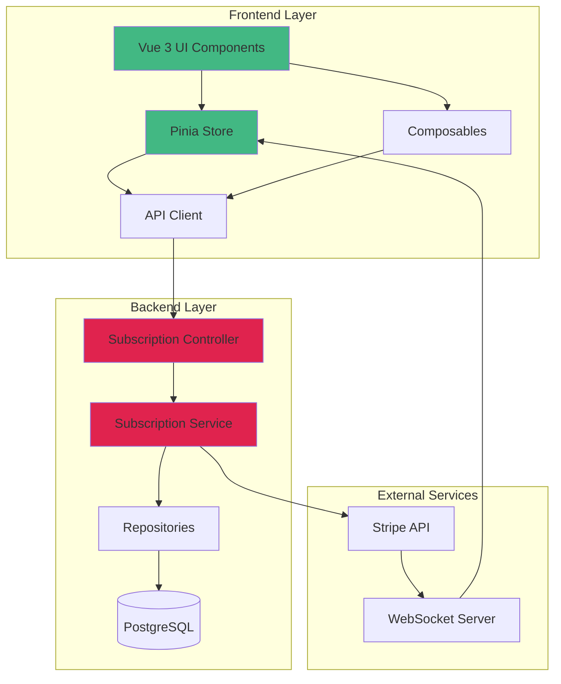
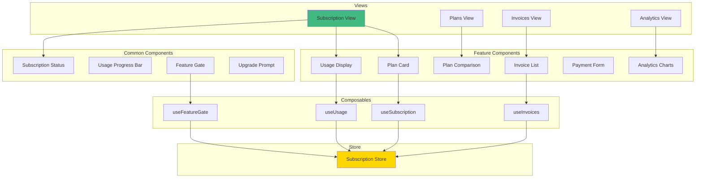
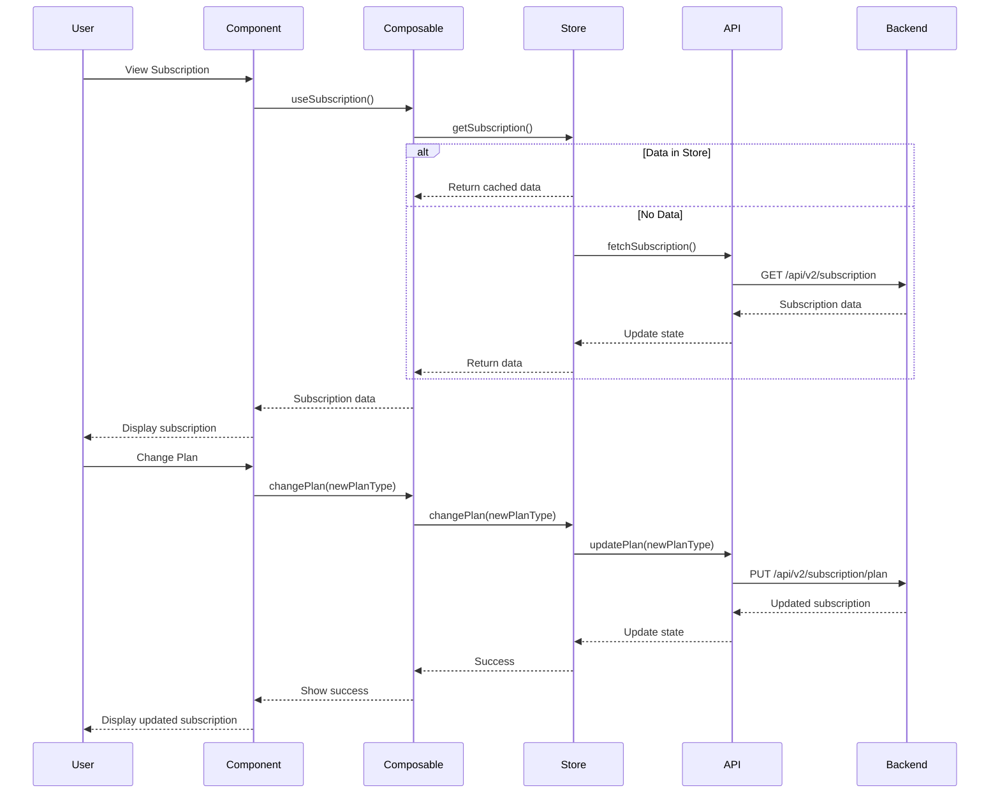

# Design Document: Frontend-Backend Subscription Integration

## Overview

This design document specifies the architecture and implementation details for integrating the Vue 3 frontend with the NestJS backend subscription module. The integration provides a complete subscription management experience including plan selection, usage monitoring, billing management, and feature gating.

The design follows Vue 3 Composition API patterns with Pinia state management, leverages Naive UI components for the interface, and uses ECharts for analytics visualization. The frontend communicates with the backend through RESTful APIs and WebSocket connections for real-time updates.

## Architecture

### System Architecture



### Component Architecture



### Data Flow Architecture



## Components and Interfaces

### Frontend Components

#### 1. Subscription View (`views/subscription/index.vue`)

Main subscription management page displaying current subscription, usage, and plan options.

**Props:** None (uses route params for organization context)

**Composables:**

- `useSubscription()` - Subscription data and actions
- `useUsage()` - Usage tracking data
- `useFeatureGate()` - Feature availability checks

**Layout:**

- Header with subscription status badge
- Current plan card with details
- Usage metrics grid
- Quick actions (upgrade, cancel, pause)
- Recent invoices section

#### 2. Plans View (`views/subscription/plans.vue`)

Plan comparison and selection page.

**Props:** None

**Composables:**

- `useSubscription()` - Current subscription context
- `usePlans()` - Available plans data

**Layout:**

- Billing cycle toggle (monthly/yearly)
- Plan comparison table
- Feature matrix
- Call-to-action buttons

#### 3. Invoices View (`views/subscription/invoices.vue`)

Invoice history and management page.

**Props:** None

**Composables:**

- `useInvoices()` - Invoice data and actions

**Layout:**

- Filter controls (status, date range)
- Invoice data table
- Invoice detail modal
- Download/view actions

#### 4. Analytics View (`views/subscription/analytics.vue`)

Subscription analytics dashboard (admin only).

**Props:** None

**Composables:**

- `useSubscriptionAnalytics()` - Analytics data

**Layout:**

- Time range selector
- KPI cards (MRR, active subscriptions, conversion rate)
- Usage trend charts
- Plan distribution chart
- Organization usage chart

#### 5. Plan Card Component (`components/subscription/PlanCard.vue`)

Displays a single subscription plan with features and pricing.

**Props:**

```typescript
interface Props {
  plan: Plan;
  currentPlan?: Plan;
  billingCycle: "monthly" | "yearly";
  highlighted?: boolean;
}
```

**Emits:**

- `select` - When user selects the plan

**Features:**

- Responsive card layout
- Feature list with checkmarks/limits
- Pricing display with discount badge
- Current plan indicator
- Select/Upgrade button

#### 6. Plan Comparison Component (`components/subscription/PlanComparison.vue`)

Side-by-side plan comparison table.

**Props:**

```typescript
interface Props {
  plans: Plan[];
  currentPlan?: Plan;
  billingCycle: "monthly" | "yearly";
}
```

**Emits:**

- `select-plan` - When user selects a plan

**Features:**

- Responsive table/card layout
- Feature comparison matrix
- Highlight current plan
- Sticky header on scroll

#### 7. Usage Display Component (`components/subscription/UsageDisplay.vue`)

Displays current usage metrics with progress bars.

**Props:**

```typescript
interface Props {
  usage: Usage;
  plan: Plan;
  refreshInterval?: number; // milliseconds
}
```

**Features:**

- Progress bars for each metric
- Color coding (green < 80%, yellow 80-100%, red > 100%)
- Percentage and absolute values
- Auto-refresh capability
- Unlimited indicator for no-limit features

#### 8. Subscription Status Component (`components/subscription/SubscriptionStatus.vue`)

Displays subscription status badge with contextual information.

**Props:**

```typescript
interface Props {
  subscription: Subscription;
}
```

**Features:**

- Status badge with color coding
- Trial countdown
- Cancellation notice
- Payment due warning

#### 9. Invoice List Component (`components/subscription/InvoiceList.vue`)

Data table displaying invoice history.

**Props:**

```typescript
interface Props {
  invoices: Invoice[];
  loading?: boolean;
}
```

**Emits:**

- `view-invoice` - When user clicks to view invoice details
- `download-invoice` - When user downloads invoice PDF

**Features:**

- Sortable columns
- Status filters
- Pagination
- Action buttons (view, download)

#### 10. Payment Form Component (`components/subscription/PaymentForm.vue`)

Stripe payment method input form.

**Props:**

```typescript
interface Props {
  clientSecret?: string;
}
```

**Emits:**

- `success` - When payment method is saved
- `error` - When payment fails

**Features:**

- Stripe Elements integration
- Card input validation
- Loading states
- Error display

#### 11. Feature Gate Component (`components/subscription/FeatureGate.vue`)

Wrapper component that controls feature access based on subscription.

**Props:**

```typescript
interface Props {
  feature: string; // Feature code
  fallback?: "hide" | "disable" | "upgrade-prompt";
}
```

**Slots:**

- `default` - Content to show when feature is available
- `upgrade` - Custom upgrade prompt (optional)

**Features:**

- Automatic feature availability check
- Configurable fallback behavior
- Upgrade prompt with required plan

#### 12. Upgrade Prompt Component (`components/subscription/UpgradePrompt.vue`)

Modal or banner prompting user to upgrade plan.

**Props:**

```typescript
interface Props {
  feature: string;
  requiredPlan: string;
  currentPlan: string;
  trigger?: "limit" | "feature";
}
```

**Emits:**

- `upgrade` - When user clicks upgrade button
- `dismiss` - When user dismisses prompt

**Features:**

- Feature/limit explanation
- Plan comparison
- Direct upgrade action
- Dismissible

#### 13. Analytics Charts Component (`components/subscription/AnalyticsCharts.vue`)

ECharts-based analytics visualizations.

**Props:**

```typescript
interface Props {
  data: AnalyticsData;
  timeRange: "7d" | "30d" | "90d" | "1y";
}
```

**Features:**

- Usage trend line charts
- Plan distribution pie chart
- Organization usage bar chart
- Interactive tooltips
- Responsive sizing

### Composables

#### 1. useSubscription

Provides subscription data and actions.

```typescript
interface UseSubscriptionReturn {
  // State
  subscription: Ref<Subscription | null>;
  currentPlan: Ref<Plan | null>;
  loading: Ref<boolean>;
  error: Ref<Error | null>;

  // Computed
  isActive: ComputedRef<boolean>;
  isTrialing: ComputedRef<boolean>;
  isCanceled: ComputedRef<boolean>;
  daysUntilRenewal: ComputedRef<number>;

  // Actions
  fetchSubscription: () => Promise<void>;
  changePlan: (planType: string) => Promise<void>;
  cancelSubscription: () => Promise<void>;
  reactivateSubscription: () => Promise<void>;
  pauseSubscription: () => Promise<void>;
  resumeSubscription: () => Promise<void>;
}
```

#### 2. useUsage

Provides usage tracking data and limit checks.

```typescript
interface UseUsageReturn {
  // State
  usage: Ref<Usage | null>;
  loading: Ref<boolean>;
  error: Ref<Error | null>;

  // Computed
  usagePercentages: ComputedRef<Record<string, number>>;
  warningMetrics: ComputedRef<string[]>;
  exceededMetrics: ComputedRef<string[]>;

  // Actions
  fetchUsage: () => Promise<void>;
  checkLimit: (metric: string) => Promise<UsageLimitCheck>;
  startAutoRefresh: (interval: number) => void;
  stopAutoRefresh: () => void;
}
```

#### 3. useFeatureGate

Provides feature availability checks and enforcement.

```typescript
interface UseFeatureGateReturn {
  // Methods
  isFeatureAvailable: (feature: string) => boolean;
  getFeatureLimit: (feature: string) => number | null;
  checkUsageLimit: (metric: string) => Promise<UsageLimitCheck>;

  // Computed
  availableFeatures: ComputedRef<string[]>;
  unavailableFeatures: ComputedRef<string[]>;
}
```

#### 4. useInvoices

Provides invoice data and actions.

```typescript
interface UseInvoicesReturn {
  // State
  invoices: Ref<Invoice[]>;
  loading: Ref<boolean>;
  error: Ref<Error | null>;

  // Computed
  paidInvoices: ComputedRef<Invoice[]>;
  openInvoices: ComputedRef<Invoice[]>;
  totalPaid: ComputedRef<number>;

  // Actions
  fetchInvoices: () => Promise<void>;
  fetchInvoiceById: (id: string) => Promise<Invoice>;
  downloadInvoice: (id: string) => Promise<void>;
}
```

#### 5. usePlans

Provides plan data and comparison utilities.

```typescript
interface UsePlansReturn {
  // State
  plans: Ref<Plan[]>;
  loading: Ref<boolean>;
  error: Ref<Error | null>;

  // Computed
  activePlans: ComputedRef<Plan[]>;
  sortedPlans: ComputedRef<Plan[]>;

  // Actions
  fetchPlans: () => Promise<void>;
  getPlanById: (id: string) => Plan | undefined;
  comparePlans: (planIds: string[]) => PlanComparison;
}
```

#### 6. useSubscriptionAnalytics

Provides analytics data for admin dashboard.

```typescript
interface UseSubscriptionAnalyticsReturn {
  // State
  analytics: Ref<AnalyticsData | null>;
  loading: Ref<boolean>;
  error: Ref<Error | null>;
  timeRange: Ref<"7d" | "30d" | "90d" | "1y">;

  // Computed
  totalMRR: ComputedRef<number>;
  activeSubscriptions: ComputedRef<number>;
  trialConversionRate: ComputedRef<number>;

  // Actions
  fetchAnalytics: (range: string) => Promise<void>;
  exportAnalytics: () => Promise<void>;
}
```

### Pinia Store

#### Subscription Store (`store/subscription.ts`)

Centralized state management for subscription data.

**State:**

```typescript
interface SubscriptionState {
  // Current subscription
  subscription: Subscription | null;
  currentPlan: Plan | null;

  // Available plans
  plans: Plan[];
  plansLoaded: boolean;

  // Usage tracking
  usage: Usage | null;
  usageLastUpdated: number | null;

  // Invoices
  invoices: Invoice[];
  invoicesLoaded: boolean;

  // Loading states
  loading: {
    subscription: boolean;
    plans: boolean;
    usage: boolean;
    invoices: boolean;
  };

  // Errors
  errors: {
    subscription: Error | null;
    plans: Error | null;
    usage: Error | null;
    invoices: Error | null;
  };

  // Cache
  featureGateCache: Map<
    string,
    { available: boolean; limit: number | null; timestamp: number }
  >;
}
```

**Getters:**

```typescript
interface SubscriptionGetters {
  isActive: (state: SubscriptionState) => boolean;
  isTrialing: (state: SubscriptionState) => boolean;
  isCanceled: (state: SubscriptionState) => boolean;
  isPaused: (state: SubscriptionState) => boolean;
  daysUntilRenewal: (state: SubscriptionState) => number;
  usagePercentages: (state: SubscriptionState) => Record<string, number>;
  warningMetrics: (state: SubscriptionState) => string[];
  exceededMetrics: (state: SubscriptionState) => string[];
  availableFeatures: (state: SubscriptionState) => string[];
  canUpgrade: (state: SubscriptionState) => boolean;
  canDowngrade: (state: SubscriptionState) => boolean;
  nextBillingAmount: (state: SubscriptionState) => number;
}
```

**Actions:**

```typescript
interface SubscriptionActions {
  // Subscription management
  fetchSubscription(): Promise<void>;
  createSubscription(planType: string, billingCycle: string): Promise<void>;
  changePlan(planType: string): Promise<void>;
  cancelSubscription(): Promise<void>;
  reactivateSubscription(): Promise<void>;
  pauseSubscription(): Promise<void>;
  resumeSubscription(): Promise<void>;
  changeBillingCycle(cycle: string): Promise<void>;

  // Plans
  fetchPlans(): Promise<void>;

  // Usage
  fetchUsage(): Promise<void>;
  checkUsageLimit(metric: string): Promise<UsageLimitCheck>;
  incrementUsage(metric: string, amount: number): Promise<void>;

  // Invoices
  fetchInvoices(): Promise<void>;
  fetchInvoiceById(id: string): Promise<Invoice>;
  downloadInvoice(id: string): Promise<void>;

  // Feature gates
  isFeatureAvailable(feature: string): boolean;
  getFeatureLimit(feature: string): number | null;
  clearFeatureGateCache(): void;

  // Utilities
  clearErrors(): void;
  resetState(): void;
}
```

### API Client

#### Subscription API (`api/subscription.ts`)

HTTP client for subscription endpoints.

```typescript
interface SubscriptionAPI {
  // Plans
  getPlans(): Promise<Plan[]>;
  getPlanById(id: string): Promise<Plan>;

  // Subscription
  getSubscription(): Promise<Subscription>;
  createSubscription(data: CreateSubscriptionDto): Promise<Subscription>;
  updatePlan(planType: string): Promise<Subscription>;
  cancelSubscription(): Promise<Subscription>;
  reactivateSubscription(): Promise<Subscription>;
  pauseSubscription(): Promise<Subscription>;
  resumeSubscription(): Promise<Subscription>;
  changeBillingCycle(cycle: string): Promise<Subscription>;

  // Usage
  getUsage(): Promise<Usage>;
  checkUsageLimit(metric: string): Promise<UsageLimitCheck>;
  incrementUsage(metric: string, amount: number): Promise<void>;

  // Invoices
  getInvoices(params?: InvoiceQueryParams): Promise<Invoice[]>;
  getInvoiceById(id: string): Promise<Invoice>;
  downloadInvoicePDF(id: string): Promise<Blob>;

  // Analytics (admin)
  getAnalytics(timeRange: string): Promise<AnalyticsData>;
}
```

## Data Models

### Frontend TypeScript Interfaces

#### Plan

```typescript
interface Plan {
  id: string;
  name: string;
  type: "free" | "starter" | "professional" | "enterprise" | "custom";
  description: string;
  features: PlanFeature[];
  pricing: PlanPricing[];
  isActive: boolean;
  isDefault: boolean;
  sortOrder: number;
  trialDays: number;
  metadata?: Record<string, any>;
  createdAt: string;
  updatedAt: string;
}

interface PlanFeature {
  name: string;
  code: string;
  limit: number | null; // null = unlimited
  unit: string;
}

interface PlanPricing {
  billingCycle: "monthly" | "yearly";
  amount: number; // in cents
  currency: string;
  discountPercent?: number;
}
```

#### Subscription

```typescript
interface Subscription {
  id: string;
  organizationId: string;
  planId: string;
  planType: "free" | "starter" | "professional" | "enterprise" | "custom";
  status: "active" | "trialing" | "past_due" | "canceled" | "unpaid" | "paused";
  billingCycle: "monthly" | "yearly";
  currentPeriodStart: string;
  currentPeriodEnd: string;
  trialStart?: string;
  trialEnd?: string;
  canceledAt?: string;
  cancelAtPeriodEnd: boolean;
  pausedAt?: string;
  resumeAt?: string;
  quantity: number;
  stripeSubscriptionId?: string;
  stripeCustomerId?: string;
  metadata?: Record<string, any>;
  createdAt: string;
  updatedAt: string;
}
```

#### Usage

```typescript
interface Usage {
  id: string;
  organizationId: string;
  subscriptionId: string;
  periodStart: string;
  periodEnd: string;
  metrics: UsageMetrics;
  lastUpdated: string;
  createdAt: string;
}

interface UsageMetrics {
  log_ingestion_gb: number;
  metric_data_points: number;
  trace_spans: number;
  api_calls: number;
  users: number;
  dashboards: number;
  alert_rules: number;
  api_keys: number;
}

interface UsageLimitCheck {
  metric: string;
  current: number;
  limit: number | null;
  percentUsed: number;
  allowed: boolean;
  remaining: number | null;
}
```

#### Invoice

```typescript
interface Invoice {
  id: string;
  organizationId: string;
  subscriptionId: string;
  invoiceNumber: string;
  status: "draft" | "open" | "paid" | "void" | "uncollectible";
  currency: string;
  subtotal: number; // in cents
  tax: number;
  taxRate: number;
  discount: number;
  total: number;
  amountPaid: number;
  amountDue: number;
  lineItems: InvoiceLineItem[];
  periodStart: string;
  periodEnd: string;
  dueDate: string;
  paidAt?: string;
  voidedAt?: string;
  stripeInvoiceId?: string;
  stripePaymentIntentId?: string;
  hostedInvoiceUrl?: string;
  pdfUrl?: string;
  notes?: string;
  metadata?: Record<string, any>;
  createdAt: string;
  updatedAt: string;
}

interface InvoiceLineItem {
  description: string;
  quantity: number;
  unitAmount: number;
  amount: number;
  metadata?: Record<string, any>;
}
```

#### Analytics Data

```typescript
interface AnalyticsData {
  timeRange: "7d" | "30d" | "90d" | "1y";
  summary: {
    totalActiveSubscriptions: number;
    totalMRR: number;
    trialConversionRate: number;
    churnRate: number;
    averageRevenuePerUser: number;
  };
  subscriptionsByPlan: {
    planType: string;
    count: number;
    percentage: number;
  }[];
  usageTrends: {
    date: string;
    metrics: UsageMetrics;
  }[];
  organizationUsage: {
    organizationId: string;
    organizationName: string;
    metrics: UsageMetrics;
  }[];
  revenueByPlan: {
    planType: string;
    revenue: number;
  }[];
}
```

### Request/Response DTOs

#### Create Subscription Request

```typescript
interface CreateSubscriptionDto {
  planType: string;
  billingCycle: "monthly" | "yearly";
  paymentMethodId?: string;
}
```

#### Change Plan Request

```typescript
interface ChangePlanDto {
  planType: string;
  immediate?: boolean; // Default: false (change at period end)
}
```

#### Invoice Query Parameters

```typescript
interface InvoiceQueryParams {
  status?: "draft" | "open" | "paid" | "void" | "uncollectible";
  startDate?: string;
  endDate?: string;
  limit?: number;
  offset?: number;
}
```

## Correctness Properties

_A property is a characteristic or behavior that should hold true across all valid executions of a system—essentially, a formal statement about what the system should do. Properties serve as the bridge between human-readable specifications and machine-verifiable correctness guarantees._

### Property Reflection

After analyzing all acceptance criteria, I've identified the following redundancies and consolidations:

**Redundancy Analysis:**

1. **API Integration Properties**: Multiple criteria test that specific endpoints are called (1.4, 2.2, 3.2, 7.1, 9.7, etc.). These can be consolidated into a single property about API client correctness.

2. **Conditional Display Properties**: Many criteria test conditional UI display based on subscription status (2.3, 2.4, 2.5, 5.4, 6.6, 12.4). These can be consolidated into a property about status-based UI rendering.

3. **Error Handling Properties**: Multiple criteria test error display (1.6, 4.5, 6.4, 16.1-16.7). These can be consolidated into a comprehensive error handling property.

4. **State Update Properties**: Multiple criteria test that state is updated after actions (4.4, 5.3, 5.6, 10.3, 12.3, 12.6, 15.4). These can be consolidated into a property about state synchronization.

5. **Notification Properties**: Multiple criteria test notification display (11.6, 11.7, 13.1-13.3, 19.3, 19.7). These can be consolidated into a property about notification behavior.

6. **Data Display Properties**: Multiple criteria test that all required fields are displayed (1.2, 2.1, 3.1, 7.2). These can be consolidated into properties about complete data rendering.

7. **Webhook Event Handling**: Multiple criteria test webhook event handling (19.1-19.5). These can be consolidated into a single property about webhook event processing.

8. **CSV Export Properties**: Multiple criteria test CSV export (20.1-20.7). These can be consolidated into a single property about CSV generation.

**Consolidation Decisions:**

- Combine all API endpoint verification into one property about API client correctness
- Combine conditional UI display based on status into one comprehensive property
- Combine error handling into one property about error display and recovery
- Combine state updates into one property about state synchronization after actions
- Combine notification display into one property about notification behavior
- Keep data display properties separate by entity type (plans, subscriptions, usage, invoices)
- Combine webhook event handling into one property
- Combine CSV export into one property

This reduces approximately 100+ testable criteria to about 30-35 unique, non-redundant properties.

### Correctness Properties

See [properties.md](./properties.md) for the complete list of 49 correctness properties that validate all requirements.

## Error Handling

See [design-continued.md](./design-continued.md#error-handling) for complete error handling strategies.

## Testing Strategy

See [design-continued.md](./design-continued.md#testing-strategy) for the complete testing strategy including unit tests and property-based tests.

**Summary:**

- Dual testing approach: Unit tests for specific cases, property tests for universal properties
- Minimum 100 iterations per property test
- Coverage requirements: ≥90% overall, ≥85% components, ≥90% composables/store
- Each property test tagged with feature name and property number

## Implementation Notes

See [design-continued.md](./design-continued.md#implementation-notes) for performance, security, accessibility, and deployment considerations.
