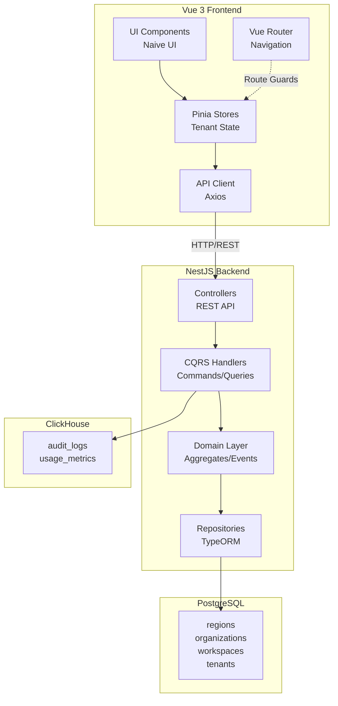
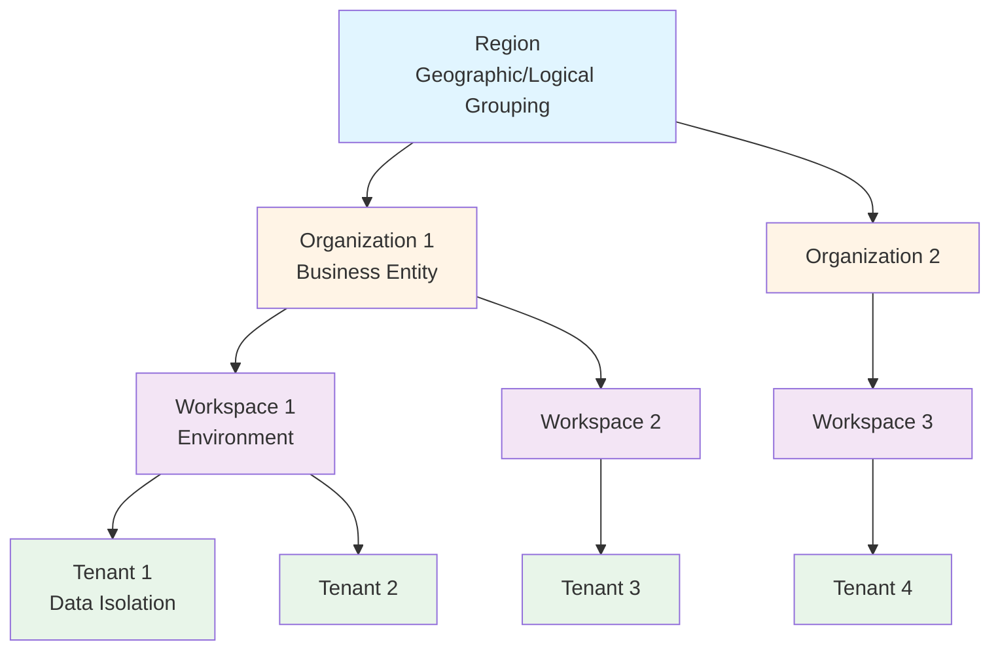
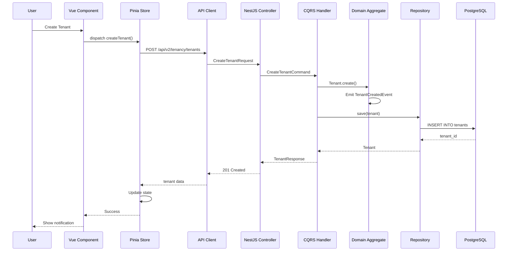

# Design Document: Frontend-Backend Tenancy Integration

## Overview

This design document specifies the integration architecture between the Vue 3 frontend and NestJS backend for the tenancy module in TelemetryFlow Platform. The system implements a hierarchical multi-tenant architecture (Region → Organization → Workspace → Tenant) with complete data isolation, tenant context management, and comprehensive CRUD operations.

The design follows Domain-Driven Design (DDD) with CQRS on the backend and Vue 3 Composition API patterns on the frontend, ensuring clean separation of concerns, testability, and maintainability.

## Architecture

### System Architecture



### Tenant Hierarchy



### Data Flow Architecture



## Components and Interfaces

### Frontend Components

#### 1. Tenant Store (Pinia)

```typescript
// store/tenancy.ts
interface TenancyState {
  currentTenant: Tenant | null;
  tenants: Tenant[];
  organizations: Organization[];
  workspaces: Workspace[];
  regions: Region[];
  loading: boolean;
  error: string | null;
}

interface TenancyGetters {
  activeTenant: Tenant | null;
  tenantCount: number;
  organizationsByRegion: Record<string, Organization[]>;
  workspacesByOrganization: Record<string, Workspace[]>;
  tenantsByWorkspace: Record<string, Tenant[]>;
}

interface TenancyActions {
  // Tenant operations
  fetchTenants(filters?: TenantFilters): Promise<Tenant[]>;
  fetchTenantById(id: string): Promise<Tenant>;
  createTenant(data: CreateTenantRequest): Promise<Tenant>;
  updateTenant(id: string, data: UpdateTenantRequest): Promise<Tenant>;
  deleteTenant(id: string): Promise<void>;
  switchTenant(tenantId: string): Promise<void>;

  // Organization operations
  fetchOrganizations(filters?: OrganizationFilters): Promise<Organization[]>;
  createOrganization(data: CreateOrganizationRequest): Promise<Organization>;
  updateOrganization(
    id: string,
    data: UpdateOrganizationRequest,
  ): Promise<Organization>;
  deleteOrganization(id: string): Promise<void>;

  // Workspace operations
  fetchWorkspaces(filters?: WorkspaceFilters): Promise<Workspace[]>;
  createWorkspace(data: CreateWorkspaceRequest): Promise<Workspace>;
  updateWorkspace(id: string, data: UpdateWorkspaceRequest): Promise<Workspace>;
  deleteWorkspace(id: string): Promise<void>;

  // Region operations
  fetchRegions(): Promise<Region[]>;
  createRegion(data: CreateRegionRequest): Promise<Region>;

  // Utility
  clearTenantContext(): void;
  refreshTenantData(): Promise<void>;
}
```

#### 2. API Client

```typescript
// api/tenancy.ts
interface TenancyApiClient {
  // Tenant endpoints
  getTenants(params?: QueryParams): Promise<PaginatedResponse<Tenant>>;
  getTenantById(id: string): Promise<Tenant>;
  createTenant(data: CreateTenantRequest): Promise<Tenant>;
  updateTenant(id: string, data: UpdateTenantRequest): Promise<Tenant>;
  deleteTenant(id: string): Promise<void>;
  activateTenant(id: string): Promise<Tenant>;
  deactivateTenant(id: string): Promise<Tenant>;

  // Organization endpoints
  getOrganizations(
    params?: QueryParams,
  ): Promise<PaginatedResponse<Organization>>;
  getOrganizationById(id: string): Promise<Organization>;
  createOrganization(data: CreateOrganizationRequest): Promise<Organization>;
  updateOrganization(
    id: string,
    data: UpdateOrganizationRequest,
  ): Promise<Organization>;
  deleteOrganization(id: string): Promise<void>;

  // Workspace endpoints
  getWorkspaces(params?: QueryParams): Promise<PaginatedResponse<Workspace>>;
  getWorkspaceById(id: string): Promise<Workspace>;
  createWorkspace(data: CreateWorkspaceRequest): Promise<Workspace>;
  updateWorkspace(id: string, data: UpdateWorkspaceRequest): Promise<Workspace>;
  deleteWorkspace(id: string): Promise<void>;

  // Region endpoints
  getRegions(params?: QueryParams): Promise<PaginatedResponse<Region>>;
  getRegionById(id: string): Promise<Region>;
  createRegion(data: CreateRegionRequest): Promise<Region>;
  updateRegion(id: string, data: UpdateRegionRequest): Promise<Region>;
  deleteRegion(id: string): Promise<void>;

  // Analytics endpoints
  getTenantUsageMetrics(
    tenantId: string,
    timeRange: TimeRange,
  ): Promise<UsageMetrics>;
  getTenantHealthStatus(tenantId: string): Promise<HealthStatus>;
}
```

#### 3. UI Components

```typescript
// components/tenancy/TenantSwitcher.vue
interface TenantSwitcherProps {
  placement?: "header" | "sidebar";
  showIcons?: boolean;
}

// components/tenancy/TenantTable.vue
interface TenantTableProps {
  data: Tenant[];
  loading?: boolean;
  pagination?: PaginationConfig;
  onRowClick?: (tenant: Tenant) => void;
  onEdit?: (tenant: Tenant) => void;
  onDelete?: (tenant: Tenant) => void;
}

// components/tenancy/TenantForm.vue
interface TenantFormProps {
  mode: "create" | "edit";
  initialData?: Partial<Tenant>;
  workspaceId?: string;
  onSubmit: (data: TenantFormData) => Promise<void>;
  onCancel: () => void;
}

// components/tenancy/TenantHierarchyTree.vue
interface TenantHierarchyTreeProps {
  regionId?: string;
  expandAll?: boolean;
  onNodeClick?: (node: HierarchyNode) => void;
}

// components/tenancy/TenantAnalyticsDashboard.vue
interface TenantAnalyticsDashboardProps {
  tenantId: string;
  timeRange: TimeRange;
  metrics: MetricType[];
}
```

### Backend Components

#### 1. Controllers

```typescript
// presentation/controllers/Tenants.controller.ts
@Controller('tenancy/tenants')
@ApiTags('Tenancy - Tenants')
export class TenantsController {
  @Get()
  @RequirePermissions('tenancy:tenant:read')
  @ApiOperation({ summary: 'List all tenants' })
  async findAll(@Query() query: QueryTenantsDto): Promise<PaginatedResponse<TenantResponseDto>>;

  @Get(':id')
  @RequirePermissions('tenancy:tenant:read')
  @ApiOperation({ summary: 'Get tenant by ID' })
  async findOne(@Param('id') id: string): Promise<TenantResponseDto>;

  @Post()
  @RequirePermissions('tenancy:tenant:write')
  @ApiOperation({ summary: 'Create new tenant' })
  async create(@Body() dto: CreateTenantDto): Promise<TenantResponseDto>;

  @Patch(':id')
  @RequirePermissions('tenancy:tenant:write')
  @ApiOperation({ summary: 'Update tenant' })
  async update(@Param('id') id: string, @Body() dto: UpdateTenantDto): Promise<TenantResponseDto>;

  @Delete(':id')
  @RequirePermissions('tenancy:tenant:delete')
  @ApiOperation({ summary: 'Delete tenant' })
  async remove(@Param('id') id: string): Promise<void>;

  @Patch(':id/activate')
  @RequirePermissions('tenancy:tenant:write')
  @ApiOperation({ summary: 'Activate tenant' })
  async activate(@Param('id') id: string): Promise<TenantResponseDto>;

  @Patch(':id/deactivate')
  @RequirePermissions('tenancy:tenant:write')
  @ApiOperation({ summary: 'Deactivate tenant' })
  async deactivate(@Param('id') id: string): Promise<TenantResponseDto>;
}
```

#### 2. CQRS Commands and Queries

```typescript
// application/commands/CreateTenant.command.ts
export class CreateTenantCommand {
  constructor(
    public readonly name: string,
    public readonly code: string,
    public readonly workspaceId: string,
    public readonly description?: string,
  ) {}
}

// application/commands/UpdateTenant.command.ts
export class UpdateTenantCommand {
  constructor(
    public readonly tenantId: string,
    public readonly name?: string,
    public readonly description?: string,
  ) {}
}

// application/queries/GetTenant.query.ts
export class GetTenantQuery {
  constructor(public readonly tenantId: string) {}
}

// application/queries/GetTenants.query.ts
export class GetTenantsQuery {
  constructor(
    public readonly filters?: TenantFilters,
    public readonly pagination?: PaginationParams,
  ) {}
}
```

#### 3. Command/Query Handlers

```typescript
// application/handlers/CreateTenant.handler.ts
@CommandHandler(CreateTenantCommand)
export class CreateTenantHandler implements ICommandHandler<CreateTenantCommand> {
  constructor(
    @Inject("ITenantRepository")
    private readonly tenantRepository: ITenantRepository,
    @Inject("IWorkspaceRepository")
    private readonly workspaceRepository: IWorkspaceRepository,
    private readonly eventBus: EventBus,
  ) {}

  async execute(command: CreateTenantCommand): Promise<Tenant> {
    // Verify workspace exists
    const workspace = await this.workspaceRepository.findById(
      WorkspaceId.create(command.workspaceId),
    );
    if (!workspace) {
      throw new NotFoundException("Workspace not found");
    }

    // Create tenant aggregate
    const tenant = Tenant.create(
      command.name,
      command.code,
      WorkspaceId.create(command.workspaceId),
      command.description,
    );

    // Save to repository
    await this.tenantRepository.save(tenant);

    // Publish domain events
    tenant.getUncommittedEvents().forEach((event) => {
      this.eventBus.publish(event);
    });

    return tenant;
  }
}

// application/handlers/GetTenants.handler.ts
@QueryHandler(GetTenantsQuery)
export class GetTenantsHandler implements IQueryHandler<GetTenantsQuery> {
  constructor(
    @Inject("ITenantRepository")
    private readonly tenantRepository: ITenantRepository,
  ) {}

  async execute(query: GetTenantsQuery): Promise<PaginatedResult<Tenant>> {
    return this.tenantRepository.findAll(query.filters, query.pagination);
  }
}
```

#### 4. Domain Aggregates

The domain aggregates are already implemented:

- `Tenant` - Main tenant aggregate with lifecycle methods
- `Organization` - Organization aggregate with region relationship
- `Workspace` - Workspace aggregate with organization relationship
- `Region` - Region aggregate for geographic grouping

#### 5. Repositories

```typescript
// domain/repositories/ITenantRepository.ts
export interface ITenantRepository {
  findById(id: TenantId): Promise<Tenant | null>;
  findByCode(code: string): Promise<Tenant | null>;
  findAll(
    filters?: TenantFilters,
    pagination?: PaginationParams,
  ): Promise<PaginatedResult<Tenant>>;
  findByWorkspaceId(workspaceId: WorkspaceId): Promise<Tenant[]>;
  save(tenant: Tenant): Promise<void>;
  delete(id: TenantId): Promise<void>;
  exists(id: TenantId): Promise<boolean>;
}

// infrastructure/persistence/repositories/TenantRepository.ts
@Injectable()
export class TenantRepository implements ITenantRepository {
  constructor(
    @InjectRepository(TenantEntity)
    private readonly repository: Repository<TenantEntity>,
  ) {}

  async findById(id: TenantId): Promise<Tenant | null> {
    const entity = await this.repository.findOne({
      where: { tenant_id: id.getValue() },
    });
    return entity ? TenantMapper.toDomain(entity) : null;
  }

  async findAll(
    filters?: TenantFilters,
    pagination?: PaginationParams,
  ): Promise<PaginatedResult<Tenant>> {
    const queryBuilder = this.repository.createQueryBuilder("tenant");

    if (filters?.workspaceId) {
      queryBuilder.andWhere("tenant.workspace_id = :workspaceId", {
        workspaceId: filters.workspaceId,
      });
    }

    if (filters?.isActive !== undefined) {
      queryBuilder.andWhere("tenant.is_active = :isActive", {
        isActive: filters.isActive,
      });
    }

    if (filters?.search) {
      queryBuilder.andWhere(
        "(tenant.name ILIKE :search OR tenant.code ILIKE :search)",
        { search: `%${filters.search}%` },
      );
    }

    const [entities, total] = await queryBuilder
      .skip(pagination?.offset || 0)
      .take(pagination?.limit || 20)
      .getManyAndCount();

    return {
      items: entities.map(TenantMapper.toDomain),
      total,
      page: pagination?.page || 1,
      limit: pagination?.limit || 20,
    };
  }

  async save(tenant: Tenant): Promise<void> {
    const entity = TenantMapper.toEntity(tenant);
    await this.repository.save(entity);
  }

  async delete(id: TenantId): Promise<void> {
    await this.repository.softDelete({ tenant_id: id.getValue() });
  }

  async exists(id: TenantId): Promise<boolean> {
    const count = await this.repository.count({
      where: { tenant_id: id.getValue() },
    });
    return count > 0;
  }
}
```

## Data Models

### Frontend Types

```typescript
// types/tenancy.ts
export interface Tenant {
  id: string;
  name: string;
  code: string;
  description: string | null;
  workspaceId: string;
  workspace?: Workspace;
  isActive: boolean;
  createdAt: string;
  updatedAt: string;
  deletedAt: string | null;
}

export interface Organization {
  id: string;
  name: string;
  code: string;
  description: string | null;
  domain: string | null;
  regionId: string;
  region?: Region;
  isActive: boolean;
  createdAt: string;
  updatedAt: string;
  deletedAt: string | null;
}

export interface Workspace {
  id: string;
  name: string;
  code: string;
  description: string | null;
  organizationId: string;
  organization?: Organization;
  isActive: boolean;
  createdAt: string;
  updatedAt: string;
  deletedAt: string | null;
}

export interface Region {
  id: string;
  name: string;
  code: string;
  description: string | null;
  isActive: boolean;
  createdAt: string;
  updatedAt: string;
  deletedAt: string | null;
}

export interface TenantFilters {
  workspaceId?: string;
  isActive?: boolean;
  search?: string;
}

export interface UsageMetrics {
  tenantId: string;
  apiCalls: number;
  storageUsed: number;
  activeUsers: number;
  timeRange: TimeRange;
  trends: MetricTrend[];
}

export interface HealthStatus {
  tenantId: string;
  status: "healthy" | "degraded" | "unhealthy";
  checks: HealthCheck[];
  lastChecked: string;
}
```

### Backend DTOs

```typescript
// presentation/dto/Tenant.dto.ts
export class CreateTenantDto {
  @ApiProperty({ example: "Acme Corp" })
  @IsString()
  @IsNotEmpty()
  name: string;

  @ApiProperty({ example: "acme-corp" })
  @IsString()
  @IsNotEmpty()
  @Matches(/^[a-z0-9-]+$/)
  code: string;

  @ApiProperty({ example: "123e4567-e89b-12d3-a456-426614174000" })
  @IsUUID()
  workspaceId: string;

  @ApiProperty({ required: false })
  @IsString()
  @IsOptional()
  description?: string;
}

export class UpdateTenantDto {
  @ApiProperty({ required: false })
  @IsString()
  @IsOptional()
  name?: string;

  @ApiProperty({ required: false })
  @IsString()
  @IsOptional()
  description?: string;
}

export class TenantResponseDto {
  @ApiProperty()
  id: string;

  @ApiProperty()
  name: string;

  @ApiProperty()
  code: string;

  @ApiProperty()
  description: string | null;

  @ApiProperty()
  workspaceId: string;

  @ApiProperty()
  isActive: boolean;

  @ApiProperty()
  createdAt: Date;

  @ApiProperty()
  updatedAt: Date;

  @ApiProperty()
  deletedAt: Date | null;
}

export class QueryTenantsDto {
  @ApiProperty({ required: false })
  @IsUUID()
  @IsOptional()
  workspaceId?: string;

  @ApiProperty({ required: false })
  @IsBoolean()
  @IsOptional()
  @Transform(({ value }) => value === "true")
  isActive?: boolean;

  @ApiProperty({ required: false })
  @IsString()
  @IsOptional()
  search?: string;

  @ApiProperty({ required: false, default: 1 })
  @IsInt()
  @Min(1)
  @IsOptional()
  @Transform(({ value }) => parseInt(value, 10))
  page?: number;

  @ApiProperty({ required: false, default: 20 })
  @IsInt()
  @Min(1)
  @Max(100)
  @IsOptional()
  @Transform(({ value }) => parseInt(value, 10))
  limit?: number;
}
```

### Database Schema

The database schema is already defined in the ERD documentation:

```sql
-- regions table
CREATE TABLE regions (
  id UUID PRIMARY KEY DEFAULT uuid_generate_v4(),
  name VARCHAR(100) NOT NULL,
  code VARCHAR(50) UNIQUE NOT NULL,
  description TEXT,
  is_active BOOLEAN DEFAULT true,
  created_at TIMESTAMP DEFAULT CURRENT_TIMESTAMP,
  updated_at TIMESTAMP DEFAULT CURRENT_TIMESTAMP,
  deleted_at TIMESTAMP
);

-- organizations table
CREATE TABLE organizations (
  organization_id UUID PRIMARY KEY DEFAULT uuid_generate_v4(),
  name VARCHAR(100) NOT NULL,
  code VARCHAR(50) UNIQUE NOT NULL,
  description TEXT,
  domain VARCHAR(255),
  region_id UUID REFERENCES regions(id),
  is_active BOOLEAN DEFAULT true,
  created_at TIMESTAMP DEFAULT CURRENT_TIMESTAMP,
  updated_at TIMESTAMP DEFAULT CURRENT_TIMESTAMP,
  deleted_at TIMESTAMP
);

-- workspaces table
CREATE TABLE workspaces (
  workspace_id UUID PRIMARY KEY DEFAULT uuid_generate_v4(),
  name VARCHAR(100) NOT NULL,
  code VARCHAR(50) UNIQUE NOT NULL,
  description TEXT,
  organization_id UUID REFERENCES organizations(organization_id),
  is_active BOOLEAN DEFAULT true,
  created_at TIMESTAMP DEFAULT CURRENT_TIMESTAMP,
  updated_at TIMESTAMP DEFAULT CURRENT_TIMESTAMP,
  deleted_at TIMESTAMP
);

-- tenants table
CREATE TABLE tenants (
  tenant_id UUID PRIMARY KEY DEFAULT uuid_generate_v4(),
  name VARCHAR(100) NOT NULL,
  code VARCHAR(50) UNIQUE NOT NULL,
  description TEXT,
  workspace_id UUID REFERENCES workspaces(workspace_id),
  is_active BOOLEAN DEFAULT true,
  created_at TIMESTAMP DEFAULT CURRENT_TIMESTAMP,
  updated_at TIMESTAMP DEFAULT CURRENT_TIMESTAMP,
  deleted_at TIMESTAMP
);
```

## Correctness Properties

A property is a characteristic or behavior that should hold true across all valid executions of a system—essentially, a formal statement about what the system should do. Properties serve as the bridge between human-readable specifications and machine-verifiable correctness guarantees.

### Property 1: Tenant CRUD Operations Completeness

_For any_ valid tenant data (name, code, workspace_id), creating a tenant via the API should result in a tenant being stored in the database with a unique ID, and fetching that tenant by ID should return the same data that was submitted.

**Validates: Requirements 1.1, 1.2**

### Property 2: Tenant Update Persistence

_For any_ existing tenant and valid update data (name, description), updating the tenant via the API should result in the changes being persisted to the database, and subsequent fetches should return the updated values.

**Validates: Requirements 1.3**

### Property 3: Tenant Deactivation State

_For any_ active tenant, deactivating it via the API should result in the tenant's is_active flag being set to false in the database, and the tenant should be excluded from active tenant queries.

**Validates: Requirements 1.4**

### Property 4: Domain Event Emission

_For any_ tenant operation (create, update, delete, activate, deactivate), the backend should emit a corresponding domain event with the tenant ID and operation type.

**Validates: Requirements 1.6**

### Property 5: Organization Creation with Tenant Context

_For any_ valid organization data and tenant context, creating an organization should result in the organization being associated with the correct region and being queryable only within that tenant's scope.

**Validates: Requirements 2.1**

### Property 6: Tenant Isolation in Queries

_For any_ tenant context, querying organizations, workspaces, or tenants should return only entities belonging to that tenant, and attempting to access entities from other tenants should result in empty results or 403 Forbidden errors.

**Validates: Requirements 2.2, 2.6, 3.2, 3.6, 4.1, 4.2, 4.3**

### Property 7: Cascading Delete Validation

_For any_ organization with active workspaces, attempting to delete the organization should be rejected with an error indicating that active workspaces exist, and the organization should remain in the database.

**Validates: Requirements 2.4**

### Property 8: Workspace Creation with Context

_For any_ valid workspace data, organization context, and tenant context, creating a workspace should result in the workspace being associated with the correct organization and tenant, and being queryable only within those scopes.

**Validates: Requirements 3.1**

### Property 9: Soft Delete Preservation

_For any_ workspace, archiving it should set the deleted_at timestamp, mark it as inactive, but preserve all data in the database, and the workspace should be excluded from active queries but retrievable with deleted filter.

**Validates: Requirements 3.4**

### Property 10: Tenant Context Extraction and Application

_For any_ API request with tenant context in JWT claims or headers, the backend should extract the tenant_id and automatically apply it as a filter to all database queries within that request scope.

**Validates: Requirements 4.1, 4.2, 7.1, 7.2, 7.3**

### Property 11: Cross-Tenant Access Rejection

_For any_ user attempting to access resources (tenants, organizations, workspaces) belonging to a different tenant than their current context, the backend should reject the request with a 403 Forbidden error.

**Validates: Requirements 4.3**

### Property 12: Audit Log Tenant Context

_For any_ tenant operation, the backend should create an audit log entry in ClickHouse that includes the tenant_id, user_id, action type, timestamp, and operation details.

**Validates: Requirements 4.5, 14.1, 14.2**

### Property 13: Configuration Validation and Storage

_For any_ tenant configuration update, the backend should validate the configuration against a schema, reject invalid configurations with field-level error messages, and store valid configurations as structured JSON.

**Validates: Requirements 5.1, 5.6**

### Property 14: Configuration Defaults

_For any_ tenant configuration retrieval, if certain configuration keys are missing, the backend should return default values for those keys, ensuring the configuration is always complete.

**Validates: Requirements 5.2**

### Property 15: Feature Flag Enforcement

_For any_ tenant with feature flags configured, the frontend should enable or disable features based on the flag values, and the backend should enforce feature availability in API endpoints.

**Validates: Requirements 5.3**

### Property 16: Resource Quota Enforcement

_For any_ tenant with configured resource limits (storage, users, API calls), the backend should reject operations that would exceed those limits with a 429 Too Many Requests or 403 Forbidden error.

**Validates: Requirements 5.5**

### Property 17: Tenant Switching State Update

_For any_ user switching from one tenant to another, the frontend Tenant_Store should update the current tenant context, clear cached data from the previous tenant, and reload data for the new tenant.

**Validates: Requirements 6.3, 6.5**

### Property 18: Tenant Context Propagation in Requests

_For any_ tenant context change in the frontend, all subsequent API requests should include the new tenant_id in request headers or query parameters.

**Validates: Requirements 6.4**

### Property 19: Event Metadata Tenant Context

_For any_ domain event emitted by the backend, the event metadata should include the tenant_id for proper routing and processing.

**Validates: Requirements 7.4**

### Property 20: Background Job Context Restoration

_For any_ background job processing tenant-specific data, the job should restore the tenant context from job metadata before executing operations.

**Validates: Requirements 7.5**

### Property 21: Usage Metrics Aggregation

_For any_ tenant and time range, querying usage metrics should return aggregated data from ClickHouse including API call counts, storage usage, and active user counts for that specific tenant and time period.

**Validates: Requirements 8.2**

### Property 22: Usage Limit Alert Emission

_For any_ tenant exceeding configured usage limits, the backend should emit an alert event, and the frontend should display a warning notification to administrators.

**Validates: Requirements 8.4**

### Property 23: Analytics Data Export Format

_For any_ tenant analytics export request, the frontend should generate a file (CSV or JSON) containing complete usage history with all required fields (timestamp, metric type, value, tenant_id).

**Validates: Requirements 8.5**

### Property 24: Real-time Metrics Streaming

_For any_ WebSocket connection requesting real-time tenant metrics, the backend should stream usage data updates as they occur, and the frontend should update visualizations in real-time.

**Validates: Requirements 8.6**

### Property 25: API Client Header Injection

_For any_ API call made through the Tenant_API_Client, the client should automatically include the current tenant context in request headers without manual intervention.

**Validates: Requirements 9.2**

### Property 26: DTO Transformation Consistency

_For any_ API response received by the Tenant_API_Client, the client should transform backend DTOs to frontend types consistently, ensuring all fields are mapped correctly.

**Validates: Requirements 9.3**

### Property 27: API Error Handling Consistency

_For any_ API error (4xx, 5xx), the Tenant_API_Client should handle the error consistently, extract error messages, and provide user-friendly error objects to the calling code.

**Validates: Requirements 9.4**

### Property 28: Pagination Parameter Serialization

_For any_ paginated API request, the Tenant_API_Client should serialize pagination parameters (page, limit, cursor) correctly to query parameters.

**Validates: Requirements 9.5**

### Property 29: Filter Serialization

_For any_ API request with filters, the Tenant_API_Client should serialize filter objects to query parameters in a consistent format that the backend can parse.

**Validates: Requirements 9.6**

### Property 30: Store Reactive State Updates

_For any_ tenant context change in the Tenant_Store, all computed properties should update reactively, and all subscribed components should be notified of the change.

**Validates: Requirements 10.2**

### Property 31: Store Caching Behavior

_For any_ tenant data fetched by the Tenant_Store, the data should be cached in memory, and subsequent requests for the same data should return cached results without making additional API calls.

**Validates: Requirements 10.3**

### Property 32: Optimistic Update and Rollback

_For any_ tenant operation initiated through the Tenant_Store, the store should update local state optimistically, and if the operation fails, should rollback the optimistic update and restore previous state.

**Validates: Requirements 10.4, 10.5**

### Property 33: Form Validation Enforcement

_For any_ tenant form submission (create or edit), the TenantForm_Component should validate all required fields, enforce format constraints (e.g., code must be kebab-case), and prevent submission if validation fails.

**Validates: Requirements 11.2**

### Property 34: Permission Verification

_For any_ tenant operation, the backend should verify the user has the required permission (read, write, delete) for that specific tenant, considering both role-based permissions and tenant-specific grants.

**Validates: Requirements 12.1, 12.2**

### Property 35: Permission Query Accuracy

_For any_ user and tenant context, querying tenant permissions should return an accurate list of allowed operations based on the user's roles and tenant-specific grants.

**Validates: Requirements 12.4**

### Property 36: Authorization Error Details

_For any_ unauthorized tenant operation attempt, the backend should return a 403 Forbidden error with details about the required permission and the user's current permissions.

**Validates: Requirements 12.5**

### Property 37: Permission Change Propagation

_For any_ permission change event, the frontend should refresh the user's permissions for the affected tenant, and UI elements should update to reflect the new permissions.

**Validates: Requirements 12.6**

### Property 38: Tenant Membership Storage

_For any_ user assigned to a tenant, the backend should store the tenant membership with role assignments, and the membership should be queryable by user_id or tenant_id.

**Validates: Requirements 12.3**

### Property 39: Import File Validation

_For any_ tenant data file upload, the frontend should validate the file format (CSV, JSON) and size before sending to the backend, rejecting invalid files with clear error messages.

**Validates: Requirements 13.1**

### Property 40: Import Transaction Atomicity

_For any_ tenant data import, the backend should process all records in a single transaction, and if any record fails validation, should rollback the entire import and return detailed error messages.

**Validates: Requirements 13.2, 13.3**

### Property 41: Import Summary Accuracy

_For any_ successful tenant data import, the backend should return a summary with accurate counts of created tenants, organizations, and workspaces.

**Validates: Requirements 13.4**

### Property 42: Large Import Background Processing

_For any_ tenant data import exceeding a size threshold, the backend should process the import in a background job and provide progress updates via WebSocket.

**Validates: Requirements 13.5**

### Property 43: Audit Log Filtering

_For any_ audit log query with filters (tenant, user, action type, date range), the backend should return only audit logs matching all specified filters.

**Validates: Requirements 14.3**

### Property 44: Sensitive Operation Audit Snapshots

_For any_ sensitive tenant operation (delete, deactivate, permission change), the backend should include before and after snapshots of the affected entity in the audit log.

**Validates: Requirements 14.5**

### Property 45: Audit Access Control

_For any_ audit log access attempt, the backend should verify the user has audit viewing permissions for the requested tenant before returning audit logs.

**Validates: Requirements 14.6**

### Property 46: Health Check Completeness

_For any_ tenant health check, the backend should verify database connectivity, API responsiveness, and resource availability, returning a health status with individual check results.

**Validates: Requirements 15.1**

### Property 47: Health Status Update on Issues

_For any_ health check detecting issues, the backend should update the tenant's health status in the database and emit a health change event.

**Validates: Requirements 15.2**

### Property 48: Health Alert Notification

_For any_ tenant health metric exceeding configured thresholds, the backend should send notifications to configured channels (email, webhook, Slack).

**Validates: Requirements 15.5**

## Error Handling

### Frontend Error Handling

```typescript
// API Client Error Handling
class TenancyApiError extends Error {
  constructor(
    public statusCode: number,
    public message: string,
    public details?: Record<string, any>,
  ) {
    super(message);
  }
}

// Error interceptor in API client
axios.interceptors.response.use(
  (response) => response,
  (error) => {
    if (error.response) {
      const { status, data } = error.response;
      throw new TenancyApiError(
        status,
        data.message || "An error occurred",
        data.details,
      );
    }
    throw new TenancyApiError(0, "Network error", { originalError: error });
  },
);

// Store error handling
const tenancyStore = useTenancyStore();
try {
  await tenancyStore.createTenant(data);
} catch (error) {
  if (error instanceof TenancyApiError) {
    if (error.statusCode === 403) {
      showNotification("error", "Permission denied");
    } else if (error.statusCode === 409) {
      showNotification("error", "Tenant code already exists");
    } else {
      showNotification("error", error.message);
    }
  }
}
```

### Backend Error Handling

```typescript
// Custom exceptions
export class TenantNotFoundException extends NotFoundException {
  constructor(tenantId: string) {
    super(`Tenant with ID ${tenantId} not found`);
  }
}

export class TenantCodeAlreadyExistsException extends ConflictException {
  constructor(code: string) {
    super(`Tenant with code ${code} already exists`);
  }
}

export class TenantContextMissingException extends UnauthorizedException {
  constructor() {
    super("Tenant context is required but missing from request");
  }
}

export class InsufficientTenantPermissionsException extends ForbiddenException {
  constructor(requiredPermission: string) {
    super(`Insufficient permissions. Required: ${requiredPermission}`);
  }
}

// Global exception filter
@Catch()
export class TenancyExceptionFilter implements ExceptionFilter {
  catch(exception: any, host: ArgumentsHost) {
    const ctx = host.switchToHttp();
    const response = ctx.getResponse();
    const request = ctx.getRequest();

    const status = exception.getStatus?.() || 500;
    const message = exception.message || "Internal server error";

    response.status(status).json({
      statusCode: status,
      message,
      timestamp: new Date().toISOString(),
      path: request.url,
      details: exception.details || {},
    });
  }
}
```

### Error Response Format

```typescript
interface ErrorResponse {
  statusCode: number;
  message: string;
  timestamp: string;
  path: string;
  details?: Record<string, any>;
}

// Validation error details
interface ValidationErrorDetails {
  field: string;
  constraints: string[];
  value: any;
}
```

## Testing Strategy

### Dual Testing Approach

The tenancy integration requires both unit tests and property-based tests for comprehensive coverage:

- **Unit tests**: Verify specific examples, edge cases, and error conditions
- **Property tests**: Verify universal properties across all inputs

### Frontend Testing

#### Unit Tests (Vitest + Vue Test Utils)

```typescript
// components/__tests__/TenantSwitcher.spec.ts
describe("TenantSwitcher", () => {
  it("should display tenant switcher when user has multiple tenants", () => {
    const wrapper = mount(TenantSwitcher, {
      global: {
        plugins: [
          createTestingPinia({
            initialState: {
              tenancy: {
                tenants: [
                  { id: "1", name: "Tenant 1" },
                  { id: "2", name: "Tenant 2" },
                ],
              },
            },
          }),
        ],
      },
    });
    expect(wrapper.find(".tenant-switcher").exists()).toBe(true);
  });

  it("should hide tenant switcher when user has only one tenant", () => {
    const wrapper = mount(TenantSwitcher, {
      global: {
        plugins: [
          createTestingPinia({
            initialState: {
              tenancy: {
                tenants: [{ id: "1", name: "Tenant 1" }],
              },
            },
          }),
        ],
      },
    });
    expect(wrapper.find(".tenant-switcher").exists()).toBe(false);
  });
});

// store/__tests__/tenancy.spec.ts
describe("Tenancy Store", () => {
  it("should update current tenant on switch", async () => {
    const store = useTenancyStore();
    await store.switchTenant("tenant-2");
    expect(store.currentTenant?.id).toBe("tenant-2");
  });

  it("should clear cached data on tenant switch", async () => {
    const store = useTenancyStore();
    store.organizations = [{ id: "1", name: "Org 1" }];
    await store.switchTenant("tenant-2");
    expect(store.organizations).toEqual([]);
  });
});
```

#### Property-Based Tests (fast-check)

```typescript
// api/__tests__/tenancy.property.spec.ts
import fc from "fast-check";

describe("Tenancy API Client Properties", () => {
  it("Property 25: API Client Header Injection - For any API call, tenant context should be in headers", async () => {
    await fc.assert(
      fc.asyncProperty(
        fc.record({
          tenantId: fc.uuid(),
          endpoint: fc.constantFrom(
            "/tenants",
            "/organizations",
            "/workspaces",
          ),
        }),
        async ({ tenantId, endpoint }) => {
          const store = useTenancyStore();
          store.currentTenant = { id: tenantId } as Tenant;

          const mockAxios = vi.spyOn(axios, "get");
          await tenancyApi.get(endpoint);

          expect(mockAxios).toHaveBeenCalledWith(
            expect.anything(),
            expect.objectContaining({
              headers: expect.objectContaining({
                "X-Tenant-Id": tenantId,
              }),
            }),
          );
        },
      ),
      { numRuns: 100 },
    );
  });

  it("Property 27: API Error Handling Consistency - For any API error, client should handle consistently", async () => {
    await fc.assert(
      fc.asyncProperty(
        fc.record({
          statusCode: fc.integer({ min: 400, max: 599 }),
          message: fc.string(),
        }),
        async ({ statusCode, message }) => {
          const mockAxios = vi.spyOn(axios, "get").mockRejectedValue({
            response: { status: statusCode, data: { message } },
          });

          try {
            await tenancyApi.getTenants();
            expect.fail("Should have thrown error");
          } catch (error) {
            expect(error).toBeInstanceOf(TenancyApiError);
            expect(error.statusCode).toBe(statusCode);
            expect(error.message).toBe(message);
          }
        },
      ),
      { numRuns: 100 },
    );
  });
});
```

### Backend Testing

#### Unit Tests (Jest)

```typescript
// application/handlers/__tests__/CreateTenant.handler.spec.ts
describe("CreateTenantHandler", () => {
  let handler: CreateTenantHandler;
  let tenantRepository: MockType<ITenantRepository>;
  let workspaceRepository: MockType<IWorkspaceRepository>;
  let eventBus: MockType<EventBus>;

  beforeEach(() => {
    tenantRepository = createMock<ITenantRepository>();
    workspaceRepository = createMock<IWorkspaceRepository>();
    eventBus = createMock<EventBus>();
    handler = new CreateTenantHandler(
      tenantRepository,
      workspaceRepository,
      eventBus,
    );
  });

  it("should create tenant when workspace exists", async () => {
    const command = new CreateTenantCommand(
      "Test Tenant",
      "test-tenant",
      "workspace-id",
      "Description",
    );

    workspaceRepository.findById.mockResolvedValue(
      Workspace.reconstitute(/* ... */),
    );

    const tenant = await handler.execute(command);

    expect(tenant.getName()).toBe("Test Tenant");
    expect(tenantRepository.save).toHaveBeenCalledWith(tenant);
    expect(eventBus.publish).toHaveBeenCalled();
  });

  it("should throw NotFoundException when workspace does not exist", async () => {
    const command = new CreateTenantCommand(
      "Test Tenant",
      "test-tenant",
      "invalid-workspace-id",
    );

    workspaceRepository.findById.mockResolvedValue(null);

    await expect(handler.execute(command)).rejects.toThrow(NotFoundException);
  });
});
```

#### Property-Based Tests (fast-check)

```typescript
// domain/aggregates/__tests__/Tenant.property.spec.ts
import fc from "fast-check";

describe("Tenant Aggregate Properties", () => {
  it("Property 1: Tenant CRUD Operations Completeness - For any valid tenant data, create then fetch should return same data", async () => {
    await fc.assert(
      fc.asyncProperty(
        fc.record({
          name: fc.string({ minLength: 1, maxLength: 100 }),
          code: fc
            .string({ minLength: 1, maxLength: 50 })
            .map((s) => s.toLowerCase().replace(/[^a-z0-9-]/g, "-")),
          workspaceId: fc.uuid(),
          description: fc.option(fc.string(), { nil: null }),
        }),
        async ({ name, code, workspaceId, description }) => {
          const tenant = Tenant.create(
            name,
            code,
            WorkspaceId.create(workspaceId),
            description,
          );

          await tenantRepository.save(tenant);
          const fetched = await tenantRepository.findById(tenant.getId());

          expect(fetched).not.toBeNull();
          expect(fetched!.getName()).toBe(name);
          expect(fetched!.getCode()).toBe(code);
          expect(fetched!.getDescription()).toBe(description);
        },
      ),
      { numRuns: 100 },
    );
  });

  it("Property 2: Tenant Update Persistence - For any tenant and update data, update should persist", async () => {
    await fc.assert(
      fc.asyncProperty(
        fc.record({
          initialName: fc.string({ minLength: 1 }),
          updatedName: fc.string({ minLength: 1 }),
          updatedDescription: fc.option(fc.string(), { nil: null }),
        }),
        async ({ initialName, updatedName, updatedDescription }) => {
          const tenant = Tenant.create(
            initialName,
            "test-code",
            WorkspaceId.create(uuid()),
          );
          await tenantRepository.save(tenant);

          tenant.updateDetails(updatedName, updatedDescription);
          await tenantRepository.save(tenant);

          const fetched = await tenantRepository.findById(tenant.getId());
          expect(fetched!.getName()).toBe(updatedName);
          expect(fetched!.getDescription()).toBe(updatedDescription);
        },
      ),
      { numRuns: 100 },
    );
  });
});

// infrastructure/persistence/__tests__/TenantRepository.property.spec.ts
describe("TenantRepository Properties", () => {
  it("Property 6: Tenant Isolation in Queries - For any tenant context, queries should return only that tenant's data", async () => {
    await fc.assert(
      fc.asyncProperty(
        fc.array(
          fc.record({
            name: fc.string({ minLength: 1 }),
            code: fc.string({ minLength: 1 }),
            workspaceId: fc.uuid(),
          }),
          { minLength: 2, maxLength: 10 },
        ),
        async (tenantData) => {
          // Create tenants in different workspaces
          const tenants = await Promise.all(
            tenantData.map((data) =>
              tenantRepository.save(
                Tenant.create(
                  data.name,
                  data.code,
                  WorkspaceId.create(data.workspaceId),
                ),
              ),
            ),
          );

          // Query by each workspace
          for (const tenant of tenants) {
            const results = await tenantRepository.findByWorkspaceId(
              tenant.getWorkspaceId(),
            );

            // Should only return tenants from that workspace
            expect(
              results.every((t) =>
                t.getWorkspaceId().equals(tenant.getWorkspaceId()),
              ),
            ).toBe(true);
          }
        },
      ),
      { numRuns: 100 },
    );
  });
});
```

#### Integration Tests

```typescript
// presentation/controllers/__tests__/Tenants.controller.e2e.spec.ts
describe("Tenants Controller (e2e)", () => {
  let app: INestApplication;
  let authToken: string;

  beforeAll(async () => {
    const moduleFixture = await Test.createTestingModule({
      imports: [AppModule],
    }).compile();

    app = moduleFixture.createNestApplication();
    await app.init();

    // Get auth token
    authToken = await getAuthToken(app);
  });

  it("POST /tenancy/tenants should create tenant", async () => {
    const response = await request(app.getHttpServer())
      .post("/tenancy/tenants")
      .set("Authorization", `Bearer ${authToken}`)
      .send({
        name: "Test Tenant",
        code: "test-tenant",
        workspaceId: "workspace-id",
      })
      .expect(201);

    expect(response.body).toHaveProperty("id");
    expect(response.body.name).toBe("Test Tenant");
  });

  it("GET /tenancy/tenants should return paginated tenants", async () => {
    const response = await request(app.getHttpServer())
      .get("/tenancy/tenants")
      .set("Authorization", `Bearer ${authToken}`)
      .query({ page: 1, limit: 20 })
      .expect(200);

    expect(response.body).toHaveProperty("items");
    expect(response.body).toHaveProperty("total");
    expect(Array.isArray(response.body.items)).toBe(true);
  });

  it("PATCH /tenancy/tenants/:id should update tenant", async () => {
    const tenant = await createTestTenant();

    const response = await request(app.getHttpServer())
      .patch(`/tenancy/tenants/${tenant.id}`)
      .set("Authorization", `Bearer ${authToken}`)
      .send({ name: "Updated Name" })
      .expect(200);

    expect(response.body.name).toBe("Updated Name");
  });
});
```

### Test Configuration

#### Property-Based Test Configuration

All property-based tests should run a minimum of 100 iterations:

```typescript
// vitest.config.ts (Frontend)
export default defineConfig({
  test: {
    globals: true,
    environment: "jsdom",
    coverage: {
      provider: "v8",
      reporter: ["text", "json", "html"],
      exclude: ["**/*.spec.ts", "**/*.test.ts", "**/mocks/**"],
      thresholds: {
        branches: 90,
        functions: 90,
        lines: 90,
        statements: 90,
      },
    },
  },
});

// jest.config.js (Backend)
module.exports = {
  coverageThreshold: {
    global: {
      branches: 90,
      functions: 90,
      lines: 90,
      statements: 90,
    },
    "src/modules/tenancy/domain/**": {
      branches: 95,
      functions: 95,
      lines: 95,
      statements: 95,
    },
  },
};
```

#### Test Tags

Each property test must reference its design document property:

```typescript
/**
 * Feature: frontend-backend-tenancy-integration
 * Property 1: Tenant CRUD Operations Completeness
 * For any valid tenant data, creating then fetching should return same data
 */
it("Property 1: Tenant CRUD Operations Completeness", async () => {
  // Test implementation
});
```

### Test Coverage Requirements

- **Frontend**: ≥90% coverage for stores, API clients, and composables
- **Backend Domain Layer**: ≥95% coverage for aggregates and value objects
- **Backend Application Layer**: ≥90% coverage for handlers
- **Backend Infrastructure Layer**: ≥85% coverage for repositories
- **Backend Presentation Layer**: ≥85% coverage for controllers
