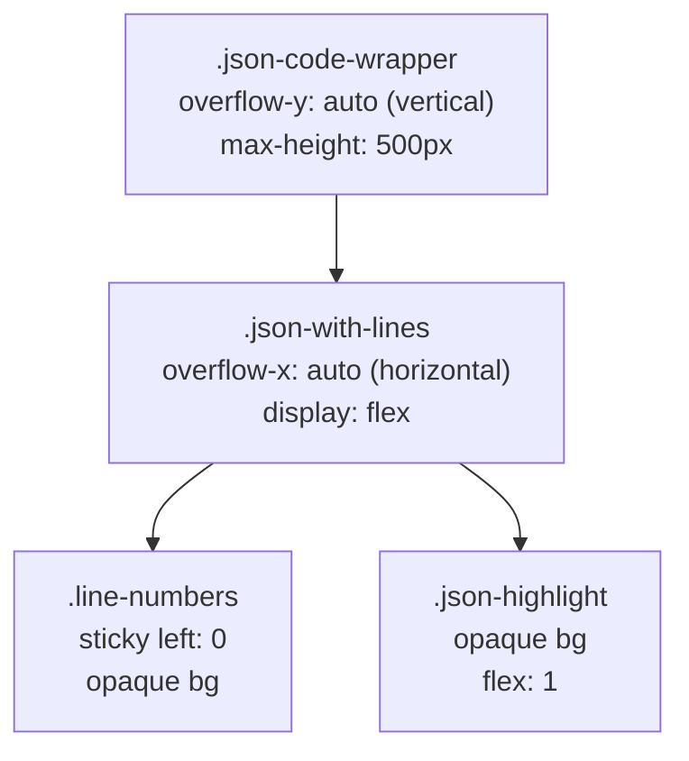

# Line-Numbered Editor Component

Global styling and composable for creating code editors or viewers with line numbers.

## Features

- Line numbers on the left side
- Monospace font (SF Mono, Monaco, Cascadia Code, etc.)
- Support for editable textarea and read-only pre element
- 3 sizes: small, medium, large
- Consistent styling with raw JSON view
- Auto-scrolling with custom scrollbar

## Usage

### 1. Import Composable (Optional)

```typescript
import { useLineNumberedEditor } from "@/composables";

const content = ref("line 1\nline 2\nline 3");
const { lineCount } = useLineNumberedEditor(content);
```

### 2. Editable Textarea

```vue
<template>
  <div class="line-numbered-editor-wrapper size-medium">
    <div class="line-numbered-editor-numbers">
      <span
        v-for="lineNum in lineCount"
        :key="`ln-${lineNum}`"
        class="line-number"
      >
        {{ lineNum }}
      </span>
    </div>
    <textarea
      v-model="content"
      class="line-numbered-editor-textarea"
      placeholder="Enter your code..."
    ></textarea>
  </div>
</template>
```

### 3. Read-Only Viewer

```vue
<template>
  <div class="line-numbered-editor-wrapper readonly size-medium">
    <div class="line-numbered-editor-numbers">
      <span
        v-for="lineNum in content.split('\n').length"
        :key="`ln-${lineNum}`"
        class="line-number"
      >
        {{ lineNum }}
      </span>
    </div>
    <pre class="line-numbered-editor-content">{{ content }}</pre>
  </div>
</template>
```

## Size Variants

- `size-small`: Compact view (font-size: 12px, line-height: 18px, min-height: 120px)
- `size-medium`: Default view (font-size: 13px, line-height: 20px, min-height: 200px)
- `size-large`: Expanded view (font-size: 14px, line-height: 22px, min-height: 200px)

## Classes

### Wrapper

- `.line-numbered-editor-wrapper` — Main container
- `.readonly` — Modifier for read-only view (no focus border effect)
- `.size-small`, `.size-medium`, `.size-large` — Size variants

### Line Numbers

- `.line-numbered-editor-numbers` — Line numbers container
- `.line-number` — Individual line number

### Content

- `.line-numbered-editor-textarea` — Editable textarea
- `.line-numbered-editor-content` — Read-only pre element

## Related: JSON Code Wrapper

For raw JSON viewer in detail drawers, see separate documentation:

- [tfo-global-components.md](./tfo-global-components.md) — Standard Raw JSON template + scoped styles
- [tfo-global-styles.md](./tfo-global-styles.md) — Global styles guide including scroll architecture

### Scroll Architecture (JSON Viewer)



Vertical and horizontal scroll are separated to avoid a `position: sticky` bug where the line numbers background and border disappear during vertical scrolling.

## Examples

### Alert Rule Query Editor

File: `src/views/alerts/rules.vue`

```vue
<div class="line-numbered-editor-wrapper size-medium">
  <div class="line-numbered-editor-numbers">
    <span v-for="lineNum in queryLineCount" :key="`qln-${lineNum}`" class="line-number">
      {{ lineNum }}
    </span>
  </div>
  <textarea
    v-model="ruleForm.query"
    class="line-numbered-editor-textarea"
    placeholder="Enter PromQL query..."
  ></textarea>
</div>
```

### Channel Message Template Preview

File: `src/views/settings/notification-channels/ChannelModal.vue`

```vue
<div class="line-numbered-editor-wrapper readonly size-medium">
  <div class="line-numbered-editor-numbers">
    <span v-for="lineNum in templatePreview.split('\n').length" :key="`tpl-${lineNum}`" class="line-number">
      {{ lineNum }}
    </span>
  </div>
  <pre class="line-numbered-editor-content">{{ templatePreview }}</pre>
</div>
```

## Styling

Global styles are available in `src/styles/tfo-line-number.scss` and are auto-imported in `main.ts`.

No manual CSS import is needed in components.

## Theme Support

Styling automatically adapts to dark/light mode:

- Dark mode: Line numbers background `#182032`, wrapper `#1e293b`
- Light mode: Line numbers background `#f1f5f9`, wrapper `#f8fafc`
- Border and text colors follow theme variables

## Customization

If custom styling is needed, override at the component level:

```scss
.my-custom-editor {
  .line-numbered-editor-wrapper {
    border-radius: 8px;
  }

  .line-numbered-editor-textarea {
    min-height: 200px;
  }
}
```

---

**Last Updated:** 2026-02-09
