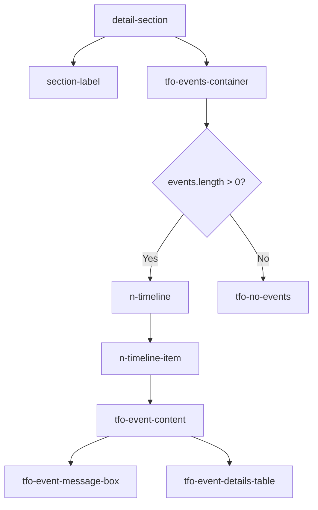

# TFO Events - Standard Design

Standard design for Events section in all detail drawers/panels. Reference: `pods.vue`.

## Architecture



## Global Styles

File: `src/styles/tfo-events.scss` (imported in `main.ts`)

| Class                      | Purpose                                  |
| -------------------------- | ---------------------------------------- |
| `.tfo-events-container`    | Main container, max-height 400px, scroll |
| `.tfo-event-content`       | Wrapper per event                        |
| `.tfo-event-message-box`   | Message box, supports `.warning` variant |
| `.tfo-event-details-table` | Details table (Source, Count, Last seen) |
| `.tfo-event-detail-label`  | Label column (left, 90px)                |
| `.tfo-event-detail-value`  | Value column (right, monospace)          |
| `.tfo-no-events`           | Empty state "No events found"            |

## Color Reference

| Element            | Light Mode | Dark Mode                 |
| ------------------ | ---------- | ------------------------- |
| Container bg       | `#f8fafc`  | `#0f172a`                 |
| Message box bg     | `#f1f5f9`  | `#1e293b`                 |
| Warning message bg | `#fef2f2`  | `rgba(220, 38, 38, 0.15)` |
| Warning text       | `#dc2626`  | `#fca5a5`                 |
| Detail label bg    | `#f3f4f6`  | `#1e293b`                 |
| Detail value bg    | `#ffffff`  | `#0f172a`                 |

## Standard Template (Reference: pods.vue)

```vue
<!-- Events -->
<div class="detail-section">
  <div class="section-label">
    <Icon icon="carbon:event-schedule" />
    <span>Events</span>
  </div>
  <div class="tfo-events-container">
    <n-timeline v-if="events.length > 0">
      <n-timeline-item
        v-for="(event, idx) in events"
        :key="idx"
        :type="event.type === 'Warning' ? 'warning' : 'success'"
        :title="event.reason"
      >
        <div class="tfo-event-content">
          <div class="tfo-event-message-box" :class="{ 'warning': event.type === 'Warning' }">
            <code>{{ event.message }}</code>
          </div>
          <table class="tfo-event-details-table">
            <tbody>
              <tr>
                <td class="tfo-event-detail-label">Source</td>
                <td class="tfo-event-detail-value">{{ event.source }}</td>
              </tr>
              <tr>
                <td class="tfo-event-detail-label">Count</td>
                <td class="tfo-event-detail-value">{{ event.count }}</td>
              </tr>
              <tr>
                <td class="tfo-event-detail-label">Last seen</td>
                <td class="tfo-event-detail-value">{{ formatEventTime(event.lastSeen) }}</td>
              </tr>
            </tbody>
          </table>
        </div>
      </n-timeline-item>
    </n-timeline>
    <div v-else class="tfo-no-events">
      No events found
    </div>
  </div>
</div>
```

## Rules

1. **REQUIRED** — Use `v-if="events.length > 0"` on `n-timeline`
2. **REQUIRED** — Provide empty state `tfo-no-events` with `v-else`
3. **REQUIRED** — Use title "Events" (not "Recent Events" or other variations)
4. **REQUIRED** — Use icon `carbon:event-schedule`
5. **DO NOT** create local/scoped styles for events — all styles come from global `tfo-events.scss`

## Views Using Events

| View       | File                                   | Event Variable     |
| ---------- | -------------------------------------- | ------------------ |
| Pods       | `monitoring/kubernetes/pods.vue`       | `podEvents`        |
| Nodes      | `monitoring/kubernetes/nodes.vue`      | `nodeEvents`       |
| Deployment | `monitoring/kubernetes/deployment.vue` | `deploymentEvents` |

## Event Interface

```typescript
interface K8sEvent {
  type: "Normal" | "Warning";
  reason: string;
  message: string;
  source: string;
  count: number;
  lastSeen: number; // timestamp ms
  firstSeen?: number; // optional, used by nodes
}
```

---

**Last Updated:** 2026-02-09
