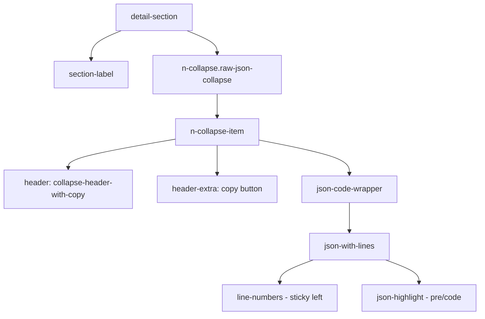
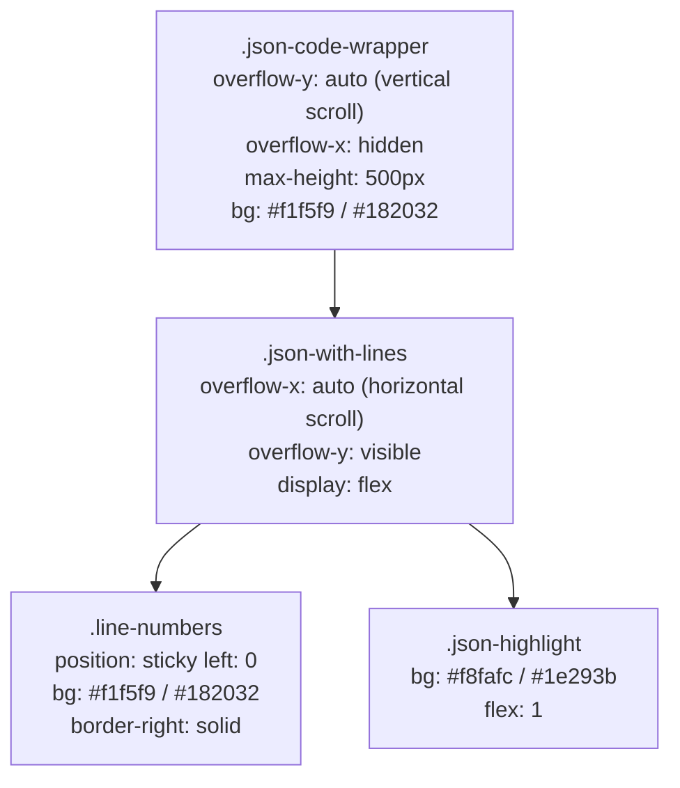

# TFO Global Components - Raw JSON Collapse Standard

Standard design for Raw JSON Collapse section in all detail drawers/panels. Reference: `pods.vue`.

## Architecture



## Scroll Architecture



**Why split scroll?**

- Vertical scroll on `.json-code-wrapper` — line numbers scroll together, no repaint needed
- Horizontal scroll on `.json-with-lines` — line numbers sticky left, only horizontal repaint
- Avoids `position: sticky` bug where background/border disappear after vertical scrolling

## Color Reference

| Element                             | Light Mode | Dark Mode               |
| ----------------------------------- | ---------- | ----------------------- |
| Wrapper bg (`.json-code-wrapper`)   | `#f1f5f9`  | `#182032`               |
| Line numbers bg                     | `#f1f5f9`  | `#182032`               |
| Line numbers border-right           | `#e2e8f0`  | `rgba(255,255,255,0.1)` |
| JSON content bg (`.json-highlight`) | `#f8fafc`  | `#1e293b`               |
| Line number text                    | `#64748b`  | `#64748b`               |

## Standard Template (Reference: pods.vue)

```vue
<!-- Raw JSON -->
<div class="detail-section">
  <div class="section-label">
    <Icon icon="carbon:code" />
    <span>Raw Pod Data (JSON)</span>
  </div>
  <n-collapse class="raw-json-collapse">
    <n-collapse-item name="raw">
      <template #header>
        <div class="collapse-header-with-copy">
          <span>View Raw JSON</span>
        </div>
      </template>
      <template #header-extra>
        <n-tooltip>
          <template #trigger>
            <n-button size="tiny" quaternary @click.stop="copyPodJson">
              <template #icon>
                <Icon icon="carbon:copy" />
              </template>
            </n-button>
          </template>
          Copy JSON
        </n-tooltip>
      </template>
      <div class="json-code-wrapper">
        <div class="json-with-lines">
          <div class="line-numbers">
            <span v-for="(_, idx) in jsonLines.lines" :key="`ln-${idx}`" class="line-number">
              {{ idx + 1 }}
            </span>
          </div>
          <pre class="json-highlight"><code><span
            v-for="(line, idx) in jsonLines.lines"
            :key="`jl-${idx}`"
            class="json-line"
            v-html="line + '\n'"
          ></span></code></pre>
        </div>
      </div>
    </n-collapse-item>
  </n-collapse>
</div>
```

## Standard Scoped Style: raw-json-collapse

Every view MUST copy this style in `<style scoped>`:

```scss
// Raw JSON Collapse styling (matching pods detail design)
.raw-json-collapse {
  :deep(.n-collapse-item) {
    .n-collapse-item__header {
      padding: 10px 14px;
      background: rgba(128, 128, 128, 0.1);
      border: 1px solid rgba(128, 128, 128, 0.3);
      border-radius: 8px;
      font-weight: 500;
      font-size: 0.875rem;

      &:hover {
        background: rgba(128, 128, 128, 0.15);
      }
    }

    &.n-collapse-item--active {
      .n-collapse-item__header {
        border-radius: 8px 8px 0 0;
        border-bottom: none;
      }
    }

    .n-collapse-item__content-wrapper {
      .n-collapse-item__content-inner {
        padding: 0;
      }
    }
  }
}

.collapse-header-with-copy {
  display: flex;
  align-items: center;
  gap: 8px;
}

// Raw JSON uses global .json-code-wrapper styles from tfo-line-number.scss
// DO NOT add local .json-code-wrapper styles!
```

## Composable Helper

```typescript
import { useRawJsonView } from "@/composables/useRawJsonView";

const { jsonLines, copyJson } = useRawJsonView(selectedDataRef);
```

## Rules

1. **REQUIRED** — Use `raw-json-collapse` class on `n-collapse`
2. **REQUIRED** — Use icon `carbon:code` on section label
3. **REQUIRED** — Provide copy button in `header-extra` with tooltip
4. **REQUIRED** — Use `useRawJsonView` composable for JSON formatting
5. **DO NOT** add `.json-code-wrapper` styles in scoped style — all from global `tfo-line-number.scss`
6. **DO NOT** use old pattern (border on collapse-item, hardcoded `#1e293b` background)

## Views Using Raw JSON

| View        | File                                            | Section Title              |
| ----------- | ----------------------------------------------- | -------------------------- |
| Pods        | `monitoring/kubernetes/pods.vue`                | Raw Pod Data (JSON)        |
| Nodes       | `monitoring/kubernetes/nodes.vue`               | Raw Node Data (JSON)       |
| Deployment  | `monitoring/kubernetes/deployment.vue`          | Raw Deployment Data (JSON) |
| Namespace   | `monitoring/kubernetes/namespace.vue`           | Raw Namespace Data (JSON)  |
| PV          | `monitoring/kubernetes/pv.vue`                  | Raw PV Data (JSON)         |
| Audit       | `audit/index.vue`                               | Raw Audit Log (JSON)       |
| Traces Span | `telemetry/traces/detail.vue`                   | Raw Span Data (JSON)       |
| Traces Log  | `telemetry/traces/detail.vue`                   | Raw Log Record (JSON)      |
| Invoice     | `settings/subscription/InvoiceDetailDrawer.vue` | Raw Invoice (JSON)         |

## JSON Syntax Highlighting Classes

Global classes from `tfo-line-number.scss`:

| Class           | Light Color | Dark Color | Purpose         |
| --------------- | ----------- | ---------- | --------------- |
| `.json-key`     | `#0369a1`   | `#7dd3fc`  | Object keys     |
| `.json-string`  | `#15803d`   | `#86efac`  | String values   |
| `.json-number`  | `#c2410c`   | `#fbbf24`  | Number values   |
| `.json-boolean` | `#7c3aed`   | `#c4b5fd`  | Boolean values  |
| `.json-null`    | `#64748b`   | `#94a3b8`  | Null values     |
| `.json-bracket` | `#1e293b`   | `#f8fafc`  | Brackets/braces |

## Size Variants

| Variant    | Max Height | Font Size |
| ---------- | ---------- | --------- |
| Default    | 500px      | 13px      |
| `.compact` | 300px      | 12px      |
| `.large`   | 700px      | 14px      |

---

**Last Updated:** 2026-02-09
