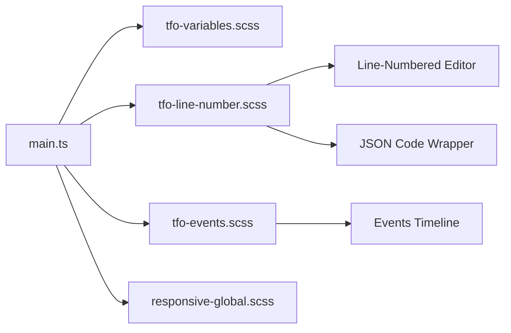
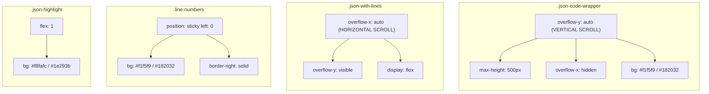

# TFO Global Styles Guide

Complete documentation for consistent global styling across the TelemetryFlow-Viz application.

## Overview



TFO Global Styles provides 3 main styling systems:

1. **TFO-Line-Number** — Line-numbered editor + JSON viewer
2. **TFO-Events** — Event timeline for detail panels
3. **TFO-Variables** — CSS custom properties for theming

## 1. TFO-Line-Number

File: `src/styles/tfo-line-number.scss`

### A. Line-Numbered Editor (Editable)

For editable code input with line numbers. See [line-numbered-editor.md](./line-numbered-editor.md).

**Classes:**

- `.line-numbered-editor-wrapper` — Main container
- `.line-numbered-editor-numbers` — Line numbers column
- `.line-numbered-editor-textarea` — Textarea for input
- `.line-numbered-editor-content` — Pre element for read-only

**Size Variants:**

- `.size-small` — Compact (font: 12px, line-height: 18px, min-height: 120px)
- `.size-medium` — Default (font: 13px, line-height: 20px, min-height: 200px)
- `.size-large` — Expanded (font: 14px, line-height: 22px, min-height: 200px)

### B. JSON Code Wrapper (Read-only JSON Viewer)

For displaying raw JSON with syntax highlighting and line numbers. See [tfo-global-components.md](./tfo-global-components.md).

#### Scroll Architecture



**Design decisions:**

- Vertical scroll on `.json-code-wrapper` — line numbers scroll together, no GPU repaint needed
- Horizontal scroll on `.json-with-lines` — line numbers `sticky left: 0` only for horizontal
- Background of `.json-code-wrapper` = line numbers color — fallback if sticky bg is lost
- Background of `.json-highlight` = opaque — covers wrapper bg in the JSON content area

**Classes:**

- `.json-code-wrapper` — Container wrapper, vertical scroll, max-height 500px
- `.json-with-lines` — Flex container, horizontal scroll only
- `.line-numbers` — Line numbers column, sticky left
- `.json-highlight` — Pre element for JSON content
- `.json-line` — Individual JSON line with hover effect

**Size Variants:**

- Default — Max-height: 500px, font: 13px
- `.compact` — Max-height: 300px, font: 12px
- `.large` — Max-height: 700px, font: 14px

**Wrap Variants:**

- `.no-wrap` — Single-line JSON (default)
- `.wrap` — Multi-line values with word-break

**JSON Syntax Highlighting:**

- `.json-key` — Object keys (light: `#0369a1`, dark: `#7dd3fc`)
- `.json-string` — String values (light: `#15803d`, dark: `#86efac`)
- `.json-number` — Number values (light: `#c2410c`, dark: `#fbbf24`)
- `.json-boolean` — Boolean values (light: `#7c3aed`, dark: `#c4b5fd`)
- `.json-null` — Null values (light: `#64748b`, dark: `#94a3b8`)
- `.json-bracket` — Brackets/braces (light: `#1e293b`, dark: `#f8fafc`)

**Example:**

```vue
<template>
  <n-collapse class="raw-json-collapse">
    <n-collapse-item name="raw">
      <template #header>
        <div class="collapse-header-with-copy">
          <span>View Raw JSON</span>
        </div>
      </template>
      <template #header-extra>
        <n-tooltip>
          <template #trigger>
            <n-button size="tiny" quaternary @click.stop="copyJson">
              <template #icon>
                <Icon icon="carbon:copy" />
              </template>
            </n-button>
          </template>
          Copy JSON
        </n-tooltip>
      </template>
      <div class="json-code-wrapper">
        <div class="json-with-lines">
          <div class="line-numbers">
            <span
              v-for="(_, idx) in jsonLines.lines"
              :key="`ln-${idx}`"
              class="line-number"
            >
              {{ idx + 1 }}
            </span>
          </div>
          <pre class="json-highlight"><code><span
            v-for="(line, idx) in jsonLines.lines"
            :key="`jl-${idx}`"
            class="json-line"
            v-html="line + '\n'"
          ></span></code></pre>
        </div>
      </div>
    </n-collapse-item>
  </n-collapse>
</template>

<script setup lang="ts">
import { useRawJsonView } from "@/composables/useRawJsonView";

const data = ref({ name: "test", value: 123 });
const { jsonLines, copyJson } = useRawJsonView(data);
</script>
```

## 2. TFO-Events

File: `src/styles/tfo-events.scss`

See [tfo-events.md](./tfo-events.md) for full documentation.

**Classes:**

- `.tfo-events-container` — Main container for timeline (max-height: 400px)
- `.tfo-event-content` — Content wrapper for each event
- `.tfo-event-message-box` — Box for event message (`.warning` variant)
- `.tfo-event-details-table` — Table for event details
- `.tfo-event-detail-label` — Label column in table
- `.tfo-event-detail-value` — Value column in table
- `.tfo-no-events` — Empty state "No events found"

## 3. Raw JSON Collapse (Scoped Style)

This style MUST be copied to every view that uses Raw JSON:

```scss
// Raw JSON Collapse styling (matching pods detail design)
.raw-json-collapse {
  :deep(.n-collapse-item) {
    .n-collapse-item__header {
      padding: 10px 14px;
      background: rgba(128, 128, 128, 0.1);
      border: 1px solid rgba(128, 128, 128, 0.3);
      border-radius: 8px;
      font-weight: 500;
      font-size: 0.875rem;

      &:hover {
        background: rgba(128, 128, 128, 0.15);
      }
    }

    &.n-collapse-item--active {
      .n-collapse-item__header {
        border-radius: 8px 8px 0 0;
        border-bottom: none;
      }
    }

    .n-collapse-item__content-wrapper {
      .n-collapse-item__content-inner {
        padding: 0;
      }
    }
  }
}

.collapse-header-with-copy {
  display: flex;
  align-items: center;
  gap: 8px;
}
```

## 4. Theme Support

All styling automatically adapts to dark/light mode using:

- `:root.dark` selector for dark mode
- `html.dark` selector (used in tfo-events.scss)
- `var(--k8s-border-color)` for border colors
- `var(--n-text-color)` for text colors
- CSS custom properties from Naive UI

## 5. Best Practices

### DO

1. Use global classes for consistency
2. Use `useRawJsonView` composable for JSON highlighting
3. Use `.tfo-events-container` for all event displays
4. Always include `v-if` check + `v-else` empty state on events
5. Copy the standard `raw-json-collapse` scoped style exactly
6. Use size variants (`.compact`, `.large`) according to available space

### DON'T

1. Don't add local `.json-code-wrapper` styles in scoped style blocks
2. Don't add local `.json-highlight`, `.line-numbers`, `.json-line` overrides
3. Don't hardcode colors — use CSS variables
4. Don't use the old pattern (border on collapse-item, `#1e293b` hardcoded bg)
5. Don't skip the `v-if` check on events timeline
6. Don't change the collapse header style (rgba gray values)

## 6. File Locations

```
src/styles/
  tfo-line-number.scss    # Line-numbered editor + JSON viewer (scroll architecture)
  tfo-events.scss         # Event timeline styling
  tfo-variables.scss      # CSS custom properties
  responsive-global.scss  # Responsive utilities
```

## 7. Import Order

File: `src/main.ts`

```typescript
// 1. UnoCSS (atomic CSS)
import "virtual:uno.css";

// 2. Theme variables
import "@/styles/tfo-variables.scss";

// 3. Responsive utilities
import "@/styles/responsive-global.scss";

// 4. Component-specific globals
import "@/styles/tfo-line-number.scss";
import "@/styles/tfo-events.scss";
```

## 8. Migration Guide

### Old Pattern (DO NOT USE)

```scss
// BAD - local json-code-wrapper overrides
.json-code-wrapper {
  background: #1e293b;
  border: 1px solid #334155;
  border-top: none;
  // ... 50+ lines of duplicate styles
}

// BAD - old collapse pattern
.raw-json-collapse {
  :deep(.n-collapse-item) {
    border: 1px solid var(--k8s-border-color);
    border-radius: 8px;
    overflow: hidden;
    .n-collapse-item__header {
      padding: 8px 12px;
      background: #1e293b;
    }
  }
}
```

### New Pattern (STANDARD)

```scss
// GOOD - only raw-json-collapse scoped style, no json-code-wrapper override
.raw-json-collapse {
  :deep(.n-collapse-item) {
    .n-collapse-item__header {
      padding: 10px 14px;
      background: rgba(128, 128, 128, 0.1);
      border: 1px solid rgba(128, 128, 128, 0.3);
      border-radius: 8px;
      font-weight: 500;
      font-size: 0.875rem;
      &:hover {
        background: rgba(128, 128, 128, 0.15);
      }
    }
    &.n-collapse-item--active {
      .n-collapse-item__header {
        border-radius: 8px 8px 0 0;
        border-bottom: none;
      }
    }
    .n-collapse-item__content-wrapper {
      .n-collapse-item__content-inner {
        padding: 0;
      }
    }
  }
}

// Raw JSON uses global styles — NO local overrides needed
```

---

**Last Updated:** 2026-02-09
**Maintained by:** TelemetryFlow-Viz Team
