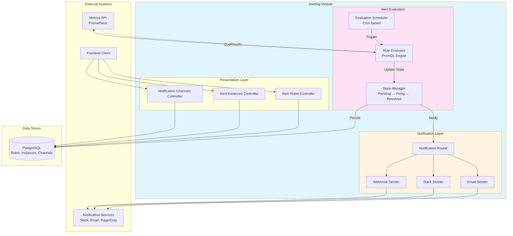
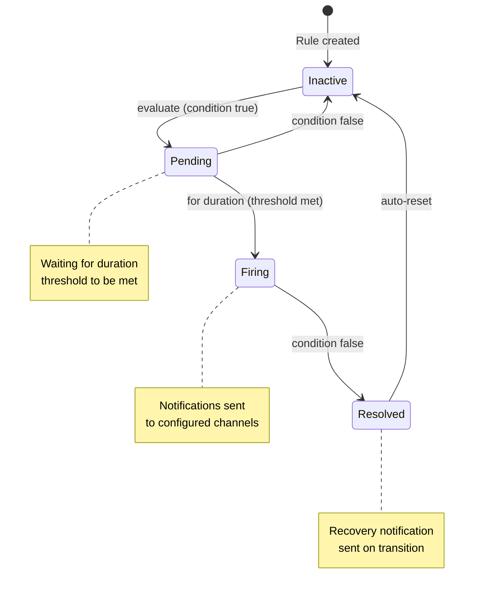

# Data Flow Diagram (DFD) - Alerting Module

## Overview

The Alerting Module implements alert rule evaluation, instance management, and notifications.

## Data Flow Diagram

## Alert State Machine

## Key Components

### Rule Evaluator

- Executes PromQL queries against metrics
- Compares results against thresholds
- Manages pending → firing transitions

### State Manager

- Tracks alert instance states
- Handles duration-based firing
- Records state transitions

### Notification Router

- Routes alerts to configured channels
- Handles grouping and throttling
- Manages notification retries

---

**License**: Apache-2.0
**Module Status**: Production-ready
