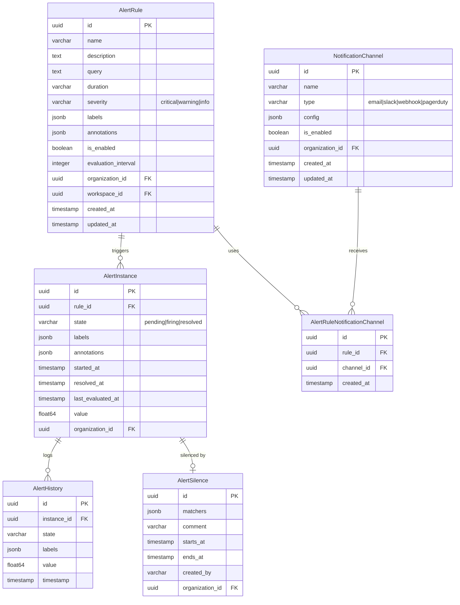

# Alerting Module - Entity Relationship Diagram

## Overview

This ERD represents the Alerting module entities for alert rules, instances, and notifications.

## Entity Relationship Diagram

## Key Constraints

- AlertRule.name: Unique per organization
- NotificationChannel.name: Unique per organization
- AlertRuleNotificationChannel: Unique (rule_id, channel_id)

## Indexes

- AlertRule: (organization_id, is_enabled)
- AlertInstance: (organization_id, state)
- AlertInstance: (rule_id, state)
- AlertHistory: (instance_id, timestamp)
