# Audit Module - Data Flow Diagram

## Level 0: Context Diagram

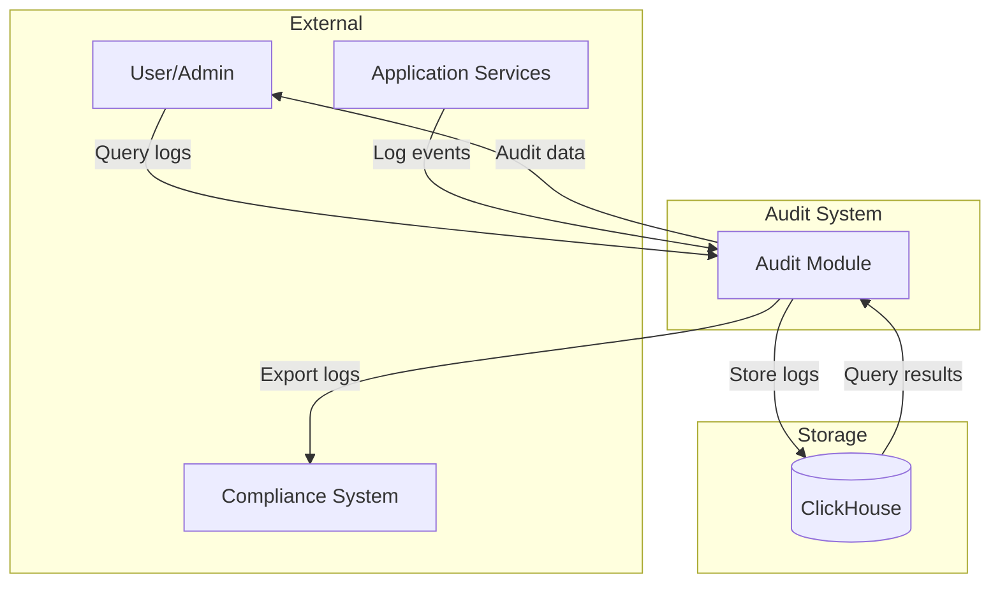

## Level 1: Main Processes

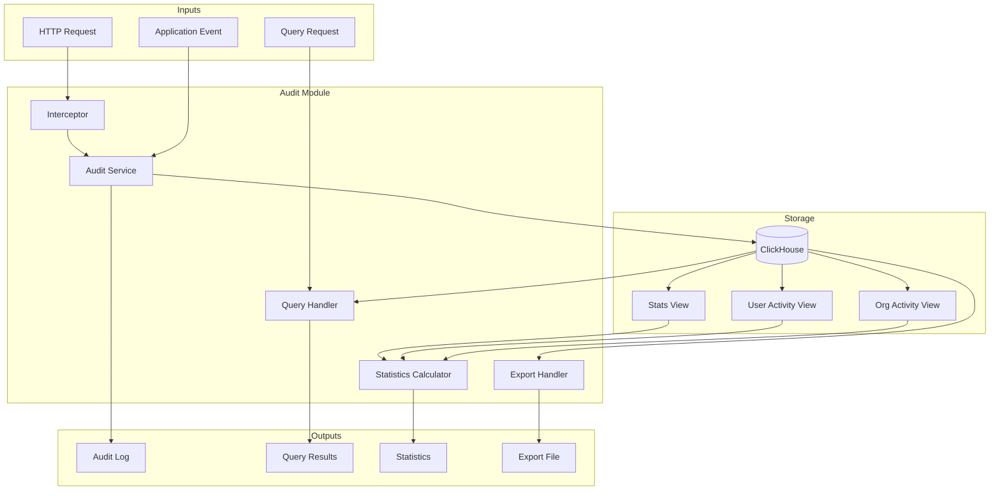

## Level 2: Detailed Process Flows

### 2.1 Request Interception Flow

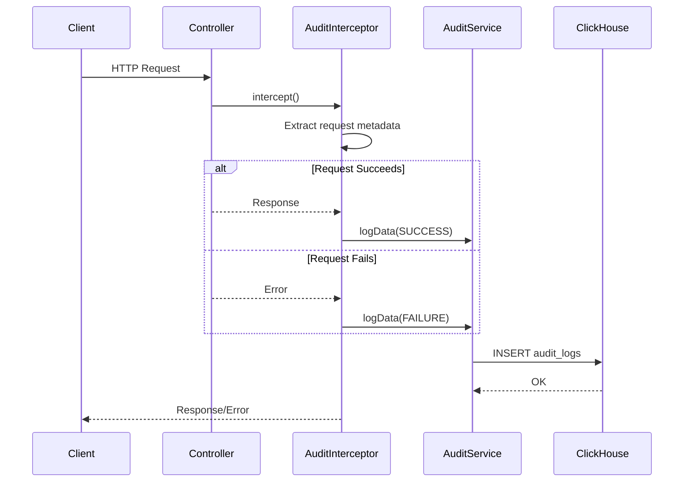

### 2.2 Authentication Audit Flow

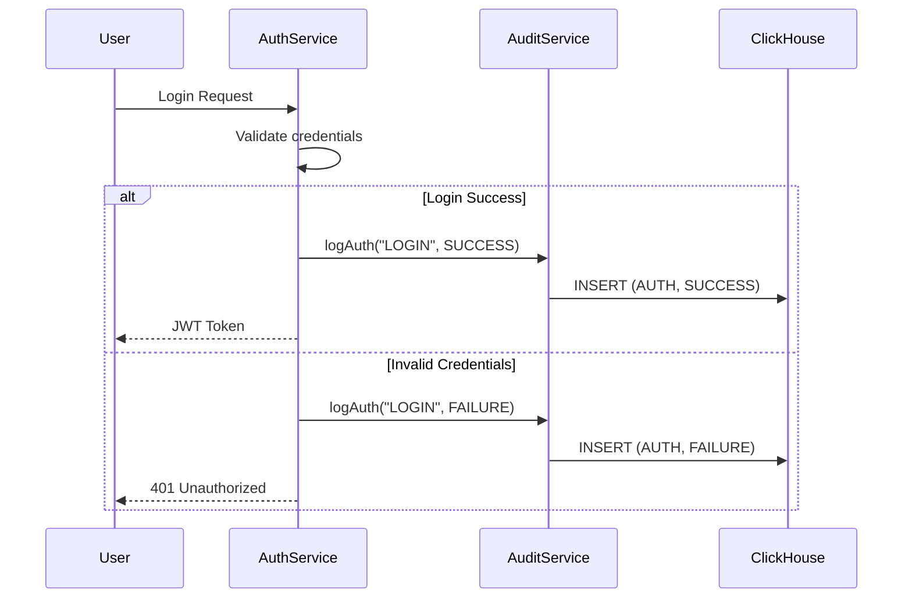

### 2.3 Authorization Audit Flow

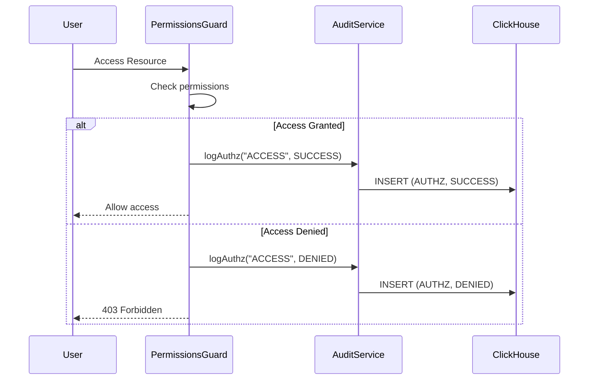

### 2.4 Data Operation Audit Flow

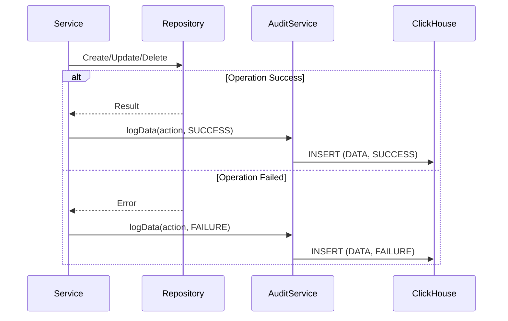

### 2.5 Query Flow

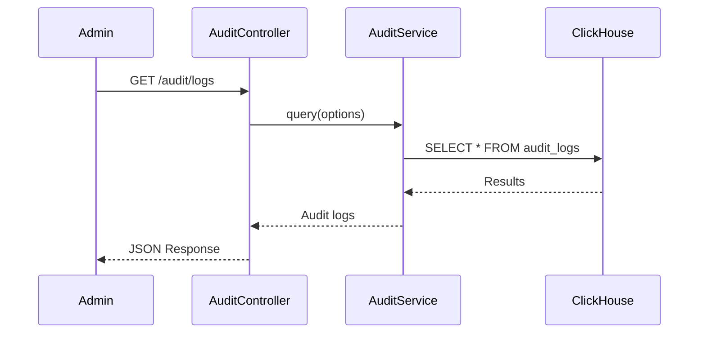

### 2.6 Statistics Flow

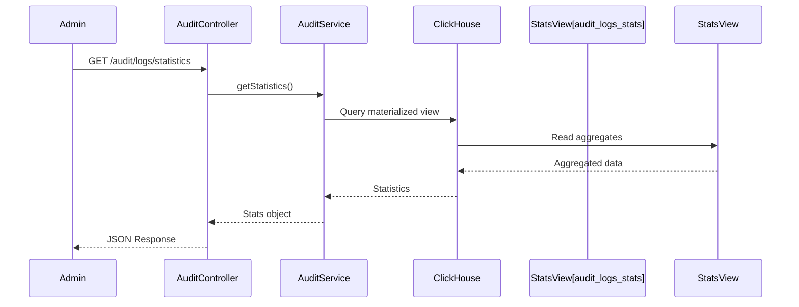

### 2.7 Export Flow

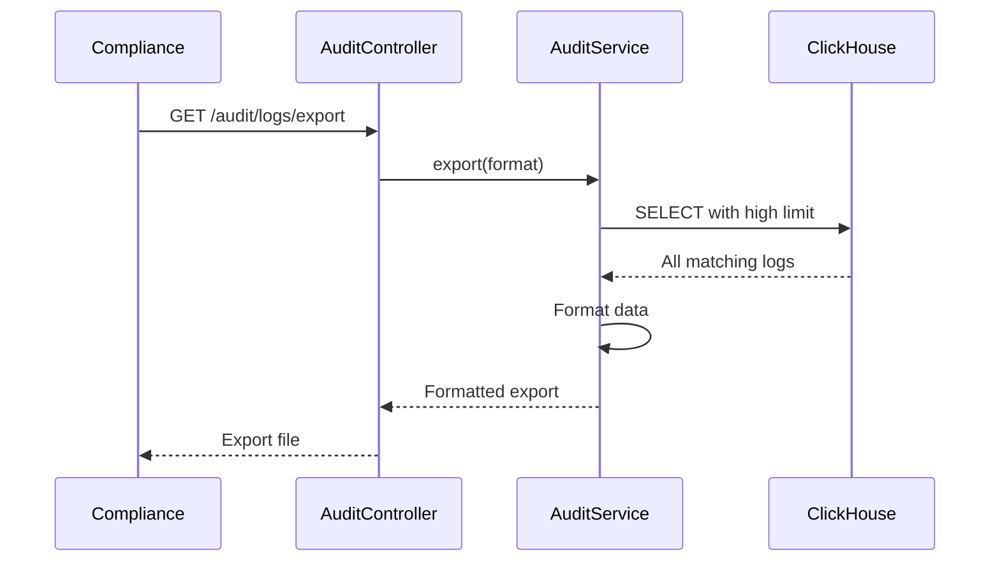

## Event Type Processing

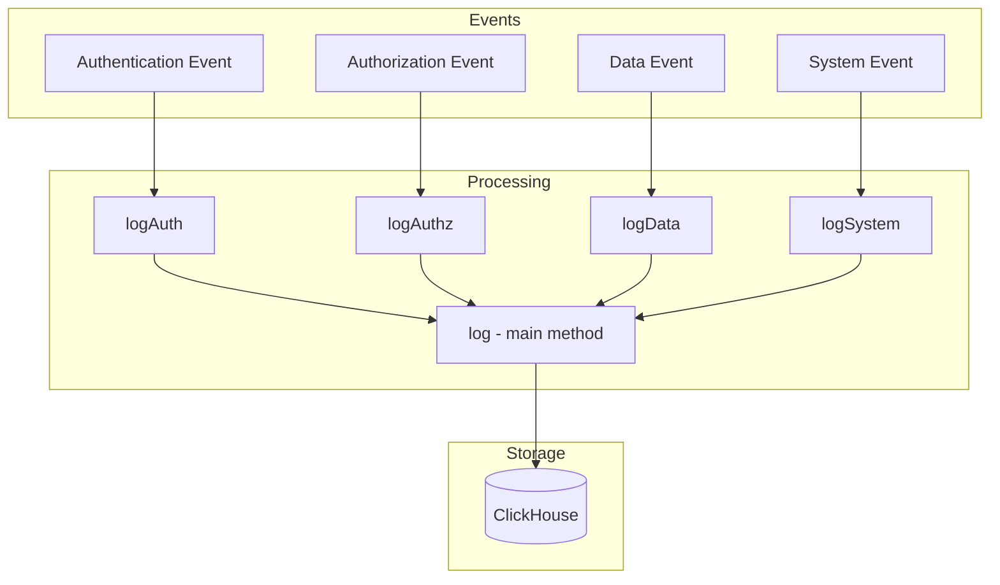

## Data Store Details

| Store | Type | Purpose |
|-------|------|---------|
| audit_logs | ClickHouse Table | Primary audit log storage |
| audit_logs_stats | Materialized View | Pre-aggregated statistics |
| audit_logs_user_activity | Materialized View | Per-user activity tracking |
| audit_logs_org_activity | Materialized View | Per-organization tracking |

## Security Considerations

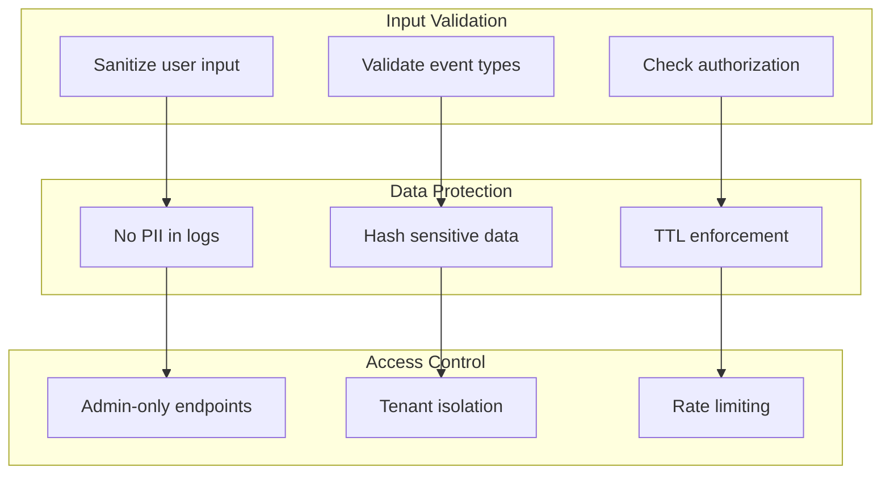
