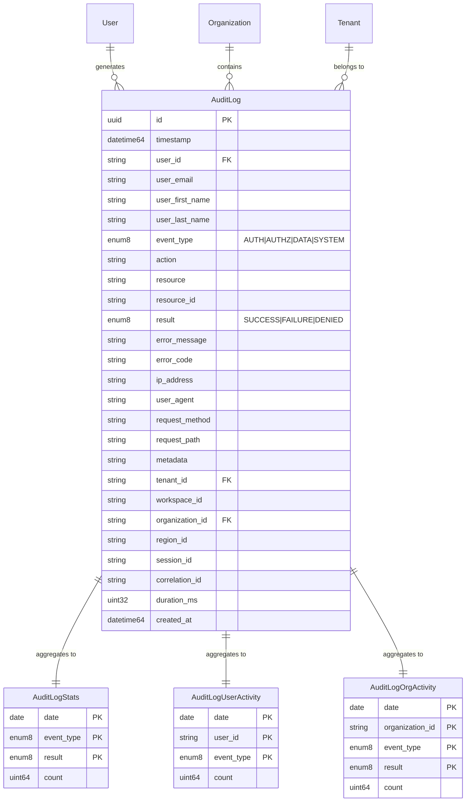
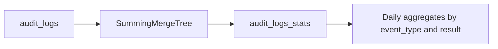
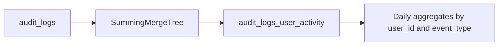
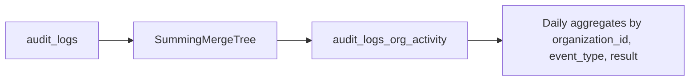
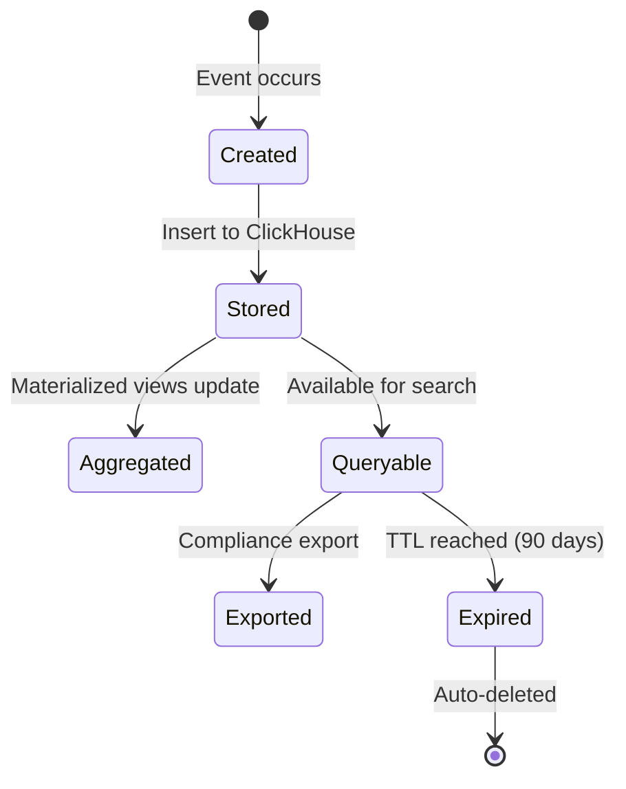

# Audit Module - Entity Relationship Diagram

## Overview

This ERD represents the Audit module entities stored in ClickHouse for high-performance audit logging and analytics.

## Entity Relationship Diagram



## Detailed Schema

### audit_logs Table (ClickHouse)

```sql
CREATE TABLE audit_logs (
    -- Primary fields
    id UUID DEFAULT generateUUIDv4(),
    timestamp DateTime64(3) DEFAULT now64(3),

    -- User information
    user_id String,
    user_email String,
    user_first_name String,
    user_last_name String,

    -- Event information
    event_type Enum8('AUTH' = 1, 'AUTHZ' = 2, 'DATA' = 3, 'SYSTEM' = 4),
    action String,
    resource String,
    resource_id String,
    result Enum8('SUCCESS' = 1, 'FAILURE' = 2, 'DENIED' = 3),

    -- Error information
    error_message String,
    error_code String,

    -- Request information
    ip_address String,
    user_agent String,
    request_method String,
    request_path String,

    -- Additional metadata (JSON string)
    metadata String,

    -- Multi-tenancy
    tenant_id String,
    workspace_id String,
    organization_id String,
    region_id String,

    -- Session tracking
    session_id String,
    correlation_id String,

    -- Performance tracking
    duration_ms UInt32,

    -- Timestamps
    created_at DateTime64(3) DEFAULT now64(3)
)
ENGINE = MergeTree()
PARTITION BY toYYYYMM(timestamp)
ORDER BY (timestamp, event_type, user_id)
TTL timestamp + INTERVAL 90 DAY
SETTINGS index_granularity = 8192
```

### Indexes

```sql
-- Bloom filter indexes for high-cardinality columns
CREATE INDEX idx_user_id ON audit_logs(user_id) TYPE bloom_filter;
CREATE INDEX idx_action ON audit_logs(action) TYPE bloom_filter;
CREATE INDEX idx_resource ON audit_logs(resource) TYPE bloom_filter;
CREATE INDEX idx_tenant_id ON audit_logs(tenant_id) TYPE bloom_filter;
CREATE INDEX idx_organization_id ON audit_logs(organization_id) TYPE bloom_filter;
CREATE INDEX idx_session_id ON audit_logs(session_id) TYPE bloom_filter;
CREATE INDEX idx_correlation_id ON audit_logs(correlation_id) TYPE bloom_filter;

-- Set indexes for low-cardinality enums
CREATE INDEX idx_event_type ON audit_logs(event_type) TYPE set(0);
CREATE INDEX idx_result ON audit_logs(result) TYPE set(0);
```

## Materialized Views

### Statistics View



### User Activity View



### Organization Activity View



## Cardinality Summary

| Field | Cardinality | Index Type |
|-------|-------------|------------|
| event_type | Very Low (4 values) | set(0) |
| result | Very Low (3 values) | set(0) |
| user_id | High | bloom_filter |
| action | Medium | bloom_filter |
| resource | High | bloom_filter |
| tenant_id | Low | bloom_filter |
| organization_id | Low | bloom_filter |

## Audit Log Lifecycle


