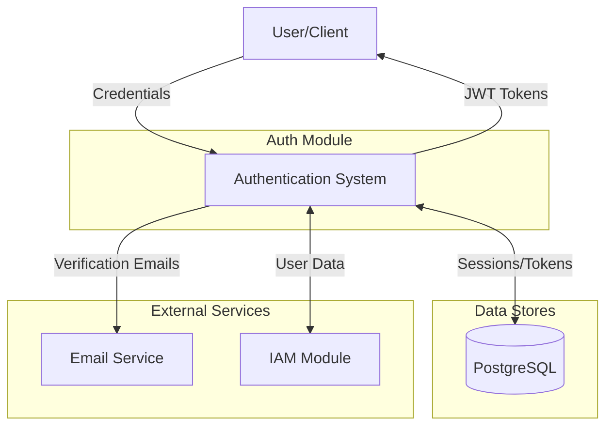
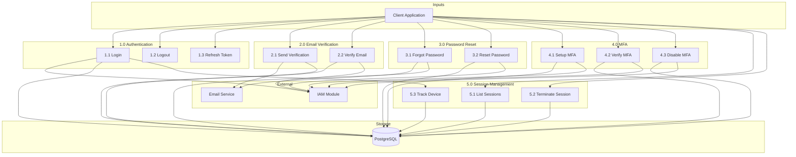
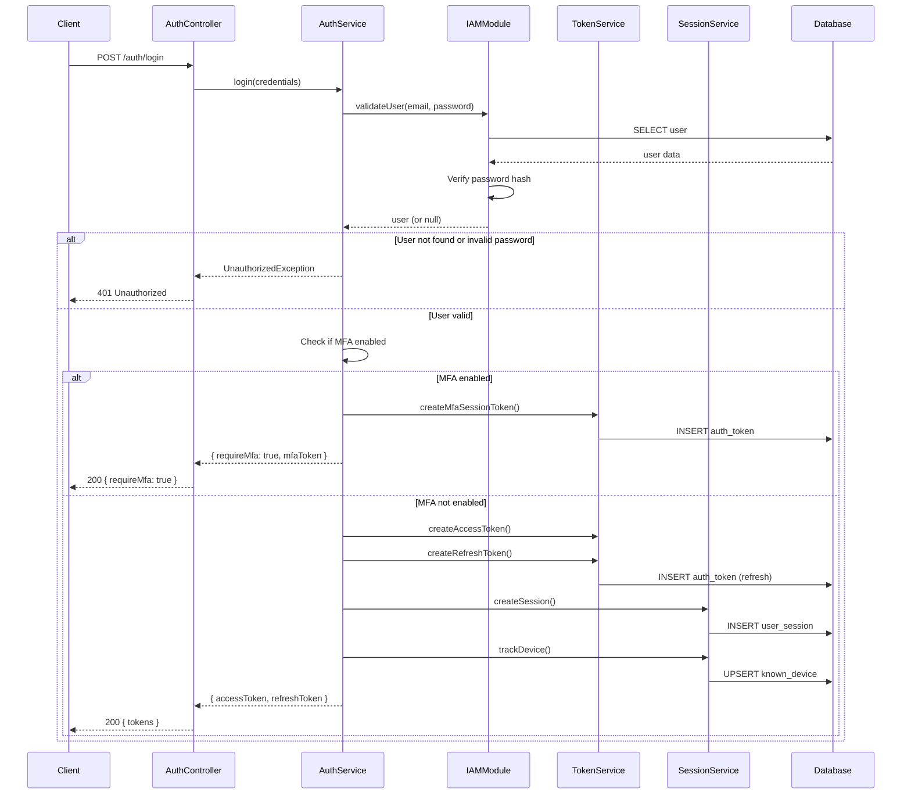
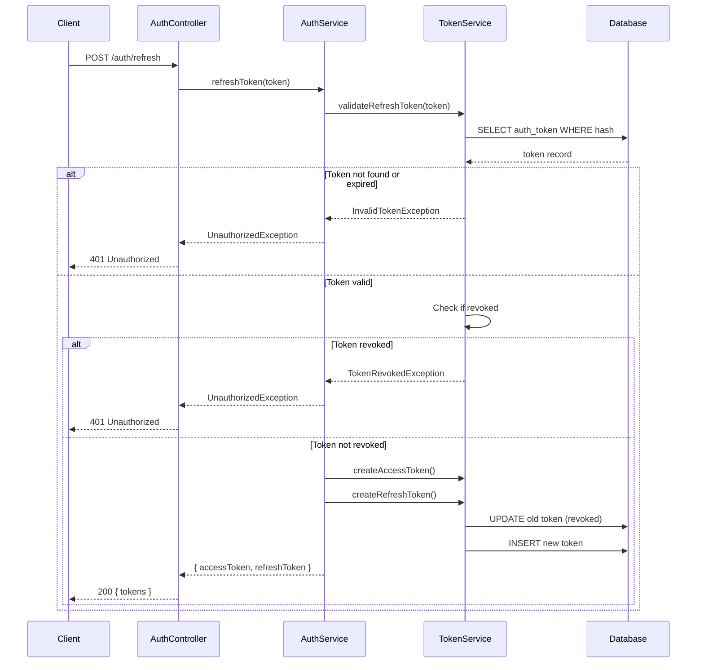
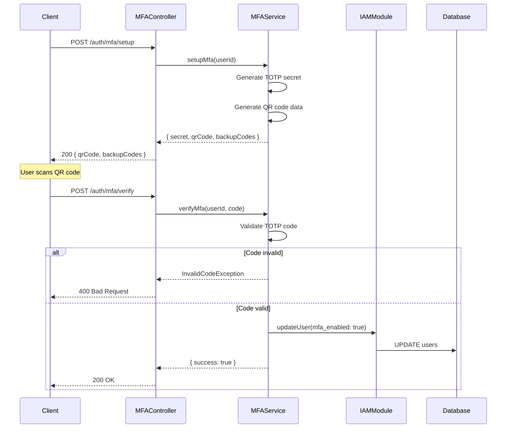
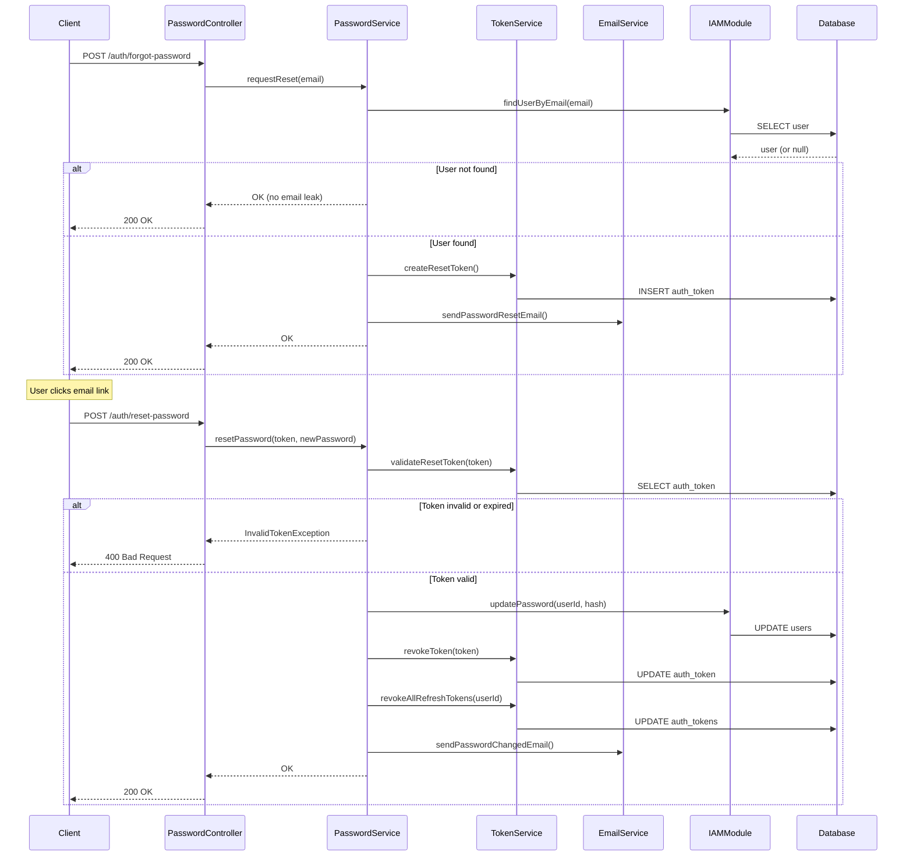
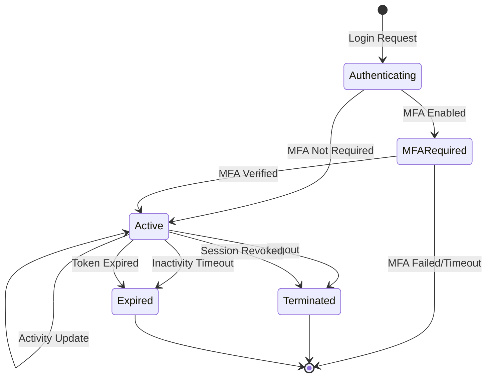

# Auth Module - Data Flow Diagram

## Overview

This DFD illustrates the data flow for authentication, session management, and security features in the TelemetryFlow Platform.

## Level 0 - Context Diagram

## Level 1 - Main Processes

## Level 2 - Login Flow

## Level 2 - Token Refresh Flow

## Level 2 - MFA Setup Flow

## Level 2 - Password Reset Flow

## Session State Diagram

## Data Stores

| Store | Tables | Purpose |
|-------|--------|---------|
| PostgreSQL | auth_tokens | Token storage and validation |
| PostgreSQL | user_sessions | Session tracking |
| PostgreSQL | known_devices | Device recognition |
| PostgreSQL | users | User data (via IAM module) |
