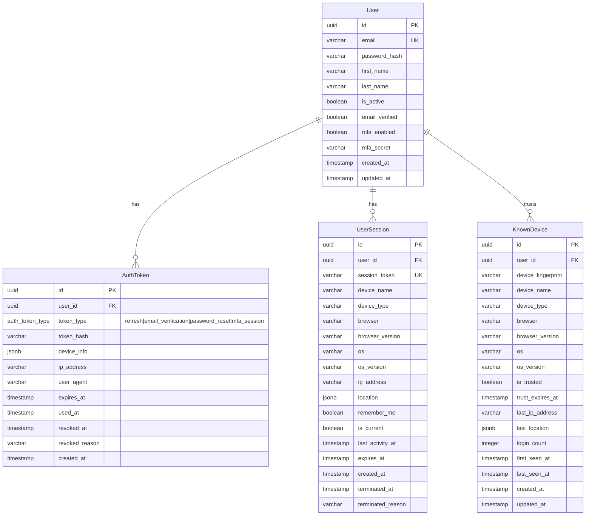
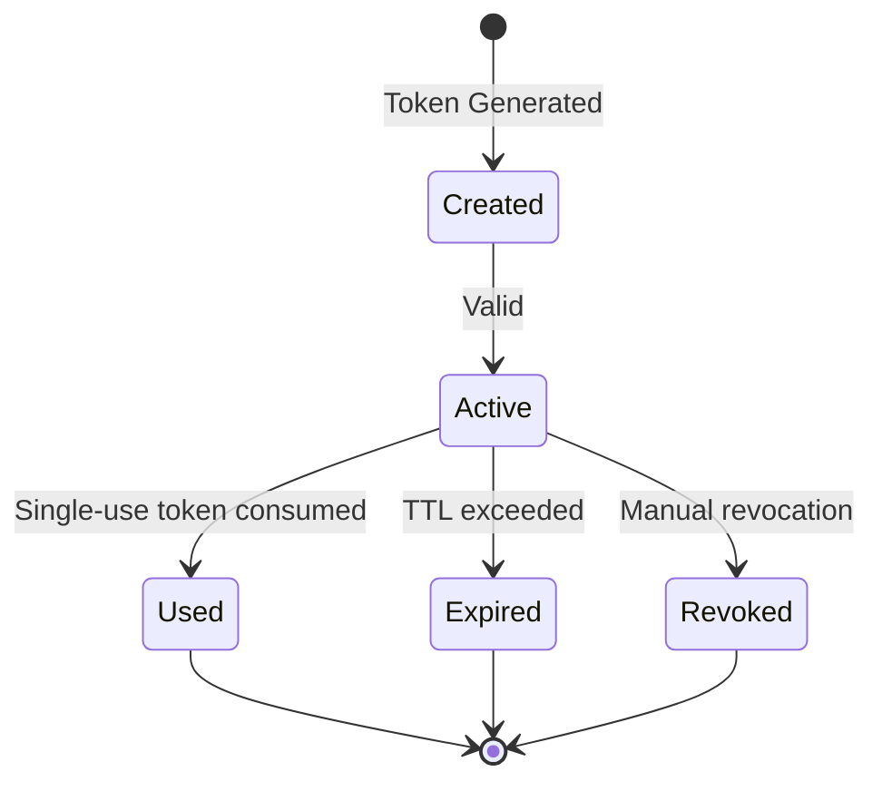
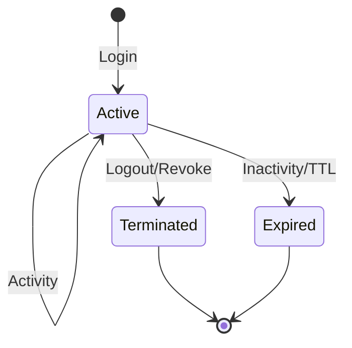

# Auth Module - Entity Relationship Diagram

## Overview

This ERD represents the Auth module entities and their relationships for authentication, session management, and security features.

## Entity Relationship Diagram



## Detailed Schema

### auth_tokens Table

```sql
CREATE TABLE auth_tokens (
    id UUID PRIMARY KEY DEFAULT uuid_generate_v4(),
    user_id UUID NOT NULL REFERENCES users(id) ON DELETE CASCADE,
    token_type auth_token_type NOT NULL,
    token_hash VARCHAR(255) NOT NULL,
    device_info JSONB,
    ip_address VARCHAR(45),
    user_agent VARCHAR(500),
    expires_at TIMESTAMP NOT NULL,
    used_at TIMESTAMP,
    revoked_at TIMESTAMP,
    revoked_reason VARCHAR(255),
    created_at TIMESTAMP DEFAULT CURRENT_TIMESTAMP
);

-- Token type enum
CREATE TYPE auth_token_type AS ENUM (
    'refresh',
    'email_verification',
    'password_reset',
    'mfa_session',
    'recovery_email_verification'
);

-- Indexes
CREATE INDEX IDX_auth_tokens_user_id ON auth_tokens(user_id);
CREATE INDEX IDX_auth_tokens_token_hash ON auth_tokens(token_hash);
CREATE INDEX IDX_auth_tokens_type_user ON auth_tokens(token_type, user_id);
```

### user_sessions Table

```sql
CREATE TABLE user_sessions (
    id UUID PRIMARY KEY DEFAULT uuid_generate_v4(),
    user_id UUID NOT NULL REFERENCES users(id) ON DELETE CASCADE,
    session_token VARCHAR(255) NOT NULL UNIQUE,
    device_name VARCHAR(255),
    device_type VARCHAR(50),
    browser VARCHAR(100),
    browser_version VARCHAR(50),
    os VARCHAR(100),
    os_version VARCHAR(50),
    ip_address VARCHAR(45),
    location JSONB,
    remember_me BOOLEAN DEFAULT FALSE,
    is_current BOOLEAN DEFAULT FALSE,
    last_activity_at TIMESTAMP DEFAULT CURRENT_TIMESTAMP,
    expires_at TIMESTAMP NOT NULL,
    created_at TIMESTAMP DEFAULT CURRENT_TIMESTAMP,
    terminated_at TIMESTAMP,
    terminated_reason VARCHAR(255)
);

-- Indexes
CREATE INDEX IDX_user_sessions_user_id ON user_sessions(user_id);
CREATE INDEX IDX_user_sessions_token ON user_sessions(session_token);
```

### known_devices Table

```sql
CREATE TABLE known_devices (
    id UUID PRIMARY KEY DEFAULT uuid_generate_v4(),
    user_id UUID NOT NULL REFERENCES users(id) ON DELETE CASCADE,
    device_fingerprint VARCHAR(255) NOT NULL,
    device_name VARCHAR(255),
    device_type VARCHAR(50),
    browser VARCHAR(100),
    browser_version VARCHAR(50),
    os VARCHAR(100),
    os_version VARCHAR(50),
    is_trusted BOOLEAN DEFAULT FALSE,
    trust_expires_at TIMESTAMP,
    last_ip_address VARCHAR(45),
    last_location JSONB,
    login_count INTEGER DEFAULT 1,
    first_seen_at TIMESTAMP DEFAULT CURRENT_TIMESTAMP,
    last_seen_at TIMESTAMP DEFAULT CURRENT_TIMESTAMP,
    created_at TIMESTAMP DEFAULT CURRENT_TIMESTAMP,
    updated_at TIMESTAMP DEFAULT CURRENT_TIMESTAMP
);

-- Indexes
CREATE INDEX IDX_known_devices_user_id ON known_devices(user_id);
CREATE INDEX IDX_known_devices_fingerprint ON known_devices(device_fingerprint);
CREATE UNIQUE INDEX IDX_known_devices_user_fingerprint ON known_devices(user_id, device_fingerprint);
```

## Cardinality Summary

| Relationship | Cardinality | Description |
|--------------|-------------|-------------|
| User → AuthToken | 1:N | One user can have many tokens |
| User → UserSession | 1:N | One user can have many active sessions |
| User → KnownDevice | 1:N | One user can have many known devices |

## Token Lifecycle



## Session Lifecycle


