# Notification Module - Data Flow Diagram

## Level 0: Context Diagram

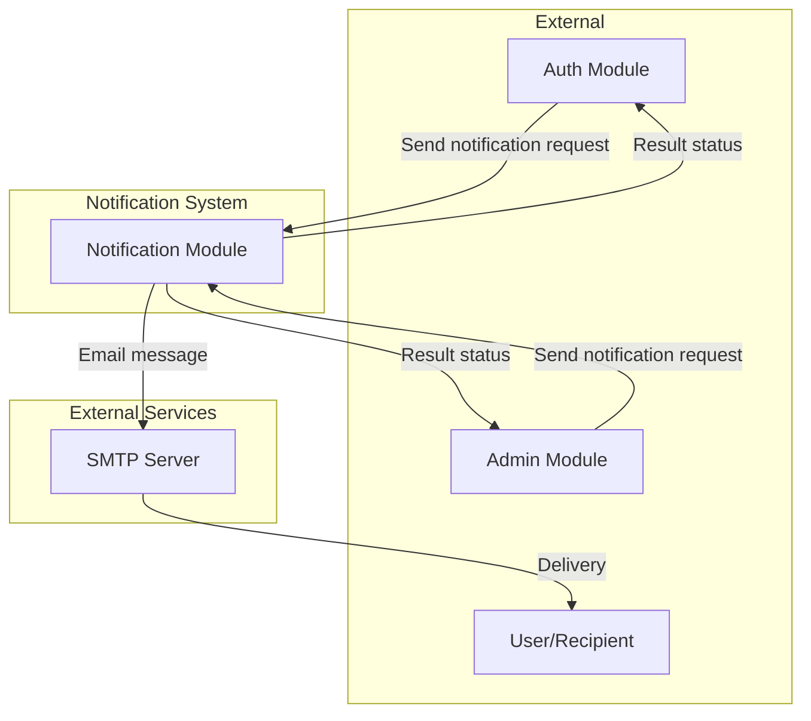

## Level 1: Main Processes

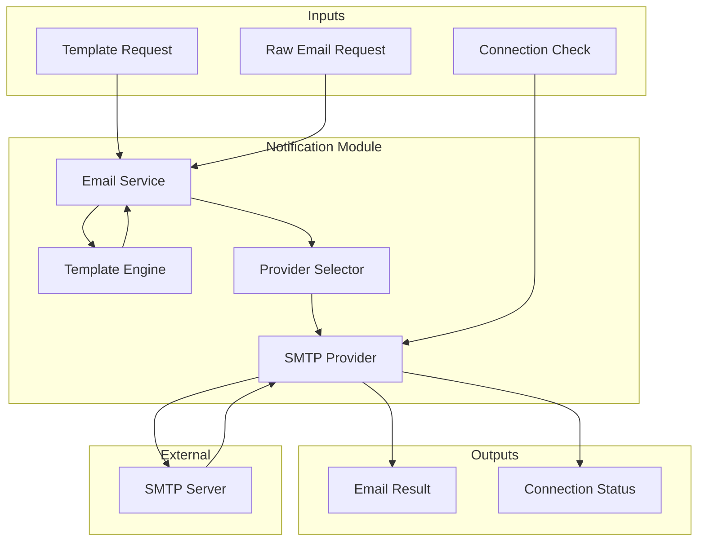

## Level 2: Detailed Process Flows

### 2.1 Registration Verification Email Flow

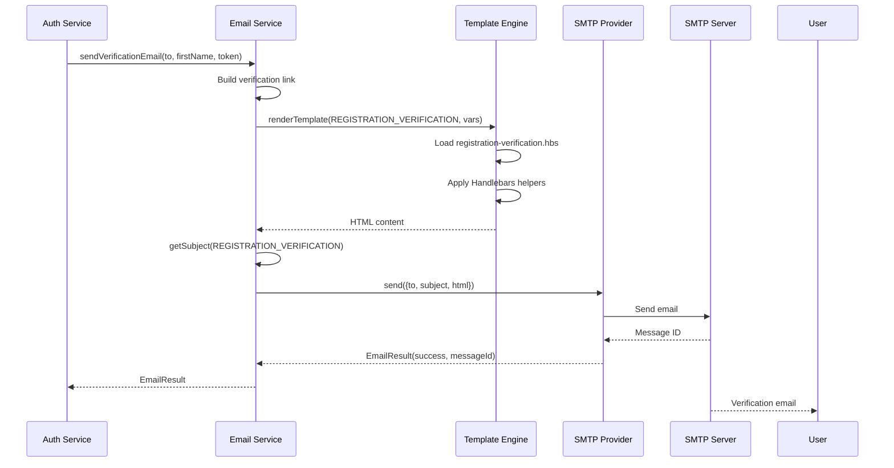

### 2.2 Password Reset Email Flow

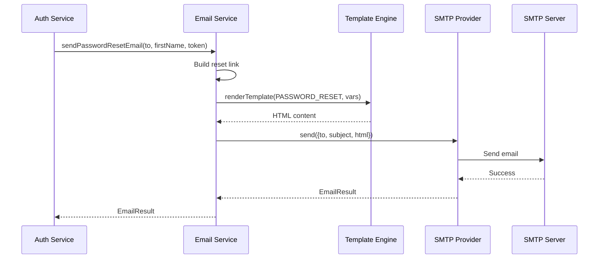

### 2.3 Security Alert Email Flow

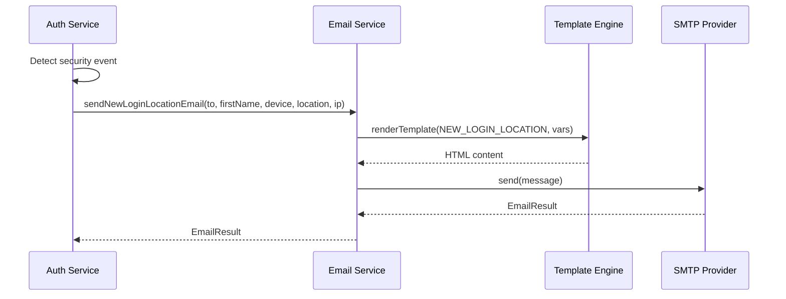

### 2.4 Email OTP Flow

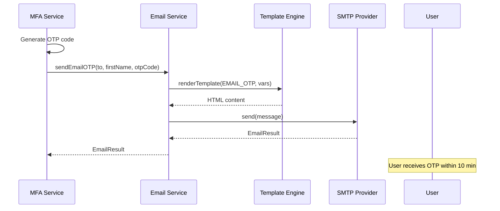

### 2.5 Template Loading Flow

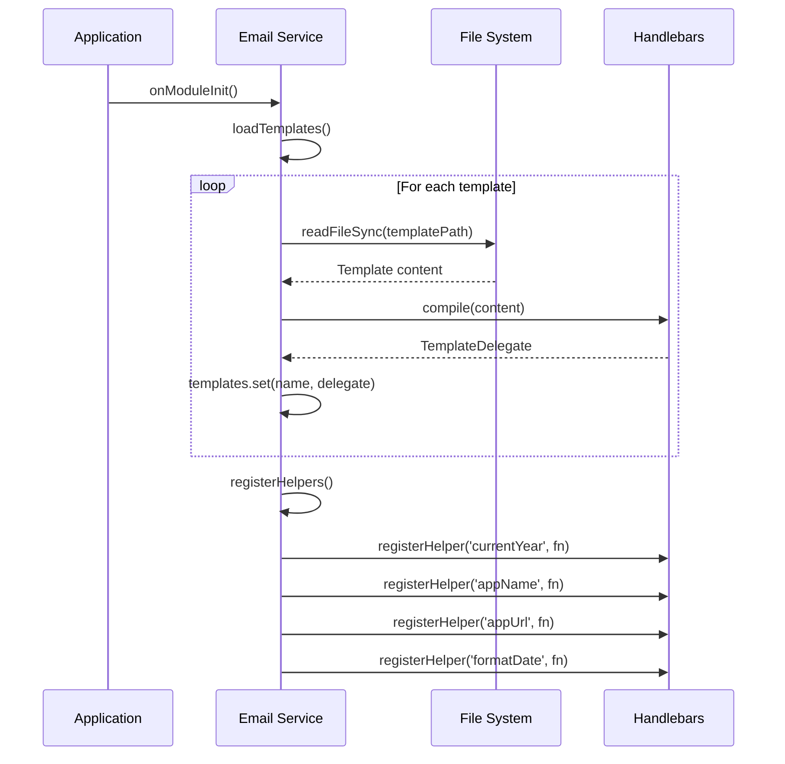

### 2.6 Connection Verification Flow

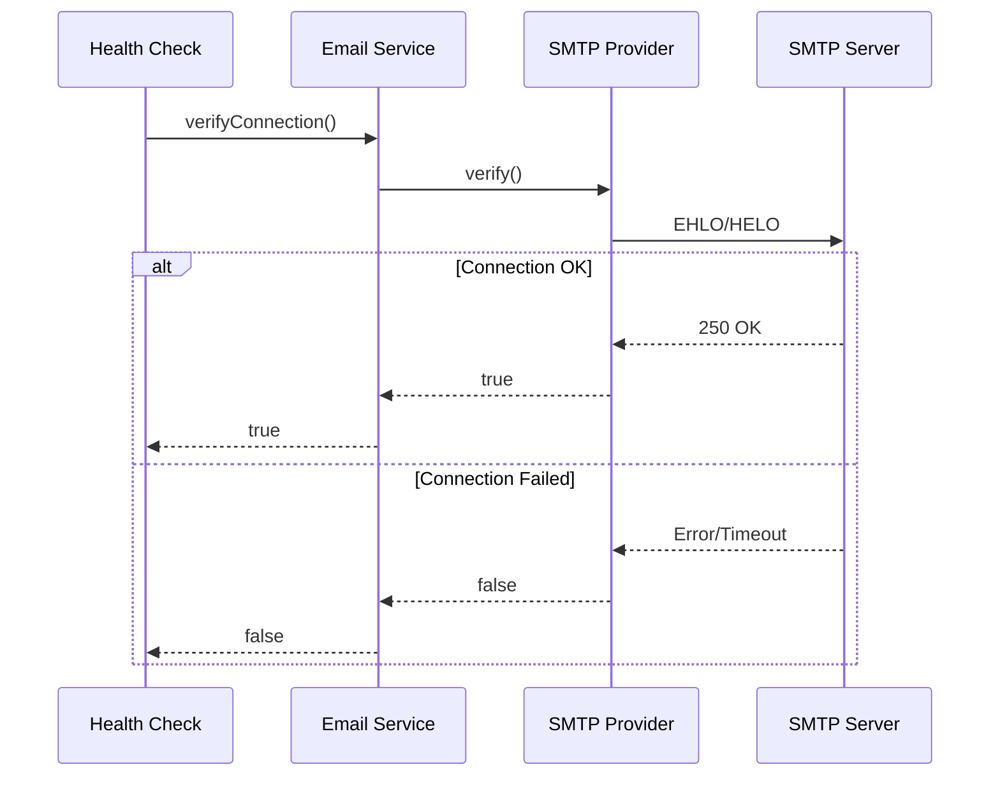

## Error Handling Flow

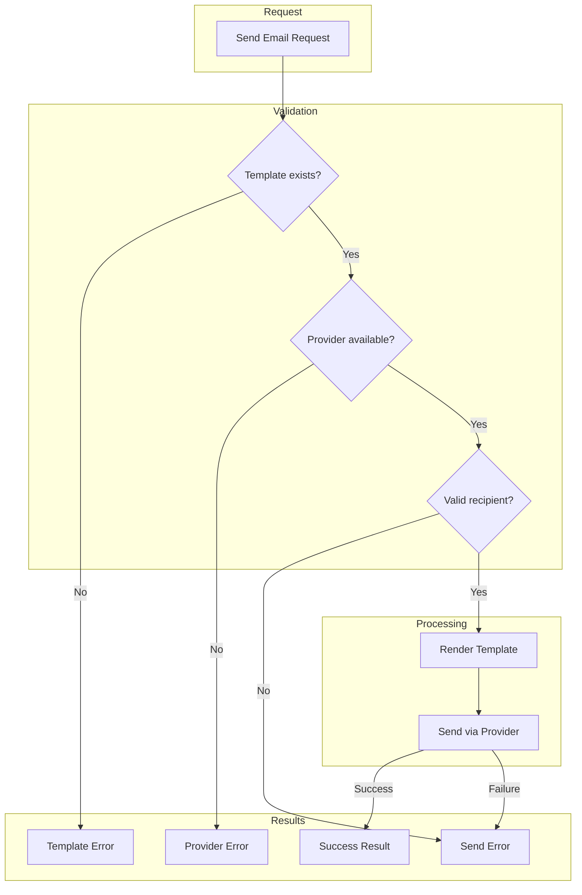

## Template Processing Flow

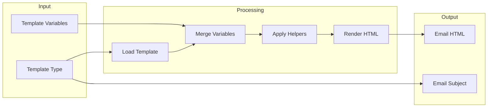

## Data Store Details

| Component     | Type        | Purpose                   |
| ------------- | ----------- | ------------------------- |
| Templates     | File System | HBS template files        |
| templates Map | Memory      | Compiled template cache   |
| ConfigService | NestJS      | Environment configuration |

## Provider Extension Points

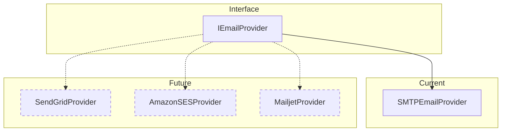
