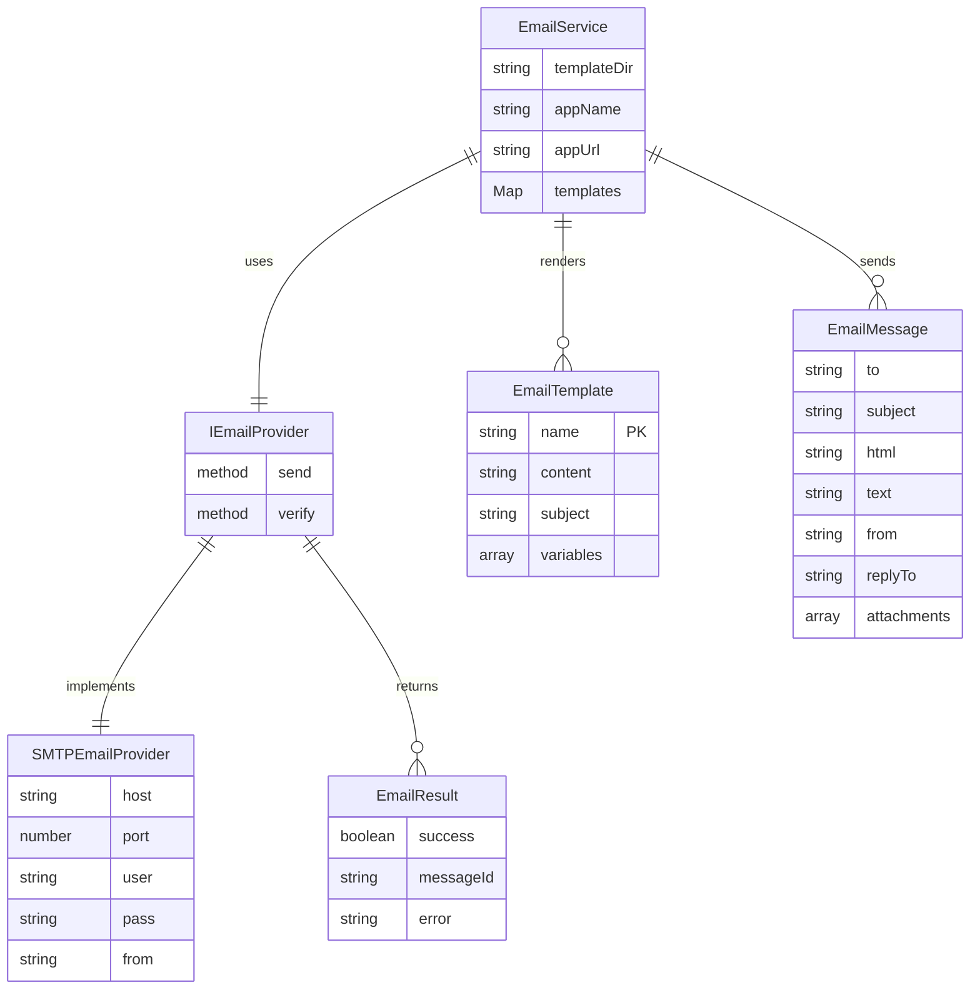
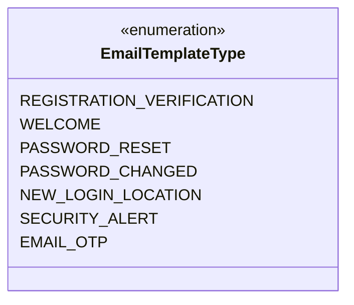
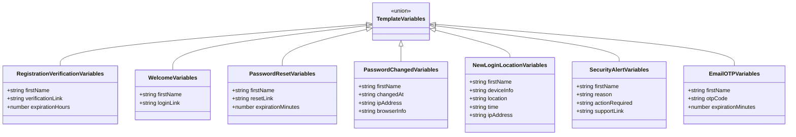
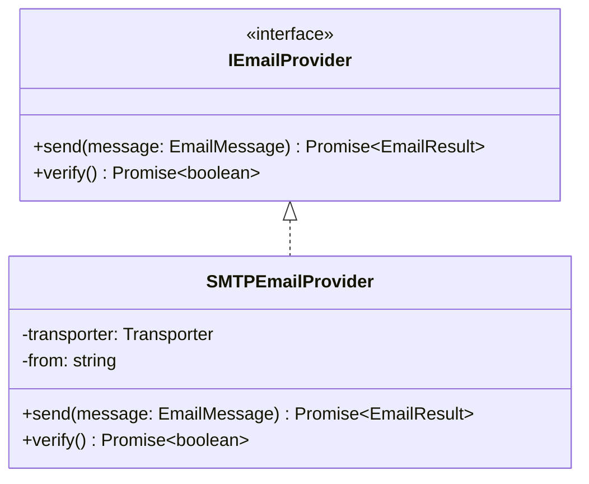
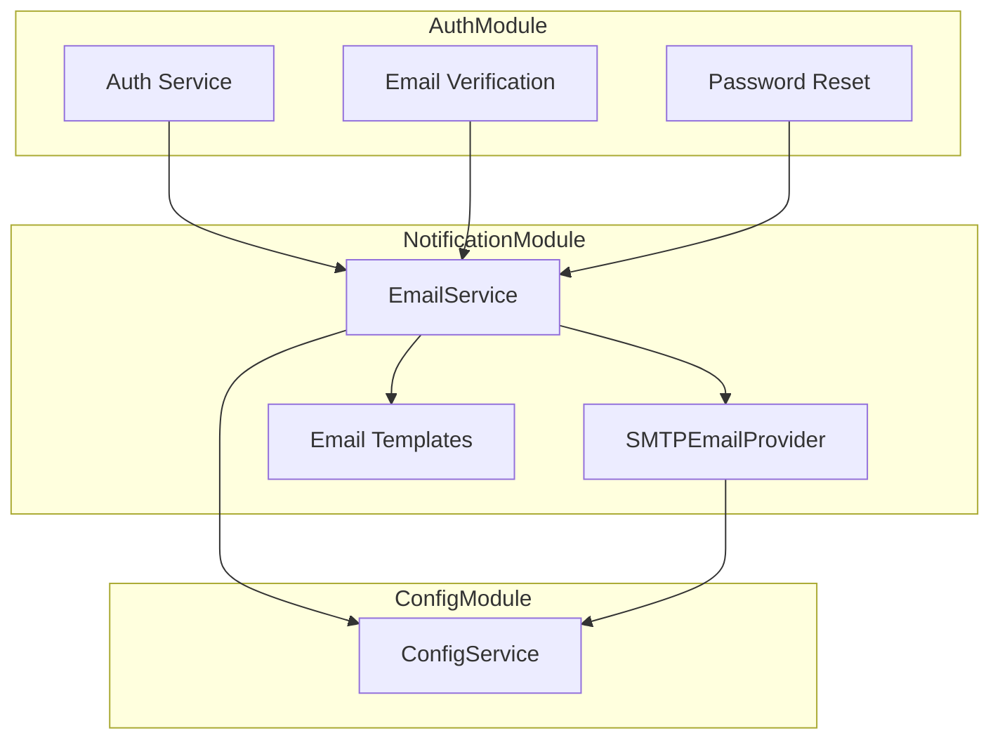
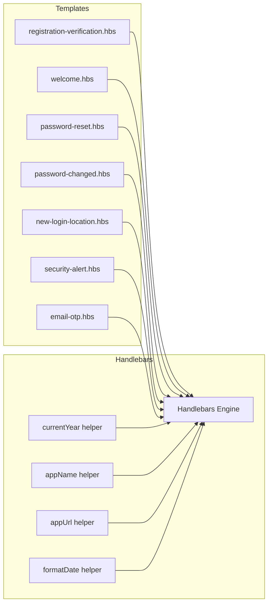
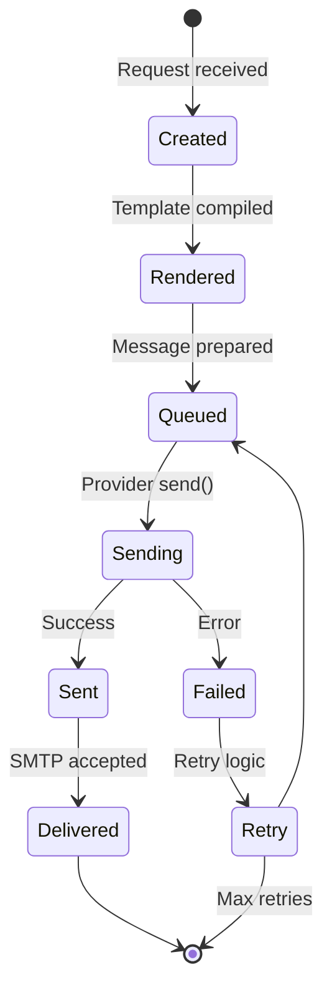

# Notification Module - Entity Relationship Diagram

## Overview

The Notification module is a stateless service that handles outbound communications. It does not persist data directly but interacts with other modules for sending notifications.

## Component Relationship Diagram

## Template Types Enum

## Template Variables

## Provider Interface

## Module Dependencies

## Template File Structure

## Email Lifecycle

