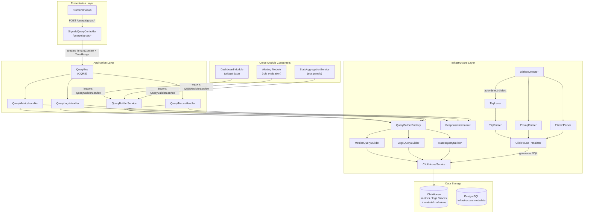
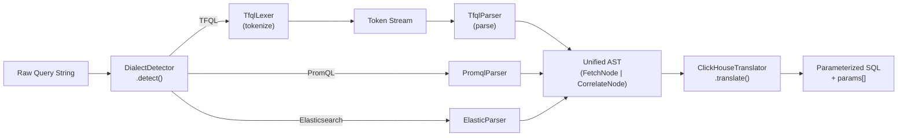
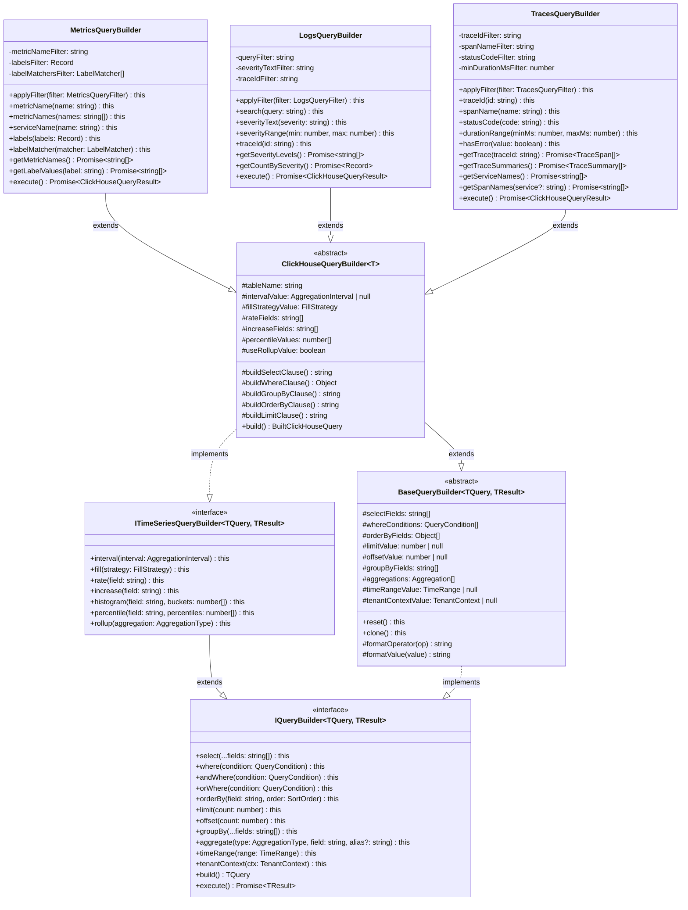
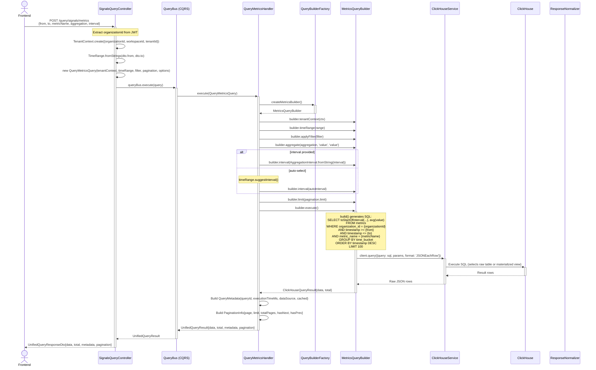
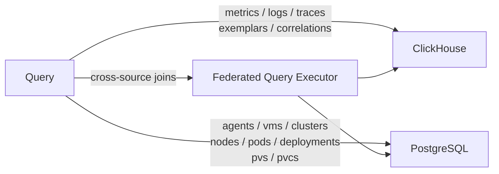
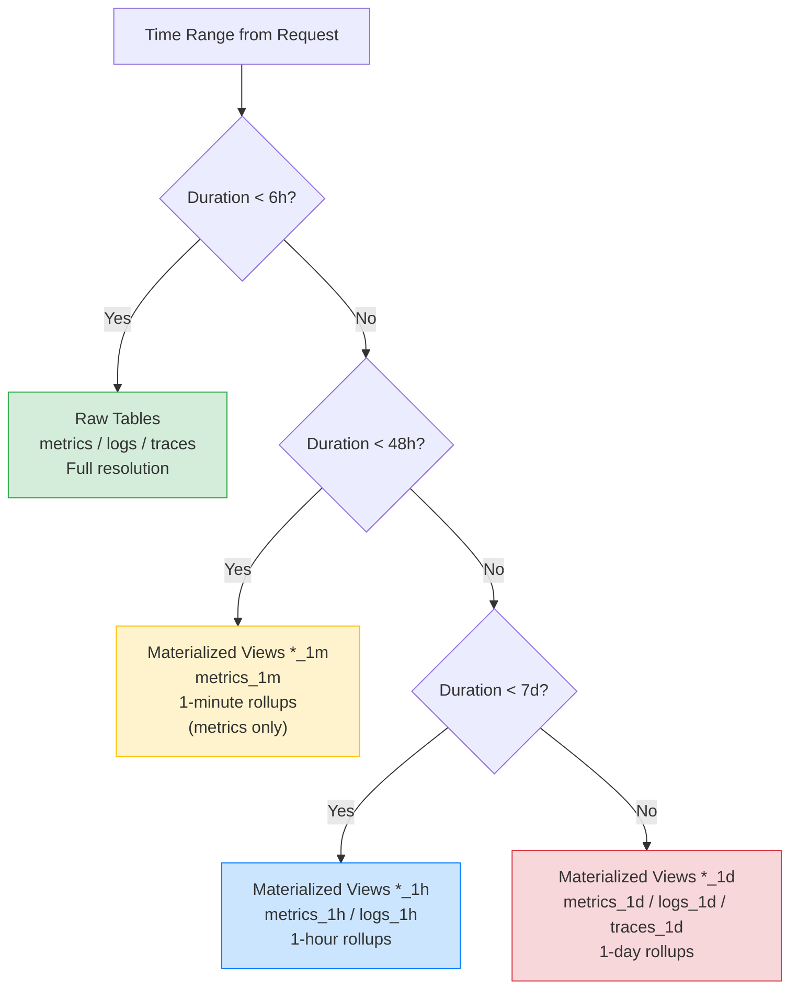
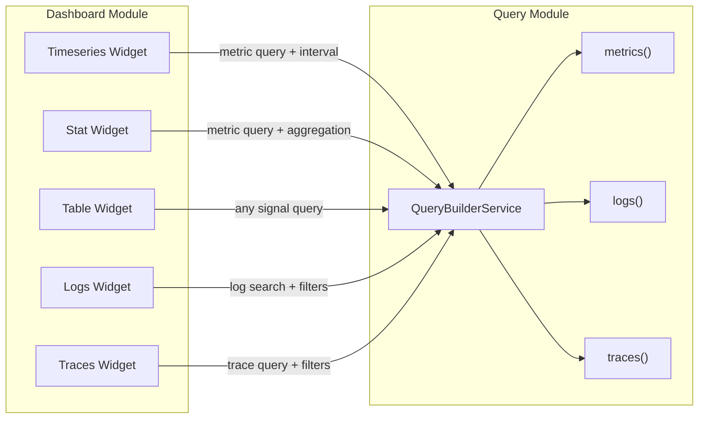
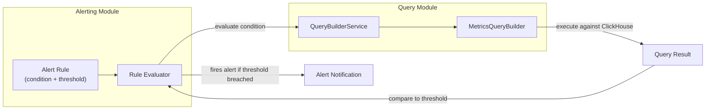

# Query Module

**Version**: 1.0.0
**Type**: Self-Contained DDD Module
**Status**: Production Ready

---

## Module Overview

The Query module provides a **unified query system** across all telemetry and infrastructure data in the TelemetryFlow Platform. It serves as the single entry point for reading observability signals (metrics, logs, traces, exemplars, correlations) stored in ClickHouse, as well as infrastructure metadata stored in PostgreSQL.

The module supports three query language dialects:

| Dialect           | Format                                                       | Use Case                            |
| ----------------- | ------------------------------------------------------------ | ----------------------------------- |
| **TFQL**          | `FETCH metrics WHERE service_name = 'api' TIMERANGE LAST 1h` | Native TelemetryFlow Query Language |
| **PromQL**        | `rate(http_requests_total{job="api"}[5m])`                   | Prometheus-compatible queries       |
| **Elasticsearch** | `{"query":{"bool":{"must":[{"match":{"body":"error"}}]}}}`   | Elasticsearch JSON DSL              |

Key capabilities:

- Fluent query builder API with signal-specific builders for metrics, logs, and traces
- CQRS-based query dispatch via NestJS `QueryBus`
- Automatic aggregation interval selection based on time range
- Materialized view selection for optimal query performance
- Multi-tenant isolation at every query layer (`organization_id`, `workspace_id`, `tenant_id`)
- Cross-module integration: exported `QueryBuilderService` used by Dashboard, Alerting, and other modules

---

## Architecture



---

## TFQL Language Pipeline

The TelemetryFlow Query Language (TFQL) is the platform's native query dialect. Queries written in TFQL, PromQL, or Elasticsearch DSL all pass through a unified parsing pipeline that produces ClickHouse-compatible SQL.

### Parser Pipeline



### Dialect Detection

The `DialectDetector` uses pattern-matching heuristics to determine the query language:

| Pattern                                      | Detected Dialect   |
| -------------------------------------------- | ------------------ |
| Starts with `FETCH` or `CORRELATE`           | TFQL               |
| Contains `rate(`, `{label="val"}`, `[5m]`    | PromQL             |
| Valid JSON with `query`, `bool`, `must` keys | Elasticsearch      |
| Starts with `SELECT`                         | SQL (pass-through) |
| No match                                     | Defaults to TFQL   |

The `detectWithConfidence()` method returns scored alternatives for ambiguous queries.

### TFQL Syntax Reference

```
FETCH <target>
  [field1, field2, ...]
  WHERE <condition> [AND|OR <condition>]*
  TIMERANGE <from> TO <to> | LAST <duration>
  AGGREGATE <function>(<field>) [BY <fields>]
  INTERVAL <duration>
  GROUP BY <fields>
  ORDER BY <field> [ASC|DESC]
  LIMIT <n>
  OFFSET <n>

CORRELATE
  FETCH <left_target> ...
  WITH
  FETCH <right_target> ...
  ON <join_field>
```

**Supported targets**: `metrics`, `logs`, `traces`, `exemplars`, `correlations`, `agents`, `vms`, `clusters`, `namespaces`, `nodes`, `pods`, `deployments`, `pvs`, `pvcs`

**Aggregation functions**: `count`, `sum`, `avg`, `min`, `max`, `rate`, `increase`, `irate`, `delta`, `p50`, `p75`, `p90`, `p95`, `p99`, `histogram_quantile`, `topk`, `bottomk`

### Token Types

The `TfqlLexer` produces the following token categories:

| Category               | Examples                                                                                               |
| ---------------------- | ------------------------------------------------------------------------------------------------------ |
| Keywords               | `FETCH`, `WHERE`, `AND`, `OR`, `TIMERANGE`, `LAST`, `AGGREGATE`, `INTERVAL`, `GROUP`, `ORDER`, `LIMIT` |
| Signal Targets         | `METRICS`, `LOGS`, `TRACES`, `EXEMPLARS`, `CORRELATIONS`                                               |
| Infrastructure Targets | `AGENTS`, `VMS`, `CLUSTERS`, `NAMESPACES`, `NODES`, `PODS`, `DEPLOYMENTS`, `PVS`, `PVCS`               |
| Aggregations           | `COUNT`, `SUM`, `AVG`, `MIN`, `MAX`, `RATE`, `P50`, `P95`, `P99`, `TOPK`                               |
| Literals               | `IDENTIFIER`, `STRING`, `NUMBER`, `DURATION`, `BOOLEAN`, `NULL`                                        |
| Operators              | `=`, `!=`, `>`, `<`, `>=`, `<=`, `~` (regex), `!~`                                                     |
| Punctuation            | `(`, `)`, `{`, `}`, `[`, `]`, `,`, `.`, `:`, `;`                                                       |

---

## Query Builder Hierarchy



### QueryBuilderFactory

The `QueryBuilderFactory` creates the appropriate builder based on `SignalType`:

| SignalType     | Builder Created                                     |
| -------------- | --------------------------------------------------- |
| `METRICS`      | `MetricsQueryBuilder` (table: `metrics`)            |
| `LOGS`         | `LogsQueryBuilder` (table: `logs`)                  |
| `TRACES`       | `TracesQueryBuilder` (table: `traces`)              |
| `EXEMPLARS`    | `MetricsQueryBuilder` (reused with exemplars table) |
| `CORRELATIONS` | `TracesQueryBuilder` (reused)                       |

---

## Data Flow

### Metrics Query Sequence



### Data Source Routing

All signal types (metrics, logs, traces, exemplars, correlations) are routed to **ClickHouse**. Infrastructure metadata queries (agents, VMs, K8s resources) are routed to **PostgreSQL**. The `getDataSource()` function in `SignalType.ts` determines routing:



---

## Materialized View Selection

For time-series queries, the query system automatically selects the optimal ClickHouse table or materialized view based on the requested time range. This ensures that wide time ranges do not scan excessively large raw tables.



### View Mapping Details

| Time Range   | Table / View                         | Resolution       | Available For | Suggested Interval |
| ------------ | ------------------------------------ | ---------------- | ------------- | ------------------ |
| < 6 hours    | `metrics`, `logs`, `traces`          | Raw (nanosecond) | All signals   | 1m - 5m            |
| 6h - 48h     | `metrics_1m`                         | 1 minute         | Metrics only  | 5m - 15m           |
| 48h - 7 days | `metrics_1h`, `logs_1h`              | 1 hour           | Metrics, Logs | 1h                 |
| 7+ days      | `metrics_1d`, `logs_1d`, `traces_1d` | 1 day            | All signals   | 6h - 1d            |

The `TimeRange.suggestInterval()` method recommends an aggregation interval:

| Duration    | Suggested Interval |
| ----------- | ------------------ |
| <= 1 hour   | `1m`               |
| <= 6 hours  | `5m`               |
| <= 24 hours | `15m`              |
| <= 7 days   | `1h`               |
| <= 30 days  | `6h`               |
| > 30 days   | `1d`               |

---

## Integration Points

### QueryBuilderService (Exported)

The `QueryModule` exports `QueryBuilderService` for use by other modules. Any module that needs to query telemetry data should import `QueryModule` and inject `QueryBuilderService`.

```typescript
// In your module
@Module({
  imports: [QueryModule],
})
export class YourModule {}

// In your service
@Injectable()
export class YourService {
  constructor(private readonly queryBuilderService: QueryBuilderService) {}

  async getMetricData() {
    const result = await this.queryBuilderService
      .metrics()
      .tenantContext(TenantContext.create({ organizationId: "org-123" }))
      .timeRange(TimeRange.lastHours(1))
      .metricName("http_requests_total")
      .aggregate(AggregationType.RATE, "value", "request_rate")
      .interval(AggregationInterval.FIVE_MINUTES)
      .groupBy("service_name")
      .execute();

    return result.data;
  }
}
```

### Dashboard Module Integration

Dashboard widgets wire their panel queries through the query system. Each widget type maps to a specific query builder:



| Widget Type   | Builder     | Typical Query                            |
| ------------- | ----------- | ---------------------------------------- |
| `timeseries`  | `metrics()` | Time-bucketed aggregation with interval  |
| `gauge`       | `metrics()` | Single-value aggregation (latest or avg) |
| `stat`        | `metrics()` | Single aggregation (count, avg, p99)     |
| `table`       | Any         | Tabular data with pagination             |
| `logs`        | `logs()`    | Full-text search with severity filter    |
| `traces`      | `traces()`  | Trace list with duration/error filters   |
| `heatmap`     | `metrics()` | Histogram with percentile buckets        |
| `service_map` | `traces()`  | Service dependency aggregation           |

### Alerting Module Integration

The Alerting module evaluates alert conditions by executing queries through `QueryBuilderService`:



Typical alerting query pattern:

```typescript
// Alert rule: "error rate > 5% in last 5 minutes"
const result = await this.queryBuilderService
  .metrics()
  .tenantContext(tenantCtx)
  .timeRange(TimeRange.lastMinutes(5))
  .metricName("http_errors_total")
  .aggregate(AggregationType.RATE, "value", "error_rate")
  .groupBy("service_name")
  .execute();

// Compare result.data against threshold
```

### StatsAggregationService

Stat panels across the platform (overview dashboards, module summaries) use `QueryBuilderService` to produce `TrendDataDto` and `ModuleStatisticsDto` responses (from `shared/dto/statistics.dto.ts`):

```typescript
// TrendDataDto: { current, previous, changePercent, direction }
const currentPeriod = await this.queryBuilderService
  .metrics()
  .tenantContext(ctx)
  .timeRange(TimeRange.lastHours(24))
  .metricName("requests_total")
  .aggregate(AggregationType.COUNT, "*", "total")
  .execute();

const previousPeriod = await this.queryBuilderService
  .metrics()
  .tenantContext(ctx)
  .timeRange(TimeRange.create(twoDaysAgo, oneDayAgo))
  .metricName("requests_total")
  .aggregate(AggregationType.COUNT, "*", "total")
  .execute();

return TrendDataDto.calculate(
  currentPeriod.data[0].total,
  previousPeriod.data[0].total,
);
```

---

## API Endpoints

All endpoints are prefixed with `/query/signals` and require `JwtAuthGuard` + `PermissionsGuard`.

### Metrics

| Method | Endpoint                                   | Permission               | Description                                               |
| ------ | ------------------------------------------ | ------------------------ | --------------------------------------------------------- |
| POST   | `/query/signals/metrics`                   | `telemetry:metrics:read` | Query metrics with aggregation, interval, label filters   |
| GET    | `/query/signals/metrics/names`             | `telemetry:metrics:read` | List available metric names (with optional prefix filter) |
| GET    | `/query/signals/metrics/labels/:labelName` | `telemetry:metrics:read` | Get distinct label values for a given label name          |

### Logs

| Method | Endpoint                                | Permission            | Description                                                       |
| ------ | --------------------------------------- | --------------------- | ----------------------------------------------------------------- |
| POST   | `/query/signals/logs`                   | `telemetry:logs:read` | Query logs with full-text search, severity, and attribute filters |
| GET    | `/query/signals/logs/severity-levels`   | `telemetry:logs:read` | Get distinct severity levels in the tenant's data                 |
| POST   | `/query/signals/logs/count-by-severity` | `telemetry:logs:read` | Get log count grouped by severity for a time range                |

### Traces

| Method | Endpoint                           | Permission              | Description                                                         |
| ------ | ---------------------------------- | ----------------------- | ------------------------------------------------------------------- |
| POST   | `/query/signals/traces`            | `telemetry:traces:read` | Query trace spans with span name, kind, status, duration filters    |
| GET    | `/query/signals/traces/:traceId`   | `telemetry:traces:read` | Get all spans for a specific trace ID                               |
| POST   | `/query/signals/traces/summaries`  | `telemetry:traces:read` | Get trace summaries (root span, duration, span count, error count)  |
| GET    | `/query/signals/traces/services`   | `telemetry:traces:read` | List distinct service names from traces                             |
| GET    | `/query/signals/traces/operations` | `telemetry:traces:read` | List distinct span/operation names (optionally filtered by service) |

---

## Request / Response DTOs

### Request DTOs

All query requests extend `BaseQueryRequestDto` which includes:

| Field         | Type                | Required | Description                   |
| ------------- | ------------------- | -------- | ----------------------------- |
| `from`        | `string` (ISO 8601) | Yes      | Start of time range           |
| `to`          | `string` (ISO 8601) | Yes      | End of time range             |
| `workspaceId` | `string`            | No       | Workspace scope               |
| `tenantId`    | `string`            | No       | Tenant scope                  |
| `pagination`  | `{page, limit}`     | No       | Defaults to page 1, limit 100 |

**MetricsQueryRequestDto** adds: `metricName`, `metricNames`, `serviceName`, `labels`, `aggregation`, `interval`, `includePercentiles`

**LogsQueryRequestDto** adds: `query` (full-text), `severityText`, `severityTexts`, `minSeverity`, `maxSeverity`, `serviceName`, `traceId`, `spanId`, `resourceAttributes`, `logAttributes`

**TracesQueryRequestDto** adds: `traceId`, `traceIds`, `spanName`, `spanKind`, `serviceName`, `statusCode`, `minDurationMs`, `maxDurationMs`, `hasError`, `resourceAttributes`, `spanAttributes`

### Response DTO

All signal queries return `UnifiedQueryResponseDto<T>`:

```typescript
{
  data: T[],                    // Array of signal-specific data points
  total: number,                // Total result count
  metadata: {
    queryId: string,            // Unique query execution ID
    executionTimeMs: number,    // Server-side execution time
    dataSource: 'clickhouse' | 'postgres' | 'federated',
    cached: boolean,            // Whether result was served from cache
    cacheKey?: string
  },
  pagination?: {
    page: number,
    limit: number,
    totalPages: number,
    hasNext: boolean,
    hasPrev: boolean
  }
}
```

---

## Domain Value Objects

| Value Object          | Purpose                                                        | Key Methods                                                                             |
| --------------------- | -------------------------------------------------------------- | --------------------------------------------------------------------------------------- |
| `TenantContext`       | Encapsulates multi-tenant scope (org, workspace, tenant)       | `create()`, `toClickHouseParams()`, `toClickHouseConditions()`                          |
| `TimeRange`           | Immutable time window with validation (from < to)              | `fromStrings()`, `last()`, `lastHours()`, `suggestInterval()`, `contains()`, `expand()` |
| `AggregationInterval` | Predefined intervals (1m, 5m, 15m, 30m, 1h, 6h, 12h, 1d, 1w)   | `fromString()`, `fromSeconds()`, `toClickHouseInterval()`, `toClickHouseFunction()`     |
| `SignalType`          | Enum: `METRICS`, `LOGS`, `TRACES`, `EXEMPLARS`, `CORRELATIONS` | Used by `QueryBuilderFactory.createForSignal()`                                         |
| `DataSourceType`      | Enum: `CLICKHOUSE`, `POSTGRES`, `FEDERATED`                    | `getDataSource(type)` maps query type to data source                                    |

---

## Module Structure

```
query/
  query.module.ts                          # NestJS module definition
  index.ts                                 # Public barrel exports
  domain/
    interfaces/
      IQueryBuilder.ts                     # IQueryBuilder + ITimeSeriesQueryBuilder interfaces
      IQueryExecutor.ts                    # IQueryExecutor, IFederatedQueryExecutor, IQueryCache
      IQueryResult.ts                      # UnifiedQueryResult, MetricDataPoint, LogEntry, TraceSpan, TraceSummary
    types/
      ast-nodes.types.ts                   # TFQL AST: FetchNode, CorrelateNode, PromQL, Elasticsearch nodes
      common.types.ts                      # PaginationOptions, MetricNamesResult, ServiceHealth, InfraHealth
      signal-queries.types.ts              # MetricsQueryFilter, LogsQueryFilter, TracesQueryFilter
      infrastructure-queries.types.ts      # AgentQueryFilter, VMQueryFilter, K8s*QueryFilter
      tfql.types.ts                        # QueryDialect, TokenType, Token, TfqlParseError, TranslatedQuery
    value-objects/
      TimeRange.ts                         # Immutable time window
      TenantContext.ts                     # Multi-tenant scope
      AggregationInterval.ts               # Interval + AggregationType + FillStrategy + SortOrder
      SignalType.ts                         # SignalType, InfrastructureType, DataSourceType
  application/
    queries/
      signals/                             # QueryMetricsQuery, QueryLogsQuery, QueryTracesQuery
      infrastructure/                      # QueryAgents, QueryK8s, QueryVMs queries
      unified/                             # UnifiedSearch query
    handlers/
      signals/                             # QueryMetricsHandler, QueryLogsHandler, QueryTracesHandler
    services/
      QueryBuilderService.ts               # Factory service exported to other modules
  infrastructure/
    parsers/
      DialectDetector.ts                   # Auto-detects TFQL, PromQL, Elasticsearch, SQL
      TfqlLexer.ts                         # Tokenizer for TFQL
      TfqlParser.ts                        # Parser producing AST from tokens
      PromqlParser.ts                      # PromQL to AST
      ElasticParser.ts                     # Elasticsearch JSON DSL to AST
    translators/
      BaseTranslator.ts                    # Abstract translator with common logic
      ClickHouseTranslator.ts              # AST to ClickHouse SQL
      PostgresTranslator.ts                # AST to PostgreSQL SQL
    query-builders/
      base/
        BaseQueryBuilder.ts                # Abstract builder with fluent API
        QueryBuilderFactory.ts             # Creates signal-specific builders
      clickhouse/
        ClickHouseQueryBuilder.ts          # Abstract ClickHouse builder with time-series support
        MetricsQueryBuilder.ts             # Metrics-specific builder
        LogsQueryBuilder.ts                # Logs-specific builder
        TracesQueryBuilder.ts              # Traces-specific builder
    adapters/
      ResponseNormalizer.ts                # snake_case to camelCase, timestamp formatting
  presentation/
    controllers/
      SignalsQuery.controller.ts           # REST endpoints for /query/signals/*
    dto/
      QueryRequest.dto.ts                  # MetricsQueryRequestDto, LogsQueryRequestDto, TracesQueryRequestDto
      QueryResponse.dto.ts                 # UnifiedQueryResponseDto, MetricDataPointDto, LogEntryDto, TraceSpanDto
```

---

## Multi-Tenancy

Every query is scoped by tenant context, enforced at the builder level:

```
Organization (required) --> Workspace (optional) --> Tenant (optional)
```

The `TenantContext` value object generates ClickHouse WHERE conditions:

```sql
WHERE organization_id = {organizationId:String}
  AND workspace_id = {workspaceId:String}    -- if provided
  AND tenant_id = {tenantId:String}          -- if provided
```

The `organization_id` is extracted from the authenticated user's JWT and is always required. There is no way to query across organizations.

---

## Security

- All endpoints require `JwtAuthGuard` authentication
- Fine-grained permissions via `PermissionsGuard` and `@RequirePermissions()`:
  - `telemetry:metrics:read` for metrics endpoints
  - `telemetry:logs:read` for logs endpoints
  - `telemetry:traces:read` for traces endpoints
- Query parameters are always parameterized (`{paramName:Type}` placeholders) to prevent SQL injection
- Tenant isolation is enforced at the query builder level, not just the controller level

---

## NestJS Module Definition

```typescript
@Module({
  imports: [CqrsModule, ClickHouseModule],
  controllers: [SignalsQueryController],
  providers: [
    ...AllQueryHandlers,
    QueryBuilderService,
    StatsAggregationService,
    QueryBuilderFactory,
    ResponseNormalizer,
  ],
  exports: [QueryBuilderService, StatsAggregationService],
})
export class QueryModule {}
```

Modules that need query capabilities should add `QueryModule` to their `imports` array and inject `QueryBuilderService`.

---

**Documentation**: See `docs/api/openapi.yaml` for full OpenAPI specification.

---

## StatsAggregationService

The `StatsAggregationService` provides unified statistics aggregation for dashboard stat panels across all modules. It supports both infrastructure monitoring (agents, uptime, service-map, network-map, kubernetes, vm) and telemetry signals (metrics, logs, traces).

### Key Features

- **Unified API**: Single service for all module statistics
- **TFQL Support**: Infrastructure queries use TFQL for flexible filtering
- **Trend Comparison**: Automatic comparison with previous period
- **Resource Usage**: Optional CPU, memory, disk, network metrics
- **Multi-tenant**: Enforces tenant context on all queries

### Usage Examples

```typescript
// Import in your module
@Module({
  imports: [QueryModule],
})
export class DashboardModule {}

// Inject in your service
@Injectable()
export class DashboardService {
  constructor(
    private readonly statsAggregationService: StatsAggregationService,
  ) {}

  async getAgentStats() {
    return await this.statsAggregationService.getModuleStats({
      moduleType: "agents",
      tenantContext: TenantContext.create({ organizationId: "org-123" }),
      timeRange: TimeRange.lastHours(24),
      compareWithPrevious: true,
      includeResourceUsage: true,
    });
  }

  async getMetricStats() {
    return await this.statsAggregationService.getSignalStats({
      signalType: "metrics",
      metricName: "http_requests_total",
      serviceName: "api-gateway",
      tenantContext: ctx,
      timeRange: TimeRange.lastHours(1),
      compareWithPrevious: true,
    });
  }
}
```

### Supported Module Types

| Module Type   | Description                       | Data Source | TFQL Support |
| ------------- | --------------------------------- | ----------- | ------------ |
| `agents`      | Monitoring agent statistics       | PostgreSQL  | Yes          |
| `uptime`      | Uptime monitor statistics         | PostgreSQL  | Yes          |
| `status-page` | Status page & incident statistics | PostgreSQL  | Yes          |
| `service-map` | Service topology statistics       | PostgreSQL  | Yes          |
| `network-map` | Network topology statistics       | PostgreSQL  | Yes          |
| `kubernetes`  | K8s cluster/pod/node statistics   | PostgreSQL  | Yes          |
| `vm`          | Virtual machine statistics        | PostgreSQL  | Yes          |

### Supported Signal Types

| Signal Type | Description                 | Data Source | Query Builder       |
| ----------- | --------------------------- | ----------- | ------------------- |
| `metrics`   | Metric aggregation stats    | ClickHouse  | MetricsQueryBuilder |
| `logs`      | Log volume & error stats    | ClickHouse  | LogsQueryBuilder    |
| `traces`    | Trace count & latency stats | ClickHouse  | TracesQueryBuilder  |

### Response Format

All stats methods return `ModuleStatisticsDto`:

```typescript
{
  total: number;                    // Total count
  totalTrend?: TrendDataDto;        // Trend vs previous period
  byStatus?: {                      // Breakdown by status
    healthy?: number;
    degraded?: number;
    critical?: number;
    offline?: number;
    up?: number;
    down?: number;
    paused?: number;
    running?: number;
    stopped?: number;
    active?: number;
    inactive?: number;
    pending?: number;
  };
  byStatusTrends?: {                // Trends for each status
    healthy?: TrendDataDto;
    // ... other statuses
  };
  resourceUsage?: ResourceUsageDto; // CPU, memory, disk, network
  customMetrics?: Record<string, unknown>; // Module-specific metrics
  timeRange: {
    from: Date;
    to: Date;
  };
}
```

### TrendDataDto Format

```typescript
{
  current: number; // Current period value
  previous: number; // Previous period value
  changePercent: number; // Percentage change
  direction: "up" | "down" | "stable"; // Trend direction
}
```

### TFQL Integration

Infrastructure queries (agents, uptime, service-map, network-map, k8s, vm) will use TFQL for flexible filtering:

```typescript
// Example TFQL query for agent stats
FETCH agents
  WHERE status = 'healthy'
  TIMERANGE LAST 24h
  AGGREGATE count(*)

// Example TFQL query for K8s pod stats
FETCH pods
  WHERE phase = 'Running' AND namespace = 'production'
  TIMERANGE LAST 1h
  AGGREGATE count(*) BY cluster_id
```

The service automatically constructs TFQL queries based on the provided filters and options.
