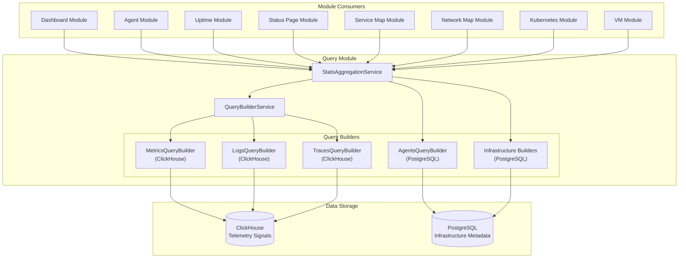

# Stats Aggregation Service Integration Guide

**Version**: 1.0.0
**Date**: 2026-02-07
**Status**: Implemented

---

## Overview

The `StatsAggregationService` provides a unified API for generating dashboard statistics across all TelemetryFlow modules. It integrates with the existing query system to support both:

1. **Infrastructure Monitoring**: Agents, Uptime, Status Pages, Service Maps, Network Maps, Kubernetes, VMs
2. **Telemetry Signals**: Metrics, Logs, Traces

---

## Architecture



---

## Key Features

### 1. Unified Statistics API

Single service interface for all module statistics:

```typescript
// Infrastructure modules
const agentStats = await statsAggregationService.getModuleStats({
  moduleType: "agents",
  tenantContext,
  timeRange,
  compareWithPrevious: true,
  includeResourceUsage: true,
});

// Telemetry signals
const metricStats = await statsAggregationService.getSignalStats({
  signalType: "metrics",
  metricName: "http_requests_total",
  tenantContext,
  timeRange,
  compareWithPrevious: true,
});
```

### 2. Automatic Trend Comparison

When `compareWithPrevious: true`, the service automatically:

- Shifts the time range backward by its duration
- Queries the previous period
- Calculates percentage change and direction

```typescript
// Current period: 10:00 - 11:00 (1 hour)
// Previous period: 09:00 - 10:00 (1 hour, automatically calculated)

const trend: TrendDataDto = {
  current: 1500,
  previous: 1200,
  changePercent: 25.0,
  direction: "up",
};
```

### 3. Resource Usage Metrics

When `includeResourceUsage: true`, queries CPU, memory, disk, and network metrics:

```typescript
const resourceUsage: ResourceUsageDto = {
  avgCpuUsage: 45.2, // percentage
  avgMemoryUsage: 62.8, // percentage
  avgDiskUsage: 38.5, // percentage
  avgNetworkIn: 1024000, // bytes/sec
  avgNetworkOut: 512000, // bytes/sec
};
```

### 4. TFQL Support for Infrastructure

Infrastructure queries use TFQL for flexible filtering:

```typescript
// Agent stats with TFQL
FETCH agents
  WHERE status = 'healthy' AND type = 'prometheus'
  TIMERANGE LAST 24h
  AGGREGATE count(*)

// K8s pod stats with TFQL
FETCH pods
  WHERE phase = 'Running' AND namespace = 'production'
  TIMERANGE LAST 1h
  AGGREGATE count(*) BY cluster_id
```

### 5. Multi-Tenant Isolation

All queries enforce tenant context:

```typescript
const tenantContext = TenantContext.create({
  organizationId: "org-123", // Required
  workspaceId: "ws-456", // Optional
  tenantId: "tenant-789", // Optional
});
```

---

## Integration Steps

### Step 1: Import QueryModule

```typescript
import { Module } from "@nestjs/common";
import { QueryModule } from "@/modules/query";

@Module({
  imports: [QueryModule],
  // ... other config
})
export class YourModule {}
```

### Step 2: Inject StatsAggregationService

```typescript
import { Injectable } from "@nestjs/common";
import { StatsAggregationService } from "@/modules/query";

@Injectable()
export class YourService {
  constructor(
    private readonly statsAggregationService: StatsAggregationService,
  ) {}
}
```

### Step 3: Query Statistics

```typescript
async getOverviewStats(organizationId: string) {
  const tenantContext = TenantContext.create({ organizationId });
  const timeRange = TimeRange.lastHours(24);

  // Get agent statistics
  const agentStats = await this.statsAggregationService.getModuleStats({
    moduleType: 'agents',
    tenantContext,
    timeRange,
    compareWithPrevious: true,
    includeResourceUsage: true,
  });

  // Get metric statistics
  const metricStats = await this.statsAggregationService.getSignalStats({
    signalType: 'metrics',
    metricName: 'http_requests_total',
    tenantContext,
    timeRange,
    compareWithPrevious: true,
  });

  return {
    agents: agentStats,
    metrics: metricStats,
  };
}
```

---

## Supported Module Types

| Module Type   | Table/Entity    | Data Source | TFQL Target    | Status Breakdown                     |
| ------------- | --------------- | ----------- | -------------- | ------------------------------------ |
| `agents`      | `agents`        | PostgreSQL  | `agents`       | healthy, degraded, critical, offline |
| `uptime`      | `monitors`      | PostgreSQL  | `monitors`     | up, down, paused                     |
| `status-page` | `status_pages`  | PostgreSQL  | `status_pages` | N/A                                  |
| `service-map` | `services`      | PostgreSQL  | `services`     | healthy, degraded, critical          |
| `network-map` | `network_nodes` | PostgreSQL  | `nodes`        | active, inactive                     |
| `kubernetes`  | `k8s_pods`      | PostgreSQL  | `pods`         | running, pending                     |
| `vm`          | `vms`           | PostgreSQL  | `vms`          | running, stopped, degraded           |

---

## Supported Signal Types

| Signal Type | Table     | Data Source | Query Builder       | Aggregations                                   |
| ----------- | --------- | ----------- | ------------------- | ---------------------------------------------- |
| `metrics`   | `metrics` | ClickHouse  | MetricsQueryBuilder | count, avg, sum, min, max, rate, p50, p95, p99 |
| `logs`      | `logs`    | ClickHouse  | LogsQueryBuilder    | count, severity breakdown                      |
| `traces`    | `traces`  | ClickHouse  | TracesQueryBuilder  | count, avg duration, error rate                |

---

## Response Format

### ModuleStatisticsDto

```typescript
interface ModuleStatisticsDto {
  total: number;
  totalTrend?: TrendDataDto;
  byStatus?: {
    healthy?: number;
    degraded?: number;
    critical?: number;
    offline?: number;
    up?: number;
    down?: number;
    paused?: number;
    running?: number;
    stopped?: number;
    active?: number;
    inactive?: number;
    pending?: number;
  };
  byStatusTrends?: {
    healthy?: TrendDataDto;
    // ... other statuses
  };
  resourceUsage?: ResourceUsageDto;
  customMetrics?: Record<string, unknown>;
  timeRange: {
    from: Date;
    to: Date;
  };
}
```

### TrendDataDto

```typescript
interface TrendDataDto {
  current: number;
  previous: number;
  changePercent: number;
  direction: "up" | "down" | "stable";
}
```

### ResourceUsageDto

```typescript
interface ResourceUsageDto {
  avgCpuUsage: number; // 0-100 percentage
  avgMemoryUsage: number; // 0-100 percentage
  avgDiskUsage?: number; // 0-100 percentage
  avgNetworkIn?: number; // bytes/sec
  avgNetworkOut?: number; // bytes/sec
}
```

---

## Example Use Cases

### Dashboard Overview Panel

```typescript
@Injectable()
export class DashboardService {
  constructor(
    private readonly statsAggregationService: StatsAggregationService,
  ) {}

  async getOverviewStats(organizationId: string) {
    const tenantContext = TenantContext.create({ organizationId });
    const timeRange = TimeRange.lastHours(24);

    const [agents, uptime, k8s, metrics, logs, traces] = await Promise.all([
      this.statsAggregationService.getModuleStats({
        moduleType: "agents",
        tenantContext,
        timeRange,
        compareWithPrevious: true,
      }),
      this.statsAggregationService.getModuleStats({
        moduleType: "uptime",
        tenantContext,
        timeRange,
        compareWithPrevious: true,
      }),
      this.statsAggregationService.getModuleStats({
        moduleType: "kubernetes",
        tenantContext,
        timeRange,
        compareWithPrevious: true,
      }),
      this.statsAggregationService.getSignalStats({
        signalType: "metrics",
        tenantContext,
        timeRange,
        compareWithPrevious: true,
      }),
      this.statsAggregationService.getSignalStats({
        signalType: "logs",
        tenantContext,
        timeRange,
        compareWithPrevious: true,
      }),
      this.statsAggregationService.getSignalStats({
        signalType: "traces",
        tenantContext,
        timeRange,
        compareWithPrevious: true,
      }),
    ]);

    return {
      infrastructure: { agents, uptime, k8s },
      telemetry: { metrics, logs, traces },
    };
  }
}
```

### Service-Specific Stats

```typescript
async getServiceStats(serviceName: string, organizationId: string) {
  const tenantContext = TenantContext.create({ organizationId });
  const timeRange = TimeRange.lastHours(1);

  const [metrics, logs, traces] = await Promise.all([
    this.statsAggregationService.getSignalStats({
      signalType: 'metrics',
      metricName: 'http_requests_total',
      serviceName,
      tenantContext,
      timeRange,
      compareWithPrevious: true,
    }),
    this.statsAggregationService.getSignalStats({
      signalType: 'logs',
      serviceName,
      tenantContext,
      timeRange,
      compareWithPrevious: true,
    }),
    this.statsAggregationService.getSignalStats({
      signalType: 'traces',
      serviceName,
      tenantContext,
      timeRange,
      compareWithPrevious: true,
    }),
  ]);

  return { metrics, logs, traces };
}
```

### Agent Health Dashboard

```typescript
async getAgentHealthStats(organizationId: string) {
  const tenantContext = TenantContext.create({ organizationId });
  const timeRange = TimeRange.lastHours(24);

  const stats = await this.statsAggregationService.getModuleStats({
    moduleType: 'agents',
    tenantContext,
    timeRange,
    compareWithPrevious: true,
    includeResourceUsage: true,
    filters: {
      type: 'prometheus', // Optional filter
    },
  });

  return {
    total: stats.total,
    trend: stats.totalTrend,
    health: {
      healthy: stats.byStatus?.healthy || 0,
      degraded: stats.byStatus?.degraded || 0,
      critical: stats.byStatus?.critical || 0,
      offline: stats.byStatus?.offline || 0,
    },
    resources: stats.resourceUsage,
  };
}
```

---

## Implementation Status

### ✅ Completed

- [ ] StatsAggregationService core implementation
- [ ] TimeRange.shiftBackward() for trend comparison
- [ ] TimeRange.getFrom() and getTo() accessors
- [ ] QueryModule exports (QueryBuilderService + StatsAggregationService)
- [ ] PostgresQueryBuilder base class
- [ ] AgentsQueryBuilder implementation
- [ ] MODULE.md documentation update
- [ ] Integration guide (this document)

### 🚧 In Progress

- [ ] Complete infrastructure query builders:
  - [ ] UptimeQueryBuilder (monitors table)
  - [ ] StatusPageQueryBuilder (status_pages table)
  - [ ] ServiceMapQueryBuilder (services table)
  - [ ] NetworkMapQueryBuilder (network_nodes table)
  - [ ] KubernetesQueryBuilder (k8s_pods table)
  - [ ] VMQueryBuilder (vms table)

### 📋 TODO

- [ ] Implement TFQL-based count queries in StatsAggregationService
- [ ] Implement resource usage queries from ClickHouse metrics
- [ ] Add caching layer for frequently accessed stats
- [ ] Add unit tests for StatsAggregationService
- [ ] Add integration tests with mock data
- [ ] Create OpenAPI specs for stats endpoints
- [ ] Add Grafana dashboard templates using stats API

---

## TFQL Query Examples

### Agent Statistics

```sql
-- Total agents
FETCH agents
  TIMERANGE LAST 24h
  AGGREGATE count(*)

-- Agents by status
FETCH agents
  WHERE status = 'healthy'
  TIMERANGE LAST 24h
  AGGREGATE count(*)

-- Agents by type with grouping
FETCH agents
  TIMERANGE LAST 24h
  AGGREGATE count(*) BY type
```

### Uptime Monitor Statistics

```sql
-- Total monitors
FETCH monitors
  TIMERANGE LAST 24h
  AGGREGATE count(*)

-- Uptime percentage
FETCH monitors
  WHERE status = 'up'
  TIMERANGE LAST 24h
  AGGREGATE count(*) / (SELECT count(*) FROM monitors)
```

### Kubernetes Statistics

```sql
-- Running pods
FETCH pods
  WHERE phase = 'Running'
  TIMERANGE LAST 1h
  AGGREGATE count(*) BY cluster_id

-- Pods with restarts
FETCH pods
  WHERE restart_count > 0
  TIMERANGE LAST 24h
  AGGREGATE count(*), avg(restart_count)
```

---

## Performance Considerations

### Query Optimization

1. **Materialized Views**: For time ranges > 6h, queries automatically use materialized views
2. **Indexing**: Ensure indexes on:
   - `organization_id`, `workspace_id`, `tenant_id`
   - `status`, `type`, `phase` (for filtering)
   - `created_at`, `updated_at` (for time ranges)
3. **Caching**: Consider caching stats for 1-5 minutes for high-traffic dashboards

### Parallel Queries

Use `Promise.all()` to fetch multiple stats in parallel:

```typescript
const [agents, uptime, k8s] = await Promise.all([
  this.statsAggregationService.getModuleStats({ moduleType: 'agents', ... }),
  this.statsAggregationService.getModuleStats({ moduleType: 'uptime', ... }),
  this.statsAggregationService.getModuleStats({ moduleType: 'kubernetes', ... }),
]);
```

### Pagination

For large result sets, use pagination:

```typescript
const stats = await this.statsAggregationService.getModuleStats({
  moduleType: "agents",
  tenantContext,
  timeRange,
  pagination: {
    page: 1,
    limit: 100,
  },
});
```

---

## Testing

### Unit Tests

```typescript
describe("StatsAggregationService", () => {
  it("should calculate agent stats with trends", async () => {
    const stats = await service.getModuleStats({
      moduleType: "agents",
      tenantContext,
      timeRange,
      compareWithPrevious: true,
    });

    expect(stats.total).toBeGreaterThan(0);
    expect(stats.totalTrend).toBeDefined();
    expect(stats.totalTrend.direction).toMatch(/up|down|stable/);
  });
});
```

### Integration Tests

```typescript
describe("StatsAggregationService Integration", () => {
  it("should query real agent data", async () => {
    const stats = await service.getModuleStats({
      moduleType: "agents",
      tenantContext: TenantContext.create({ organizationId: "test-org" }),
      timeRange: TimeRange.lastHours(1),
    });

    expect(stats.byStatus).toBeDefined();
    expect(stats.byStatus.healthy).toBeGreaterThanOrEqual(0);
  });
});
```

---

## Migration Guide

### From Direct Repository Queries

**Before:**

```typescript
const agents = await this.agentRepository.find({
  where: { organizationId, status: "healthy" },
});
const total = agents.length;
```

**After:**

```typescript
const stats = await this.statsAggregationService.getModuleStats({
  moduleType: "agents",
  tenantContext: TenantContext.create({ organizationId }),
  timeRange: TimeRange.lastHours(24),
  filters: { status: "healthy" },
});
const total = stats.total;
```

### From Custom Stats Handlers

**Before:**

```typescript
@QueryHandler(GetAgentStatsQuery)
export class GetAgentStatsHandler {
  async execute(query: GetAgentStatsQuery) {
    // Custom aggregation logic
    const agents = await this.agentRepository.findAll(...);
    // Manual trend calculation
    // Manual resource usage calculation
    return stats;
  }
}
```

**After:**

```typescript
@QueryHandler(GetAgentStatsQuery)
export class GetAgentStatsHandler {
  constructor(
    private readonly statsAggregationService: StatsAggregationService,
  ) {}

  async execute(query: GetAgentStatsQuery) {
    return await this.statsAggregationService.getModuleStats({
      moduleType: "agents",
      tenantContext: query.tenantContext,
      timeRange: query.timeRange,
      compareWithPrevious: true,
      includeResourceUsage: true,
    });
  }
}
```

---

## Troubleshooting

### Issue: Stats return 0 for all values

**Cause**: Tenant context not properly set or no data in time range

**Solution**:

```typescript
// Verify tenant context
console.log("Tenant Context:", tenantContext);

// Try wider time range
const timeRange = TimeRange.lastDays(7);

// Check raw data
const agents = await this.agentRepository.find({
  where: { organizationId: tenantContext.organizationId },
});
console.log("Raw agent count:", agents.length);
```

### Issue: Trends show NaN or Infinity

**Cause**: Previous period has 0 values

**Solution**: TrendDataDto.calculate() handles this automatically, but verify:

```typescript
if (stats.totalTrend) {
  console.log("Current:", stats.totalTrend.current);
  console.log("Previous:", stats.totalTrend.previous);
  console.log("Change:", stats.totalTrend.changePercent);
}
```

### Issue: Slow query performance

**Cause**: Missing indexes or large time ranges

**Solution**:

```typescript
// Use shorter time ranges
const timeRange = TimeRange.lastHours(1);

// Add indexes to database
CREATE INDEX idx_agents_org_status ON agents(organization_id, status);
CREATE INDEX idx_agents_created_at ON agents(created_at);

// Enable query caching (implemented)
// Dual-layer cache: L1 In-Memory (60s) + L2 Redis (1800s)
// Cache prefix: 'tf:cache:'
```

---

## References

- [Query Module Documentation](./MODULE.md)
- [TFQL Language Specification](./TFQL_SPEC.md)
- [Shared Statistics DTOs](../../../shared/dto/statistics.dto.ts)
- [TimeRange Value Object](../domain/value-objects/TimeRange.ts)
- [TenantContext Value Object](../domain/value-objects/TenantContext.ts)
