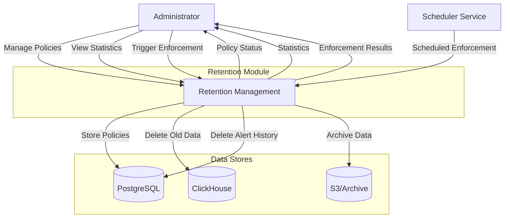
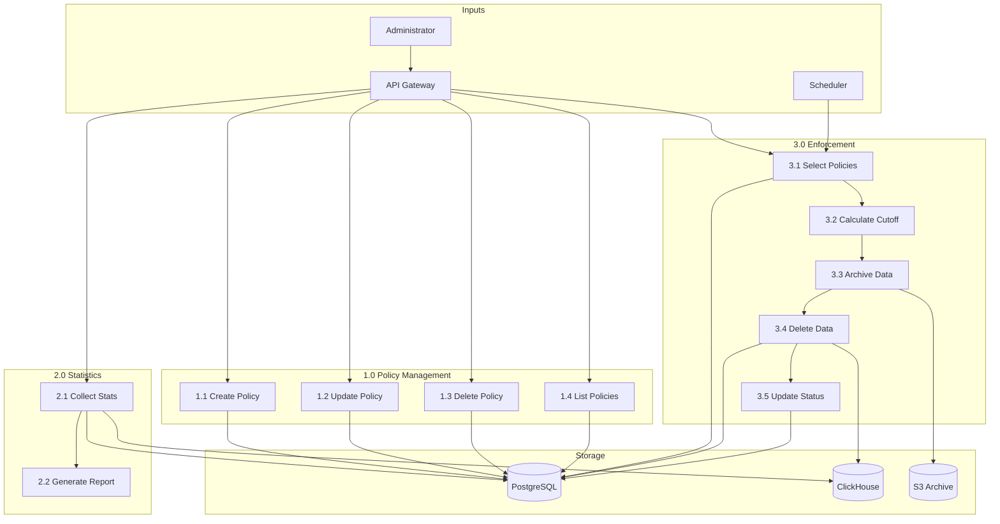
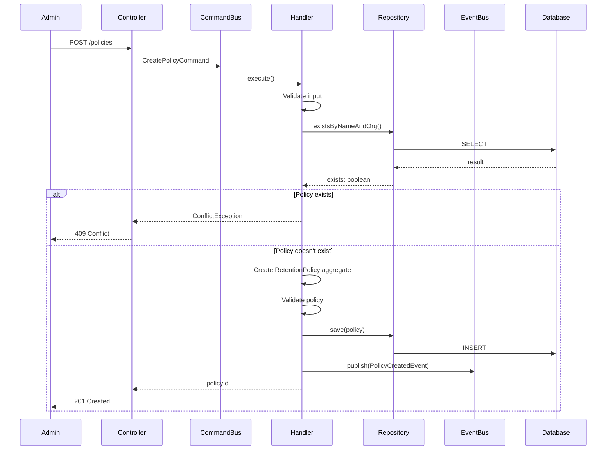
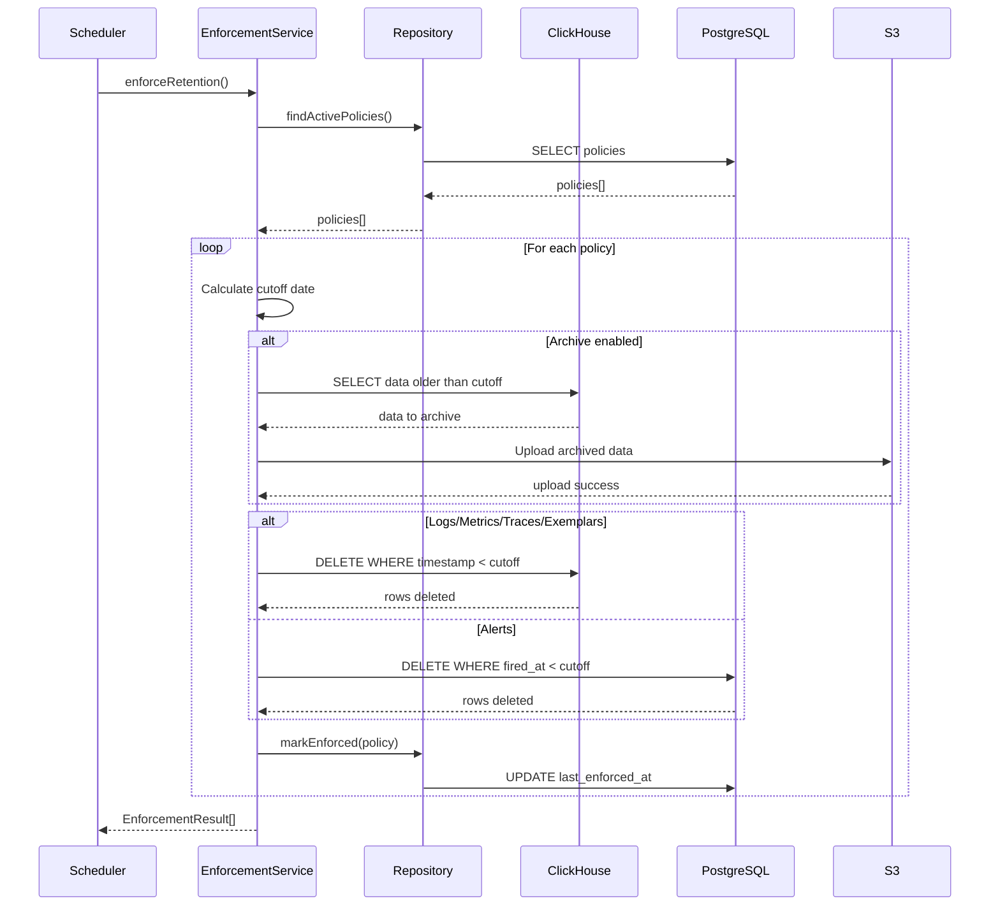
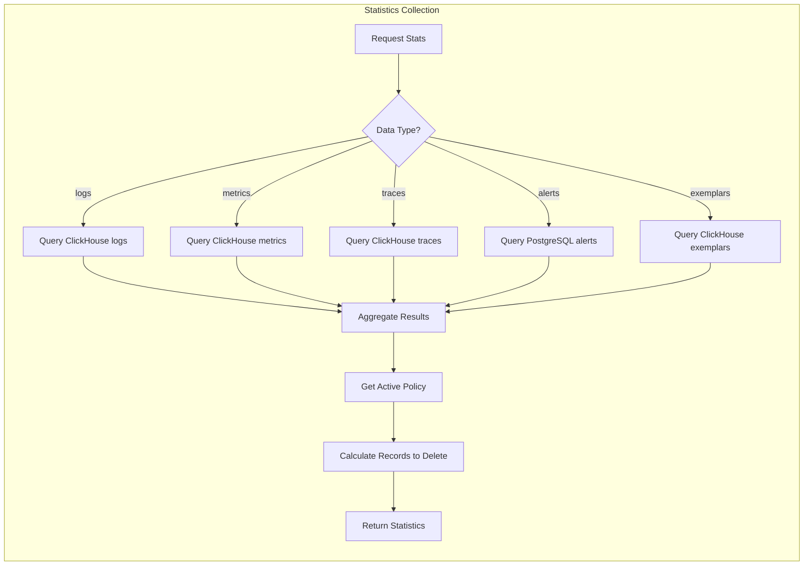
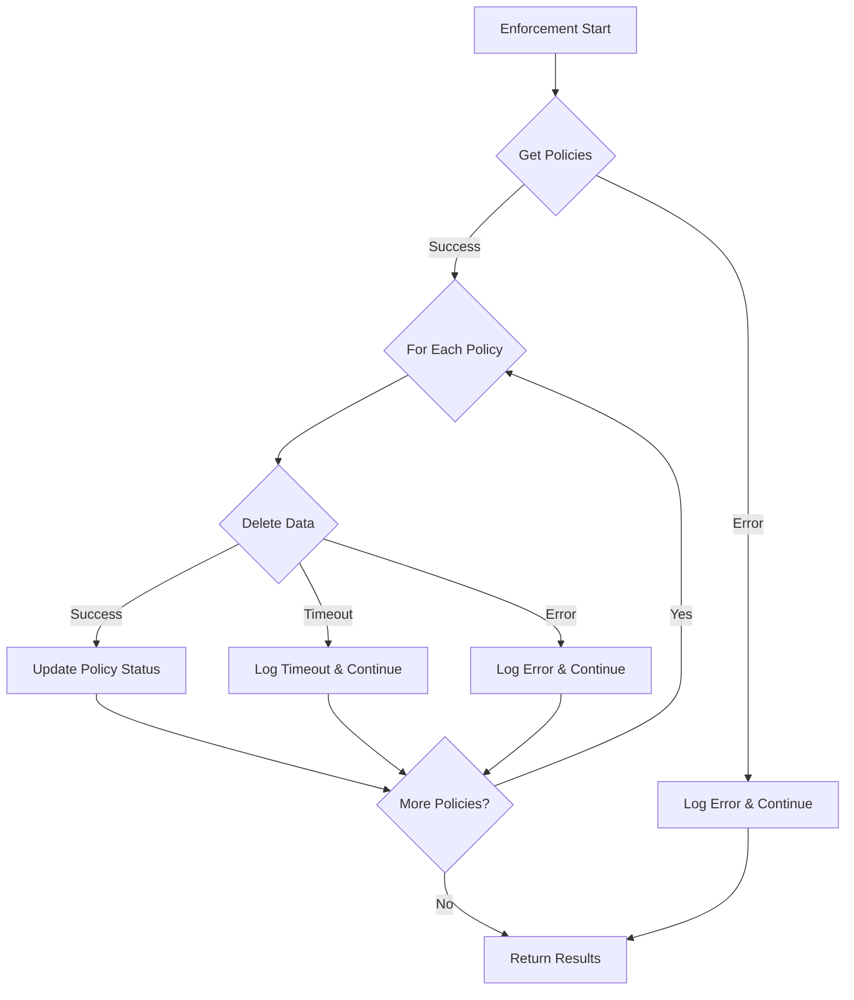

# Retention Module - Data Flow Diagram

## Overview

This DFD illustrates the data flow for retention policy management and enforcement in the TelemetryFlow Platform.

## Level 0 - Context Diagram

## Level 1 - Main Processes

## Level 2 - Detailed Processes

### 2.1 Policy Management Flow

### 2.2 Enforcement Flow

### 2.3 Statistics Collection Flow

## Data Stores

| Store | Purpose | Data |
|-------|---------|------|
| PostgreSQL | Policy storage | retention_policies, alert_instances |
| ClickHouse | Telemetry storage | logs, metrics, traces, exemplars |
| S3/Archive | Long-term storage | Archived telemetry data |

## Scheduled Processes

```mermaid
gantt
    title Retention Scheduler Timeline
    dateFormat HH:mm
    axisFormat %H:%M

    section Daily
    Retention Enforcement :02:00, 1h

    section Hourly
    Quick Check :00:00, 5m
    Quick Check :01:00, 5m
    Quick Check :02:00, 5m

    section Weekly
    Weekly Report :crit, 03:00, 30m
```

## Error Handling

