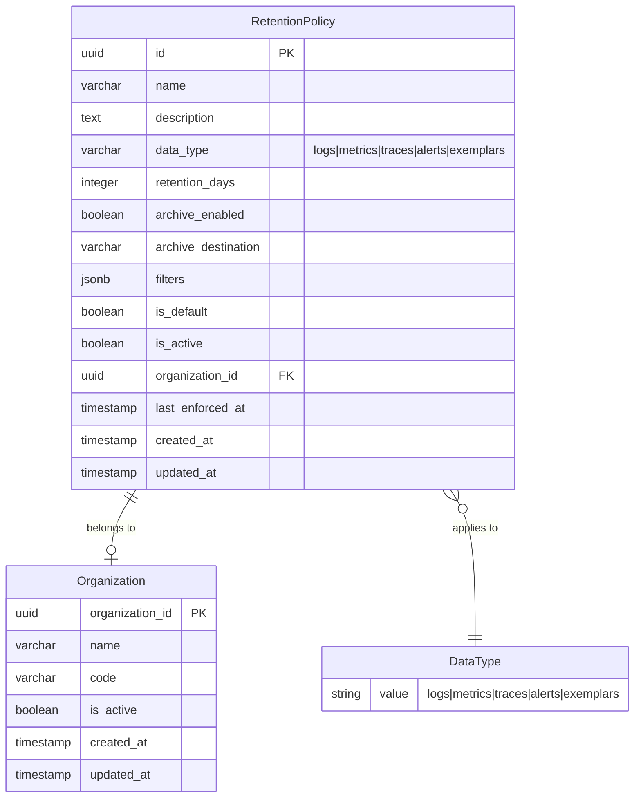

# Retention Module - Entity Relationship Diagram

## Overview

This ERD represents the Retention module entities and their relationships in the TelemetryFlow Platform.

## Entities

- **RetentionPolicy**: Data retention policy configuration
- **Organization**: Organization that owns custom policies (from IAM module)

## Entity Relationship Diagram



## Detailed Schema

### retention_policies Table

```sql
CREATE TABLE retention_policies (
    id UUID PRIMARY KEY,
    name VARCHAR(255) NOT NULL,
    description TEXT,
    data_type VARCHAR(50) NOT NULL,
    retention_days INTEGER NOT NULL,
    archive_enabled BOOLEAN DEFAULT FALSE,
    archive_destination VARCHAR(500),
    filters JSONB,
    is_default BOOLEAN DEFAULT FALSE,
    is_active BOOLEAN DEFAULT TRUE,
    organization_id UUID REFERENCES organizations(organization_id),
    last_enforced_at TIMESTAMP WITH TIME ZONE,
    created_at TIMESTAMP WITH TIME ZONE DEFAULT CURRENT_TIMESTAMP,
    updated_at TIMESTAMP WITH TIME ZONE DEFAULT CURRENT_TIMESTAMP
);

-- Indexes
CREATE INDEX IDX_retention_policies_organization_id ON retention_policies(organization_id);
CREATE INDEX IDX_retention_policies_org_data_type ON retention_policies(organization_id, data_type);
CREATE INDEX IDX_retention_policies_data_type_active ON retention_policies(data_type, is_active);
CREATE INDEX IDX_retention_policies_is_default ON retention_policies(is_default) WHERE is_default = true;
```

## Cardinality Summary

### One-to-Many Relationships

- **Organization → RetentionPolicy**: One organization can have many retention policies (1:N)
- Each data type can have at most one default policy

### Constraints

- `organization_id` is nullable - null means global default policy
- `is_default` policies cannot be modified or deleted
- `archive_destination` is required when `archive_enabled` is true
- `retention_days` must be between 1 and 3650 (10 years)

## Data Type Values

| Value | Description | Default Storage |
|-------|-------------|-----------------|
| logs | Log records | ClickHouse |
| metrics | Time-series metrics | ClickHouse |
| traces | Distributed traces | ClickHouse |
| alerts | Alert instances | PostgreSQL |
| exemplars | Metric exemplars | ClickHouse |

## Default Policies

The following default policies are created during migration:

| Data Type | Retention Days | Archive Enabled |
|-----------|----------------|-----------------|
| logs | 30 | false |
| metrics | 90 | false |
| traces | 14 | false |
| alerts | 365 | false |
| exemplars | 7 | false |

## Policy Resolution

When enforcing retention, policies are resolved in the following order:

1. Organization-specific policy for the data type
2. Global default policy for the data type
3. No retention (data kept indefinitely)
