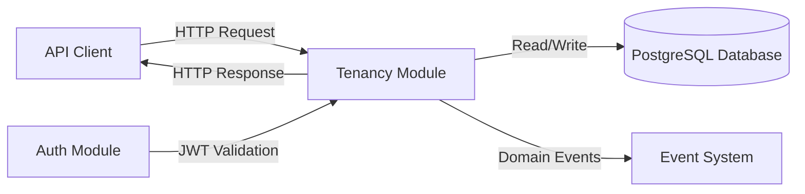
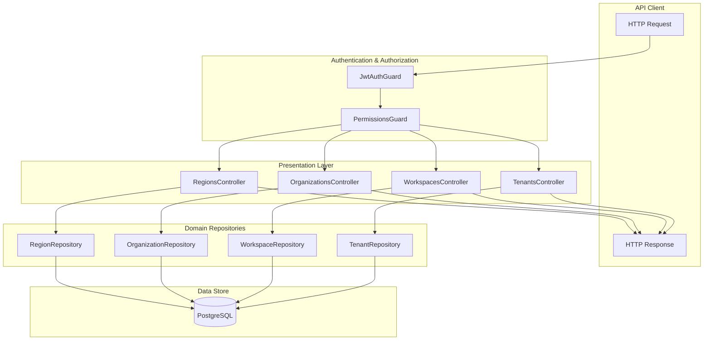
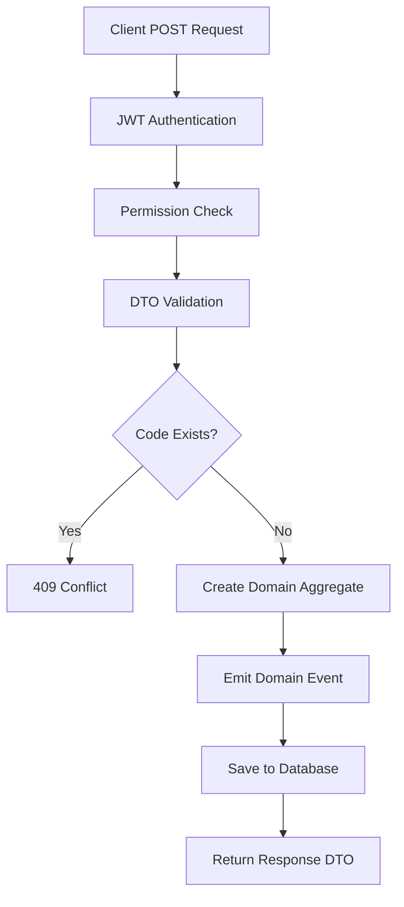
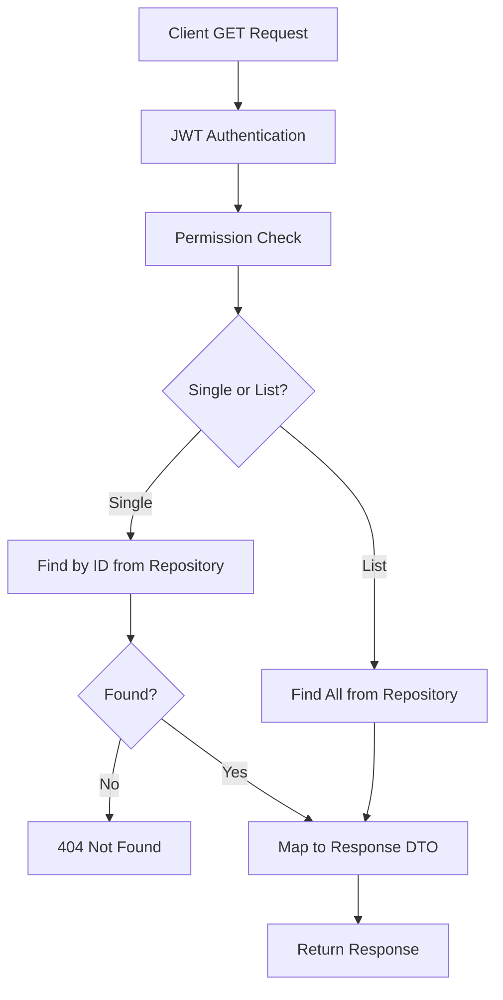
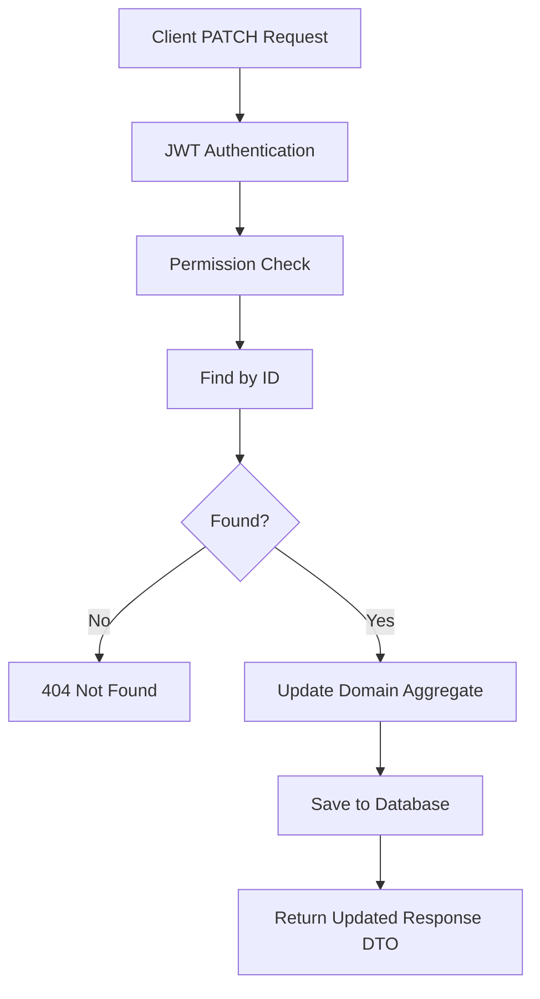
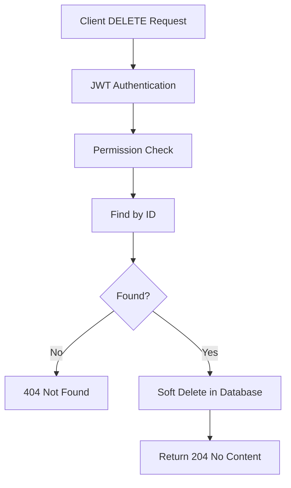
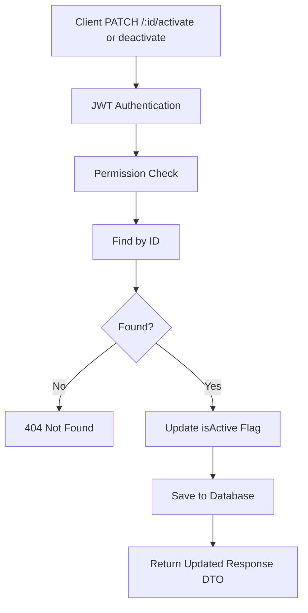
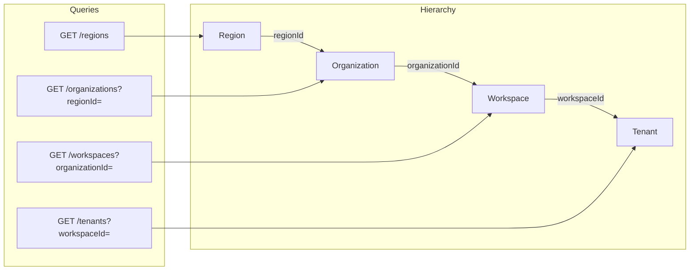

# Tenancy Module - Data Flow Diagram

## Level 0 - Context Diagram

## Level 1 - Module Data Flow

## Level 2 - CRUD Operation Flow

### Create Flow

### Read Flow

### Update Flow

### Delete Flow

## Activation/Deactivation Flow

## Data Flow Between Entities

