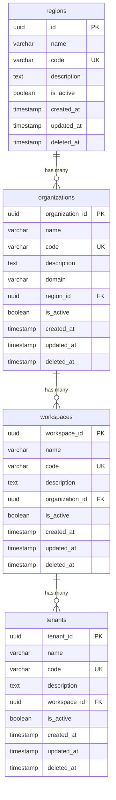

# Tenancy Module - Entity Relationship Diagram

## ERD

## Table Descriptions

### regions

The top-level geographic or logical grouping. Each region contains multiple organizations.

| Column      | Type         | Constraints        | Description                             |
| ----------- | ------------ | ------------------ | --------------------------------------- |
| id          | UUID         | PK, auto-generated | Unique region identifier                |
| name        | VARCHAR(100) | NOT NULL           | Display name                            |
| code        | VARCHAR(50)  | UNIQUE, NOT NULL   | Machine-readable code (e.g., us-east-1) |
| description | TEXT         | NULLABLE           | Region description                      |
| is_active   | BOOLEAN      | DEFAULT true       | Active/inactive flag                    |
| created_at  | TIMESTAMP    | auto-generated     | Creation timestamp                      |
| updated_at  | TIMESTAMP    | auto-updated       | Last update timestamp                   |
| deleted_at  | TIMESTAMP    | NULLABLE           | Soft delete timestamp                   |

### organizations

Business entities that belong to a region. Each organization contains multiple workspaces.

| Column          | Type         | Constraints        | Description                    |
| --------------- | ------------ | ------------------ | ------------------------------ |
| organization_id | UUID         | PK, auto-generated | Unique organization identifier |
| name            | VARCHAR(100) | NOT NULL           | Display name                   |
| code            | VARCHAR(50)  | UNIQUE, NOT NULL   | Machine-readable code          |
| description     | TEXT         | NULLABLE           | Organization description       |
| domain          | VARCHAR(255) | NULLABLE           | Organization domain            |
| region_id       | UUID         | FK -> regions.id   | Parent region                  |
| is_active       | BOOLEAN      | DEFAULT true       | Active/inactive flag           |
| created_at      | TIMESTAMP    | auto-generated     | Creation timestamp             |
| updated_at      | TIMESTAMP    | auto-updated       | Last update timestamp          |
| deleted_at      | TIMESTAMP    | NULLABLE           | Soft delete timestamp          |

### workspaces

Isolated environments within an organization. Each workspace contains multiple tenants.

| Column          | Type         | Constraints                         | Description                 |
| --------------- | ------------ | ----------------------------------- | --------------------------- |
| workspace_id    | UUID         | PK, auto-generated                  | Unique workspace identifier |
| name            | VARCHAR(100) | NOT NULL                            | Display name                |
| code            | VARCHAR(50)  | UNIQUE, NOT NULL                    | Machine-readable code       |
| description     | TEXT         | NULLABLE                            | Workspace description       |
| organization_id | UUID         | FK -> organizations.organization_id | Parent organization         |
| is_active       | BOOLEAN      | DEFAULT true                        | Active/inactive flag        |
| created_at      | TIMESTAMP    | auto-generated                      | Creation timestamp          |
| updated_at      | TIMESTAMP    | auto-updated                        | Last update timestamp       |
| deleted_at      | TIMESTAMP    | NULLABLE                            | Soft delete timestamp       |

### tenants

Individual tenants for data isolation within a workspace.

| Column       | Type         | Constraints                   | Description              |
| ------------ | ------------ | ----------------------------- | ------------------------ |
| tenant_id    | UUID         | PK, auto-generated            | Unique tenant identifier |
| name         | VARCHAR(100) | NOT NULL                      | Display name             |
| code         | VARCHAR(50)  | UNIQUE, NOT NULL              | Machine-readable code    |
| description  | TEXT         | NULLABLE                      | Tenant description       |
| workspace_id | UUID         | FK -> workspaces.workspace_id | Parent workspace         |
| is_active    | BOOLEAN      | DEFAULT true                  | Active/inactive flag     |
| created_at   | TIMESTAMP    | auto-generated                | Creation timestamp       |
| updated_at   | TIMESTAMP    | auto-updated                  | Last update timestamp    |
| deleted_at   | TIMESTAMP    | NULLABLE                      | Soft delete timestamp    |

## Relationships

- **Region -> Organization**: One-to-Many. A region can have many organizations.
- **Organization -> Workspace**: One-to-Many. An organization can have many workspaces.
- **Workspace -> Tenant**: One-to-Many. A workspace can have many tenants.

All relationships use UUID foreign keys with soft delete support.
