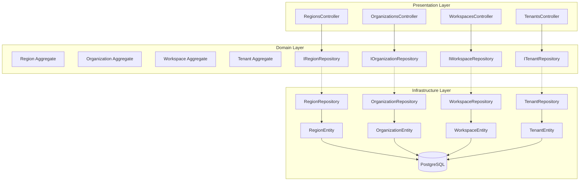
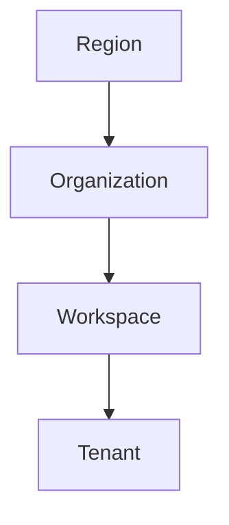

# Tenancy Module

## Overview

The Tenancy module manages the multi-tenant hierarchy for the TelemetryFlow Platform. It provides dedicated CRUD endpoints for Regions, Organizations, Workspaces, and Tenants, following Domain-Driven Design (DDD) and Clean Architecture principles.

## Architecture

The module follows a layered Clean Architecture pattern:

## Tenant Hierarchy

The hierarchy is:

1. **Region** - Geographic or logical deployment region (e.g., us-east-1, ap-southeast-1)
2. **Organization** - Business entity belonging to a region (e.g., DevOpsCorner)
3. **Workspace** - Isolated environment within an organization (e.g., Development, Production)
4. **Tenant** - Individual tenant within a workspace for data isolation

## API Endpoints

All endpoints are prefixed with `/api/v2/tenancy/`.

### Regions (`/tenancy/regions`)

| Method | Path              | Permission              | Description       |
| ------ | ----------------- | ----------------------- | ----------------- |
| GET    | `/`               | `tenancy:region:read`   | List all regions  |
| GET    | `/:id`            | `tenancy:region:read`   | Get region by ID  |
| POST   | `/`               | `tenancy:region:write`  | Create region     |
| PATCH  | `/:id`            | `tenancy:region:write`  | Update region     |
| DELETE | `/:id`            | `tenancy:region:delete` | Delete region     |
| PATCH  | `/:id/activate`   | `tenancy:region:write`  | Activate region   |
| PATCH  | `/:id/deactivate` | `tenancy:region:write`  | Deactivate region |

### Organizations (`/tenancy/organizations`)

| Method | Path              | Permission                    | Description             |
| ------ | ----------------- | ----------------------------- | ----------------------- |
| GET    | `/`               | `tenancy:organization:read`   | List organizations      |
| GET    | `/:id`            | `tenancy:organization:read`   | Get organization by ID  |
| POST   | `/`               | `tenancy:organization:write`  | Create organization     |
| PATCH  | `/:id`            | `tenancy:organization:write`  | Update organization     |
| DELETE | `/:id`            | `tenancy:organization:delete` | Delete organization     |
| PATCH  | `/:id/activate`   | `tenancy:organization:write`  | Activate organization   |
| PATCH  | `/:id/deactivate` | `tenancy:organization:write`  | Deactivate organization |

### Workspaces (`/tenancy/workspaces`)

| Method | Path              | Permission                 | Description          |
| ------ | ----------------- | -------------------------- | -------------------- |
| GET    | `/`               | `tenancy:workspace:read`   | List workspaces      |
| GET    | `/:id`            | `tenancy:workspace:read`   | Get workspace by ID  |
| POST   | `/`               | `tenancy:workspace:write`  | Create workspace     |
| PATCH  | `/:id`            | `tenancy:workspace:write`  | Update workspace     |
| DELETE | `/:id`            | `tenancy:workspace:delete` | Delete workspace     |
| PATCH  | `/:id/activate`   | `tenancy:workspace:write`  | Activate workspace   |
| PATCH  | `/:id/deactivate` | `tenancy:workspace:write`  | Deactivate workspace |

### Tenants (`/tenancy/tenants`)

| Method | Path              | Permission              | Description       |
| ------ | ----------------- | ----------------------- | ----------------- |
| GET    | `/`               | `tenancy:tenant:read`   | List tenants      |
| GET    | `/:id`            | `tenancy:tenant:read`   | Get tenant by ID  |
| POST   | `/`               | `tenancy:tenant:write`  | Create tenant     |
| PATCH  | `/:id`            | `tenancy:tenant:write`  | Update tenant     |
| DELETE | `/:id`            | `tenancy:tenant:delete` | Delete tenant     |
| PATCH  | `/:id/activate`   | `tenancy:tenant:write`  | Activate tenant   |
| PATCH  | `/:id/deactivate` | `tenancy:tenant:write`  | Deactivate tenant |

## RBAC (Role-Based Access Control)

The module uses a 5-tier RBAC system:

| Role                | Read | Write | Delete |
| ------------------- | ---- | ----- | ------ |
| Super Administrator | Yes  | Yes   | Yes    |
| Administrator       | Yes  | Yes   | Yes    |
| Developer           | Yes  | Yes   | No     |
| Viewer              | Yes  | No    | No     |
| Demo                | Yes  | No    | No     |

## Domain Events

The module emits the following domain events:

- `tenancy.region.created`
- `tenancy.organization.created`
- `tenancy.workspace.created`
- `tenancy.tenant.created`

## Database

The module maps to existing database tables created by IAM migrations:

- `regions` (migration: 1700000000001)
- `organizations` (migration: 1700000000002)
- `workspaces` (migration: 1700000000003)
- `tenants` (migration: 1700000000004)

## Module Dependencies

- `TypeOrmModule` - Database access via TypeORM entities
- `@/modules/auth` - JWT authentication and permissions guards
