# TelemetryFlow Uptime -- System Architecture

- **Version:** 1.4.0
- **API Prefix:** `/api/v2`
- **License:** Apache-v2.0 -- Telemetri Data Indonesia

**TelemetryFlow Uptime (TelemetryFlow-Uptime)** is a full-stack monorepo providing Uptime
Monitoring, Status Pages, Identity and Access Management (IAM), Alerting, and
Audit management. The backend follows Domain-Driven Design with CQRS, and the
frontend is a Vue 3 SPA served through Nginx.

---

## 1. High-Level Architecture

The system is a containerised full-stack application. A browser communicates
with an Nginx reverse-proxy that serves the Vue 3 SPA and forwards API requests
to the NestJS backend. The backend persists relational data in PostgreSQL,
time-series / analytics data in ClickHouse, uses Redis for caching and BullMQ
job queues, and publishes cross-module domain events over NATS JetStream.

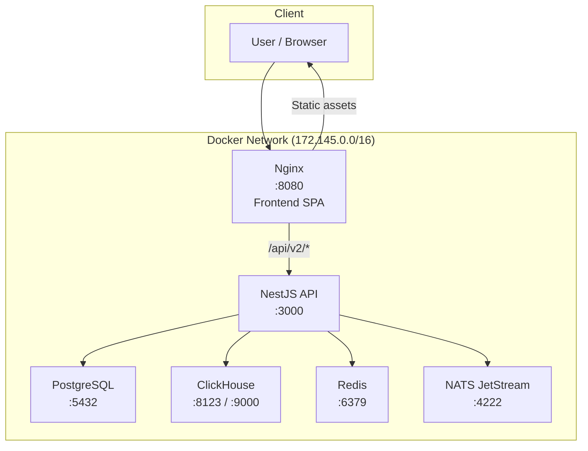

All services run on a dedicated Docker bridge network
(`telemetryflow_uptime_net`, subnet `172.145.0.0/16`) and are orchestrated via
`docker-compose` with profile-based activation (`uptime`, `tools`, `all`).

---

## 2. Monorepo Structure

The project uses **pnpm workspaces** with **Turborepo** for build
orchestration.

```
telemetryflow-uptime/
├── backend/                        # NestJS API (TypeScript)
│   ├── src/
│   │   ├── main.ts                 # Bootstrap, Swagger, Bull Board
│   │   ├── app.module.ts           # Root module -- registers all modules
│   │   ├── app.controller.ts       # Health / version endpoints
│   │   ├── database/               # Migration & seed runners
│   │   │   ├── postgres/           # PostgreSQL migrations + seeds
│   │   │   ├── clickhouse/         # ClickHouse migrations + seeds
│   │   │   └── typeorm.config.ts
│   │   ├── health/                 # Health-check module
│   │   ├── logger/                 # Winston-based structured logging
│   │   ├── modules/                # Domain modules (15 modules)
│   │   │   ├── alerting/
│   │   │   ├── api-keys/
│   │   │   ├── audit/
│   │   │   ├── auth/
│   │   │   ├── cache/
│   │   │   ├── data-masking/
│   │   │   ├── iam/
│   │   │   ├── llm/
│   │   │   ├── monitoring/
│   │   │   │   ├── uptime/         # Uptime Monitoring (HTTP/TCP/Ping)
│   │   │   │   └── status-page/    # Status Pages & Incidents
│   │   │   ├── notification/
│   │   │   ├── query/
│   │   │   ├── retention/
│   │   │   ├── sso/
│   │   │   └── tenancy/
│   │   └── shared/                 # Cross-cutting infrastructure
│   │       ├── cache/              # Redis cache module
│   │       ├── clickhouse/         # ClickHouse client module
│   │       ├── domain/             # DDD base classes
│   │       ├── dto/                # Shared DTOs
│   │       ├── errors/             # Domain / application errors
│   │       ├── filters/            # HTTP exception filters
│   │       ├── pipes/              # Custom validation pipes
│   │       ├── queue/              # BullMQ queue module
│   │       ├── security/           # Security utilities
│   │       ├── utils/
│   │       └── validation/
│   ├── nest-cli.json
│   ├── tsconfig.json
│   └── package.json
├── frontend/                       # Vue 3 SPA (Vite + UnoCSS)
│   ├── src/
│   │   ├── api/                    # API client layer
│   │   ├── components/             # Reusable UI components
│   │   ├── composables/            # Vue composition functions
│   │   ├── layouts/                # Page layouts
│   │   ├── plugins/                # Vue plugins
│   │   ├── router/                 # Vue Router configuration
│   │   ├── services/               # Frontend services
│   │   ├── store/                  # Pinia stores
│   │   │   ├── auth.ts
│   │   │   ├── uptime.ts
│   │   │   ├── alerts.ts
│   │   │   ├── llm.ts
│   │   │   ├── data-masking.ts
│   │   │   └── app.ts
│   │   ├── views/                  # Page-level views
│   │   │   ├── account/
│   │   │   ├── alerts/
│   │   │   ├── audit/
│   │   │   ├── auth/
│   │   │   ├── error/
│   │   │   ├── home/
│   │   │   ├── iam/
│   │   │   ├── monitoring/
│   │   │   ├── settings/
│   │   │   └── tenancy/
│   │   └── main.ts
│   ├── vite.config.ts
│   ├── uno.config.ts
│   └── package.json
├── config/                         # External configuration
│   ├── nginx/                      # Nginx config
│   │   ├── nginx.conf
│   │   └── conf.d/
│   │       └── default.conf
│   ├── postgresql/
│   └── clickhouse/
├── scripts/                        # Operational scripts
│   ├── bootstrap.sh
│   ├── db-cleanup.sh
│   ├── generate-secrets.js
│   ├── init-volumes.sh
│   └── test-build.sh
├── docker-compose.yml
├── Dockerfile.backend
├── Dockerfile.frontend
├── turbo.json                      # Turborepo pipeline config
├── pnpm-workspace.yaml
├── Makefile
└── package.json                    # Root workspace manifest
```

---

## 3. Backend Module Architecture

The backend is composed of 15 domain modules registered in `AppModule`. Each
module encapsulates its own presentation, application, domain, and
infrastructure layers. The diagram below shows module imports (dependencies).

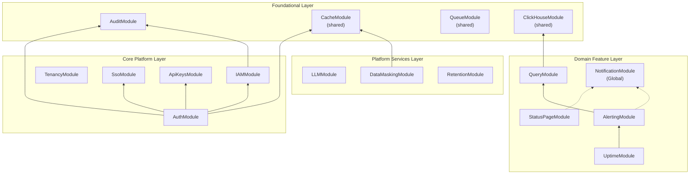

### Module Summary

| Module                 | Responsibility                                                             | Key Controllers                                                                      |
| ---------------------- | -------------------------------------------------------------------------- | ------------------------------------------------------------------------------------ |
| **AuthModule**         | Authentication, JWT, MFA, sessions, password reset, OAuth/SSO login        | `AuthController`, `MfaController`, `PasswordResetController`                         |
| **IAMModule**          | Users, roles, permissions, groups, tenants, orgs, workspaces, regions      | `UserController`, `RoleController`, `PermissionController`, `TenantController`       |
| **TenancyModule**      | Region, Organization, Workspace, Tenant provisioning                       | `RegionsController`, `OrganizationsController`, `WorkspacesController`               |
| **UptimeModule**       | HTTP uptime monitors, check scheduling, result persistence                 | `MonitorController`                                                                  |
| **StatusPageModule**   | Public status pages, incidents, subscriber management                      | `StatusPageController`, `PublicStatusPageController`                                 |
| **AlertingModule**     | Alert rules, alert instances, notification channels, evaluation scheduling | `AlertRulesController`, `AlertInstancesController`, `NotificationChannelsController` |
| **QueryModule**        | ClickHouse query builder, TFQL validation, stats aggregation               | `SignalsQueryController`                                                             |
| **NotificationModule** | Email delivery (SMTP), notification logs, templates (Global module)        | --                                                                                   |
| **ApiKeysModule**      | API key CRUD, encryption, ingestion rate limiting                          | `ApiKeysController`                                                                  |
| **SsoModule**          | SSO/OAuth2 provider configuration                                          | `SsoController`                                                                      |
| **AuditModule**        | Audit log persistence and retrieval, audit interceptor                     | `AuditController`                                                                    |
| **DataMaskingModule**  | Data masking policy CRUD, runtime masking service                          | `DataMaskingController`                                                              |
| **LLMModule**          | Multi-provider AI chat, insights, conversation history                     | `LLMProvidersController`, `ChatController`, `InsightsController`                     |
| **RetentionModule**    | Retention policy CRUD, enforcement scheduling                              | `RetentionPolicyController`                                                          |
| **CacheModule**        | Redis-backed caching service                                               | --                                                                                   |

---

## 4. DDD Layer Architecture

Every domain module follows the same four-layer structure. Dependencies point
inward: outer layers depend on inner layers, never the reverse. The Domain
layer defines repository interfaces (ports); the Infrastructure layer provides
concrete implementations (adapters), satisfying the Dependency Inversion
Principle.

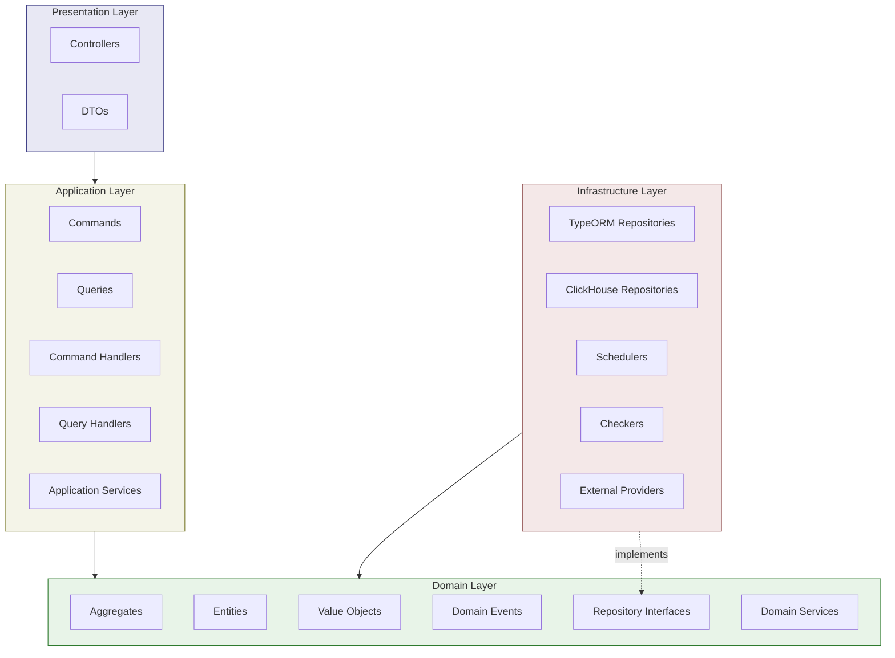

### Layer Directory Layout (per module)

```
module-name/
├── domain/
│   ├── aggregates/            # Aggregate roots (e.g., Monitor, Organization)
│   ├── entities/              # Domain entities
│   ├── value-objects/         # Value objects (e.g., OrganizationId, TenantId)
│   ├── events/                # Domain events
│   ├── repositories/          # Repository interface tokens
│   └── services/              # Domain services
├── application/
│   ├── commands/              # CQRS command definitions
│   ├── handlers/              # Command + query handlers
│   └── services/              # Application-level services
├── infrastructure/
│   ├── persistence/           # TypeORM entities + repositories
│   │   ├── entities/          # ORM entity classes
│   │   ├── migrations/        # Database migrations
│   │   ├── seeds/             # Seed data
│   │   └── *Repository.ts     # Repository implementations
│   ├── schedulers/            # Cron-based schedulers
│   ├── checkers/              # Health checkers (e.g., HttpChecker)
│   ├── services/              # Infrastructure services
│   ├── providers/             # External provider adapters
│   ├── guards/                # Custom guards
│   └── messaging/             # Event processors
├── presentation/
│   └── controllers/           # NestJS controllers
├── config/                    # Module-specific configuration
├── dto/                       # Request/response DTOs
├── guards/                    # Exported guards
├── strategies/                # Passport strategies
├── templates/                 # Email templates
└── module-name.module.ts      # NestJS module definition
```

### Shared DDD Base Classes

The `shared/domain/` directory provides reusable DDD primitives:

| Class              | File                             | Purpose                                 |
| ------------------ | -------------------------------- | --------------------------------------- |
| `AggregateRoot<T>` | `shared/domain/AggregateRoot.ts` | Base class with domain event collection |
| `Entity`           | `shared/domain/Entity.ts`        | Base entity with identity               |
| `ValueObject`      | `shared/domain/ValueObject.ts`   | Immutable value object base             |
| `DomainEvent`      | `shared/domain/DomainEvent.ts`   | Domain event base class                 |

---

## 5. CQRS Flow

The application uses the **CQRS** (Command Query Responsibility Segregation)
pattern via `@nestjs/cqrs`. Write operations are dispatched as Commands
through the `CommandBus`; read operations are dispatched as Queries through the
`QueryBus`. Each has a dedicated handler.

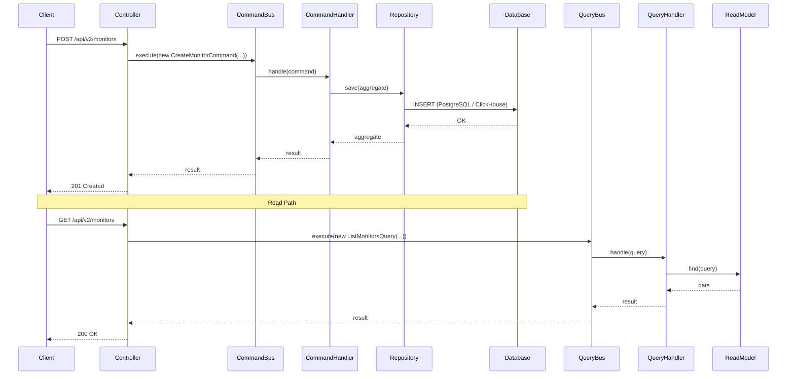

### Example: UptimeModule Commands

| Command                | Handler                | Description                  |
| ---------------------- | ---------------------- | ---------------------------- |
| `CreateMonitorCommand` | `CreateMonitorHandler` | Create a new uptime monitor  |
| `UpdateMonitorCommand` | `UpdateMonitorHandler` | Update monitor configuration |
| `DeleteMonitorCommand` | `DeleteMonitorHandler` | Remove a monitor             |
| `PauseMonitorCommand`  | `PauseMonitorHandler`  | Pause check scheduling       |
| `ResumeMonitorCommand` | `ResumeMonitorHandler` | Resume check scheduling      |

---

## 6. Uptime Check Flow

The `UptimeModule` uses `@nestjs/schedule` to run periodic health checks. The
`UptimeCheckerScheduler` triggers `HttpChecker` for each active monitor. Results
are written to both PostgreSQL (entity state) and ClickHouse (time-series
analytics). If a status change is detected, the `AlertingModule` is notified.

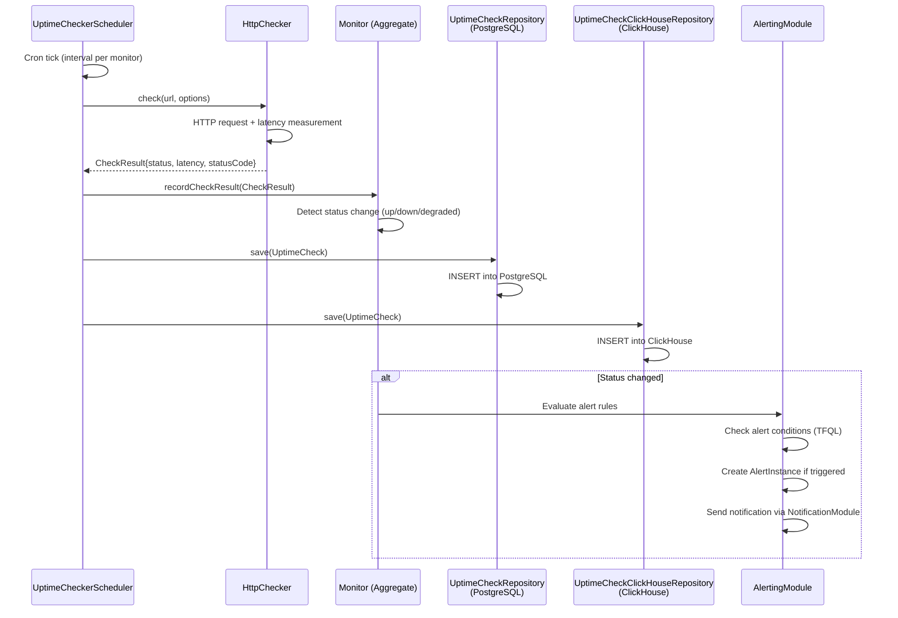

### Key Infrastructure Components

| Component                         | File                                                                             | Purpose                                          |
| --------------------------------- | -------------------------------------------------------------------------------- | ------------------------------------------------ |
| `UptimeCheckerScheduler`          | `monitoring/uptime/infrastructure/schedulers/UptimeChecker.scheduler.ts`          | Cron-based scheduler for all active monitors     |
| `HttpChecker`                     | `monitoring/uptime/infrastructure/checkers/HttpChecker.ts`                        | Performs HTTP health check requests              |
| `UptimeCheckRepository`           | `monitoring/uptime/infrastructure/persistence/UptimeCheckRepository.ts`           | PostgreSQL persistence for check results         |
| `UptimeCheckClickHouseRepository` | `monitoring/uptime/infrastructure/persistence/UptimeCheckClickHouseRepository.ts` | ClickHouse persistence for time-series analytics |
| `MonitorRepository`               | `monitoring/uptime/infrastructure/persistence/MonitorRepository.ts`               | PostgreSQL persistence for monitor configuration |
| `MonitorGroupRepository`          | `monitoring/uptime/infrastructure/persistence/MonitorGroupRepository.ts`          | PostgreSQL persistence for monitor groups        |

### Domain Aggregates

| Aggregate      | Description                                                                          |
| -------------- | ------------------------------------------------------------------------------------ |
| `Monitor`      | Root aggregate representing a single uptime monitor with its configuration and state |
| `MonitorGroup` | Groups monitors for organisational purposes                                          |
| `UptimeCheck`  | Represents a single check result with timing, status, and response details           |

---

## 7. Status Page Public Flow

The `StatusPageModule` exposes an unauthenticated public endpoint at
`/public/status/:slug` that renders the current status page along with active
incidents and associated monitors.

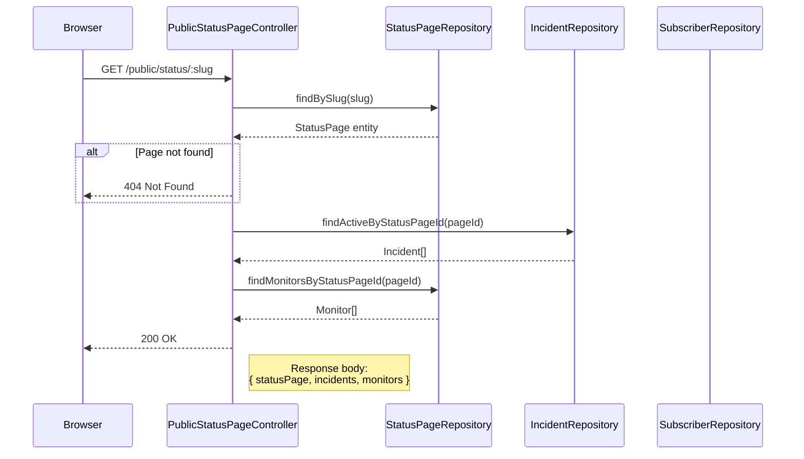

### Status Page Entities

| Entity       | Description                                                     |
| ------------ | --------------------------------------------------------------- |
| `StatusPage` | Page configuration: slug, title, description, theme, custom CSS |
| `Incident`   | Active or resolved incidents linked to a status page            |
| `Subscriber` | Users subscribed to status page updates                         |

---

## 8. Multi-Tenancy Architecture

The tenancy model follows a four-level hierarchy. Every data entity in the
system is scoped by `organizationId` at the database level, ensuring complete
tenant isolation.

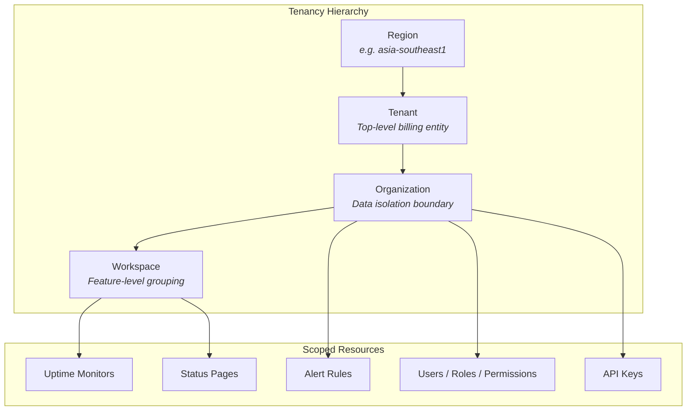

### Tenancy Domain Model

| Aggregate      | Value Object     | Description                                   |
| -------------- | ---------------- | --------------------------------------------- |
| `Region`       | `RegionId`       | Geographic or infrastructure region           |
| `Tenant`       | `TenantId`       | Top-level billing entity within a region      |
| `Organization` | `OrganizationId` | Data isolation boundary; scopes all entities  |
| `Workspace`    | `WorkspaceId`    | Feature-level grouping within an organization |

All repository queries include `organizationId` filtering to enforce tenant
isolation at the application layer. The IAM module manages role assignments and
permissions within each organizational scope.

---

## 9. Data Flow Diagram

This diagram illustrates how data flows through the system, from the user
request to the various storage backends, and how cross-module events propagate.

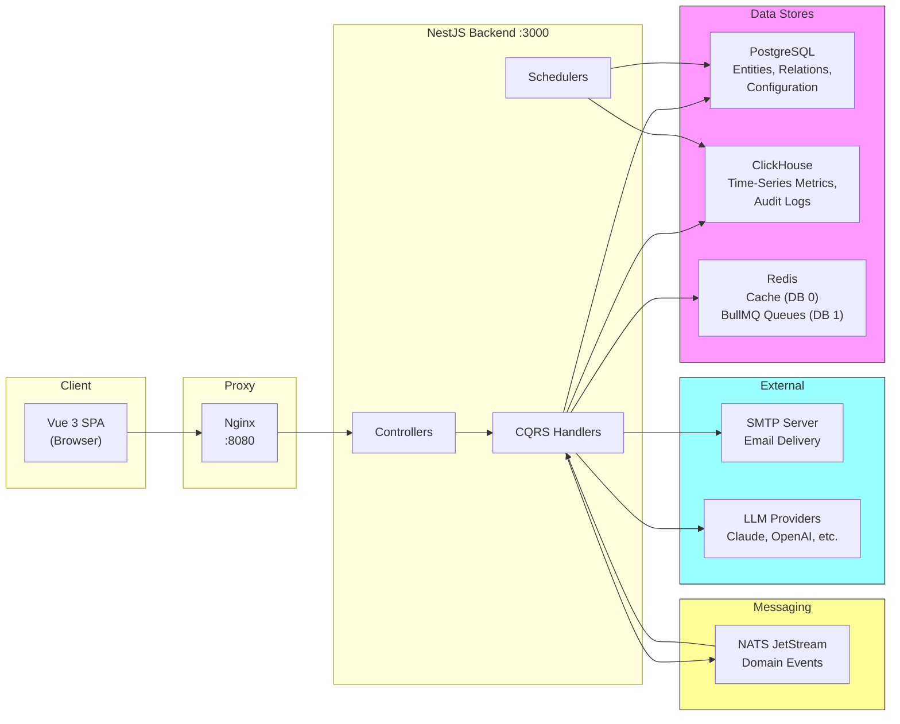

### Storage Responsibility Matrix

| Store              | Responsibility                                                     | Examples                                                    |
| ------------------ | ------------------------------------------------------------------ | ----------------------------------------------------------- |
| **PostgreSQL**     | Primary relational store for all entities, configuration, IAM data | Users, Roles, Monitors, Alert Rules, Status Pages, API Keys |
| **ClickHouse**     | Time-series and analytics storage                                  | Uptime check results, audit logs, aggregated metrics        |
| **Redis DB 0**     | Application cache                                                  | Session data, frequently queried entities, rate limiting    |
| **Redis DB 1**     | BullMQ job queues                                                  | Background job processing, scheduled tasks                  |
| **NATS JetStream** | Durable domain event messaging                                     | Cross-module event propagation (e.g., IAM events)           |

---

## 10. Authentication and Authorization Flow

Authentication uses JWT tokens issued by the `AuthModule`. Every request to a
protected endpoint passes through `JwtAuthGuard` followed by `PermissionsGuard`.
API key-based authentication is also supported via `ApiKeyGuard`.

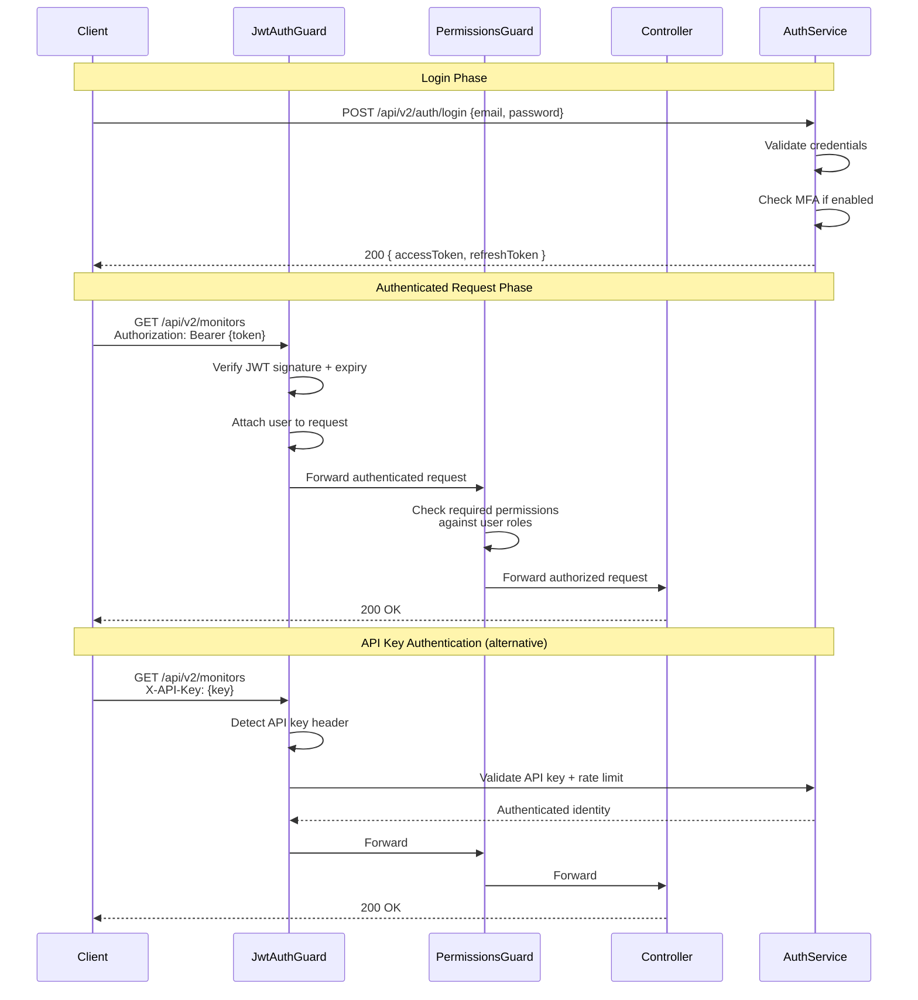

### Auth Guards

| Guard                 | Purpose                                                 |
| --------------------- | ------------------------------------------------------- |
| `JwtAuthGuard`        | Validates JWT Bearer tokens or API keys                 |
| `PermissionsGuard`    | Checks user permissions against required @Permissions() |
| `RateLimitGuard`      | Enforces per-user rate limiting                         |
| `SuperAdminGuard`     | Restricts access to super-admin endpoints               |
| `ApiKeyGuard`         | Dedicated API key validation for ingestion endpoints    |
| `IngestionAuthGuard`  | Auth for data ingestion endpoints with rate limiting    |
| `LLMRateLimiterGuard` | Rate limiting specific to LLM/AI endpoints              |

### Supported Authentication Methods

- Email + Password login
- Multi-Factor Authentication (TOTP-based MFA)
- OAuth2 / SSO (configurable providers)
- API Key authentication (with encryption at rest)
- Password reset flow with email verification
- Session management with device tracking

---

## 11. Docker Network Architecture

All services communicate over the `telemetryflow_uptime_net` bridge network
with static IP assignments in the `172.145.0.0/16` subnet.

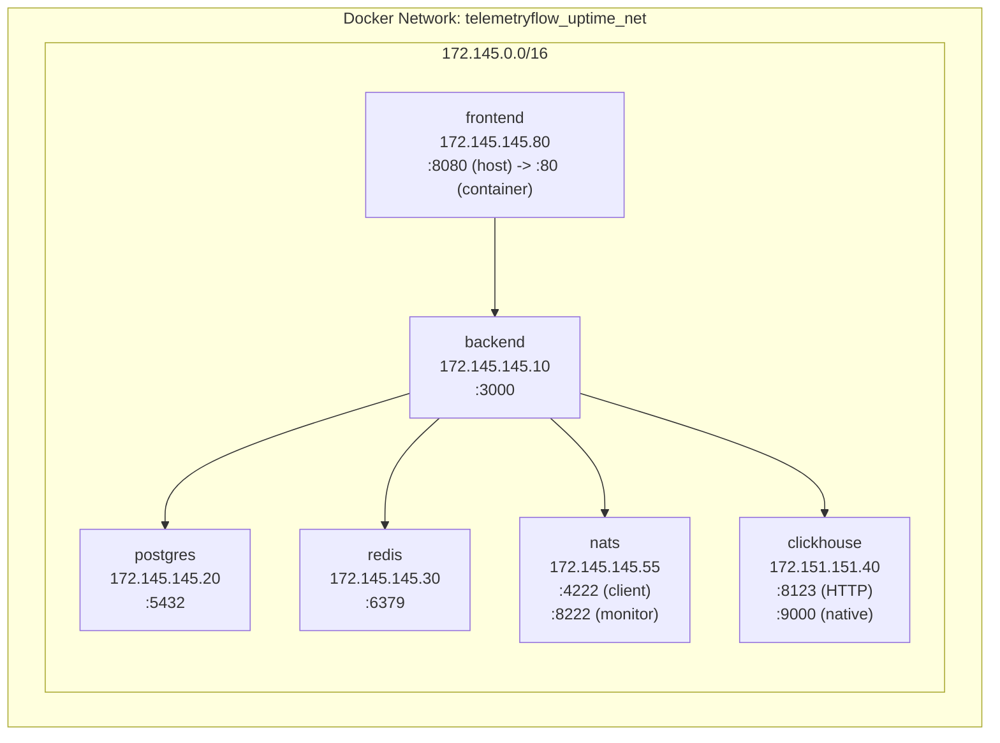

### Container Details

| Service        | Image                               | Host Port  | Container Port | Static IP      | Health Check     |
| -------------- | ----------------------------------- | ---------- | -------------- | -------------- | ---------------- |
| **frontend**   | Custom (Nginx)                      | 8080       | 80             | 172.145.145.80 | --               |
| **backend**    | Custom (Node.js)                    | 3000       | 3000           | 172.145.145.10 | --               |
| **postgres**   | postgres:16-alpine                  | 5432       | 5432           | 172.145.145.20 | `pg_isready`     |
| **redis**      | redis:7-alpine                      | 6379       | 6379           | 172.145.145.30 | `redis-cli ping` |
| **nats**       | nats:2-alpine                       | 4222, 8222 | 4222, 8222     | 172.145.145.55 | HTTP `/healthz`  |
| **clickhouse** | clickhouse/clickhouse-server:latest | 8123, 9000 | 8123, 9000     | 172.151.151.40 | HTTP `/ping`     |

### Docker Compose Profiles

| Profile  | Services                                             |
| -------- | ---------------------------------------------------- |
| `uptime` | postgres, clickhouse, redis, nats, backend, frontend |
| `tools`  | portainer                                            |
| `all`    | All of the above                                     |

---

## 12. Technology Stack

### Backend

| Category          | Technology                          | Version |
| ----------------- | ----------------------------------- | ------- |
| Runtime           | Node.js                             | 23.x    |
| Framework         | NestJS                              | 11.x    |
| Language          | TypeScript                          | 5.9     |
| ORM               | TypeORM                             | --      |
| CQRS              | @nestjs/cqrs                        | --      |
| Scheduling        | @nestjs/schedule                    | --      |
| Authentication    | Passport.js, @nestjs/jwt            | --      |
| Validation        | class-validator, class-transformer  | --      |
| API Documentation | Swagger / OpenAPI (@nestjs/swagger) | 2.0     |
| Logging           | Winston                             | --      |
| Tracing           | OpenTelemetry SDK                   | --      |
| Queue             | BullMQ                              | --      |
| Testing           | Jest                                | --      |

### Frontend

| Category         | Technology              |
| ---------------- | ----------------------- |
| Framework        | Vue 3 (Composition API) |
| Build Tool       | Vite                    |
| State Management | Pinia                   |
| Routing          | Vue Router              |
| CSS Engine       | UnoCSS                  |
| HTTP Client      | Axios / Fetch           |
| Testing          | Vitest                  |

### Data Stores

| Store      | Purpose                             | Version     |
| ---------- | ----------------------------------- | ----------- |
| PostgreSQL | Primary relational database         | 16 (Alpine) |
| ClickHouse | Time-series analytics, audit logs   | Latest      |
| Redis      | Cache, session store, BullMQ queues | 7 (Alpine)  |

### Messaging

| Technology     | Purpose                        | Version    |
| -------------- | ------------------------------ | ---------- |
| NATS JetStream | Durable domain event messaging | 2 (Alpine) |

### Infrastructure

| Category          | Technology                  |
| ----------------- | --------------------------- |
| Container Runtime | Docker                      |
| Orchestration     | Docker Compose (profiles)   |
| Reverse Proxy     | Nginx                       |
| Build System      | Turborepo + pnpm workspaces |
| Package Manager   | pnpm 10.24                  |
| CI/CD             | Makefile-based pipeline     |

### External Integrations

| Integration       | Purpose                                                               |
| ----------------- | --------------------------------------------------------------------- |
| SMTP (Nodemailer) | Email delivery for notifications, verification, alerts                |
| LLM Providers     | AI chat and insights (Claude, OpenAI, Gemini, DeepSeek, Qwen, Ollama) |
| OAuth2 Providers  | SSO authentication                                                    |

---

## Appendix: Request Lifecycle

Every HTTP request passes through the following NestJS middleware and
interceptor pipeline before reaching a controller:

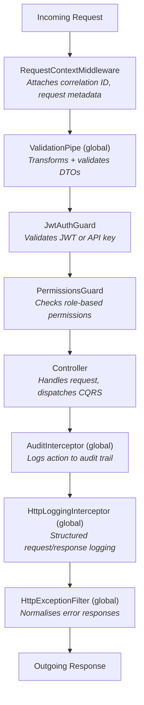
