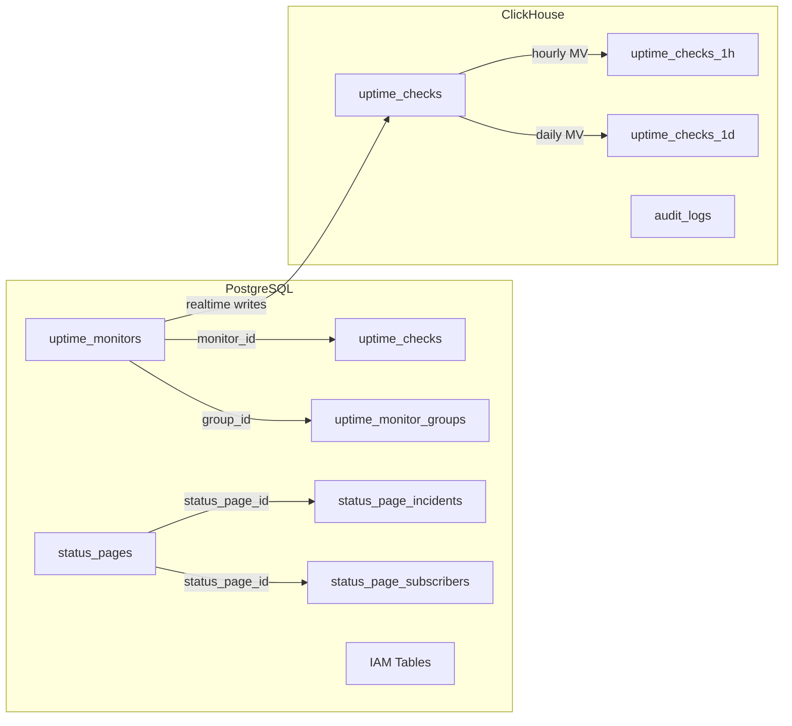
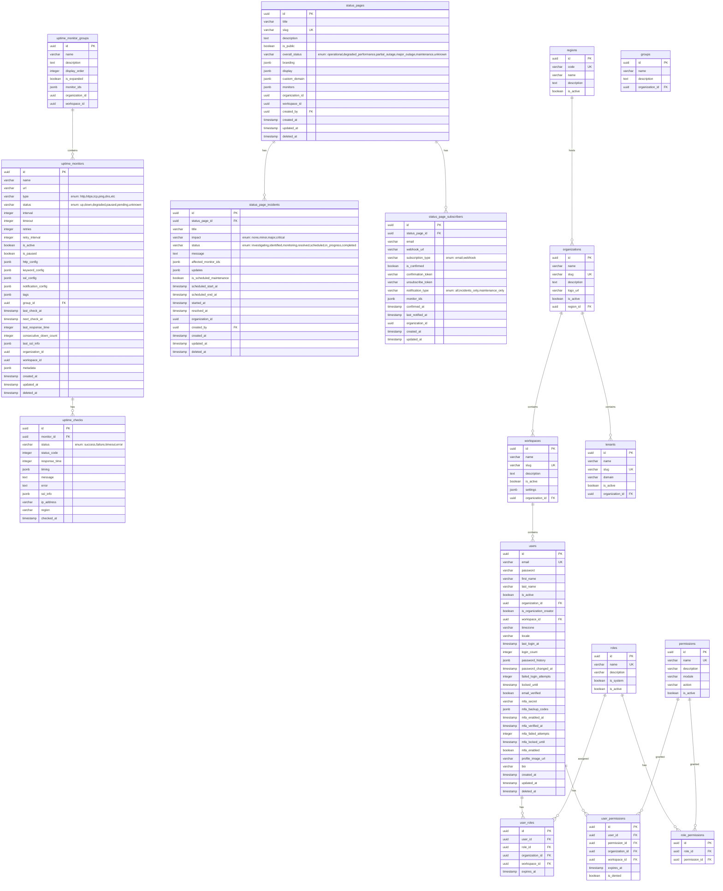
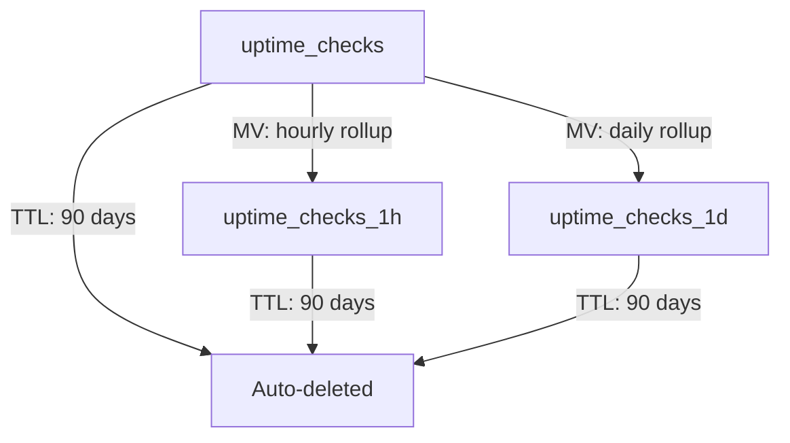

# TFO-Uptime Database Schema

Version 1.4.0

---

## Overview

The TFO-Uptime platform uses a dual-database architecture:

- **PostgreSQL 16** -- Transactional data (monitors, status pages, IAM entities)
- **ClickHouse** -- Time-series data (uptime checks, audit logs, analytics)

---

## PostgreSQL Entity Relationship Diagram

---

## PostgreSQL Table Details

### uptime_monitors

Stores all configured uptime monitors.

| Column                   | Type      | Nullable | Description                              |
| ------------------------ | --------- | -------- | ---------------------------------------- |
| `id`                     | UUID      | No       | Primary key                              |
| `name`                   | VARCHAR   | No       | Monitor display name                     |
| `url`                    | VARCHAR   | No       | Target URL or address                    |
| `type`                   | VARCHAR   | No       | Monitor type enum                        |
| `status`                 | VARCHAR   | No       | Current status enum                      |
| `interval`               | INTEGER   | No       | Check interval in seconds                |
| `timeout`                | INTEGER   | No       | Timeout in seconds                       |
| `retries`                | INTEGER   | No       | Max retry attempts                       |
| `retry_interval`         | INTEGER   | No       | Retry interval in seconds                |
| `is_active`              | BOOLEAN   | No       | Whether monitor is active                |
| `is_paused`              | BOOLEAN   | No       | Whether monitor is paused                |
| `http_config`            | JSONB     | Yes      | HTTP method, headers, body, status codes |
| `keyword_config`         | JSONB     | Yes      | Keyword search configuration             |
| `ssl_config`             | JSONB     | Yes      | SSL certificate warning threshold        |
| `notification_config`    | JSONB     | Yes      | Notification channel IDs                 |
| `tags`                   | JSONB     | No       | Array of tag strings                     |
| `group_id`               | UUID      | Yes      | FK to uptime_monitor_groups              |
| `last_check_at`          | TIMESTAMP | Yes      | Last check execution time                |
| `next_check_at`          | TIMESTAMP | Yes      | Next scheduled check time                |
| `last_response_time`     | INTEGER   | Yes      | Last check response time in ms           |
| `consecutive_down_count` | INTEGER   | No       | Sequential failure count                 |
| `last_ssl_info`          | JSONB     | Yes      | Cached SSL certificate details           |
| `organization_id`        | UUID      | No       | Owning organization                      |
| `workspace_id`           | UUID      | Yes      | Owning workspace                         |
| `metadata`               | JSONB     | Yes      | Extra configuration                      |
| `created_at`             | TIMESTAMP | No       | Creation time                            |
| `updated_at`             | TIMESTAMP | No       | Last update time                         |
| `deleted_at`             | TIMESTAMP | Yes      | Soft delete timestamp                    |

**Indexes:**

| Name                      | Columns                   | Type    |
| ------------------------- | ------------------------- | ------- |
| `pk_uptime_monitors`      | `id`                      | PRIMARY |
| `idx_monitors_org_status` | `organization_id, status` | B-tree  |
| `idx_monitors_org_type`   | `organization_id, type`   | B-tree  |
| `idx_monitors_group`      | `group_id`                | B-tree  |
| `idx_monitors_next_check` | `next_check_at`           | B-tree  |
| `idx_monitors_deleted`    | `deleted_at`              | B-tree  |

### uptime_checks

Stores individual check results in PostgreSQL (recent, for detail views).

| Column          | Type      | Nullable | Description                      |
| --------------- | --------- | -------- | -------------------------------- |
| `id`            | UUID      | No       | Primary key                      |
| `monitor_id`    | UUID      | No       | FK to uptime_monitors            |
| `status`        | VARCHAR   | No       | success, failure, timeout, error |
| `status_code`   | INTEGER   | Yes      | HTTP status code                 |
| `response_time` | INTEGER   | No       | Response time in ms              |
| `timing`        | JSONB     | Yes      | DNS, TCP, TLS, TTFB timings      |
| `message`       | TEXT      | Yes      | Result message                   |
| `error`         | TEXT      | Yes      | Error description                |
| `ssl_info`      | JSONB     | Yes      | SSL certificate details          |
| `ip_address`    | VARCHAR   | Yes      | Resolved IP                      |
| `region`        | VARCHAR   | Yes      | Check region                     |
| `checked_at`    | TIMESTAMP | No       | Check execution time             |

**Indexes:**

| Name                      | Columns                       | Type    |
| ------------------------- | ----------------------------- | ------- |
| `pk_uptime_checks`        | `id`                          | PRIMARY |
| `idx_checks_monitor_time` | `monitor_id, checked_at DESC` | B-tree  |
| `idx_checks_status`       | `status`                      | B-tree  |

### uptime_monitor_groups

Logical grouping of monitors.

| Column            | Type    | Nullable | Description            |
| ----------------- | ------- | -------- | ---------------------- |
| `id`              | UUID    | No       | Primary key            |
| `name`            | VARCHAR | No       | Group name             |
| `description`     | TEXT    | Yes      | Group description      |
| `display_order`   | INTEGER | No       | Sort order             |
| `is_expanded`     | BOOLEAN | No       | UI expansion state     |
| `monitor_ids`     | JSONB   | Yes      | Array of monitor UUIDs |
| `organization_id` | UUID    | No       | Owning organization    |
| `workspace_id`    | UUID    | Yes      | Owning workspace       |

### status_pages

| Column                             | Type      | Nullable | Description                |
| ---------------------------------- | --------- | -------- | -------------------------- |
| `id`                               | UUID      | No       | Primary key                |
| `title`                            | VARCHAR   | No       | Page title                 |
| `slug`                             | VARCHAR   | No       | URL slug (unique)          |
| `description`                      | TEXT      | Yes      | Page description           |
| `is_public`                        | BOOLEAN   | No       | Public visibility          |
| `overall_status`                   | VARCHAR   | No       | Aggregated status enum     |
| `logo_url`                         | VARCHAR   | Yes      | Logo image URL             |
| `favicon_url`                      | VARCHAR   | Yes      | Favicon URL                |
| `brand_color`                      | VARCHAR   | Yes      | Primary brand color        |
| `custom_css`                       | TEXT      | Yes      | Custom CSS                 |
| `header_text`                      | VARCHAR   | Yes      | Header text                |
| `footer_text`                      | TEXT      | Yes      | Footer text                |
| `support_url`                      | VARCHAR   | Yes      | Support link               |
| `show_uptime_percentage`           | BOOLEAN   | No       | Display uptime %           |
| `show_response_time`               | BOOLEAN   | No       | Display response time      |
| `show_incident_history`            | BOOLEAN   | No       | Display incidents          |
| `show_maintenance_schedule`        | BOOLEAN   | No       | Display maintenance        |
| `allow_subscriptions`              | BOOLEAN   | No       | Enable subscriptions       |
| `show_legend`                      | BOOLEAN   | No       | Show status legend         |
| `uptime_ranges`                    | JSONB     | No       | Day ranges [24, 7, 30, 90] |
| `history_days`                     | INTEGER   | No       | History retention          |
| `theme`                            | VARCHAR   | Yes      | Theme name                 |
| `google_analytics_id`              | VARCHAR   | Yes      | GA tracking ID             |
| `custom_domain`                    | VARCHAR   | Yes      | Custom domain              |
| `custom_domain_verified`           | BOOLEAN   | No       | Domain verified            |
| `custom_domain_ssl`                | BOOLEAN   | No       | SSL on custom domain       |
| `custom_domain_verification_token` | VARCHAR   | Yes      | DNS TXT token              |
| `monitors`                         | JSONB     | Yes      | Monitor display configs    |
| `last_status_check`                | TIMESTAMP | Yes      | Last status computation    |
| `organization_id`                  | UUID      | No       | Owning organization        |
| `workspace_id`                     | UUID      | Yes      | Owning workspace           |
| `created_by`                       | UUID      | No       | Creator user ID            |
| `metadata`                         | JSONB     | Yes      | Extra configuration        |
| `created_at`                       | TIMESTAMP | No       | Creation time              |
| `updated_at`                       | TIMESTAMP | No       | Last update time           |
| `deleted_at`                       | TIMESTAMP | Yes      | Soft delete timestamp      |

**Indexes:**

| Name                       | Columns           | Type    |
| -------------------------- | ----------------- | ------- |
| `pk_status_pages`          | `id`              | PRIMARY |
| `uk_status_pages_slug`     | `slug`            | UNIQUE  |
| `idx_status_pages_org`     | `organization_id` | B-tree  |
| `idx_status_pages_deleted` | `deleted_at`      | B-tree  |

### status_page_incidents

| Column                     | Type      | Nullable | Description             |
| -------------------------- | --------- | -------- | ----------------------- |
| `id`                       | UUID      | No       | Primary key             |
| `status_page_id`           | UUID      | No       | FK to status_pages      |
| `title`                    | VARCHAR   | No       | Incident title          |
| `impact`                   | VARCHAR   | No       | Impact level enum       |
| `status`                   | VARCHAR   | No       | Incident status enum    |
| `message`                  | TEXT      | Yes      | Initial message         |
| `affected_monitor_ids`     | JSONB     | Yes      | Array of monitor UUIDs  |
| `updates`                  | JSONB     | Yes      | Array of update objects |
| `is_scheduled_maintenance` | BOOLEAN   | No       | Is maintenance window   |
| `scheduled_start_at`       | TIMESTAMP | Yes      | Scheduled start         |
| `scheduled_end_at`         | TIMESTAMP | Yes      | Scheduled end           |
| `started_at`               | TIMESTAMP | No       | Actual start time       |
| `resolved_at`              | TIMESTAMP | Yes      | Resolution time         |
| `organization_id`          | UUID      | No       | Owning organization     |
| `workspace_id`             | UUID      | Yes      | Owning workspace        |
| `created_by`               | UUID      | No       | Creator user ID         |
| `metadata`                 | JSONB     | Yes      | Extra data              |
| `created_at`               | TIMESTAMP | No       | Creation time           |
| `updated_at`               | TIMESTAMP | No       | Last update time        |
| `deleted_at`               | TIMESTAMP | Yes      | Soft delete timestamp   |

**Indexes:**

| Name                       | Columns                           | Type    |
| -------------------------- | --------------------------------- | ------- |
| `pk_status_page_incidents` | `id`                              | PRIMARY |
| `idx_incidents_sp_status`  | `status_page_id, status`          | B-tree  |
| `idx_incidents_sp_created` | `status_page_id, created_at DESC` | B-tree  |

### status_page_subscribers

| Column               | Type      | Nullable | Description                           |
| -------------------- | --------- | -------- | ------------------------------------- |
| `id`                 | UUID      | No       | Primary key                           |
| `status_page_id`     | UUID      | No       | FK to status_pages                    |
| `email`              | VARCHAR   | Yes      | Subscriber email                      |
| `webhook_url`        | VARCHAR   | Yes      | Webhook endpoint                      |
| `subscription_type`  | VARCHAR   | No       | email or webhook                      |
| `is_confirmed`       | BOOLEAN   | No       | Email confirmed                       |
| `confirmation_token` | VARCHAR   | Yes      | Confirmation token                    |
| `unsubscribe_token`  | VARCHAR   | Yes      | Unsubscribe token                     |
| `notification_type`  | VARCHAR   | No       | all, incidents_only, maintenance_only |
| `monitor_ids`        | JSONB     | Yes      | Specific monitor subscriptions        |
| `confirmed_at`       | TIMESTAMP | Yes      | Confirmation timestamp                |
| `last_notified_at`   | TIMESTAMP | Yes      | Last notification time                |
| `organization_id`    | UUID      | No       | Owning organization                   |
| `created_at`         | TIMESTAMP | No       | Creation time                         |
| `updated_at`         | TIMESTAMP | No       | Last update time                      |

**Indexes:**

| Name                                | Columns                 | Type    |
| ----------------------------------- | ----------------------- | ------- |
| `pk_status_page_subscribers`        | `id`                    | PRIMARY |
| `idx_subscribers_sp_email`          | `status_page_id, email` | UNIQUE  |
| `idx_subscribers_confirm_token`     | `confirmation_token`    | B-tree  |
| `idx_subscribers_unsubscribe_token` | `unsubscribe_token`     | B-tree  |

---

## IAM Tables

### users

Core user accounts. Password hashed with Argon2. MFA secrets encrypted with AES-256-GCM.

**Key columns:** `id`, `email` (unique), `password`, `first_name`, `last_name`, `is_active`, `organization_id`, `workspace_id`, `email_verified`, `mfa_enabled`, `mfa_secret`, `mfa_backup_codes`, `failed_login_attempts`, `locked_until`, `password_history`, `password_changed_at`, `timezone`, `locale`, `last_login_at`, `login_count`, `created_at`, `updated_at`, `deleted_at`.

### roles

Role definitions. System roles cannot be deleted.

**Key columns:** `id`, `name` (unique), `description`, `is_system`, `is_active`.

System roles: `super_admin`, `administrator`, `developer`, `viewer`, `demo`.

### permissions

Granular permission definitions.

**Key columns:** `id`, `name` (unique), `description`, `module`, `action`, `is_active`.

### user_roles

Many-to-many junction between users and roles, scoped to organization/workspace.

**Key columns:** `id`, `user_id`, `role_id`, `organization_id`, `workspace_id`, `expires_at`.

### role_permissions

Many-to-many junction between roles and permissions.

**Key columns:** `id`, `role_id`, `permission_id`.

### user_permissions

Direct user-permission assignments with deny override support.

**Key columns:** `id`, `user_id`, `permission_id`, `organization_id`, `workspace_id`, `expires_at`, `is_denied`.

### organizations

Top-level tenant container.

**Key columns:** `id`, `name`, `slug` (unique), `description`, `logo_url`, `is_active`, `region_id`.

### workspaces

Workspace within an organization.

**Key columns:** `id`, `name`, `slug` (unique), `description`, `is_active`, `settings` (JSONB), `organization_id`.

### tenants

Tenant entities for multi-tenant deployments.

**Key columns:** `id`, `name`, `slug` (unique), `domain`, `is_active`, `organization_id`.

### groups

User groups within organizations.

**Key columns:** `id`, `name`, `description`, `organization_id`.

### regions

Geographic/infrastructure region definitions.

**Key columns:** `id`, `code` (unique), `name`, `description`, `is_active`.

### audit_logs (PostgreSQL mirror)

PostgreSQL entity for audit log queries. Primary storage is ClickHouse.

**Key columns:** `id`, `user_id`, `action`, `resource_type`, `resource_id`, `result`, `metadata` (JSONB), `ip_address`, `user_agent`.

---

## ClickHouse Tables

### uptime_checks

High-volume time-series table for check results. 90-day TTL.

| Column               | Type          | Description                            |
| -------------------- | ------------- | -------------------------------------- |
| `checked_at`         | DateTime64(3) | Check timestamp with ms precision      |
| `monitor_id`         | String        | Monitor identifier                     |
| `monitor_name`       | String        | Monitor name (denormalized)            |
| `status`             | Enum8         | success, failure, timeout, error       |
| `status_code`        | UInt16        | HTTP status code                       |
| `response_time`      | UInt32        | Response time in ms                    |
| `ip_address`         | String        | Resolved IP address                    |
| `region`             | String        | Check region                           |
| `error_message`      | String        | Error description                      |
| `ssl_days_remaining` | Int32         | Days until SSL cert expiry (-1 if N/A) |
| `organization_id`    | String        | Owning organization                    |
| `workspace_id`       | String        | Owning workspace                       |
| `tenant_id`          | String        | Tenant identifier                      |

**Engine:** MergeTree
**Partition:** `toYYYYMMDD(checked_at)`
**Order:** `(organization_id, monitor_id, checked_at)`
**TTL:** 90 days

**Indexes:**

| Name                  | Column            | Type         |
| --------------------- | ----------------- | ------------ |
| `idx_checked_at`      | `checked_at`      | minmax       |
| `idx_monitor_id`      | `monitor_id`      | bloom_filter |
| `idx_status`          | `status`          | set(4)       |
| `idx_region`          | `region`          | set(20)      |
| `idx_organization_id` | `organization_id` | bloom_filter |
| `idx_workspace_id`    | `workspace_id`    | bloom_filter |

### uptime_checks_1h (Materialized View)

Hourly aggregation of check data.

| Column              | Type                        | Description           |
| ------------------- | --------------------------- | --------------------- |
| `hour`              | DateTime                    | Start of hour         |
| `monitor_id`        | String                      | Monitor identifier    |
| `monitor_name`      | String                      | Monitor name          |
| `region`            | String                      | Check region          |
| `organization_id`   | String                      | Owning organization   |
| `workspace_id`      | String                      | Owning workspace      |
| `tenant_id`         | String                      | Tenant identifier     |
| `total_checks`      | AggregateFunction(count)    | Total check count     |
| `success_count`     | AggregateFunction(count)    | Successful checks     |
| `failure_count`     | AggregateFunction(count)    | Failed checks         |
| `avg_response_time` | AggregateFunction(avg)      | Average response time |
| `max_response_time` | AggregateFunction(max)      | Maximum response time |
| `min_response_time` | AggregateFunction(min)      | Minimum response time |
| `p50_response_time` | AggregateFunction(quantile) | P50 latency           |
| `p95_response_time` | AggregateFunction(quantile) | P95 latency           |
| `p99_response_time` | AggregateFunction(quantile) | P99 latency           |

**Engine:** AggregatingMergeTree
**Partition:** `toYYYYMM(hour)`
**Order:** `(organization_id, monitor_id, region, hour)`

### uptime_checks_1d (Materialized View)

Daily aggregation of check data.

| Column              | Type    | Description           |
| ------------------- | ------- | --------------------- |
| `day`               | Date    | Date                  |
| `monitor_id`        | String  | Monitor identifier    |
| `monitor_name`      | String  | Monitor name          |
| `organization_id`   | String  | Owning organization   |
| `workspace_id`      | String  | Owning workspace      |
| `tenant_id`         | String  | Tenant identifier     |
| `total_checks`      | UInt64  | Total check count     |
| `success_count`     | UInt64  | Successful checks     |
| `failure_count`     | UInt64  | Failed checks         |
| `avg_response_time` | Float64 | Average response time |

**Engine:** SummingMergeTree
**Partition:** `toYYYYMM(day)`
**Order:** `(organization_id, monitor_id, day)`

### audit_logs (ClickHouse)

Audit event log stored in ClickHouse for analytical queries. 90-day TTL.

| Column          | Type     | Description                                 |
| --------------- | -------- | ------------------------------------------- |
| `id`            | UUID     | Event identifier                            |
| `user_id`       | UUID     | Acting user                                 |
| `action`        | String   | Action type (login, create, update, delete) |
| `resource_type` | String   | Resource type (monitor, user, etc.)         |
| `resource_id`   | String   | Resource identifier                         |
| `metadata`      | String   | JSON metadata                               |
| `ip_address`    | String   | Client IP                                   |
| `user_agent`    | String   | Client user agent                           |
| `timestamp`     | DateTime | Event timestamp                             |

**Engine:** MergeTree
**Partition:** `toYYYYMM(timestamp)`
**Order:** `(user_id, timestamp)`
**TTL:** 90 days

**Indexes:**

| Name           | Column          | Type         |
| -------------- | --------------- | ------------ |
| `idx_action`   | `action`        | bloom_filter |
| `idx_resource` | `resource_type` | bloom_filter |
