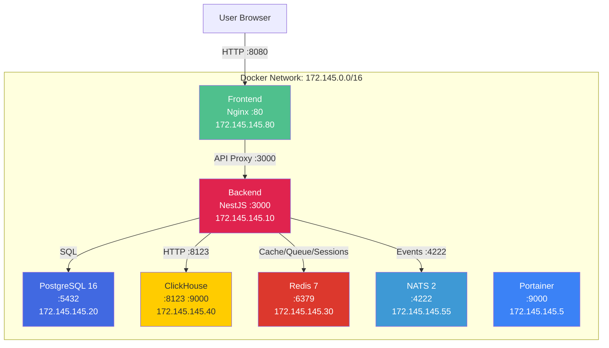

# TFO-Uptime Docker Deployment Guide

Version 1.4.0

---

## Prerequisites

- Docker Engine 20.10+
- Docker Compose v2+
- Minimum 4 GB RAM, 2 CPU cores
- 20 GB disk space for volumes
- Ports 3000, 5432, 6379, 8080, 8123, 9000, 4222 available

---

## Quick Start

```bash
# Clone the repository
git clone https://github.com/telemetryflow/telemetryflow-uptime.git
cd telemetryflow-uptime

# Copy and configure environment
cp .env.example .env

# Start all uptime services
docker-compose --profile uptime up -d

# Verify all services are healthy
docker-compose ps
```

The application will be available at `http://localhost:8080` (frontend) and `http://localhost:3000` (API).

---

## Docker Profiles

The Docker Compose file uses profiles to control which services start:

| Profile  | Services                                               | Use Case                     |
| -------- | ------------------------------------------------------ | ---------------------------- |
| `uptime` | PostgreSQL, ClickHouse, Redis, NATS, Backend, Frontend | Production deployment        |
| `tools`  | Portainer                                              | Infrastructure management    |
| `all`    | All services combined                                  | Full development environment |

```bash
# Uptime services only (recommended for production)
docker-compose --profile uptime up -d

# Include management tools
docker-compose --profile uptime --profile tools up -d

# Start everything
docker-compose --profile all up -d
```

---

## Service Architecture



---

## Service Details

| Service      | Image                                 | Port(s)                                    | Purpose                            | Profile     |
| ------------ | ------------------------------------- | ------------------------------------------ | ---------------------------------- | ----------- |
| `postgres`   | `postgres:16-alpine`                  | 5432                                       | Primary relational database        | uptime, all |
| `clickhouse` | `clickhouse/clickhouse-server:latest` | 8123 (HTTP), 9000 (Native), 9363 (Metrics) | Time-series analytics              | uptime, all |
| `redis`      | `redis:7-alpine`                      | 6379                                       | Cache, sessions, BullMQ queues     | uptime, all |
| `nats`       | `nats:2-alpine`                       | 4222 (Client), 8222 (Monitor)              | Domain event messaging (JetStream) | uptime, all |
| `backend`    | Custom (Dockerfile.backend)           | 3000                                       | NestJS API server                  | uptime      |
| `frontend`   | Custom (Dockerfile.frontend)          | 80                                         | Vue 3 SPA via Nginx                | uptime      |
| `portainer`  | `portainer/portainer-ce:latest`       | 9000, 9443                                 | Docker management UI               | tools, all  |

---

## Environment Configuration

All configuration is managed through the `.env` file. Copy `.env.example` as a starting point:

```bash
cp .env.example .env
```

### Critical Variables

| Variable              | Default       | Description                                |
| --------------------- | ------------- | ------------------------------------------ |
| `NODE_ENV`            | `development` | Set to `production` for deployment         |
| `JWT_SECRET`          | (empty)       | JWT signing key (32+ characters, required) |
| `JWT_REFRESH_SECRET`  | (empty)       | Refresh token signing key (32+ characters) |
| `SESSION_SECRET`      | (empty)       | Session encryption key                     |
| `ENCRYPTION_KEY`      | (empty)       | Data encryption key                        |
| `MFA_ENCRYPTION_KEY`  | (empty)       | MFA secret encryption key                  |
| `LLM_ENCRYPTION_KEY`  | (empty)       | LLM API key encryption key                 |
| `CORS_ORIGIN`         | `*`           | Allowed origins (restrict in production)   |
| `POSTGRES_PASSWORD`   | (empty)       | PostgreSQL password                        |
| `CLICKHOUSE_PASSWORD` | (empty)       | ClickHouse password                        |
| `REDIS_PASSWORD`      | (empty)       | Redis password                             |

### Database Configuration

| Variable            | Default            | Description                                |
| ------------------- | ------------------ | ------------------------------------------ |
| `POSTGRES_HOST`     | `postgres`         | PostgreSQL host (container name in Docker) |
| `POSTGRES_PORT`     | `5432`             | PostgreSQL port                            |
| `POSTGRES_DB`       | `telemetryflow_db` | Database name                              |
| `POSTGRES_USERNAME` | `postgres`         | Database user                              |
| `CLICKHOUSE_HOST`   | `clickhouse`       | ClickHouse host                            |
| `CLICKHOUSE_PORT`   | `8123`             | ClickHouse HTTP port                       |
| `CLICKHOUSE_DB`     | `telemetryflow_db` | ClickHouse database                        |
| `REDIS_HOST`        | `redis`            | Redis host                                 |
| `REDIS_PORT`        | `6379`             | Redis port                                 |
| `NATS_URL`          | `nats://nats:4222` | NATS connection URL                        |

### Generate Secure Secrets

```bash
pnpm run generate:secrets
```

This generates cryptographically secure random values for all secret fields.

---

## Volume Management

All persistent data is stored under `VOLUMES_BASE_PATH` (default: `/opt/data/docker/telemetryflow-uptime`).

| Service    | Host Path                              | Container Path               | Purpose                 |
| ---------- | -------------------------------------- | ---------------------------- | ----------------------- |
| PostgreSQL | `${VOLUMES_BASE_PATH}/postgresql`      | `/var/lib/postgresql/data`   | Database files          |
| ClickHouse | `${VOLUMES_BASE_PATH}/clickhouse/data` | `/var/lib/clickhouse`        | Time-series data        |
| ClickHouse | `${VOLUMES_BASE_PATH}/clickhouse/logs` | `/var/log/clickhouse-server` | Server logs             |
| Redis      | `${VOLUMES_BASE_PATH}/redis`           | `/data`                      | Persistence (AOF + RDB) |
| NATS       | `${VOLUMES_BASE_PATH}/nats`            | `/data`                      | JetStream state         |
| Portainer  | `${VOLUMES_BASE_PATH}/portainer`       | `/data`                      | Portainer data          |

### Backup

```bash
# PostgreSQL backup
docker exec telemetryflow_uptime_postgres pg_dump -U postgres telemetryflow_db > backup.sql

# ClickHouse backup
docker exec telemetryflow_uptime_clickhouse clickhouse-client --query "BACKUP DATABASE telemetryflow_db TO Disk('backups', 'backup.zip')"
```

### Restore

```bash
# PostgreSQL restore
cat backup.sql | docker exec -i telemetryflow_uptime_postgres psql -U postgres telemetryflow_db
```

---

## Health Checks

Each infrastructure service has a health check configured:

| Service    | Check Command                                    | Interval | Timeout | Retries |
| ---------- | ------------------------------------------------ | -------- | ------- | ------- |
| PostgreSQL | `pg_isready -U postgres -d telemetryflow_db`     | 10s      | 5s      | 5       |
| ClickHouse | `wget --spider -q http://localhost:8123/ping`    | 10s      | 5s      | 5       |
| Redis      | `redis-cli ping`                                 | 10s      | 5s      | 5       |
| NATS       | `wget --spider -q http://localhost:8222/healthz` | 10s      | 5s      | 5       |

The `backend` service uses `depends_on` with `condition: service_healthy` to ensure all databases are ready before starting.

---

## Networking

All services run on a dedicated bridge network:

- **Network name:** `telemetryflow_uptime_net`
- **Subnet:** `172.145.0.0/16`
- **Driver:** bridge

### Static IP Assignments

| Service    | IP Address     |
| ---------- | -------------- |
| Portainer  | 172.145.145.5  |
| Backend    | 172.145.145.10 |
| PostgreSQL | 172.145.145.20 |
| Redis      | 172.145.145.30 |
| NATS       | 172.145.145.55 |
| ClickHouse | 172.145.145.40 |
| Frontend   | 172.145.145.80 |

---

## Building Custom Images

### Backend Image

```bash
docker build -f Dockerfile.backend -t telemetryflow-uptime-backend:local .
```

The backend image:

- Based on `node:22-alpine`
- Multi-stage build (install, build, production)
- Runs as non-root user
- Exposes port 3000

### Frontend Image

```bash
docker build -f Dockerfile.frontend -t telemetryflow-uptime-frontend:local .
```

The frontend image:

- Multi-stage build: Node.js build + Nginx serve
- Nginx configured to proxy `/api` requests to the backend
- Exposes port 80

---

## Docker Compose Commands Reference

```bash
# Start services
docker-compose --profile uptime up -d

# Stop services
docker-compose --profile uptime down

# View logs
docker-compose logs -f backend
docker-compose logs -f postgres

# Restart a single service
docker-compose restart backend

# Pull latest images
docker-compose pull

# Rebuild after code changes
docker-compose --profile uptime up -d --build

# Check service status
docker-compose ps

# Execute commands in containers
docker-compose exec backend sh
docker-compose exec postgres psql -U postgres telemetryflow_db

# View resource usage
docker stats
```

---

## Production Deployment Checklist

- [ ] `NODE_ENV` set to `production`
- [ ] All secrets generated with `pnpm run generate:secrets`
- [ ] `CORS_ORIGIN` set to specific trusted domains (no wildcard)
- [ ] `POSTGRES_PASSWORD` set to a strong password
- [ ] `CLICKHOUSE_PASSWORD` set to a strong password
- [ ] `REDIS_PASSWORD` set to a strong password
- [ ] HTTPS/TLS configured at reverse proxy level (Nginx/Traefik)
- [ ] `SMTP_ENABLED=true` with production SMTP credentials
- [ ] Backup schedule configured for PostgreSQL and ClickHouse
- [ ] Health check endpoints monitored externally
- [ ] Log aggregation configured (Winston with file or ClickHouse transport)
- [ ] Volume permissions verified
- [ ] Firewall rules restrict exposed ports to only what is needed
- [ ] Port 8080 (frontend) is the only externally exposed application port

---

## Troubleshooting

### Backend fails to start

```bash
# Check if all dependencies are healthy
docker-compose ps

# Check backend logs
docker-compose logs backend

# Verify database connectivity
docker-compose exec backend sh -c "nc -z postgres 5432 && echo OK || echo FAIL"
```

### PostgreSQL connection refused

```bash
# Check PostgreSQL health
docker-compose exec postgres pg_isready

# Verify credentials match .env
docker-compose exec postgres psql -U postgres -d telemetryflow_db -c "SELECT 1"
```

### ClickHouse not responding

```bash
# Check ClickHouse health
docker exec telemetryflow_uptime_clickhouse wget -q -O- http://localhost:8123/ping

# Check ClickHouse logs
docker-compose logs clickhouse --tail 50
```

### Redis connection issues

```bash
# Test Redis connectivity
docker-compose exec redis redis-cli ping

# Check Redis memory usage
docker-compose exec redis redis-cli info memory
```

### Frontend shows blank page

```bash
# Check if backend is reachable from frontend container
docker-compose exec frontend wget -q -O- http://backend:3000/health

# Check Nginx config
docker-compose exec frontend nginx -t
```

### Reset all data

```bash
# Stop and remove containers, volumes, and network
docker-compose --profile all down -v

# Start fresh
docker-compose --profile uptime up -d
```
