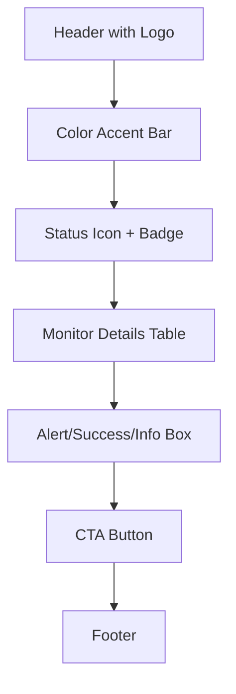
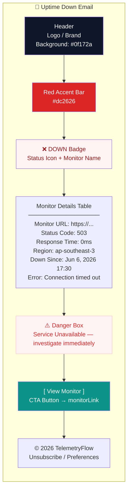
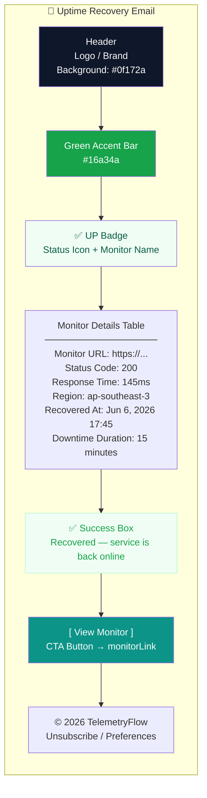
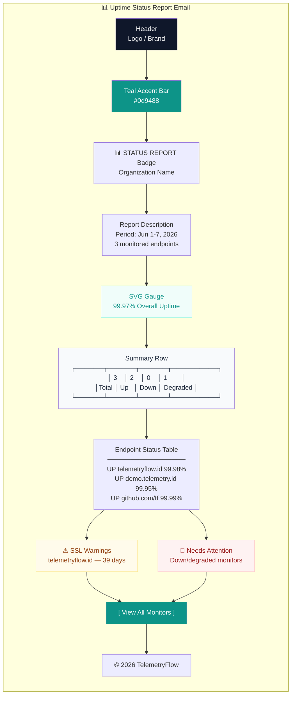

# Email Notification Template Customization

> **Version:** 1.4.0 | **Template Engine:** Handlebars | **Path:** `backend/src/modules/notification/infrastructure/templates/`

All email notifications use Handlebars (`.hbs`) templates rendered server-side by `EmailService`. This guide covers the 3 uptime-specific templates, available variables, dark mode support, and how to create custom templates.

---

## Table of Contents

1. [Template Overview](#1-template-overview)
2. [Uptime Down Template](#2-uptime-down-template)
3. [Uptime Recovery Template](#3-uptime-recovery-template)
4. [Uptime Report Template](#4-uptime-report-template)
5. [Available Variables Reference](#5-available-variables-reference)
6. [Dark Mode Support](#6-dark-mode-support)
7. [Creating Custom Templates](#7-creating-custom-templates)
8. [Registering Templates](#8-registering-templates)
9. [Testing Templates](#9-testing-templates)

---

## 1. Template Overview

| Template          | File                | Trigger                   | Accent Color    |
| ----------------- | ------------------- | ------------------------- | --------------- |
| Monitor Down      | `uptime-down.hbs`   | Monitor status: UP → DOWN | Red `#dc2626`   |
| Monitor Recovered | `uptime-up.hbs`     | Monitor status: DOWN → UP | Green `#16a34a` |
| Status Report     | `uptime-report.hbs` | Scheduled report          | Teal `#0d9488`  |

All templates share a common structure:



**Template location:** `backend/src/modules/notification/infrastructure/templates/`

**Registration:** `backend/src/modules/notification/infrastructure/templates/index.ts`

---

## 2. Uptime Down Template

**File:** `uptime-down.hbs` | **Subject:** Monitor Down - TelemetryFlow

Sent when a monitor transitions from UP to DOWN state.

### Layout



### Variables

| Variable           | Type    | Description                                         |
| ------------------ | ------- | --------------------------------------------------- |
| `{{monitorName}}`  | string  | Monitor display name                                |
| `{{monitorUrl}}`   | string  | URL being monitored                                 |
| `{{statusCode}}`   | string  | HTTP status code (e.g. "503", "0")                  |
| `{{responseTime}}` | string  | Response time with unit (e.g. "0ms")                |
| `{{region}}`       | string  | Check region (e.g. "ap-southeast-3")                |
| `{{downSince}}`    | string  | Formatted timestamp of first failure                |
| `{{errorMessage}}` | string? | Error details (conditional: `{{#if errorMessage}}`) |
| `{{monitorLink}}`  | string  | Direct link to monitor detail page                  |
| `{{logoUrl}}`      | string  | Brand logo URL                                      |
| `{{appName}}`      | string  | Application name (alt text)                         |
| `{{year}}`         | string  | Current year for copyright                          |

---

## 3. Uptime Recovery Template

**File:** `uptime-up.hbs` | **Subject:** Monitor Recovered - TelemetryFlow

Sent when a monitor transitions from DOWN to UP state.

### Layout



### Additional Variables (beyond Down template)

| Variable               | Type   | Description                                 |
| ---------------------- | ------ | ------------------------------------------- |
| `{{recoveredAt}}`      | string | Formatted timestamp of recovery             |
| `{{downtimeDuration}}` | string | Human-readable downtime (e.g. "15 minutes") |

---

## 4. Uptime Report Template

**File:** `uptime-report.hbs` | **Subject:** Uptime Status Report - TelemetryFlow

Scheduled organization-wide uptime status report.

### Layout



### Variables

| Variable                   | Type   | Description                          |
| -------------------------- | ------ | ------------------------------------ |
| `{{organizationName}}`     | string | Organization display name            |
| `{{periodRange}}`          | string | Report period (e.g. "Jun 1-7, 2026") |
| `{{totalEndpoints}}`       | number | Total monitored endpoints            |
| `{{overallUptimeDisplay}}` | string | Formatted uptime (e.g. "99.97%")     |
| `{{overallUptimeColor}}`   | string | SVG gauge color                      |
| `{{upCount}}`              | number | Endpoints with UP status             |
| `{{downCount}}`            | number | Endpoints with DOWN status           |
| `{{degradedCount}}`        | number | Endpoints with DEGRADED status       |
| `{{reportLink}}`           | string | Link to dashboard                    |
| `{{#each endpoints}}`      | array  | Per-endpoint status rows             |
| `{{#each regions}}`        | array  | Region performance (conditional)     |
| `{{#each sslWarnings}}`    | array  | SSL expiry warnings (conditional)    |
| `{{#each needsAttention}}` | array  | Down/degraded monitors (conditional) |

---

## 5. Available Variables Reference

### Common Variables (all templates)

| Variable      | Source                     | Description              |
| ------------- | -------------------------- | ------------------------ |
| `{{logoUrl}}` | `EmailService` config      | Brand logo image URL     |
| `{{appName}}` | `EmailService` config      | Application display name |
| `{{year}}`    | `new Date().getFullYear()` | Current year             |

### Conditional Blocks (Handlebars)

```handlebars
{{#if errorMessage}}
  <tr>
    <td>Error: {{errorMessage}}</td>
  </tr>
{{/if}}

{{#if hasMultipleRegions}}
  <!-- Region Performance table -->
{{/if}}

{{#if hasSSLWarnings}}
  <!-- SSL Certificate Warnings -->
{{/if}}

{{#if hasNeedsAttention}}
  <!-- Needs Attention list -->
{{/if}}
```

### Iteration Blocks

```handlebars
{{#each endpoints}}
  <td>{{name}}</td>
  <td>{{url}}</td>
  <td>{{status}}</td>
  <td>{{uptimePercent}}</td>
  <td>{{responseTime}}</td>
{{/each}}

{{#each sslWarnings}}
  <td>{{monitorName}}</td>
  <td>{{daysUntilExpiry}}</td>
  <td>{{urgencyColor}}</td>
{{/each}}
```

---

## 6. Dark Mode Support

All templates include `@media (prefers-color-scheme: dark)` CSS rules. The dark mode palette:

| Element         | Light     | Dark                  |
| --------------- | --------- | --------------------- |
| Body background | `#f1f5f9` | `#0f172a`             |
| Container       | `#ffffff` | `#1e293b`             |
| Header          | `#0f172a` | `#0f172a` (unchanged) |
| Heading text    | `#0f172a` | `#f1f5f9`             |
| Body text       | `#475569` | `#cbd5e1`             |
| Detail labels   | `#64748b` | `#94a3b8`             |
| Danger box bg   | `#fef2f2` | `#450a0a`             |
| Success box bg  | `#f0fdf4` | `#052e16`             |
| Alert box bg    | `#fffbeb` | `#451a03`             |
| Footer border   | `#e2e8f0` | `#334155`             |

No changes needed — dark mode is automatic based on the email client's preference.

---

## 7. Creating Custom Templates

### Step 1: Create the Template File

Create a new `.hbs` file in `backend/src/modules/notification/infrastructure/templates/`:

```handlebars
<html lang="en">
  <head>
    <meta charset="UTF-8" />
    <meta name="viewport" content="width=device-width, initial-scale=1.0" />
    <title>Custom Alert - {{appName}}</title>
    <style>
      /* Include responsive + dark mode CSS from existing templates */
      @media (prefers-color-scheme: dark) {
        /* dark mode overrides */
      }
      @media only screen and (max-width: 620px) {
        .email-container {
          width: 100% !important;
        }
      }
    </style>
  </head>
  <body>
    <table role="presentation" width="100%">
      <tr>
        <td align="center">
          <table class="email-container" style="max-width:800px;">
            <tr>
              <td
                class="header-bg"
                style="background-color:#0f172a; padding:32px 40px;"
              >
                
              </td>
            </tr>
            <tr>
              <td style="padding:40px;">
                <h1>{{monitorName}} — Custom Alert</h1>
                <p>Status: {{status}}, Response: {{responseTime}}</p>
              </td>
            </tr>
          </table>
        </td>
      </tr>
    </table>
  </body>
</html>
```

### Step 2: Use Existing CSS Classes

Copy these shared CSS classes from existing templates:

| Class              | Purpose                               |
| ------------------ | ------------------------------------- |
| `.email-container` | Main card container (800px max-width) |
| `.header-bg`       | Dark header background                |
| `.body-text`       | Standard body text color              |
| `.detail-row-bg`   | Table row background                  |
| `.detail-label`    | Label column styling                  |
| `.detail-value`    | Value column styling                  |
| `.danger-box`      | Red alert box                         |
| `.success-box`     | Green success box                     |
| `.alert-box`       | Amber warning box                     |
| `.info-box`        | Teal info box                         |
| `.button-a`        | CTA button styling                    |
| `.footer-text`     | Footer text styling                   |

---

## 8. Registering Templates

Add the template to `backend/src/modules/notification/infrastructure/templates/index.ts`:

```typescript
export const TEMPLATE_FILES = {
  // ... existing templates
  UPTIME_CUSTOM: "uptime-custom.hbs", // Add entry
} as const;
```

Then reference it in `EmailService`:

```typescript
import { getTemplatePath } from "../templates";

async function sendCustomEmail(to: string, data: object) {
  const templatePath = getTemplatePath("UPTIME_CUSTOM");
  const compiled = Handlebars.compile(fs.readFileSync(templatePath, "utf8"));
  const html = compiled(data);
  // send via SMTP
}
```

---

## 9. Testing Templates

### Via API (Live Test)

```bash
# Test a notification channel (sends a test email using the alert-notification template)
POST /api/v2/notification-channels/:channelId/test
```

### Via EmailService (Development)

```typescript
import { EmailService } from "@/modules/notification/domain/services/EmailService";

const emailService = app.get(EmailService);

// Preview rendered HTML without sending
const html = await emailService.renderUptimeDownEmail({
  monitorName: "Test Monitor",
  monitorUrl: "https://example.com",
  statusCode: "503",
  responseTime: "0ms",
  region: "ap-southeast-3",
  downSince: "Jun 6, 2026 17:30:00 UTC",
  errorMessage: "Connection timed out",
  monitorLink: "http://localhost:3000/uptime/monitors/test-id",
  logoUrl: "https://telemetryflow.id/logo.png",
  appName: "TelemetryFlow Uptime",
  year: "2026",
});
```

### Template Compatibility Notes

| Email Client         | Support                                                   |
| -------------------- | --------------------------------------------------------- |
| Gmail (Web)          | Full support (dark mode, responsive)                      |
| Outlook (Desktop)    | Limited — uses MSO conditional comments for logo fallback |
| Apple Mail           | Full support (dark mode, responsive)                      |
| Yahoo Mail           | Full support                                              |
| Mobile (iOS/Android) | Full support (responsive layout)                          |

The templates include `<!--[if mso]>` conditional comments for Microsoft Outlook compatibility, using VML roundrect for buttons and text fallbacks for SVG icons.
