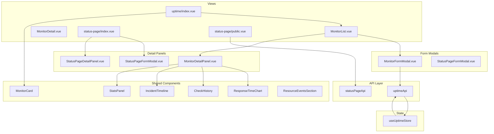

# TelemetryFlow-Uptime Frontend Architecture Guide

- **Version:** 1.4.0
- **API Prefix:** `/api/v2`
- **License:** Apache-v2.0 -- Telemetri Data Indonesia

---

## Technology Stack

| Technology | Version | Purpose                        |
| ---------- | ------- | ------------------------------ |
| Vue 3      | 5.x     | UI framework (Composition API) |
| Vite       | Latest  | Build tool and dev server      |
| Pinia      | Latest  | State management               |
| Naive UI   | Latest  | Component library              |
| Vue Router | 4.x     | Client-side routing            |
| UnoCSS     | Latest  | Utility-first CSS engine       |
| SCSS       | Latest  | CSS preprocessor               |
| TypeScript | 5.9+    | Type safety                    |
| Day.js     | Latest  | Date formatting                |

---

## Project Structure

```
frontend/src/
├── api/                          # API client layer
│   ├── collector.ts              # Axios HTTP client (base)
│   ├── uptime.ts                 # Uptime monitor endpoints
│   ├── statuspage.ts             # Status page endpoints
│   ├── auth.ts                   # Authentication endpoints
│   ├── iam.ts                    # IAM endpoints
│   ├── alerting.ts               # Alerting endpoints
│   ├── roles.ts                  # Role management
│   ├── permissions.ts            # Permission management
│   ├── users.ts                  # User management
│   ├── organizations.ts          # Organization management
│   ├── workspaces.ts             # Workspace management
│   ├── tenants.ts                # Tenant management
│   ├── regions.ts                # Region management
│   ├── apikeys.ts                # API key management
│   ├── sso.ts                    # SSO configuration
│   ├── audit.ts                  # Audit log queries
│   ├── data-masking.ts           # Data masking rules
│   ├── retention.ts              # Retention policies
│   ├── llm.ts                    # LLM provider management
│   ├── notification-channels.ts  # Notification channels
│   ├── notification-settings.ts  # Notification preferences
│   └── ...
├── components/                   # Shared UI components
├── composables/                  # Vue composables (hooks)
├── config/                       # App configuration
│   └── theme.ts                  # Theme configuration
├── constants/                    # Constants and registries
│   ├── graph-registry.ts         # Graph configuration registry
│   ├── stat-panel-registry.ts    # Stats panel registry
│   └── mini-graphs/              # Module-specific mini graphs
├── directives/                   # Vue directives
│   ├── index.ts                  # Directive exports
│   └── permission.ts             # v-permission directive
├── layouts/                      # Layout components
│   └── MainLayout.vue            # Authenticated layout shell
├── plugins/                      # Vue plugins
│   └── dayjs.ts                  # Day.js configuration
├── router/                       # Routing
│   ├── index.ts                  # Router setup
│   ├── routes.ts                 # Route registration
│   └── modules/                  # Route module files
│       ├── monitoring.routes.ts  # Uptime and status page routes
│       ├── public.routes.ts      # Public status page route
│       ├── auth.routes.ts        # Authentication routes
│       ├── iam.routes.ts         # IAM routes
│       ├── tenancy.routes.ts     # Tenancy routes
│       ├── settings.routes.ts    # Settings routes
│       ├── alerts.routes.ts      # Alert routes
│       ├── audit.routes.ts       # Audit routes
│       ├── account.routes.ts     # Account routes
│       └── error.routes.ts       # Error page routes
├── store/                        # Pinia stores
│   ├── index.ts                  # Store exports
│   ├── uptime.ts                 # Uptime monitoring store
│   ├── auth.ts                   # Authentication store
│   ├── app.ts                    # Application state store
│   ├── alerts.ts                 # Alerts store
│   ├── llm.ts                    # LLM store
│   └── data-masking.ts           # Data masking store
├── styles/                       # Global styles and SCSS
├── types/                        # TypeScript type definitions
│   ├── uptime.ts                 # Uptime types and transforms
│   ├── statuspage.ts             # Status page types and transforms
│   ├── api.ts                    # API response types
│   ├── session.ts                # Session types
│   ├── apikey.ts                 # API key types
│   ├── sso.ts                    # SSO types
│   ├── iam-assignments.ts        # IAM assignment types
│   ├── iam-matrix.ts             # Permission matrix types
│   └── ...
├── utils/                        # Utility functions
├── views/                        # View components
│   ├── monitoring/
│   │   ├── uptime/               # Uptime monitoring views
│   │   │   ├── index.vue         # Main uptime dashboard
│   │   │   └── components/
│   │   │       ├── MonitorList.vue
│   │   │       ├── MonitorDetail.vue
│   │   │       ├── MonitorDetailPanel.vue
│   │   │       ├── MonitorFormModal.vue
│   │   │       └── UptimeGraphs.vue
│   │   └── status-page/          # Status page views
│   │       ├── index.vue         # Status page list
│   │       ├── public.vue        # Public status page
│   │       └── components/
│   │           ├── StatusPageFormModal.vue
│   │           └── StatusPageDetailPanel.vue
│   ├── iam/                      # IAM views
│   ├── auth/                     # Authentication views
│   ├── settings/                 # Settings views
│   ├── alerts/                   # Alerts views
│   ├── audit/                    # Audit views
│   ├── tenancy/                  # Tenancy views
│   └── ...
├── App.vue                       # Root component
└── main.ts                       # Application entry point
```

---

## Routing Architecture

### Route Registration

Routes are defined in modular files under `router/modules/` and composed in `router/routes.ts`:

```typescript
// router/routes.ts
export const routes: RouteRecordRaw[] = [
  ...publicRoutes, // /status/:slug (no auth)
  ...authRoutes, // /login, /register
  {
    path: "/",
    component: MainLayout,
    redirect: "/home",
    meta: { requiresAuth: true },
    children: [
      { path: "home", name: "Home", component: Overview },
      ...alertsRoutes,
      ...iamRoutes,
      ...tenancyRoutes,
      ...auditRoutes,
      ...monitoringRoutes, // Uptime + Status Pages
      ...settingsRoutes,
      ...accountRoutes,
    ],
  },
  ...errorRoutes,
];
```

### Monitoring Routes

```typescript
// router/modules/monitoring.routes.ts
export const monitoringRoutes: RouteRecordRaw[] = [
  {
    path: "monitoring/uptime",
    name: "UptimeMonitoring",
    component: () => import("@/views/monitoring/uptime/index.vue"),
    meta: {
      title: "Uptime",
      requiresAuth: true,
      requiredPermissions: ["monitoring:uptime:read"],
    },
  },
  {
    path: "monitoring/uptime/list",
    name: "UptimeMonitorDetail",
    component: () =>
      import("@/views/monitoring/uptime/components/MonitorList.vue"),
    meta: { title: "Uptime Details", requiresAuth: true },
  },
  {
    path: "monitoring/status-page",
    name: "StatusPage",
    component: () => import("@/views/monitoring/status-page/index.vue"),
    meta: { title: "Status Pages", requiresAuth: true },
  },
];
```

### Public Routes

```typescript
// router/modules/public.routes.ts
export const publicRoutes: RouteRecordRaw[] = [
  {
    path: "/status/:slug",
    name: "PublicStatusPage",
    component: () => import("@/views/monitoring/status-page/public.vue"),
    meta: { title: "Status Page", requiresAuth: false },
  },
];
```

---

## State Management

### useUptimeStore

The uptime monitoring Pinia store manages all monitor-related state.

#### State

| Property                | Type                             | Description                 |
| ----------------------- | -------------------------------- | --------------------------- |
| `monitors`              | `ref<Monitor[]>`                 | List of monitors            |
| `total`                 | `ref<number>`                    | Total monitor count         |
| `page`                  | `ref<number>`                    | Current page                |
| `pageSize`              | `ref<number>`                    | Items per page (default 20) |
| `totalPages`            | `ref<number>`                    | Total pages                 |
| `hasNext`               | `ref<boolean>`                   | Has next page               |
| `hasPrevious`           | `ref<boolean>`                   | Has previous page           |
| `filters`               | `ref<{ status, type, groupId }>` | Active filters              |
| `selectedMonitor`       | `ref<Monitor \| null>`           | Currently selected monitor  |
| `selectedMonitorStats`  | `ref<UptimeStats \| null>`       | Stats for selected monitor  |
| `selectedMonitorChecks` | `ref<UptimeCheck[]>`             | Checks for selected monitor |
| `loading`               | `ref<boolean>`                   | List loading state          |
| `loadingMonitor`        | `ref<boolean>`                   | Detail loading state        |
| `loadingStats`          | `ref<boolean>`                   | Stats loading state         |
| `loadingChecks`         | `ref<boolean>`                   | Checks loading state        |
| `error`                 | `ref<string \| null>`            | List error                  |
| `monitorError`          | `ref<string \| null>`            | Detail error                |
| `statsError`            | `ref<string \| null>`            | Stats error                 |
| `checksError`           | `ref<string \| null>`            | Checks error                |

#### Getters

| Getter             | Returns                            | Description                      |
| ------------------ | ---------------------------------- | -------------------------------- |
| `monitorsByStatus` | `Record<MonitorStatus, Monitor[]>` | Monitors grouped by status       |
| `monitorsByType`   | `Record<MonitorType, Monitor[]>`   | Monitors grouped by type         |
| `activeMonitors`   | `Monitor[]`                        | Active, non-paused monitors      |
| `pausedMonitors`   | `Monitor[]`                        | Paused monitors                  |
| `downMonitors`     | `Monitor[]`                        | Monitors with down status        |
| `degradedMonitors` | `Monitor[]`                        | Monitors with degraded status    |
| `criticalMonitors` | `Monitor[]`                        | Down or degraded active monitors |
| `hasFilters`       | `boolean`                          | Whether any filters are active   |

#### Actions

| Action                   | Parameters                  | Description                                |
| ------------------------ | --------------------------- | ------------------------------------------ |
| `fetchMonitors`          | `query?: ListMonitorsQuery` | Fetch monitors with filters and pagination |
| `fetchMonitorDetails`    | `id: string`                | Fetch single monitor                       |
| `fetchMonitorStats`      | `id: string`                | Fetch monitor statistics                   |
| `fetchMonitorChecks`     | `id, query?`                | Fetch check history                        |
| `createMonitor`          | `data`                      | Create new monitor                         |
| `updateMonitor`          | `id, data`                  | Update existing monitor                    |
| `deleteMonitor`          | `id`                        | Delete monitor                             |
| `pauseMonitor`           | `id`                        | Pause monitor                              |
| `resumeMonitor`          | `id`                        | Resume monitor                             |
| `selectMonitor`          | `id`                        | Select and load full monitor data          |
| `clearSelectedMonitor`   | --                          | Clear selection                            |
| `setFilters`             | `newFilters`                | Update filters and refetch                 |
| `clearFilters`           | --                          | Clear all filters                          |
| `setPage`                | `newPage`                   | Change page                                |
| `setPageSize`            | `newPageSize`               | Change page size                           |
| `nextPage`               | --                          | Go to next page                            |
| `previousPage`           | --                          | Go to previous page                        |
| `refreshMonitors`        | --                          | Refetch with current state                 |
| `refreshSelectedMonitor` | --                          | Refetch selected monitor data              |
| `clearErrors`            | --                          | Clear all error states                     |

---

## API Client Layer

### Base Client (`collector.ts`)

The `collectorClient` is a configured Axios instance that:

- Adds `Authorization: Bearer <token>` header from the auth store
- Unwraps the API envelope (`response.data.data`)
- Handles token refresh on 401 responses
- Supports mock data mode via `config.useMock`

### Uptime API (`uptime.ts`)

```typescript
export const uptimeApi = {
  listMonitors(query?): Promise<PaginatedMonitors>,
  getMonitor(id): Promise<Monitor>,
  createMonitor(data): Promise<Monitor>,
  updateMonitor(id, data): Promise<Monitor>,
  deleteMonitor(id): Promise<void>,
  pauseMonitor(id): Promise<Monitor>,
  resumeMonitor(id): Promise<Monitor>,
  getMonitorChecks(id, query?): Promise<UptimeCheck[]>,
  getMonitorStats(id): Promise<UptimeStats>,
  getDailyStats(id, days?): Promise<DailyUptimeStat[]>,
  getHourlyStats(id, hours?): Promise<HourlyUptimeStat[]>,
  getSSLSummary(): Promise<SSLSummary>,
  getSSLTrend(id, hours?): Promise<SSLTrendPoint[]>,
  testMonitor(payload): Promise<TestResult>,
};
```

**Endpoints used:**

| Method | Endpoint                                   |
| ------ | ------------------------------------------ |
| GET    | `/api/v2/uptime/monitors`                  |
| GET    | `/api/v2/uptime/monitors/:id`              |
| POST   | `/api/v2/uptime/monitors`                  |
| PUT    | `/api/v2/uptime/monitors/:id`              |
| DELETE | `/api/v2/uptime/monitors/:id`              |
| POST   | `/api/v2/uptime/monitors/:id/pause`        |
| POST   | `/api/v2/uptime/monitors/:id/resume`       |
| GET    | `/api/v2/uptime/monitors/:id/checks`       |
| GET    | `/api/v2/uptime/monitors/:id/stats`        |
| GET    | `/api/v2/uptime/monitors/:id/daily-stats`  |
| GET    | `/api/v2/uptime/monitors/:id/hourly-stats` |
| GET    | `/api/v2/uptime/monitors/:id/ssl-trend`    |
| GET    | `/api/v2/uptime/monitors/ssl-summary`      |
| POST   | `/api/v2/uptime/monitors/test`             |

### Status Page API (`statuspage.ts`)

```typescript
export const statusPageApi = {
  listStatusPages(query?): Promise<PaginatedStatusPages>,
  getStatusPage(idOrSlug): Promise<StatusPage>,
  getStatusPageBySlug(slug): Promise<{ statusPage, incidents }>,
  createStatusPage(data): Promise<StatusPage>,
  updateStatusPage(id, data): Promise<StatusPage>,
  deleteStatusPage(id): Promise<void>,
  addMonitor(statusPageId, data): Promise<StatusPage>,
  removeMonitor(statusPageId, monitorId): Promise<void>,
  listIncidents(statusPageId, query?): Promise<Incident[]>,
  createIncident(statusPageId, data): Promise<Incident>,
  updateIncident(statusPageId, incidentId, data): Promise<Incident>,
  addIncidentUpdate(statusPageId, incidentId, data): Promise<Incident>,
  resolveIncident(statusPageId, incidentId): Promise<Incident>,
  subscribePublic(slug, data): Promise<SubscribeResult>,
  listSubscribers(statusPageId, confirmedOnly?): Promise<SubscriberListResult>,
  addSubscriber(statusPageId, data): Promise<Subscriber>,
  removeSubscriber(statusPageId, subscriberId): Promise<void>,
};
```

---

## Component Architecture



---

## Views Structure

### Monitoring / Uptime

| View                     | Path                      | Description                                                               |
| ------------------------ | ------------------------- | ------------------------------------------------------------------------- |
| `index.vue`              | `/monitoring/uptime`      | Main uptime dashboard with monitor grid, status summary, and SSL overview |
| `MonitorList.vue`        | `/monitoring/uptime/list` | Detailed monitor list with filters, sorting, and pagination               |
| `MonitorDetailPanel.vue` | --                        | Slide-over panel showing monitor details, stats, and check history        |
| `MonitorDetail.vue`      | --                        | Full-page monitor detail with graphs and analytics                        |
| `MonitorFormModal.vue`   | --                        | Create/edit monitor modal form                                            |
| `UptimeGraphs.vue`       | --                        | Response time and uptime percentage chart components                      |

### Monitoring / Status Pages

| View                        | Path                      | Description                                                |
| --------------------------- | ------------------------- | ---------------------------------------------------------- |
| `index.vue`                 | `/monitoring/status-page` | Status page list with creation and management              |
| `public.vue`                | `/status/:slug`           | Public-facing status page (no auth)                        |
| `StatusPageFormModal.vue`   | --                        | Create/edit status page modal                              |
| `StatusPageDetailPanel.vue` | --                        | Status page detail with incident and subscriber management |

---

## Shared Components

| Component             | Location | Description                                                            |
| --------------------- | -------- | ---------------------------------------------------------------------- |
| MonitorCard           | Shared   | Monitor status card showing name, uptime, response time, heartbeat bar |
| ResponseTimeChart     | Shared   | Time-series chart for response time data                               |
| CheckHistory          | Shared   | Tabular check history with status indicators                           |
| IncidentTimeline      | Shared   | Incident timeline with status updates                                  |
| StatsPanel            | Shared   | Statistics panel with uptime percentages and percentiles               |
| ResourceEventsSection | Shared   | Event section for status page incidents                                |

---

## Type Definitions

### uptime.ts

Core types for the uptime monitoring module:

- `Monitor` -- Frontend monitor model (camelCase)
- `MonitorResponse` -- Backend response model (snake_case)
- `UptimeCheck` -- Individual check result
- `UptimeStats` -- Aggregated statistics with percentiles
- `DailyUptimeStat` -- Per-day aggregation
- `HourlyUptimeStat` -- Per-hour aggregation
- `MonitorType` -- 23 monitor types (http, https, tcp, ping, dns, etc.)
- `MonitorStatus` -- 6 statuses (up, down, degraded, paused, pending, unknown)
- `CheckStatus` -- 4 check statuses (success, failure, timeout, error)
- `HttpMethod` -- HTTP verbs
- `transformMonitor()` -- Converts snake_case backend response to camelCase frontend model

### statuspage.ts

Core types for the status page module:

- `StatusPage` -- Status page entity
- `StatusPageResponse` -- Backend response model
- `Incident` -- Incident entity with updates
- `Subscriber` -- Subscriber entity
- `OverallStatus` -- 6 statuses (operational, degraded_performance, partial_outage, major_outage, maintenance, unknown)
- `IncidentImpact` -- 4 levels (none, minor, major, critical)
- `IncidentStatus` -- 7 statuses (investigating, identified, monitoring, resolved, scheduled, in_progress, completed)
- `NotificationType` -- 3 types (all, incidents_only, maintenance_only)
- `transformStatusPage()`, `transformIncident()`, `transformSubscriber()` -- Backend-to-frontend transformers

---

## Styling

### UnoCSS

Utility-first CSS framework used throughout the application. Configuration is in `uno.config.ts`.

### SCSS

Global SCSS variables and mixins are defined in `styles/`. Component-specific styles use `<style lang="scss" scoped>`.

### Dark Mode

The application supports dark mode through Naive UI's theme system. Theme configuration is in `config/theme.ts`.

### Uptime Color Palette

Canonical colors used for uptime status indicators (defined in `types/uptime.ts`):

| Color  | Hex       | Usage                                |
| ------ | --------- | ------------------------------------ |
| Green  | `#22c55e` | Up / Success                         |
| Red    | `#ef4444` | Down / Failure                       |
| Gray   | `#9ca3af` | No Data / Paused / Unknown           |
| Orange | `#f59e0b` | Degraded / Timeout / Error / Pending |
