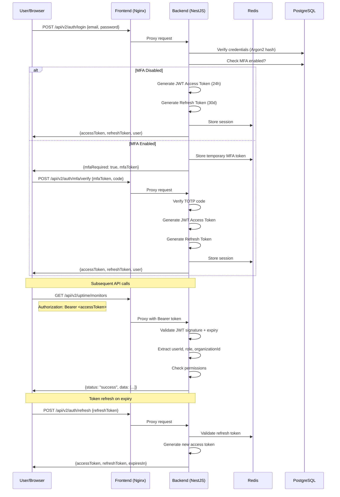
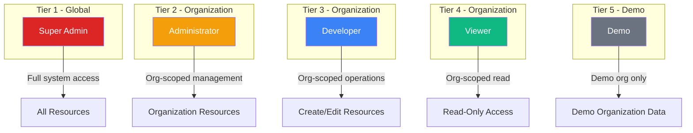
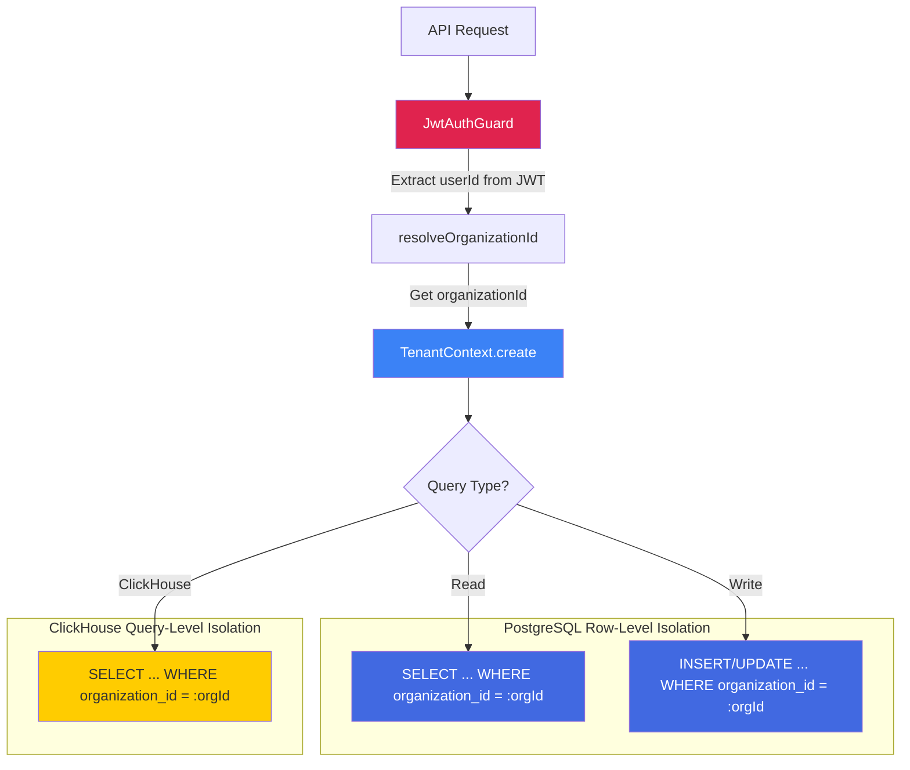
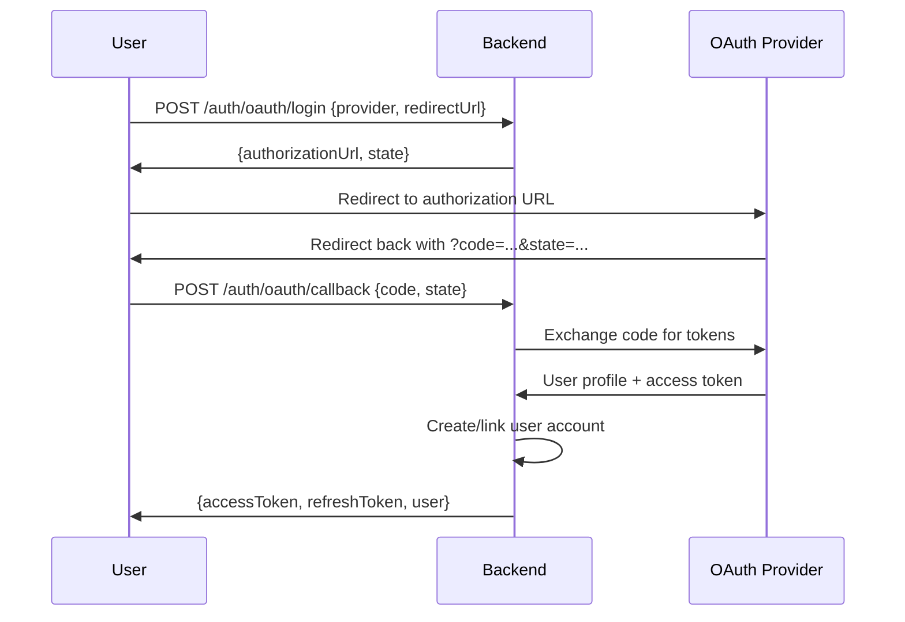

# TelemetryFlow-Uptime Security Architecture

- **Version:** 1.4.0
- **API Prefix:** `/api/v2`
- **License:** Apache-v2.0 -- Telemetri Data Indonesia

---

## Authentication Flow



---

## JWT Token Structure

### Access Token

**Header:**

```json
{
  "alg": "HS256",
  "typ": "JWT"
}
```

**Payload:**

```json
{
  "userId": "550e8400-e29b-41d4-a716-446655440000",
  "email": "user@example.com",
  "role": "administrator",
  "organizationId": "org-1234567890",
  "workspaceId": "ws-abc123",
  "sessionId": "session-xyz",
  "iat": 1700000000,
  "exp": 1700086400
}
```

**Configuration:**

| Parameter            | Value                | Description                           |
| -------------------- | -------------------- | ------------------------------------- |
| Algorithm            | HS256                | HMAC with SHA-256                     |
| Access Token Expiry  | 24 hours             | Configurable via `JWT_ACCESS_EXPIRY`  |
| Refresh Token Expiry | 30 days              | Configurable via `JWT_REFRESH_EXPIRY` |
| Secret               | `JWT_SECRET`         | Must be 32+ characters                |
| Refresh Secret       | `JWT_REFRESH_SECRET` | Separate from access secret           |

---

## 5-Tier RBAC System



### Role Descriptions

| Role          | Tier | Scope             | Description                                                                            |
| ------------- | ---- | ----------------- | -------------------------------------------------------------------------------------- |
| Super Admin   | 1    | Global            | Full platform access, manage all organizations, invite tokens, system configuration    |
| Administrator | 2    | Organization      | Manage organization resources, users, roles, all monitors and status pages             |
| Developer     | 3    | Organization      | Create, edit, and delete monitors, status pages, and incidents within the organization |
| Viewer        | 4    | Organization      | Read-only access to monitors, status pages, and dashboards                             |
| Demo          | 5    | Demo Organization | Restricted to demo organization, same permissions as Viewer                            |

---

## Permission Model

### Monitoring Permissions

| Permission                     | Description                                       | Minimum Role |
| ------------------------------ | ------------------------------------------------- | ------------ |
| `monitoring:uptime:read`       | View monitors, check history, statistics          | Viewer       |
| `monitoring:uptime:write`      | Create, update, delete monitors; pause/resume     | Developer    |
| `monitoring:status-page:read`  | View status pages, incidents, subscribers         | Viewer       |
| `monitoring:status-page:write` | Create, update, delete status pages and incidents | Developer    |

### IAM Permissions

| Permission               | Description                       | Minimum Role  |
| ------------------------ | --------------------------------- | ------------- |
| `iam:user:read`          | View user profiles and list users | Administrator |
| `iam:user:write`         | Create, update, delete users      | Administrator |
| `iam:role:read`          | View roles and their permissions  | Administrator |
| `iam:role:write`         | Create, update, delete roles      | Super Admin   |
| `iam:permission:read`    | View permission definitions       | Administrator |
| `iam:organization:read`  | View organizations                | Administrator |
| `iam:organization:write` | Create, update organizations      | Super Admin   |
| `iam:workspace:read`     | View workspaces                   | Administrator |
| `iam:workspace:write`    | Create, update workspaces         | Administrator |
| `iam:tenant:read`        | View tenants                      | Administrator |
| `iam:tenant:write`       | Create, update tenants            | Super Admin   |
| `iam:group:read`         | View groups                       | Viewer        |
| `iam:group:write`        | Create, update groups             | Developer     |
| `iam:region:read`        | View regions                      | Viewer        |
| `iam:region:write`       | Create, update regions            | Super Admin   |

### Platform Permissions

| Permission                | Description                          | Minimum Role  |
| ------------------------- | ------------------------------------ | ------------- |
| `platform:audit`          | Access audit logs                    | Administrator |
| `data-masking:read`       | View data masking rules              | Administrator |
| `alerting:rule:read`      | View alert rules                     | Viewer        |
| `alerting:rule:write`     | Create, update alert rules           | Developer     |
| `alerting:instance:read`  | View alert instances                 | Viewer        |
| `alerting:instance:write` | Acknowledge, resolve alerts          | Developer     |
| `alerting:channel:read`   | View notification channels           | Viewer        |
| `alerting:channel:write`  | Create, update notification channels | Developer     |

---

## Multi-Tenancy Isolation



All queries are scoped by `organizationId` extracted from the JWT token. The `resolveOrganizationId()` utility ensures the user can only access resources within their assigned organization.

### Isolation Layers

| Layer          | Mechanism                                  | Scope                                          |
| -------------- | ------------------------------------------ | ---------------------------------------------- |
| API Gateway    | `JwtAuthGuard` + `PermissionsGuard`        | Request-level authentication and authorization |
| Tenant Context | `TenantContext.create({ organizationId })` | All CQRS commands and queries                  |
| PostgreSQL     | `WHERE organization_id = :orgId`           | Row-level filtering on every query             |
| ClickHouse     | `WHERE organization_id = :orgId`           | Query-level filtering on time-series data      |
| API Keys       | Scoped to `organizationId`                 | API key can only access its org's data         |

---

## API Key Authentication

API keys provide an alternative authentication method for programmatic access.

### Characteristics

- Scoped to a specific organization
- Can have granular permission assignments
- Keys are hashed at rest (only shown once at creation)
- Support expiration dates
- Can be revoked independently of user accounts

### Authentication

API keys are sent via the `x-api-key` header:

```
x-api-key: <API_KEY_ID>:<API_KEY_SECRET>
```

The backend validates the key, resolves the associated organization and permissions, and applies the same RBAC checks as JWT authentication.

---

## Password Security

| Aspect                | Implementation                                                      |
| --------------------- | ------------------------------------------------------------------- |
| Hashing algorithm     | Argon2 (industry standard)                                          |
| Password requirements | Minimum 8 characters, mix of uppercase, lowercase, numbers, symbols |
| Password history      | Last 5 passwords stored, prevents reuse                             |
| Account lockout       | 5 failed attempts = 30-minute lock                                  |
| MFA lockout           | 5 failed MFA attempts = 15-minute lock                              |
| Password reset token  | Single-use, time-limited (1 hour expiry)                            |
| Change password       | Requires current password verification, terminates other sessions   |

---

## MFA Support

Multi-factor authentication using TOTP (Time-based One-Time Password).

### Setup Flow

1. `GET /api/v2/auth/mfa/setup` -- Generates secret, QR code, and 5 backup codes
2. User adds secret to authenticator app (Google Authenticator, Authy, etc.)
3. `POST /api/v2/auth/mfa/enable` -- Verifies first TOTP code to activate MFA
4. MFA secret and backup codes encrypted with `MFA_ENCRYPTION_KEY` (AES-256-GCM)

### Login with MFA

1. `POST /api/v2/auth/login` -- Returns `mfaRequired: true` with `mfaToken`
2. `POST /api/v2/auth/mfa/verify` -- Verifies TOTP code or backup code
3. Backup codes are single-use and invalidated after use

### Disable MFA

`POST /api/v2/auth/mfa/disable` -- Requires password re-authentication

---

## SSO Integration

### Supported Protocols

| Protocol  | Implementation | Description                               |
| --------- | -------------- | ----------------------------------------- |
| OAuth 2.0 | Google, GitHub | Social login with authorization code flow |
| SAML 2.0  | SSO providers  | Enterprise SSO (Okta, Azure AD, etc.)     |
| OIDC      | OpenID Connect | Standard OIDC provider support            |

### OAuth Flow



### SSO Configuration

SSO providers are managed per organization through the `/api/v2/sso/providers` endpoints. Configuration includes client ID, client secret, and callback URLs.

---

## Data Encryption

### Encryption at Rest

| Data                   | Algorithm   | Key Variable                  |
| ---------------------- | ----------- | ----------------------------- |
| LLM API keys           | AES-256-GCM | `LLM_ENCRYPTION_KEY`          |
| MFA secrets            | AES-256-GCM | `MFA_ENCRYPTION_KEY`          |
| General sensitive data | AES-256-GCM | `ENCRYPTION_KEY`              |
| Passwords              | Argon2      | One-way hash (not encryption) |

### Encryption in Transit

- All inter-service communication within Docker network is on the private subnet (172.145.0.0/16)
- Production deployments should use HTTPS/TLS at the reverse proxy level
- ClickHouse and PostgreSQL connections support SSL configuration

---

## Audit Logging

### Architecture

All security-relevant operations are logged to ClickHouse for long-term retention and analysis.

| Property     | Value                                        |
| ------------ | -------------------------------------------- |
| Storage      | ClickHouse `audit_logs` table                |
| Retention    | 90 days (TTL)                                |
| Partitioning | Monthly (`toYYYYMM(timestamp)`)              |
| Ordering     | `(user_id, timestamp)`                       |
| Indexes      | Bloom filter on `action` and `resource_type` |

### Logged Events

| Category       | Events                                                                        |
| -------------- | ----------------------------------------------------------------------------- |
| Authentication | login, logout, register, token_refresh                                        |
| MFA            | mfa_setup, mfa_enable, mfa_disable, mfa_verify                                |
| Password       | password_change, password_reset_request, password_reset_confirm               |
| IAM            | user_create, user_update, user_delete, role_assign, role_remove               |
| Monitoring     | monitor_create, monitor_update, monitor_delete, monitor_pause, monitor_resume |
| Status Pages   | status_page_create, status_page_update, status_page_delete, incident_create   |

### Audit Log Record

```json
{
  "id": "uuid",
  "user_id": "uuid",
  "action": "login",
  "resource_type": "auth",
  "resource_id": "user-uuid",
  "metadata": "{\"ipAddress\":\"192.168.1.1\",\"userAgent\":\"Chrome/120\"}",
  "ip_address": "192.168.1.1",
  "user_agent": "Mozilla/5.0...",
  "timestamp": "2026-06-01T12:00:00Z"
}
```

---

## CORS Configuration

| Environment | `CORS_ORIGIN`    | Description                             |
| ----------- | ---------------- | --------------------------------------- |
| Development | `*`              | Allows all origins                      |
| Production  | Specific domains | Comma-separated list of trusted origins |

Production example:

```
CORS_ORIGIN=https://status.example.com,https://demo.example.com
```

Wildcards should never be used in production.

---

## Rate Limiting

| Endpoint                               | Limit        | Window     | Key        | Skip Condition         |
| -------------------------------------- | ------------ | ---------- | ---------- | ---------------------- |
| `POST /auth/login`                     | 5 requests   | 15 minutes | IP address | `NODE_ENV=development` |
| `POST /auth/mfa/verify`                | 5 requests   | 15 minutes | IP address | `NODE_ENV=development` |
| `POST /auth/password-reset/request`    | 3 requests   | 1 hour     | Email      | `NODE_ENV=development` |
| `POST /auth/password-reminder/request` | 3 requests   | 24 hours   | Email      | `NODE_ENV=development` |
| Global API                             | 500 requests | 60 seconds | IP address | `NODE_ENV=development` |

Rate limiting is implemented via a custom `RateLimitGuard` backed by Redis.

---

## Security Headers

The backend applies security headers to all responses:

| Header                      | Value                                 | Purpose                    |
| --------------------------- | ------------------------------------- | -------------------------- |
| `X-Content-Type-Options`    | `nosniff`                             | Prevent MIME type sniffing |
| `X-Frame-Options`           | `DENY`                                | Prevent clickjacking       |
| `X-XSS-Protection`          | `1; mode=block`                       | XSS filtering              |
| `Strict-Transport-Security` | `max-age=31536000; includeSubDomains` | Force HTTPS                |
| `Content-Security-Policy`   | Configured                            | Control resource loading   |

---

## Session Management

### Session Storage

Sessions are stored in Redis for fast access and automatic expiration.

| Property               | Value                         |
| ---------------------- | ----------------------------- |
| Storage                | Redis (DB 0)                  |
| Session key            | `sess:{sessionId}`            |
| Access token blacklist | Redis set for revoked tokens  |
| Refresh token tracking | Redis hash for token rotation |

### Session Lifecycle

1. **Login** -- Create session record with device fingerprint, IP, user agent
2. **Activity** -- Update last-seen timestamp on each authenticated request
3. **New device** -- Email notification sent on login from unrecognized device
4. **Logout** -- Add tokens to revocation blacklist, delete session
5. **Password change** -- Terminate all sessions except current
6. **Account lock** -- All sessions invalidated

### Device Tracking

The system tracks devices by browser fingerprint, storing:

- Device name, browser, OS
- IP address and approximate location
- First seen and last seen timestamps
- Verified and trusted status

Users can view and revoke individual devices or all sessions from the account security settings.

---

## Input Validation

All API input is validated using `class-validator` decorators on DTO classes:

- Type checking (string, number, email, UUID)
- Length constraints
- Enum validation for status and type fields
- URL validation via `UrlValidator` (blocks internal/private IPs to prevent SSRF)
- SQL injection prevention via TypeORM parameterized queries
- XSS prevention via input sanitization

---

## URL Validation

The `UrlValidator` utility protects against Server-Side Request Forgery (SSRF) by blocking:

- Private IP ranges (10.x.x.x, 172.16-31.x.x, 192.168.x.x)
- Loopback addresses (127.x.x.x, localhost)
- Link-local addresses (169.254.x.x)
- Metadata endpoints (169.254.169.254)
- File protocol (file://)

This applies to monitor URLs, webhook URLs, and any user-supplied URL fields.
