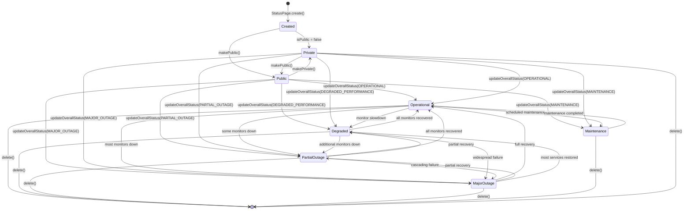
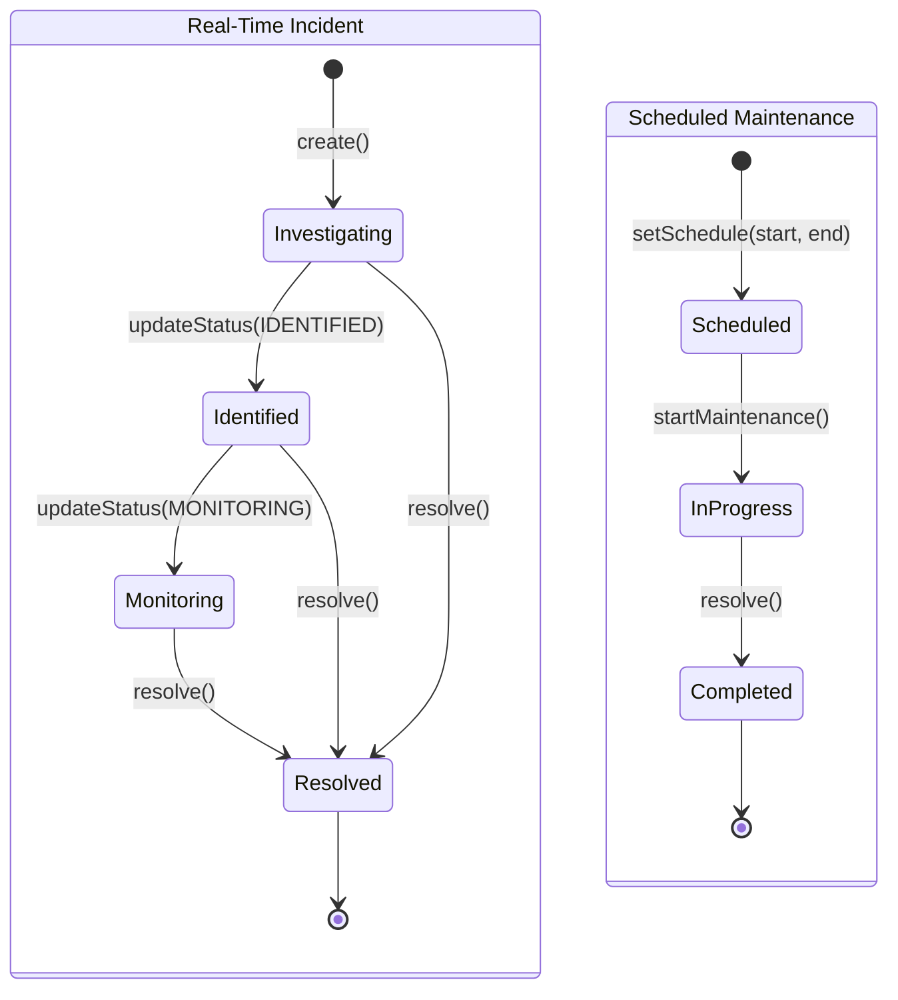
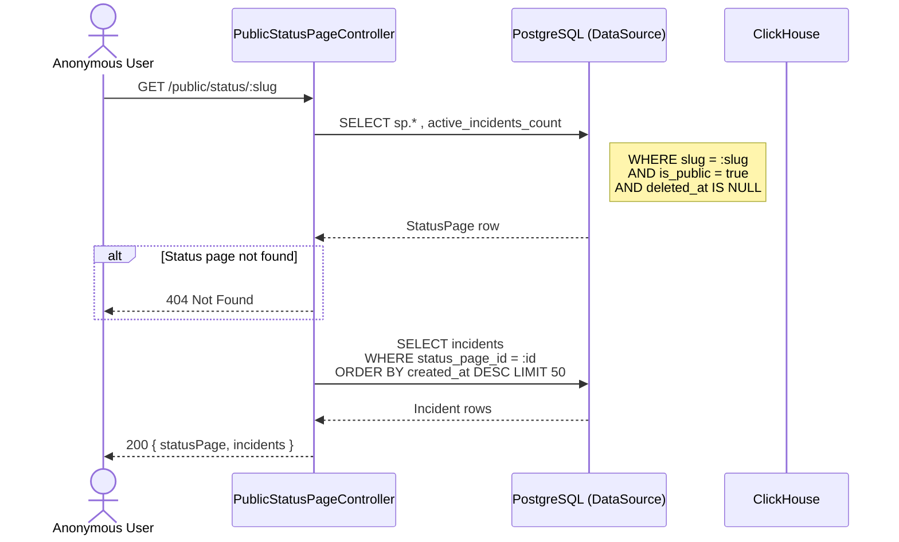
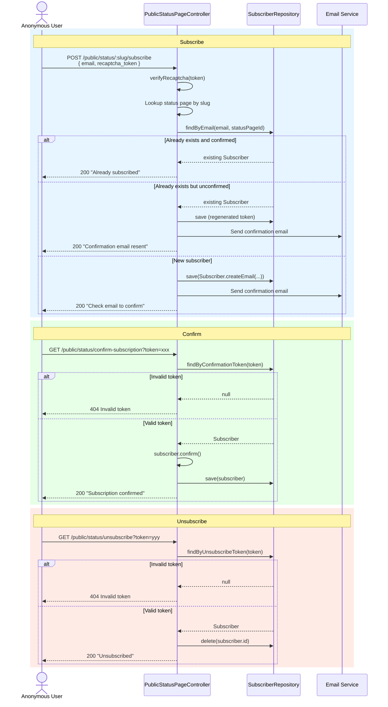
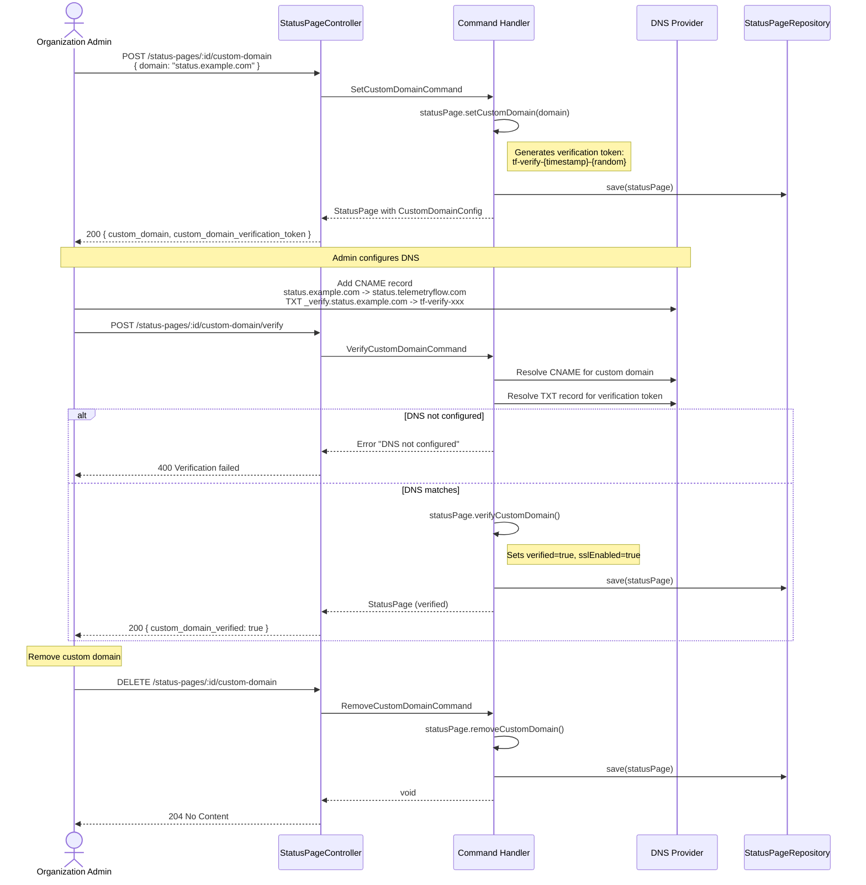

# Status Page Module

## 1. Module Overview

The Status Page module provides public-facing service health pages with full incident
management, component (monitor) tracking, subscriber notifications via email or webhook,
custom branding and theming, and custom domain support with DNS verification.

The module follows Domain-Driven Design with CQRS (Command Query Responsibility
Segregation). Three aggregate roots --- `StatusPage`, `Incident`, and `Subscriber` ---
encapsulate all business rules. Commands mutate state through domain aggregates;
read queries are served directly from PostgreSQL (and ClickHouse for uptime statistics).

---

## 2. Domain Model

```mermaid
classDiagram
    direction TB

    class StatusPage {
        +String id
        +String title
        +String slug
        +String description
        +Boolean isPublic
        +OverallStatus overallStatus
        +BrandingConfig branding
        +DisplayConfig display
        +CustomDomainConfig customDomain
        +StatusPageMonitorConfig[] monitors
        +Date lastStatusCheck
        +String organizationId
        +String workspaceId
        +String createdBy
        +Date createdAt
        +Date updatedAt
        +create(props) StatusPage
        +isOperational() Boolean
        +hasIncident() Boolean
        +hasDegradedPerformance() Boolean
        +isUnderMaintenance() Boolean
        +getPublicUrl() String
        +addMonitor(config) void
        +removeMonitor(monitorId) void
        +updateOverallStatus(status) void
        +makePublic() void
        +setCustomDomain(domain) void
        +verifyCustomDomain() void
        +removeCustomDomain() void
    }

    class OverallStatus {
        <<enumeration>>
        OPERATIONAL
        DEGRADED_PERFORMANCE
        PARTIAL_OUTAGE
        MAJOR_OUTAGE
        MAINTENANCE
        UNKNOWN
    }

    class BrandingConfig {
        +String logoUrl
        +String faviconUrl
        +String brandColor
        +String customCss
        +String headerText
        +String footerText
        +String supportUrl
    }

    class DisplayConfig {
        +Boolean showUptimePercentage
        +Boolean showResponseTime
        +Boolean showIncidentHistory
        +Boolean showMaintenanceSchedule
        +Boolean allowSubscriptions
        +Boolean showLegend
        +String[] uptimeRanges
        +Number historyDays
        +String theme
        +String googleAnalyticsId
    }

    class CustomDomainConfig {
        +String domain
        +Boolean verified
        +Boolean sslEnabled
        +String verificationToken
    }

    class StatusPageMonitorConfig {
        +String monitorId
        +String displayName
        +String description
        +Number displayOrder
        +String groupName
        +Boolean isVisible
    }

    class Incident {
        +String id
        +String statusPageId
        +String title
        +IncidentImpact impact
        +IncidentStatus status
        +String message
        +String[] affectedMonitorIds
        +IncidentUpdate[] updates
        +Boolean isScheduledMaintenance
        +Date scheduledStartAt
        +Date scheduledEndAt
        +Date startedAt
        +Date resolvedAt
        +String organizationId
        +String createdBy
        +Date createdAt
        +Date updatedAt
        +create(props) Incident
        +isActive() Boolean
        +isResolved() Boolean
        +getDuration() Number
        +getDurationMinutes() Number
        +addAffectedMonitor(monitorId) void
        +removeAffectedMonitor(monitorId) void
        +updateStatus(status, message, createdBy) void
        +resolve(message, createdBy) void
        +setSchedule(startAt, endAt) void
        +startMaintenance() void
    }

    class IncidentImpact {
        <<enumeration>>
        NONE
        MINOR
        MAJOR
        CRITICAL
    }

    class IncidentStatus {
        <<enumeration>>
        INVESTIGATING
        IDENTIFIED
        MONITORING
        RESOLVED
        SCHEDULED
        IN_PROGRESS
        COMPLETED
    }

    class IncidentUpdate {
        +String id
        +IncidentStatus status
        +String message
        +String createdBy
        +Date createdAt
    }

    class Subscriber {
        +String id
        +String statusPageId
        +String email
        +String webhookUrl
        +SubscriptionType subscriptionType
        +Boolean isConfirmed
        +String confirmationToken
        +String unsubscribeToken
        +NotificationType notificationType
        +String[] monitorIds
        +Date confirmedAt
        +Date lastNotifiedAt
        +String organizationId
        +Date createdAt
        +Date updatedAt
        +createEmail(props) Subscriber
        +createWebhook(props) Subscriber
        +confirm() void
        +canReceiveNotification() Boolean
        +shouldNotifyForIncident() Boolean
        +shouldNotifyForMaintenance() Boolean
        +shouldNotifyForMonitor(monitorId) Boolean
        +getConfirmationUrl(baseUrl) String
        +getUnsubscribeUrl(baseUrl) String
        +recordNotification() void
    }

    class NotificationType {
        <<enumeration>>
        ALL
        INCIDENTS_ONLY
        MAINTENANCE_ONLY
    }

    class SubscriptionType {
        <<enumeration>>
        EMAIL
        WEBHOOK
    }

    StatusPage --> OverallStatus
    StatusPage *-- BrandingConfig
    StatusPage *-- DisplayConfig
    StatusPage *-- CustomDomainConfig
    StatusPage *-- "0..*" StatusPageMonitorConfig

    Incident --> IncidentImpact
    Incident --> IncidentStatus
    Incident *-- "0..*" IncidentUpdate

    Subscriber --> NotificationType
    Subscriber --> SubscriptionType
```



---

## 3. Repository Interfaces

| Interface                 | Method                  | Signature                                                                  |
| ------------------------- | ----------------------- | -------------------------------------------------------------------------- |
| **IStatusPageRepository** | save                    | `(statusPage: StatusPage) => Promise<void>`                                |
|                           | findById                | `(id: string) => Promise<StatusPage \| null>`                              |
|                           | findBySlug              | `(slug: string) => Promise<StatusPage \| null>`                            |
|                           | findByOrganization      | `(organizationId: string) => Promise<StatusPage[]>`                        |
|                           | findByWorkspace         | `(workspaceId: string) => Promise<StatusPage[]>`                           |
|                           | findPublic              | `() => Promise<StatusPage[]>`                                              |
|                           | findByCustomDomain      | `(domain: string) => Promise<StatusPage \| null>`                          |
|                           | delete                  | `(id: string) => Promise<void>`                                            |
|                           | slugExists              | `(slug: string, excludeId?: string) => Promise<boolean>`                   |
| **IIncidentRepository**   | save                    | `(incident: Incident) => Promise<void>`                                    |
|                           | findById                | `(id: string) => Promise<Incident \| null>`                                |
|                           | findByStatusPage        | `(statusPageId: string, options?) => Promise<Incident[]>`                  |
|                           | findActive              | `(statusPageId?: string) => Promise<Incident[]>`                           |
|                           | findScheduled           | `(statusPageId?: string) => Promise<Incident[]>`                           |
|                           | findByMonitor           | `(monitorId: string) => Promise<Incident[]>`                               |
|                           | findRecent              | `(statusPageId: string, days: number) => Promise<Incident[]>`              |
|                           | delete                  | `(id: string) => Promise<void>`                                            |
| **ISubscriberRepository** | save                    | `(subscriber: Subscriber) => Promise<void>`                                |
|                           | findById                | `(id: string) => Promise<Subscriber \| null>`                              |
|                           | findByEmail             | `(email: string, statusPageId: string) => Promise<Subscriber \| null>`     |
|                           | findByStatusPage        | `(statusPageId: string, confirmedOnly?: boolean) => Promise<Subscriber[]>` |
|                           | findByConfirmationToken | `(token: string) => Promise<Subscriber \| null>`                           |
|                           | findByUnsubscribeToken  | `(token: string) => Promise<Subscriber \| null>`                           |
|                           | findForNotification     | `(statusPageId, type, monitorId?) => Promise<Subscriber[]>`                |
|                           | count                   | `(statusPageId: string, confirmedOnly?: boolean) => Promise<number>`       |
|                           | delete                  | `(id: string) => Promise<void>`                                            |
|                           | deleteByEmail           | `(email: string, statusPageId: string) => Promise<void>`                   |

Dependency injection tokens: `STATUS_PAGE_REPOSITORY`, `INCIDENT_REPOSITORY`,
`SUBSCRIBER_REPOSITORY`.

---

## 4. CQRS Commands

| Command                              | Properties                                                                                                                                                |
| ------------------------------------ | --------------------------------------------------------------------------------------------------------------------------------------------------------- |
| `CreateStatusPageCommand`            | `organizationId`, `createdBy`, `title`, `slug`, `description?`, `isPublic?`, `branding?`, `display?`                                                      |
| `UpdateStatusPageCommand`            | `organizationId`, `statusPageId`, `title?`, `slug?`, `description?`, `isPublic?`, `branding?`, `display?`, `monitors?`                                    |
| `DeleteStatusPageCommand`            | `organizationId`, `statusPageId`                                                                                                                          |
| `AddMonitorToStatusPageCommand`      | `organizationId`, `statusPageId`, `monitorId`, `displayName?`, `description?`, `displayOrder?`, `groupName?`, `isVisible?`                                |
| `RemoveMonitorFromStatusPageCommand` | `organizationId`, `statusPageId`, `monitorId`                                                                                                             |
| `CreateIncidentCommand`              | `organizationId`, `statusPageId`, `title`, `impact`, `message?`, `affectedMonitorIds?`, `isScheduledMaintenance?`, `scheduledStartAt?`, `scheduledEndAt?` |
| `UpdateIncidentCommand`              | `organizationId`, `statusPageId`, `incidentId`, `title?`, `impact?`, `message?`                                                                           |
| `AddIncidentUpdateCommand`           | `organizationId`, `statusPageId`, `incidentId`, `status`, `message`                                                                                       |
| `ResolveIncidentCommand`             | `organizationId`, `statusPageId`, `incidentId`, `message?`                                                                                                |
| `SetCustomDomainCommand`             | `organizationId`, `statusPageId`, `domain`                                                                                                                |
| `VerifyCustomDomainCommand`          | `organizationId`, `statusPageId`                                                                                                                          |
| `RemoveCustomDomainCommand`          | `organizationId`, `statusPageId`                                                                                                                          |

---

## 5. Status Page Lifecycle



---

## 6. Incident Lifecycle



---

## 7. Public Status Page Flow



---

## 8. Subscriber Flow



---

## 9. Custom Domain Flow



---

## 10. Database Schema

### PostgreSQL Tables

#### `status_pages`

| Column                             | Type                  | Constraints                        |
| ---------------------------------- | --------------------- | ---------------------------------- |
| `id`                               | UUID                  | PK, default `uuid_generate_v4()`   |
| `title`                            | VARCHAR(255)          | NOT NULL                           |
| `slug`                             | VARCHAR(100)          | UNIQUE, NOT NULL                   |
| `description`                      | TEXT                  | nullable                           |
| `is_public`                        | BOOLEAN               | default `true`                     |
| `overall_status`                   | ENUM `overall_status` | default `'unknown'`                |
| `logo_url`                         | TEXT                  | nullable                           |
| `favicon_url`                      | TEXT                  | nullable                           |
| `brand_color`                      | VARCHAR(20)           | default `'#10B981'`                |
| `custom_css`                       | TEXT                  | nullable                           |
| `header_text`                      | TEXT                  | nullable                           |
| `footer_text`                      | TEXT                  | nullable                           |
| `support_url`                      | TEXT                  | nullable                           |
| `show_uptime_percentage`           | BOOLEAN               | default `true`                     |
| `show_response_time`               | BOOLEAN               | default `true`                     |
| `show_incident_history`            | BOOLEAN               | default `true`                     |
| `show_maintenance_schedule`        | BOOLEAN               | default `true`                     |
| `allow_subscriptions`              | BOOLEAN               | default `true`                     |
| `show_legend`                      | BOOLEAN               | default `true`                     |
| `uptime_ranges`                    | JSONB                 | default `["24h","7d","30d","90d"]` |
| `history_days`                     | INTEGER               | default `90`                       |
| `theme`                            | VARCHAR(20)           | default `'light'`                  |
| `google_analytics_id`              | VARCHAR(50)           | nullable                           |
| `custom_domain`                    | VARCHAR(255)          | nullable                           |
| `custom_domain_verified`           | BOOLEAN               | default `false`                    |
| `custom_domain_ssl`                | BOOLEAN               | default `false`                    |
| `custom_domain_verification_token` | VARCHAR(255)          | nullable                           |
| `monitors`                         | JSONB                 | default `[]`                       |
| `last_status_check`                | TIMESTAMPTZ           | nullable                           |
| `organization_id`                  | UUID                  | NOT NULL                           |
| `workspace_id`                     | UUID                  | nullable                           |
| `created_by`                       | UUID                  | nullable                           |
| `metadata`                         | JSONB                 | nullable                           |
| `created_at`                       | TIMESTAMPTZ           | default `CURRENT_TIMESTAMP`        |
| `updated_at`                       | TIMESTAMPTZ           | default `CURRENT_TIMESTAMP`        |
| `deleted_at`                       | TIMESTAMPTZ           | nullable                           |

Indexes: `slug` (unique), `organization_id`, `is_public`, `custom_domain`.

#### `status_page_incidents`

| Column                     | Type                   | Constraints                                          |
| -------------------------- | ---------------------- | ---------------------------------------------------- |
| `id`                       | UUID                   | PK                                                   |
| `status_page_id`           | UUID                   | FK -> `status_pages(id) ON DELETE CASCADE`, NOT NULL |
| `title`                    | VARCHAR(255)           | NOT NULL                                             |
| `impact`                   | ENUM `incident_impact` | default `'minor'`                                    |
| `status`                   | ENUM `incident_status` | default `'investigating'`                            |
| `message`                  | TEXT                   | nullable                                             |
| `affected_monitor_ids`     | JSONB                  | default `[]`                                         |
| `updates`                  | JSONB                  | default `[]`                                         |
| `is_scheduled_maintenance` | BOOLEAN                | default `false`                                      |
| `scheduled_start_at`       | TIMESTAMPTZ            | nullable                                             |
| `scheduled_end_at`         | TIMESTAMPTZ            | nullable                                             |
| `started_at`               | TIMESTAMPTZ            | NOT NULL                                             |
| `resolved_at`              | TIMESTAMPTZ            | nullable                                             |
| `organization_id`          | UUID                   | NOT NULL                                             |
| `workspace_id`             | UUID                   | nullable                                             |
| `created_by`               | UUID                   | nullable                                             |
| `metadata`                 | JSONB                  | nullable                                             |
| `created_at`               | TIMESTAMPTZ            | default `CURRENT_TIMESTAMP`                          |
| `updated_at`               | TIMESTAMPTZ            | default `CURRENT_TIMESTAMP`                          |
| `deleted_at`               | TIMESTAMPTZ            | nullable                                             |

Indexes: `status_page_id`, `(status_page_id, status)`, `organization_id`,
`started_at`, `is_scheduled_maintenance`.

#### `status_page_subscribers`

| Column               | Type                     | Constraints                                          |
| -------------------- | ------------------------ | ---------------------------------------------------- |
| `id`                 | UUID                     | PK                                                   |
| `status_page_id`     | UUID                     | FK -> `status_pages(id) ON DELETE CASCADE`, NOT NULL |
| `email`              | VARCHAR(255)             | nullable                                             |
| `webhook_url`        | VARCHAR(2048)            | nullable                                             |
| `subscription_type`  | ENUM `subscription_type` | default `'email'`                                    |
| `is_confirmed`       | BOOLEAN                  | default `false`                                      |
| `confirmation_token` | VARCHAR(255)             | nullable                                             |
| `unsubscribe_token`  | VARCHAR(255)             | NOT NULL                                             |
| `notification_type`  | ENUM `notification_type` | default `'all'`                                      |
| `monitor_ids`        | JSONB                    | nullable                                             |
| `confirmed_at`       | TIMESTAMPTZ              | nullable                                             |
| `last_notified_at`   | TIMESTAMPTZ              | nullable                                             |
| `organization_id`    | UUID                     | NOT NULL                                             |
| `metadata`           | JSONB                    | nullable                                             |
| `created_at`         | TIMESTAMPTZ              | default `CURRENT_TIMESTAMP`                          |
| `updated_at`         | TIMESTAMPTZ              | default `CURRENT_TIMESTAMP`                          |

Indexes: `status_page_id`, `(status_page_id, email)` (unique), `confirmation_token`,
`unsubscribe_token`, `is_confirmed`, `subscription_type`.

#### PostgreSQL Enums

| Enum Name           | Values                                                                                            |
| ------------------- | ------------------------------------------------------------------------------------------------- |
| `overall_status`    | `operational`, `degraded_performance`, `partial_outage`, `major_outage`, `maintenance`, `unknown` |
| `incident_impact`   | `none`, `minor`, `major`, `critical`                                                              |
| `incident_status`   | `investigating`, `identified`, `monitoring`, `resolved`, `scheduled`, `in_progress`, `completed`  |
| `notification_type` | `all`, `incidents_only`, `maintenance_only`                                                       |
| `subscription_type` | `email`, `webhook`                                                                                |

---

## 11. API Endpoints

### Authenticated Routes

Base path: `/status-pages`
Controller: `StatusPageController` (`@Controller("status-pages")`)
Guards: `JwtAuthGuard`, `PermissionsGuard`

| Method | Endpoint                             | Permission                     | Description                                 |
| ------ | ------------------------------------ | ------------------------------ | ------------------------------------------- |
| GET    | `/`                                  | `monitoring:status-page:read`  | List status pages for organization          |
| GET    | `/:id`                               | `monitoring:status-page:read`  | Get status page by ID or slug               |
| POST   | `/`                                  | --                             | Create status page                          |
| PUT    | `/:id`                               | --                             | Update status page                          |
| DELETE | `/:id`                               | --                             | Delete status page                          |
| POST   | `/:id/monitors`                      | --                             | Add monitor to status page                  |
| PUT    | `/:id/monitors/:monitorId`           | --                             | Update monitor configuration                |
| DELETE | `/:id/monitors/:monitorId`           | --                             | Remove monitor from status page             |
| GET    | `/:id/incidents`                     | `monitoring:status-page:read`  | List incidents (optional `?status=` filter) |
| POST   | `/:id/incidents`                     | --                             | Create incident                             |
| PUT    | `/:id/incidents/:incidentId`         | --                             | Update incident                             |
| POST   | `/:id/incidents/:incidentId/updates` | --                             | Add incident update (status + message)      |
| POST   | `/:id/incidents/:incidentId/resolve` | --                             | Resolve incident                            |
| GET    | `/:id/subscribers`                   | `monitoring:status-page:read`  | List subscribers                            |
| POST   | `/:id/subscribers`                   | `monitoring:status-page:write` | Add subscriber (admin, auto-confirmed)      |
| DELETE | `/:id/subscribers/:subscriberId`     | `monitoring:status-page:write` | Remove subscriber                           |
| POST   | `/:id/custom-domain`                 | --                             | Set custom domain                           |
| POST   | `/:id/custom-domain/verify`          | --                             | Verify custom domain via DNS                |
| DELETE | `/:id/custom-domain`                 | --                             | Remove custom domain                        |

### Public Routes

Base path: `/public/status`
Controller: `PublicStatusPageController` (`@Controller("public/status")`)
Guards: None

| Method | Endpoint                       | Description                                      |
| ------ | ------------------------------ | ------------------------------------------------ |
| GET    | `/:slug`                       | Get public status page with active incidents     |
| POST   | `/:slug/subscribe`             | Subscribe to notifications (reCAPTCHA protected) |
| GET    | `/confirm-subscription?token=` | Confirm email subscription                       |
| GET    | `/unsubscribe?token=`          | Unsubscribe from notifications                   |

All responses use the envelope: `{ "status": "success", "data": T }`.

---

## 12. File Structure

```
backend/src/modules/monitoring/status-page/
|-- index.ts
|-- status-page.module.ts
|-- domain/
|   |-- index.ts
|   |-- aggregates/
|   |   |-- index.ts
|   |   |-- StatusPage.ts              # Aggregate root: OverallStatus, BrandingConfig, DisplayConfig, CustomDomainConfig
|   |   |-- Incident.ts                # Aggregate root: IncidentImpact, IncidentStatus, IncidentUpdate
|   |   |-- Subscriber.ts              # Aggregate root: NotificationType, SubscriptionType
|   |-- repositories/
|       |-- IStatusPageRepository.ts   # IStatusPageRepository, IIncidentRepository, ISubscriberRepository
|-- application/
|   |-- commands/
|   |   |-- index.ts
|   |   |-- CreateStatusPage.command.ts
|   |   |-- UpdateStatusPage.command.ts
|   |   |-- DeleteStatusPage.command.ts
|   |   |-- AddMonitor.command.ts
|   |   |-- RemoveMonitor.command.ts
|   |   |-- CreateIncident.command.ts
|   |   |-- UpdateIncident.command.ts      # UpdateIncidentCommand, AddIncidentUpdateCommand, ResolveIncidentCommand
|   |   |-- SetCustomDomain.command.ts
|   |   |-- VerifyCustomDomain.command.ts
|   |   |-- RemoveCustomDomain.command.ts
|   |-- handlers/
|       |-- index.ts
|       |-- CreateStatusPage.handler.ts
|       |-- UpdateStatusPage.handler.ts
|       |-- DeleteStatusPage.handler.ts
|       |-- AddMonitor.handler.ts
|       |-- RemoveMonitor.handler.ts
|       |-- CreateIncident.handler.ts
|       |-- UpdateIncident.handler.ts
|       |-- SetCustomDomain.handler.ts
|       |-- VerifyCustomDomain.handler.ts
|       |-- RemoveCustomDomain.handler.ts
|-- infrastructure/
|   |-- persistence/
|       |-- index.ts
|       |-- StatusPageRepository.ts       # IStatusPageRepository implementation
|       |-- StatusPageMapper.ts           # Domain <-> Entity mapping
|       |-- IncidentRepository.ts         # IIncidentRepository implementation
|       |-- IncidentMapper.ts
|       |-- SubscriberRepository.ts       # ISubscriberRepository implementation
|       |-- SubscriberMapper.ts
|       |-- entities/
|       |   |-- index.ts
|       |   |-- StatusPage.entity.ts      # TypeORM entity: status_pages
|       |   |-- Incident.entity.ts        # TypeORM entity: status_page_incidents
|       |   |-- Subscriber.entity.ts      # TypeORM entity: status_page_subscribers
|       |-- migrations/
|       |   |-- postgresql/
|       |       |-- index.ts
|       |       |-- 1720000000001-CreateStatusPageTables.ts
|       |       |-- 1720000000002-AddWebhookSubscription.ts
|       |       |-- 1720000000003-AddMissingDisplayColumns.ts
|       |-- seeds/
|           |-- index.ts
|           |-- 01-DevOpsCorterStatusPageSeed.ts
|           |-- 02-TelemetryFlowStatusPageSeed.ts
|-- presentation/
    |-- controllers/
        |-- StatusPage.controller.ts      # StatusPageController + PublicStatusPageController
```
