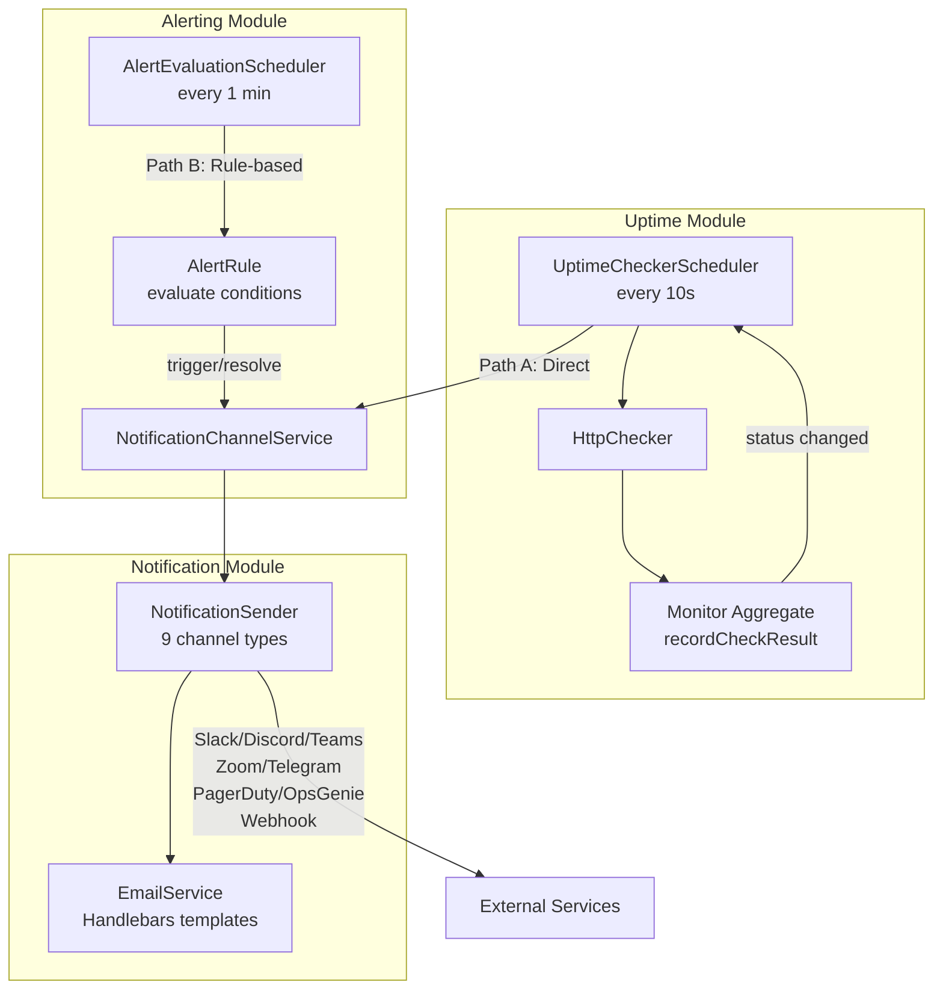
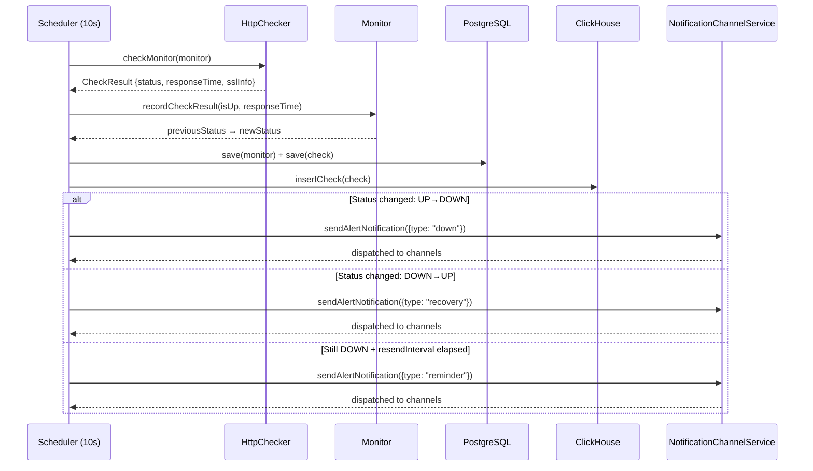
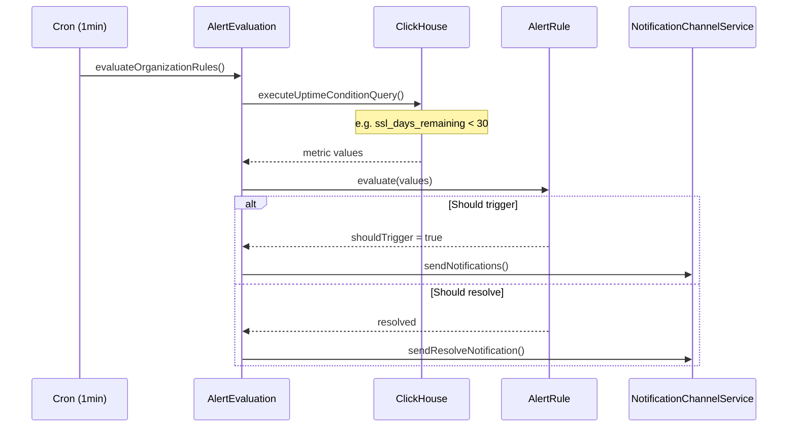
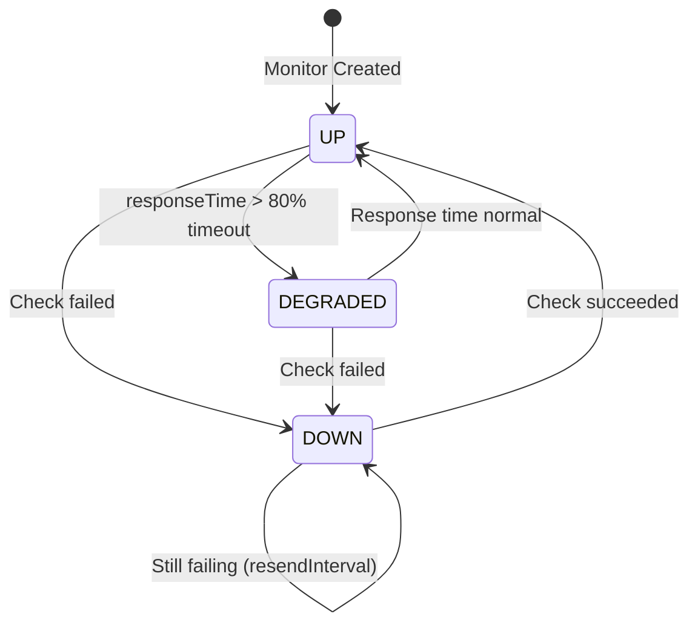
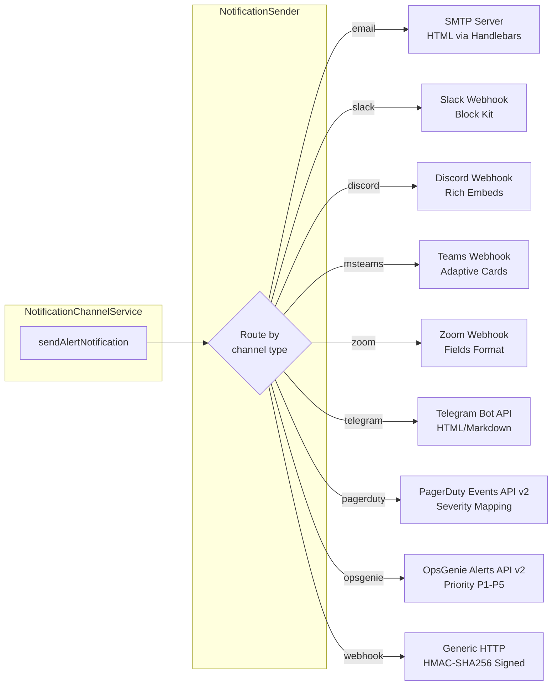
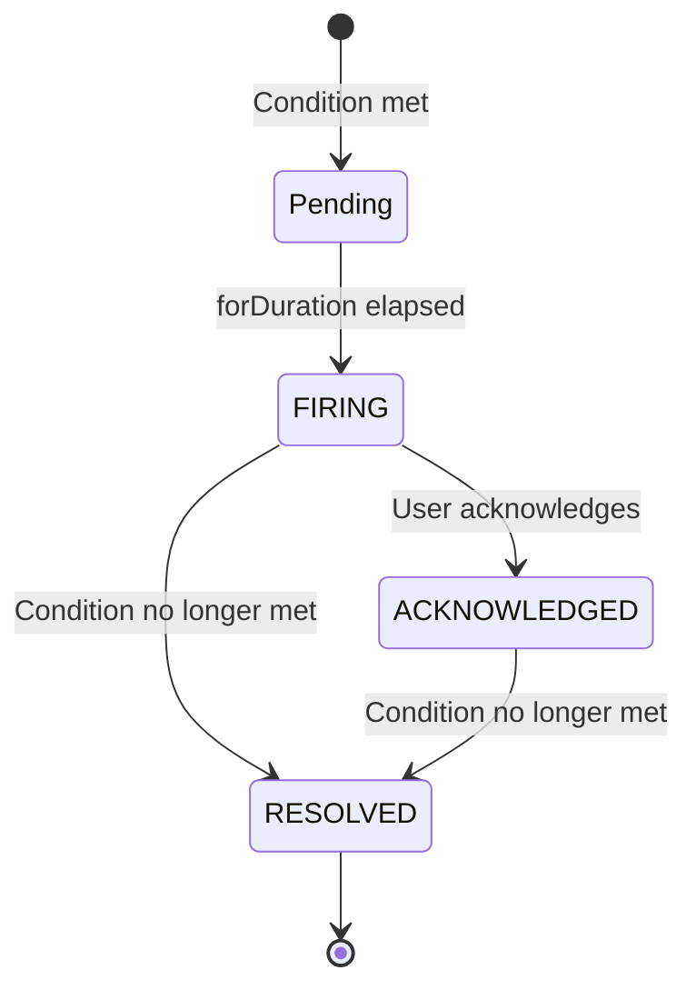

# Uptime Alerting & Notification

> **Version:** 1.4.0 | **Module Path:** `backend/src/modules/monitoring/uptime/` + `backend/src/modules/alerting/`

TelemetryFlow Uptime provides a two-layer alerting system that detects monitor status changes in real-time and dispatches notifications through 9 configurable channels.

---

## Table of Contents

1. [Architecture Overview](#1-architecture-overview)
2. [Alert Flow: Two Paths](#2-alert-flow-two-paths)
3. [Monitor Status Transitions](#3-monitor-status-transitions)
4. [Notification Channels](#4-notification-channels)
5. [Per-Monitor Notification Config](#5-per-monitor-notification-config)
6. [Alert Rules for Uptime](#6-alert-rules-for-uptime)
7. [API Endpoints](#7-api-endpoints)
8. [Frontend Components](#8-frontend-components)
9. [File Structure](#9-file-structure)

---

## 1. Architecture Overview



**Key dependency:** The Uptime module imports `AlertingModule`, which provides `NotificationChannelService`. The Notification module provides `EmailService` with Handlebars templates.

---

## 2. Alert Flow: Two Paths

### Path A: Direct Uptime Notification (Real-Time)

Fires immediately when a monitor status changes during a check cycle.



**Source:** `monitoring/uptime/infrastructure/schedulers/UptimeChecker.scheduler.ts:200-308`

### Path B: Alert Rule Evaluation (Periodic)

Evaluates AlertRules periodically for conditions like SSL certificate expiry.



**Source:** `alerting/infrastructure/schedulers/AlertEvaluation.scheduler.ts`

---

## 3. Monitor Status Transitions



| Transition    | Notification Type | Condition                                     |
| ------------- | ----------------- | --------------------------------------------- |
| UP → DOWN     | `firing`          | `consecutiveDownCount >= alertAfterDownCount` |
| DOWN → UP     | `recovery`        | `notifyOnRecovery === true`                   |
| DOWN → DOWN   | `reminder`        | `resendInterval` elapsed + still DOWN         |
| UP → DEGRADED | `firing`          | Same as DOWN transition                       |

**Notification trigger logic** (`Monitor.shouldNotify()`):

```typescript
shouldNotify(): boolean {
  return this.consecutiveDownCount >= (this.notificationConfig.alertAfterDownCount ?? 1);
}
```

---

## 4. Notification Channels

| Channel             | Protocol            | Format                      | Config Component      |
| ------------------- | ------------------- | --------------------------- | --------------------- |
| **Email**           | SMTP                | HTML (Handlebars templates) | `EmailConfig.vue`     |
| **Slack**           | HTTPS POST          | Block Kit messages          | `SlackConfig.vue`     |
| **Discord**         | HTTPS POST          | Rich embeds                 | `DiscordConfig.vue`   |
| **Microsoft Teams** | HTTPS POST          | Adaptive Cards v1.5         | `MSTeamsConfig.vue`   |
| **Zoom**            | HTTPS POST          | Incoming Webhook            | `ZoomConfig.vue`      |
| **Telegram**        | HTTPS POST          | Bot API sendMessage         | `TelegramConfig.vue`  |
| **PagerDuty**       | HTTPS POST          | Events API v2               | `PagerDutyConfig.vue` |
| **OpsGenie**        | HTTPS POST          | Alerts API v2               | `OpsGenieConfig.vue`  |
| **Webhook**         | HTTP POST/PUT/PATCH | JSON + HMAC-SHA256 signing  | `WebhookConfig.vue`   |

Each channel supports:
- Enable/disable toggle
- Test notification button (`POST /notification-channels/:id/test`)
- Custom auth headers (Webhook: Bearer/Basic/APIKey)

### Channel Dispatch Flow



---

## 5. Per-Monitor Notification Config

Each monitor has a `notificationConfig` that controls alerting behavior:

```typescript
interface NotificationConfig {
  channels: string[]; // Notification channel IDs
  alertAfterDownCount?: number; // Fire after N consecutive failures (default: 1)
  resendInterval?: number; // Minutes between re-notifications while DOWN
  notifyOnRecovery?: boolean; // Send notification when recovered (default: true)
}
```

**Setting via API:**

```bash
POST /api/v2/uptime/monitors
{
  "name": "My Website",
  "url": "https://example.com",
  "type": "https",
  "interval": 60,
  "notification_channels": ["channel-uuid-1", "channel-uuid-2"],
  "alert_after_down_count": 3,
  "resend_interval": 15,
  "notify_on_recovery": true
}
```

---

## 6. Alert Rules for Uptime

Alert rules extend uptime monitoring with condition-based alerts:

### Supported Uptime Conditions

| Metric               | Operator                   | Example                   |
| -------------------- | -------------------------- | ------------------------- |
| `ssl_days_remaining` | `<`, `<=`, `>`, `>=`, `==` | `ssl_days_remaining < 30` |

### Creating an SSL Expiry Alert Rule

```bash
POST /api/v2/alert-rules
{
  "name": "SSL Certificate Expiring Soon",
  "enabled": true,
  "severity": "warning",
  "queryTarget": "uptime",
  "conditions": [
    {
      "metric": "ssl_days_remaining",
      "operator": "lt",
      "threshold": 30
    }
  ],
  "forDuration": 300,
  "notificationChannelIds": ["channel-uuid-1"]
}
```

### Alert Instance Lifecycle



---

## 7. API Endpoints

### Notification Channels

| Method   | Endpoint                                    | Description             |
| -------- | ------------------------------------------- | ----------------------- |
| `POST`   | `/api/v2/notification-channels`             | Create channel          |
| `GET`    | `/api/v2/notification-channels`             | List channels           |
| `GET`    | `/api/v2/notification-channels/defaults`    | Get default channel IDs |
| `PUT`    | `/api/v2/notification-channels/defaults`    | Set default channel IDs |
| `GET`    | `/api/v2/notification-channels/:id`         | Get channel details     |
| `PATCH`  | `/api/v2/notification-channels/:id`         | Update channel          |
| `POST`   | `/api/v2/notification-channels/:id/enable`  | Enable channel          |
| `POST`   | `/api/v2/notification-channels/:id/disable` | Disable channel         |
| `POST`   | `/api/v2/notification-channels/:id/test`    | Send test notification  |
| `DELETE` | `/api/v2/notification-channels/:id`         | Delete channel          |

### Alert Rules

| Method   | Endpoint                          | Description       |
| -------- | --------------------------------- | ----------------- |
| `POST`   | `/api/v2/alert-rules`             | Create alert rule |
| `GET`    | `/api/v2/alert-rules`             | List rules        |
| `GET`    | `/api/v2/alert-rules/:id`         | Get rule details  |
| `PATCH`  | `/api/v2/alert-rules/:id`         | Update rule       |
| `POST`   | `/api/v2/alert-rules/:id/enable`  | Enable rule       |
| `POST`   | `/api/v2/alert-rules/:id/disable` | Disable rule      |
| `DELETE` | `/api/v2/alert-rules/:id`         | Delete rule       |

### Alert Instances

| Method | Endpoint                                  | Description             |
| ------ | ----------------------------------------- | ----------------------- |
| `GET`  | `/api/v2/alert-instances`                 | List instances          |
| `GET`  | `/api/v2/alert-instances/stats`           | Alert statistics        |
| `GET`  | `/api/v2/alert-instances/:id`             | Get instance details    |
| `POST` | `/api/v2/alert-instances/:id/acknowledge` | Acknowledge alert       |
| `POST` | `/api/v2/alert-instances/:id/resolve`     | Manually resolve        |
| `POST` | `/api/v2/alert-instances/:id/silence`     | Silence until timestamp |

All endpoints require JWT auth with permissions: `alert:read`, `alert:write`, `alert:delete`.

---

## 8. Frontend Components

### Settings → Notification Channels

```
frontend/src/views/settings/
├── notification-channels/
│   ├── index.vue                    # Channel list page
│   ├── ChannelModal.vue             # Create/edit channel modal
│   └── components/
│       ├── EmailConfig.vue          # SMTP configuration form
│       ├── SlackConfig.vue          # Slack webhook form
│       ├── DiscordConfig.vue        # Discord webhook form
│       ├── MSTeamsConfig.vue        # Teams webhook form
│       ├── ZoomConfig.vue           # Zoom webhook form
│       ├── TelegramConfig.vue       # Telegram bot token form
│       ├── PagerDutyConfig.vue      # PagerDuty integration key form
│       ├── OpsGenieConfig.vue       # OpsGenie API key form
│       └── WebhookConfig.vue        # Generic HTTP webhook form
└── components/
    └── NotificationChannels.vue     # Embedded channel widget
```

### Alerts Management

```
frontend/src/views/alerts/
├── index.vue                        # Alert instances (firing/resolved/acknowledged)
├── rules.vue                        # Alert rules management
└── components/
    └── AlertRuleFormModal.vue       # Create/edit alert rule modal
```

### API Clients

| File                                        | Purpose                            |
| ------------------------------------------- | ---------------------------------- |
| `frontend/src/api/alerting.ts`              | Alert rules + instances API client |
| `frontend/src/api/notification-channels.ts` | Channel CRUD + test API client     |

---

## 9. File Structure

```
backend/src/modules/
├── monitoring/uptime/
│   ├── domain/aggregates/
│   │   ├── Monitor.ts               # NotificationConfig, shouldNotify()
│   │   └── UptimeCheck.ts           # CheckStatus enum
│   ├── infrastructure/
│   │   ├── schedulers/
│   │   │   └── UptimeChecker.scheduler.ts   # dispatchUptimeNotification()
│   │   └── checkers/
│   │       └── HttpChecker.ts       # HTTP/TCP/PING checks
│   └── presentation/controllers/
│       └── Monitor.controller.ts    # notification_channels in DTOs
│
├── alerting/
│   ├── domain/aggregates/
│   │   ├── AlertRule.ts             # Conditions, evaluate(), trigger()
│   │   └── AlertInstance.ts         # Lifecycle (FIRING→ACKNOWLEDGED→RESOLVED)
│   ├── application/services/
│   │   └── NotificationChannel.service.ts   # sendAlertNotification(), testChannel()
│   ├── infrastructure/
│   │   ├── schedulers/
│   │   │   └── AlertEvaluation.scheduler.ts # Cron rule evaluation
│   │   └── services/
│   │       ├── INotificationSender.ts       # Interface + AlertNotification type
│   │       └── NotificationSender.ts        # Dispatches to all 9 channels
│   └── presentation/controllers/
│       ├── AlertRules.controller.ts
│       ├── AlertInstances.controller.ts
│       └── NotificationChannels.controller.ts
│
└── notification/
    ├── domain/services/
    │   └── EmailService.ts           # Template rendering, sendUptimeDownEmail(), sendUptimeUpEmail()
    └── infrastructure/
        ├── providers/
        │   └── SMTPEmailProvider.ts  # SMTP transport
        └── templates/
            ├── uptime-down.hbs       # Monitor down email
            ├── uptime-up.hbs         # Monitor recovery email
            └── uptime-report.hbs     # Organization status report email
```
