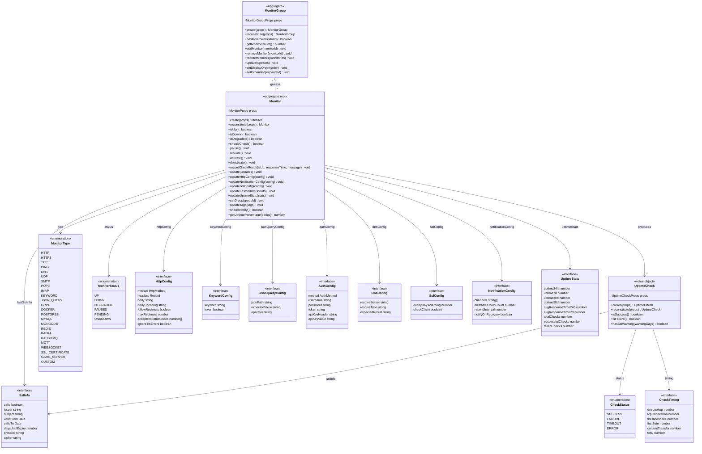
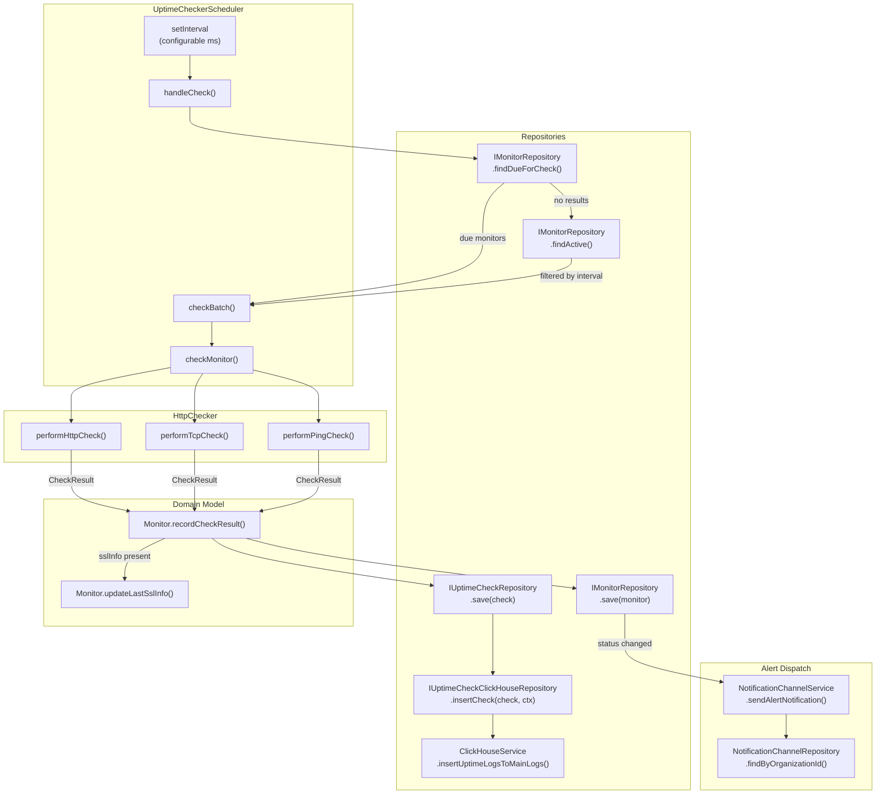
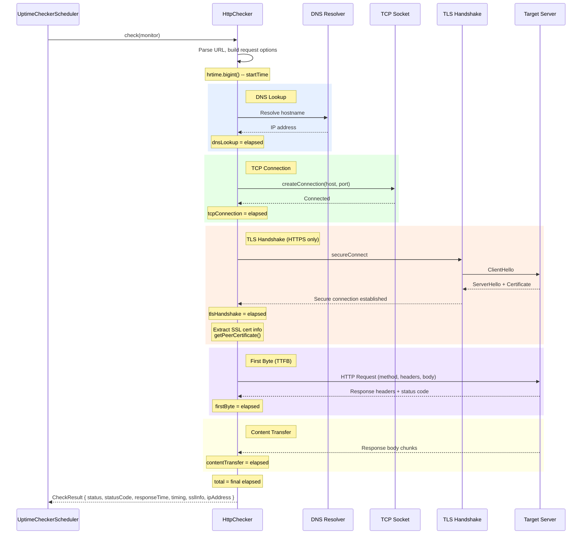

# Uptime Module -- Deep Dive

## 1. Module Overview

The Uptime module provides HTTP/HTTPS/TCP/PING/DNS monitoring with configurable intervals, response time tracking, and alerting integration. It follows Domain-Driven Design with CQRS, uses PostgreSQL for durable state and ClickHouse for high-cardinality time-series analytics, and exposes a REST API protected by JWT authentication and role-based permissions.

---

## 2. Domain Model



---

## 3. Repository Interfaces

| Interface                          | Methods                                                                                                                                                      | Storage    |
| ---------------------------------- | ------------------------------------------------------------------------------------------------------------------------------------------------------------ | ---------- |
| `IMonitorRepository`               | `save`, `findById`, `findByOrganization`, `findByWorkspace`, `findByGroup`, `findByStatus`, `findByType`, `findActive`, `findDueForCheck`, `delete`, `count` | PostgreSQL |
| `IMonitorGroupRepository`          | `save`, `findById`, `findByOrganization`, `findByWorkspace`, `delete`                                                                                        | PostgreSQL |
| `IUptimeCheckRepository`           | `save`, `saveBatch`, `findById`, `findByMonitor`, `findLatestByMonitor`, `getUptimePercentage`, `getAverageResponseTime`, `getCheckCount`, `deleteOlderThan` | PostgreSQL |
| `IUptimeCheckClickHouseRepository` | `insertCheck`, `insertChecks`, `queryChecks`, `queryHourlyStats`, `queryDailyStats`                                                                          | ClickHouse |

Dependency injection tokens:

| Token                                | Interface                          |
| ------------------------------------ | ---------------------------------- |
| `MONITOR_REPOSITORY`                 | `IMonitorRepository`               |
| `MONITOR_GROUP_REPOSITORY`           | `IMonitorGroupRepository`          |
| `UPTIME_CHECK_REPOSITORY`            | `IUptimeCheckRepository`           |
| `UPTIME_CHECK_CLICKHOUSE_REPOSITORY` | `IUptimeCheckClickHouseRepository` |

---

## 4. CQRS Commands

| Command                | Properties                                                                                                                                                                                           |
| ---------------------- | ---------------------------------------------------------------------------------------------------------------------------------------------------------------------------------------------------- |
| `CreateMonitorCommand` | `organizationId`, `name`, `url`, `type?`, `description?`, `interval?`, `timeout?`, `retries?`, `httpConfig?`, `notificationChannels?`, `tags?`, `groupId?`, `sslConfig?`, `metadata?`                |
| `UpdateMonitorCommand` | `organizationId`, `monitorId`, `name?`, `url?`, `type?`, `description?`, `interval?`, `timeout?`, `retries?`, `httpConfig?`, `notificationChannels?`, `tags?`, `groupId?`, `sslConfig?`, `metadata?` |
| `DeleteMonitorCommand` | `organizationId`, `monitorId`                                                                                                                                                                        |
| `PauseMonitorCommand`  | `organizationId`, `monitorId`                                                                                                                                                                        |
| `ResumeMonitorCommand` | `organizationId`, `monitorId`                                                                                                                                                                        |

---

## 5. Check Scheduler Architecture



---

## 6. HTTP Checker Detail



---

## 7. Database Schema

### 7.1 PostgreSQL Tables

#### `uptime_monitors`

| Column                         | Type               | Notes                                              |
| ------------------------------ | ------------------ | -------------------------------------------------- |
| `id`                           | UUID PK            | Primary key                                        |
| `name`                         | varchar(255)       | Display name                                       |
| `description`                  | text               | Optional description                               |
| `url`                          | text               | Target URL                                         |
| `type`                         | enum MonitorType   | http, https, tcp, ping, dns, ...                   |
| `status`                       | enum MonitorStatus | up, down, degraded, paused, pending, unknown       |
| `interval`                     | integer            | Check interval in seconds (default 60)             |
| `timeout`                      | integer            | Timeout in seconds (default 30)                    |
| `retries`                      | integer            | Retry count (default 3)                            |
| `retry_interval`               | integer            | Retry interval in seconds (default 10)             |
| `is_active`                    | boolean            | Soft toggle                                        |
| `is_paused`                    | boolean            | Pause state                                        |
| `http_method`                  | enum HttpMethod    | GET, POST, PUT, PATCH, DELETE, HEAD, OPTIONS       |
| `http_headers`                 | jsonb              | Custom request headers                             |
| `http_body`                    | text               | Request body                                       |
| `accepted_status_codes`        | jsonb              | Allowed HTTP status codes                          |
| `max_redirects`                | integer            | Max redirect follows (default 5)                   |
| `ignore_tls_errors`            | boolean            | Skip TLS verification                              |
| `keyword`                      | varchar(500)       | Keyword to search in response                      |
| `keyword_invert`               | boolean            | Alert when keyword found                           |
| `json_path`                    | varchar(500)       | JSONPath expression                                |
| `json_expected_value`          | text               | Expected JSON value                                |
| `json_operator`                | varchar(20)        | equals, contains, greater, less, regex             |
| `auth_method`                  | enum AuthMethod    | none, basic, bearer, api_key, oauth2, digest, ntlm |
| `auth_username`                | varchar(255)       | Basic auth username                                |
| `auth_password`                | varchar(255)       | Basic auth password                                |
| `auth_token`                   | text               | Bearer/OAuth2 token                                |
| `api_key_header`               | varchar(100)       | API key header name                                |
| `api_key_value`                | text               | API key value                                      |
| `ssl_expiry_warning_days`      | integer            | SSL warning threshold (default 14)                 |
| `ssl_check_chain`              | boolean            | Verify certificate chain                           |
| `last_ssl_info`                | jsonb              | Cached SSL cert info from last check               |
| `notification_channels`        | jsonb              | Notification channel IDs                           |
| `alert_after_down_count`       | integer            | Consecutive down threshold (default 1)             |
| `notification_resend_interval` | integer            | Resend interval in minutes                         |
| `notify_on_recovery`           | boolean            | Send notification on recovery (default true)       |
| `group_id`                     | UUID FK            | Monitor group reference                            |
| `tags`                         | jsonb              | String array of tags                               |
| `uptime_24h`                   | decimal(5,2)       | Cached uptime percentage                           |
| `uptime_7d`                    | decimal(5,2)       | Cached uptime percentage                           |
| `uptime_30d`                   | decimal(5,2)       | Cached uptime percentage                           |
| `uptime_90d`                   | decimal(5,2)       | Cached uptime percentage                           |
| `avg_response_time_24h`        | decimal(10,2)      | Cached avg response time                           |
| `avg_response_time_7d`         | decimal(10,2)      | Cached avg response time                           |
| `total_checks`                 | bigint             | Lifetime check count                               |
| `successful_checks`            | bigint             | Lifetime success count                             |
| `failed_checks`                | bigint             | Lifetime failure count                             |
| `last_check_at`                | timestamptz        | Most recent check timestamp                        |
| `last_response_time`           | integer            | Most recent response time (ms)                     |
| `last_status_change`           | timestamptz        | Last status transition                             |
| `consecutive_down_count`       | integer            | Current consecutive failures                       |
| `consecutive_up_count`         | integer            | Current consecutive successes                      |
| `next_check_at`                | timestamptz        | Scheduled next check time                          |
| `organization_id`              | UUID               | Tenant isolation                                   |
| `workspace_id`                 | UUID               | Workspace isolation                                |
| `metadata`                     | jsonb              | Arbitrary metadata                                 |
| `created_at`                   | timestamptz        | Creation timestamp                                 |
| `updated_at`                   | timestamptz        | Last update timestamp                              |
| `deleted_at`                   | timestamptz        | Soft delete                                        |

Indexes: `(organization_id)`, `(organization_id, status)`, `(groupId)`, `(isActive)`, `(nextCheckAt)`

#### `uptime_checks`

| Column             | Type             | Notes                            |
| ------------------ | ---------------- | -------------------------------- |
| `id`               | UUID PK          | Primary key                      |
| `monitor_id`       | UUID FK          | Reference to uptime_monitors     |
| `status`           | enum CheckStatus | success, failure, timeout, error |
| `status_code`      | integer          | HTTP status code                 |
| `response_time`    | integer          | Total response time in ms        |
| `timing`           | jsonb            | CheckTiming breakdown            |
| `message`          | text             | Human-readable result message    |
| `error`            | text             | Error message on failure         |
| `ssl_info`         | jsonb            | SslInfo from check               |
| `response_body`    | text             | Response body (optional)         |
| `response_headers` | jsonb            | Response headers map             |
| `ip_address`       | varchar(50)      | Resolved IP address              |
| `region`           | varchar(50)      | Check region                     |
| `checked_at`       | timestamptz      | Check execution time             |
| `created_at`       | timestamptz      | Record creation time             |

Indexes: `(monitor_id)`, `(monitor_id, checkedAt)`, `(monitor_id, status)`, `(checkedAt)`

#### `uptime_monitor_groups`

| Column            | Type         | Notes                            |
| ----------------- | ------------ | -------------------------------- |
| `id`              | UUID PK      | Primary key                      |
| `name`            | varchar(255) | Group display name               |
| `description`     | text         | Optional description             |
| `display_order`   | integer      | Sort order (default 0)           |
| `is_expanded`     | boolean      | UI expanded state (default true) |
| `monitor_ids`     | jsonb        | Array of monitor UUIDs           |
| `organization_id` | UUID         | Tenant isolation                 |
| `workspace_id`    | UUID         | Workspace isolation              |
| `metadata`        | jsonb        | Arbitrary metadata               |
| `created_at`      | timestamptz  | Creation timestamp               |
| `updated_at`      | timestamptz  | Last update timestamp            |

Indexes: `(organization_id)`, `(organization_id, displayOrder)`

### 7.2 ClickHouse Tables

#### `uptime_checks` (MergeTree)

Time-series storage for check results. Partitioned by day, ordered by `(organization_id, monitor_id, checked_at)`. TTL 90 days.

| Column               | Type          | Notes                                 |
| -------------------- | ------------- | ------------------------------------- |
| `checked_at`         | DateTime64(3) | Check timestamp                       |
| `monitor_id`         | String        | Monitor identifier                    |
| `monitor_name`       | String        | Denormalized monitor name             |
| `status`             | Enum8         | success, failure, timeout, error      |
| `status_code`        | UInt16        | HTTP status code                      |
| `response_time`      | UInt32        | Response time in ms                   |
| `ip_address`         | String        | Resolved IP                           |
| `region`             | String        | Check region                          |
| `error_message`      | String        | Error details                         |
| `ssl_days_remaining` | Int32         | SSL cert days until expiry (-1 = N/A) |
| `organization_id`    | String        | Tenant isolation                      |
| `workspace_id`       | String        | Workspace isolation                   |
| `tenant_id`          | String        | Reserved tenant field                 |

#### Materialized Views (AggregatingMergeTree)

All AggregatingMergeTree views (`uptime_checks_5m`, `uptime_checks_15m`, `uptime_checks_1h`, `uptime_checks_6h`) share the same aggregate columns:

| Column                   | Aggregate                                               | Notes                 |
| ------------------------ | ------------------------------------------------------- | --------------------- |
| `total_checks`           | `countState()`                                          | Total check count     |
| `success_count`          | `countIfState(status='success')`                        | Successful checks     |
| `failure_count`          | `countIfState(status IN ('failure','timeout','error'))` | Failed checks         |
| `avg_response_time`      | `avgState(response_time)`                               | Average response time |
| `max_response_time`      | `maxState(response_time)`                               | Maximum response time |
| `min_response_time`      | `minState(response_time)`                               | Minimum response time |
| `p50_response_time`      | `quantileState(0.50)`                                   | 50th percentile       |
| `p75_response_time`      | `quantileState(0.75)`                                   | 75th percentile       |
| `p90_response_time`      | `quantileState(0.90)`                                   | 90th percentile       |
| `p95_response_time`      | `quantileState(0.95)`                                   | 95th percentile       |
| `p99_response_time`      | `quantileState(0.99)`                                   | 99th percentile       |
| `min_ssl_days_remaining` | `minState(ssl_days_remaining)`                          | Minimum SSL days      |

Order key dimensions: `(organization_id, monitor_id, region, <time_bucket>)`

#### `uptime_checks_1d` (SummingMergeTree)

Daily aggregation across all regions. Order key: `(organization_id, monitor_id, day)`.

| Column                   | Type    | Notes                 |
| ------------------------ | ------- | --------------------- |
| `day`                    | Date    | Aggregation bucket    |
| `monitor_id`             | String  | Monitor identifier    |
| `monitor_name`           | String  | Denormalized name     |
| `total_checks`           | UInt64  | Count of checks       |
| `success_count`          | UInt64  | Successful checks     |
| `failure_count`          | UInt64  | Failed checks         |
| `avg_response_time`      | Float64 | Average response time |
| `min_ssl_days_remaining` | Int32   | Minimum SSL days      |

---

## 8. API Endpoints

Base path: `/uptime/monitors`

All endpoints require JWT authentication via `JwtAuthGuard` + `PermissionsGuard`.

| Method   | Path                | Permission                | Description                        | Query Params                                  |
| -------- | ------------------- | ------------------------- | ---------------------------------- | --------------------------------------------- |
| `POST`   | `/`                 | `monitoring:uptime:write` | Create monitor                     | --                                            |
| `GET`    | `/`                 | `monitoring:uptime:read`  | List monitors (paginated)          | `status`, `type`, `group_id`, `page`, `limit` |
| `GET`    | `/ssl-summary`      | `monitoring:uptime:read`  | Org-wide SSL certificate summary   | --                                            |
| `GET`    | `/:id`              | `monitoring:uptime:read`  | Get monitor by ID                  | --                                            |
| `PUT`    | `/:id`              | `monitoring:uptime:write` | Update monitor                     | --                                            |
| `DELETE` | `/:id`              | `monitoring:uptime:write` | Delete monitor                     | --                                            |
| `POST`   | `/:id/pause`        | `monitoring:uptime:write` | Pause monitor                      | --                                            |
| `POST`   | `/:id/resume`       | `monitoring:uptime:write` | Resume monitor                     | --                                            |
| `GET`    | `/:id/checks`       | `monitoring:uptime:read`  | Check history                      | `from`, `to`, `limit`                         |
| `GET`    | `/:id/stats`        | `monitoring:uptime:read`  | Statistics (uptime %, percentiles) | --                                            |
| `GET`    | `/:id/daily-stats`  | `monitoring:uptime:read`  | Daily stats from ClickHouse MV     | `days` (default 90, max 365)                  |
| `GET`    | `/:id/hourly-stats` | `monitoring:uptime:read`  | Hourly stats from ClickHouse MV    | `hours` (default 24, max 2160)                |
| `GET`    | `/:id/ssl-trend`    | `monitoring:uptime:read`  | SSL days remaining trend           | `hours` (default 168, max 8760)               |
| `POST`   | `/test`             | `monitoring:uptime:read`  | Test URL without saving            | --                                            |

All responses use the envelope: `{ "status": "success", "data": <payload> }`

---

## 9. File Structure

```
backend/src/modules/monitoring/uptime/
  index.ts
  uptime.module.ts

  domain/
    index.ts
    aggregates/
      index.ts
      Monitor.ts                          # Aggregate root
      UptimeCheck.ts                      # Value object
      MonitorGroup.ts                     # Aggregate
    repositories/
      IUptimeRepository.ts                # IMonitorRepository, IMonitorGroupRepository, IUptimeCheckRepository
      IUptimeCheckClickHouseRepository.ts # ClickHouse interface + stat types

  application/
    commands/
      index.ts
      CreateMonitor.command.ts
      UpdateMonitor.command.ts
      DeleteMonitor.command.ts
      PauseMonitor.command.ts
      ResumeMonitor.command.ts
    handlers/
      index.ts
      CreateMonitor.handler.ts
      UpdateMonitor.handler.ts
      DeleteMonitor.handler.ts
      PauseMonitor.handler.ts
      ResumeMonitor.handler.ts

  infrastructure/
    checkers/
      HttpChecker.ts                      # HTTP/TCP/PING check implementations
    schedulers/
      UptimeChecker.scheduler.ts          # Periodic check scheduler + notification dispatch
    persistence/
      index.ts
      MonitorRepository.ts                # PostgreSQL implementation
      MonitorMapper.ts
      MonitorGroupRepository.ts           # PostgreSQL implementation
      MonitorGroupMapper.ts
      UptimeCheckRepository.ts            # PostgreSQL implementation
      UptimeCheckMapper.ts
      UptimeCheckClickHouseRepository.ts  # ClickHouse implementation
      entities/
        index.ts
        Monitor.entity.ts                 # TypeORM entity (uptime_monitors)
        MonitorGroup.entity.ts            # TypeORM entity (uptime_monitor_groups)
        UptimeCheck.entity.ts             # TypeORM entity (uptime_checks)
      migrations/
        postgresql/
          index.ts
          1719000000001-CreateUptimeTables.ts
          1719000000002-CreateUptimeChecksTable.ts
          1719000000003-AddLastSslInfoToMonitors.ts
        clickhouse/
          index.ts
          1719000000010-CreateUptimeChecksTable.ts
          1719000000011-CreateUptimeChecksViews.ts
          1719000000012-AddUptimeChecksIntervalViews.ts
          1719000000013-AddPercentileColumns.ts
          1719000000014-AddSslDaysToViews.ts
      seeds/
        index.ts
        clickhouse/
          index.ts
          1719000000020-seed-uptime-checks.ts

  presentation/
    controllers/
      Monitor.controller.ts               # REST API controller
```

---

## 10. Configuration

| Variable                     | Default | Description                                                   |
| ---------------------------- | ------- | ------------------------------------------------------------- |
| `UPTIME_CHECKER_INTERVAL_MS` | `10000` | How often the scheduler polls for due monitors (milliseconds) |
| `UPTIME_CHECKER_ENABLED`     | `true`  | Enable/disable the background check scheduler                 |
| `UPTIME_CHECKER_CONCURRENCY` | `5`     | Max number of monitors checked in parallel per batch          |
