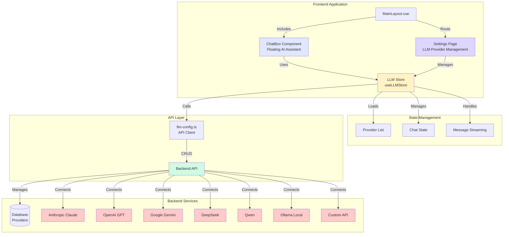
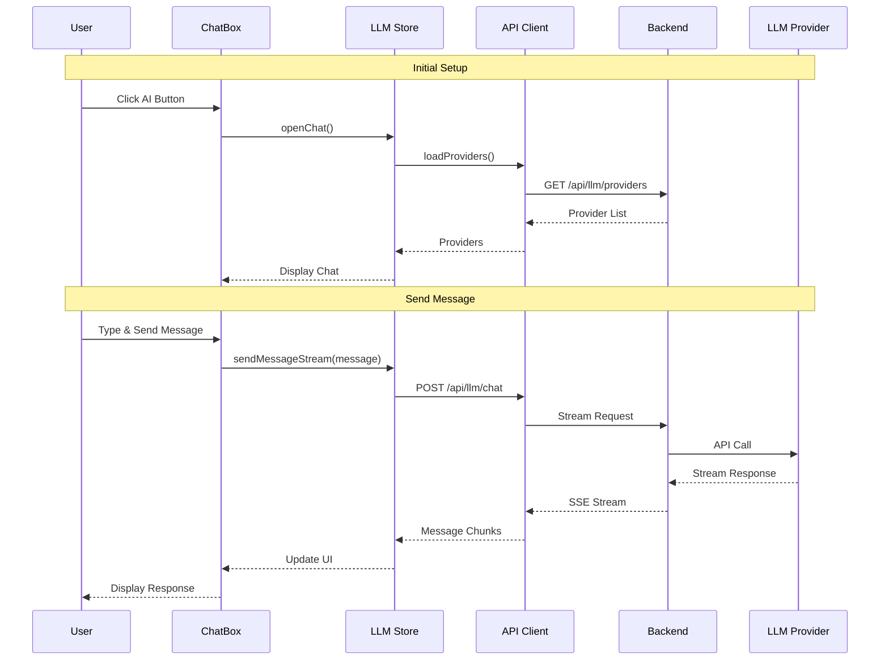
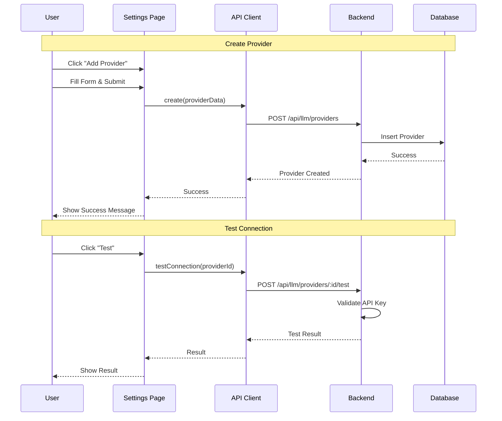
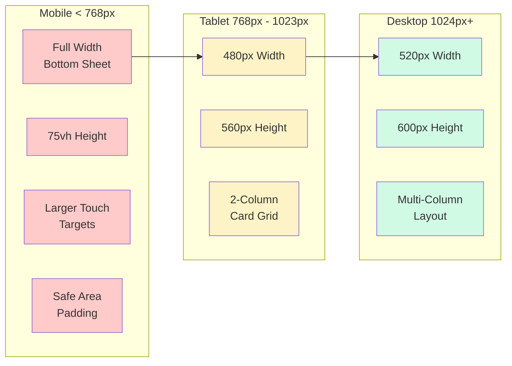
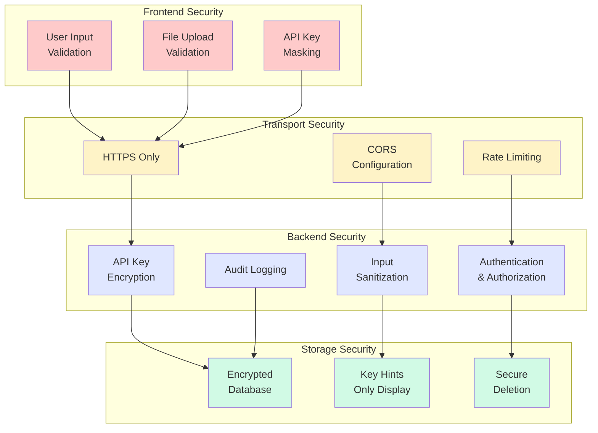
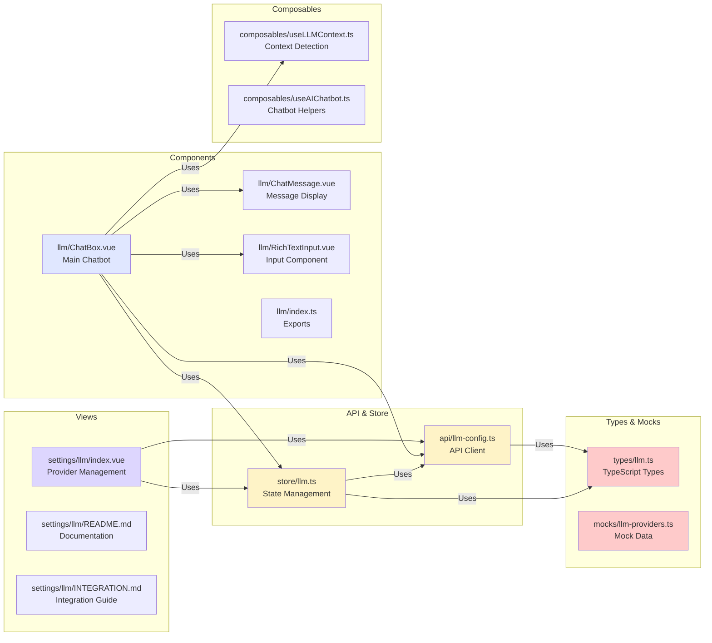

# LLM Integration Guide

## Overview

The LLM (BYOLLM - Bring Your Own LLM) feature is fully integrated into TelemetryFlow Platform with two main components:

1. **LLM Provider Management** - Settings page for CRUD operations on LLM providers
2. **AI Chatbot** - Global floating chatbot that uses configured providers

## Architecture



## Components

### Component Interaction Flow



### Provider Management Flow



### 1. LLM Provider Management (`/settings/ai-assistant`)

**Location:** `frontend/src/views/settings/llm/index.vue`

**Features:**

- Create, Read, Update, Delete LLM providers
- Support for 7 provider types:
  - Anthropic Claude
  - OpenAI GPT
  - Google Gemini
  - DeepSeek
  - Qwen (Alibaba)
  - Ollama (Local)
  - Custom (OpenAI-compatible)
- Set default provider
- Test API connection
- Enable/disable providers
- Search and filter
- Card-based design (similar to notification channels)

**Configuration Options:**

- Display Name
- Model ID
- API Key (encrypted)
- API Endpoint (optional)
- Max Tokens
- Temperature (0-2)
- Top P (0-1)

### 2. AI Chatbot Component

**Location:** `frontend/src/components/llm/ChatBox.vue`

**Features:**

- Floating button (bottom-right)
- Multi-tab conversations
- File attachments (images, documents)
- Markdown support
- Streaming responses
- Context-aware suggestions
- Fullscreen mode
- Minimize/maximize
- Provider selection dropdown
- Responsive design (mobile-friendly)

**Integration:**

- Automatically loads providers from settings
- Uses default provider for conversations
- Can switch providers on-the-fly
- Persists conversation history per tab

## API Integration

### Backend Endpoints

```typescript
// Provider Management
GET    /api/llm/providers           // List all providers
POST   /api/llm/providers           // Create provider
GET    /api/llm/providers/:id       // Get provider details
PATCH  /api/llm/providers/:id       // Update provider
DELETE /api/llm/providers/:id       // Delete provider
POST   /api/llm/providers/:id/set-default  // Set as default
POST   /api/llm/providers/:id/test  // Test connection

// Chat
POST   /api/llm/chat                // Send message (streaming)
```

### API Client

**Location:** `frontend/src/api/llm-config.ts`

```typescript
import { llmConfigApi } from "@/api/llm-config";

// List providers
const { data } = await llmConfigApi.list();

// Create provider
await llmConfigApi.create({
  name: "my-provider",
  displayName: "My Claude Provider",
  provider: "anthropic",
  modelId: "claude-sonnet-4-20250514",
  apiKey: "sk-...",
  enabled: true,
  isDefault: true,
});

// Test connection
const result = await llmConfigApi.testConnection(providerId);
```

## Store Integration

**Location:** `frontend/src/store/llm.ts`

The LLM store manages:

- Provider list and default provider
- Chat state (open/minimized)
- Multi-tab conversations
- Message streaming
- Context detection

```typescript
import { useLLMStore } from "@/store/llm";

const llmStore = useLLMStore();

// Open chatbot
llmStore.openChat();

// Send message
llmStore.sendMessageStream("Analyze recent errors");

// Load providers
await llmStore.loadProviders();
```

## Usage Examples

### 1. Access Settings

Navigate to: **Settings > AI Assistant** (`/settings/ai-assistant`)

### 2. Configure Provider

1. Click "Add Provider"
2. Select provider type (e.g., Anthropic Claude)
3. Enter display name and model ID
4. Add API key
5. Configure parameters (temperature, max tokens)
6. Enable and set as default
7. Test connection

### 3. Use Chatbot

1. Click floating AI button (bottom-right)
2. Select provider from dropdown (if multiple)
3. Type question or use quick suggestions
4. Attach files if needed (optional)
5. Send message

### 4. Multi-Tab Conversations

1. Click "+" button in tab bar
2. Switch between tabs
3. Close tabs with "×" button
4. Each tab maintains separate conversation

## Responsive Design

### Responsive Breakpoints Diagram



### Desktop (1024px+)

- Chatbot: 520px × 600px
- Settings: Full width with card grid

### Tablet (768px - 1023px)

- Chatbot: 480px × 560px
- Settings: 2-column card grid

### Mobile (< 768px)

- Chatbot: Full width bottom sheet (75vh)
- Settings: Single column
- Larger touch targets
- Safe area padding for notched phones

## Security

### Security Flow Diagram



### Security Features

- API keys are encrypted before storage
- Keys are never displayed in full (only hints)
- HTTPS required for API endpoints
- Rate limiting on chat endpoints
- File upload validation and size limits

## Mock Data

**Location:** `frontend/src/mocks/llm-providers.ts`

Mock providers for development/testing:

- Anthropic Claude (default)
- OpenAI GPT-4o
- Google Gemini Flash
- DeepSeek Chat
- Qwen Max
- Ollama (local)

## Troubleshooting

### Chatbot not appearing

- Check MainLayout.vue includes `<ChatBox />`
- Verify LLM store is initialized
- Check browser console for errors

### No providers available

- Navigate to Settings > AI Assistant
- Add at least one provider
- Set one as default
- Enable the provider

### Connection test fails

- Verify API key is correct
- Check API endpoint URL
- Ensure network connectivity
- Check backend logs

### Streaming not working

- Verify backend supports SSE (Server-Sent Events)
- Check CORS configuration
- Ensure provider API supports streaming

## Future Enhancements

- [ ] Voice input/output
- [ ] Code syntax highlighting in responses
- [ ] Export conversation history
- [ ] Custom system prompts per context
- [ ] Provider usage analytics
- [ ] Cost tracking per provider
- [ ] Conversation search
- [ ] Shared conversations (team feature)

## Related Files

### File Structure Diagram



### Detailed File List

```
frontend/src/
├── views/settings/llm/
│   ├── index.vue              # Provider management UI
│   ├── README.md              # Feature documentation
│   └── INTEGRATION.md         # This file
├── components/llm/
│   ├── ChatBox.vue            # Main chatbot component
│   ├── ChatMessage.vue        # Message display
│   ├── RichTextInput.vue      # Input with markdown
│   └── index.ts               # Component exports
├── api/
│   └── llm-config.ts          # API client
├── store/
│   └── llm.ts                 # State management
├── composables/
│   ├── useLLMContext.ts       # Context detection
│   └── useAIChatbot.ts        # Chatbot helpers
├── mocks/
│   └── llm-providers.ts       # Mock data
└── types/
    └── llm.ts                 # TypeScript types
```

## Support

For issues or questions:

1. Check this documentation
2. Review backend API documentation
3. Check browser console for errors
4. Review backend logs
5. Contact development team
